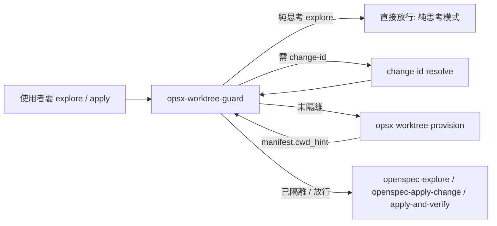

# opsx-worktree-guard

依 [docs/agent-tooling/opsx-worktree-provision.md](../../../docs/agent-tooling/opsx-worktree-provision.md) 與 [AGENTS.md](../../../AGENTS.md) / [CLAUDE.md](../../../CLAUDE.md) §Git 與本機 agent 產物：

> OpenSpec change 不得直接在 `main` 上開發。

本技能是 explore / apply 進入點前面的**薄守門層**。它**不重做** provisioning：偵測「該不該隔離」「是否已隔離」，沒隔離就**委派 [opsx-worktree-provision](../opsx-worktree-provision/SKILL.md)**，完成後才放行真正的 explore / apply。

## 定位

```txt
本技能          = 入口守門（要不要隔離 / 是否已隔離 / 委派誰）
opsx-worktree-provision = 真正建立 worktree、copy .env、輸出 manifest（不在此重寫）
change-id-resolve       = 解析 change-id / branch_plan（需要時委派）
apply-and-verify        = 隔離後的實作與驗證（放行後接手）
```

scope 政策（已與使用者確認）：copy 範圍只有「已提交程式碼（`git worktree add` 自帶）+ `.env`（provision 負責）」。**本守門層不複製任何額外資料、不碰 venv / storage fixture。**

## 觸發前提

使用者要進行下列任一，且尚未經本守門層放行：

- `/openspec-explore`、`/opsx:explore`
- `/openspec-apply-change`、`/opsx:apply`、`/apply-and-verify`
- 自然語句：「開始 / 繼續一個 OpenSpec change」「探索 / 實作某個 change」「跑 tasks」

若由 [closed-loop-orchestrator](../closed-loop-orchestrator/SKILL.md) 驅動：Phase A 已 provision，本守門層在 Step 3 會偵測到「已隔離」直接放行，**不重複 provision，不與 orchestrator 衝突**。

## 五步流程

### Step 1：意圖分類

| 意圖 | 是否需要 worktree |
|---|---|
| `apply` / 實作 / 跑 tasks | **一律需要**（必有 change-id） |
| `explore` 且已指定 change-id，或將建立 / 修改 `openspec/changes/<id>/` 任何 artifact | **需要** |
| `explore` 純思考：無 change-id、只讀 code / 畫圖 / 討論、不寫任何 artifact | **不需要** → 直接放行（見 Step 5b） |

> explore 的純思考階段不該被強迫進 worktree（避免騷擾）。但**一旦要把想法落地成 `openspec/changes/<id>/` 檔案，必須重新回到本守門層**。

### Step 2：解析 change-id

- 參數 / 對話上下文已明確 → 直接用。
- `apply` 但 change-id 不明 → 委派 [change-id-resolve](../change-id-resolve/SKILL.md)，取得 `{ change_id, branch_plan, blockers }`。
  - `blockers` 非空 → STOP，原樣回報，**不放行**。
- `explore` 要新建 change → 用使用者提出的 change-id；`branch_plan = new`。

### Step 3：位置檢查

```
git rev-parse --show-toplevel
git rev-parse --git-common-dir
git worktree list --porcelain
```

判定（`<repo_root>` = main worktree top-level）：

| 當前 top-level | 判定 | 動作 |
|---|---|---|
| `<repo_root>/.worktrees/<change-id>`（與目標 change-id 相符） | 已隔離 | → Step 5a 放行 |
| `<repo_root>`（main worktree） | 未隔離 | → Step 4 委派 provision |
| `<repo_root>/.worktrees/<其他-change-id>` | 走錯 worktree | **STOP** `wrong-worktree`，回報目前 / 目標 change-id，等使用者決定（**不**自動跨 change 切換） |

### Step 4：委派 provisioning（不重寫）

呼叫 [opsx-worktree-provision](../opsx-worktree-provision/SKILL.md)，輸入 `{ change_id, branch_plan }`，取得 manifest。

**硬性 Gate**：provision 回報任一 `cwd-not-main` / `main-dirty` / `branch-bound-elsewhere` / `worktree-dirty` → 本守門層同步 **STOP**，原樣轉述 reason，**不放行 explore / apply、不嘗試自動修復**。

成功則記下 `manifest.cwd_hint`。

### Step 5：放行與交棒

#### 5a：需要隔離且已就緒

宣告後交棒給真正的 explore / apply 技能：

```yaml
guard: pass
change_id: <id>
worktree_path: <manifest.cwd_hint 或既有隔離路徑>
branch: codex/openspec/<id>
rule: 後續所有 explore / apply 的 edit / git / test 走 cwd_hint，main worktree 唯讀
next: <openspec-explore | openspec-apply-change | apply-and-verify>
```

#### 5b：純思考 explore，免隔離

```yaml
guard: pass-through
mode: explore-thinking
note: 純思考、未涉及具體 change，無需 worktree 隔離；一旦要寫入 openspec/changes/<id>/ 任何 artifact，須重新回到 opsx-worktree-guard
```

## 安全條款

- 本守門層**不**實作產品程式碼、**不**改 provisioning 規則、**不**複製任何額外資料（scope 已定：code + `.env`）。
- 任一 Gate（`wrong-worktree` 或 provision 的四個 Gate）觸發 → STOP，原樣回報，不放行、不自動修復。
- `continue-existing` 不在此自動 `pull --rebase`；沿用 [opsx-worktree-provision](../opsx-worktree-provision/SKILL.md) 的保守政策，由使用者決定。
- 不自動清理 worktree；cleanup 由 [apply-and-verify](../apply-and-verify/SKILL.md) / archive 流程在結尾印 `cleanup_hint`，使用者人工執行。
- 規則調整以 [docs/agent-tooling/opsx-worktree-provision.md](../../../docs/agent-tooling/opsx-worktree-provision.md) 為 source of truth：先改該文件，再改本技能與 provision。
- `.claude` 與 `.codex` 兩份內容鏡像一致（依設計文件 §10）。

## 與既有技能的關係



## 參考

- [docs/agent-tooling/opsx-worktree-provision.md](../../../docs/agent-tooling/opsx-worktree-provision.md)：worktree 行為 source of truth
- [AGENTS.md](../../../AGENTS.md)：repo 邊界與 source-of-truth 順序
- [CLAUDE.md](../../../CLAUDE.md) §Git 與本機 agent 產物：branch / PR / 不在 main 開發政策
- [opsx-worktree-provision](../opsx-worktree-provision/SKILL.md)：被委派的 provisioning 技能
- [change-id-resolve](../change-id-resolve/SKILL.md)：上游 change-id 解析
- [apply-and-verify](../apply-and-verify/SKILL.md)：放行後的實作與驗證
- [closed-loop-orchestrator](../closed-loop-orchestrator/SKILL.md)：完整閉環（Phase A 已含 provision）
