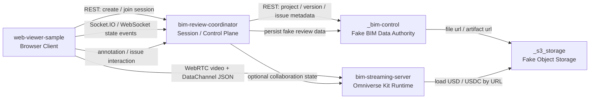
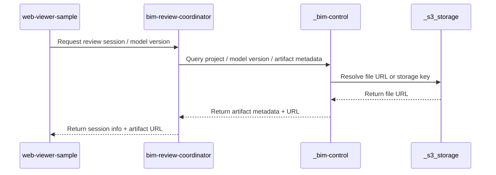
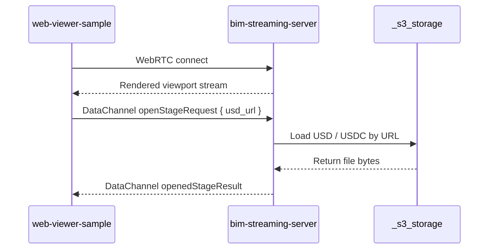
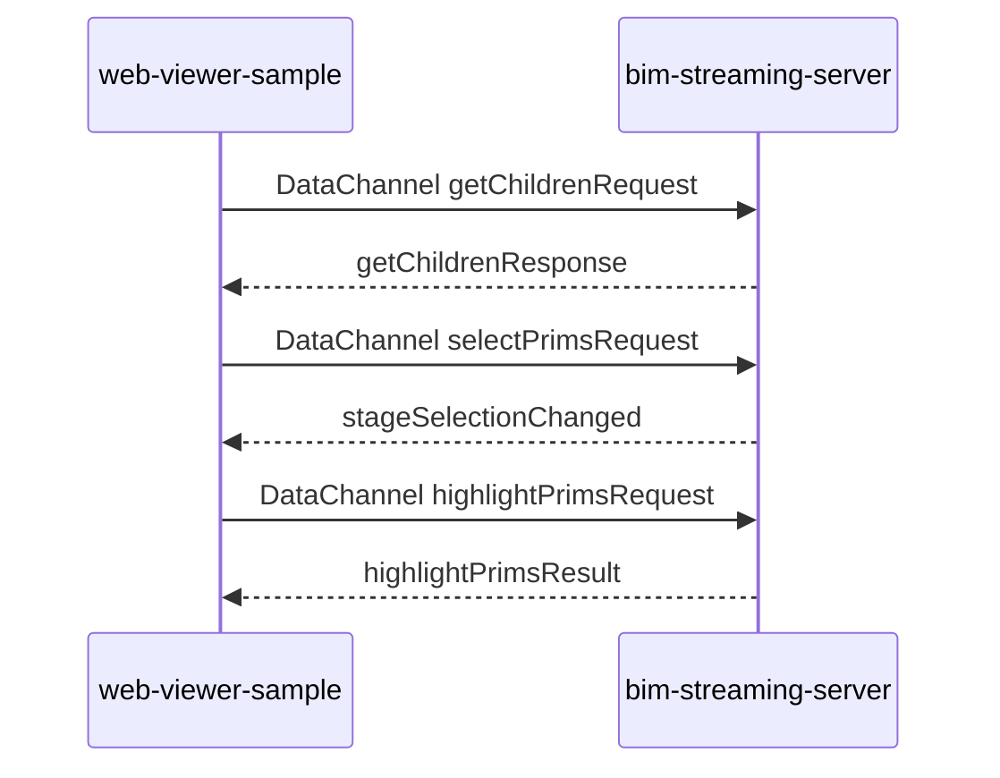
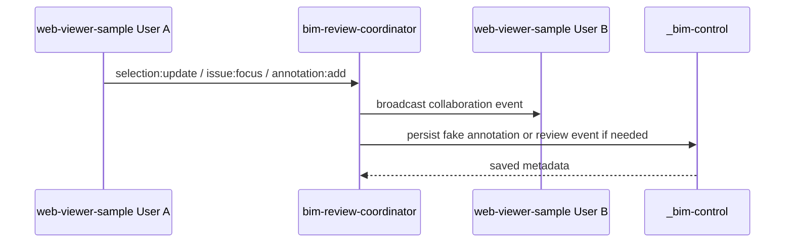
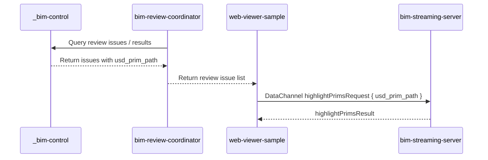

# AGENTS.md

## 0. 文件目的

本文件定義 `AI-BIM-governance/` workspace 內 **五大核心 repo / folder** 的責任邊界、互動方式與資料流動方式。

本文件只描述：

```txt
1. repo 邊界
2. repo 互動方式
3. 資料流動方向
4. 哪些資料由誰負責
5. 哪些事情不應跨 repo 混用
```

本文件不描述每個 repo 未來要新增哪些功能，也不作為功能開發清單。

---

## 1. Workspace 範圍

主要開發資料夾：

```txt
AI-BIM-governance/
```

五大核心 repo / folder：

```txt
AI-BIM-governance/
├── bim-review-coordinator/      # 控制中心，localhost:8100
├── _conversion-service/         # 轉檔 API，localhost:8003
├── bim-streaming-server/        # Kit streaming server，WebRTC 49100
├── _bim-control/                # fake artifact / model API，localhost:8001
├── _s3_storage/                 # fake storage，localhost:8002
└── web-viewer-sample/           # browser client，localhost:5173```

flowchart TD
  CO[bim-review-coordinator<br/>Control Plane]

  CS[_conversion-service<br/>Conversion Worker API]
  KIT[bim-streaming-server<br/>Omniverse Kit Runtime]
  BC[_bim-control<br/>Fake BIM Data Authority]
  S3[_s3_storage<br/>Fake Object Storage]
  WV[web-viewer-sample<br/>Browser Client]

  CO -->|REST: create conversion job| CS
  CO -->|REST: query artifact/model data| BC
  CO -->|REST: query file URLs| S3
  CO -->|start / check / reference process| KIT
  WV -->|REST: create/join session| CO
  WV -->|WebRTC + DataChannel| KIT
  CS -->|read original IFC| S3
  CS -->|write USDC + mapping| S3
  CS -->|update artifact status| BC

其中：

```txt
bim-review-coordinator/
bim-streaming-server/
web-viewer-sample/
```

是正式架構中的三個核心互動 repo。

```txt
_bim-control/
_s3_storage/
```

是本地開發用 mock / fake infrastructure，用來模擬正式產品中的 BIM 主平台與物件儲存。

---

## 2. 五大 repo 的定位總覽



一句話定位：

```txt
_bim-control            = 假資料權威
_s3_storage            = 假檔案倉庫
bim-review-coordinator = Session / 協作控制中心
bim-streaming-server   = Omniverse GPU / USD / WebRTC Runtime
web-viewer-sample      = Browser 操作端與串流觀看端
```

---

## 3. Repo 邊界

## 3.1 `_bim-control/`

### 角色

```txt
Fake BIM Platform / Fake Data Authority
```

### 邊界

`_bim-control` 只代表本地開發中的假 BIM 主平台資料層。

它負責提供或保存：

```txt
- project metadata
- model version metadata
- model artifact metadata
- issue metadata
- annotation metadata
- element mapping metadata
- review result metadata
```

它不負責：

```txt
- 真實 Revit plugin
- 真實 SSO / 權限系統
- Omniverse rendering
- WebRTC streaming
- GPU instance lifecycle
- 實際大型檔案 byte storage
- USD stage 操作
```

### 資料邊界

`_bim-control` 保存的是「資料描述」與「關聯關係」，不是 GPU runtime，也不是真實物件儲存。

例如：

```txt
model_version_id
artifact_id
artifact_format
file_url
usd_url
issue_id
annotation_id
ifc_guid
usd_prim_path
```

---

## 3.2 `_s3_storage/`

### 角色

```txt
Fake Object Storage / Local File Storage
```

### 邊界

`_s3_storage` 只代表本地開發中的假物件儲存服務。

它負責保存與提供：

```txt
- IFC / RVT / DWG 原始檔
- USD / USDC 衍生檔
- element_mapping.json
- fake review result JSON
- fake report / snapshot / attachment files
```

它不負責：

```txt
- 專案邏輯
- 使用者權限
- session 管理
- annotation 業務語意
- Omniverse rendering
- WebRTC streaming
- 法規 / 碳排 / AI 判斷
```

### 資料邊界

`_s3_storage` 保存的是「檔案本體」。

`_bim-control` 保存的是「這個檔案屬於哪個 project / model version / artifact」。

兩者不可混淆。

---

## 3.3 `bim-review-coordinator/`

### 角色

```txt
Session Control Plane / Collaboration Coordinator
```

### 邊界

`bim-review-coordinator` 是 review session 的協調中心。

它負責協調：

```txt
- review session 狀態
- browser client 與 Kit streaming server 的連線資訊
- user presence / collaboration state
- selection / annotation / issue focus 等協作事件
- fake BIM platform 與 fake storage 的資料查詢路由
```

它不負責：

```txt
- USD stage loading
- Omniverse viewport rendering
- WebRTC video encoding
- IFC / USD 檔案內容轉換
- 直接保存大型檔案
- 取代 _bim-control 成為資料權威
- 取代 web-viewer-sample 成為 UI
```

### 控制邊界

`bim-review-coordinator` 可以知道：

```txt
session_id
user_id
model_version_id
kit_instance_id
stream_config
presence state
collaboration event
```

但不應該知道或操作：

```txt
USD internal prim tree implementation
Omniverse material / camera / renderer internal details
large binary file bytes
```

---

## 3.4 `bim-streaming-server/`

### 角色

```txt
Omniverse Kit Runtime / GPU Streaming Server
```

### 邊界

`bim-streaming-server` 是 Omniverse Kit runtime。

它負責處理：

```txt
- USD / USDC stage runtime
- Omniverse Kit viewport
- GPU rendering
- WebRTC video stream
- WebRTC DataChannel JSON command
- stage tree / prim selection / camera / visual overlay 的 runtime 操作
```

它不負責：

```txt
- project / model version 的資料權威
- 使用者登入與權限
- review session lifecycle 的總控
- 多人協作事件的中心廣播
- 長期 annotation / issue 儲存
- 假 S3 檔案倉庫
- 假 BIM API
```

### Runtime 邊界

`bim-streaming-server` 只處理「目前這個 stream session 中的 3D runtime 狀態」。

它可以處理：

```txt
目前開啟哪個 USD / USDC
目前選取哪個 prim
目前 viewport camera 狀態
目前套用哪些 visual overlay
```

但這些狀態若要成為正式審查資料，必須回寫到 `_bim-control` 或正式資料權威。

---

## 3.5 `web-viewer-sample/`

### 角色

```txt
Browser Client / WebRTC Viewer / User Interaction Layer
```

### 邊界

`web-viewer-sample` 是瀏覽器操作端。

它負責：

```txt
- 顯示 WebRTC 串流畫面
- 送出 DataChannel JSON command 給 bim-streaming-server
- 接收 bim-streaming-server 回傳的 scene state / command result
- 與 bim-review-coordinator 交換 session / collaboration state
- 顯示 project / issue / annotation / stage tree 等 UI 狀態
```

它不負責：

```txt
- 啟動或停止 Kit server
- 分配 GPU
- 保存專案資料
- 保存大型模型檔案
- 執行 IFC / USD 轉檔
- 執行法規 / 碳排 / AI 判斷
- 取代 coordinator 管理 session
```

### Client 邊界

`web-viewer-sample` 是使用者對整個系統的操作入口，但不是資料權威，也不是 GPU runtime。

它可以送出操作意圖，例如：

```txt
open stage
select prim
highlight issue
add annotation
focus issue
join session
leave session
```

但操作結果應該由對應 repo 處理：

```txt
3D runtime 操作 → bim-streaming-server
session / collaboration → bim-review-coordinator
metadata / review data → _bim-control
file access → _s3_storage
```

---

## 4. 資料類型與歸屬

| 資料類型 | 權威 repo / folder | 說明 |
|---|---|---|
| Project metadata | `_bim-control` | 假專案資料 |
| Model version metadata | `_bim-control` | 假模型版本資料 |
| Artifact metadata | `_bim-control` | 描述檔案格式、URL、版本關係 |
| IFC / RVT / DWG file | `_s3_storage` | 原始模型檔案本體 |
| USD / USDC file | `_s3_storage` | Omniverse runtime 載入的衍生檔 |
| element_mapping.json | `_s3_storage` + `_bim-control` | 檔案在 storage，關聯 metadata 在 `_bim-control` |
| Review issue metadata | `_bim-control` | 假審查問題與定位資料 |
| Annotation metadata | `_bim-control` | 假標註與審查紀錄 |
| Review session state | `bim-review-coordinator` | 當前 session 狀態 |
| Collaboration state | `bim-review-coordinator` | presence / selection / issue focus / annotation event |
| USD stage runtime state | `bim-streaming-server` | 當前 Omniverse scene runtime 狀態 |
| Browser UI state | `web-viewer-sample` | 當前前端 UI 狀態 |

---

## 5. 核心資料流

## 5.1 Artifact Discovery Flow



### 邊界說明

```txt
web-viewer-sample 不直接決定模型資料權威。
bim-review-coordinator 負責協調查詢。
_bim-control 決定哪個 artifact 屬於哪個 model version。
_s3_storage 只提供檔案 URL。
```

---

## 5.2 Streaming Flow



### 邊界說明

```txt
WebRTC video stream 只存在於 web-viewer-sample 與 bim-streaming-server 之間。
USD / USDC 檔案本體由 _s3_storage 提供。
bim-streaming-server 只載入與渲染，不成為檔案權威。
```

---

## 5.3 Scene Interaction Flow



### 邊界說明

```txt
Scene interaction 是 browser client 與 Kit runtime 之間的 DataChannel JSON 流程。
這些 runtime interaction 不等於正式資料保存。
若要保存成審查紀錄，必須經 coordinator / _bim-control 回寫。
```

---

## 5.4 Collaboration Flow



### 邊界說明

```txt
多人協作事件由 bim-review-coordinator 作為中心。
web-viewer-sample 發出使用者互動事件。
_bim-control 只保存需要成為審查資料的 metadata。
bim-streaming-server 不作為多人協作事件中心。
```

---

## 5.5 Review Result Visualization Flow



### 邊界說明

```txt
Review issue metadata 由 _bim-control 提供。
Issue 的 3D 視覺化由 bim-streaming-server 處理。
web-viewer-sample 只是把使用者操作轉成 DataChannel command。
bim-review-coordinator 負責把 session 與 review metadata 串起來。
```

---

## 6. 通訊方式邊界

| 通訊方式 | 起點 | 終點 | 用途 |
|---|---|---|---|
| REST | `web-viewer-sample` | `bim-review-coordinator` | 建立 session、查詢 session、取得 stream config |
| REST | `bim-review-coordinator` | `_bim-control` | 查詢 project / version / artifact / issue / annotation metadata |
| REST / Static file | `_bim-control` 或 `bim-streaming-server` | `_s3_storage` | 取得檔案 URL 或下載檔案 |
| WebRTC video | `bim-streaming-server` | `web-viewer-sample` | 串流 Omniverse viewport 畫面 |
| WebRTC DataChannel JSON | `web-viewer-sample` | `bim-streaming-server` | open stage、selection、highlight、scene query |
| WebSocket / Socket.IO | `web-viewer-sample` | `bim-review-coordinator` | presence、selection、annotation、issue focus 等多人事件 |
| Optional WebSocket | `bim-streaming-server` | `bim-review-coordinator` | Kit runtime 接收多人狀態 overlay，不作為主要資料權威 |

---

## 7. Source of Truth 原則

## 7.1 BIM 原始資料

```txt
IFC / RVT / DWG = 原始模型資料
```

其檔案本體屬於：

```txt
_s3_storage
```

其版本與專案關聯屬於：

```txt
_bim-control
```

---

## 7.2 Omniverse Runtime 資料

```txt
USD / USDC = rendering / streaming artifact
```

其檔案本體屬於：

```txt
_s3_storage
```

其 runtime 操作屬於：

```txt
bim-streaming-server
```

---

## 7.3 Mapping 資料

```txt
IFC GUID ↔ USD Prim Path
```

這是 BIM 語意資料與 Omniverse 視覺化資料之間的橋。

```txt
mapping file body      → _s3_storage
mapping metadata       → _bim-control
mapping runtime usage  → web-viewer-sample / bim-streaming-server
```

---

## 7.4 Review 資料

```txt
issue / annotation / review result
```

其資料權威是：

```txt
_bim-control
```

其多人事件流由：

```txt
bim-review-coordinator
```

其 3D runtime 顯示由：

```txt
bim-streaming-server
```

其使用者操作入口由：

```txt
web-viewer-sample
```

---

## 8. 禁止跨界規則

## 8.1 `web-viewer-sample` 不應做的事

```txt
- 不啟動 Kit server
- 不分配 GPU
- 不保存 project / model / issue 的資料權威
- 不保存大型模型檔案
- 不執行 IFC / USD 轉檔
```

## 8.2 `bim-streaming-server` 不應做的事

```txt
- 不管理使用者登入
- 不管理 project / model version
- 不作為 annotation / issue 長期資料庫
- 不作為多人協作事件中心
- 不取代 _bim-control
- 不取代 _s3_storage
```

## 8.3 `bim-review-coordinator` 不應做的事

```txt
- 不渲染 3D
- 不開啟 USD stage
- 不處理 Omniverse renderer internal state
- 不保存大型模型檔案
- 不取代 _bim-control 成為資料權威
- 不取代 web-viewer-sample 成為 UI
```

## 8.4 `_bim-control` 不應做的事

```txt
- 不做 Omniverse rendering
- 不做 WebRTC streaming
- 不做 GPU runtime 管理
- 不直接操作 USD stage
- 不保存大型 binary file body
```

## 8.5 `_s3_storage` 不應做的事

```txt
- 不保存 project business logic
- 不管理 session
- 不管理 annotation 語意
- 不執行 3D runtime 操作
- 不廣播多人事件
```

---

## 9. Optional Mock Services 說明

`AI-BIM-governance/` 之後可以存在其他 mock folders，例如：

```txt
_conversion-service/
_ai-rule-carbon-service/
_mock-auth/
_mock-sensor-service/
```

這些不屬於本文件定義的五大核心 repo。

若它們存在，邊界原則如下：

```txt
- 它們只提供假資料、假結果或本地測試用資料處理。
- 它們不應越過 _bim-control 成為正式資料權威。
- 它們不應越過 bim-streaming-server 直接控制 Omniverse viewport。
- 它們不應越過 bim-review-coordinator 管理 session / collaboration。
- 它們不應越過 web-viewer-sample 成為 browser UI。
```

---

## 10. Workspace 最重要閉環

整個 workspace 要保護的最小閉環是：

```txt
_bim-control 提供 model / issue metadata
→ _s3_storage 提供 USD / USDC 檔案 URL
→ bim-review-coordinator 建立 review session
→ web-viewer-sample 取得 session / stream config
→ web-viewer-sample 連到 bim-streaming-server
→ bim-streaming-server 載入 USD / USDC
→ web-viewer-sample 顯示 stream 畫面
→ 使用者點選 issue / prim
→ web-viewer-sample 送 DataChannel command
→ bim-streaming-server 執行 3D highlight / selection
→ web-viewer-sample 送 annotation / collaboration event
→ bim-review-coordinator 廣播 / 回寫
→ _bim-control 保存 fake review metadata
```

任何修改都不應破壞這條閉環。

---

## 11. 總結

本 workspace 的核心分工是：

```txt
_bim-control
= 假 BIM 資料權威

_s3_storage
= 假檔案與物件儲存

bim-review-coordinator
= Session / collaboration control plane

bim-streaming-server
= Omniverse Kit runtime / WebRTC streaming / USD scene runtime

web-viewer-sample
= Browser client / user interaction layer
```

所有跨 repo 互動都必須遵守：

```txt
資料權威歸資料層
檔案本體歸 storage
session 歸 coordinator
3D runtime 歸 streaming server
使用者操作歸 web viewer
```
