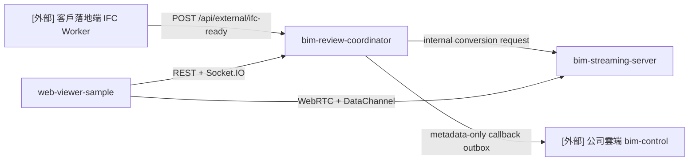

# AGENTS.md

## 0. 文件目的

本文件是 `AI-BIM-governance/` workspace 的 **agent 入口** — 定義 agent 行為對齊與 repo 邊界的 source of truth。為了控制每次 session 啟動的 context 預算，細節已 lazy-load 到 `docs/agents/*.md` sub-files（見下方 index）。

衝突解析優先序：使用者最新明確指令 > 本文件（AGENTS.md） > `CLAUDE.md` > installed skills / Graphify wiki / generated skills。`docs/agents/*.md` sub-files 是本文件的 lazy-load 細節，不另成優先序層級。

---

## 0.1 Agent 工作方式

### Karpathy-style 工作守則

- 非平凡任務先列出假設、成功標準、最小改動面；若需求或 repo 邊界不清楚，先釐清再實作。
- 優先採用能解決當前問題的最簡單方案；不要新增未要求的抽象、設定層、擴充點或 production dependency。
- 只修改與任務直接相關的檔案與程式碼；不要順手重構、格式化、刪除註解或清理不理解的既有內容。
- 每個實作切片都要能被驗證；完成時回報改動檔案、驗證指令、未跑測試原因與已知風險。

### 產品定位與完成標準

- `https://bim-docs.jackshappybot.com/` 分頁「05 BIM治理與模型檢核」中的 A1–A10 是本 repo 的 10 大主要開發項目；分頁「06 操作介面總覽」是使用者操作介面、按鈕、進度與可驗收流程的 UX 參考。
- 凡是 user-facing capability，不得以「後端 / API / 測試完成」宣告 done。完成標準必須是：使用者可從前端 route 操作，點明確按鈕，使用預設 fixture，看到 loading / success / failure / retry 與關鍵 runtime ID，並有 Playwright / Chrome E2E 截圖或 trace 證據。
- 最終回報 user-facing work 時必須列出：Frontend URL、Buttons tested、Test fixture used、Expected visible result、E2E command、Screenshot / evidence path、Known limitations。
- 真實 IFC semantic viewer E2E 的核心輸入為主工作區 local `storage/` 內 IFC；new worktree 不會自動帶這些 ignored/local artifact，測試應讀主工作區絕對路徑或用 gitignored junction/symlink，不得把 IFC 或大型 `model.usdc` commit 進 repo。
- 不得宣告 full-system E2E complete，除非同時具備 governance CPU semantic E2E 與 Kit WebRTC visual/runtime E2E 證據。
- 當使用者要求「請測試部署區重建」或同義口令時，agent MUST 執行 `.\scripts\dev\rebuild-test-deploy.ps1 -Build`；該 helper 會用 freshly fetched `origin/main` 重建 deployment checkout `D:\Users\deploy\AI-bim-geo`、排除 agent/tooling 檔案，並從部署區執行 `.\scripts\deploy.ps1 -Build`。禁止使用 `-DryRun`、禁止使用 stale `origin/main`、禁止改用當前 worktree 或 sub-repo 啟動命令。
- 已授權：若 `deploy.ps1 -Build` 的 Phase 3 被外部 host-native runtime blocker（如 `kit.exe` / conversion `python.exe` 佔用 49100/49101 或 spectator ports）阻擋，agent 可停止該 blocking PID、記錄 port / PID / process name，並重跑同一條 `-Build`；不得改用 `-Force` / `-DryRun` 或停止無關非 runtime process。

完整 A1–A10 對應、frontend operability rule、真實 IFC E2E evidence contract 與 script contract 見 `docs/agents/product-operability-and-script-contract.md`。

### Secrets / `.env` 存取

- 允許：讀取 `.env`、讀寫 `.env.example`、由 `.env.example` 複製出 `.env`。
- 不允許：修改既有 `.env` 的實際機密值。
- 此 carve-out 僅覆蓋全域「不得修改環境檔」規則中關於本 repo `.env.example` 讀寫、`.env` 讀取與複製的部分；其餘 secrets / credentials / private keys 規則不變。

### 開發管線（四套工具：主流程 + 輔助，不平權混用）

四套工具各有單一職責，組成一條固定管線；**不得平權混用、不得互相取代**：

```txt
設計規格 / prototype
  → Superpowers 拆 plan
  → GitNexus 影響分析（impact）
  → 實作
  → gstack UI / E2E / screenshot 驗收
  → GitNexus detect_changes
  → branch → PR → Actions → merge
```

| 工具 | 唯一職責（單線，不可越界） |
|---|---|
| **Superpowers** | 主線 plan / execution governance：`writing-plans` 拆分期 plan → `subagent-driven-development` 執行 → `verification-before-completion` done-gate |
| **GitNexus** | code intelligence：改 symbol 前 `impact`（HIGH / CRITICAL 先回報）、commit 前 `detect_changes` 驗 scope |
| **gstack** | browser QA / screenshot / E2E evidence：user-facing 完成的**唯一驗收證據來源** |
| **Matt Pocock skills** | 僅 optional 輔助：issue / triage / domain-doc；**不得當主線** |

禁止（anti-patterns）：

- ❌ 用 Matt Pocock skills 取代 Superpowers plan。
- ❌ 用 Superpowers 宣告 UI 完成而不跑 gstack。
- ❌ 用 GitNexus 當產品設計依據（設計來自 spec / prototype，非 call graph）。
- ❌ 用 gstack 改 backend symbol 而跳過 GitNexus impact。

誠實鐵律（repo contract：前端要真的能操作，不能只接 mock）：某部分還沒 backend 時，UI 須誠實標 `DEMO DATA`／`NOT BUILT`／`not observed`，不得假裝 ready。完成標準與 frontend-operable rule 見上方「產品定位與完成標準」。

### 本機 agent 產物

- 不在 `main` 上開發；plan / 設計文件預設繁體中文，API 路徑 / schema 欄位 / CLI flags / status enum / log / error / 外部產品名稱保留原文。
- `.claude/`、`.codex/`、`.agents/`、`.gitnexus/` 是本機 agent/tooling 產物，預設維持 ignored（含以 `skills` CLI 裝進 `.claude/skills/` 的技能）。
- 不提交 `.claude/skills/generated/`、`.codex/skills/` 或 GitNexus generated skill 檔，除非使用者明確要求改變 repo policy。

完整 GitHub PR workflow 見 `docs/agents/github-workflow.md`。

---

## 1. Workspace 範圍（一句話）

```txt
AI-BIM-governance/
├── bim-review-coordinator/   # 唯一對外 IFC-ready intake + Session / Control Plane（:8004）
├── bim-streaming-server/     # Internal IFC→USDC authority + Kit Runtime（49100/49101）
├── governance-service/       # A1/A2/A3 governance authority（:49102 loopback）
├── web-viewer-sample/        # Browser client（:5173）
├── apps/kit-manager-web/     # Kit Manager operator UI
├── services/kit-manager-api/ # Kit Manager API（:8010）
├── scripts/                  # deploy / verify / script contract
└── tests/{contracts,fakes}/  # 外部平台 contract + test-only fakes
```


```mermaid
flowchart LR
    EDGE["[外部] 客戶落地端 IFC Worker"]
    CLOUD["[外部] 公司雲端 bim-control"]
    CO[bim-review-coordinator]
    KIT[bim-streaming-server]
    WV[web-viewer-sample]

    EDGE -->|POST /api/external/ifc-ready| CO
    CO -->|internal conversion request| KIT
    CO -->|metadata-only callback outbox| CLOUD
    WV -->|REST + Socket.IO| CO
    WV -->|WebRTC + DataChannel| KIT
```

一句話定位：

```txt
[外部] 公司雲端 bim-control = control-plane 權威（本 repo 不 mirror）
[外部] 客戶落地端 IFC Worker = 外部 IFC 產出者（本 repo 不啟動）
bim-review-coordinator = 唯一對外 IFC-ready intake + Session / 協作控制中心
bim-streaming-server   = internal-only IFC→USDC conversion + Omniverse Kit / WebRTC runtime
governance-service     = A1 rule-run / A2 diff / A3 federation / issue / BCF loopback authority
web-viewer-sample      = Browser client / user interaction layer
apps + services        = operator-facing Kit Manager UI / API
tests/fakes + tests/contracts = 外部平台 test-only doubles，非 runtime profile
_worker / _bim-control = 已自 repo 刪除（2026-05-18 B 方案落地），僅 tests/fakes 模擬
```

完整 folder schema、§1.A 架構決策、§3–§11（repo 邊界 / 資料流 / 通訊 / source of truth / 禁止跨界 / 閉環）見 `docs/agents/repo-boundary-detail.md`。

歷史 `_worker` / `_bim-control` 退役脈絡見 `docs/agents/history-and-archive.md`。

---

## 2. Sub-files（lazy-load，何時讀哪份）

| 何時需要 | 讀這份 |
|---|---|
| 跨 sub-repo 決策、改 repo boundary、查 data 權威歸屬、追資料流 | `docs/agents/repo-boundary-detail.md` |
| 查 A1–A10 產品定位、frontend-operable done、真實 IFC E2E、script/deploy contract | `docs/agents/product-operability-and-script-contract.md` |
| 開 PR / 處理 GitHub Actions / branch closeout | `docs/agents/github-workflow.md` |
| 修改 code symbol（function/class/method）、跑 impact analysis、commit 前 detect_changes | `docs/agents/gitnexus-usage.md` |
| 跑 sub-repo 驗證（pytest / npm test / build / Cloud VM 啟動） | `docs/agents/sub-repo-verify-commands.md` |
| 看舊 PR、了解退役服務與歷史 spec 脈絡 | `docs/agents/history-and-archive.md` |

新增 sub-file 時：先在 `docs/agents/` 建檔，再同步更新本表與 `CLAUDE.md` index（兩份主檔的 sub-file 集合必須一致）。本文件行數預算 ≤ 250 行（目標 ≤ 200）；CLAUDE.md ≤ 100 行（目標 ≤ 80）。預算規範見 spec `agent-doc-context-budget`。

---

## 3. AI Agent Wiki 使用規範

這些文件提供 AI agent 在陌生模組探索時的快速上下文，目的是縮短定位時間，不取代程式碼與 API contract。

Graphify Wiki（跨文件知識圖）入口為 `README.md`，用於需求探索、架構導覽、影響面初步盤點；不得作為行為正確性的唯一依據，最終以程式碼與 contracts 為準。

Source of Truth 優先順序：

```txt
1. 程式碼實作
2. contracts 文件
3. AGENTS 邊界定義（本文件 + docs/agents/*.md sub-files）
4. wiki（Graphify）
```

若發現 wiki 與實作不一致，先以實作為準，並補更新 wiki。重大流程變更（API、事件、資料流）合併前應同步更新對應 wiki 入口頁。

---

## 4. GitNexus 入口

本 repo 由 GitNexus 索引。修改 code symbol 前 MUST 跑 `gitnexus_impact`；commit 前 MUST 跑 `gitnexus_detect_changes`；HIGH / CRITICAL risk 先回報再繼續。

完整 GitNexus 使用規範（Always Do / Never Do / Resources / CLI skill 對應表）見 `docs/agents/gitnexus-usage.md`。

<!-- gitnexus:start -->
# GitNexus — Code Intelligence

This project is indexed by GitNexus as **AI-BIM-governance** (8299 symbols, 14305 relationships, 275 execution flows). Use the GitNexus MCP tools to understand code, assess impact, and navigate safely.

> If any GitNexus tool warns the index is stale, run `npx gitnexus analyze` in terminal first.

## Always Do

- **MUST run impact analysis before editing any symbol.** Before modifying a function, class, or method, run `gitnexus_impact({target: "symbolName", direction: "upstream"})` and report the blast radius (direct callers, affected processes, risk level) to the user.
- **MUST run `gitnexus_detect_changes()` before committing** to verify your changes only affect expected symbols and execution flows.
- **MUST warn the user** if impact analysis returns HIGH or CRITICAL risk before proceeding with edits.
- When exploring unfamiliar code, use `gitnexus_query({query: "concept"})` to find execution flows instead of grepping. It returns process-grouped results ranked by relevance.
- When you need full context on a specific symbol — callers, callees, which execution flows it participates in — use `gitnexus_context({name: "symbolName"})`.

## Never Do

- NEVER edit a function, class, or method without first running `gitnexus_impact` on it.
- NEVER ignore HIGH or CRITICAL risk warnings from impact analysis.
- NEVER rename symbols with find-and-replace — use `gitnexus_rename` which understands the call graph.
- NEVER commit changes without running `gitnexus_detect_changes()` to check affected scope.

## Resources

| Resource | Use for |
|----------|---------|
| `gitnexus://repo/AI-BIM-governance/context` | Codebase overview, check index freshness |
| `gitnexus://repo/AI-BIM-governance/clusters` | All functional areas |
| `gitnexus://repo/AI-BIM-governance/processes` | All execution flows |
| `gitnexus://repo/AI-BIM-governance/process/{name}` | Step-by-step execution trace |

## CLI

| Task | Read this skill file |
|------|---------------------|
| Understand architecture / "How does X work?" | `.claude/skills/gitnexus/gitnexus-exploring/SKILL.md` |
| Blast radius / "What breaks if I change X?" | `.claude/skills/gitnexus/gitnexus-impact-analysis/SKILL.md` |
| Trace bugs / "Why is X failing?" | `.claude/skills/gitnexus/gitnexus-debugging/SKILL.md` |
| Rename / extract / split / refactor | `.claude/skills/gitnexus/gitnexus-refactoring/SKILL.md` |
| Tools, resources, schema reference | `.claude/skills/gitnexus/gitnexus-guide/SKILL.md` |
| Index, status, clean, wiki CLI commands | `.claude/skills/gitnexus/gitnexus-cli/SKILL.md` |

<!-- gitnexus:end -->
