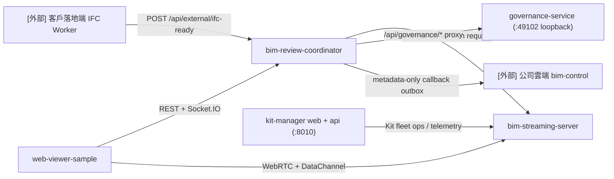

# AGENTS.md
## 0. 文件目的

本文件是 `AI-BIM-governance/` workspace 的 **agent 入口** — 定義 agent 行為對齊與 repo 邊界的 source of truth。為了控制每次 session 啟動的 context 預算，細節已 lazy-load 到 `docs/agents/*.md` sub-files（見下方 index）。

衝突解析優先序：使用者最新明確指令 > 本文件（AGENTS.md） > `CLAUDE.md` > installed skills / generated wiki / generated skills。`docs/agents/*.md` sub-files 是本文件的 lazy-load 細節，不另成優先序層級。不要把「agent 指令優先序」和「runtime/product 行為真相」混在一起；後者見 §3。

## 0.0 Lean Governance & Subtraction Directive（元治理減法方針）

為避免「元治理反噬」與流程摩擦力過大導致開發停滯，全體 Agent 一律遵守下列減法原則：
1. **廢除 3-PR Demote/Reapprove 儀式**：禁止將單一功能或 UI 變更拆成 Demote ➔ Feat ➔ Reapprove 三個 PR。所有畫面改動與 Design Baseline 更新**一律在單一 PR 內同時交付**。
2. **凍結元治理工具自我修復循環**：禁止 Agent 主動開立或遞迴開立 Fixpoint rebuild、Classifier repair、Ledger reconciliation、Watermark alignment 等純治理工具修復 PR。非阻塞之治理工具告警改為 Warning，不阻擋業務代碼交付。
3. **前端驗收以 Functional & Semantic E2E 為主**：開發迭代期著重於「按鈕可點、API 通暢、轉檔狀態正確」的 Playwright 語意與功能驗收，放寬 1% 嚴苛 Pixel Diff 的硬阻斷。
4. **Single Active Writer 原則**：同一時間只由一個主要 Coordinator Agent 負責寫入與開 PR，其他 Agent 僅擔任唯讀 Research 或局部 Debugger，根除多 Writer 爭搶 main 造成的 stale base 與 lock 衝突。

## 0.1 Agent 工作方式

### AI Coding Governance Lanes

日常任務預設走 Lane F 或 Lane B；Superpowers 與 `spec-to-done` 是 opt-in，不是一般實作主線。不得只因任務「非平凡」、文字含「完成」、或 changed path 位於 code/tests 就升級 Lane S。

| Lane | 適用範圍 | 執行與驗證 |
|---|---|---|
| **F — Fast Fix** | 單一 service、約 1–3 檔、小 bug/docs/tests/timeout/logging/error handling；不改 contract、user workflow、security/deploy/migration/Kit/WebRTC | single coordinator；無 Superpowers/spec/plan/subagent；checkout 乾淨時不強制 worktree；targeted tests；不自動 push/PR/merge；不強制 GitNexus impact |
| **B — Bounded Change** | 單一 service 內清楚且有限的功能；不改 architecture/public API/schema/security/deploy | single coordinator + 3–5 項 inline checklist；最多一個 debugger 或完成後一個 read-only reviewer；禁止 parallel writers；affected tests；對 task/主要 entry symbol 跑一次 GitNexus impact |
| **G — Governed Change** | 跨 ≥2 services、public API/event/DB schema、user-facing route/workflow、Kit/WebRTC/GPU、deploy/auth/permission/migration/destructive script、architecture boundary、GitNexus HIGH/CRITICAL | dedicated branch/worktree；簡潔 plan；GitNexus impact + detect_changes；按風險 reviewer/debugger/security_auditor；integration tests；user-facing browser E2E；PR local preflight |
| **S — Spec-to-Done** | 使用者明確輸入 `spec-to-done`、明確要求完整 Superpowers，或指定已核准 spec 並要求自主推進至 merged PR | 保留完整 P0/P1/P3/P4/P5/P6/P7；只能明確啟動，不得由模型自行升級 |

只有工作可安全平行、需要獨立風險檢查，或符合 Lane G/S 條件時才派 worker。coordinator 擁有所有寫入與最終決策；F 不派 subagent，B 禁止多個 writer 並行。多終端機／多 CLI（Claude Code、Codex、Grok）並行 session 以 gitignored `.agents/board/` 看板互相感知——所有 CLI 都明確執行開工 `node scripts/dev/agents-board.mjs register --agent <cli>`、動工前 `status`、收工 `done`；repo 不分發自動 command hooks。看板僅提供感知，不取代 Lane 隔離規則，契約見 `docs/agents/parallel-session-board.md`。

### Superpowers invocation policy

預設為 repo-native lean mode。Superpowers 重流程 skill 採 explicit-only；task complexity 不等於使用者授權，且單一 skill 不得自動串接下一階段。詳細 routing 見 `docs/agents/superpowers-invocation-policy.md`。

### Karpathy-style 工作守則

- Lane B/G/S 先列出假設、成功標準、最小改動面；若需求或 repo 邊界不清楚，先查 local source of truth，仍有重大分歧才釐清。
- 先判定 F/B/G/S；只有 G/S 或獨立風險檢查有實質價值時才 dispatch worker。最終回覆區分 verified facts / inferences / unverified risks。
- 優先採用能解決當前問題的最簡單方案；不要新增未要求的抽象、設定層、擴充點或 production dependency。
- 只修改與任務直接相關的檔案與程式碼；不要順手重構、格式化、刪除註解或清理不理解的既有內容。
- 每個實作切片都要能被驗證；完成時回報改動檔案、驗證指令、未跑測試原因與已知風險。

完整 task complexity tiers、reasoning effort routing、worker output contract、reviewer perspectives 與 evidence labels 見 `docs/agents/advanced-agent-reasoning-contract.md`。

### 產品定位與完成標準

- Repo 功能需求以 `docs/plans/docs-plans-README.md` 為唯一入口：設計與規格正本＝`docs/plans/AI-BIM 前後端設計文件.dc.html`（§01 服務邊界～§08 AI Coding 交付守則）；現況（建成狀態）以 repo code＋tests 直接查證；2D design authority＝唯讀 `C:\Repos\design\desigin-system`＋`AI-BIM Console Hi-Fi.dc.html` 原型，CI/PR/merge 只讀 repo-pinned `design-system-reference.manifest.json`＋baselines；工作排序問設計文件 §07 實作分期＋§08 Task 0–12。
- 前端相關改動動工前必讀設計文件 §04 API 契約與 §08 R1–R4（後端凍結面：前端只打 coordinator `:8004`、proxy 路徑 byte-identical、禁改 governance `app.py`、coordinator `governanceProxy.ts`、streaming `conversion_authority.py`；R2 API 三態，絕不臆造後端）。
- 主系統架構以 `https://bim-docs.jackshappybot.com/` 分頁「01 系統架構」的「BIM 模型管理平台 — 系統架構」為準：採雲端與客戶落地端分離，外部公司雲端是 control-plane，客戶落地端是 IFC / Kit / MCP runtime data-plane。
- `https://bim-docs.jackshappybot.com/` 分頁「05 BIM治理與模型檢核」中的 A1–A10 是本 repo 的 10 大主要開發項目；產品架構／定位仍可參考該站，但 production 2D UX、資訊架構、視覺與互動狀態以前述 pinned design reference 為準。
- 凡是 user-facing capability，以可執行的 Functional & Semantic Playwright 驗證與真 API/runtime 為完成標準（route/button/fixture/真 API/runtime ID/loading/success/failure/retry/trace/network）。在功能迭代期，UI 與 Design Baseline 變更採單 PR 一併提交，不再強制 Demote/Reapprove 多輪 PR。
- 最終回報 user-facing work 時列出 PR machine truth：Frontend route、Main button(s) tested、Fixture used、Backend API called、Runtime action（含 observed runtime ID）、Visible success state、E2E command、Screenshot / trace、Design gate status、Known gaps。
- 真實 IFC semantic viewer E2E 的核心輸入為主工作區 local `storage/` 內 IFC；new worktree 不會自動帶這些 ignored/local artifact，測試應讀主工作區絕對路徑或用 gitignored junction/symlink，不得把 IFC 或大型 `model.usdc` commit 進 repo。
- Design fidelity 與 runtime evidence 互不代替；具備 governance CPU semantic E2E、Kit WebRTC first-frame/stage/DataChannel runtime evidence，以及適用 route 的驗證結果即屬完整。live WebRTC frame 不作 design pixel golden。
- 當使用者要求「請測試部署區重建」或同義口令時，agent MUST 執行 `.\scripts\dev\rebuild-test-deploy.ps1 -Build -InventoryPath '<repo-external target.local.json>'`（或先設定 `AI_BIM_DEPLOY_TARGET_INVENTORY`）；無 `-TargetId` 時 helper 選 canonical Linux target，用 freshly fetched `origin/main` 重建 owner-controlled deployment checkout、排除 agent/tooling 檔案與 root `docs/`、`openspec/`、`patches/`，保留必要 production asset，並在 target 內執行 `scripts/deploy.ps1 -Build`。private inventory 必須由 owner/provisioning 預先建立，transport 不得上傳或覆寫。`-TargetId local-windows` 僅供明確 on-demand Windows verification。禁止使用 `-DryRun`、stale `origin/main`、目前 worktree 或 sub-repo 啟動命令取代此流程。
- 當使用者要求「以 origin main 為 baseline 建立隔離區執行」或同義口令時，agent MUST 先 `git fetch origin --prune`，再 `git worktree add -b <type>/<slug> <repo-sibling-path> origin/main`，並在開工前實證 `git rev-parse HEAD` 等於 `git rev-parse origin/main` 且 `git status --porcelain` 為空；不成立即停工回報。禁止以 local `main`、目前 checkout、其他 branch 或 stale `origin/main` 當 baseline；禁止落腳於 repo 內 gitignored 路徑（`.claude/worktrees/`、`.worktrees/`）。此契約對所有 Lane 生效，Lane F/B 的「乾淨時可直接切 branch」豁免在此不適用。完整位置／命名／closeout 見 `docs/agents/github-workflow.md`。
- 已授權但限縮：(a) 明確啟動的 `spec-to-done` 可在目前 spec PR 已 merge、commit 可由 freshly fetched `origin/main` 取得後，於真實測試部署前執行 ownership-gated preflight；無參數預設只偵測。只有明確選擇 `-TargetId local-windows` 並傳入 `-StopOwnedRuntime -DeploymentRoot '<resolved local-windows deploy root>'`，且 listener 符合 per-port service role、deployment pidfile ancestor、精確 launcher entrypoint與雙快照 creation identity，才可用 exact process handle 停止。canonical Linux inventory／runtime 由 owner 控制，transport 不得自動停止或改寫。pidfile 僅供 lineage 佐證，caller 不得覆寫 topology；必須記錄 port / PID / process name / ownership kind，再執行同一條 target-scoped `-Build`。(b) 既有一般 Phase 3 重試能力保留，但所有自動停止也 MUST 走同一 helper 與相同閘門，再重跑同一條 `-Build`；helper 無法證明 ownership 時必須 HELD，只有使用者逐次確認明確 PID 與證據後才可人工例外。不得改用 `-Force` / `-DryRun`、驗證未 merge branch，或停止無關 process。

完整 A1–A10 對應、frontend operability rule、真實 IFC E2E evidence contract 與 script contract 見 `docs/agents/product-operability-and-script-contract.md`。

### Secrets / `.env` 存取
- 允許：讀取 `.env`、讀寫 `.env.example`、由 `.env.example` 複製出 `.env`。
- 不允許：修改既有 `.env` 的實際機密值。
- Evidence 規則：agent 可為本機驗證載入 `.env`，但不得在回覆、log 摘要或 PR body echo 任何值；`.env` / `.env.example` 差異檢查預設只列 key 名稱與缺漏，不列值。
- 此 carve-out 僅覆蓋全域「不得修改環境檔」規則中關於本 repo `.env.example` 讀寫、`.env` 讀取與複製的部分；其餘 secrets / credentials / private keys 規則不變。

---

## 1. Workspace 範圍（一句話）

```mermaid
flowchart LR
EDGE["[外部] 客戶落地端 IFC Worker"] -->|POST /api/external/ifc-ready| CO[bim-review-coordinator]
CO -->|internal conversion request| KIT[bim-streaming-server]
CO -->|/api/governance/* proxy| GOV["governance-service (:49102 loopback)"]
CO -->|metadata-only callback outbox| CLOUD["[外部] 公司雲端 bim-control"]
WV[web-viewer-sample] -->|REST + Socket.IO| CO
WV -->|WebRTC + DataChannel| KIT
KM["kit-manager web + api (:8010)"] -->|Kit fleet ops / telemetry| KIT
```

```txt
AI-BIM-governance/
├── bim-review-coordinator/   # 唯一對外 IFC-ready intake + Session / Control Plane（:8004）
├── bim-streaming-server/     # Internal IFC→USDC authority + Kit Runtime（49100/49101）
├── governance-service/       # A1/A2/A3 governance authority（:49102 loopback）
├── web-viewer-sample/        # Browser client（:5173）
├── apps/kit-manager-web/     # Kit Manager operator UI
├── services/kit-manager-api/ # Kit Manager API（:8010）
├── scripts/                  # deploy / verify / script contract
└── tests/{contracts,fakes}/  # 外部平台 contract + test-only fakes
```

一句話定位：

```txt
[外部] 公司雲端 bim-control = control-plane 權威（本 repo 不 mirror）
[外部] 客戶落地端 IFC Worker = 外部 IFC 產出者（本 repo 不啟動）
bim-review-coordinator = 唯一對外 IFC-ready intake + Session / 協作控制中心
bim-streaming-server   = internal-only IFC→USDC conversion + Omniverse Kit / WebRTC runtime
governance-service     = A1 rule-run / A2 diff / A3 federation / issue / BCF loopback authority
web-viewer-sample      = Browser client / user interaction layer
apps + services        = operator-facing Kit Manager UI / API
tests/fakes + tests/contracts = 外部平台 test-only doubles，非 runtime profile
_worker / _bim-control = 已自 repo 刪除（2026-05-18 B 方案落地），僅 tests/fakes 模擬
```

完整 folder schema、§1.A 架構決策、§9–§11（Optional Mock Services / 最重要閉環 / 總結）見 `docs/agents/repo-boundary-detail.md`；per-repo 角色與禁止跨界規則（原 §3、§8）見 `docs/agents/repo-boundaries-per-service.md`；資料流 / 通訊 / source of truth（原 §4–§7）見 `docs/agents/repo-data-flow-and-ownership.md`。

歷史 `_worker` / `_bim-control` 退役脈絡見 `docs/agents/history-and-archive.md`。

---

## 2. Sub-files（lazy-load，何時讀哪份）
| 何時需要 | 讀這份 |
|---|---|
| 跨 sub-repo 決策、workspace 總覽、B 方案架構決策、最重要閉環 | `docs/agents/repo-boundary-detail.md` |
| 查個別 repo（coordinator/streaming/viewer/governance/kit-manager）角色、負責與不負責清單、禁止跨界規則 | `docs/agents/repo-boundaries-per-service.md` |
| 查資料類型與歸屬、核心資料流 mermaid、通訊方式邊界、Source of Truth 原則 | `docs/agents/repo-data-flow-and-ownership.md` |
| 查 A1–A10 產品定位、frontend-operable done、真實 IFC E2E、script/deploy contract | `docs/agents/product-operability-and-script-contract.md` |
| 使用 `gh` CLI／處理 GitHub 認證、開 PR、處理 GitHub Actions、branch closeout | `docs/agents/github-workflow.md` |
| 修改 code symbol（function/class/method）、跑 impact analysis、commit 前 detect_changes | `docs/agents/gitnexus-usage.md` |
| 跑 sub-repo 驗證（pytest / npm test / build / Cloud VM 啟動） | `docs/agents/sub-repo-verify-commands.md` |
| 非平凡 / 高風險任務分級、worker dispatch、evidence labels、reviewer perspectives | `docs/agents/advanced-agent-reasoning-contract.md` |
| 判定是否可啟動 Superpowers、skill explicit-only、禁止自動串接、subagent 預算 | `docs/agents/superpowers-invocation-policy.md` |
| 看舊 PR / 退役服務 / 歷史 spec、quality/security gates，或 AI coding telemetry、privacy 與四週品質指標 | `docs/agents/history-and-archive.md`、`docs/agents/quality-security-gates.md`、`docs/agents/ai-coding-metrics.md` |
| 查需求入口、服務邊界、route IA、API 契約、時序、資料模型、實作分期、AI Coding 交付守則 | `docs/plans/docs-plans-README.md`（入口）→ `AI-BIM 前後端設計文件.dc.html` §01–§08 |
| 需要依任務種類／難度選擇 Codex workflow、subagents、模型 lane，或使用 `use agents` / `subagents` / `swarm` 開發 `docs/plans` 需求 | `docs/agents/codex-loop-workflows.md` |
| 多終端機／多 CLI 並行 session 看板（明確 register/status/done、選用 Codex notify） | `docs/agents/parallel-session-board.md` |
| PR 變更對象包含驗證機制本身（deploy path / evidence harness / gate script）、bootstrap ledger 欠帳 | `docs/agents/self-referential-bootstrap.md` |
| 新增／修改 repo 治理規則（機器可讀 artifact 的結構規則、rule ratchet、PINNED 承重規則） | `docs/agents/agent-governance-policy.md` |
| 查 domain vocabulary、GitHub issue workflow 或 triage labels | `docs/agents/domain.md`、`docs/agents/issue-tracker.md`、`docs/agents/triage-labels.md` |

新增 sub-file 時：先在 `docs/agents/` 建檔，再同步更新本表與 `CLAUDE.md` index（兩份主檔的 sub-file 集合必須一致）。本文件行數預算 ≤ 250 行（目標 ≤ 200）；CLAUDE.md ≤ 130 行（目標 ≤ 100）。預算規範見 spec `agent-doc-context-budget`。

---
## 3. 探索輔助與 Source of Truth

本 repo 有兩條不同優先序，禁止混用：

- **Agent instruction priority**：使用者最新明確指令 > 本文件（含已載入的 `docs/agents/*.md` lazy-load 細節）> `CLAUDE.md` > installed skills / generated artifacts。
- **Runtime/product behavior truth**：程式碼實作與可執行測試 / contracts 描述目前行為；`docs/plans/` 描述目標需求與驗收語意；兩者不一致時不得用 docs 宣稱 runtime 已完成，必須標成 implementation gap。

Runtime/product 行為真相優先順序：

```txt
1. 程式碼實作
2. 可執行 tests / contracts 文件
3. docs/plans 設計與規格文件（目標行為 / 驗收語意）
4. AGENTS 邊界定義（本文件 + docs/agents/*.md sub-files）
5. generated wiki / generated skills / old evidence（若存在）
```

目前 checkout **沒有** generated wiki 產物（`docs/wiki/` 不存在；graphify corpus 已於 2026-06-10 移除）。Lane F 可直接 Read/grep；Lane B/G/S 的陌生 code discovery 優先用 GitNexus **CLI** `gitnexus query` / `gitnexus context`（shell）。`codebase-memory-mcp` 只能作並列第二意見、加速定位後的交叉確認，或 GitNexus UNKNOWN/crash/unavailable 時的 advisory fallback，不得取代 GitNexus risk 判定。兩圖譜衝突時 MUST 用原始碼裁決；不得逕信單邊 exact 標籤，也不得把不存在的 wiki 寫成現有入口。

---

## 4. GitNexus 入口

### 政策：CLI-only（Grok / Claude / Codex 共用）

本 workspace **不啟動** `gitnexus mcp`，也 **禁止** 依賴 `mcp__gitnexus__*` / MCP resources（`gitnexus://…`）。三端 agent 仍 **必須** 使用 GitNexus 圖譜能力，但一律經 **shell CLI**；全域 `gitnexus` 須先確認為 repo-reviewed `1.6.9`，安裝／一次性執行路徑也須 pin `gitnexus@1.6.9`。舊 skill / 文件寫 `impact({…})` 或 `gitnexus://…` 時改跑等價 CLI，**不得**宣稱 GitNexus 不可用，也不得為查詢而背景啟動 `gitnexus mcp` / `gitnexus setup`。完整 CLI 對照表、三端設定現況與 re-enable 條件見 `docs/agents/gitnexus-usage.md`。

### 驗證與回報

先跑受影響範圍的 typecheck、lint、unit/integration checks，再依 `docs/agents/sub-repo-verify-commands.md` 擴大驗證。回報必須分開列出 verified facts、inferences、unverified risks 與 next actions；未跑的測試與原因不得省略。

前端驗收紀錄至少包含 route、button、fixture、API、runtime ID、visible state、E2E command、screenshot/trace、design gate status/screen/missing scope/full claim、manifest、CI visual result/comparison/artifacts 與 known gaps；Kit/OpenUSD runtime 另列 first-frame/stage/ack。

本 repo 由 GitNexus 索引。Lane F 不強制 impact；Lane B 對 task/主要 entry symbol 跑一次 batch impact，只有實際改 code symbol/flow 時才在完成前跑 detect_changes；Lane G/S 對 shared/exported symbol 改前跑 impact、commit 前跑 detect_changes。HIGH 必須明確回報補強策略；CRITICAL 必須取得 sign-off。若 stale/unavailable/linked-worktree diff 失真，依 `docs/agents/gitnexus-usage.md` 揭露，不得自行發明 pass。

下方 `<!-- gitnexus:start -->` 區塊若被外部工具覆寫回 MCP 用語，**仍以本節 CLI-only 政策為準**。stale 重建、crash retry 與 unavailable gate 見 `docs/agents/gitnexus-usage.md`。

<!-- gitnexus:start -->
# GitNexus — Code Intelligence (CLI-only)

This project is indexed by GitNexus as **AI-BIM-governance** (17817 symbols, 28581 relationships, 300 execution flows). **Do not use GitNexus MCP tools or `gitnexus://` resources.** Query the graph via the reviewed `gitnexus` 1.6.9 shell CLI.

> Index stale? After current-turn re-index authorization, run `npx gitnexus@1.6.9 analyze --index-only` from the project root. On the npm 11 installer crash, use `npm i -g gitnexus@1.6.9` or `pnpm --allow-build=@ladybugdb/core --allow-build=gitnexus --allow-build=tree-sitter dlx gitnexus@1.6.9 analyze --index-only` (#1939).

## Always Do

- **MUST run impact analysis before editing any symbol.** Before modifying a function, class, or method, run `gitnexus impact SymbolName -d upstream -r AI-BIM-governance` and report the blast radius (direct callers, affected processes, risk level) to the user.
- **MUST run detect-changes before committing** to verify your changes only affect expected symbols and execution flows. For regression review: `gitnexus detect-changes --scope compare --base-ref main`.
- **MUST warn the user** if impact analysis returns HIGH or CRITICAL risk before proceeding with edits.
- When exploring unfamiliar code, use `gitnexus query "concept" -r AI-BIM-governance` to find execution flows instead of grepping.
- When you need full context on a specific symbol — callers, callees, which execution flows it participates in — use `gitnexus context SymbolName -r AI-BIM-governance`.
- Prefer CLI over MCP even if an editor still has a disabled gitnexus MCP entry.

## Never Do

- NEVER edit a function, class, or method without first running `gitnexus impact` on it (Lane B/G/S as scoped above).
- NEVER ignore HIGH or CRITICAL risk warnings from impact analysis.
- NEVER rename symbols with blind find-and-replace when call-graph impact is required — use impact/context CLI first, then coordinated edits.
- NEVER commit changes without running `gitnexus detect-changes` when Lane policy requires it.
- NEVER start `gitnexus mcp` or re-add gitnexus MCP solely to satisfy these rules.

## Skills

| Task | Read this skill file |
|------|---------------------|
| Understand architecture / "How does X work?" | `.claude/skills/gitnexus/gitnexus-exploring/SKILL.md` |
| Blast radius / "What breaks if I change X?" | `.claude/skills/gitnexus/gitnexus-impact-analysis/SKILL.md` |
| Trace bugs / "Why is X failing?" | `.claude/skills/gitnexus/gitnexus-debugging/SKILL.md` |
| Rename / extract / split / refactor | `.claude/skills/gitnexus/gitnexus-refactoring/SKILL.md` |
| Tools / schema reference (map MCP names → CLI) | `.claude/skills/gitnexus/gitnexus-guide/SKILL.md` |
| Index, status, clean, wiki CLI commands | `.claude/skills/gitnexus/gitnexus-cli/SKILL.md` |

<!-- gitnexus:end -->
