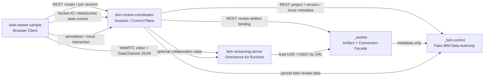
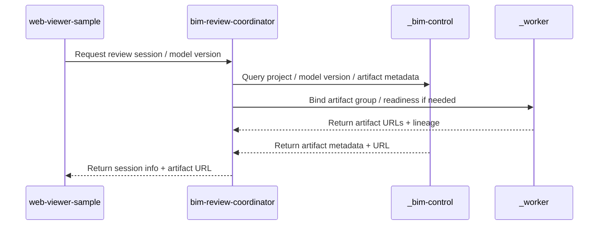
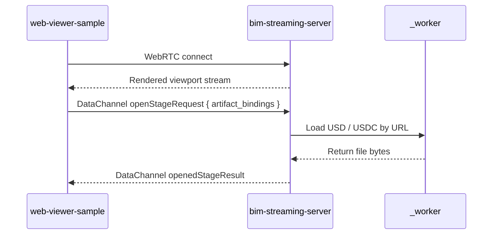
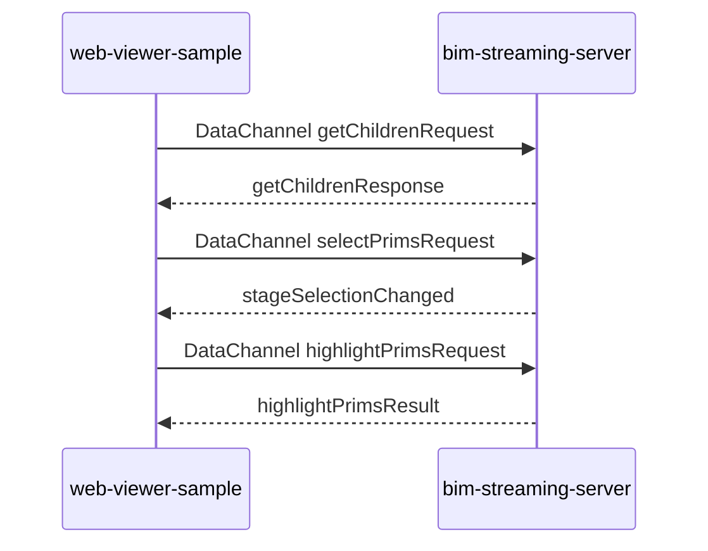
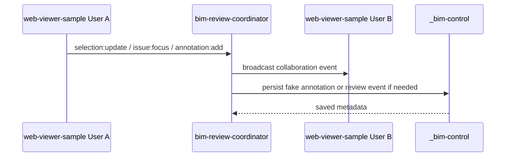
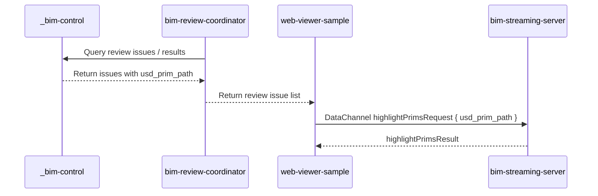

# AGENTS.md

## 0. 文件目的

本文件定義 `AI-BIM-governance/` workspace 內 **核心 repo / folder** 的責任邊界、互動方式與資料流動方式。

除 `0.1 Agent 工作方式與 Skill 使用規範` 外，本文件描述：

```txt
1. repo 邊界
2. repo 互動方式
3. 資料流動方向
4. 哪些資料由誰負責
5. 哪些事情不應跨 repo 混用
```

本文件不描述每個 repo 未來要新增哪些功能，也不作為功能開發清單。

---

## 0.1 Agent 工作方式與 Skill 使用規範

本 repo 以 `AGENTS.md` 作為 agent 行為與 repo 邊界的 source of truth。`CLAUDE.md`、OpenSpec、Graphify wiki、GitNexus generated skills、以及本機安裝的 `.codex/skills` 都只能輔助理解與執行，不得覆蓋本文件的 repo 邊界。

### 優先順序

```txt
使用者最新明確指令
AGENTS.md / repo-local boundary rules
CLAUDE.md
OpenSpec artifacts
installed skills / Graphify wiki / generated skills
```

若上述來源衝突，先採用 `AGENTS.md` 的 repo 邊界與 source-of-truth 規則，並在需要修改文件或實作時明確指出差異。

### Karpathy-style 工作守則

- 非平凡任務先列出假設、成功標準、最小改動面；若需求或 repo 邊界不清楚，先釐清再實作。
- 優先採用能解決當前問題的最簡單方案；不要新增未要求的抽象、設定層、擴充點或 production dependency。
- 只修改與任務直接相關的檔案與程式碼；不要順手重構、格式化、刪除註解或清理不理解的既有內容。
- 每個實作切片都要能被驗證；完成時回報改動檔案、驗證指令、未跑測試原因與已知風險。

### Skill routing

本 repo 已安裝 `.codex/skills` 作為本機 workflow helpers。使用 skill 時只把它們當作工作流程，不把 skill 內容視為高於本文件的需求來源。

| 情境 | 優先使用 |
|---|---|
| 需求模糊或需要收斂想法 | `idea-refine` / `spec-driven-development` |
| 需要拆任務或排實作順序 | `planning-and-task-breakdown` |
| 多 repo、API、資料流或邊界風險 | 本文件 repo 邊界 / `api-and-interface-design` |
| 實作跨多檔案變更 | `incremental-implementation` |
| 行為變更、bugfix、邏輯修改 | `test-driven-development` |
| UI 或 browser client 變更 | `frontend-ui-engineering` / `browser-testing-with-devtools` |
| 框架、SDK、OpenAI、Kit、USD 等官方 API 決策 | `source-driven-development` |
| code review、merge 前檢查 | `code-review-and-quality` / GitNexus impact + detect changes |
| 文件、架構決策、流程紀錄 | `documentation-and-adrs` / OpenSpec |

### OpenSpec 與本機 agent 產物

- OpenSpec 只記錄可審查的需求、設計、spec、tasks；不取代 repo 邊界，也不管理本機 skill 安裝。
- 本 repo 的 OpenSpec artifacts 預設必須使用繁體中文；API 路徑、schema 欄位、CLI flags、status enum、log/error、外部產品名稱與 OpenSpec parser 必要標頭（例如 `## MODIFIED Requirements`、`### Requirement:`、`#### Scenario:`）保留原文。
- `.claude/`、`.codex/`、`.agents/`、`.gitnexus/` 目前是本機 agent/tooling 產物，預設維持 ignored。
- 不提交 `.claude/skills/generated/`、`.codex/skills/` 或 GitNexus generated skill 檔，除非使用者明確要求改變 repo policy。

### OpenSpec + GitHub workflow

OpenSpec change 與實作必須遵守 GitHub PR workflow，不得直接在 `main` 分支上開發。

```txt
OpenSpec = 需求 / 規格 / 驗收條件
Git Branch = 實作隔離
Pull Request = 審查與討論
GitHub Actions = 自動驗證
Merge = 正式接受變更
Archive = 把變更規格併入正式規格
```

- 執行 `/openspec new <change-id>` 前，先從最新 `main` 建立並切換到 `codex/openspec/<change-id>`。
- `/openspec apply <change-id>` 的程式碼、測試、文件與 OpenSpec task 更新都必須留在該 branch。
- 開 PR 前要跑最小驗證並回報結果；PR 由 GitHub Actions 做自動驗證與審查討論。
- change 實作被正式接受並 merge 後，才執行 OpenSpec sync/archive，把 delta specs 併入 `openspec/specs/`。
- 每次執行 OpenSpec sync/archive 後，必須同步更新 `docs/plans/AI-BIM-governance-saas-roadmap-2026-05.md`，保持 `openspec/specs/`、`openspec/changes/archive/`、Phase 狀態、OpenSpec 候選、風險與下一步規劃一致。
- Roadmap 同步以 `docs/plans/AI-BIM-governance-saas-roadmap-2026-05.md §1.6` 為準；若沒有新的 runtime / smoke / test evidence，不得因 archive 完成就把 roadmap 的驗證狀態標成 passed。
- Roadmap 對齊完成後，必須主動使用文件/規劃相關 skill 產生或更新同名 HTML 檢視版 `docs/plans/AI-BIM-governance-saas-roadmap-2026-05.html`；HTML 只作為方便人類閱讀的衍生檢視，內容必須源自同名 Markdown，source of truth 仍是 `.md`。
- 若 roadmap 未同步，OpenSpec archive 只能視為規格檔案已搬移，不能視為專案執行規劃已收斂。
- 若發現已在 `main` 產生未提交變更，先切到對應 `codex/openspec/<change-id>` branch，再繼續工作或整理 PR。
- 本地 `main` 只作為 `origin/main` 的乾淨追蹤分支；不得在 `main` 保留本地-only commit、累積功能開發、或用 merge/pull 解 PR squash/merge 後的 ahead/behind 分岔。
- PR merge 後的本地收斂必須先 `git fetch origin --prune`，確認工作區乾淨後讓本地 `main` 指向 `origin/main`；若 `main...origin/main` 顯示 ahead/behind，先確認 ahead 內容已被 PR merge commit 吸收，再對齊 `origin/main`，不要手動解同內容衝突。

### Archive 後的 agent closeout event flow

OpenSpec archive 只代表規格已併入正式 specs，不代表 Git branch 已自動收斂。當 agent 完成或協助完成 archive change id、PR merge、或使用者詢問「分支是否收斂」時，必須把 branch closeout 視為同一個事件流程的收尾，不應要求使用者靠記憶手動執行。

Closeout 必須先做只讀盤點：

```powershell
git switch main
git fetch origin --prune
git status --short --branch
git branch -vv --no-abbrev
git branch --no-merged origin/main
git branch -r --no-merged origin/main
```

判斷規則：

- 對於 PR 已 `MERGED`、upstream 已 `gone`、或已被後續 PR / archive 明確 superseded 的 local branch，agent 可以在回報理由後清理 local branch。
- 對於遠端 branch，必須先用 `gh pr list --state all` 或等價方式確認 PR 狀態與 head ref；只有已 merge 或已明確 superseded 的 branch 才可建議刪除。
- `revert-*`、release、hotfix、或語意上代表回滾決策的 branch 不得自動刪除；必須先向使用者說明保留/刪除影響並取得明確同意。
- 若 `git branch --no-merged origin/main` 因 squash merge 或 replacement PR 仍列出舊 branch，不能只用 ancestry 判斷；必須交叉比對 PR 狀態、`mergedAt`、`closedAt`、branch diff 與 OpenSpec archive 內容。

清理指令範本：

```powershell
git branch -D <local-branch>
git push origin --delete <remote-branch>
git fetch origin --prune
```

完成後必須回報：

- 刪除哪些 local branch。
- 刪除哪些 remote branch。
- 哪些 branch 刻意保留，以及保留原因。
- `main` 是否已對齊 `origin/main`。
- `git branch --no-merged origin/main` 與 `git branch -r --no-merged origin/main` 的剩餘結果。

---

## 1. Workspace 範圍

主要開發資料夾：

```txt
AI-BIM-governance/
```

核心 repo / folder：

```txt
AI-BIM-governance/
├── bim-review-coordinator/      # 控制中心，localhost:8004
├── _worker/                     # artifact + conversion facade，localhost:8005
├── bim-streaming-server/        # Kit streaming server，WebRTC 49100
├── _bim-control/                # fake artifact / model API，localhost:8001
└── web-viewer-sample/           # browser client，localhost:5173
```

flowchart TD
  CO[bim-review-coordinator<br/>Control Plane]

  WK[_worker<br/>Artifact + Conversion Facade]
  KIT[bim-streaming-server<br/>Omniverse Kit Runtime]
  BC[_bim-control<br/>Fake BIM Data Authority]
  WV[web-viewer-sample<br/>Browser Client]

  CO -->|REST: bind review artifacts| WK
  CO -->|REST: query artifact/model data| BC
  CO -->|start / check / reference process| KIT
  WV -->|REST: create/join session| CO
  WV -->|WebRTC + DataChannel| KIT
  WK -->|publish metadata only| BC

其中：

```txt
bim-review-coordinator/
bim-streaming-server/
web-viewer-sample/
```

是正式架構中的三個核心互動 repo。

```txt
_bim-control/
_worker/
```

是本地開發用 worker / mock / fake infrastructure。`_worker` 是目前 flow 對外的 artifact + conversion 邊界。

---

## 2. 核心 repo 的定位總覽


```mermaid
flowchart LR
    BC["_bim-control\nFake BIM Data Authority"]
    WK["_worker\nArtifact + Conversion Facade"]
    CO["bim-review-coordinator\nSession / Control Plane"]
    KIT["bim-streaming-server\nOmniverse Kit Runtime"]
    WV["web-viewer-sample\nBrowser Client"]

    WV -->|REST: create / join session| CO
    CO -->|REST: project / version / issue metadata| BC
    CO -->|REST: review artifact binding| WK
    WK -->|metadata only| BC
    WV -->|WebRTC video + DataChannel JSON| KIT
    KIT -->|load USD / USDC by URL| WK
    WV -->|Socket.IO / WebSocket state events| CO
    CO -->|optional collaboration state| KIT
    WV -->|annotation / issue interaction| CO
    CO -->|persist fake review data| BC
```

一句話定位：

```txt
_bim-control            = 假資料權威
_worker                = 檔案與轉檔 facade
bim-review-coordinator = Session / 協作控制中心
bim-streaming-server   = Omniverse GPU / USD / WebRTC Runtime
web-viewer-sample      = Browser 操作端與串流觀看端
```

---

## 3. Repo 邊界

## 3.1 `_bim-control/`

### 角色

```txt
Fake BIM Platform / Fake Data Authority
```

### 邊界

`_bim-control` 只代表本地開發中的假 BIM 主平台資料層。

它負責提供或保存：

```txt
- project metadata
- model version metadata
- model artifact metadata
- issue metadata
- annotation metadata
- element mapping metadata
- review result metadata
```

它不負責：

```txt
- 真實 Revit plugin
- 真實 SSO / 權限系統
- Omniverse rendering
- WebRTC streaming
- GPU instance lifecycle
- 實際大型檔案 byte storage
- USD stage 操作
```

### 資料邊界

`_bim-control` 保存的是「資料描述」與「關聯關係」，不是 GPU runtime，也不是真實物件儲存。

例如：

```txt
model_version_id
artifact_id
artifact_format
file_url
usd_url
issue_id
annotation_id
ifc_guid
usd_prim_path
```

---

## 3.2 Retired Legacy Storage / Conversion Services

### 角色

```txt
Historical local compatibility services
```

### 邊界

`_s3_storage`、`_conversion-service`、`_conversion-server` 不屬於目前 demo runtime 的核心服務，也不應作為新的 startup、health check、smoke test 或 review-session dependency。

目前 flow 的檔案、object URL、轉檔 job、artifact group readiness 都由 `_worker` 對外承接。歷史文件若仍提到舊服務，只能作為 archive context，不能覆蓋本文件的 current boundary。

舊服務不得：

```txt
- 被重新加入 current core service list
- 重新佔用 8002 / 8003 作為 demo 必要服務
- 取代 _worker 成為檔案與轉檔邊界
- 取代 _bim-control 成為資料權威
```

### 資料邊界

`_worker` 保存檔案本體與轉檔輸出，`_bim-control` 保存「這個檔案屬於哪個 project / model version / artifact」的 metadata。兩者不可混淆。

---

## 3.3 `_worker/`

### 角色

```txt
Artifact + Conversion Worker Facade
```

### 邊界

`_worker` 是新 review session request lifecycle 對外的檔案與轉檔邊界。

它負責：

```txt
- 接收 IFC / RVT / DWG bytes 或 signed upload reference
- 建立 versioned object layout
- 建立與查詢 conversion job
- 產出 USDC / index JSON / element_mapping.json / metadata.json
- 建立 artifact group 與 conversion lineage
- 將 artifact metadata / conversion result metadata 發布到 _bim-control
```

它不負責：

```txt
- project / issue / annotation 的資料權威
- review session lifecycle 的總控
- Omniverse viewport rendering
- WebRTC streaming
- 使用者登入與權限
- 取代 web-viewer-sample 成為 UI
```

### 資料邊界

`_worker` 可保存檔案本體與轉檔輸出，但只把 metadata、artifact group、lineage、readiness 發布到 `_bim-control`。`_bim-control` 仍然是審查資料與 artifact metadata 的 fake authority。

---

## 3.4 `bim-review-coordinator/`

### 角色

```txt
Session Control Plane / Collaboration Coordinator
```

### 邊界

`bim-review-coordinator` 是 review session 的協調中心。

它負責協調：

```txt
- review session 狀態
- browser client 與 Kit streaming server 的連線資訊
- user presence / collaboration state
- selection / annotation / issue focus 等協作事件
- fake BIM platform 與 fake storage 的資料查詢路由
```

它不負責：

```txt
- USD stage loading
- Omniverse viewport rendering
- WebRTC video encoding
- IFC / USD 檔案內容轉換
- 直接保存大型檔案
- 取代 _bim-control 成為資料權威
- 取代 web-viewer-sample 成為 UI
```

### 控制邊界

`bim-review-coordinator` 可以知道：

```txt
session_id
user_id
model_version_id
kit_instance_id
stream_config
presence state
collaboration event
```

但不應該知道或操作：

```txt
USD internal prim tree implementation
Omniverse material / camera / renderer internal details
large binary file bytes
```

---

## 3.5 `bim-streaming-server/`

### 角色

```txt
Omniverse Kit Runtime / GPU Streaming Server
```

### 邊界

`bim-streaming-server` 是 Omniverse Kit runtime。

它負責處理：

```txt
- USD / USDC stage runtime
- Omniverse Kit viewport
- GPU rendering
- WebRTC video stream
- WebRTC DataChannel JSON command
- stage tree / prim selection / camera / visual overlay 的 runtime 操作
```

它不負責：

```txt
- project / model version 的資料權威
- 使用者登入與權限
- review session lifecycle 的總控
- 多人協作事件的中心廣播
- 長期 annotation / issue 儲存
- 假 S3 檔案倉庫
- 假 BIM API
```

### Runtime 邊界

`bim-streaming-server` 只處理「目前這個 stream session 中的 3D runtime 狀態」。

它可以處理：

```txt
目前開啟哪個 USD / USDC
目前選取哪個 prim
目前 viewport camera 狀態
目前套用哪些 visual overlay
```

但這些狀態若要成為正式審查資料，必須回寫到 `_bim-control` 或正式資料權威。

---

## 3.6 `web-viewer-sample/`

### 角色

```txt
Browser Client / WebRTC Viewer / User Interaction Layer
```

### 邊界

`web-viewer-sample` 是瀏覽器操作端。

它負責：

```txt
- 顯示 WebRTC 串流畫面
- 送出 DataChannel JSON command 給 bim-streaming-server
- 接收 bim-streaming-server 回傳的 scene state / command result
- 與 bim-review-coordinator 交換 session / collaboration state
- 顯示 project / issue / annotation / stage tree 等 UI 狀態
```

它不負責：

```txt
- 啟動或停止 Kit server
- 分配 GPU
- 保存專案資料
- 保存大型模型檔案
- 執行 IFC / USD 轉檔
- 執行法規 / 碳排 / AI 判斷
- 取代 coordinator 管理 session
```

### Client 邊界

`web-viewer-sample` 是使用者對整個系統的操作入口，但不是資料權威，也不是 GPU runtime。

它可以送出操作意圖，例如：

```txt
open stage
select prim
highlight issue
add annotation
focus issue
join session
leave session
```

但操作結果應該由對應 repo 處理：

```txt
3D runtime 操作 → bim-streaming-server
session / collaboration → bim-review-coordinator
metadata / review data → _bim-control
file / conversion access → _worker
```

---

## 4. 資料類型與歸屬

| 資料類型 | 權威 repo / folder | 說明 |
|---|---|---|
| Project metadata | `_bim-control` | 假專案資料 |
| Model version metadata | `_bim-control` | 假模型版本資料 |
| Artifact metadata | `_bim-control` | 描述檔案格式、URL、版本關係 |
| IFC / RVT / DWG file | `_worker` | 原始模型檔案本體 |
| USD / USDC file | `_worker` | Omniverse runtime 載入的衍生檔 |
| element_mapping.json | `_worker` + `_bim-control` | 檔案在 worker object layout，關聯 metadata 在 `_bim-control` |
| Review issue metadata | `_bim-control` | 假審查問題與定位資料 |
| Annotation metadata | `_bim-control` | 假標註與審查紀錄 |
| Review session state | `bim-review-coordinator` | 當前 session 狀態 |
| Collaboration state | `bim-review-coordinator` | presence / selection / issue focus / annotation event |
| USD stage runtime state | `bim-streaming-server` | 當前 Omniverse scene runtime 狀態 |
| Browser UI state | `web-viewer-sample` | 當前前端 UI 狀態 |

---

## 5. 核心資料流

## 5.1 Artifact Discovery Flow


```mermaid
sequenceDiagram
    participant WV as web-viewer-sample
    participant CO as bim-review-coordinator
    participant BC as _bim-control
    participant WK as _worker

    WV->>CO: Request review session / model version
    CO->>BC: Query project / model version / artifact metadata
    CO->>WK: Bind artifact group / readiness if needed
    WK-->>CO: Return artifact URLs + lineage
    BC-->>CO: Return artifact metadata + URL
    CO-->>WV: Return session info + artifact URL
```

### 邊界說明

```txt
web-viewer-sample 不直接決定模型資料權威。
bim-review-coordinator 負責協調查詢。
_bim-control 決定哪個 artifact 屬於哪個 model version。
_worker 是新 flow 的檔案與轉檔邊界。
```

---

## 5.2 Streaming Flow


```mermaid
sequenceDiagram
    participant WV as web-viewer-sample
    participant KIT as bim-streaming-server
    participant WK as _worker

    WV->>KIT: WebRTC connect
    KIT-->>WV: Rendered viewport stream
    WV->>KIT: DataChannel openStageRequest { artifact_bindings }
    KIT->>WK: Load USD / USDC by URL
    WK-->>KIT: Return file bytes
    KIT-->>WV: DataChannel openedStageResult
```

### 邊界說明

```txt
WebRTC video stream 只存在於 web-viewer-sample 與 bim-streaming-server 之間。
USD / USDC 檔案本體由 _worker 提供。
bim-streaming-server 只載入與渲染，不成為檔案權威。
```

---

## 5.3 Scene Interaction Flow


```mermaid
sequenceDiagram
    participant WV as web-viewer-sample
    participant KIT as bim-streaming-server

    WV->>KIT: DataChannel getChildrenRequest
    KIT-->>WV: getChildrenResponse
    WV->>KIT: DataChannel selectPrimsRequest
    KIT-->>WV: stageSelectionChanged
    WV->>KIT: DataChannel highlightPrimsRequest
    KIT-->>WV: highlightPrimsResult
```

### 邊界說明

```txt
Scene interaction 是 browser client 與 Kit runtime 之間的 DataChannel JSON 流程。
這些 runtime interaction 不等於正式資料保存。
若要保存成審查紀錄，必須經 coordinator / _bim-control 回寫。
```

---

## 5.4 Collaboration Flow


```mermaid
sequenceDiagram
    participant WV1 as web-viewer-sample User A
    participant CO as bim-review-coordinator
    participant WV2 as web-viewer-sample User B
    participant BC as _bim-control

    WV1->>CO: selection:update / issue:focus / annotation:add
    CO->>WV2: broadcast collaboration event
    CO->>BC: persist fake annotation or review event if needed
    BC-->>CO: saved metadata
```

### 邊界說明

```txt
多人協作事件由 bim-review-coordinator 作為中心。
web-viewer-sample 發出使用者互動事件。
_bim-control 只保存需要成為審查資料的 metadata。
bim-streaming-server 不作為多人協作事件中心。
```

---

## 5.5 Review Result Visualization Flow


```mermaid
sequenceDiagram
    participant BC as _bim-control
    participant CO as bim-review-coordinator
    participant WV as web-viewer-sample
    participant KIT as bim-streaming-server

    CO->>BC: Query review issues / results
    BC-->>CO: Return issues with usd_prim_path
    CO-->>WV: Return review issue list
    WV->>KIT: DataChannel highlightPrimsRequest { usd_prim_path }
    KIT-->>WV: highlightPrimsResult
```

### 邊界說明

```txt
Review issue metadata 由 _bim-control 提供。
Issue 的 3D 視覺化由 bim-streaming-server 處理。
web-viewer-sample 只是把使用者操作轉成 DataChannel command。
bim-review-coordinator 負責把 session 與 review metadata 串起來。
```

---

## 6. 通訊方式邊界

| 通訊方式 | 起點 | 終點 | 用途 |
|---|---|---|---|
| REST | `web-viewer-sample` | `bim-review-coordinator` | 建立 session、查詢 session、取得 stream config |
| REST | `bim-review-coordinator` | `_bim-control` | 查詢 project / version / artifact / issue / annotation metadata |
| REST | `web-viewer-sample` / `bim-review-coordinator` | `_worker` | 建立 source artifact、conversion job、查詢 artifact group readiness |
| REST / Static file | `_bim-control` 或 `bim-streaming-server` | `_worker` | 取得 current flow object URL |
| WebRTC video | `bim-streaming-server` | `web-viewer-sample` | 串流 Omniverse viewport 畫面 |
| WebRTC DataChannel JSON | `web-viewer-sample` | `bim-streaming-server` | open stage、selection、highlight、scene query |
| WebSocket / Socket.IO | `web-viewer-sample` | `bim-review-coordinator` | presence、selection、annotation、issue focus 等多人事件 |
| Optional WebSocket | `bim-streaming-server` | `bim-review-coordinator` | Kit runtime 接收多人狀態 overlay，不作為主要資料權威 |

---

## 7. Source of Truth 原則

## 7.1 BIM 原始資料

```txt
IFC / RVT / DWG = 原始模型資料
```

其檔案本體屬於：

```txt
_worker
```

其版本與專案關聯屬於：

```txt
_bim-control
```

---

## 7.2 Omniverse Runtime 資料

```txt
USD / USDC = rendering / streaming artifact
```

其檔案本體屬於：

```txt
_worker
```

其 runtime 操作屬於：

```txt
bim-streaming-server
```

---

## 7.3 Mapping 資料

```txt
IFC GUID ↔ USD Prim Path
```

這是 BIM 語意資料與 Omniverse 視覺化資料之間的橋。

```txt
mapping file body      → _worker
mapping metadata       → _bim-control
mapping runtime usage  → web-viewer-sample / bim-streaming-server
```

---

## 7.4 Review 資料

```txt
issue / annotation / review result
```

其資料權威是：

```txt
_bim-control
```

其多人事件流由：

```txt
bim-review-coordinator
```

其 3D runtime 顯示由：

```txt
bim-streaming-server
```

其使用者操作入口由：

```txt
web-viewer-sample
```

---

## 8. 禁止跨界規則

## 8.1 `web-viewer-sample` 不應做的事

```txt
- 不啟動 Kit server
- 不分配 GPU
- 不保存 project / model / issue 的資料權威
- 不保存大型模型檔案
- 不執行 IFC / USD 轉檔
```

## 8.2 `bim-streaming-server` 不應做的事

```txt
- 不管理使用者登入
- 不管理 project / model version
- 不作為 annotation / issue 長期資料庫
- 不作為多人協作事件中心
- 不取代 _bim-control
- 不取代 _worker
```

## 8.3 `bim-review-coordinator` 不應做的事

```txt
- 不渲染 3D
- 不開啟 USD stage
- 不處理 Omniverse renderer internal state
- 不保存大型模型檔案
- 不取代 _bim-control 成為資料權威
- 不取代 web-viewer-sample 成為 UI
```

## 8.4 `_bim-control` 不應做的事

```txt
- 不做 Omniverse rendering
- 不做 WebRTC streaming
- 不做 GPU runtime 管理
- 不直接操作 USD stage
- 不保存大型 binary file body
```

## 8.5 `_worker` 不應做的事

```txt
- 不保存 project / issue / annotation 的資料權威
- 不管理 review session lifecycle
- 不分配 GPU 或管理 Kit runtime
- 不直接操作 USD stage
- 不作為多人協作事件中心
- 不取代 web-viewer-sample 成為 UI
```

---

## 9. Optional Mock Services 說明

`AI-BIM-governance/` 之後可以存在其他 mock folders，例如：

```txt
_ai-rule-carbon-service/
_mock-auth/
_mock-sensor-service/
```

這些不屬於本文件定義的核心 repo。若歷史計畫文件提到 `_s3_storage`、`_conversion-service` 或 `_conversion-server`，那些引用只代表舊設計背景；目前 runtime 不啟動、不檢查、也不依賴這些服務。

若它們存在，邊界原則如下：

```txt
- 它們只提供假資料、假結果或本地測試用資料處理。
- 它們不應越過 _bim-control 成為正式資料權威。
- 它們不應越過 bim-streaming-server 直接控制 Omniverse viewport。
- 它們不應越過 bim-review-coordinator 管理 session / collaboration。
- 它們不應越過 web-viewer-sample 成為 browser UI。
```

---

## 10. Workspace 最重要閉環

整個 workspace 要保護的最小閉環是：

```txt
_bim-control 提供 model / issue metadata
→ _worker 提供 artifact group / USD / USDC / mapping URL
→ bim-review-coordinator 建立 review session
→ web-viewer-sample 取得 session / stream config
→ web-viewer-sample 連到 bim-streaming-server
→ bim-streaming-server 載入 USD / USDC
→ web-viewer-sample 顯示 stream 畫面
→ 使用者點選 issue / prim
→ web-viewer-sample 送 DataChannel command
→ bim-streaming-server 執行 3D highlight / selection
→ web-viewer-sample 送 annotation / collaboration event
→ bim-review-coordinator 廣播 / 回寫
→ _bim-control 保存 fake review metadata
```

任何修改都不應破壞這條閉環。

---

## 11. 總結

本 workspace 的核心分工是：

```txt
_bim-control
= 假 BIM 資料權威

_worker
= 檔案與轉檔 facade

bim-review-coordinator
= Session / collaboration control plane

bim-streaming-server
= Omniverse Kit runtime / WebRTC streaming / USD scene runtime

web-viewer-sample
= Browser client / user interaction layer
```

所有跨 repo 互動都必須遵守：

```txt
資料權威歸資料層
檔案與轉檔外部邊界歸 worker
session 歸 coordinator
3D runtime 歸 streaming server
使用者操作歸 web viewer
```

## 12. AI Agent Wiki 使用規範

這些文件提供 AI agent 在陌生模組探索時的快速上下文，目的是縮短定位時間，不取代程式碼與 API contract。

Graphify Wiki（跨文件知識圖）

入口：README.md
用途：快速理解跨 repo 概念關聯、名詞對照、文件連結關係。
適用時機：需求探索、架構導覽、影響面初步盤點。
限制：不得作為行為正確性的唯一依據，最終以程式碼與 contracts 為準。
Source of Truth 優先順序

程式碼實作
contracts 文件
AGENTS 邊界定義
wiki（Graphify）
維護規範

若發現 wiki 與實作不一致，先以實作為準，並補更新 wiki。
重大流程變更（API、事件、資料流）合併前應同步更新對應 wiki 入口頁。


## Cursor Cloud specific instructions

### 環境概要

- Node.js 18 透過 nvm 管理；啟動 Node 服務前須先 source nvm：`export NVM_DIR="$HOME/.nvm" && . "$NVM_DIR/nvm.sh"`
- Python 3.12 已系統安裝；FastAPI/uvicorn 等 Python 依賴安裝在全域 site-packages（非 venv）
- `bim-streaming-server` 需要 NVIDIA GPU + Kit SDK，Cloud VM 無法運行，可跳過

### 啟動服務（4 個可運行的服務，Kit 需 GPU 可另行啟動）

每個服務需獨立 terminal / tmux session，README.md 已有完整 PowerShell 版命令，以下是 Linux 等效：

| 服務 | 工作目錄 | 啟動命令 | Port |
|---|---|---|---|
| `_bim-control` | `_bim-control/` | `python3 -m uvicorn app.main:app --host 127.0.0.1 --port 8001` | 8001 |
| `_worker` | `_worker/` | `python3 -m uvicorn app.main:app --host 127.0.0.1 --port 8005` | 8005 |
| `bim-review-coordinator` | `bim-review-coordinator/` | `npm run dev` | 8004 |
| `web-viewer-sample` | `web-viewer-sample/` | `npm run dev -- --host 0.0.0.0` | 5173 |

### 測試

- Python tests **必須在各自服務目錄下執行**（因為多個 FastAPI 服務都用 `app` package name，從 root 跑會互相污染 import cache）：
  - `cd _bim-control && python3 -m pytest tests`
  - `cd _worker && python3 -m pytest tests`
- Node tests：`cd bim-review-coordinator && npm test`
- Build：`cd bim-review-coordinator && npm run build` / `cd web-viewer-sample && npm run build`
- Lint（`web-viewer-sample`）：`npm run lint` — 目前有 30 個 pre-existing eslint errors，這是已知狀態

### .env 設定

- 從 `.env.example` 複製：root `.env`、`bim-review-coordinator/.env`
- 預設值即為本地開發正確值，通常不需修改

### 注意事項

- `web-viewer-sample` 完整功能需要 `bim-streaming-server`（WebRTC 串流），Cloud VM 無 GPU 無法運行。但 UI 仍可正常載入，REST API 與 coordinator 互動正常
- Health check endpoints：各服務皆有 `/health`

<!-- gitnexus:start -->
# GitNexus — Code Intelligence

This project is indexed by GitNexus as **AI-BIM-governance**. Use the GitNexus MCP tools to understand code, assess impact, and navigate safely.

> If any GitNexus tool warns the index is stale, run `gitnexus analyze --embeddings --skills` in terminal first. After a commit that only needs local index refresh, prefer `gitnexus analyze --embeddings --skills --skip-agents-md` to avoid rewriting this tracked section.

## Always Do

- **MUST run impact analysis before editing any symbol.** Before modifying a function, class, or method, run `gitnexus_impact({target: "symbolName", direction: "upstream"})` and report the blast radius (direct callers, affected processes, risk level) to the user.
- **MUST run `gitnexus_detect_changes()` before committing** to verify your changes only affect expected symbols and execution flows.
- **MUST warn the user** if impact analysis returns HIGH or CRITICAL risk before proceeding with edits.
- When exploring unfamiliar code, use `gitnexus_query({query: "concept"})` to find execution flows instead of grepping. It returns process-grouped results ranked by relevance.
- When you need full context on a specific symbol — callers, callees, which execution flows it participates in — use `gitnexus_context({name: "symbolName"})`.

## Never Do

- NEVER edit a function, class, or method without first running `gitnexus_impact` on it.
- NEVER ignore HIGH or CRITICAL risk warnings from impact analysis.
- NEVER rename symbols with find-and-replace — use `gitnexus_rename` which understands the call graph.
- NEVER commit changes without running `gitnexus_detect_changes()` to check affected scope.

## Resources

| Resource | Use for |
|----------|---------|
| `gitnexus://repo/AI-BIM-governance/context` | Codebase overview, check index freshness |
| `gitnexus://repo/AI-BIM-governance/clusters` | All functional areas |
| `gitnexus://repo/AI-BIM-governance/processes` | All execution flows |
| `gitnexus://repo/AI-BIM-governance/process/{name}` | Step-by-step execution trace |

## CLI

- `gitnexus status` checks whether the local index matches `HEAD`.
- `gitnexus analyze --embeddings --skills` rebuilds the graph, embeddings, and local generated skills.
- `gitnexus analyze --embeddings --skills --skip-agents-md` refreshes the local index without changing tracked AGENTS / CLAUDE sections.
- Generated skill files under `.claude/skills/` are local analysis artifacts and must stay ignored.

<!-- gitnexus:end -->
