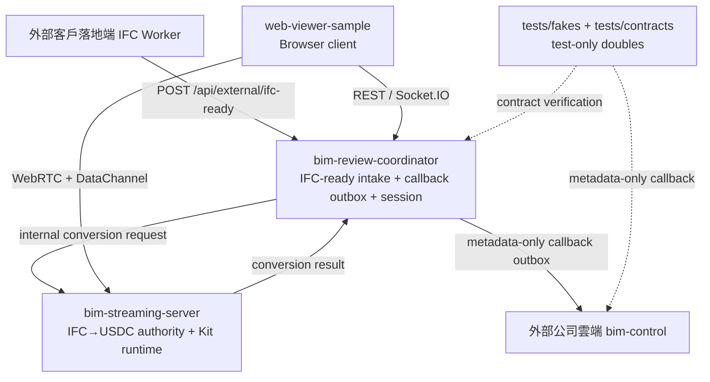

# CLAUDE.md

## 0. 文件目的

本文件是 `AGENTS.md` 的 Claude 鏡像入口。`AI-BIM-governance/` 的實際 repo
邊界、agent 行為、OpenSpec / GitHub workflow、GitNexus 規範與現行 B 方案閉環，全部以
[`AGENTS.md`](AGENTS.md) 為 source of truth。

若本文件、OpenSpec artifact、Graphify wiki、generated skills 或任何歷史文件與
`AGENTS.md` 衝突，先採用 `AGENTS.md`。

---

## 1. Claude / Codex 行為對齊

```txt
使用者最新明確指令
AGENTS.md / repo-local boundary rules
CLAUDE.md
OpenSpec artifacts
installed skills / Graphify wiki / generated skills
```

工作方式：

- 預設使用繁體中文回覆；code、API、log、錯誤訊息保留原語言。
- 編輯前先讀相關檔案與既有模式；不確定 repo 邊界時回到 `AGENTS.md`。
- 非平凡變更先列出假設、成功標準、最小改動面，再做最小、可回復 diff。
- 不修改 secrets、credentials、private keys、`.env` 實際值或大型模型檔案。
- 不新增 production dependency，除非先說明原因、影響與替代方案。
- 修改 function、class、method 前，依 `AGENTS.md` 的 GitNexus 規範做 impact analysis；
  若風險為 HIGH 或 CRITICAL，先回報再繼續。
- OpenSpec change 不得直接在 `main` 上開發；實作走 branch、PR、GitHub Actions、merge，
  merge 後才 sync/archive specs。
- 本機 `.codex/skills` 只作為 workflow helpers；不得覆蓋 `AGENTS.md` 的 repo 邊界。

完成任何 Claude 產生或修改的工作前，至少要回報：

```txt
1. 改了哪些 tracked files
2. 執行了哪些最小驗證
3. 哪些測試沒跑以及原因
4. 已知風險或既有問題
```

---

## 2. 現行 B 方案邊界

`_worker/` 與 `_bim-control/` 已自 repo product runtime 刪除。它們只可作為歷史脈絡、
OpenSpec archive context、或 `tests/fakes` / `tests/contracts` 的 test-double 對照；
不得作為現行 startup、health check、smoke、review-session dependency 或 agent repo 邊界。

核心 folder：

```txt
AI-BIM-governance/
├── bim-review-coordinator/      # 外部 IFC-ready intake + session/callback outbox，localhost:8004
├── bim-streaming-server/        # Internal IFC→USDC authority + Kit/WebRTC runtime，49101/49100
├── web-viewer-sample/           # browser client，localhost:5173
├── tests/contracts/             # 外部平台與 callback contract
└── tests/fakes/                 # test-only external platform doubles
```



一句話定位：

```txt
bim-review-coordinator = 對外 IFC-ready intake + service auth/idempotency + callback outbox + session/collaboration control plane
bim-streaming-server   = internal-only IFC→USDC conversion engine + Omniverse Kit runtime / WebRTC / USD scene runtime
web-viewer-sample      = Browser client / user interaction layer
tests/contracts        = 外部事件與 callback contract
tests/fakes            = 外部公司雲端與客戶落地端 IFC Worker 的 test-only doubles
```

---

## 3. Workspace 最重要閉環

```txt
[外部] 客戶落地端 IFC Worker 產出 .ifc
→ POST /api/external/ifc-ready 至 bim-review-coordinator（落地端內網，Service auth）
→ coordinator 驗證 / idempotency / 建立 local conversion job + external_model_version_id binding
→ coordinator 對 bim-streaming-server 發 internal conversion request
→ bim-streaming-server（internal-only）IFC→USDC，產出 USDC / element_mapping / manifest
→ coordinator 組 metadata-only callback 入 outbox（retry/dead-letter，不傳 .usdc bytes）
   → 回拋 [外部] 公司雲端 bim-control
→ coordinator 建立 review session / local web view session
→ web-viewer-sample 取得 session / stream config
→ web-viewer-sample 連到 bim-streaming-server → 載入 USD / USDC → 顯示 stream
→ 使用者點選 issue / prim → web-viewer-sample 送 DataChannel command
→ bim-streaming-server 執行 3D highlight / selection
→ web-viewer-sample 送 annotation / collaboration event
→ bim-review-coordinator 廣播 / 回寫；最小 shadow metadata 留本地（不 mirror 公司雲端）
```

任何修改都不應破壞這條閉環。歷史 `_bim-control → _worker → ...` 閉環已退役，只能作
archive context。

---

## 4. Source of Truth

```txt
對外 IFC-ready intake → bim-review-coordinator
IFC→USDC conversion authority → bim-streaming-server
雲端 metadata-only callback outbox → bim-review-coordinator
外部公司雲端 control-plane → 非本 repo runtime，由 tests/fakes 模擬
外部客戶落地端 IFC Worker → 非本 repo runtime，由 tests/fakes 模擬
Session / collaboration → bim-review-coordinator
3D runtime → bim-streaming-server
使用者操作 → web-viewer-sample
```

---

## 5. 驗證入口

Root contracts / fakes：

```powershell
python -m pytest tests -p no:cacheprovider
```

Coordinator：

```powershell
cd bim-review-coordinator
npm test
npm run build
npm run verify
```

Streaming conversion authority：

```powershell
cd bim-streaming-server
python -m pytest tests/test_conversion_authority_api.py -q
```

Viewer：

```powershell
cd web-viewer-sample
npm run test:session-first
npm run build
```

---

## 6. GitNexus

本 repo 的 GitNexus 使用規範以 `AGENTS.md` 的 `GitNexus — Code Intelligence` 區塊為準：

- 修改 symbol 前先做 impact analysis。
- 若 HIGH / CRITICAL risk，先回報再繼續。
- commit 前必須跑 detect changes。

若 GitNexus index stale，但 re-index 需要匯出或重新分析私有 repo，需遵守當前工具權限與使用者授權。

<!-- gitnexus:start -->
# GitNexus — Code Intelligence

This project is indexed by GitNexus as **AI-BIM-governance** (4464 symbols, 8042 relationships, 197 execution flows). Use the GitNexus MCP tools to understand code, assess impact, and navigate safely.

> If any GitNexus tool warns the index is stale, run `npx gitnexus analyze` in terminal first.

## Always Do

- **MUST run impact analysis before editing any symbol.** Before modifying a function, class, or method, run `gitnexus_impact({target: "symbolName", direction: "upstream"})` and report the blast radius (direct callers, affected processes, risk level) to the user.
- **MUST run `gitnexus_detect_changes()` before committing** to verify your changes only affect expected symbols and execution flows.
- **MUST warn the user** if impact analysis returns HIGH or CRITICAL risk before proceeding with edits.
- When exploring unfamiliar code, use `gitnexus_query({query: "concept"})` to find execution flows instead of grepping. It returns process-grouped results ranked by relevance.
- When you need full context on a specific symbol — callers, callees, which execution flows it participates in — use `gitnexus_context({name: "symbolName"})`.

## Never Do

- NEVER edit a function, class, or method without first running `gitnexus_impact` on it.
- NEVER ignore HIGH or CRITICAL risk warnings from impact analysis.
- NEVER rename symbols with find-and-replace — use `gitnexus_rename` which understands the call graph.
- NEVER commit changes without running `gitnexus_detect_changes()` to check affected scope.

## Resources

| Resource | Use for |
|----------|---------|
| `gitnexus://repo/AI-BIM-governance/context` | Codebase overview, check index freshness |
| `gitnexus://repo/AI-BIM-governance/clusters` | All functional areas |
| `gitnexus://repo/AI-BIM-governance/processes` | All execution flows |
| `gitnexus://repo/AI-BIM-governance/process/{name}` | Step-by-step execution trace |

## CLI

| Task | Read this skill file |
|------|---------------------|
| Understand architecture / "How does X work?" | `.claude/skills/gitnexus/gitnexus-exploring/SKILL.md` |
| Blast radius / "What breaks if I change X?" | `.claude/skills/gitnexus/gitnexus-impact-analysis/SKILL.md` |
| Trace bugs / "Why is X failing?" | `.claude/skills/gitnexus/gitnexus-debugging/SKILL.md` |
| Rename / extract / split / refactor | `.claude/skills/gitnexus/gitnexus-refactoring/SKILL.md` |
| Tools, resources, schema reference | `.claude/skills/gitnexus/gitnexus-guide/SKILL.md` |
| Index, status, clean, wiki CLI commands | `.claude/skills/gitnexus/gitnexus-cli/SKILL.md` |

<!-- gitnexus:end -->
