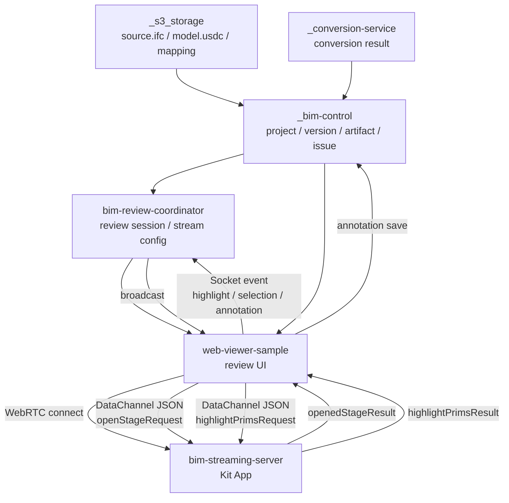

# BIM Review Coordinator + Web Viewer 基礎功能與資料流實作計畫 v0.1

> 給 Codex 直接執行用。  
> Workspace 預設：`AI-BIM-governance`。  
> 主要目標：完成 `bim-review-coordinator`、`web-viewer-sample`、`bim-streaming-server` 之間的 BIM Review 基礎資料流，並用 `_bim-control`、`_s3_storage`、`_conversion-service` / `_conversion-server` 等暫時 FastAPI 服務模擬正式 DB / S3 / 外部系統。

---

## 0. 重要前提與命名決策

### 0.1 已存在 / 正在進行的工作

本計畫假設以下項目已經存在或正在執行，不要重複改寫：

```txt
1. AGENTS.md
   - Codex agent 規範
   - repo / folder 邊界
   - 修改前檢查與驗證規範

2. IFC_TO_USDC_CONVERSION_API_IMPLEMENTATION_PLAN.md
   - IFC → USDC conversion API 實作計畫
   - conversion job
   - ifc_index.json / usd_index.json / element_mapping.json
   - _s3_storage 發布轉檔結果
   - _bim-control 回寫 conversion result
```

本計畫只補上：

```txt
1. review session 建立與管理
2. web viewer 動態取得 session / artifact / issue / stream config
3. WebRTC DataChannel 與 Coordinator Socket.IO / WebSocket 的資料流
4. issue → 3D highlight 的最小閉環
5. fake services 的基礎 API，讓整體可以端到端驗證
```

---

### 0.2 針對使用者輸入的解讀

使用者提到主要開發專案：

```txt
bim-review-coordinator, web-viewer-sample, bim-review-coordinator
```

其中 `bim-review-coordinator` 重複出現。Codex 請依本計畫解讀為：

```txt
主要開發：
1. bim-review-coordinator
2. web-viewer-sample
3. bim-streaming-server 的基礎 messaging / overlay extension

暫時資料服務：
1. _bim-control
2. _conversion-service 或 _conversion-server
3. _s3_storage
```

如果 workspace 已經有 `_conversion-service`，優先使用 `_conversion-service`。  
如果 workspace 已經建立 `_conversion-server`，不要強制改名；用環境變數 `CONVERSION_API_BASE` 指向實際資料夾啟動的服務即可。

---

### 0.3 本階段不做的事

本階段不要做：

```txt
- 真正生產級 JWT / SSO 驗證
- 真正 GPU pool / Kubernetes / Docker 動態擴縮
- 真正 AI 法規判斷
- 真正碳排計算
- 正式 DB schema migration
- 正式 S3 / MinIO / Supabase integration
- Nucleus Live / 真正多人 co-authoring
- 大規模 performance tuning
```

本階段要做的是可展示、可驗證、邊界清楚的 MVP：

```txt
IFC / USDC conversion result
  → _bim-control 保存 model artifact / review issue
  → bim-review-coordinator 建立 review session
  → web-viewer-sample 取得 stream config + artifact
  → web-viewer-sample 連上 bim-streaming-server
  → web-viewer-sample 送 openStageRequest 載入 USDC
  → web-viewer-sample 顯示 issue list
  → 點 issue
  → DataChannel 送 highlightPrimsRequest
  → bim-streaming-server 高亮 / 選取 / focus prim
  → coordinator 廣播 highlight / selection / annotation event
```

---

## 1. 系統責任邊界

### 1.1 `bim-review-coordinator`

定位：

```txt
Review session manager / Kit instance allocator / multiplayer event bus
```

允許做：

```txt
- 建立 review session
- 管理 session 狀態
- 管理 participant presence
- 分配目前可用的 Kit stream endpoint
- 提供 stream config 給 web-viewer-sample
- 用 Socket.IO 或 WebSocket 廣播 camera / selection / annotation / highlight event
- 在 development mode 使用固定 Kit endpoint，例如 127.0.0.1:49100
- 保存短期 session event log 到本地 JSON files
```

不應做：

```txt
- IFC → USDC 轉檔
- 保存長期 project / artifact / report 權威資料
- Omniverse viewport rendering
- 法規 / 碳排正式運算
- 直接操作 BIM model source of truth
```

---

### 1.2 `web-viewer-sample`

定位：

```txt
Browser WebRTC client / review UI prototype / DataChannel command sender
```

允許做：

```txt
- 連線 AppStreamer / WebRTC stream
- 從 coordinator 取得 stream config
- 從 _bim-control 取得 model artifact / review issue / annotation
- 送 openStageRequest 給 bim-streaming-server
- 顯示 issue list / artifact list / presence panel / event log
- 點 issue 後送 highlightPrimsRequest / focusPrimRequest
- 透過 coordinator 廣播 selection / camera / highlight / annotation
```

不應做：

```txt
- 成為正式主平台資料權威
- 直接存 DB
- 自己做法規 / 碳排正式判斷
- 自己做 IFC → USDC conversion
```

---

### 1.3 `bim-streaming-server`

定位：

```txt
Omniverse Kit Streaming App / USD stage loader / 3D overlay renderer
```

允許做：

```txt
- 載入 USD / USDC stage
- 接收 WebRTC DataChannel JSON command
- 回傳 openedStageResult / loadingStateResponse / getChildrenResponse
- 接收 highlightPrimsRequest / clearHighlightRequest / focusPrimRequest
- 對 prim 做 selection / focus / temporary material highlight / marker overlay
```

不應做：

```txt
- 管 project / model version / user 權限
- 提供 conversion REST API
- 保存長期 review issue / annotation
- 直接取代 _bim-control
```

---

### 1.4 `_bim-control`

定位：

```txt
Fake BIM data authority / mock DB API
```

允許做：

```txt
- 保存 project / model_version / artifact fake records
- 保存 conversion result
- 保存 review issue
- 保存 annotation
- 提供 web-viewer-sample / coordinator 查詢 API
- 第一版用 JSON file store，不用 DB
```

---

### 1.5 `_s3_storage`

定位：

```txt
Fake object storage / static file server
```

允許做：

```txt
- 存 source.ifc
- 存 model.usdc
- 存 ifc_index.json
- 存 usd_index.json
- 存 element_mapping.json
- 存 mock review issue fixture
- 提供 HTTP static URL
```

---

### 1.6 `_conversion-service` / `_conversion-server`

定位：

```txt
IFC / RVT / DWG → USD / USDC conversion API
```

本計畫只消費它，不重新實作它。  
若服務尚未完成，web viewer / coordinator 必須支援 mock artifact mode。

---

## 2. 最終目標資料流



---

## 3. Workspace 建議結構

Codex 請在 root 建立或確認以下結構：

```txt
AI-BIM-governance/
├── AGENTS.md
├── IFC_TO_USDC_CONVERSION_API_IMPLEMENTATION_PLAN.md
│
├── bim-streaming-server/
│   └── Omniverse Kit app / WebRTC / DataChannel / overlay
│
├── web-viewer-sample/
│   └── React / TypeScript browser client
│
├── bim-review-coordinator/
│   └── Node.js / TypeScript / Express / Socket.IO session service
│
├── _bim-control/
│   └── FastAPI fake BIM platform API
│
├── _s3_storage/
│   └── FastAPI StaticFiles fake object storage
│
├── _conversion-service/ 或 _conversion-server/
│   └── FastAPI conversion API, already planned separately
│
├── docs/
│   └── contracts/
│       ├── review-session-api.md
│       ├── coordinator-socket-events.md
│       ├── bim-control-fake-api.md
│       ├── streaming-datachannel-events.md
│       └── local-dev-runbook.md
│
└── scripts/
    ├── smoke-review-session.ps1
    ├── smoke-review-session.sh
    └── dev-health-check.ps1
```

若 root 尚無 `docs/contracts` 或 `scripts`，建立它們。

---

## 4. Port 與環境變數約定

### 4.1 Local ports

```txt
_bim-control             http://127.0.0.1:8001
_s3_storage              http://127.0.0.1:8002
_conversion-service      http://127.0.0.1:8003
bim-review-coordinator   http://127.0.0.1:8004
web-viewer-sample        http://127.0.0.1:5173
bim-streaming-server     WebRTC signaling 127.0.0.1:49100
```

### 4.2 Root `.env.example`

如果 root 可放 `.env.example`，新增：

```env
BIM_CONTROL_API_BASE=http://127.0.0.1:8001
S3_STORAGE_BASE=http://127.0.0.1:8002
S3_STORAGE_STATIC_BASE=http://127.0.0.1:8002/static
CONVERSION_API_BASE=http://127.0.0.1:8003
COORDINATOR_API_BASE=http://127.0.0.1:8004
COORDINATOR_SOCKET_URL=http://127.0.0.1:8004
KIT_STREAM_SERVER=127.0.0.1
KIT_SIGNALING_PORT=49100
KIT_MEDIA_SERVER=127.0.0.1
WEB_VIEWER_URL=http://127.0.0.1:5173
DEV_AUTH_TOKEN=dev-token
```

---

## 5. API Contract：`_bim-control`

### 5.1 技術選擇

```txt
Python 3.11+
FastAPI
Pydantic
Uvicorn
JSON file store
pytest
```

### 5.2 目錄

```txt
_bim-control/
├── app/
│   ├── __init__.py
│   ├── main.py
│   ├── models.py
│   ├── store.py
│   └── seed.py
├── data/
│   ├── projects.json
│   ├── model_versions.json
│   ├── artifacts.json
│   ├── conversion_results.json
│   ├── review_issues.json
│   └── annotations.json
├── tests/
│   ├── test_health.py
│   ├── test_artifacts.py
│   └── test_review_issues.py
├── requirements.txt
├── .env.example
└── README.md
```

### 5.3 Endpoints

```http
GET  /health
GET  /api/projects
GET  /api/projects/{project_id}
GET  /api/projects/{project_id}/versions
GET  /api/model-versions/{model_version_id}
GET  /api/model-versions/{model_version_id}/artifacts
POST /api/model-versions/{model_version_id}/conversion-result
GET  /api/model-versions/{model_version_id}/conversion-result
GET  /api/model-versions/{model_version_id}/review-issues
POST /api/model-versions/{model_version_id}/review-issues
GET  /api/review-sessions/{session_id}/annotations
POST /api/review-sessions/{session_id}/annotations
```

### 5.4 Artifact response

```json
{
  "model_version_id": "version_demo_001",
  "artifacts": [
    {
      "artifact_id": "artifact_usdc_demo_001",
      "artifact_type": "usdc",
      "name": "Demo BIM Model USDC",
      "url": "http://127.0.0.1:8002/static/projects/project_demo_001/versions/version_demo_001/model.usdc",
      "mapping_url": "http://127.0.0.1:8002/static/projects/project_demo_001/versions/version_demo_001/element_mapping.json",
      "status": "ready"
    }
  ]
}
```

### 5.5 Review issue model

```json
{
  "issue_id": "ISSUE-DEMO-001",
  "project_id": "project_demo_001",
  "model_version_id": "version_demo_001",
  "source": "mock_compliance",
  "severity": "error",
  "status": "open",
  "title": "測試：樓梯寬度不足",
  "description": "這是用來驗證 issue → 3D highlight 的假資料。",
  "ifc_guid": "2VJ3sK9L000fake001",
  "usd_prim_path": "/World/IFCSTAIR/Mesh_23",
  "evidence": {
    "required_width_mm": 1200,
    "actual_width_mm": 980
  },
  "created_at": "2026-04-29T10:00:00+08:00"
}
```

### 5.6 Annotation model

```json
{
  "annotation_id": "ann_001",
  "session_id": "review_session_001",
  "project_id": "project_demo_001",
  "model_version_id": "version_demo_001",
  "author_id": "dev_user_001",
  "title": "請確認樓梯寬度",
  "body": "現場 review 發現此處需要重新檢查。",
  "ifc_guid": "2VJ3sK9L000fake001",
  "usd_prim_path": "/World/IFCSTAIR/Mesh_23",
  "camera": null,
  "created_at": "2026-04-29T10:10:00+08:00"
}
```

### 5.7 Seed data 規則

Codex 應建立 seed command 或啟動時自動補預設資料：

```txt
project_demo_001
version_demo_001
artifact_ifc_demo_001
artifact_usdc_demo_001
ISSUE-DEMO-001
```

若 `model.usdc` 尚不存在，artifact 可指向：

```txt
http://127.0.0.1:8002/static/projects/project_demo_001/versions/version_demo_001/model.usdc
```

但 response 必須允許 `status = missing`，不要假裝 ready。

---

## 6. API Contract：`_s3_storage`

### 6.1 技術選擇

```txt
Python 3.11+
FastAPI
StaticFiles
Uvicorn
pytest
```

### 6.2 目錄

```txt
_s3_storage/
├── app/
│   ├── __init__.py
│   └── main.py
├── static/
│   └── projects/
│       └── project_demo_001/
│           └── versions/
│               └── version_demo_001/
│                   ├── source.ifc                  # 可缺
│                   ├── model.usdc                  # conversion 完成後產生
│                   ├── ifc_index.json              # conversion 完成後產生
│                   ├── usd_index.json              # conversion 完成後產生
│                   └── element_mapping.json        # conversion 完成後產生
├── tests/
│   └── test_health.py
├── requirements.txt
└── README.md
```

### 6.3 Endpoints

```http
GET  /health
GET  /static/{path:path}
POST /api/upload
GET  /api/objects/{path:path}/metadata
```

`POST /api/upload` 可選。若 Codex 時間不足，先只做 StaticFiles + health。

---

## 7. API Contract：`bim-review-coordinator`

### 7.1 技術選擇

```txt
Node.js 20+
TypeScript
Express
Socket.IO
Zod
uuid
dotenv
Vitest 或 Jest
```

如果 repo 已經使用其他 Node test stack，沿用既有 stack。

### 7.2 目錄

```txt
bim-review-coordinator/
├── src/
│   ├── index.ts
│   ├── config.ts
│   ├── types.ts
│   ├── http/
│   │   ├── health.ts
│   │   ├── sessions.ts
│   │   └── streamConfig.ts
│   ├── services/
│   │   ├── sessionStore.ts
│   │   ├── kitPool.ts
│   │   ├── bimControlClient.ts
│   │   └── eventLog.ts
│   ├── socket/
│   │   ├── reviewNamespace.ts
│   │   └── socketEvents.ts
│   └── utils/
│       └── time.ts
├── data/
│   ├── sessions/
│   └── events/
├── tests/
│   ├── health.test.ts
│   ├── sessions.test.ts
│   └── socket-events.test.ts
├── package.json
├── tsconfig.json
├── .env.example
└── README.md
```

### 7.3 環境變數

```env
PORT=8004
HOST=127.0.0.1
BIM_CONTROL_API_BASE=http://127.0.0.1:8001
CONVERSION_API_BASE=http://127.0.0.1:8003
KIT_STREAM_SERVER=127.0.0.1
KIT_SIGNALING_PORT=49100
KIT_MEDIA_SERVER=127.0.0.1
DEV_AUTH_TOKEN=dev-token
SESSION_STORE_DIR=./data/sessions
EVENT_LOG_DIR=./data/events
CORS_ORIGINS=http://127.0.0.1:5173,http://localhost:5173
```

### 7.4 Review session model

```json
{
  "session_id": "review_session_001",
  "project_id": "project_demo_001",
  "model_version_id": "version_demo_001",
  "source_artifact_id": "artifact_ifc_demo_001",
  "usdc_artifact_id": "artifact_usdc_demo_001",
  "status": "active",
  "mode": "single_kit_shared_state",
  "created_by": "dev_user_001",
  "created_at": "2026-04-29T10:00:00+08:00",
  "updated_at": "2026-04-29T10:00:00+08:00",
  "kit_instance": {
    "instance_id": "kit_local_001",
    "provider": "local_fixed",
    "status": "allocated",
    "stream_server": "127.0.0.1",
    "signaling_port": 49100,
    "media_server": "127.0.0.1"
  },
  "participants": []
}
```

### 7.5 HTTP endpoints

```http
GET  /health
POST /api/review-sessions
GET  /api/review-sessions/{session_id}
POST /api/review-sessions/{session_id}/join
POST /api/review-sessions/{session_id}/leave
GET  /api/review-sessions/{session_id}/stream-config
GET  /api/review-sessions/{session_id}/events
POST /api/review-sessions/{session_id}/events
```

### 7.6 `POST /api/review-sessions` request

```json
{
  "project_id": "project_demo_001",
  "model_version_id": "version_demo_001",
  "created_by": "dev_user_001",
  "mode": "single_kit_shared_state",
  "options": {
    "auto_allocate_kit": true,
    "prefer_existing_conversion": true
  }
}
```

### 7.7 `GET /api/review-sessions/{session_id}/stream-config` response

```json
{
  "session_id": "review_session_001",
  "project_id": "project_demo_001",
  "model_version_id": "version_demo_001",
  "kit_instance": {
    "instance_id": "kit_local_001",
    "provider": "local_fixed",
    "stream_server": "127.0.0.1",
    "signaling_port": 49100,
    "media_server": "127.0.0.1"
  },
  "webrtc": {
    "mode": "local",
    "signalingServer": "127.0.0.1",
    "signalingPort": 49100,
    "mediaServer": "127.0.0.1"
  },
  "model": {
    "artifact_id": "artifact_usdc_demo_001",
    "artifact_type": "usdc",
    "url": "http://127.0.0.1:8002/static/projects/project_demo_001/versions/version_demo_001/model.usdc",
    "mapping_url": "http://127.0.0.1:8002/static/projects/project_demo_001/versions/version_demo_001/element_mapping.json",
    "status": "ready"
  },
  "socket": {
    "url": "http://127.0.0.1:8004",
    "namespace": "/review",
    "room": "review_session_001"
  }
}
```

### 7.8 Kit pool provider

第一版只做 fixed local provider：

```txt
provider = local_fixed
instance_id = kit_local_001
stream_server = env.KIT_STREAM_SERVER
signaling_port = env.KIT_SIGNALING_PORT
media_server = env.KIT_MEDIA_SERVER
```

不要在第一版做 Docker API。  
但 `kitPool.ts` 要設計 interface，讓未來可替換：

```ts
interface KitPoolProvider {
  allocate(input: AllocateKitInput): Promise<KitInstance>;
  release(instanceId: string): Promise<void>;
  get(instanceId: string): Promise<KitInstance | null>;
}
```

---

## 8. Socket.IO Contract：Coordinator `/review`

### 8.1 Client → Server events

```txt
joinSession
leaveSession
cursorUpdate
cameraPoseUpdate
selectionUpdate
highlightRequest
annotationCreate
annotationUpdate
annotationDelete
issueStatusUpdate
heartbeat
```

### 8.2 Server → Client events

```txt
sessionState
presenceUpdated
cursorBroadcast
cameraPoseBroadcast
selectionBroadcast
highlightBroadcast
annotationCreated
annotationUpdated
annotationDeleted
issueStatusUpdated
reviewResultReady
serverWarning
```

### 8.3 `joinSession`

Client emits：

```json
{
  "session_id": "review_session_001",
  "user": {
    "user_id": "dev_user_001",
    "display_name": "Dev User"
  },
  "client": {
    "client_id": "browser_001",
    "role": "reviewer"
  }
}
```

Server broadcasts `presenceUpdated`：

```json
{
  "session_id": "review_session_001",
  "participants": [
    {
      "user_id": "dev_user_001",
      "display_name": "Dev User",
      "client_id": "browser_001",
      "role": "reviewer",
      "status": "online",
      "joined_at": "2026-04-29T10:00:00+08:00"
    }
  ]
}
```

### 8.4 `highlightRequest`

Client emits：

```json
{
  "session_id": "review_session_001",
  "user_id": "dev_user_001",
  "source": "issue_panel",
  "issue_id": "ISSUE-DEMO-001",
  "items": [
    {
      "usd_prim_path": "/World/IFCSTAIR/Mesh_23",
      "ifc_guid": "2VJ3sK9L000fake001",
      "color": [1, 0, 0, 1],
      "label": "樓梯寬度不足"
    }
  ]
}
```

Server broadcasts `highlightBroadcast` to other clients in same room.

### 8.5 `selectionUpdate`

```json
{
  "session_id": "review_session_001",
  "user_id": "dev_user_001",
  "selected_prim_paths": [
    "/World/IFCSTAIR/Mesh_23"
  ],
  "source": "stage_tree"
}
```

### 8.6 `annotationCreate`

```json
{
  "session_id": "review_session_001",
  "project_id": "project_demo_001",
  "model_version_id": "version_demo_001",
  "author_id": "dev_user_001",
  "title": "請確認樓梯寬度",
  "body": "這裡需要重新檢查。",
  "usd_prim_path": "/World/IFCSTAIR/Mesh_23",
  "ifc_guid": "2VJ3sK9L000fake001"
}
```

Coordinator 第一版可以只廣播，不一定要寫回 `_bim-control`。  
但建議 `bimControlClient.ts` 實作寫回：

```http
POST /api/review-sessions/{session_id}/annotations
```

---

## 9. DataChannel Contract：`web-viewer-sample` ↔ `bim-streaming-server`

### 9.1 既有事件不可破壞

Codex 不要破壞既有事件：

```txt
openStageRequest
openedStageResult
loadingStateQuery
loadingStateResponse
updateProgressAmount
updateProgressActivity
getChildrenRequest
getChildrenResponse
selectPrimsRequest
stageSelectionChanged
makePrimsPickable
resetStage
```

### 9.2 本階段新增事件

Client → Kit：

```txt
highlightPrimsRequest
clearHighlightRequest
focusPrimRequest
applyReviewIssuesRequest
```

Kit → Client：

```txt
highlightPrimsResult
clearHighlightResult
focusPrimResult
reviewIssuesApplied
```

### 9.3 `highlightPrimsRequest`

```json
{
  "event_type": "highlightPrimsRequest",
  "payload": {
    "mode": "replace",
    "items": [
      {
        "prim_path": "/World/IFCSTAIR/Mesh_23",
        "ifc_guid": "2VJ3sK9L000fake001",
        "color": [1, 0, 0, 1],
        "label": "樓梯寬度不足",
        "source": "compliance",
        "issue_id": "ISSUE-DEMO-001"
      }
    ],
    "focus_first": true
  }
}
```

### 9.4 `highlightPrimsResult`

```json
{
  "event_type": "highlightPrimsResult",
  "payload": {
    "ok": true,
    "highlighted": [
      {
        "prim_path": "/World/IFCSTAIR/Mesh_23",
        "status": "highlighted"
      }
    ],
    "missing": []
  }
}
```

### 9.5 `clearHighlightRequest`

```json
{
  "event_type": "clearHighlightRequest",
  "payload": {
    "mode": "all"
  }
}
```

### 9.6 `focusPrimRequest`

```json
{
  "event_type": "focusPrimRequest",
  "payload": {
    "prim_path": "/World/IFCSTAIR/Mesh_23",
    "select": true,
    "frame_camera": true
  }
}
```

### 9.7 Kit implementation fallback rule

Omniverse API 可能因 Kit 版本不同而有差異。Codex 實作時依序嘗試：

```txt
1. selection + viewport frame selected prim
2. temporary highlight material override
3. marker / label overlay
```

如果材質 override 或 camera frame API 不穩，第一版至少要完成：

```txt
- prim path 存在檢查
- set selected prim paths
- 回傳 highlightPrimsResult
- missing prim 明確列出
```

不可為了通過測試假裝已高亮。

---

## 10. `web-viewer-sample` 實作計畫

### 10.1 目標

把 sample viewer 從固定 sample asset 改成 review session consumer：

```txt
URL query / env session id
  → coordinator stream config
  → _bim-control artifact / issue
  → AppStreamer connect
  → openStageRequest
  → issue panel
  → highlightPrimsRequest
  → coordinator broadcast
```

### 10.2 新增 / 修改目錄

```txt
web-viewer-sample/src/
├── config/
│   └── env.ts
├── clients/
│   ├── coordinatorClient.ts
│   ├── bimControlClient.ts
│   └── reviewSocket.ts
├── types/
│   ├── review.ts
│   ├── artifacts.ts
│   ├── issues.ts
│   └── streamMessages.ts
├── components/
│   ├── ReviewLauncher.tsx
│   ├── ArtifactPanel.tsx
│   ├── IssuePanel.tsx
│   ├── PresencePanel.tsx
│   └── EventLogPanel.tsx
└── hooks/
    ├── useReviewSession.ts
    ├── useReviewIssues.ts
    └── useReviewSocket.ts
```

若專案既有架構不同，Codex 可微調，但必須保留清楚 client / types / components 分層。

### 10.3 `.env.example`

```env
VITE_COORDINATOR_API_BASE=http://127.0.0.1:8004
VITE_COORDINATOR_SOCKET_URL=http://127.0.0.1:8004
VITE_BIM_CONTROL_API_BASE=http://127.0.0.1:8001
VITE_DEFAULT_PROJECT_ID=project_demo_001
VITE_DEFAULT_MODEL_VERSION_ID=version_demo_001
VITE_DEFAULT_USER_ID=dev_user_001
VITE_DEFAULT_DISPLAY_NAME=Dev User
VITE_AUTO_CREATE_SESSION=true
```

### 10.4 Session bootstrap 規則

Web viewer 啟動時：

```txt
1. 從 URL query 讀 sessionId
2. 如果有 sessionId：GET coordinator /api/review-sessions/{session_id}
3. 如果沒有 sessionId 且 VITE_AUTO_CREATE_SESSION=true：POST /api/review-sessions
4. GET /api/review-sessions/{session_id}/stream-config
5. 依 stream config 初始化 AppStreamer
6. join Socket.IO /review room
7. GET _bim-control /api/model-versions/{model_version_id}/review-issues
8. 如果 model artifact ready，送 openStageRequest
```

### 10.5 URL query 支援

```txt
/sessionId optional
?sessionId=review_session_001
?projectId=project_demo_001&modelVersionId=version_demo_001
?userId=dev_user_001&displayName=Dev%20User
```

如果沒有 router，直接在 `window.location.search` 解析。

### 10.6 Issue panel behavior

Issue list 顯示欄位：

```txt
severity
status
title
source
usd_prim_path
```

點 issue：

```txt
1. web-viewer-sample 送 DataChannel highlightPrimsRequest 給 Kit
2. web-viewer-sample 送 Socket.IO highlightRequest 給 coordinator
3. 如果 issue 有 usd_prim_path，送 focusPrimRequest
4. UI event log 記錄 highlight action
```

### 10.7 Dynamic asset loading

不要再只使用 sample hard-coded asset。  
保留 sample asset 作為 fallback，但主要資料來源要是：

```http
GET _bim-control /api/model-versions/{model_version_id}/artifacts
```

若 artifact `status != ready`：

```txt
- UI 顯示 conversion not ready
- 不要送 openStageRequest
- 提供 refresh 按鈕
```

### 10.8 AppStreamer config mapping

Coordinator response：

```json
{
  "webrtc": {
    "mode": "local",
    "signalingServer": "127.0.0.1",
    "signalingPort": 49100,
    "mediaServer": "127.0.0.1"
  }
}
```

應映射到 web-viewer-sample 既有 AppStreamer props。  
不要把 `stream.config.json` 寫死為唯一來源；允許 coordinator 覆蓋 local stream config。

---

## 11. `bim-streaming-server` 實作計畫

### 11.1 目標

在現有 messaging extension 基礎上補上 overlay / highlight message handler。

### 11.2 建議新增檔案

依實際 repo 結構調整，建議：

```txt
bim-streaming-server/source/extensions/ezplus.bim_review_stream.messaging/ezplus/bim_review_stream/messaging/overlay_management.py
```

並在 extension startup 裡註冊：

```txt
OverlayManager
```

如果現有 messaging extension 有統一 manager registry，沿用它。

### 11.3 OverlayManager 最小職責

```python
class OverlayManager:
    def __init__(self, ...):
        ...

    def register_events(self):
        # incoming:
        # highlightPrimsRequest
        # clearHighlightRequest
        # focusPrimRequest
        # applyReviewIssuesRequest
        ...

    def _on_highlight_prims(self, event):
        ...

    def _on_clear_highlight(self, event):
        ...

    def _on_focus_prim(self, event):
        ...
```

### 11.4 Minimum behavior

`highlightPrimsRequest`：

```txt
1. 讀 payload.items
2. 驗證 prim_path
3. 找到存在的 prims
4. 設定 selection 為 highlighted prims
5. 記錄 current_highlights in memory
6. 如果可行，套 highlight material 或 display color override
7. 如果 focus_first=true，focus 第一個 prim
8. dispatch highlightPrimsResult
```

`clearHighlightRequest`：

```txt
1. 清掉 current_highlights
2. 若有 material override，還原
3. 清 selection 或保留 selection，依 payload.keep_selection
4. dispatch clearHighlightResult
```

`focusPrimRequest`：

```txt
1. 驗證 prim_path
2. select prim
3. 嘗試 frame camera
4. dispatch focusPrimResult
```

### 11.5 安全規則

```txt
- 不要 crash Kit app；任何錯誤回傳 result ok=false
- prim 不存在時列入 missing
- 不要假裝完成 material highlight
- 不要修改 stage file 本身，只做 session runtime overlay
- 不要保存 business data
```

### 11.6 Manual validation

web-viewer-sample 應可送：

```json
{
  "event_type": "highlightPrimsRequest",
  "payload": {
    "mode": "replace",
    "items": [
      {
        "prim_path": "/World",
        "color": [1, 0, 0, 1],
        "label": "Smoke Test"
      }
    ],
    "focus_first": false
  }
}
```

Kit 應回傳：

```json
{
  "event_type": "highlightPrimsResult",
  "payload": {
    "ok": true,
    "highlighted": [ ... ],
    "missing": []
  }
}
```

---

## 12. Phase-by-Phase Codex 執行步驟

## Phase 0：前置掃描與保護使用者變更

### 0.1 讀取規範

Codex 開始前：

```powershell
cd AI-BIM-governance
Get-Content .\AGENTS.md
Get-Content .\IFC_TO_USDC_CONVERSION_API_IMPLEMENTATION_PLAN.md
```

如果 `AGENTS.md` 不在 root，搜尋：

```powershell
Get-ChildItem -Recurse -Filter AGENTS.md
```

### 0.2 檢查 git 狀態

```powershell
git status --short
```

針對各 repo / folder：

```powershell
$repos = @(
  "bim-review-coordinator",
  "web-viewer-sample",
  "bim-streaming-server",
  "_bim-control",
  "_s3_storage",
  "_conversion-service",
  "_conversion-server"
)

foreach ($repo in $repos) {
  if (Test-Path $repo) {
    Push-Location $repo
    git rev-parse --show-toplevel 2>$null
    git status --short 2>$null
    Pop-Location
  }
}
```

規則：

```txt
- 不覆蓋使用者未提交變更
- 若有未提交變更，先列出 affected files
- 只改本任務需要的檔案
- 無法判斷時，在同目錄建立 .bak 或請使用者處理
```

### 0.3 建立 branch

在每個會修改且是 git repo 的目錄：

```powershell
git checkout -b feature/bim-review-coordinator-viewer-mvp
```

如果 branch 已存在：

```powershell
git checkout feature/bim-review-coordinator-viewer-mvp
```

---

## Phase 1：建立 contracts docs

建立：

```txt
docs/contracts/review-session-api.md
docs/contracts/coordinator-socket-events.md
docs/contracts/bim-control-fake-api.md
docs/contracts/streaming-datachannel-events.md
docs/contracts/local-dev-runbook.md
```

內容可直接整理本計畫第 5–11 節。  
這一步要先做，讓後續程式碼有 contract 可依循。

Commit 建議：

```txt
docs: add BIM review MVP service contracts
```

---

## Phase 2：建立 / 補齊 `_s3_storage`

### 2.1 如果 `_s3_storage` 不存在

建立 FastAPI static server。

### 2.2 requirements.txt

```txt
fastapi
uvicorn[standard]
pytest
httpx
```

### 2.3 `app/main.py`

至少包含：

```python
from fastapi import FastAPI
from fastapi.staticfiles import StaticFiles
from fastapi.middleware.cors import CORSMiddleware
from pathlib import Path

ROOT = Path(__file__).resolve().parents[1]
STATIC_DIR = ROOT / "static"
STATIC_DIR.mkdir(parents=True, exist_ok=True)

app = FastAPI(title="Fake S3 Storage")
app.add_middleware(
    CORSMiddleware,
    allow_origins=["*"],
    allow_credentials=True,
    allow_methods=["*"],
    allow_headers=["*"],
)

@app.get("/health")
def health():
    return {"ok": True, "service": "_s3_storage"}

app.mount("/static", StaticFiles(directory=str(STATIC_DIR)), name="static")
```

### 2.4 驗證

```powershell
cd _s3_storage
python -m pip install -r requirements.txt
python -m pytest -q
python -m uvicorn app.main:app --host 127.0.0.1 --port 8002
```

---

## Phase 3：建立 / 補齊 `_bim-control`

### 3.1 如果 `_bim-control` 不存在

建立 FastAPI JSON store。

### 3.2 requirements.txt

```txt
fastapi
uvicorn[standard]
pydantic
pytest
httpx
```

### 3.3 Data store

第一版用 JSON files：

```txt
_bim-control/data/projects.json
_bim-control/data/model_versions.json
_bim-control/data/artifacts.json
_bim-control/data/conversion_results.json
_bim-control/data/review_issues.json
_bim-control/data/annotations.json
```

### 3.4 Seed data

Seed data 必須包含 demo project/version。  
如果 `model.usdc` 尚未存在，artifact status 設為 `missing`。  
如果已存在，設為 `ready`。

Codex 可用 `Path("../_s3_storage/static/.../model.usdc").exists()` 判斷。

### 3.5 必要 endpoints

實作第 5.3 節 endpoints。

### 3.6 驗證

```powershell
cd _bim-control
python -m pip install -r requirements.txt
python -m pytest -q
python -m uvicorn app.main:app --host 127.0.0.1 --port 8001
```

---

## Phase 4：建立 `bim-review-coordinator`

### 4.1 如果 `bim-review-coordinator` 不存在

建立 Node / TypeScript 專案：

```powershell
mkdir bim-review-coordinator
cd bim-review-coordinator
npm init -y
npm install express socket.io cors dotenv zod uuid axios
npm install -D typescript tsx vitest @types/node @types/express @types/cors
npx tsc --init
```

### 4.2 package scripts

`package.json` 應包含：

```json
{
  "scripts": {
    "dev": "tsx watch src/index.ts",
    "start": "node dist/index.js",
    "build": "tsc -p tsconfig.json",
    "test": "vitest run"
  }
}
```

### 4.3 實作 HTTP endpoints

實作第 7.5 節 endpoints。

第一版 session store 用 JSON files：

```txt
bim-review-coordinator/data/sessions/{session_id}.json
bim-review-coordinator/data/events/{session_id}.jsonl
```

### 4.4 實作 Kit local provider

`kitPool.ts` 第一版固定回：

```json
{
  "instance_id": "kit_local_001",
  "provider": "local_fixed",
  "status": "allocated",
  "stream_server": "127.0.0.1",
  "signaling_port": 49100,
  "media_server": "127.0.0.1"
}
```

### 4.5 實作 `_bim-control` client

`bimControlClient.ts` 至少要能：

```txt
GET /api/model-versions/{model_version_id}/artifacts
GET /api/model-versions/{model_version_id}/review-issues
POST /api/review-sessions/{session_id}/annotations
```

### 4.6 實作 Socket.IO `/review`

照第 8 節 contract 實作。

最低要求：

```txt
- joinSession 加入 room
- presenceUpdated broadcast
- highlightRequest broadcast to room except sender
- selectionUpdate broadcast to room except sender
- annotationCreate broadcast + optional write back _bim-control
- disconnect 後更新 presence
```

### 4.7 驗證

```powershell
cd bim-review-coordinator
npm install
npm run build
npm test
npm run dev
```

HTTP smoke：

```powershell
Invoke-RestMethod http://127.0.0.1:8004/health

$body = @{
  project_id = "project_demo_001"
  model_version_id = "version_demo_001"
  created_by = "dev_user_001"
  mode = "single_kit_shared_state"
  options = @{ auto_allocate_kit = $true }
} | ConvertTo-Json -Depth 10

Invoke-RestMethod `
  -Method Post `
  -Uri http://127.0.0.1:8004/api/review-sessions `
  -ContentType "application/json" `
  -Body $body
```

---

## Phase 5：改造 `web-viewer-sample`

### 5.1 先掃描現有 AppStreamer flow

Codex 先找：

```txt
src/AppStream.tsx
src/Window.tsx
stream.config.json
```

確認：

```txt
- AppStreamer.connect 使用方式
- AppStream.sendMessage 使用方式
- openStageRequest 現有程式碼
- onCustomEvent handler
```

不要破壞既有 sample flow。

### 5.2 新增 env config

建立：

```txt
src/config/env.ts
```

讀取：

```txt
VITE_COORDINATOR_API_BASE
VITE_COORDINATOR_SOCKET_URL
VITE_BIM_CONTROL_API_BASE
VITE_DEFAULT_PROJECT_ID
VITE_DEFAULT_MODEL_VERSION_ID
VITE_DEFAULT_USER_ID
VITE_DEFAULT_DISPLAY_NAME
VITE_AUTO_CREATE_SESSION
```

### 5.3 新增 clients

```txt
src/clients/coordinatorClient.ts
src/clients/bimControlClient.ts
src/clients/reviewSocket.ts
```

### 5.4 新增 types

```txt
src/types/review.ts
src/types/artifacts.ts
src/types/issues.ts
src/types/streamMessages.ts
```

### 5.5 新增 UI components

```txt
src/components/ReviewLauncher.tsx
src/components/ArtifactPanel.tsx
src/components/IssuePanel.tsx
src/components/PresencePanel.tsx
src/components/EventLogPanel.tsx
```

### 5.6 修改 `Window.tsx`

核心要求：

```txt
- 支援 session bootstrap
- 支援 coordinator stream config
- 支援 dynamic artifact list
- 支援 issue list
- 點 issue 送 highlightPrimsRequest / focusPrimRequest
- onCustomEvent 處理 highlightPrimsResult / focusPrimResult
```

若 `Window.tsx` 已過於複雜，Codex 可以先用局部 state 實作，不必大重構。

### 5.7 DataChannel helper

新增 helper：

```ts
export function sendHighlightPrimsRequest(items: HighlightItem[], focusFirst = true) {
  AppStream.sendMessage(JSON.stringify({
    event_type: "highlightPrimsRequest",
    payload: {
      mode: "replace",
      items,
      focus_first: focusFirst,
    },
  }));
}
```

### 5.8 Issue click handler

Pseudo flow：

```ts
async function onIssueClick(issue: ReviewIssue) {
  if (!issue.usd_prim_path) return;

  sendHighlightPrimsRequest([
    {
      prim_path: issue.usd_prim_path,
      ifc_guid: issue.ifc_guid,
      color: severityToColor(issue.severity),
      label: issue.title,
      source: issue.source,
      issue_id: issue.issue_id,
    },
  ], true);

  reviewSocket.emit("highlightRequest", {
    session_id: session.session_id,
    user_id: currentUser.user_id,
    source: "issue_panel",
    issue_id: issue.issue_id,
    items: [
      {
        usd_prim_path: issue.usd_prim_path,
        ifc_guid: issue.ifc_guid,
        color: severityToColor(issue.severity),
        label: issue.title,
      },
    ],
  });
}
```

### 5.9 驗證

```powershell
cd web-viewer-sample
npm install
npm run build
npm run dev
```

Manual：

```txt
1. 開 http://127.0.0.1:5173
2. 自動建立 review session 或帶入 ?sessionId=...
3. UI 顯示 artifact / issue / presence
4. 連上 Kit stream
5. 如果 model.usdc ready，送 openStageRequest
6. 點 issue 後送 highlightPrimsRequest
7. 收到 highlightPrimsResult
```

---

## Phase 6：補 `bim-streaming-server` overlay events

### 6.1 修改前檢查

如果 repo 有 GitNexus / AGENTS 規範，先做 impact analysis 或至少記錄 target files。

### 6.2 新增 OverlayManager

依第 11 節實作。

### 6.3 註冊 manager

確認 extension startup 會初始化：

```txt
StageLoadingManager
StageManager
OverlayManager
```

### 6.4 Build

```powershell
cd bim-streaming-server
.\repo.bat build
```

### 6.5 Launch

```powershell
.\repo.bat launch -n ezplus.bim_review_stream_streaming.kit -- --no-window
```

### 6.6 Manual DataChannel test

用 web-viewer-sample 或既有 custom message panel 送：

```json
{
  "event_type": "highlightPrimsRequest",
  "payload": {
    "mode": "replace",
    "items": [
      {
        "prim_path": "/World",
        "color": [1, 0, 0, 1],
        "label": "Smoke Test"
      }
    ],
    "focus_first": false
  }
}
```

---

## Phase 7：整合 conversion result

本計畫不重寫 conversion API。  
Codex 只做 consumption：

### 7.1 `_bim-control` conversion result endpoint

確保可接：

```http
POST /api/model-versions/{model_version_id}/conversion-result
```

Request：

```json
{
  "job_id": "conv_001",
  "status": "succeeded",
  "project_id": "project_demo_001",
  "model_version_id": "version_demo_001",
  "source_artifact_id": "artifact_ifc_demo_001",
  "usdc_artifact_id": "artifact_usdc_demo_001",
  "source_url": "http://127.0.0.1:8002/static/projects/project_demo_001/versions/version_demo_001/source.ifc",
  "usdc_url": "http://127.0.0.1:8002/static/projects/project_demo_001/versions/version_demo_001/model.usdc",
  "mapping_url": "http://127.0.0.1:8002/static/projects/project_demo_001/versions/version_demo_001/element_mapping.json"
}
```

### 7.2 Coordinator stream config 使用最新 artifact

Coordinator 建立 session 時，應向 `_bim-control` 查 artifacts。  
若有 ready `usdc` artifact，stream-config 帶入 model url。  
若沒有，回：

```json
{
  "model": {
    "status": "missing",
    "url": null
  }
}
```

Web viewer 看到 missing 不送 openStageRequest。

---

## Phase 8：Smoke scripts

### 8.1 `scripts/dev-health-check.ps1`

檢查：

```txt
GET 8001 /health
GET 8002 /health
GET 8003 /health, 若 conversion service 存在
GET 8004 /health
```

### 8.2 `scripts/smoke-review-session.ps1`

流程：

```txt
1. GET _bim-control /health
2. GET _s3_storage /health
3. GET coordinator /health
4. POST coordinator /api/review-sessions
5. GET coordinator /api/review-sessions/{session_id}/stream-config
6. GET _bim-control /api/model-versions/{model_version_id}/artifacts
7. GET _bim-control /api/model-versions/{model_version_id}/review-issues
8. Assert session_id exists
9. Assert stream config has signalingPort
10. Assert issue list returns array
```

PowerShell skeleton：

```powershell
$ErrorActionPreference = "Stop"

$bim = "http://127.0.0.1:8001"
$s3 = "http://127.0.0.1:8002"
$coord = "http://127.0.0.1:8004"

Invoke-RestMethod "$bim/health" | Out-Null
Invoke-RestMethod "$s3/health" | Out-Null
Invoke-RestMethod "$coord/health" | Out-Null

$body = @{
  project_id = "project_demo_001"
  model_version_id = "version_demo_001"
  created_by = "dev_user_001"
  mode = "single_kit_shared_state"
  options = @{ auto_allocate_kit = $true }
} | ConvertTo-Json -Depth 10

$session = Invoke-RestMethod `
  -Method Post `
  -Uri "$coord/api/review-sessions" `
  -ContentType "application/json" `
  -Body $body

$config = Invoke-RestMethod "$coord/api/review-sessions/$($session.session_id)/stream-config"
$issues = Invoke-RestMethod "$bim/api/model-versions/version_demo_001/review-issues"

if (-not $session.session_id) { throw "Missing session_id" }
if (-not $config.webrtc.signalingPort) { throw "Missing signalingPort" }
if ($null -eq $issues.items) { throw "Missing issues.items" }

Write-Host "Smoke review session passed: $($session.session_id)"
```

### 8.3 `docs/contracts/local-dev-runbook.md`

必須包含啟動順序：

```powershell
# 1. fake storage
cd _s3_storage
python -m uvicorn app.main:app --host 127.0.0.1 --port 8002 --reload

# 2. fake bim-control
cd _bim-control
python -m uvicorn app.main:app --host 127.0.0.1 --port 8001 --reload

# 3. conversion service, if available
cd _conversion-service
python -m uvicorn app.main:app --host 127.0.0.1 --port 8003 --reload

# 4. coordinator
cd bim-review-coordinator
npm run dev

# 5. streaming server
cd bim-streaming-server
.\repo.bat launch -n ezplus.bim_review_stream_streaming.kit -- --no-window

# 6. web viewer
cd web-viewer-sample
npm run dev
```

---

## 13. 測試與驗收標準

### 13.1 Unit tests

`_s3_storage`：

```txt
[ ] GET /health returns ok
[ ] StaticFiles mounted
```

`_bim-control`：

```txt
[ ] GET /health returns ok
[ ] GET projects returns demo project
[ ] GET artifacts returns items array
[ ] POST conversion-result updates artifact
[ ] GET review-issues returns seeded issue
[ ] POST annotation stores annotation
```

`bim-review-coordinator`：

```txt
[ ] GET /health returns ok
[ ] POST /api/review-sessions creates session
[ ] GET stream-config returns Kit local endpoint
[ ] Session JSON file is created
[ ] Event log append works
```

`web-viewer-sample`：

```txt
[ ] npm run build passes
[ ] env config parses
[ ] coordinator client can create session in mock test, if test framework exists
[ ] issue click builds valid highlightPrimsRequest
```

`bim-streaming-server`：

```txt
[ ] repo.bat build passes
[ ] existing openStageRequest still works
[ ] highlightPrimsRequest returns highlightPrimsResult
[ ] missing prim returns missing list, not crash
```

---

### 13.2 End-to-end smoke acceptance

通過標準：

```txt
[ ] _s3_storage /health OK
[ ] _bim-control /health OK
[ ] bim-review-coordinator /health OK
[ ] coordinator can create review session
[ ] coordinator stream-config has WebRTC endpoint 127.0.0.1:49100
[ ] web-viewer-sample can bootstrap session
[ ] web-viewer-sample shows artifact panel
[ ] web-viewer-sample shows issue panel
[ ] if model.usdc ready, web-viewer-sample sends openStageRequest
[ ] bim-streaming-server returns openedStageResult
[ ] clicking issue sends highlightPrimsRequest
[ ] bim-streaming-server returns highlightPrimsResult
[ ] coordinator broadcasts highlightRequest to room
[ ] annotation create can be saved to _bim-control
```

---

## 14. Commit 建議

依序 commit：

```txt
commit 1:
docs: add BIM review MVP contracts and runbook

commit 2:
feat(mock-storage): add fake S3 static FastAPI service

commit 3:
feat(mock-bim-control): add project artifact issue and annotation APIs

commit 4:
feat(coordinator): add review session API and local Kit stream config

commit 5:
feat(coordinator): add Socket.IO review room events

commit 6:
feat(viewer): load review session stream config and dynamic artifacts

commit 7:
feat(viewer): add issue panel and highlight DataChannel command

commit 8:
feat(streaming): add review overlay DataChannel events

commit 9:
test: add review session smoke scripts and validation docs
```

如果某些 folder 不是 git repo，則在 root commit 或保留 diff。不要強制 nested repo commit。

---

## 15. Codex 最終交付物 Checklist

Codex 完成後應交付：

```txt
[ ] docs/contracts/review-session-api.md
[ ] docs/contracts/coordinator-socket-events.md
[ ] docs/contracts/bim-control-fake-api.md
[ ] docs/contracts/streaming-datachannel-events.md
[ ] docs/contracts/local-dev-runbook.md

[ ] _s3_storage/app/main.py
[ ] _s3_storage/requirements.txt
[ ] _s3_storage/README.md
[ ] _s3_storage/tests/test_health.py

[ ] _bim-control/app/main.py
[ ] _bim-control/app/models.py
[ ] _bim-control/app/store.py
[ ] _bim-control/app/seed.py
[ ] _bim-control/requirements.txt
[ ] _bim-control/README.md
[ ] _bim-control/tests/*

[ ] bim-review-coordinator/src/*
[ ] bim-review-coordinator/package.json
[ ] bim-review-coordinator/.env.example
[ ] bim-review-coordinator/README.md
[ ] bim-review-coordinator/tests/*

[ ] web-viewer-sample/src/config/env.ts
[ ] web-viewer-sample/src/clients/*
[ ] web-viewer-sample/src/types/*
[ ] web-viewer-sample/src/components/IssuePanel.tsx
[ ] web-viewer-sample/src/components/PresencePanel.tsx
[ ] web-viewer-sample/src/components/EventLogPanel.tsx
[ ] web-viewer-sample existing AppStream / Window integration updated

[ ] bim-streaming-server overlay manager or equivalent messaging handler
[ ] bim-streaming-server build still passes

[ ] scripts/dev-health-check.ps1
[ ] scripts/smoke-review-session.ps1
```

---

## 16. 最後驗收命令

### 16.1 Python fake services

```powershell
cd _s3_storage
python -m pytest -q

cd ..\_bim-control
python -m pytest -q
```

### 16.2 Coordinator

```powershell
cd bim-review-coordinator
npm install
npm run build
npm test
```

### 16.3 Web viewer

```powershell
cd web-viewer-sample
npm install
npm run build
```

### 16.4 Streaming server

```powershell
cd bim-streaming-server
.\repo.bat build
```

### 16.5 Smoke

```powershell
cd AI-BIM-governance
.\scripts\dev-health-check.ps1
.\scripts\smoke-review-session.ps1
```

---

## 17. 風險與處理方式

### 17.1 Conversion result 尚未 ready

處理：

```txt
- _bim-control artifact status = missing / converting
- web-viewer-sample 不送 openStageRequest
- UI 顯示 conversion not ready
- coordinator 仍可建立 session
```

### 17.2 USDC 有模型但 mapping coverage 很低

處理：

```txt
- issue fixture 可以先使用 usd_prim_path
- 不要假造 ifc_guid mapping
- UI 明確顯示 mapping confidence / missing mapping
```

### 17.3 Kit highlight API 不穩

處理：

```txt
- 第一版 fallback 到 selection
- highlightPrimsResult 必須誠實回報 applied mode
- 不要 crash streaming server
```

### 17.4 WebRTC server 未啟動

處理：

```txt
- web-viewer-sample 顯示 stream disconnected
- coordinator / fake services smoke test 仍可通過
- full E2E manual validation 需要先 launch bim-streaming-server
```

### 17.5 多人協作誤解

本階段多人不是 Nucleus Live，也不是多使用者同時編輯同一 USD stage。  
本階段多人只是：

```txt
- 多個 browser client 加入同一 review room
- 廣播 selection / highlight / annotation / camera pose
- 每個 client 自己控制自己的 viewer
```

---

## 18. 本計畫的成功定義

本階段成功，不是完成完整 BIM SaaS，而是完成第一個可展示閉環：

```txt
1. 有 review session
2. 有 artifact URL
3. 有 WebRTC stream config
4. 有 browser viewer
5. 有 issue list
6. 有 issue → 3D highlight / selection
7. 有 coordinator broadcast
8. 有 annotation 保存
9. 有 fake BIM control / fake S3 可替換正式系統
10. conversion service 可插入而不是被重寫
```

這個閉環完成後，後續才能安全接：

```txt
- 真正 _conversion-service conversion job
- ai-rule-carbon-service
- 真正 bim-control Nuxt review page
- Docker Kit pool
- JWT / SSO
- production object storage
- formal compliance / carbon reports
```
