# AI-BIM-governance 專案開發流程設計

> **基於架構圖分析與當前進度整理**
> 
> 本文件提供從 PoC 到 SaaS 的完整開發流程規劃，涵蓋六大開發階段、技術棧選型、資料流設計與測試策略。

---

## 📋 目錄

1. [專案概覽](#專案概覽)
2. [當前進度檢視](#當前進度檢視)
3. [六大開發階段](#六大開發階段)
4. [技術架構演進路徑](#技術架構演進路徑)
5. [資料流與 API 設計](#資料流與-api-設計)
6. [測試與品質保證策略](#測試與品質保證策略)
7. [部署與維運計畫](#部署與維運計畫)
8. [團隊協作流程](#團隊協作流程)

---

## 專案概覽

### 核心目標

將 BIM 建模檔案（IFC/RVT/DWG）轉換為可在瀏覽器中即時審查的 3D 串流模型，支援多人協作標記、AI 審查與法規檢核。

### 五大核心服務

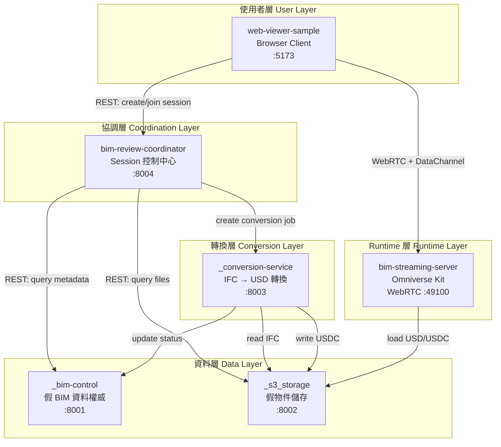

### 當前 Demo 5 步驟流程

| 步驟 | 功能 | 服務 | URL |
|---|---|---|---|
| ① 上傳建模 | 原始建模檔存在雲端 | `_s3_storage` | http://127.0.0.1:8002 |
| ② 自動轉換 | IFC → USD/USDC 轉換 | `_conversion-service` | http://127.0.0.1:8003 |
| ③ 建立會議 | 開啟審查 session | `bim-review-coordinator` | http://127.0.0.1:8004 |
| ④ 標記問題 | 3D 瀏覽與標記 | `web-viewer-sample` + Kit | http://127.0.0.1:5173 |
| ⑤ 紀錄回寫 | 審查紀錄保存 | `_bim-control` | http://127.0.0.1:8001 |

---

## 當前進度檢視

### ✅ 已完成 (Phase 0: 基礎設施化)

基於最近的 commit 歷史分析：

```bash
# 最近完成的功能
✓ GitNexus 產物清理與指令層整合
✓ Demo UI validation checks
✓ 審查互動流程展示強化
✓ 本地環境檔案配置
✓ stop-all 清除殘留服務功能
✓ coordinator 與 bim-control client fetch timeout 修正
```

### 🔄 進行中

- Phase 0 收尾：確保所有 5 個步驟的 UI 符合 `BIM_REVIEW_DEMO_UI_GUIDELINES.md`
- smoke test 覆蓋率提升
- 多人協作 Socket.IO 事件測試

### 📅 待規劃

- Phase 1: 核心功能穩定化（重點：缺失元件報告、質量閘門）
- Phase 2: 錯誤捕獲與容錯（Sentry、Callback 系統）
- Phase 3: SaaS 基礎建設（SSO、JWT、RBAC）
- Phase 4: 真實整合（真實 BIM platform API、S3/MinIO、GPU scheduler）
- Phase 5: Omniverse 串流最佳化
- Phase 6: Production 與 SaaS 部署

---

## 六大開發階段

### Phase 0: 基礎設施化 ✅ (Current)

**目標**：完成本地 PoC demo 閉環，所有 fake services 可運行

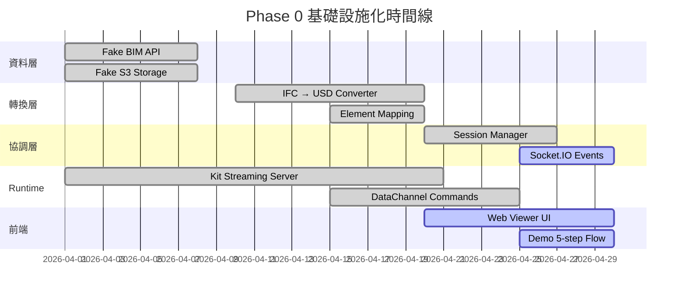

**交付物 Checklist**：

- [x] 5 個服務皆可啟動且健康檢查通過
- [x] `start-all.ps1` / `start-all.sh` 一鍵啟動腳本
- [x] 每個服務的 `/health` endpoint
- [ ] 完整 5 步驟 UI 符合 `BIM_REVIEW_DEMO_UI_GUIDELINES.md`
- [ ] `smoke-review-session.ps1` 測試通過
- [ ] `smoke-review-socket.ps1` 多人協作測試通過
- [ ] 至少 1 個完整 IFC → USDC → 瀏覽器審查 demo 流程

**驗收標準**：

```powershell
# 全部服務啟動
.\scripts\start-all.ps1

# 健康檢查
.\scripts\dev-health-check.ps1
# 預期輸出：所有服務 ●綠

# Smoke test
.\scripts\smoke-review-session.ps1
# 預期輸出：session 建立、artifacts 查詢、stream config 取得成功

# 多人協作測試
.\scripts\smoke-review-socket.ps1
# 預期輸出：兩個 client 可互相看到 presence、selection 事件
```

---

### Phase 1: 核心功能穩定化 🎯 (Next Priority)

**目標**：補足缺失元件報告、Starter Pack、質量閘門

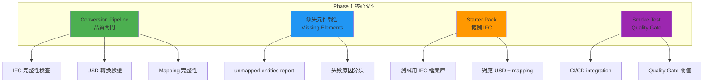

**重點任務**：

1. **Conversion Quality Gate**
   - IFC 讀取完整性檢查（ifcopenshell validation）
   - USD 轉換後 prim tree 完整性驗證
   - Element mapping coverage 計算（需 ≥ 95%）

2. **Missing Elements Report**
   - 列出 IFC GUID 有但 USD prim path 缺失的元件
   - 分類失敗原因（geometry error / unsupported type / converter bug）
   - 報告格式：JSON + HTML

3. **Starter Pack**
   - 提供 3~5 個測試用 IFC 檔案（不同複雜度）
   - 預先產出對應的 USD / mapping / review issue
   - Fake BIM API 預載這些 projects

4. **Smoke Test 擴充**
   - 新增 conversion quality gate 測試
   - 新增 mapping coverage 測試
   - CI/CD GitHub Actions workflow

**交付物 Checklist**：

- [ ] `_conversion-service/scripts/quality_gate_check.py` 實作
- [ ] `_conversion-service/app/reports/missing_elements.py` 實作
- [ ] `_fixtures/starter-pack/` 目錄建立，包含 3 個 IFC + USD
- [ ] `_bim-control/app/data/seed_starter_projects.py` 預載腳本
- [ ] `.github/workflows/quality-gate.yml` CI workflow
- [ ] `docs/plans/PHASE1_QUALITY_GATE_SPEC.md` 規格文件

**驗收標準**：

```bash
# Conversion quality gate
python _conversion-service/scripts/quality_gate_check.py \
  --ifc _fixtures/starter-pack/sample01.ifc \
  --usdc _fixtures/starter-pack/sample01.usdc \
  --mapping _fixtures/starter-pack/sample01_mapping.json

# 預期輸出：
# ✓ IFC entities: 1234
# ✓ USD prims: 1200
# ✓ Mapping coverage: 97.2% (threshold: 95%)
# ✓ Missing elements report: 34 items saved to report.json
# PASS
```

---

### Phase 2: 錯誤捕獲與容錯 🚨

**目標**：加入 Sentry、callback 系統、WebRTC 容錯、Kit 穩定性監控

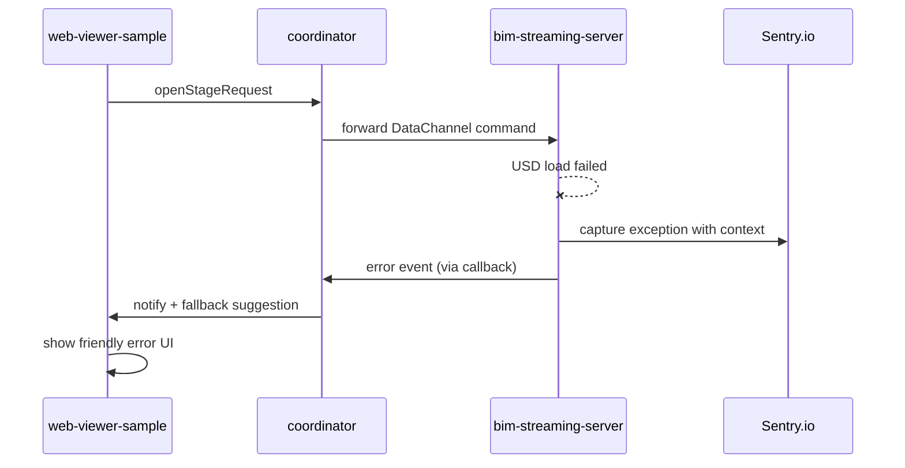

**重點任務**：

1. **Sentry Integration**
   - 所有服務（Python / Node / Kit）整合 Sentry SDK
   - 定義 error context tags（service、session_id、user_id、artifact_id）
   - 設定 sample rate 與 alert rules

2. **Callback / Notification Service**
   - 設計 webhook callback contract
   - coordinator 訂閱 conversion job status、Kit server status
   - WebSocket 推送即時狀態給 client

3. **WebRTC 容錯機制**
   - 檢測 "FrameGrabFailed" 等常見錯誤
   - 自動 retry + exponential backoff
   - 降級方案：static viewport snapshot

4. **Kit Stability Monitoring**
   - 收集 NvStreamer ETL logs
   - GPU memory / viewport render time metrics
   - 自動重啟邏輯（crash 超過 3 次則標記 unhealthy）

**交付物 Checklist**：

- [ ] `SENTRY_DSN` 環境變數配置（所有服務）
- [ ] `bim-review-coordinator/src/services/NotificationService.ts` 實作
- [ ] `docs/contracts/callback-webhook-api.md` 規格
- [ ] `bim-streaming-server/scripts/monitor_kit_health.ps1` 監控腳本
- [ ] `docs/plans/PHASE2_ERROR_HANDLING_STRATEGY.md`

**驗收標準**：

```bash
# 模擬 Kit crash 情境
.\bim-streaming-server\scripts\simulate_crash.ps1

# 預期行為：
# 1. Sentry 收到 error event
# 2. coordinator 透過 callback 被通知
# 3. coordinator 自動重啟 Kit server (最多 3 次)
# 4. web-viewer 顯示友善錯誤訊息
```

---

### Phase 3: SaaS 基礎建設 🔐

**目標**：SSO、JWT、RBAC、billing、audit log

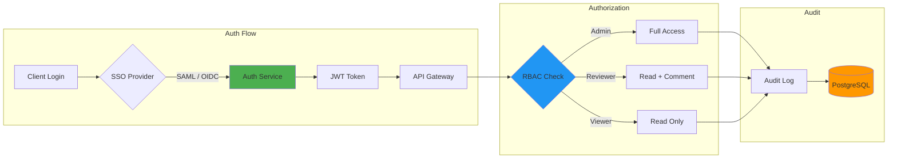

**重點任務**：

1. **SSO Integration**
   - 支援 SAML 2.0 / OIDC
   - 整合 Auth0 / Keycloak / Azure AD
   - Session 管理（Redis）

2. **JWT 與 API Key 認證**
   - coordinator 成為 API gateway
   - 所有 REST / Socket.IO / DataChannel 需驗證 token
   - Refresh token 機制

3. **RBAC 權限系統**
   - 角色定義：Admin / Project Manager / Reviewer / Viewer
   - 權限矩陣：project / model version / issue / annotation
   - coordinator 實作 permission middleware

4. **Billing 與 Usage Tracking**
   - 計量單位：GPU hours / storage GB / API calls
   - 整合 Stripe / 內部 billing service
   - Usage dashboard

5. **Audit Log**
   - 記錄所有 CRUD 操作（who / when / what / where）
   - PostgreSQL 保存 audit events
   - 法規遵循（GDPR / SOC 2）

**交付物 Checklist**：

- [ ] `bim-review-coordinator/src/middleware/authMiddleware.ts`
- [ ] `bim-review-coordinator/src/middleware/rbacMiddleware.ts`
- [ ] `docs/contracts/auth-api.md` SSO / JWT 規格
- [ ] `docs/contracts/rbac-permission-matrix.md` 權限矩陣
- [ ] `_bim-control/app/services/audit_log_service.py`
- [ ] PostgreSQL schema migration：`audit_events` table

**驗收標準**：

```bash
# 未登入訪問 API
curl http://localhost:8004/api/sessions
# 預期：401 Unauthorized

# 使用 JWT 訪問
curl -H "Authorization: Bearer <token>" http://localhost:8004/api/sessions
# 預期：200 OK + session list

# 無權限訪問
curl -H "Authorization: Bearer <viewer_token>" \
  -X DELETE http://localhost:8004/api/sessions/123
# 預期：403 Forbidden (Viewer 不可刪除 session)
```

---

### Phase 4: 真實整合 🔗

**目標**：取代 fake services，整合真實 BIM platform、S3/MinIO、GPU scheduler

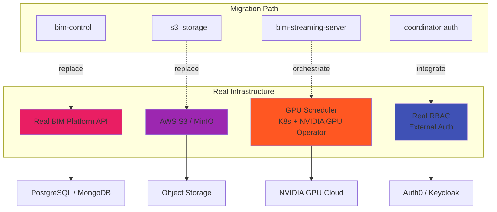

**重點任務**：

1. **BIM Platform API 整合**
   - 識別真實 BIM platform 的 API endpoints
   - 實作 adapter pattern：`coordinator` 透過 adapter 呼叫真實 API
   - 保留 fake service 作為 local dev fallback

2. **S3 / MinIO 整合**
   - 將 `_s3_storage` 的 HTTP static server 切換為真實 object storage
   - 支援 pre-signed URL upload / download
   - CDN 整合（CloudFront / Cloudflare）

3. **GPU Scheduler 整合**
   - Kit server 不再手動啟動，改由 K8s Job / Pod 管理
   - coordinator 透過 K8s API 建立 Kit pod
   - GPU resource quotas 與 auto-scaling

4. **Conversion Pipeline 雲端化**
   - `_conversion-service` 改為 async worker（Celery / Redis / RabbitMQ）
   - 支援 horizontal scaling（多個 worker instances）
   - 進度追蹤與 callback

**技術選型**：

| 元件 | 選項 A | 選項 B | 推薦 |
|---|---|---|---|
| Object Storage | AWS S3 | MinIO self-hosted | 取決於 SaaS 或 On-Premise |
| GPU Scheduler | K8s + NVIDIA GPU Operator | NVIDIA GPU Cloud | K8s（靈活性）|
| Message Queue | Redis | RabbitMQ / Kafka | Redis（簡單）|
| Async Worker | Celery | Bull (Node) | Celery（Python conversion service）|
| Auth Provider | Auth0 | Keycloak self-hosted | Auth0（SaaS 快速）|

**交付物 Checklist**：

- [ ] `bim-review-coordinator/src/adapters/BimPlatformAdapter.ts` 介面定義
- [ ] `bim-review-coordinator/src/adapters/RealBimPlatformAdapter.ts` 真實實作
- [ ] `_conversion-service/app/workers/celery_worker.py` Celery worker
- [ ] `bim-review-coordinator/src/services/GpuSchedulerService.ts` K8s client
- [ ] `docs/deployment/K8S_GPU_DEPLOYMENT.md` K8s 部署文件
- [ ] `docs/contracts/real-bim-platform-api-mapping.md` API 對照表

**驗收標準**：

```bash
# 1. 真實 BIM API 查詢
curl http://localhost:8004/api/projects?use_real_api=true
# 預期：返回真實 BIM platform 的 projects，不是 fake data

# 2. S3 upload
curl -X POST http://localhost:8004/api/artifacts/upload-url \
  -d '{"filename": "test.ifc"}'
# 預期：返回 S3 pre-signed URL

# 3. GPU scheduler 建立 Kit pod
curl -X POST http://localhost:8004/api/streaming/start \
  -d '{"session_id": "123"}'
# 預期：K8s 中出現新的 Kit pod，狀態 Running
```

---

### Phase 5: Omniverse 串流最佳化 🎨

**目標**：HDR / RTX / MDL、multi-viewport、PhysX、highlight / overlay 視覺品質

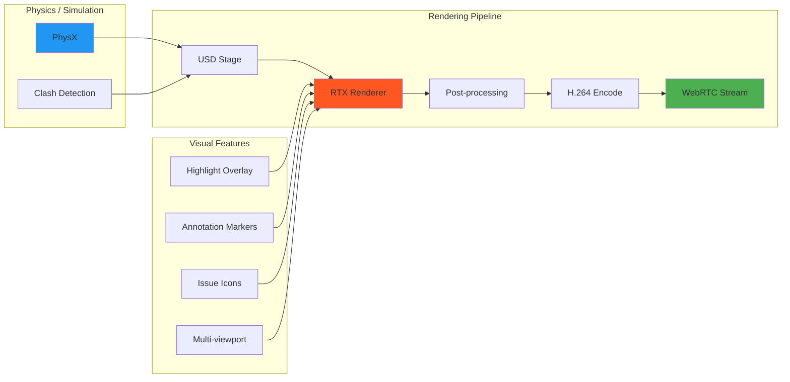

**重點任務**：

1. **RTX Real-time Ray Tracing**
   - 啟用 RTX renderer（目前可能用 raster）
   - 調整 samples per pixel、max bounces
   - 平衡畫質與幀率（目標 30 FPS）

2. **Highlight / Overlay 視覺品質**
   - 改善 `highlightPrimsRequest` 的視覺效果
   - 支援半透明 overlay、邊緣高亮、閃爍動畫
   - Annotation 3D marker（球形 / 箭頭 / 文字）

3. **Multi-viewport Support**
   - 同一 Kit instance 支援多個 camera view
   - DataChannel 指令：`setCameraView { name: "top" | "front" | "perspective" }`
   - Web viewer 可切換視角

4. **MDL 材質與照明**
   - 支援自訂 MDL 材質
   - HDRI 環境照明
   - 光源編輯（directional / point / area light）

5. **PhysX Integration**
   - 碰撞檢測（clash detection）
   - 重力模擬（optional，for 構件掉落檢測）
   - 結果輸出為 issue list

**交付物 Checklist**：

- [ ] `bim-streaming-server/source/extensions/ezplus.bim_review_stream.rtx/` RTX 設定
- [ ] `bim-streaming-server/source/extensions/ezplus.bim_review_stream.highlight/` 視覺效果強化
- [ ] `docs/contracts/datachannel-camera-view-api.md` Multi-viewport 規格
- [ ] `docs/plans/PHASE5_RTX_OPTIMIZATION.md` RTX 調優文件
- [ ] `bim-streaming-server/scripts/benchmark_rendering.ps1` 效能測試

**驗收標準**：

```bash
# RTX rendering benchmark
.\bim-streaming-server\scripts\benchmark_rendering.ps1 \
  --usd sample.usdc \
  --renderer rtx

# 預期輸出：
# ✓ Average FPS: 28.5
# ✓ Frame time p95: 35ms
# ✓ GPU utilization: 78%
# PASS (target: FPS ≥ 25)

# Visual quality check（需人工檢視）
# 1. highlight 半透明 overlay 正確顯示
# 2. annotation marker 清晰可見
# 3. 切換 camera view 流暢無卡頓
```

---

### Phase 6: Production 與 SaaS 部署 🚀

**目標**：CI/CD、Container / K8s、observability、災難復原、SLO / SLA

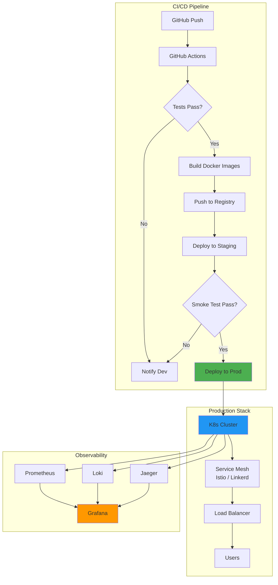

**重點任務**：

1. **Containerization**
   - 每個服務建立 Dockerfile（multi-stage build）
   - Docker Compose for local dev
   - 優化 image size（Alpine / distroless）

2. **K8s 部署**
   - Helm charts for all services
   - ConfigMap / Secret 管理
   - Horizontal Pod Autoscaler（HPA）
   - GPU node pool for Kit server

3. **CI/CD Pipeline**
   - GitHub Actions workflows（test / build / deploy）
   - Staging → Production promotion
   - Blue-green deployment 或 Canary release

4. **Observability**
   - Metrics: Prometheus + Grafana
   - Logs: Loki / ELK
   - Tracing: Jaeger / Tempo
   - Uptime monitoring: Pingdom / UptimeRobot

5. **災難復原與備份**
   - PostgreSQL 定期備份（AWS RDS automated backup）
   - S3 versioning 與 lifecycle policy
   - Multi-region replication（optional）

6. **SLO / SLA 定義**
   - Uptime SLA: 99.5%（允許 monthly downtime < 3.6 hours）
   - API response time: p95 < 500ms
   - Streaming latency: p95 < 100ms
   - Conversion job: 95% 完成於 60 秒內

**交付物 Checklist**：

- [ ] `Dockerfile` for all 5 services
- [ ] `docker-compose.yml` for local multi-service dev
- [ ] `k8s/` Helm charts
- [ ] `.github/workflows/ci-cd.yml` GitHub Actions
- [ ] `k8s/monitoring/` Prometheus / Grafana configs
- [ ] `docs/deployment/PRODUCTION_DEPLOYMENT.md` 部署手冊
- [ ] `docs/operations/RUNBOOK.md` 維運手冊
- [ ] `docs/sla/SLO_SLA_DEFINITIONS.md`

**驗收標準**：

```bash
# 1. Docker build 所有服務
docker-compose build

# 2. 本地 K8s 部署（minikube / kind）
helm install bim-review ./k8s/charts/bim-review

# 3. Smoke test in K8s
kubectl port-forward svc/bim-review-coordinator 8004:8004
curl http://localhost:8004/health
# 預期：200 OK

# 4. Observability check
kubectl port-forward svc/grafana 3000:3000
# 打開 http://localhost:3000 查看 dashboard，確認所有 metrics 正常

# 5. Load test
k6 run scripts/load-test.js --vus 100 --duration 5m
# 預期：p95 response time < 500ms, error rate < 1%
```

---

## 技術架構演進路徑

### 當前 PoC 架構 (Phase 0)

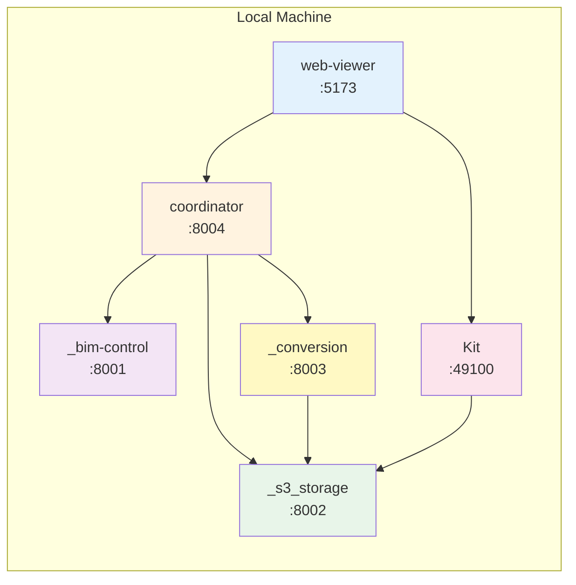

**特點**：
- 單機運行，fake services
- 無認證授權
- 無 load balancing
- 適合 demo 與本地開發

---

### 目標 SaaS 架構 (Phase 6)

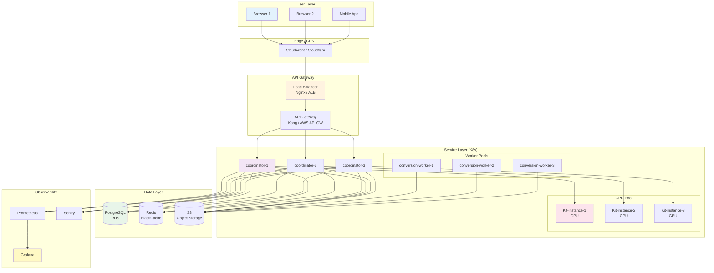

**特點**：
- Multi-region / multi-AZ deployment
- Horizontal scaling（coordinator / worker / Kit）
- Managed services（RDS / ElastiCache / S3）
- Service mesh（optional: Istio）
- 完整 observability

---

## 資料流與 API 設計

### 核心資料流：Artifact Discovery

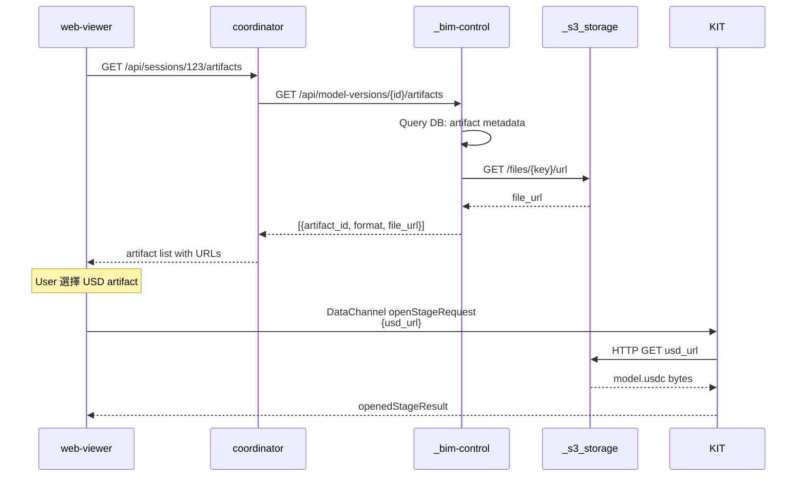

### 核心資料流：Conversion Job

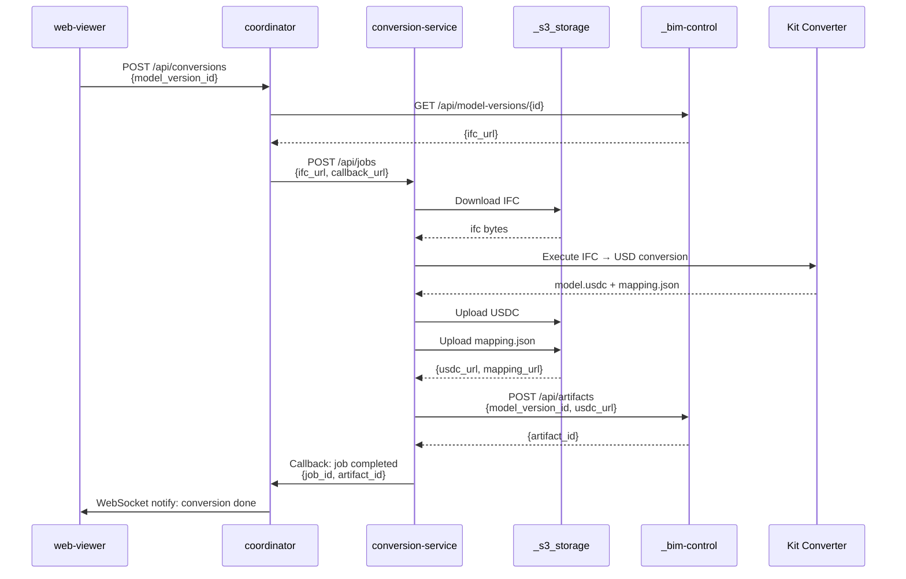

### 核心資料流：Review Collaboration

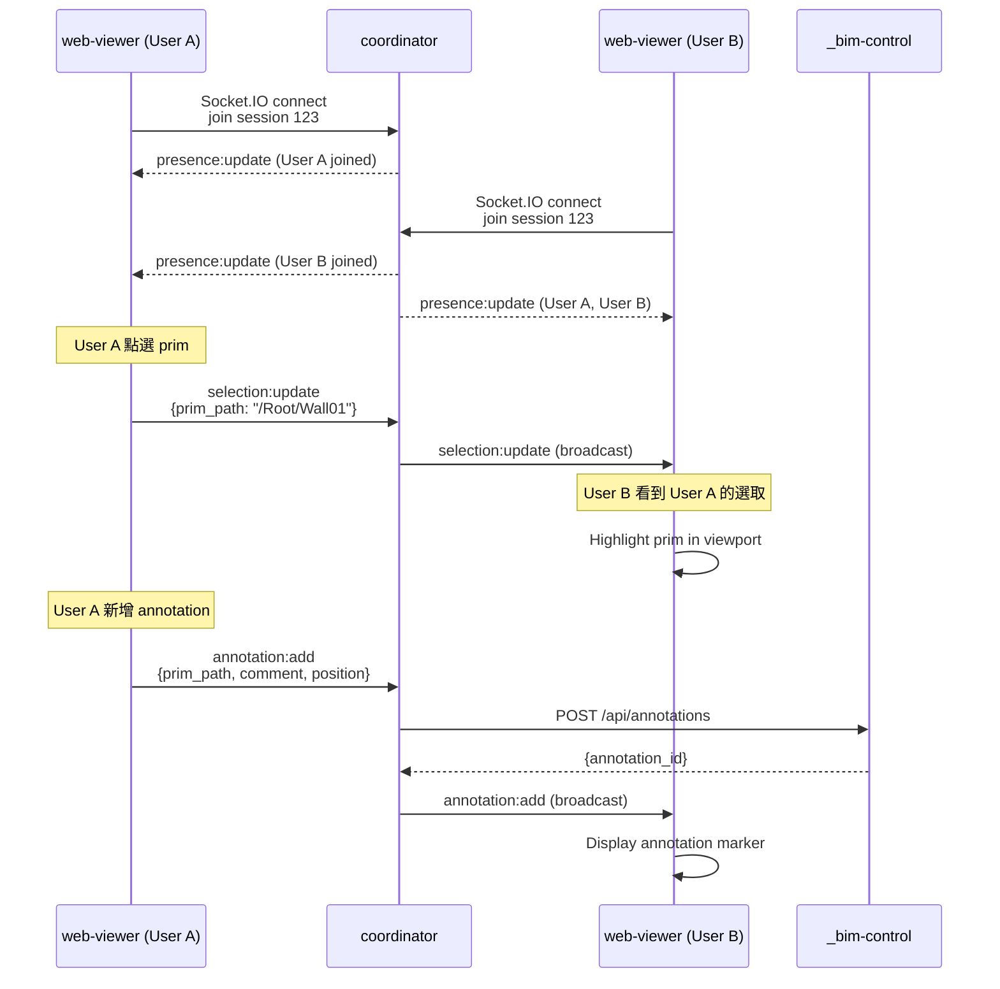

---

## 測試與品質保證策略

### 測試金字塔

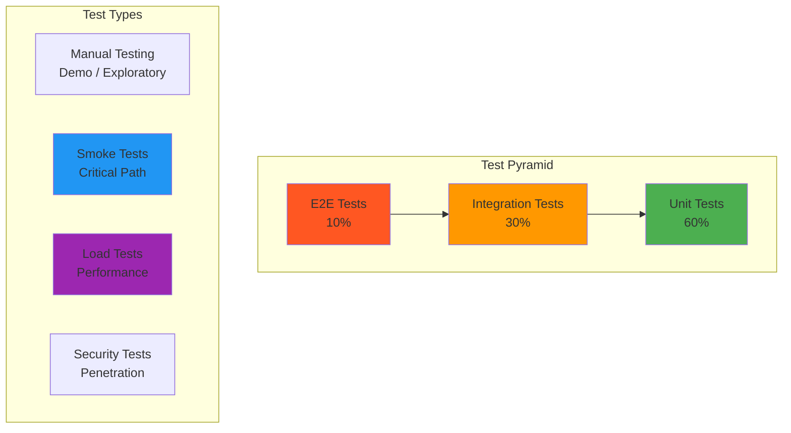

### 單元測試 (Unit Tests)

**目標覆蓋率**：≥ 80%

**範圍**：

- Python services:
  - `_bim-control/tests/` (pytest)
  - `_s3_storage/tests/` (pytest)
  - `_conversion-service/tests/` (pytest)

- Node services:
  - `bim-review-coordinator/tests/` (Jest / Mocha)
  - `web-viewer-sample/tests/` (Vitest)

**執行方式**：

```bash
# Python
cd _bim-control && python -m pytest tests/ --cov=app --cov-report=html

# Node
cd bim-review-coordinator && npm test -- --coverage
```

---

### 整合測試 (Integration Tests)

**目標**：測試服務間互動

**範圍**：

- coordinator ↔ _bim-control API 整合
- coordinator ↔ _s3_storage API 整合
- web-viewer ↔ coordinator REST + Socket.IO 整合
- conversion-service ↔ S3 ↔ bim-control 全流程

**執行方式**：

```bash
# 先啟動所有服務
.\scripts\start-all.ps1

# 執行整合測試
npm run test:integration
```

---

### E2E 測試 (End-to-End Tests)

**工具**：Playwright / Cypress

**測試情境**：

1. **5-step demo flow**：
   - 打開 step 1 (8002) → 確認 IFC 檔案列表
   - 打開 step 2 (8003) → 建立 conversion job → 等待完成
   - 打開 step 3 (8004) → 建立 review session
   - 打開 step 4 (5173) → WebRTC 連線 → 選取 prim → 高亮顯示
   - 打開 step 5 (8001) → 確認 annotation 已保存

2. **Multi-user collaboration**：
   - 兩個 browser session 加入同一 review session
   - User A 點選 prim → User B 看到選取事件
   - User B 新增 annotation → User A 看到 marker

**執行方式**：

```bash
npm run test:e2e
```

---

### Smoke Tests

**定義**：快速驗證核心功能是否正常

**腳本**：

- `scripts/dev-health-check.ps1`：所有服務健康檢查
- `scripts/smoke-review-session.ps1`：建立 session + 查詢 artifacts
- `scripts/smoke-review-socket.ps1`：Socket.IO 多人協作
- `_conversion-service/scripts/smoke_conversion.ps1`：IFC → USD 轉換

**執行頻率**：

- Local dev：每次 PR 前執行
- CI/CD：每次 push 自動執行

---

### Load Tests (效能測試)

**工具**：k6 / Locust / Artillery

**測試情境**：

1. **API 負載測試**：
   - 100 concurrent users
   - 每秒 500 requests
   - 持續 5 分鐘
   - 目標：p95 < 500ms, error rate < 1%

2. **WebRTC streaming 負載測試**：
   - 50 concurrent streaming sessions
   - 每個 session 持續 10 分鐘
   - 目標：p95 latency < 100ms, FPS ≥ 25

**執行方式**：

```bash
k6 run scripts/load-test-api.js --vus 100 --duration 5m
k6 run scripts/load-test-streaming.js --vus 50 --duration 10m
```

---

### Quality Gate (品質閘門)

**CI/CD 流程中強制檢查**：

- [ ] 所有 unit tests 通過
- [ ] Code coverage ≥ 80%
- [ ] Lint 檢查通過（ESLint / Pylint）
- [ ] Security scan 通過（Snyk / Trivy）
- [ ] Conversion quality gate：mapping coverage ≥ 95%
- [ ] Smoke tests 通過

**不通過則 PR 不可 merge**。

---

## 部署與維運計畫

### 本地開發環境 (Local Dev)

```bash
# 一鍵啟動
.\scripts\start-all.ps1

# 服務 URL
http://127.0.0.1:8001  # _bim-control
http://127.0.0.1:8002  # _s3_storage
http://127.0.0.1:8003  # _conversion-service
http://127.0.0.1:8004  # bim-review-coordinator
http://127.0.0.1:5173  # web-viewer-sample
WebRTC :49100          # bim-streaming-server
```

---

### Staging 環境

**目的**：模擬 production，但使用較小規模的資源

**部署方式**：

- Docker Compose 或 K8s (minikube / kind)
- 使用 fake services，但資料庫改為真實 PostgreSQL
- 開啟 Sentry / Prometheus 監控

**驗證**：

- 執行完整 E2E tests
- 執行 smoke tests
- Manual QA testing

---

### Production 環境

**部署方式**：

- Kubernetes (EKS / GKE / AKS)
- Helm charts deployment
- Blue-green 或 Canary release

**Infrastructure as Code**：

```bash
# Terraform / Pulumi
cd infra/
terraform apply

# Helm deployment
helm upgrade --install bim-review ./k8s/charts/bim-review \
  --namespace production \
  --values k8s/values-production.yaml
```

**Rollback 策略**：

```bash
# 回退到上一個版本
helm rollback bim-review
```

---

### Monitoring & Alerting

**Metrics (Prometheus)**：

- Service uptime
- API response time (p50 / p95 / p99)
- Error rate (4xx / 5xx)
- WebRTC streaming: FPS、latency、packet loss
- GPU utilization
- Conversion job: success rate、average duration

**Logs (Loki / ELK)**：

- Structured JSON logs
- Correlation ID for distributed tracing
- Error stack traces

**Alerts (PagerDuty / Opsgenie)**：

- Service down > 5 minutes
- Error rate > 5% for 10 minutes
- API p95 > 1s for 5 minutes
- GPU utilization > 90% for 15 minutes

**Dashboard (Grafana)**：

- Service health overview
- API performance
- Conversion pipeline metrics
- WebRTC streaming quality

---

## 團隊協作流程

### Git Branching 策略

```mermaid
gitgraph
    commit id: "initial"
    branch develop
    checkout develop
    commit id: "feat: coordinator session API"
    
    branch feature/phase1-quality-gate
    checkout feature/phase1-quality-gate
    commit id: "feat: quality gate check"
    commit id: "test: add quality gate tests"
    
    checkout develop
    merge feature/phase1-quality-gate
    
    branch feature/phase2-sentry
    checkout feature/phase2-sentry
    commit id: "feat: integrate Sentry"
    commit id: "docs: add error handling strategy"
    
    checkout develop
    merge feature/phase2-sentry
    
    checkout main
    merge develop tag: "v0.2.0"
```

**分支規則**：

- `main`：production-ready code
- `develop`：integration branch
- `feature/*`：新功能開發
- `fix/*`：bug 修復
- `hotfix/*`：緊急修復（直接從 main 切出）

---

### PR Review Checklist

- [ ] 符合 coding style（ESLint / Pylint / Prettier）
- [ ] 有單元測試且覆蓋率 ≥ 80%
- [ ] 有整合測試（如涉及跨服務互動）
- [ ] 更新相關文件（README / API contract / wiki）
- [ ] 通過 CI/CD pipeline（所有 quality gate）
- [ ] 至少 1 人 approve（core team member）
- [ ] 若涉及 UI 變更，需符合 `BIM_REVIEW_DEMO_UI_GUIDELINES.md`

---

### 文件更新規範

**必須同步更新的文件**：

| 變更類型 | 需更新文件 |
|---|---|
| 新增 API endpoint | `docs/contracts/<service>-api.md` |
| 修改 Socket.IO event | `docs/contracts/coordinator-socket-events.md` |
| 修改 DataChannel command | `docs/contracts/datachannel-api.md` |
| 新增環境變數 | `.env.example`、`docs/contracts/local-dev-runbook.md` |
| 重大架構變更 | `AGENTS.md`、`README.md` |
| 新增 smoke test | `README.md` "驗證命令" 章節 |

---

## 附錄：參考文件

### 核心規格文件

- `AGENTS.md`：服務邊界與責任劃分
- `docs/plans/BIM_REVIEW_DEMO_UI_GUIDELINES.md`：Demo UI 設計守則
- `docs/contracts/bim-control-fake-api.md`：BIM 主資料庫 API
- `docs/contracts/conversion-api.md`：模型轉換 API
- `docs/contracts/coordinator-socket-events.md`：Socket.IO 事件定義
- `docs/contracts/local-dev-runbook.md`：本地開發手冊

### Wiki 輔助文件

- `docs/wiki/graphify/GRAPH_REPORT.md`：Graphify 知識圖
- `docs/wiki/graphify/graph.html`：互動式知識圖

### 範例 IFC 檔案

- `_fixtures/starter-pack/sample01.ifc`
- `bim-streaming-server/bim-models/`

---

## 總結與 Next Steps

### 當前狀態 (Phase 0) ✅

- 5 個服務可運行
- 完整 demo 5-step flow
- 基礎 smoke tests

### 下一步優先級 (Phase 1) 🎯

1. **Conversion quality gate**：確保 IFC → USD 品質
2. **Missing elements report**：可視化轉換缺失
3. **Starter pack**：提供標準測試資料
4. **CI/CD integration**：自動化測試與部署

### 中長期目標 (Phase 2-6) 🚀

- Phase 2: 錯誤捕獲與監控
- Phase 3: SaaS 基礎建設（Auth、RBAC、Billing）
- Phase 4: 真實整合（去除 fake services）
- Phase 5: Omniverse 視覺品質提升
- Phase 6: Production 部署與 SLO/SLA

---

**文件版本**：v1.0  
**最後更新**：2026-05-06  
**負責人**：Development Team  
**審查週期**：每個 Phase 結束後更新
