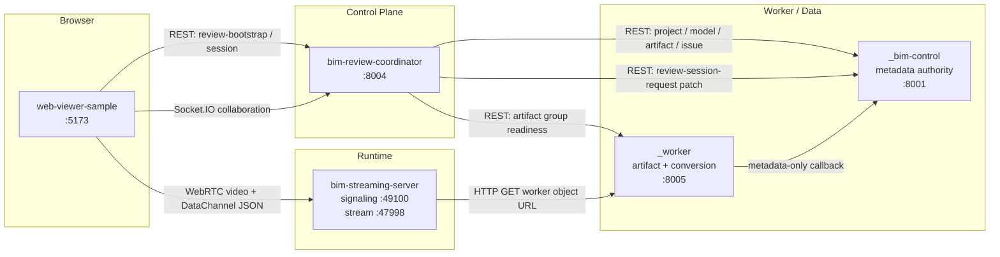
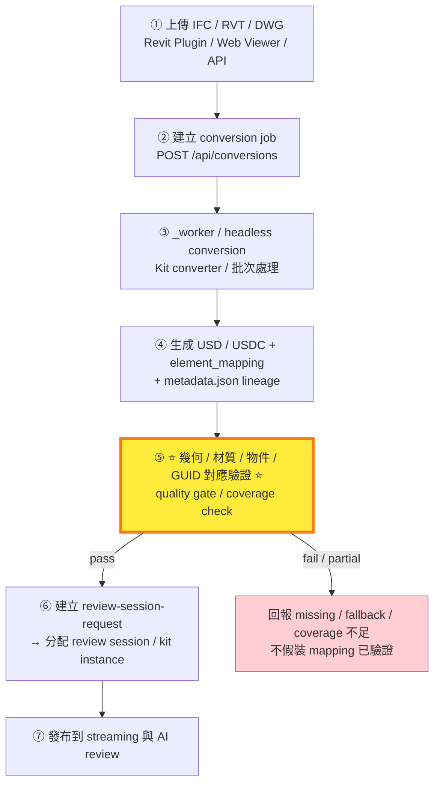
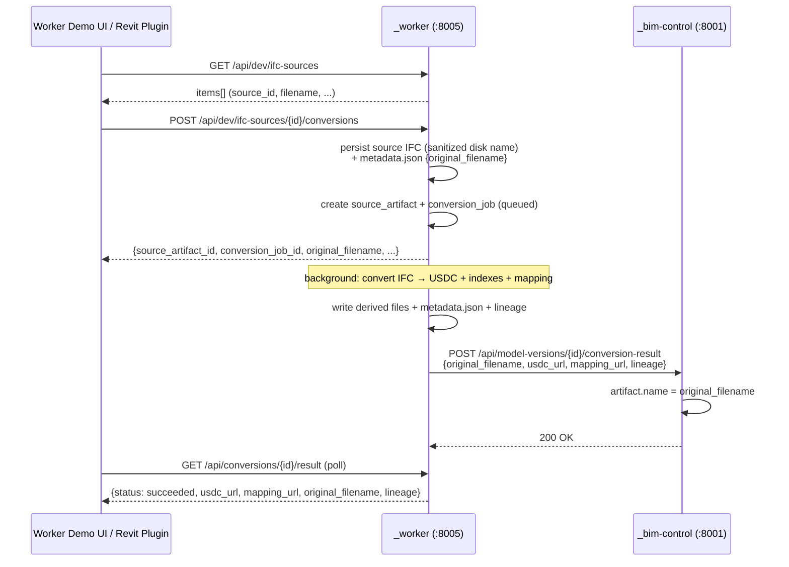
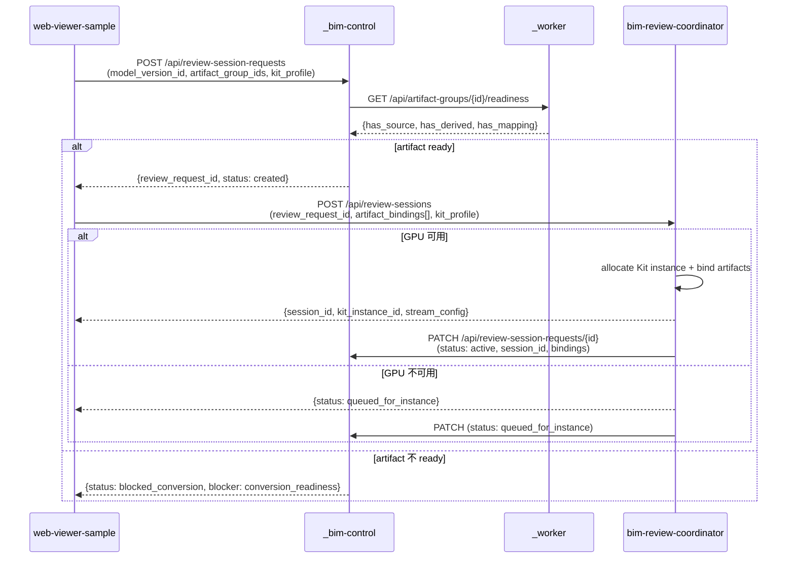
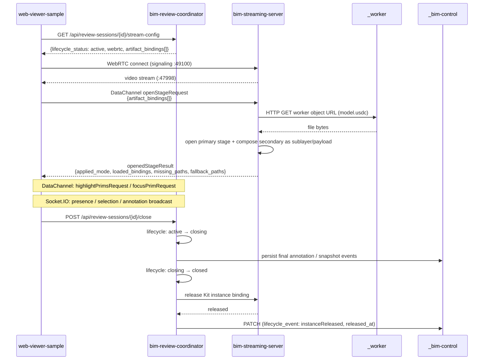
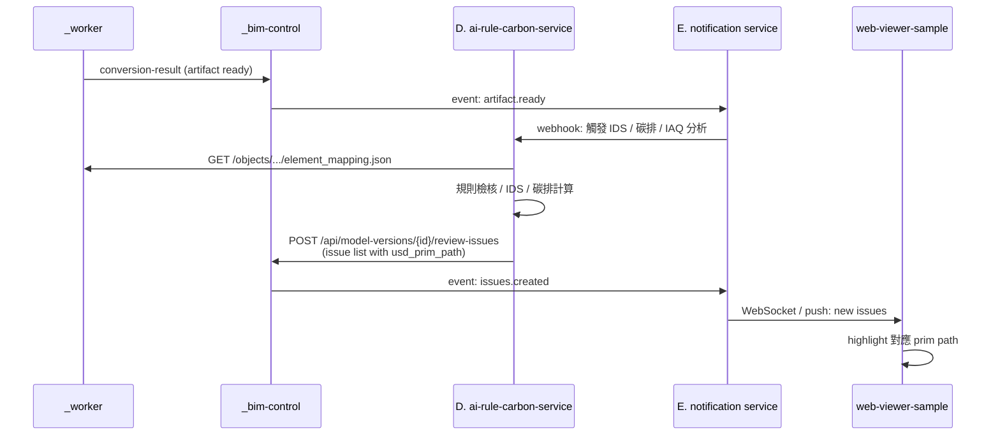

# AI-BIM-governance 專案開發流程 v3

> **依新版架構圖 v1（PoC → SaaS 路線圖）+ v2（SaaS 級目標架構與落地順序）重寫。**
>
> 本次調整核心：**把 Omniverse 能力發揮到最大**（擬真建築、真實物理、環境感測、模擬驅動 AI 分析），並把 `_worker` 收檔案與轉檔流程、review session request、session lifecycle、多 artifact / 多 instance 收進正式控制面。
>
> **本文件 = 開發流程入口**；OpenSpec 候選編號（#1-#9 / #1A / #2A）、NVIDIA Reference 採用決策矩陣、MCP 查詢結果、§11.4 Multi-Kit Instance 並行的官方定義、硬體配置（§9.0-§9.8）以 [SaaS 路線圖 2026-05](plans/AI-BIM-governance-saas-roadmap-2026-05.md) 為準，本文件不重述。
>
> **本文件不取代 source of truth**：
> - Repo 邊界 → [`AGENTS.md`](../AGENTS.md)
> - Capability requirements → [`openspec/specs/`](../openspec/specs/) 10 份 spec
> - API 規格 → [`docs/contracts/`](contracts/) 7 份合約
> - 驗證證據 → [`docs/verification/`](verification/)
> - **SaaS 路線圖（OpenSpec 候選 / NVIDIA 採用決策 / 硬體配置）** → [SaaS 路線圖 2026-05](plans/AI-BIM-governance-saas-roadmap-2026-05.md)
>
> 本文件是把它們組合成可執行的開發路線。

---

## 目錄

1. [專案目標與架構視野](#1-專案目標與架構視野)
2. [7 層目標架構（v2 圖）](#2-7-層目標架構v2-圖)
3. [當前 Runtime 架構（worker-only）](#3-當前-runtime-架構worker-only)
4. [當前進度檢視 + 驗證證據分層](#4-當前進度檢視--驗證證據分層)
5. [主要風險 / 缺口](#5-主要風險--缺口)
6. [IFC → USD 品質保證管線](#6-ifc--usd-品質保證管線)
7. [六大階段執行路線圖](#7-六大階段執行路線圖)
8. [每階段驗收 KPI](#8-每階段驗收-kpi)
9. [核心資料流](#9-核心資料流)
10. [Source of Truth 與文件對應表](#10-source-of-truth-與文件對應表)
11. [開發協作流程](#11-開發協作流程)
12. [下一步行動建議](#12-下一步行動建議)

---

## 1. 專案目標與架構視野

### 1.1 終極目標

把目前本地 PoC（IFC → USDC → 串流審查 → 多人協作 → 紀錄回寫）升級為**多租戶、高吞吐、可商轉、可審核、可灰度上線的 BIM Streaming + AI Review SaaS Platform**。

### 1.2 為什麼是 Omniverse + AI Review

1. **Omniverse 提供 RTX、PhysX、MDL、Sensor simulation** → 可同時做擬真建築、真實物理、環境感測、能耗模擬
2. **DataChannel + WebRTC** → 瀏覽器原生即時 3D 串流，無需 Plugin
3. **USD 是 Pixar 開源、業界標準** → 可與 Revit / IFC / DWG / 各家 BIM 工具互通
4. **能在 USD 層做語意化 highlight / overlay / clash result** → AI 規則檢核 / 法規 / 碳排可在同一視覺平面呈現

### 1.3 目前架構哲學（不可動搖的邊界）

> 完整定義以 [`AGENTS.md`](../AGENTS.md) 為準。

```txt
資料權威            → _bim-control（metadata-only）
檔案 + 轉檔邊界     → _worker（artifact + conversion facade）
Session / 協作      → bim-review-coordinator
3D runtime          → bim-streaming-server（Kit + WebRTC + USD stage）
使用者操作          → web-viewer-sample（browser）
```

---

## 2. 7 層目標架構（v2 圖）

> 對應架構圖 v2 的層次劃分。從上到下：使用者 → Portal → 業務服務 → Omniverse runtime → 平台能力 → DevOps。

### 2.1 七層概覽

```mermaid
flowchart TB
    subgraph L1["① 使用者與權限層"]
        U1[管理員] & U2[建築師] & U3[審查員] & U4[住戶] & U5[維護人員]
        T[公司 → 租戶 → 區 → 棟 → 戶 → 號]
        AUTH[SSO / JWT / RBAC / API Key]
    end
    subgraph L2["② Client / Portal 層"]
        RP[Revit Plugin<br/>IFC Upload]
        WV[Web Viewer App<br/>web-viewer-sample 演進]
        AC[Admin Console<br/>Demo UI]
        EX[External API /<br/>Webhook Consumer]
    end
    subgraph L3["③ 核心業務服務層"]
        A[A. bim-control<br/>metadata authority]
        B[B. _worker<br/>artifact + conversion facade]
        C[C. bim-review-coordinator<br/>session / collaboration]
        D[D. ai-rule-carbon-service<br/>規則 / IDS / 碳排 / IAQ]
        E[E. notification / webhook<br/>callback / 事件通知]
    end
    subgraph L4["④ Omniverse Runtime / Simulation 層"]
        S1[bim-streaming-server cluster<br/>水平擴展]
        S2[USD Stage Manager<br/>artifact loading]
        S3[WebRTC + DataChannel command]
        S4[Highlight / Overlay /<br/>Clash result overlay]
        S5[RTX Renderer / PhysX /<br/>MDL / Sensor simulation]
    end
    subgraph L5["⑤ 平台能力層"]
        P1[API Gateway]
        P2[Queue / Event Bus]
        P3[Redis Cache]
        P4[Postgres]
        P5[Object Storage<br/>S3 / MinIO]
        P6[Vector / Search]
        P7[Billing / Usage Metering]
        P8[Audit Log /<br/>Observability / Trace]
        P9[Scheduler /<br/>GPU Pool / Autoscaling]
    end
    subgraph L6["⑥ DevOps / 營運治理層"]
        D1[GitHub Actions CI/CD]
        D2[Test Matrix /<br/>Smoke / Contract / E2E]
        D3[Container / K8s /<br/>NVIDIA GPU deployment]
        D4[Backup / DR /<br/>Security / Compliance]
        D5[SLA / SLO /<br/>Incident Response]
    end

    L1 --> L2 --> L3 --> L4 --> L5
    L6 -.支撐.-> L5
    L6 -.支撐.-> L4
    L6 -.支撐.-> L3
```



### 2.2 各層責任邊界

#### ① 使用者與權限層

| 元素 | 內容 | 規劃 phase |
|---|---|---|
| 角色 | 管理員 / 建築師 / 審查員 / 住戶 / 維護人員 | Phase 6 |
| 權限階層（由高到低） | 公司 → 租戶 → 區 → 棟 → 戶 → 號 | Phase 6 |
| 認證方式 | SSO（SAML / OIDC）、JWT、RBAC、API Key | Phase 6 |

> **目前 PoC 階段沒有任何認證**；所有 service 直接 `127.0.0.1` 開放。Phase 6 才會加入。

#### ② Client / Portal 層

| Portal | 角色 | 對應現有實作 | 規劃 phase |
|---|---|---|---|
| **Revit Plugin** | 在 Revit 內直接上傳 IFC/RVT/DWG | 尚無 | Phase 5（規格）/ Phase 6（落地） |
| **Web Viewer App** | 瀏覽器審查端，從 PoC `web-viewer-sample` 演進 | `web-viewer-sample/` ✅ | 持續演進 |
| **Admin Console / Demo UI** | 管理員後台、demo UI（demo flow 步驟條） | `_worker/` `_bim-control/` `bim-review-coordinator/` UI ✅ | Phase 6（升級為 Admin Console） |
| **External API / Webhook Consumer** | 第三方系統訂閱 review event / 對接 workflow | 尚無 | Phase 4（基礎）/ Phase 6（正式 API） |

#### ③ 核心業務服務層（5 個）

| 服務 | 角色 | 現有狀態 | 主要 capability spec |
|---|---|---|---|
| **A. `_bim-control/`** | metadata 權威、project/version/artifact group/issue/annotation/review request 認證 | ✅ runtime（:8001） | `review-session-request-lifecycle` |
| **B. `_worker/`** | upload API + artifact registry + versioned storage facade + conversion job + USD/USDC + mapping + callback workflow + source/version/lineage 模型 | ✅ runtime（:8005） | `worker-artifact-pipeline`, `worker-dev-ifc-source-selection`, `worker-demo-upload-convert-ui` |
| **C. `bim-review-coordinator/`** | review session / session lifecycle、KitInstancePool、presence / selection / annotation、issue focus、multi-artifact / multi-instance binding | ✅ runtime（:8004） | `multi-artifact-kit-routing`, `session-first-review-viewer` |
| **D. `ai-rule-carbon-service/`** | IDS / code check、carbon / IAQ / HVAC、compliance、prediction、report API | 📅 尚無 | 待規劃（Phase 5） |
| **E. `notification / webhook service/`** | callback、事件通知、外部系統整合 | 📅 尚無（callback 邏輯目前散在 `_worker` 與 coordinator） | 待規劃（Phase 4） |

#### ④ Omniverse Runtime / Simulation 層

| 元素 | 內容 | 對應 capability |
|---|---|---|
| `bim-streaming-server cluster` | Kit runtime 高可用 / 水平擴展 | `multi-artifact-kit-routing` |
| USD Stage Manager | artifact loading / stage 管理 / 版本控制 | `streaming-multi-layer-payload-loading` |
| WebRTC + DataChannel command | 即時指令 / 低延運 | `streaming-multi-layer-payload-loading` |
| Highlight / Overlay / Clash result overlay | 多層結果即時疊加 | （待 Phase 5 spec） |
| **RTX Renderer / PhysX / MDL / Sensor simulation** | 高層真品質 / 物理 / 材質 / 環境感測模擬 ⭐ Omniverse 能力最大化 | （待 Phase 5 spec） |

#### ⑤ 平台能力層（所有服務依賴）

| 元素 | 用途 | 規劃 phase |
|---|---|---|
| API Gateway | 統一入口、rate limit、auth header、CORS | Phase 4–6 |
| Queue / Event Bus | 非同步 conversion / AI / notification | Phase 4 |
| Redis Cache | session presence、artifact metadata、readiness | Phase 4 |
| Postgres | 取代 `_bim-control` 的 file-based store | Phase 4 |
| **Object Storage（不再混淆 `_s3_storage` 邊界）** | `_worker` 物件本體存放（local: filesystem，prod: S3 / MinIO） | Phase 4（抽象層） |
| Vector / Search（可選） | 大型 model 跨 project search、語意搜尋 | Phase 5 |
| Billing / Usage Metering | GPU hours / storage GB / API calls / conversion jobs | Phase 6 |
| Audit Log / Observability / Trace | Prometheus / Grafana / Loki / Jaeger / Sentry | Phase 6 |
| Scheduler / GPU Pool / Autoscaling | Kit instance 動態分配、K8s + NVIDIA GPU Operator | Phase 4–6 |

#### ⑥ DevOps / 營運治理層

| 元素 | 用途 | 現況 |
|---|---|---|
| GitHub Actions CI/CD | lint → test → build → deploy | 📅 `.github/workflows/` 目前是空的，需建 |
| Test Matrix / Smoke / Contract / E2E | 多層次測試矩陣 | ✅ 已有 smoke + contract 部分；E2E 部分驗證 |
| Container / K8s / NVIDIA GPU deployment | 容器化、GPU node pool | 📅 待 Phase 6 |
| Backup / DR / Security / Compliance | 資料備份、災難復原、安全合規 | 📅 待 Phase 6 |
| SLA / SLO / Incident Response | 服務水準、事件應對 | 📅 待 Phase 6 |

---

## 3. 當前 Runtime 架構（worker-only）

> 所有 commit 已 merge 進 `main`。完整邊界以 [`AGENTS.md`](../AGENTS.md) 為準。

### 3.1 服務清單

| 服務 | 角色 | Port | Demo 步驟 |
|---|---|---|---|
| `_bim-control/` | Fake BIM Data Authority（metadata-only） | 8001 | ⑤ 紀錄回寫 |
| `_worker/` | Artifact + Conversion Facade（檔案與轉檔邊界） | 8005 | ① 上傳建模 + ② 自動轉換 |
| `bim-review-coordinator/` | Session / Collaboration Control Plane | 8004 | ③ 建立會議 |
| `bim-streaming-server/` | Omniverse Kit Runtime / WebRTC | 49100 (signaling) / 47998 (stream) | ④ 標記問題（背景） |
| `web-viewer-sample/` | Browser Client / WebRTC Viewer | 5173 | ④ 標記問題（前景） |

> **退役服務**：`_s3_storage`（8002）、`_conversion-service`（8003）、`_conversion-server`。詳見 [`legacy-storage-conversion-retirement` spec](../openspec/specs/legacy-storage-conversion-retirement/spec.md)。

### 3.2 Current Runtime Flow



---

## 4. 當前進度檢視 + 驗證證據分層

> 進度依據：`git log` 已 merge 的 PR、`openspec/specs/` 9 份 capability spec、`docs/verification/2026-05-08-spec-end-to-end-verification.md`。

### 4.1 Phase 完成度

| Phase | 狀態 | 對應 OpenSpec capability | 對應 PR / commit |
|---|---|---|---|
| **Phase 0** 基線穩定化 | ✅ 完成 | （demo UI guidelines + smoke tests） | `2de28c9` Demo UI validation, `0496869` smoke runbook |
| **Phase 1** `_worker` 收攏 + lineage | ✅ 完成 | `worker-artifact-pipeline`、`worker-dev-ifc-source-selection`、`worker-demo-upload-convert-ui`、`legacy-storage-conversion-retirement` | PR #11、PR #14（`e95922f`、`b50a8a7`）、PR #17（`3d58075` `original_filename` 追蹤）、PR #18 |
| **Phase 2** review-session-request 閉環 | ✅ 完成 | `review-session-request-lifecycle`、`session-first-review-viewer` | PR #13（`ddac3c2`、`4f103d0`）、PR #16（端到端驗證 `595ae5a`） |
| **Phase 3** Session lifecycle + 多 artifact / 多 instance | 🔄 進行中（control-plane 完成；runtime `dedicated_instance` 驗證在另一分支進行中，owner 自管，**非 environment-blocked**） | `multi-artifact-kit-routing`、`streaming-multi-layer-payload-loading`、`runtime-verification-evidence` | PR #19（`runtime-verification-evidence` 新增）、PR #20（`0e94a5b` same-Kit 並行驗證）、PR #21（`8d805f4` 封存） |
| **Phase 4** 高併發平台化 | 📅 待規劃（尚未提案） | — | — |
| **Phase 5** Omniverse 平台能力最大化 + AI Service | 📅 待規劃（尚未提案） | — | — |
| **Phase 6** Production & SaaS 營運 | 📅 待規劃（尚未提案） | — | — |

### 4.2 驗證證據分層（依 `runtime-verification-evidence` capability）

> 不再用單一 pass/fail，改為 4 層分級：non-GPU contract → single Kit GPU → dedicated multi-Kit → stress。

| 證據層級 | 範圍 | 2026-05-08 結果 | 證據位置 |
|---|---|---|---|
| **Non-GPU Contract** | DataChannel stage-loading shape、API smoke | ✅ 通過 | `bim-streaming-server/scripts/tests/test-stage-loading-contract.ps1`、`scripts/smoke-worker-review-request.ps1` |
| **Control Plane API** | `_bim-control` pytest 21/21、coordinator vitest 102/102、viewer session-first contract | ✅ 通過 | `docs/verification/2026-05-08-spec-end-to-end-verification.md` §2 |
| **Browser + Socket.IO 2-user** | 兩 Chrome tab 真實協作（Alpha + Bravo）、annotation 跨 tab 廣播 | ✅ 通過 | 同上 §4 |
| **Single Kit GPU Render (real IFC→USDC)** | 真實 IFC → renderable USD viewport screenshot（worker 自動轉檔結果） | 🚫 blocked | 缺：renderable USDC（worker 目前寫 `# worker adapter USDC placeholder`）；對應 SaaS 路線圖 P0 候選 #1 `worker-real-conversion-quality`；§6.3 |
| **Single Kit GPU Render (worker-hosted renderable fixture)** | 已存在的 renderable `.usdc` fixture 經 worker 路徑載入 Kit viewport | ✅ 通過（PR #20 commit `0e94a5b`） | `docs/verification/evidence/2026-05-08-runtime-e2e/same-kit-review_session_b2d84c44ae31-kit_local_001-primary.png` |
| **Same-Kit Concurrent Stream (primary + spectator)** | 單一 Kit process 內 primary + spectator WebRTC ports（49100/47998 + 49110/48008）並行 stream，兩個 Chrome contexts 同一 `session_id` | ✅ 通過（PR #20 commit `0e94a5b`） | `same-kit-*-primary.png` / `same-kit-*_spectator_0-spectator.png` |
| **Dedicated Multi-Kit Routing (≥2 Kit processes)** | ≥2 獨立 Kit processes、不同 signaling port pair、並行 stream | 🟡 在另一分支驗證中（owner 自管，非 environment-blocked）；待對應 PR merge 進 main 並更新 `runtime-verification-evidence` §6.4 | 缺：root scripts 啟動多 Kit；對應 SaaS 路線圖 P0 候選 #2 `streaming-multi-instance-orchestration` |
| **Large IFC Worker Readiness** | 89 MB IFC 進 `_worker` → ready 狀態 | ✅ 通過（facade tier） | §6.5 |
| **Socket.IO Bounded Stress** | 90 client（最大 100 sustainable 的 90%） | ✅ 通過 | §6.6 |

### 4.3 已驗證的最小閉環

```txt
.\storage\*.ifc
→ _worker dev IFC source list（GET /api/dev/ifc-sources）
→ _worker conversion job（POST /api/dev/ifc-sources/{id}/conversions，含 original_filename）
→ _worker derived USDC + element_mapping.json + metadata.json + lineage
→ _worker callback POST /api/model-versions/{id}/conversion-result → _bim-control
→ _bim-control POST /api/review-session-requests
→ artifact group readiness check
→ coordinator POST /api/review-sessions（artifact_bindings + kit_instance_bindings）
→ web-viewer-sample bootstrap（review_request_id / session_id）
→ WebRTC + DataChannel openStageRequest（artifact_bindings_multi_layer_payload）
→ Socket.IO 多人協作（presence / selection / annotation 廣播）
→ _bim-control 保存 annotation / lifecycle event
→ POST /api/review-sessions/{id}/close → instance released
```

---

## 5. 主要風險 / 缺口

> 對應 v1 圖 ② 區塊。每個風險都對應到既有 spec 或後續 phase。

| # | 風險 / 缺口 | 收斂機制 | 狀態 |
|---|---|---|---|
| 1 | `_worker` 合併後需重新確認 source of truth 與責任邊界 | `AGENTS.md §3.3 / §7 / §8`、`worker-artifact-pipeline` spec | ✅ 已收斂 |
| 2 | artifact version / source / lineage 若未建模，後續追溯困難 | versioned object layout、`metadata.json` lineage、`original_filename` 追蹤 | ✅ 已收斂（含 2026-05-08 PR #17 補強） |
| 3 | review-session-request 尚未成正式 intent 流程 | `review-session-request-lifecycle` spec、`POST /api/review-session-requests` | ✅ 已收斂 |
| 4 | session lifecycle 目前過於簡化，未釐清 `created → active → closing → closed → instance released` | `multi-artifact-kit-routing` spec、coordinator `kit_instance_bindings[]`、close/release 分離已驗證 | ✅ control-plane 已收斂 |
| 5 | 多 artifact / 多 instance 調度仍未完整推導 | `multi-artifact-kit-routing` + `streaming-multi-layer-payload-loading` spec；`runtime-verification-evidence` `dedicated_instance` evidence 在另一分支進行中（對應 SaaS 路線圖 P0 候選 #2 `streaming-multi-instance-orchestration`） | 🟡 control-plane 完成；runtime 在另一分支驗證中 |
| 6 | 觀測、稽核、CI/CD、SLA 尚未產品化 | Phase 6 規劃；對應 SaaS 路線圖 P3-frozen 候選 #8 `observability-audit-baseline` | ⏸ 等公司業務系統接入 |
| 7 *new* | **Single Kit GPU render 仍是 placeholder USDC**（worker facade tier 不等於真實渲染） | 對應 SaaS 路線圖 P0 候選 #1 `worker-real-conversion-quality`（解開 IFC→USDC placeholder blocker） | 🚫 blocked |
| 8 *new* | **AI / 規則 / 碳排 service 邊界未建模** | 對應 SaaS 路線圖 P2 候選 #5 `ai-rule-carbon-result-contract`（contract + mock，不做真實 AI） | 📅 待規劃 |
| 9 *new* | **Artifact lineage graph query API 尚未實作**（`metadata.json` 已含 lineage，但缺 `GET /api/artifacts/{id}/lineage` endpoint 與 worker UI 樹狀視圖） | 對應 SaaS 路線圖 P1 候選 #3 `worker-artifact-lineage-api` | 📅 待規劃 |

---

## 6. IFC → USD 品質保證管線

> 對應 v2 圖右側「IFC → USD 品質保證管線」區塊，標記為 ⭐ **目前最重要的技術風險控制點** ⭐。

### 6.1 七步管線



### 6.2 各步驟現況與 Quality Gate

| 步驟 | 現況 | Quality Gate（目標） | 對應 spec / 文件 |
|---|---|---|---|
| ① 上傳 | `_worker POST /api/artifacts` ✅，`original_filename` 已保留 | 大檔 chunk upload、checksum 驗證、duplicate detect | `worker-artifact-pipeline` |
| ② 建立 conversion job | `_worker POST /api/conversions` ✅ | job idempotency、retry policy、timeout 標準化 | 同上 |
| ③ headless conversion | 🚫 **目前是 placeholder**（worker facade emit `# worker adapter USDC placeholder`） | 真實 IFC → USDC converter（IfcOpenShell + USD SDK 為主，NVIDIA Kit base 無 IFC converter） | **P0 候選 #1 `worker-real-conversion-quality`**（SaaS 路線圖 §5.1） |
| ④ 生成 USDC + mapping | ✅ artifact group + lineage 完整；mapping 是 placeholder | mapping items 數量 ≥ IFC entity 數量 × 0.95 | `worker-artifact-pipeline` |
| ⑤ ⭐ **品質驗證** ⭐ | 🚫 **尚無自動驗證** | geometry coverage ≥ 95%、material coverage ≥ 90%、IFC GUID ↔ USD prim path coverage ≥ 95% | **整合進 P0 候選 #1 `worker-real-conversion-quality` KPI**；是否拆分獨立 spec 在 #1 land 後再評估 |
| ⑥ review-session-request | ✅ 已實作 | session 啟動 < 5 秒（artifact ready 狀態下） | `review-session-request-lifecycle` |
| ⑦ 發布到 streaming | ✅ DataChannel `applied_mode` honest 回報；🚫 真實 viewport render blocked | 真實 GPU viewport screenshot 為 evidence | `streaming-multi-layer-payload-loading` + `runtime-verification-evidence` |

### 6.3 為什麼步驟 ⑤ 是最重要的技術風險控制點

1. **語意斷裂**：IFC GUID ↔ USD prim path 對應若有缺，下游 highlight / clash / annotation 全部會失準
2. **誠實性原則**：DataChannel `missing_paths` / `fallback_paths` 機制只能在 runtime 報告，不能修補 conversion 階段的對應錯誤
3. **可審查性**：審查紀錄回寫到 `_bim-control` 時，必須能反查到「這個 issue 對應哪個 IFC 元件、是否在 USD 中存在」
4. **法規 / 碳排 AI 分析依賴**：D 服務（ai-rule-carbon-service）若拿到對應錯亂的 mapping，產出的 IDS / 碳排計算全部是假數據

> P0 候選 #1 `worker-real-conversion-quality` 承接 coverage check（KPI 含 mapping coverage、IFC GUID ↔ USD prim path 對應率），結果寫進 `_bim-control` `artifact_groups.quality_report`；是否拆分獨立 spec 在 #1 land 後再評估。

---

## 7. 六大階段執行路線圖

### Phase 0：基線穩定化 ✅

> **目標**：統一 contracts / source of truth / fixture，fake APIs 補齊 demo UI 與人工可觸發的 issue flow，health check / smoke test / 測試資料穩定可重跑。

**已交付**：

- [x] `AGENTS.md` 收斂 repo 邊界與資料權威
- [x] `docs/contracts/` 7 份 API 合約
- [x] `docs/plans/BIM_REVIEW_DEMO_UI_GUIDELINES.md` UI 設計守則
- [x] 一鍵啟動腳本 + 健康檢查
- [x] 4 個 smoke tests
- [x] 各服務 `/health` endpoint
- [x] OpenSpec + GitHub PR workflow

**驗收命令**：

```bash
./scripts/start-all.sh
./scripts/verify-all.sh
./scripts/smoke-worker-review-request.ps1
```

---

### Phase 1：`_worker` 收攏 + Artifact Lineage ✅

> **目標**：把 `_s3_storage` + `_conversion-service` 合併為 `_worker`，建立可追蹤的 artifact version / source / lineage 模型。
>
> 對應 OpenSpec capabilities：[`worker-artifact-pipeline`](../openspec/specs/worker-artifact-pipeline/spec.md)、[`worker-dev-ifc-source-selection`](../openspec/specs/worker-dev-ifc-source-selection/spec.md)、[`worker-demo-upload-convert-ui`](../openspec/specs/worker-demo-upload-convert-ui/spec.md)、[`legacy-storage-conversion-retirement`](../openspec/specs/legacy-storage-conversion-retirement/spec.md)

**已交付**：

- [x] `_worker` 服務（FastAPI on `:8005`）：8 個 endpoints
- [x] Versioned object layout：`tenants/{t}/projects/{p}/versions/{v}/artifact-groups/{g}/...`
- [x] `metadata.json` 完整 lineage（`artifact_id` / `parent_artifact_id` / `sha256` / `version_no` / `uploaded_by` / `conversion_job_id` / `created_at`）
- [x] `_worker` callback `_bim-control` 只發 metadata
- [x] `_worker` demo UI 取代 `_s3_storage` / `_conversion-service` UI
- [x] 移除 `_s3_storage/`、`_conversion-service/`、`_conversion-server/` folder
- [x] **`original_filename` 保留**（PR #17，commit `3d58075`）：disk 檔名仍 sanitize，metadata 層保留原檔名
- [x] dev IFC source selection（從 `storage/` 掃描）

**驗收命令**：

```bash
cd _worker && python3 -m pytest tests
./scripts/smoke-worker-review-request.ps1
curl http://127.0.0.1:8005/health        # dev_ifc_source_root 應回報 exists/readable/item_count
curl http://127.0.0.1:8005/api/dev/ifc-sources
```

---

### Phase 2：Review Request → Session 閉環 ✅

> **目標**：讓「我要開審查 session」成為可保存、可查詢、可回寫的 intent；coordinator 從單純建 session 升級為承接 request → 分配 Kit → 回寫 binding 的完整協調器。
>
> 對應 OpenSpec capabilities：[`review-session-request-lifecycle`](../openspec/specs/review-session-request-lifecycle/spec.md)、[`session-first-review-viewer`](../openspec/specs/session-first-review-viewer/spec.md)

**已交付**：

- [x] `_bim-control` `ReviewSessionRequest` model + 4 endpoints（POST / GET / PATCH / lifecycle-events）
- [x] artifact group readiness check：缺 derived/mapping → `status=blocked_conversion`
- [x] coordinator `POST /api/review-sessions` 接 `review_request_id` + `artifact_bindings[]` + `kit_profile`
- [x] coordinator `GET /api/review-sessions/{id}/stream-config` 回 lifecycle + bindings
- [x] viewer session-first bootstrap（`review_request_id` / `session_id`）
- [x] viewer lifecycle 狀態渲染（7 種狀態）
- [x] viewer lifecycle guard：`closing` / `closed` 期間不送 mutating runtime command
- [x] `_sendStreamMessage` 無限遞迴修正
- [x] **2026-05-08 兩 Chrome tab 真實協作驗證**（Alpha + Bravo，annotation 跨 tab 廣播 + `_bim-control` 持久化）

**驗收命令**：

```bash
cd _bim-control && python3 -m pytest tests/test_review_session_requests_api.py -v   # 21/21
cd bim-review-coordinator && npm test                                                # 102/102
cd web-viewer-sample && npm run test:session-first
./scripts/smoke-worker-review-request.ps1                                            # 端到端 API
```

---

### Phase 3：Session Lifecycle 核心 + 多 artifact / 多 instance 🔄

> **目標**：完整實作 `created → active → closing → closed → instance released` lifecycle，以及 `same_instance` / `dedicated_instance` / `shared_state` routing policy 下的多 artifact / 多 Kit instance 調度。
>
> 對應 OpenSpec capabilities：[`multi-artifact-kit-routing`](../openspec/specs/multi-artifact-kit-routing/spec.md)、[`streaming-multi-layer-payload-loading`](../openspec/specs/streaming-multi-layer-payload-loading/spec.md)、[`runtime-verification-evidence`](../openspec/specs/runtime-verification-evidence/spec.md)

**已交付**（control-plane）：

- [x] coordinator `artifact_bindings[]` 結構
- [x] coordinator `kit_instance_bindings[]` 結構
- [x] `same_instance` + `dedicated_instance` routing policy
- [x] `kit_profile.capacity_slots=0` → `queued_for_instance`
- [x] `request_id` 唯一性
- [x] DataChannel `openStageRequest` 支援 `artifact_bindings[]` + `applied_mode` 誠實回報（3 種 mode）
- [x] DataChannel contract smoke ✅
- [x] coordinator session/kitPool unit tests
- [x] close → release 分離驗證（兩 tab 真實 close）
- [x] **驗證證據分層 spec**（`runtime-verification-evidence`，PR #19/#21）
- [x] **Socket.IO 90-client bounded stress 通過**（2026-05-08）

**待補（runtime evidence + control-plane）**：

- [ ] **真實 IFC → renderable USDC converter**（目前是 placeholder，Single Kit GPU render blocked 的根因）→ 對應 SaaS 路線圖 P0 候選 #1 `worker-real-conversion-quality`
- [ ] **Root `scripts/` 啟動多 Kit instance**（不同 signaling port），讓 `dedicated_instance` 能在實機驗證 → 對應 SaaS 路線圖 P0 候選 #2 `streaming-multi-instance-orchestration`，**驗證在另一分支進行中（owner 自管，非 environment-blocked）**；待對應 PR merge 進 `main` 後同步更新 `runtime-verification-evidence` §6.4
- [ ] `closing` state 完整實作（累積最終 annotation / snapshot 後再 `closed`）
- [ ] Kit instance release flow 各階段事件回寫（`allocated → starting → ready → draining → released`）→ 對應 SaaS 路線圖 P1 候選 #4 `coordinator-session-lifecycle-events-audit`
- [ ] `shared_state` routing policy 跨 instance Socket.IO event 同步
- [ ] Routing policy decision engine（依 artifact 大小 / GPU profile 自動決定）
- [ ] Multi-instance stream config shape 正規化
- [ ] Viewer 上選擇 routing policy 的 UI

> **業務語意層 vs runtime infrastructure 層的解耦**：候選 #2（業務語意層）負責「routing policy 決策 + `kit_instance_bindings[]` 紀錄」，由 coordinator 自主實作；Kit container 的實際啟停、GPU pool、scheduling、lifecycle 屬 runtime infrastructure 層（對應 Phase 4.4 / 4.5 / 4.11），Tier A 用 `KitInstancePool` + `start-multi-kit.ps1`，Tier B+ 可換 NVIDIA OVAS Helm chart 接管（對應 P2.5 候選 #2A `streaming-ovas-helm-baseline`，詳見 SaaS 路線圖 §2 Phase 3 對照表 + §11.4 Multi-Kit Instance 並行的官方定義）。

**規劃驗收命令**：

```bash
cd bim-review-coordinator && npm test -- lifecycle
./bim-streaming-server/scripts/tests/test-stage-loading-contract.ps1
./scripts/smoke-multi-instance-routing.ps1   # TODO（須先補 root multi-Kit launcher）
```

---

### Phase 4：高併發平台化 📅

> **目標**：把目前 in-memory / file-based 的 worker、session store 升級為 async / queue / multi-worker；加入 GPU pool / scheduler / Redis cache；E. notification / webhook service 抽出成獨立服務；conversion / AI worker / streaming runtime 可水平擴展。
>
> **NVIDIA Multi-Kit Instance 並行的官方定義**：依 SaaS 路線圖 §11.4，**一個 Kit Application Instance = 一個 OS process / container = 一個 application framebuffer**；同時運行多個 Kit container 的 lifecycle 由 NVIDIA OVAS（K8s + Helm）官方接管。詳細層級對照與 OVAS / Kit base 邊界見 SaaS 路線圖 §11.4。
>
> **採用標籤**（用於各任務後）：✅ = 全採用 NVIDIA reference / ⚠ = 混合（自建 + NVIDIA fallback）/ ❌ = 必須自建。完整決策矩陣見 SaaS 路線圖 §13。

**規劃任務**：

1. **Conversion worker 非同步化** ⚠ 自建為主
   - `_worker POST /api/conversions` 改為 enqueue（Redis Stream / RQ / Celery）
   - 多個 worker process 共享 queue
   - Job 進度透過 callback / polling 回報
   - 對應 SaaS 路線圖 §2 Phase 4.7 / 4.8（NVIDIA `omni.services.convert.cad` 是 CAD-only，IFC 仍需自建）
2. **GPU Pool / Kit Scheduler** ⚠ 混合
   - 把 coordinator 內 hardcode `local_fixed` Kit endpoint 換成 KitPool client
   - 對應 SaaS 路線圖 P0 候選 #2 `streaming-multi-instance-orchestration`（業務語意層；驗證在另一分支進行中）
   - Tier A：自寫 `KitInstancePool` + `start-multi-kit.ps1` PoC；Tier B+：採用 NVIDIA OVAS Helm chart 接管 4.4 / 4.5 / 4.11 → 對應 P2.5 候選 #2A `streaming-ovas-helm-baseline`
3. **Redis cache** ❌ 必須自建
   - artifact metadata / readiness 結果快取
   - session presence / selection 即時狀態
   - 對應 SaaS 路線圖 §2 Phase 4.9（NVIDIA 不直接提供 session cache 元件）
4. **Object Storage 抽象層（不再混淆 `_s3_storage` 邊界）** ❌ 自建（Phase 4 細項，待 #1 land 後評估）
   - `_worker` 把本地 `data/objects/` 升級為 S3-compatible（local: MinIO；prod: S3）
   - 衍生檔可用 pre-signed URL 對外
5. **E. Notification / Webhook Service 抽出** ❌ 自建
   - 建立獨立 service：`_notification-service/`
   - 訂閱 conversion job 完成、session lifecycle 變更、annotation 新增等事件
   - 推送到外部系統（Slack / Email / 外部 workflow）
   - mock 階段對應 SaaS 路線圖 P2 候選 #6 `notification-webhook-service`；**production-grade webhook delivery（retry / dead-letter / 簽章驗證）屬 Phase 6 凍結**
6. **API Gateway** ⏸ Phase 6 凍結
   - 在 coordinator + `_worker` + `_bim-control` 前面加 gateway
   - 統一處理 rate limit、CORS、auth header
   - **等公司業務系統接入時點才啟動**，對應 SaaS 路線圖 §2 Phase 6 表「API Gateway / rate limit」列

**規劃 OpenSpec change（建議命名）**：

```txt
# P0 候選（業務語意層）— 驗證在另一分支進行中
/openspec new streaming-multi-instance-orchestration

# P2 候選（mock 階段）
/openspec new notification-webhook-service

# P2.5 候選（採用 NVIDIA reference impl；前置條件 #1 / #2 land）
/openspec new streaming-ovas-helm-baseline

# Phase 4 細項（待 #1 / #2 land 後逐項評估，目前不開新 spec）
# - async worker pool / Redis cache：Phase 4.7 / 4.8 / 4.9
# - object storage abstraction：Phase 4 細項

# Phase 6 凍結（等公司業務系統接入）
# - api-gateway-and-rate-limiting
```

---

### Phase 5：Omniverse 平台能力最大化 + AI Service 📅

> **目標**：把 Omniverse 能力發揮到最大 — 擬真建築、真實物理、環境感測、模擬驅動 AI 分析。同時建立 D. AI Rule Carbon Service。
>
> **這是 v2 架構圖中明確標記「把 Omniverse 能力發揮到最大」的核心 phase**。
>
> **採用標籤**（用於各任務後）：✅ = 全採用 NVIDIA reference / ⚠ = 混合 / ❌ = 必須自建。SaaS 路線圖 §11.3 已用 MCP（`kit-mcp:9902`）驗證 Kit base 內建哪些能力（PhysX / RTX / MDL / presence_layer），哪些必須自建（IFC converter / CFD / IDS / 碳排）。完整決策矩陣見 §13。

**規劃任務**：

1. **真實 IFC → USDC Converter ⭐ 最高優先**（解除 Phase 3 IFC→USDC placeholder blocker）❌ 必須自建
   - 評估 IfcOpenShell / NVIDIA Connect for Revit / Speckle（NVIDIA Kit base **沒有** IFC converter，MCP 已驗）
   - 目標 quality gate：geometry coverage ≥ 95%、IFC GUID ↔ USD prim path coverage ≥ 95%
   - 對應品質保證管線步驟 ⑤
   - **對應 SaaS 路線圖 P0 候選 #1 `worker-real-conversion-quality`**（含 mapping coverage KPI 子項；是否拆分獨立 `ifc-usd-quality-gate` spec 在 #1 land 後再評估）
2. **RTX 視覺品質** ✅ 全採用 NVIDIA
   - 啟用 RTX renderer（`omni.hydra.rtx` v1.0.2 + `omni.kit.viewport.rtx` v107.0.0），調整 SPP / max bounces
   - HDRI 環境照明 + MDL 自訂材質（`omni.mdl` v56.0.3 + `omni.kit.material.library` v2.0.14）
   - **Kit base 已內建，啟動 app `.kit` 加 `omni.hydra.rtx` / `omni.mdl*` dependency 即可，不需新 spec**；屬 §9 部署 spike
3. **PhysX 整合** ✅ 全採用 NVIDIA
   - 碰撞檢測（clash detection）→ 自動產生 review issue
   - 構件穩定性 / 重力模擬
   - **Kit base 已內建（`omni.physx` v109.0.7，56 APIs / 742 methods），啟動 app `.kit` 加 `omni.physx.bundle` dependency 即可，不需新 spec**；per Kit instance 額外 VRAM +500 MB - 1 GB
4. **環境感測 / 能耗模擬** ❌ 必須自建 / 第三方
   - IAQ（室內空氣品質）/ HVAC 模擬（OpenFOAM + OpenStudio；NVIDIA Modulus 為長期選項）
   - 能耗模擬結果以 USD attribute 寫回 stage，疊 Highlight / Overlay layer
   - 對應 SaaS 路線圖 §2 Phase 5.13 / 5.14
5. **Sensor Simulation** ⚠ 獨立部署
   - lidar / radar / 真實相機模擬 → NVIDIA Isaac Sim（**獨立部署，不混 BIM Kit app**）
   - Phase 5 後期才啟用；對應 SaaS 路線圖 §2 Phase 5.16
6. **D. AI Rule Carbon Service**（新建獨立服務）❌ 必須自建
   - IDS（Information Delivery Specification）/ code check
   - Carbon footprint 估算
   - IAQ / HVAC compliance
   - 結果都透過 `_bim-control POST /api/model-versions/{id}/review-issues` 回寫
   - **嚴守邊界**：D 不取代 `_bim-control` 成為資料權威；只提供分析結果並由 `_bim-control` 持久化
   - **對應 SaaS 路線圖 P2 候選 #5 `ai-rule-carbon-result-contract`**（先做 contract + mock，不做真實 AI）
7. **Multi-viewport / Camera presets** ⚠ 自建 UI + 採用 USD camera API
   - DataChannel 新增 `setCameraView` command
   - viewer 切換視角（top / front / perspective）
8. **多人協作 presence_layer 升級**（NVIDIA reference impl）⚠ 採用 + Socket.IO fallback
   - `omni.kit.collaboration.presence_layer` v1.2.1（22 APIs）取代 Socket.IO 自建 presence / camera follow / selection outline
   - 需 NVIDIA Nucleus 或自建 USD live transport（Tier A 起才適合啟動）
   - **對應 SaaS 路線圖 P2.5 候選 #1A `streaming-collaboration-presence-layer-upgrade`**

**規劃 OpenSpec change（建議命名）**：

```txt
# P0 候選（紅星，解 IFC→USDC blocker）
/openspec new worker-real-conversion-quality

# P2 候選（contract + mock）
/openspec new ai-rule-carbon-result-contract

# P2.5 候選（採用 NVIDIA reference impl；前置：Nucleus 或自建 USD live transport）
/openspec new streaming-collaboration-presence-layer-upgrade

# 不開新 spec（Kit base 已內建，屬 §9 啟動 app extension list 對齊 spike）
# - RTX Realtime / Path Tracing：app `.kit` 加 omni.hydra.rtx / omni.rtx.settings.core
# - PhysX 5：app `.kit` 加 omni.physx.bundle
# - MDL 高精度材質：app `.kit` 加 omni.mdl* / omni.kit.material.library

# 獨立部署（不混 BIM Kit app）
# - Isaac Sim sensor simulation（lidar / radar）

# 必須自建（NVIDIA 不提供業務邏輯）
# - IFC native conversion（IfcOpenShell）
# - CFD / IAQ / HVAC（OpenFOAM / OpenStudio / Modulus）
# - IDS / code check / 碳排 規則引擎
```

> **邊界守則**：所有新 worker / AI service 都須遵守 [`AGENTS.md §9` Optional Mock Services 規範](../AGENTS.md)，不得越過 `_bim-control` / `_worker` / coordinator 的權威。

---

### Phase 6：Production & SaaS 營運 ⏸ 凍結中（等公司業務系統接入）

> **目標**：CI/CD、container deployment、observability、tracing、backup / DR、billing / usage metering、SLA / SLO、SSO + RBAC + 多租戶、Revit Plugin、Admin Console、External API。
>
> **依使用者 2026-05-08 決策，本 phase 所有細項一律暫不啟動 OpenSpec change**，等公司業務系統（CRM / SSO / billing / IT 維運 SLA）接入時程後才會逐項解凍。對應 SaaS 路線圖 §6 P3-frozen 候選 #7 / #8 / #9 + §2 Phase 6 表的「⏸ 等待業務接入」標記。
>
> **凍結例外**：P2.5 候選 #2A `streaming-ovas-helm-baseline` **不等 #9 解凍即可探索**（只解 streaming runtime，不涉及 SLA / billing / multi-tenant 等 Phase 6 範圍）；P0 / P1 / P2 / P2.5 候選與 §12.6 DevOps 基礎也不受此凍結影響。
>
> **解凍程序**：任何想啟動下列項目的提案，需在 PR description 引用 SaaS 路線圖 §6 P3-frozen 段落與 §2 Phase 6 表，並附上業務系統接入確認文件。

**規劃任務（凍結中，僅列分類與觸發條件）**：

1. **Container & K8s**
   - 每個服務 Dockerfile（multi-stage build）
   - Helm chart per service
   - GPU node pool + 一般 node pool 分離
   - 對應 v2 架構圖 ⑥ DevOps 層
2. **CI/CD**
   - GitHub Actions：lint → unit test → integration test → build image → push registry → deploy staging → smoke test → promote production
   - `.github/workflows/`（目前是空的，需建立）
3. **使用者與權限層（v2 架構圖 ①）**
   - SSO（SAML / OIDC，Auth0 / Keycloak）
   - JWT + refresh token
   - RBAC：管理員 / 建築師 / 審查員 / 住戶 / 維護人員
   - API Key（給 External API consumer）
   - 租戶階層：公司 → 租戶 → 區 → 棟 → 戶 → 號
   - tenant isolation 全面 enforce（worker object key、coordinator session、bim-control resource）
4. **Client / Portal 層（v2 架構圖 ②）**
   - **Revit Plugin**：在 Revit 內直接觸發 IFC export + 上傳 `_worker`
   - **Admin Console**：取代 demo UI，包含 tenant management、project / version 管理、conversion job 監控、session 管理
   - **External API / Webhook Consumer**：對外公開 stable API，含 OpenAPI spec
5. **Observability（v2 架構圖 ⑤ Audit Log / Observability / Trace）**
   - Metrics：Prometheus + Grafana（API latency p50/p95/p99、conversion success rate、Kit GPU utilization、WebRTC FPS / packet loss）
   - Logs：Loki / ELK + correlation ID
   - Tracing：Jaeger / Tempo（跨 worker → bim-control → coordinator 完整 trace）
   - Errors：Sentry（所有 service 整合 SDK）
   - Audit Log：所有 CRUD 操作，符合 GDPR / SOC 2
6. **Billing & Usage Metering（v2 架構圖 ⑤）**
   - 計量單位：GPU hours、storage GB、API calls、conversion jobs
   - 整合 Stripe 或內部 billing
7. **Backup / DR / Security / Compliance**
   - PostgreSQL 自動備份（多 region）
   - Object storage versioning + lifecycle policy
   - SOC 2 / ISO 27001 準備
8. **SLA / SLO / Incident Response**
   - Uptime SLA 99.5%
   - API p95 < 500ms
   - WebRTC streaming latency p95 < 100ms
   - Conversion job 95% < 60 秒
   - PagerDuty 整合
9. **Vector / Search（v2 架構圖 ⑤，optional）**
   - 跨 project 模型搜尋
   - 語意搜尋（建築物件描述、issue 全文檢索）

---

## 8. 每階段驗收 KPI

> 對應 v1 架構圖 ④ 區塊。

| # | KPI | 量測方式 | 目標 | 對應 Phase | 現況 |
|---|---|---|---|---|---|
| 1 | **轉檔成功率** | `_worker` conversion job `succeeded` / `(succeeded+failed)` | ≥ 95% | Phase 1 ✅ / Phase 5（真實轉檔後重評） | facade tier 100%；真實 converter 待 Phase 5 |
| 2 | **Artifact 版本 / 來源可追溯** | `metadata.json` 含完整 lineage、`original_filename`、`_bim-control` artifact group 可查到 source artifact 與 conversion job | 100% lineage 完整 | Phase 1 ✅ | 已驗證（含 PR #17 中文檔名追蹤） |
| 3 | **Review Session 啟動時間** | 從 `POST /api/review-session-requests` 到 viewer 看到 `lifecycle_status=active` 的 wall-clock 時間 | < 5 秒（artifact ready 狀態下） | Phase 2 ✅ | smoke 通過、實機 < 1 秒（control-plane）；真實 GPU streaming 視 GPU 暖機而定 |
| 4 | **Session Lifecycle 狀態正確** | smoke 涵蓋 `created → active → closing → closed → released`；`closed` 後 Kit binding 都 `released` | smoke 通過率 100% | Phase 3 🔄 | close/release 分離已驗證；`closing` 完整實作待補 |
| 5 | **多 artifact / 多 instance 可運作** | `same_instance` 多 artifact → `applied_mode=artifact_bindings_multi_layer_payload`；`dedicated_instance` 多 binding 各自獨立 stream | non-GPU contract 通過 + GPU 真機驗證 | Phase 3 🔄 | non-GPU contract ✅；GPU 真機 blocked（需多 Kit instance + renderable USDC） |
| 6 | **全鏈路可觀測 / 可稽核 / 可回放** | Prometheus metrics 涵蓋 5 個服務 + Grafana dashboard + Jaeger trace 可串完整 flow + Sentry 收所有 error + Audit Log 持久化 | 5 項全上線 | Phase 6 📅 | 待規劃 |
| 7 *new* | **IFC → USD 品質 Gate** | geometry coverage ≥ 95% + IFC GUID ↔ USD prim path coverage ≥ 95% | 自動跑 quality gate 並寫入 `artifact_groups.quality_report` | Phase 5 📅 | 整合進 **P0 候選 #1 `worker-real-conversion-quality`** KPI |
| 8 *new* | **多租戶 + RBAC** | 同 tenant 內可看到自己資料、跨 tenant 完全隔離；5 個角色權限矩陣正確 | 滲透測試通過 + RBAC unit tests 100% | Phase 6 ⏸ | ⏸ 等公司業務系統接入；對應 P3-frozen 候選 #7 `tenant-rbac-foundation` |

---

## 9. 核心資料流

> 完整定義以 [`AGENTS.md §5`](../AGENTS.md) 與 [`docs/contracts/`](contracts/) 為準。

### 9.1 Artifact Pipeline（Phase 1，含 `original_filename`）



### 9.2 Review Session Request（Phase 2）



### 9.3 Streaming + Session Lifecycle Close/Release（Phase 2/3）



### 9.4 Phase 5 規劃：AI Rule / Carbon Service Flow



---

## 10. Source of Truth 與文件對應表

| 你想知道 | 看哪個檔 |
|---|---|
| Repo 邊界、資料權威、禁止跨界規則 | [`AGENTS.md`](../AGENTS.md) |
| `_worker` API 規格 | [`docs/contracts/worker-api.md`](contracts/worker-api.md) |
| `_bim-control` API 規格 | [`docs/contracts/bim-control-fake-api.md`](contracts/bim-control-fake-api.md) |
| Coordinator REST API | [`docs/contracts/review-session-api.md`](contracts/review-session-api.md) |
| Coordinator Socket.IO 事件 | [`docs/contracts/coordinator-socket-events.md`](contracts/coordinator-socket-events.md) |
| Streaming DataChannel 事件 | [`docs/contracts/streaming-datachannel-events.md`](contracts/streaming-datachannel-events.md) |
| 退役服務 | [`docs/contracts/conversion-api.md`](contracts/conversion-api.md), [`legacy-storage-conversion-retirement` spec](../openspec/specs/legacy-storage-conversion-retirement/spec.md) |
| 本地開發步驟 | [`docs/contracts/local-dev-runbook.md`](contracts/local-dev-runbook.md), [`README.md`](../README.md) |
| Demo UI 設計守則 | [`docs/plans/BIM_REVIEW_DEMO_UI_GUIDELINES.md`](plans/BIM_REVIEW_DEMO_UI_GUIDELINES.md) |
| 11 份 Capability spec | [`openspec/specs/`](../openspec/specs/) |
| 已 archive 的 OpenSpec change | [`openspec/changes/archive/`](../openspec/changes/archive/) |
| **2026-05-08 端到端驗證證據** | [`docs/verification/2026-05-08-spec-end-to-end-verification.md`](verification/2026-05-08-spec-end-to-end-verification.md) |
| **SaaS 路線圖**（OpenSpec 候選 #1-#9 + #1A/#2A 編號、NVIDIA Reference 採用決策矩陣 §13、§11.4 Multi-Kit Instance 並行官方定義、硬體 §9.0-§9.8、MCP 查詢結果 §11） | [`docs/plans/AI-BIM-governance-saas-roadmap-2026-05.md`](plans/AI-BIM-governance-saas-roadmap-2026-05.md) |

### 10.1 11 份 Capability Spec 對應 Phase

> 對應 SaaS 路線圖 §1.4 OpenSpec 已歸檔 change → 現行 spec 溯源表。

| Capability | Phase | 狀態 |
|---|---|---|
| `worker-artifact-pipeline` | 1 | ✅ |
| `worker-dev-ifc-source-selection` | 1 | ✅ |
| `worker-demo-upload-convert-ui` | 1 | ✅ |
| `legacy-storage-conversion-retirement` | 1 | ✅ |
| `review-session-request-lifecycle` | 2 | ✅ |
| `session-first-review-viewer` | 2 | ✅ |
| `multi-artifact-kit-routing` | 3 | 🔄 |
| `streaming-multi-layer-payload-loading` | 3 | 🔄 |
| `runtime-verification-evidence` | 3 | ✅（spec 完成、blocked 條件已記錄） |
| `runtime-verification-task-status` | 3 | ✅（checklist 語意：GPU / concurrent runtime 不得因 blocker 視為完成；PR #20 same-Kit primary／spectator evidence 已 land） |
| `documentation-source-of-truth` | cross-cutting | ✅（workflow v3 / SaaS roadmap / README / OpenSpec specs 分工權威） |

> **衝突解決順序**（同 [`AGENTS.md §0.1`](../AGENTS.md)）：使用者最新明確指令 > `AGENTS.md` > `CLAUDE.md` > OpenSpec > installed skills / wiki。本文件與 [SaaS 路線圖 2026-05](plans/AI-BIM-governance-saas-roadmap-2026-05.md) 屬 **OpenSpec 補充 planning artifact**（分工見頂部 metadata），不在上述優先順序內覆蓋 `openspec/specs/` 權威。

---

## 11. 開發協作流程

### 11.1 OpenSpec + GitHub PR Workflow

> 完整定義以 [`AGENTS.md §0.1`](../AGENTS.md) 為準。

```txt
OpenSpec       = 需求 / 規格 / 驗收條件
Git Branch     = 實作隔離（codex/openspec/<change-id>）
Pull Request   = 審查與討論
GitHub Actions = 自動驗證
Merge          = 正式接受變更
Archive        = 把 delta specs 併入 openspec/specs/
```

**標準流程**：

1. 從最新 `main` 建立 `codex/openspec/<change-id>` branch
2. `/openspec new <change-id>` 在該 branch 建 proposal / design / tasks / delta specs
3. `/openspec apply <change-id>` 實作並更新 task `[ ] → [x]`
4. 開 PR 跑最小驗證並回報結果
5. PR review + GitHub Actions 自動驗證
6. Merge 後執行 OpenSpec sync/archive
7. 依 SaaS roadmap `§1.6` 同步更新 `docs/plans/AI-BIM-governance-saas-roadmap-2026-05.md`
   - 更新 `§1.2` specs 清單
   - 更新 `§1.4` archive 溯源
   - 更新 `§2` Phase 狀態
   - 更新 `§5` 候選清單
   - 更新 `§7` 風險
   - 更新 `§10` 下一步
   - 若沒有新的 runtime evidence，不更新 `§1.3` passed 狀態

### 11.2 PR Checklist

- [ ] 對應的 OpenSpec change 存在（或本 PR 為純 docs/refactor 不需要）
- [ ] 若本 PR 完成 OpenSpec sync/archive，已同步更新 SaaS roadmap `§1.6` 要求的章節，或明確標註不適用原因
- [ ] 修改不違反 `AGENTS.md` repo 邊界
- [ ] Python tests 從各服務目錄下執行：`cd <svc> && python3 -m pytest tests`
- [ ] Node tests / build 從各服務目錄執行：`cd <svc> && npm test && npm run build`
- [ ] 涉及 API 變更時，同步更新 `docs/contracts/`
- [ ] 涉及 UI 變更時，符合 `BIM_REVIEW_DEMO_UI_GUIDELINES.md`
- [ ] 涉及驗證時，依 `runtime-verification-evidence` 分層記錄（不混用單一 pass/fail）
- [ ] 使用 GitNexus：`gitnexus_impact` 評估影響、`gitnexus_detect_changes` 確認 scope

### 11.3 服務測試命令速查

```bash
# Python services（必須在各自服務目錄下）
cd _bim-control && python3 -m pytest tests
cd _worker      && python3 -m pytest tests

# Node services
cd bim-review-coordinator && npm test && npm run build
cd web-viewer-sample      && npm run test:session-first && npm run build

# Smoke tests（root，PowerShell on Windows）
./scripts/dev-health-check.ps1
./scripts/smoke-worker-review-request.ps1     # API-only 端到端（推薦每次 PR 前跑）
./scripts/smoke-review-session.ps1
./scripts/smoke-review-socket.ps1

# Streaming（須 GPU + Kit）
./bim-streaming-server/scripts/tests/test-stage-loading-contract.ps1   # non-GPU contract
./scripts/start-all.ps1                                                # 啟動所有服務（含 streaming）

# OpenSpec 驗證
openspec validate <change-id>
```

---

## 12. 下一步行動建議

依當前進度（Phase 0/1/2 ✅、Phase 3 🔄 control-plane 完成 / runtime blocked），建議優先順序：

### 12.1 第一優先：解開 Phase 3 runtime blocker（對應 SaaS 路線圖 P0 候選 #1 / #2）

> 解開這個 blocker 才能讓 IFC → USD 品質保證管線（v2 圖右側 ⭐）真正跑起來。

1. **真實 IFC → USDC converter**（取代 placeholder）— P0 候選 #1
   - 開 OpenSpec change：`/openspec new worker-real-conversion-quality`
   - 評估方案：IfcOpenShell / NVIDIA Connect for Revit / Speckle（NVIDIA Kit base **沒有** IFC converter，MCP 已驗）
   - KPI：mapping coverage ≥ 50% on 89 MB demo IFC（具體門檻在 explore 階段定）；90 MB IFC conversion ≤ 預設門檻
   - **`ifc-usd-quality-gate` 的 coverage check（geometry / material / IFC GUID ↔ USD prim path）已整合進 #1 KPI**；是否拆分獨立 spec 在 #1 land 後再評估
2. **Root multi-Kit launcher** — P0 候選 #2
   - 開 OpenSpec change：`/openspec new streaming-multi-instance-orchestration`（業務語意層；驗證在另一分支進行中）
   - `scripts/start-multi-kit.{ps1,sh}`：啟動 ≥ 2 Kit instance（不同 signaling port pair）
   - 驗證 `dedicated_instance` routing 在實機並行 stream；待對應 PR merge 進 main 並更新 `runtime-verification-evidence` §6.4
   - **層級邊界**：#2 是「業務語意層」spec（routing policy + `kit_instance_bindings[]` 紀錄）；Kit container 真實啟停 / pool / scheduling 屬 runtime infrastructure 層（Phase 4.4 / 4.5 / 4.11），Tier A 自寫 `KitInstancePool`，Tier B+ 換 OVAS（→ P2.5 候選 #2A）。詳見 SaaS 路線圖 §11.4 Multi-Kit Instance 並行的官方定義

### 12.2 第二優先：Phase 3 收尾 + P1 候選（對應 SaaS 路線圖 P1）

1. `closing` state 完整實作（累積最終 annotation / snapshot 後再 `closed`）
2. **Kit instance release flow 各階段事件回寫** — P1 候選 #4
   - 開 OpenSpec change：`/openspec new coordinator-session-lifecycle-events-audit`
   - 把現有 lifecycle-events（reviewRequestCreated / sessionBound）整理成 append-only event schema
   - 至少含 `reviewRequestCreated` / `sessionCreated` / `sessionActive` / `sessionClosing` / `sessionClosed` / `kitInstanceReleased` 6 種事件
   - 為 P2 候選 #6 webhook 鋪路（**production-grade audit log 持久化屬 Phase 6 凍結**）
3. **Artifact lineage graph query API** — P1 候選 #3
   - 開 OpenSpec change：`/openspec new worker-artifact-lineage-api`
   - `GET /api/artifacts/{id}/lineage` 回完整祖系 + 子代鏈
   - worker UI 顯示 source → derived → mapping 三層樹
4. `shared_state` routing policy 跨 instance Socket.IO 同步
5. Routing policy decision engine

### 12.3 第三優先：P2 候選（contract + mock 階段）

1. **D. AI Rule Carbon Service contract** — P2 候選 #5
   - 開 OpenSpec change：`/openspec new ai-rule-carbon-result-contract`
   - 涵蓋 IDS / code check / carbon / IAQ / HVAC / prediction / report 7 種輸出 schema
   - 先做 contract 與 mock service，不做真實 AI
2. **E. Notification / Webhook Service mock** — P2 候選 #6
   - 開 OpenSpec change：`/openspec new notification-webhook-service`
   - subscription / delivery / retry / dead-letter 行為定義
   - 訂閱 P1 候選 #4 的 lifecycle events
   - **production-grade webhook delivery（重試 / dead-letter / 簽章驗證）屬 Phase 6 凍結**

> Phase 4 細項（`async-worker-pool-and-redis` / `object-storage-abstraction` 等）目前**不開新 spec**；待 #1 / #2 land 後逐項評估。詳見 §7 Phase 4 規劃 OpenSpec change 段落。

### 12.4 P2.5：採用 NVIDIA reference implementation

> 對應 SaaS 路線圖 §12（由 MCP 結果新增）+ §13 採用決策框架。**前置條件**：#1 / #2 在 main 上 land。

1. **P2.5 候選 #1A `streaming-collaboration-presence-layer-upgrade`**
   - 用 `omni.kit.collaboration.presence_layer` v1.2.1（22 APIs：`broadcast_local_bound_camera` / `enter_follow_mode` / `get_selections`）取代 / 補足 Socket.IO 自建協作（presence / camera follow / selection outline）
   - **依賴**：需 NVIDIA Nucleus 或自建 USD live transport（Tier A 起才適合啟動）
   - Socket.IO 退化為 fallback / chat-only（仍負責 collaboration metadata 如 issue focus / annotation）
   - **與既有 spec 關係**：MODIFY `multi-artifact-kit-routing`（補 presence layer 設定）+ MODIFY coordinator collaboration spec（範圍縮小）
2. **P2.5 候選 #2A `streaming-ovas-helm-baseline`**
   - 把 `bim-streaming-server` 從自建 docker-compose 啟動，遷移到 NVIDIA Omniverse Kit App Streaming (OVAS) Helm chart 部署
   - **接管 SaaS 路線圖 §2 Phase 4.4 / 4.5 / 4.11**：Multi-Kit instance 並行 + GPU pool / Kit scheduling + Streaming session lifecycle 整合 OVAS API
   - **不取代 #2 spec**：OVAS 在 runtime infrastructure 層接管 Kit container lifecycle；#2 spec 仍在業務語意層紀錄 routing decision；對 spec `multi-artifact-kit-routing` 唯一 MODIFY 是 Req2 的 `provider` enum 多 `"ovas"` 值（其他 4 個 Req 不變）
   - **建議啟動時機**：P0 候選 #1 / #2 land 之後；先在開發機 kind / minikube 驗證再評估雲端
   - **不等 #9 解凍即可探索**（只解 streaming runtime，不涉及 SLA / billing / multi-tenant 等 Phase 6 範圍）

### 12.5 P3-frozen：⏸ 等公司業務系統接入

> 依使用者 2026-05-08 決策，下列候選一律暫不啟動 OpenSpec change，等公司業務系統（CRM / SSO / billing / IT 維運 SLA）接入時程後再逐項解凍。詳見 SaaS 路線圖 §6 P3-frozen + §2 Phase 6 表。

1. **P3-frozen 候選 #7 `tenant-rbac-foundation`** — ⏸ 等 SSO / IdP 接入時點
   - 把現有 `tenant_id` 從 metadata field 升級為跨服務隔離邊界
   - 定義 SSO / JWT / RBAC role 模型（管理員 / 建築師 / 審查員 / 維護員）
2. **P3-frozen 候選 #8 `observability-audit-baseline`** — ⏸ 等 SLA / SLO 需求
   - Prometheus `/metrics` + structured log + review session 完整 trace 重建
3. **P3-frozen 候選 #9 `production-deployment-baseline`** — ⏸ 等規模超過 Tier B 與 IT 維運接入
   - docker-compose 單機 prod profile + K8s manifest 草稿 + SLA/SLO threshold
   - 與 #2A 融合（解凍時 OVAS Helm 為起點）

### 12.6 並行進行：DevOps 基礎

1. 建立 `.github/workflows/`（目前是空的）：lint + unit test + build per service
2. 為每個服務建立 Dockerfile（multi-stage build）
3. 建立 root `docker-compose.yml`

> 上述 DevOps 基礎是日常開發品質保護，**不等於 Phase 6 凍結範圍**（後者指對外 SaaS 維運層的 CI matrix / K8s / Backup / SLA / Billing 等）。

---

**文件版本**：v3.0
**最後更新**：2026-05-08（依 v1+v2 雙圖重寫，補入 7 層架構、IFC→USD 品質保證管線、AI/Notification service、Portal 層、租戶權限層、驗證證據分層）
**對應架構圖**：
- v1：`AI-BIM-governance：從目前 PoC 到 SaaS 級平台的執行路線圖`
- v2：`AI-BIM-governance：SaaS 級目標架構與落地順序`

**審查週期**：每個 phase 結束 + 重大架構變更時更新
