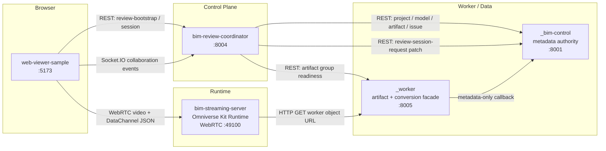
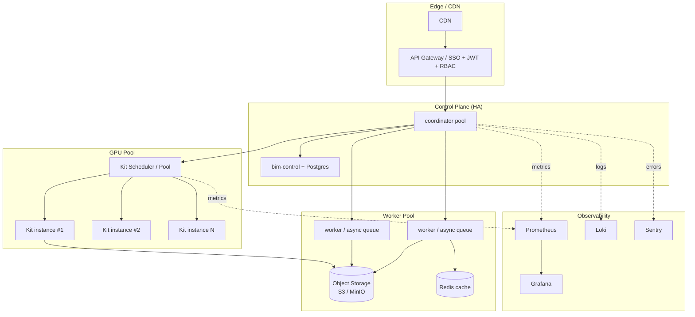
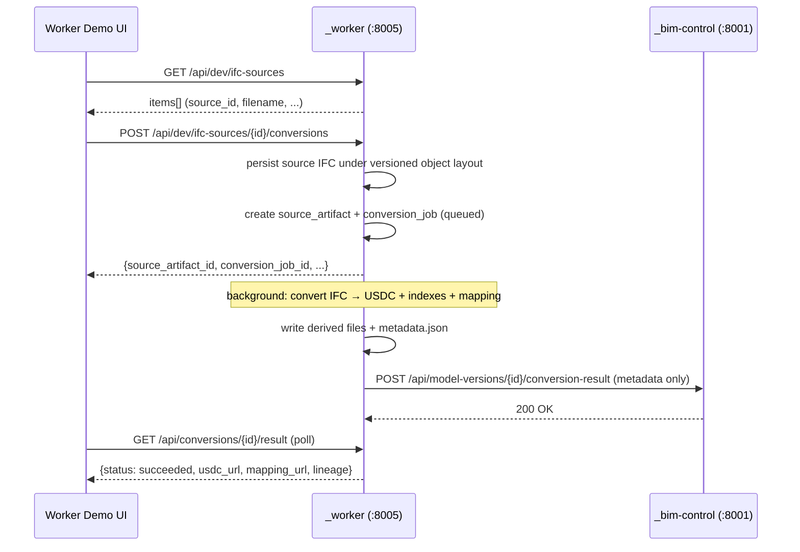
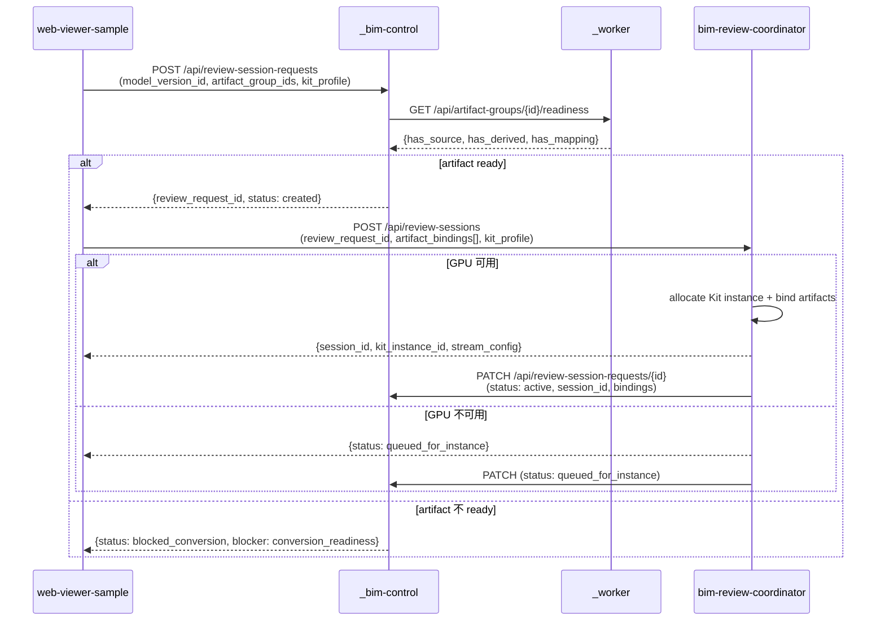
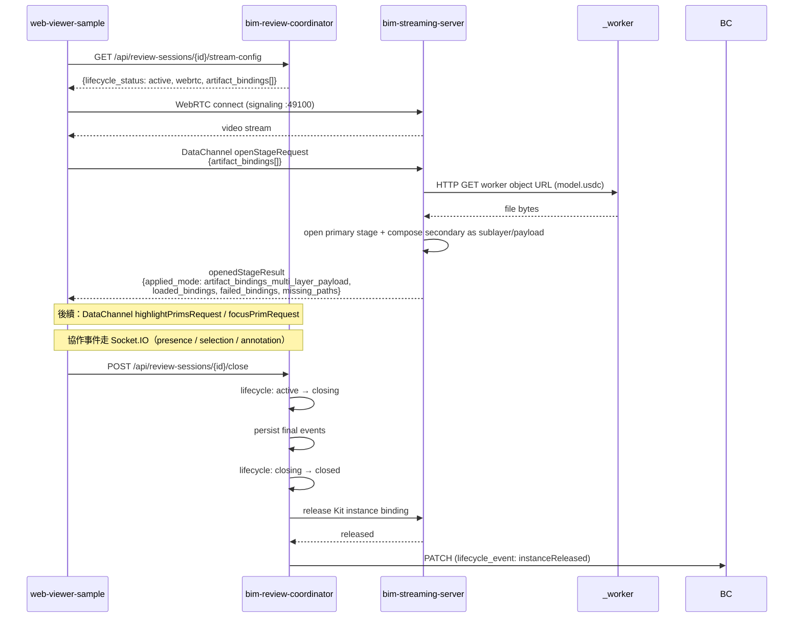

# AI-BIM-governance 專案開發流程

> **依新版架構圖（v2）規劃，對齊 `AGENTS.md` 邊界、`openspec/specs/` 規格、`docs/contracts/` API、實際 commit 進度。**
>
> 本次調整重點：把 `_s3_storage` 與 `_conversion-service` 合併為 `_worker`，補強 review session request、session lifecycle、多 artifact / 多 instance 的控制面。
>
> 本文件不取代 `AGENTS.md`（repo 邊界 source of truth），不取代 `openspec/specs/`（capability requirement source of truth），也不取代 `docs/contracts/`（API source of truth）。本文件只是把它們組合成一條可執行的開發路線。

---

## 目錄

1. [專案目標與核心邊界](#1-專案目標與核心邊界)
2. [架構演進總覽](#2-架構演進總覽)
3. [當前進度檢視](#3-當前進度檢視)
4. [主要風險 / 缺口](#4-主要風險--缺口)
5. [六大階段執行路線圖](#5-六大階段執行路線圖)
6. [每階段驗收 KPI](#6-每階段驗收-kpi)
7. [核心資料流（最新）](#7-核心資料流最新)
8. [Source of Truth 與文件對應表](#8-source-of-truth-與文件對應表)
9. [開發協作流程](#9-開發協作流程)

---

## 1. 專案目標與核心邊界

### 核心目標

把目前本地 PoC（IFC → USDC → 串流審查 → 多人協作 → 紀錄回寫）升級為**多租戶、高吞吐、可商轉的 BIM Streaming + AI Review Platform**。

### 核心服務（current runtime）

> 完整定義以 [`AGENTS.md` §1–§3](../AGENTS.md) 為準。

| 服務 | 角色 | Port | Demo 步驟 |
|---|---|---|---|
| `_bim-control/` | Fake BIM Data Authority（metadata-only） | 8001 | ⑤ 紀錄回寫 |
| `_worker/` | Artifact + Conversion Facade（檔案與轉檔邊界） | 8005 | ① 上傳建模 + ② 自動轉換 |
| `bim-review-coordinator/` | Session / Collaboration Control Plane | 8004 | ③ 建立會議 |
| `bim-streaming-server/` | Omniverse Kit Runtime / WebRTC | 49100 (WebRTC) | ④ 標記問題（背景） |
| `web-viewer-sample/` | Browser Client / WebRTC Viewer | 5173 | ④ 標記問題（前景） |

> **退役服務**：`_s3_storage`（8002）、`_conversion-service`（8003）、`_conversion-server` 已從 current runtime 移除，僅保留 historical reference。詳見 [`openspec/specs/legacy-storage-conversion-retirement/spec.md`](../openspec/specs/legacy-storage-conversion-retirement/spec.md)。

### Source of Truth（不可越界）

```txt
資料權威               → _bim-control
檔案 + 轉檔外部邊界   → _worker
Session / Collaboration → bim-review-coordinator
3D runtime             → bim-streaming-server
使用者操作             → web-viewer-sample
```

---

## 2. 架構演進總覽

### 2.1 Current Runtime（worker-only）



### 2.2 目標 SaaS 架構（Phase 4–6 後）



---

## 3. 當前進度檢視

> 進度依據：`git log` 已 merge 進 `main` 的 PR、`openspec/specs/` 已 archive 的 capability、`openspec/changes/archive/` 的 tasks `[x]` 標記。

| Phase | 狀態 | 對應 OpenSpec capability | 對應 PR / commit |
|---|---|---|---|
| **Phase 0** 基線穩定化 | ✅ 完成 | （demo UI guidelines + smoke tests） | `2de28c9` Demo UI validation, `0496869` smoke runbook |
| **Phase 1** `_worker` 收攏 | ✅ 完成 | `worker-artifact-pipeline`, `worker-dev-ifc-source-selection`, `worker-demo-upload-convert-ui`, `legacy-storage-conversion-retirement` | PR #11, PR #14（`e95922f` 統一步驟 ①/② 至 `_worker`、`b50a8a7` legacy 退役） |
| **Phase 2** 檢討閉環（review request） | ✅ 完成 | `review-session-request-lifecycle`, `session-first-review-viewer` | PR #13（`ddac3c2` session lifecycle 修正、`4f103d0` viewer lifecycle guard） |
| **Phase 3** Session lifecycle + 多 instance | 🔄 進行中 | `multi-artifact-kit-routing`, `streaming-multi-layer-payload-loading` | `8ee577d` kitPool / sessionStore unit tests（部分） |
| **Phase 4** 高併發平台化 | 📅 待規劃 | （尚未提案） | — |
| **Phase 5** Omniverse 平台能力最大化 | 📅 待規劃 | （尚未提案） | — |
| **Phase 6** Production & SaaS 營運 | 📅 待規劃 | （尚未提案） | — |

### 3.1 已完成的最小閉環（已疏通驗證）

```txt
.\storage\*.ifc
→ _worker dev IFC source list（GET /api/dev/ifc-sources）
→ _worker conversion job（POST /api/dev/ifc-sources/{id}/conversions）
→ _worker derived USDC + element_mapping.json + metadata.json
→ _worker callback POST /api/model-versions/{id}/conversion-result → _bim-control
→ _bim-control POST /api/review-session-requests
→ artifact group readiness check
→ coordinator POST /api/review-sessions（artifact_bindings + kit_instance_bindings）
→ web-viewer-sample bootstrap（review_request_id / session_id）
→ WebRTC + DataChannel openStageRequest（artifact_bindings_multi_layer_payload）
→ stage runtime + selection + highlight + collaboration events
→ _bim-control 保存 annotation / lifecycle event
```

> 驗證腳本：`scripts/smoke-worker-review-request.ps1`（API-only，無需 GPU）。

---

## 4. 主要風險 / 缺口

> 對應架構圖 ② 區塊。每個風險都已對應到既有 spec 或本文件後續 phase。

| # | 風險 / 缺口 | 收斂機制 | 狀態 |
|---|---|---|---|
| 1 | `_worker` 合併後需重新確認 source of truth 與責任邊界 | `AGENTS.md §3.3 / §7 / §8`、`worker-artifact-pipeline` spec | ✅ 已收斂 |
| 2 | artifact version / source / lineage 若未建模，後續追溯困難 | `_worker` versioned object layout、`metadata.json` lineage 欄位、`_bim-control` `artifact_groups` | ✅ 已收斂 |
| 3 | review-session-request 尚未成正式 intent 流程 | `review-session-request-lifecycle` spec、`POST /api/review-session-requests` | ✅ 已收斂 |
| 4 | session lifecycle 目前過於簡化，未釐清 `created → active → closing → closed → instance released` | `multi-artifact-kit-routing` spec、coordinator `kit_instance_bindings[]` | 🔄 進行中（Phase 3） |
| 5 | 多 artifact / 多 instance 調度仍未完整推導 | `multi-artifact-kit-routing` + `streaming-multi-layer-payload-loading` specs、KitInstancePool routing policy | 🔄 進行中（Phase 3） |
| 6 | 觀測、稽核、CI/CD、SLA 尚未產品化 | Phase 6（K8s、Prometheus、Grafana、Sentry、SLA/SLO） | 📅 待規劃 |

---

## 5. 六大階段執行路線圖

### Phase 0：基線穩定化 ✅

> **目標**：統一 contracts / source of truth / fixture，fake APIs 補齊 demo UI 與人工可觸發的 issue flow，health check / smoke test / 測試資料穩定可重跑。

**已交付**：

- [x] `AGENTS.md` 收斂 repo 邊界與資料權威
- [x] `docs/contracts/` 7 份 API 合約（worker、bim-control、coordinator、socket events、datachannel events、review session、local-dev runbook）
- [x] `docs/plans/BIM_REVIEW_DEMO_UI_GUIDELINES.md` UI 設計守則
- [x] 一鍵啟動腳本（`scripts/start-all.{sh,ps1}`）+ 健康檢查（`scripts/dev-health-check.ps1`、`scripts/demo-health-check.ps1`）
- [x] Smoke tests：`smoke-review-session.ps1`、`smoke-review-socket.ps1`、`smoke-worker-review-request.ps1`
- [x] 各服務 `/health` endpoint
- [x] OpenSpec + GitHub PR workflow（`AGENTS.md §0.1`）

**驗收命令**：

```bash
./scripts/start-all.sh
./scripts/verify-all.sh
./scripts/smoke-worker-review-request.ps1   # Windows
```

---

### Phase 1：`_worker` 收攏（最優先）✅

> **目標**：把 `_s3_storage` 與 `_conversion-service` 合併為 `_worker`，建立可追蹤的 artifact version / source / lineage 模型。
>
> 對應 OpenSpec capabilities：
> - [`worker-artifact-pipeline`](../openspec/specs/worker-artifact-pipeline/spec.md)
> - [`worker-dev-ifc-source-selection`](../openspec/specs/worker-dev-ifc-source-selection/spec.md)
> - [`worker-demo-upload-convert-ui`](../openspec/specs/worker-demo-upload-convert-ui/spec.md)
> - [`legacy-storage-conversion-retirement`](../openspec/specs/legacy-storage-conversion-retirement/spec.md)

**已交付**：

- [x] `_worker` 服務（FastAPI on `:8005`）
  - `POST /api/artifacts`：source IFC/RVT/DWG intake + lineage（`tenant_id` / `project_id` / `model_version_id` / `source_system` / `uploaded_by`）
  - `POST /api/conversions` + `GET /api/conversions/{id}` + `GET /api/conversions/{id}/result`
  - `GET /api/dev/ifc-sources` + `POST /api/dev/ifc-sources/{source_id}/conversions`（dev demo flow）
  - `GET /api/artifact-groups/{id}/readiness`
  - `GET /objects/{path}`（versioned object URL serving）
- [x] Versioned object layout：`tenants/{t}/projects/{p}/versions/{v}/artifact-groups/{g}/source/{ss}/{sa}/original/{sha8}_{filename}`，derived 在 `derived/{conversion_job_id}/usdc/`
- [x] `metadata.json` 內含完整 lineage：`artifact_id`、`parent_artifact_id`、`artifact_group_id`、`source_system`、`source_format`、`sha256`、`version_no`、`uploaded_by`、`conversion_job_id`、`created_at`
- [x] `_worker` callback `_bim-control` 只發 metadata，不寫檔案 bytes
- [x] `_worker` demo UI（步驟 ①/②）取代 `_s3_storage` / `_conversion-service` UI
- [x] 移除 `_s3_storage/`、`_conversion-service/`、`_conversion-server/` folder（commit `b50a8a7`）
- [x] `scripts/start-all.{sh,ps1}` 不再啟動 8002 / 8003

**驗收命令**：

```bash
cd _worker && python3 -m pytest tests
./scripts/smoke-worker-review-request.ps1
curl http://127.0.0.1:8005/health        # dev_ifc_source_root 應回報 exists/readable/item_count
curl http://127.0.0.1:8005/api/dev/ifc-sources
```

---

### Phase 2：檢討閉環（Review Request → Session）✅

> **目標**：讓「我要開審查 session」成為可保存、可查詢、可回寫的 intent；coordinator 從單純建 session 升級為承接 request → 分配 Kit → 回寫 binding 的完整協調器。
>
> 對應 OpenSpec capabilities：
> - [`review-session-request-lifecycle`](../openspec/specs/review-session-request-lifecycle/spec.md)
> - [`session-first-review-viewer`](../openspec/specs/session-first-review-viewer/spec.md)

**已交付**：

- [x] `_bim-control` 新增 `ReviewSessionRequest` model 與 endpoints：
  - `POST /api/review-session-requests`（status=`created`）
  - `GET /api/review-session-requests/{id}`
  - `PATCH /api/review-session-requests/{id}`（status / bindings 回寫）
  - `GET /api/review-session-requests/{id}/lifecycle-events`
- [x] artifact group readiness check：缺 derived/mapping → `status=blocked_conversion`
- [x] coordinator `POST /api/review-sessions` 接受 `review_request_id` + `artifact_bindings[]` + `kit_profile`
- [x] coordinator `GET /api/review-sessions/{id}/stream-config` 回傳 `lifecycle_status` + `artifact_bindings[]` + `kit_instance_bindings[]`
- [x] `web-viewer-sample` session-first bootstrap：以 `review_request_id` 或 `session_id` 啟動，不再硬編 model URL
- [x] viewer lifecycle 狀態渲染：`blocked_conversion` / `queued_for_instance` / `created` / `active` / `closing` / `closed` / `failed`
- [x] viewer lifecycle guard（commit `4f103d0`）：`closing` / `closed` 期間不送 mutating runtime command
- [x] `_sendStreamMessage` 無限遞迴修正

**驗收命令**：

```bash
cd _bim-control && python3 -m pytest tests
cd bim-review-coordinator && npm test
cd web-viewer-sample && npm run test:session-first
./scripts/smoke-worker-review-request.ps1   # 端到端 API 驗證
```

---

### Phase 3：Session Lifecycle 核心 + 多 artifact / 多 instance 🔄

> **目標**：完整實作 `created → active → closing → closed → instance released` lifecycle，以及 `same_instance` / `dedicated_instance` / `shared_state` routing policy 下的多 artifact / 多 Kit instance 調度。
>
> 對應 OpenSpec capabilities：
> - [`multi-artifact-kit-routing`](../openspec/specs/multi-artifact-kit-routing/spec.md)
> - [`streaming-multi-layer-payload-loading`](../openspec/specs/streaming-multi-layer-payload-loading/spec.md)

**已交付**（部分）：

- [x] coordinator `artifact_bindings[]` 結構（artifact_role / load_order / routing_policy / ready_status）
- [x] coordinator `kit_instance_bindings[]` 結構（kit_instance_id / provider / status / stream_config / heartbeat）
- [x] `same_instance` routing policy + `dedicated_instance` 容量檢查
- [x] `kit_profile.capacity_slots=0` → `queued_for_instance`（commit `ddac3c2`）
- [x] `request_id` 唯一性保證（commit `ddac3c2`）
- [x] `bim-streaming-server` `openStageRequest` 支援 `artifact_bindings[]` + `applied_mode` 回報（`single_url` / `artifact_bindings_single` / `artifact_bindings_multi_layer_payload`）
- [x] DataChannel contract smoke：`bim-streaming-server/scripts/tests/test-stage-loading-contract.ps1`
- [x] coordinator session/kitPool unit tests（commit `8ee577d`）

**待補**：

- [ ] **`closing` state 完整實作**：累積最終 annotation / snapshot 後再 `closed`
- [ ] **Kit instance release flow**：`allocated → starting → ready → draining → released` 各階段事件回寫
- [ ] **`shared_state` routing policy**：跨 instance selection / issue focus / annotation 同步（Socket.IO event broadcast）
- [ ] **Routing policy decision engine**：依 artifact 大小 / GPU profile / tenant isolation 自動決定 policy
- [ ] **Multi-instance stream config shape**：每個 binding 對應的 stream endpoint 結構正規化
- [ ] **GPU 環境多 artifact 真機驗證**（須 NVIDIA GPU + Kit SDK）
- [ ] **artifact group / model_version / startup policy 整合 UI**：viewer 上可選擇 routing policy

**規劃驗收命令**：

```bash
# Lifecycle 狀態機測試
cd bim-review-coordinator && npm test -- lifecycle
# 多 artifact 載入 contract smoke
./bim-streaming-server/scripts/tests/test-stage-loading-contract.ps1
# Multi-instance routing smoke（待補）
./scripts/smoke-multi-instance-routing.ps1   # TODO
```

---

### Phase 4：高併發平台化 📅

> **目標**：把目前 in-memory / file-based 的 worker、session store 升級為 async / queue / multi-worker，加入 GPU pool / scheduler / Redis cache，使 conversion worker、AI worker、streaming runtime 可水平擴展。
>
> **尚未提案** OpenSpec change，建議 Phase 3 完成後啟動。

**規劃任務**：

1. **Conversion worker 非同步化**
   - `_worker` `POST /api/conversions` 改寫為 enqueue（Redis Stream / RQ / Celery）
   - 多個 worker process 共享 queue
   - Job 進度透過 callback / polling 回報
2. **GPU Pool / Kit Scheduler**
   - 把 coordinator 內 hardcode `local_fixed` Kit endpoint 換成 KitPool client
   - 支援 K8s GPU node pool（NVIDIA Operator）或自行管理 GPU host group
   - Pool 回報可用 capacity slots，coordinator allocate / release
3. **Redis cache**
   - artifact metadata / readiness 結果快取
   - session presence / selection 即時狀態
4. **Object Storage 抽象層**
   - `_worker` 把本地 `data/objects/` 升級為 S3-compatible（MinIO local、S3 production）
   - 衍生檔可用 pre-signed URL 對外
5. **API Gateway**
   - 在 coordinator 前面加一層 gateway（Kong / Traefik / 自行實作）
   - 統一處理 rate limit、CORS、auth header

**規劃 OpenSpec change（建議命名）**：

```txt
openspec new async-worker-pool-and-redis
openspec new gpu-kit-pool-scheduler
openspec new object-storage-abstraction
```

---

### Phase 5：Omniverse 平台能力最大化 📅

> **目標**：把 Omniverse 在 BIM review 之外的能力打開：物理模擬（Physics / RTX）、材質（MDL）、感測模擬（IAQ / HVAC / 環境感測 / 能耗模擬）、AI 分析。

**規劃任務**：

1. **RTX 視覺品質**
   - 開啟 RTX renderer，調整 SPP / max bounces
   - HDRI 環境照明與 MDL 自訂材質
2. **PhysX 整合**
   - 碰撞檢測（clash detection）→ 自動產生 review issue
   - 構件穩定性 / 重力模擬
3. **環境感測模擬**
   - IAQ（室內空氣品質）/ HVAC 模擬
   - 能耗模擬（透過 Omniverse Connect 與其他工具整合）
4. **AI Worker pipeline**
   - 法規檢核 worker（讀 USD + element_mapping → 規則引擎 → 產生 issue）
   - 碳排估算 worker
   - 結果都透過 `_bim-control` `POST /api/model-versions/{id}/review-issues` 回寫
5. **Multi-viewport / Camera presets**
   - DataChannel 新增 `setCameraView` command（top / front / perspective）
   - viewer 切換視角

**邊界守則**：所有新 worker / AI service 都須遵守 `AGENTS.md §9` Optional Mock Services 規範，不得越過 `_bim-control` / `_worker` / coordinator 的權威。

---

### Phase 6：Production & SaaS 營運 📅

> **目標**：CI/CD、container deployment、observability、tracing、backup / DR、billing / usage metering、SLA / SLO。

**規劃任務**：

1. **Container & K8s**
   - 每個服務 Dockerfile（multi-stage build）
   - Helm chart per service（coordinator / worker / bim-control / kit）
   - GPU node pool + 一般 node pool 分離
2. **CI/CD**
   - GitHub Actions：lint → unit test → integration test → build image → push registry → deploy staging → smoke test → promote production
   - `.github/workflows/`（目前是空的，需要建立）
3. **Auth & Multi-tenant**
   - SSO（SAML / OIDC，整合 Auth0 / Keycloak）
   - JWT + refresh token
   - RBAC（Admin / Project Manager / Reviewer / Viewer）
   - tenant isolation：所有 worker object key、coordinator session、bim-control resource 加 `tenant_id` enforcement
4. **Observability**
   - Metrics：Prometheus + Grafana（API latency p50/p95/p99、conversion success rate、Kit GPU utilization、WebRTC FPS / packet loss）
   - Logs：Loki / ELK + correlation ID
   - Tracing：Jaeger / Tempo（跨 worker → bim-control → coordinator 完整 trace）
   - Errors：Sentry（所有 service 整合 SDK）
5. **Billing & Usage Metering**
   - 計量單位：GPU hours、storage GB、API calls、conversion jobs
   - 整合 Stripe 或內部 billing
6. **Backup / DR**
   - PostgreSQL 自動備份（多 region）
   - Object storage versioning + lifecycle policy
7. **SLA / SLO**
   - Uptime SLA 99.5%
   - API p95 < 500ms
   - WebRTC streaming latency p95 < 100ms
   - Conversion job 95% < 60 秒

---

## 6. 每階段驗收 KPI

> 對應架構圖 ④ 區塊。

| # | KPI | 量測方式 | 目標 | 對應 Phase |
|---|---|---|---|---|
| 1 | **轉檔成功率** | `_worker` conversion job `succeeded` / `(succeeded+failed)` | ≥ 95% | Phase 1 ✅ |
| 2 | **Artifact 版本 / 來源可追溯** | `metadata.json` 含完整 lineage、`_bim-control` artifact group 可查到 source artifact 與 conversion job | 100% lineage 完整 | Phase 1 ✅ |
| 3 | **Review Session 啟動時間** | 從 `POST /api/review-session-requests` 到 viewer 看到 `lifecycle_status=active` 的 wall-clock 時間 | < 5 秒（artifact ready 狀態下） | Phase 2 ✅ / Phase 3 持續優化 |
| 4 | **Session Lifecycle 狀態正確** | smoke test 涵蓋 `created → active → closing → closed → released` 完整轉移；`closed` 後 Kit binding 都 `released` | smoke 通過率 100% | Phase 3 🔄 |
| 5 | **多 artifact / 多 instance 可運作** | `same_instance` 多 artifact 載入回 `applied_mode=artifact_bindings_multi_layer_payload`；`dedicated_instance` 多 binding 各自獨立 | 通過 multi-binding contract smoke + GPU 真機驗證 | Phase 3 🔄 |
| 6 | **全鏈路可觀測 / 可稽核 / 可回放** | Prometheus metrics 涵蓋 5 個服務、Grafana dashboard 上線、Jaeger trace 可串 worker→bim-control→coordinator、Sentry 收到所有 service error | dashboard / trace / sentry 三項上線 | Phase 6 📅 |

---

## 7. 核心資料流（最新）

> 完整定義以 [`AGENTS.md §5`](../AGENTS.md) 與 [`docs/contracts/`](contracts/) 為準。

### 7.1 Artifact Pipeline（Phase 1）



### 7.2 Review Session Request（Phase 2）



### 7.3 Streaming + Session Lifecycle（Phase 2/3）



---

## 8. Source of Truth 與文件對應表

| 你想知道 | 看哪個檔 |
|---|---|
| Repo 邊界、資料權威、禁止跨界規則 | [`AGENTS.md`](../AGENTS.md) |
| `_worker` API 規格 | [`docs/contracts/worker-api.md`](contracts/worker-api.md) |
| `_bim-control` API 規格 | [`docs/contracts/bim-control-fake-api.md`](contracts/bim-control-fake-api.md) |
| Coordinator REST API | [`docs/contracts/review-session-api.md`](contracts/review-session-api.md) |
| Coordinator Socket.IO 事件 | [`docs/contracts/coordinator-socket-events.md`](contracts/coordinator-socket-events.md) |
| Streaming DataChannel 事件 | [`docs/contracts/streaming-datachannel-events.md`](contracts/streaming-datachannel-events.md) |
| 退役服務說明 | [`docs/contracts/conversion-api.md`](contracts/conversion-api.md), [`openspec/specs/legacy-storage-conversion-retirement/spec.md`](../openspec/specs/legacy-storage-conversion-retirement/spec.md) |
| 本地開發步驟 | [`docs/contracts/local-dev-runbook.md`](contracts/local-dev-runbook.md), [`README.md`](../README.md) |
| Demo UI 設計守則 | [`docs/plans/BIM_REVIEW_DEMO_UI_GUIDELINES.md`](plans/BIM_REVIEW_DEMO_UI_GUIDELINES.md) |
| Capability 規格（current behavior 須符合） | [`openspec/specs/`](../openspec/specs/) 7 份 spec |
| 已完成的 OpenSpec change（含 proposal/design/tasks） | [`openspec/changes/archive/`](../openspec/changes/archive/) |

> **衝突解決順序**（同 `AGENTS.md §0.1`）：使用者最新明確指令 > `AGENTS.md` > `CLAUDE.md` > OpenSpec > installed skills / wiki。

---

## 9. 開發協作流程

### 9.1 OpenSpec + GitHub PR Workflow

> 完整定義以 [`AGENTS.md §0.1` "OpenSpec + GitHub workflow"](../AGENTS.md) 為準。

```txt
OpenSpec       = 需求 / 規格 / 驗收條件
Git Branch     = 實作隔離（codex/openspec/<change-id>）
Pull Request   = 審查與討論
GitHub Actions = 自動驗證
Merge          = 正式接受變更
Archive        = 把 delta specs 併入 openspec/specs/
```

**標準流程**：

1. 從最新 `main` 建立 `codex/openspec/<change-id>` branch
2. `/openspec new <change-id>` 在該 branch 上建立 proposal / design / tasks / delta specs
3. `/openspec apply <change-id>` 實作並更新 task `[ ] → [x]`
4. 開 PR，跑最小驗證並回報結果
5. PR review + GitHub Actions 自動驗證
6. Merge 後執行 OpenSpec sync/archive

### 9.2 PR Checklist

- [ ] 對應的 OpenSpec change 存在（或本 PR 為純 docs/refactor 不需要）
- [ ] 修改不違反 `AGENTS.md` repo 邊界
- [ ] Python tests 從各服務目錄下執行：`cd <svc> && python3 -m pytest tests`
- [ ] Node tests / build 從各服務目錄執行：`cd <svc> && npm test && npm run build`
- [ ] 涉及 API 變更時，同步更新 `docs/contracts/`
- [ ] 涉及 UI 變更時，符合 `BIM_REVIEW_DEMO_UI_GUIDELINES.md`
- [ ] 使用 GitNexus 工具：`gitnexus_impact` 評估影響、`gitnexus_detect_changes` 確認 scope

### 9.3 服務測試命令速查

```bash
# Python services（必須在各自服務目錄下）
cd _bim-control && python3 -m pytest tests
cd _worker      && python3 -m pytest tests

# Node services
cd bim-review-coordinator && npm test && npm run build
cd web-viewer-sample      && npm run test:session-first && npm run build

# Smoke tests（root）
./scripts/dev-health-check.ps1                # 健康檢查
./scripts/smoke-worker-review-request.ps1     # API-only 端到端
./scripts/smoke-review-session.ps1            # session 完整流程
./scripts/smoke-review-socket.ps1             # 多人協作

# Streaming（須 GPU + Kit）
./bim-streaming-server/scripts/tests/test-stage-loading-contract.ps1
```

---

## 10. 下一步行動建議

依當前進度（Phase 0/1/2 ✅ 完成、Phase 3 🔄 進行中），建議優先順序：

1. **Phase 3 收尾**（最高優先）：
   - 完成 `closing` state 與 Kit instance release flow
   - 實作 `shared_state` routing policy 的跨 instance Socket.IO event 同步
   - 補 `scripts/smoke-multi-instance-routing.ps1`
   - GPU 環境下做多 artifact 真機驗證

2. **Phase 4 啟動準備**：
   - 開 OpenSpec change：`async-worker-pool-and-redis`、`gpu-kit-pool-scheduler`
   - 評估 Object Storage 抽象層（MinIO local + S3 production）
   - 在 `_worker` 引入 background queue（Redis Stream / RQ）

3. **DevOps 基礎**（與 Phase 4 並行）：
   - 建立 `.github/workflows/`（目前是空的）：lint + unit test + build per service
   - 為每個服務建立 Dockerfile（multi-stage build）
   - 建立 root `docker-compose.yml`（local multi-service dev）

> 任何新 phase 啟動前，先以 `/openspec new <change-id>` 建立可審查的 proposal，並由人類 reviewer 確認再實作。

---

**文件版本**：v2.0
**最後更新**：2026-05-08（依新版架構圖 v2 重寫）
**對應架構圖**：`AI-BIM-governance：從目前 PoC 到 SaaS 級平台的執行路線圖`
**審查週期**：每個 phase 結束 + 重大架構變更時更新
