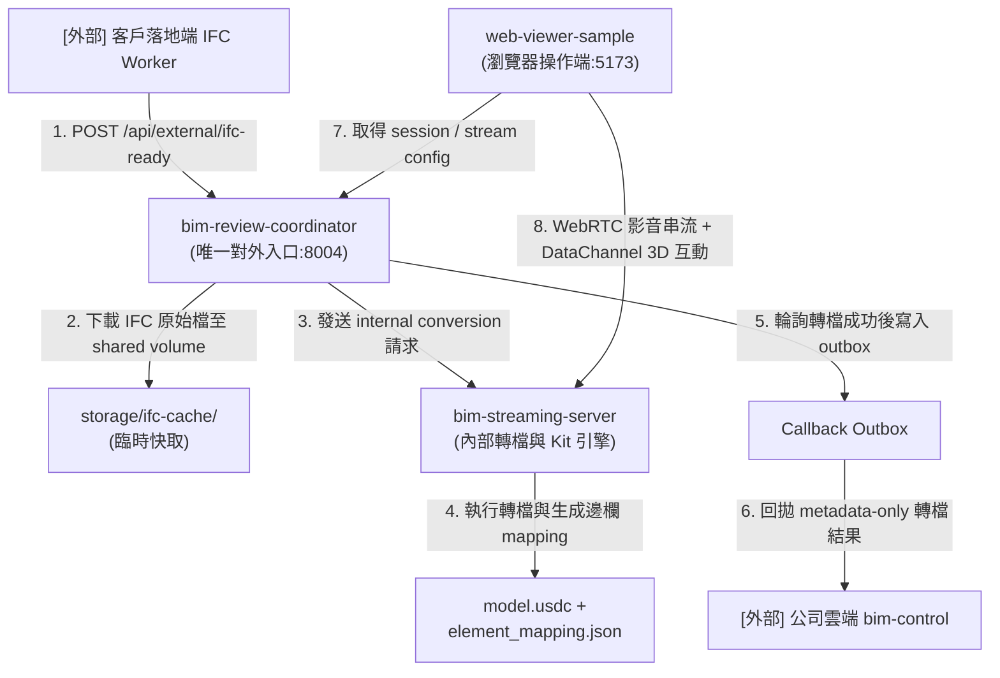

# 專案架構分析、本地環境驗證與 AI 開發規範指引

本文件詳細記錄了 `AI-BIM-governance` 專案的核心架構、B 方案（雲地分離）閉環、各模組的職責邊界，並整理了本地開發環境的配置與 AI 輔助開發的最高準則，以作為後續開發與交接之依據。

---

## 1. 專案背景與 B 方案核心閉環 (B-Scheme)

本專案採用 **B 方案（雲地分離）** 架構，確保大模型檔案（如 `.usdc`、`.ifc` 等）完全保存在本地或落地端，而雲端僅處理元數據（Metadata）。歷史的 `_worker` 與 `_bim-control` runtime 服務已被刪除，改由 `tests/fakes` / `tests/contracts` 來進行測試模擬。

### 最小閉環資料流


---

## 2. 服務分工與職責邊界

各模組有著嚴格的職責劃分（禁止跨界）：

| 目錄 (模組名稱) | 主要角色 | 核心職責 | 絕對不能做的事 |
| :--- | :--- | :--- | :--- |
| **`bim-review-coordinator/`** | 外部 IFC Intake + Session 控制面 | 接收 ifc-ready Webhook、下載 IFC 快取、建立轉檔工作、維護回拋 Outbox、廣播協作事件與會話狀態。 | 不做 3D 渲染、不直接開啟 USD stage、不保存大型模型本體。 |
| **`bim-streaming-server/`** | 轉檔核心 + Kit Runtime / WebRTC | 內部轉檔引擎（IFC→USDC）、產出 mapping、管理 Kit runtime / viewport、提供 WebRTC 影音與 DataChannel 互動。 | 不處理使用者登入、不管理 project / model 的資料權威、不作為長期 Issue 數據庫。 |
| **`web-viewer-sample/`** | 前端網頁操作 Client | 顯示 WebRTC 串流畫面、傳送 DataChannel 3D 互動指令（highlight/selection）、管理前端 UI。 | 不啟動或管理 Kit server、不分配 GPU、不保存專案資料權威。 |

---

## 3. 本地 Windows 環境配置與測試驗證

我們已在本地 Windows 環境下成功建立基於 `uv` + `.venv` 的 Python 虛擬環境，並補足了 openusd (Pixar USD) 及 ifcopenshell 依賴，以使所有的單元與合約測試在不依賴完整實體 GPU Kit 渲染的環境下亦能通過。

### 依賴配置步驟（以 `uv` 為主）
1. **建立虛擬環境**：`uv venv`
2. **安裝核心測試依賴**：`uv pip install pytest fastapi httpx`
3. **安裝 3D 轉檔與 fallback 依賴**：`uv pip install usd-core ifcopenshell`（`usd-core` 提供了 Pixar 的 `pxr` 模組，可供本地單元測試使用）
4. **安裝 Node.js 依賴**：分別在 `bim-review-coordinator/` 與 `web-viewer-sample/` 目錄執行 `npm install`。

### 測試執行指令與現行通過狀況

* **合約與模擬器測試 (pytest)**：
  ```powershell
  .venv\Scripts\python.exe -m pytest tests -p no:cacheprovider
  ```
  * *狀態*：`9 passed`
* **Coordinator 控制中心測試 (vitest)**：
  ```powershell
  cd bim-review-coordinator
  npm test
  ```
  * *狀態*：`187 passed`
* **Streaming Server 轉檔核心測試 (pytest)**：
  ```powershell
  .venv\Scripts\python.exe -m pytest bim-streaming-server\tests\test_conversion_authority_api.py -q
  .venv\Scripts\python.exe -m pytest bim-streaming-server\tests\test_host_native_conversion_service.py -q
  .venv\Scripts\python.exe -m pytest bim-streaming-server\tests\test_stage_loading_stage_composition.py -q
  ```
  * *狀態*：`53 passed`（14 + 38 + 1）
* **Web Viewer 網頁端合約測試 (node)**：
  ```powershell
  cd web-viewer-sample
  npm run test:session-first
  ```
  * *狀態*：`1 passed`

---

## 4. AI 輔助開發 (AI Coding) 規範與實踐指引

為了確保 AI Agent（包括 Gemini 等模型）在開發本 repo 時**「依據真實代碼與測試結果下決策，而非憑空猜測」**，所有開發必須遵守以下指引：

### A. 遵守 Source of Truth 優先順序
當遇到規格衝突或是不確定邊界時，模型應依以下順序檢索真相：
1. **直接檢視實際實作程式碼**：藉由 `view_file` 或 `grep_search` 獲取第一手代碼實作。
2. **檢視 `tests/contracts/` 下的 JSON 契約檔案**：API Payload 與 callback 事件結構以此為最高標準。
3. **檢視 `AGENTS.md`**：了解當前 B 方案的服務角色劃分。
4. **參考輔助 wiki 文檔**：文檔可能會有落後，不可直接作為修改依據。

### B. 強制使用 GitNexus 靜態分析與變更偵測
修改代碼前後，必須強制執行以下命令：
* **修改 symbol 前**：執行 `gitnexus_impact` 以分析影響面。
* **提交 Commit 前**：執行 `gitnexus_detect_changes` 確保無意外的邊界跨越或代碼修改。

### C. 執行 AI Journal (開發日誌留痕)
修改代碼後，請將變更詳細記錄於 `docs/ai_journal/changes.jsonl`，確保日誌中包含：
* 修改原因與背景。
* 受影響的檔案清單。
* **可重複執行的驗證指令 (`verify`)**。
這能讓下一位接手的 Agent 或開發者立刻透過驗證指令重現您的結果。
