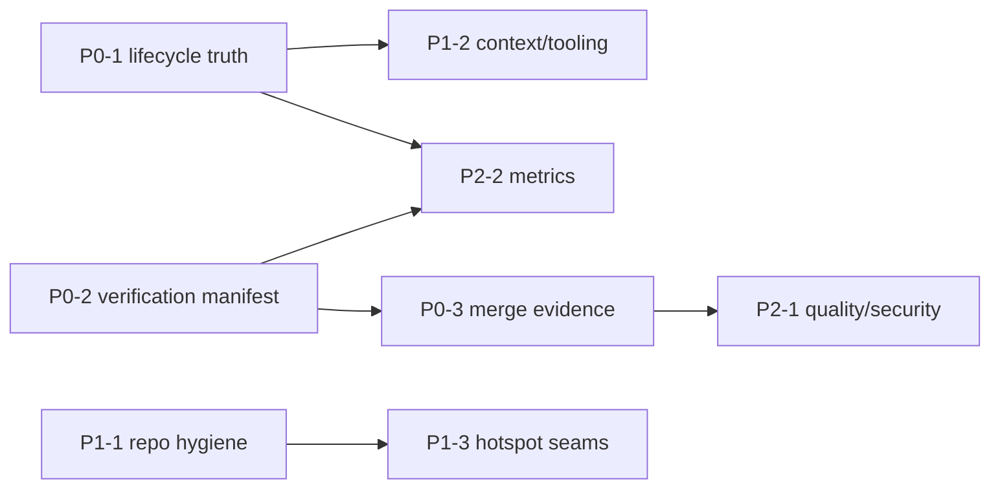

# AI Coding Optimization Roadmap

> 文件性質：engineering improvement roadmap／decision-ready backlog。
> 狀態：**proposed，尚未實作**。
> 基準 commit：`75bb192`（2026-07-28 觀測當時的 `origin/main`；`origin/main` 是移動 ref）。
> 本檔不屬於 runtime/API contract、產品需求正本、`NOW.md` 工作排序或 OpenSpec lifecycle truth；不得用本檔宣稱任何能力已完成。實際行為仍以 code＋executable tests 為準，當週工作仍以使用者最新指令與 [`docs/plans/NOW.md`](../plans/NOW.md) 為準。

## 1. 目標與使用方式

這份 roadmap 把 repo 的 AI coding 改善拆成可獨立交付、可量測、可回滾的 work package。核心目標不是增加更多 prompt、agent 或治理文件，而是讓 agent 能從少量 machine truth 得到三個答案：

1. 現在唯一應做什麼、由誰擁有、何時算完成。
2. 這次 changed paths 必須跑哪些 fast checks、contracts 與 slow evidence gates。
3. PR 是否真的有足以合併的 machine evidence，而不是只有格式正確的說明文字。

使用規則：

- P0／P1／P2 是優先序，不是 active WIP；只有被使用者或 `NOW.md` 明確提升的單一 work package 才能進入實作。
- 一個 package 一個 outcome；預設一個 package 一個 PR，禁止把 roadmap 全部一次實作。
- 每次實作先保存 current-behavior baseline，再以同一檢查重測；若需要改 public contract、跨 service、security、deploy 或 user workflow，仍依 `AGENTS.md` 升級 Lane G。
- 新 machine source 必須取代或生成既有重複來源；不得在舊來源旁再建立第三份手寫 truth。
- 所有 skip 都要輸出可解析 reason；未知 path、未知 state 或 evidence 無法綁定 commit 時 fail closed。

## 2. 已驗證基線

下表只描述基準快照，不保證未來仍成立；實作各 package 前必須重新量測。Repo facts 與 local/GitHub environment observations 分開記錄，避免把環境狀態誤當成可由 commit 單獨重現的事實。

### 2.1 Commit-bound repo facts

| 面向 | Verified fact（2026-07-28） | 直接來源／重現方式 |
|---|---|---|
| Lifecycle | `openspec list --json` 回報 8 個 `in-progress`，但 5 個 change proposal 的頂層狀態是 deferred；#411／#412 已加入 state 詞彙與 `ledger_mismatch` 義務，但尚未形成單一 machine-readable ledger。 | [`NOW.md`](../plans/NOW.md)、`openspec list --json`、`rg -n -g 'proposal.md' '^> \*\*Status: deferred' openspec/changes`、`openspec validate --all --strict --json` |
| Aggregate verification | `scripts/verify-all.ps1 -PlanOnly` 的 Developer profile 只列 root contracts、coordinator、viewer、streaming，未納入 governance-service、kit-manager API/web。 | [`scripts/verify-all.ps1`](../../scripts/verify-all.ps1) |
| CI path closure | `root_contracts` classifier 只由 `tests/**`、`scripts/tests/**` 觸發，service implementation path 不在其觸發閉包。 | [`.github/workflows/ci.yml`](../../.github/workflows/ci.yml) |
| Evidence validators | Visual 與 functional-runtime validators 已驗 commit/runtime/hash/trace/pixel truth；是否為 required check 屬於下方 GitHub environment observation。 | [`verify-design-system-visual-result.ps1`](../../scripts/tests/verify-design-system-visual-result.ps1)、[`verify-functional-runtime-result.ps1`](../../scripts/tests/verify-functional-runtime-result.ps1) |
| PR metadata | `pr-review-agent.yml` 實際做靜態 PR body contract check，且仍引用已刪除的 `TRUTH.md` 名稱。 | [`.github/workflows/pr-review-agent.yml`](../../.github/workflows/pr-review-agent.yml) |
| Agent surface | Manifest 管理 27 個 skills，其中 22 個是 Claude/Codex mirror；`skills-lock.json` 在 repo 內找不到 executable consumer。 | [`agent-skills-manifest.json`](../../agent-skills-manifest.json)、[`skills-lock.json`](../../skills-lock.json)、排除 inventory／roadmap 自身後以 `rg` 查引用 |
| Hotspots | coordinator `src/app.ts` 有 4,174 行、70 個 route registrations；viewer `pages.tsx` 有 2,026 行並集中多個 top-level pages。兩者同時具有大型修改面與持續 churn。 | [`app.ts`](../../bim-review-coordinator/src/app.ts)、[`pages.tsx`](../../web-viewer-sample/src/console/pages.tsx)、`git log --name-only -- <path>` |
| Quality gates | coordinator verify 沒有 lint；kit-manager web 只有 build；viewer verify 未含 lint，驗證文件仍記錄 30 個既有 lint errors。 | 各 service `package.json`、[`sub-repo-verify-commands.md`](../agents/sub-repo-verify-commands.md) |

### 2.2 Local/GitHub environment observations

| Timestamp／cwd | Observation | 重現方式／限制 |
|---|---|---|
| 2026-07-28 11:03:47 +08:00；`C:\Repos\active\iot\AI-BIM-governance` | 20 個 worktrees。這個數字包含本 roadmap 與其他同時進行中的 worktree，會隨 session 改變。 | `git worktree list --porcelain`；不是 commit-bound fact |
| 2026-07-28 11:03–11:04 +08:00；同上 | Canonical checkout 的 GitNexus CLI 回報 index `84bdf5c`、checkout `6a627a7`、status stale；registry 有 6 個同名 `AI-BIM-governance` paths，query 另回報 FTS indexes missing。 | 從 canonical checkout 跑 `node .gitnexus/run.cjs status`；另以 GitNexus `list_repos`／`query` 指定 exact repo path。Linked worktree 沒有 ignored `.gitnexus/run.cjs`，不可直接重現此命令。 |
| 2026-07-28 11:04:02 +08:00；GitHub API | Main branch protection 為 strict，required 11 個 contexts；不含 `design-semantic-visual`、`functional-runtime-conv`。 | `gh api repos/monkey1sai/AI-BIM-governance/branches/main/protection/required_status_checks`；外部狀態，實作 P0-3 前必須重查 |

Inference：repo 的主要限制已不是「缺少規則」，而是規則、狀態、驗證與 merge evidence 分散，agent 必須自行拼接且容易得到表面成功。優化順序因此應先收斂 truth 與 feedback loop，再重構大型 code。

## 3. 優先序總覽

| ID | Priority | Outcome | Owner role | 前置條件 |
|---|---|---|---|---|
| P0-1 | P0 | 單一 lifecycle/task/evidence machine truth | agent-governance maintainer | 無 |
| P0-2 | P0 | 單一 verification manifest，local 與 CI 共用 | verification owner | 無；先 mirror 現況再擴充 |
| P0-3 | P0 | Required merge evidence 真正綁定 classifier 與 artifacts | CI/repo admin | P0-2 |
| P1-1 | P1 | GitNexus 與 worktree 有可重現的 healthy baseline | repo maintainer | 無 |
| P1-2 | P1 | 降低 agent context/tooling duplication 並可回歸測試 routing | agent-governance maintainer | P0-1 |
| P1-3 | P1 | 只拆高 churn × size × blast-radius seams | service owners | P1-1、affected tests baseline |
| P2-1 | P2 | Deterministic lint/type/security/coverage policy | service + security owners | P0-2／P0-3 |
| P2-2 | P2 | AI coding latency、rework、WIP、flake 可量測 | engineering owner | P0-1／P0-2 |



## 4. P0 — 先修 truth 與 merge loop

### P0-1 — Lifecycle/task/evidence machine truth

Outcome：每個 change 只存在一份可解析 state，`NOW.md` 與人類摘要由它生成或被它驗證；agent 不再從 proposal prose、checkbox 與 GitHub 狀態自行猜測。

最小交付面：

- 定義 versioned schema，至少包含 `id`、`status`、`owner`、`current_slice`、`blocked_by`、`last_verified`、`task_ledger`、`evidence_refs`、`subject_commit`。
- `status` 使用有限 enum，明確區分 `active`、`deferred`、`held`、`completed`、`archived`；未知值 fail closed。
- 建立 read-only reconciliation command，對照 machine state、proposal/tasks、archive path、GitHub PR 與 `NOW.md`；差異輸出 `ledger_mismatch`，第一版不得自動改寫。
- 完成現有 in-progress/deferred changes 的一次性 migration；不得把歷史 unchecked checkbox 直接推論為 active work。
- 後續才讓 `NOW.md` 成為 generated view，保留人類可讀 outcome，但不再手寫重複狀態。

Definition of Done：

- schema validation、state transition、missing owner、cycle in `blocked_by`、subject commit mismatch 均有 executable tests。
- `openspec list --json`、WIP budget、archive gate、`NOW.md` 對同一組 changes 給出一致 lifecycle 結果。
- 任意故意製造的 prose/state divergence 會讓 reconciliation 非零退出並指出 exact change／field。
- migration PR 不改 product code，也不宣稱 runtime capability 完成。

### P0-2 — Verification manifest 作為 local/CI 單一來源

Outcome：給定 base/head 或 changed paths，可以 deterministic 得到 `run | skip`、command、cwd、owner、reason 與 evidence class。

Manifest 最小欄位：

```yaml
path_globs: []
owner: service-or-contract-owner
fast_gates: []
contract_gates: []
slow_evidence_gates: []
required_when:
  predicate: changed_path_class
  any_of: []
skip_reason: machine-readable-enum
```

最小交付面：

- `required_when` 必須是 versioned closed schema 的 typed predicate＋有限 enum，不接受自由字串程式；禁止 `eval`、`Invoke-Expression` 或 local/CI 各自實作 expression parser。未知 predicate 在 schema validation 階段 fail。
- 先把現有 `verify-all` target matrix 原樣搬到 manifest，證明 output parity 後才擴張，避免同一 PR 同時重寫 orchestration 與 coverage。
- 第二刀補齊 root contracts、coordinator、streaming、governance、viewer、kit-manager API、kit-manager web 與 scripts/governance checks。
- `verify-all.ps1 -PlanOnly -Json` 與 CI changed-path classifier 消費同一 manifest；不得各自複製 path globs。
- root contract ownership 要形成觸發閉包：改動 contract-owning service path 時，相關 root contracts 必須執行。
- slow browser/runtime/design gates 保留 affected-only；unknown path 或 classifier 無法解釋時輸出 fail-closed result，不以 silent skip 當 pass。

Definition of Done：

- fixture tests 覆蓋每個 service、cross-service contract、docs-only、workflow-only、unknown path 與 mixed change。
- local plan JSON 與 CI plan artifact 對同一 changed-path fixture byte-stable 或 semantic-equivalent；PowerShell 與 CI consumer 必須共用同一組 conformance fixtures。
- 每個 skip 都有 enum reason；不存在「job 綠但無法說明為何沒跑」的狀態。
- 現有 design/functional evidence validators 原封保留，只有 orchestration source 被收斂。

### P0-3 — Required merge evidence

Outcome：branch protection 只接受一個穩定 aggregator；aggregator 驗證適用 gates 的 conclusion、classifier reason、subject commit 與 artifacts，而不是只看 job 名稱存在。

最小交付面：

- 新增穩定 required aggregator（名稱在 branch protection 中固定），讀取 P0-2 plan artifact 並檢查所有 `required` gates。
- 任何修改 manifest、classifier、aggregator workflow 或 evidence validator 的 PR 一律 full dispatch。裁決必須使用 base-pinned gate logic，或採兩階段啟用：第一個 PR 只修改 gate 且不得由新 gate 自我授權，merge 後才由 repo admin 啟用；需要 privileged context 時不得 checkout／執行未受信任的 PR head code。
- user-facing changed scope 必須要求 `design-semantic-visual` 與 `functional-runtime-conv` 的 machine result；不適用時也要有 manifest 產出的 typed skip reason。
- PR body 保留作證據索引，但其 labels 必須指向 CI run/artifact；PR prose 不得自行替代 runtime、trace、hash 或 pixel evidence。
- 將 `PR Review Agent` 改成與真實功能相符的 metadata/PR-body contract 名稱，移除 deleted `TRUTH.md` 引用。
- branch-protection 調整視為 repo-admin step；workflow merge 與保護規則更新必須分別驗證，不能只宣稱 YAML 已存在。

Definition of Done：

- classifier fixture 的 false negative 會讓 aggregator fail；required job skipped/cancelled/neutral 不能被誤判為 evidence pass。
- self-change fixture 證明 PR 不能同時弱化 gate scope 並用弱化後的結果取得 merge authority；相關 path 另有 CODEOWNER/manual approval 或等價 base-controlled boundary。
- artifact subject SHA 必須等於 PR head SHA；stale rerun、另一 branch artifact 或 missing artifact 均 fail closed。
- 一個 docs-only PR、單 service backend PR、user-facing PR、mixed PR 各有可重現的 expected gate test。
- `gh api` 或等價 machine truth 證明 main branch protection 已要求 aggregator，且舊 context 不再造成永久 pending。

## 5. P1 — 降低環境與認知摩擦

### P1-1 — GitNexus/worktree hygiene

Outcome：agent 開工前可用一條 health check 判定目前 checkout、index 與 registry 是否可信。

最小交付面：

- 指定一個 canonical main checkout；health report 列出 current HEAD、`origin/main`、indexed commit、FTS status、repo registration/path ambiguity 與 worktree owner/status。
- 第一階段只產生 report，不修改 repo 外 persistent registry/index。linked worktree 未被索引時明確回報 `UNKNOWN`，不得把主 worktree 的結果當成當前 diff。
- 清除重複 GitNexus registration、修復 FTS 或重新索引必須是另案 maintenance action：需要 current-turn 明確授權、exact target、操作前備份／rollback 路徑與操作後 health check；不得由一般 health command 自動執行。
- stale worktree 只產生 report 與人工 cleanup command；不得自動刪除 dirty、unmerged、unowned 或 deployment worktree。
- main 更新後提供明確的 manual/CI-triggered reindex；未經使用者授權不得建立排程工作。

Definition of Done：

- health check 在 clean/dirty、detached、stale index、missing FTS、duplicate registration、linked worktree 六種 fixture 下有 deterministic 結果。
- canonical index commit 等於 freshly fetched `origin/main`，query/impact smoke 能命中已知 symbol。
- worktree 清單可辨識 owner 與 last activity；清理後以 `git worktree list` 和 filesystem 雙重確認，不碰 deployment path。
- 任何 repo 外 cleanup/reindex 都記錄 backup、exact target、驗證結果與 rollback；未取得明確授權時只有 report，沒有 mutation。

### P1-2 — 收斂 agent context 與 skill surface

Outcome：agent 先取得一個小型 task packet，而不是載入多份重複 prose 才判斷 lane、scope 與 gates。

最小交付面：

- 暫停新增治理文件／skills 一個 sprint；只接受刪重、修正與 machine enforcement。
- 定義可解析 task packet：`lane`、`scope`、`owner`、`worktree_required`、`required_evidence`、`allowed_agents`、`forbidden_actions`。
- 以 12–20 個 anonymized golden tasks 測試 F/B/G/S routing、應載入檔案集合、agent 數、驗證命令與 escalation。
- mirror skills 以一份 canonical content＋薄 adapter 生成或驗證；避免兩份手寫內容平行漂移。
- `skills-lock.json` 二選一：納入 manifest/sync/CI 並驗 provenance/hash，或在確認無外部 consumer 後移除；不得保留未 enforced 的假鎖檔。

Definition of Done：

- golden tasks 對 lane、agent budget、read set 上限與 required gates 有明確 expected output，CI 能偵測 regression。
- root `AGENTS.md`／`CLAUDE.md` 行數與啟動 context 不增加；重複規則只能下降。
- 每個 tracked skill 或 lock entry 都有 owner、sync mode 與 executable consumer；不存在 orphan pin。

### P1-3 — 只拆高 churn × size × blast-radius seams

Outcome：降低 AI 修改大型檔時的上下文與回歸面，但不做全 repo line-count refactor。

順序：

1. coordinator `src/app.ts`：先抽 route registration groups／composition seam，保留 public routes、middleware order 與 app factory API。
2. viewer `src/console/pages.tsx`：按現有 route/page ownership 抽 module，保留 props、state transitions 與 design semantics。
3. [`Window.tsx`](../../web-viewer-sample/src/Window.tsx) 雖大，但快照 churn 較低；沒有新 evidence 前不列第一順位。

Definition of Done：

- 每刀開始前有 affected contract/unit baseline、GitNexus impact；HIGH 明確回報 blast radius 與補強策略，CRITICAL 停止並取得 sign-off。
- 一個 PR 只抽一個 seam；不改 route/payload/user-visible behavior，不順手導入 framework 或 dependency。
- 同一 baseline command、contract snapshot 與 affected integration tests 在改後通過；GitNexus 不健康時明列 UNKNOWN，不宣稱 impact pass。
- 成效用後續修改需載入的 symbols/files、review diff size 與回歸率衡量，不以單純 LOC 下降作完成標準。

## 6. P2 — 將品質與效率變成可量測政策

### P2-1 — Deterministic quality/security gates

Outcome：每個 service 至少有可重現的 types、lint、unit/contract policy，且新增 mandatory gate 前先處理既有 debt。

最小交付面：

- 一致性放在 P0-2 manifest 的 gate IDs（例如 `types`、`lint`、`unit`、`contract`），各 service 映射到自己的原生命令與 cwd；Python/FastAPI 不需要為了模仿 npm script 建立空 wrapper。
- coordinator、viewer、kit-manager web/API 逐步補齊適用 gate；尚未配置的能力必須是 `not_configured`，不得以 no-op command 或空 wrapper 充當 passed。
- 先量測並清理/隔離既有 lint errors，再將 lint 變 required；不得用永久 blanket ignore 取得綠燈。
- coverage 採 changed-lines 與 critical-contract coverage，不設全 repo vanity percentage。
- 視 GitHub 方案與語言生態加入 lockfile dependency review、CodeQL/等價 SAST；先跑 advisory baseline，再依 false-positive budget 升為 required。
- artifact attestation 只套用 deployable binary/container；screenshots、trace、測試暫存物保留 hash/commit binding 即可。

Definition of Done：

- 各 gate 的 command、cwd、subject SHA、duration、exit code、result/skip reason 都進 P0-2 outcome artifact。
- 新 gate 在至少一個正常 fixture 與一個故意失敗 fixture 下可證明 fail behavior。
- 任何 security scan 都不輸出 secret 值；例外有 owner、expiry 與可追蹤 reason。

### P2-2 — AI coding 與 flake metrics

Outcome：用少量 outcome metrics 判斷 roadmap 是否真的縮短 feedback loop，而不是只增加流程。

建議核心指標：

| Metric | 定義 |
|---|---|
| First-pass gate yield | 首次本機 affected gates 全綠的 change 比率 |
| Change-to-fast-check | 首次檔案變更到 fast gates 結束的中位數 |
| Rework commits | review/CI failure 後為同一 root cause 增加的 commits |
| Active change age / WIP | machine lifecycle 中 active item 的 age 與同時數量 |
| Context packet size | routing 完成前載入的治理 bytes/files |
| Flake rate | 同 SHA、同環境、無 source change 下結果翻轉的 test 比率 |

最小交付面與 DoD：

- 先收集四週 baseline，再設定改善目標；不回填不存在的歷史資料。
- required merge truth 維持 zero retry；另以非 required telemetry 重跑關鍵 tests，保存 test ID、attempt、duration、timeout、trace digest。
- metrics 只存 command metadata、timing、result 與 commit/ref，不收 prompt 內容、source code、secret、使用者資料或跨 repo identity。
- 每月只回答「哪個 package 改善／惡化了哪個 outcome」；無法導致決策的 metric 移除。

## 7. 建議落地順序與停止條件

前三個 implementation PR 建議如下：

1. **P0-1a read-only ledger reconciliation**：只加 schema、inventory 與 mismatch report，不生成/改寫 `NOW.md`。
2. **P0-2a verification manifest parity**：manifest 完整重現現有 `verify-all -PlanOnly` 結果，CI 尚不擴張 required scope。
3. **P0-2b/P0-3 classifier closure**：補 service/contract path closure、plan artifact 與 aggregator；branch protection 由 repo admin 在 fixtures 綠後另行啟用。

停止並重新設計的條件：

- 新 truth 仍需人手同步兩份以上狀態，或無法指出哪一份可刪除。
- affected-only classifier 的 false negative 無法由 fixture 重現。
- required CI median latency 顯著增加，卻沒有提高 first-pass yield 或攔下真實回歸。
- hotspot refactor 改到 public API、middleware order、visible behavior 或跨 service contract。
- telemetry 需要保存 prompt、source、secret、個資或跨 repo persistent identity。

## 8. Roadmap 完成定義

這份 roadmap 不是以「所有項目都有 PR」完成，而是同時滿足：

- agent 由一份 lifecycle truth 與一份 verification manifest 得到 scope、state 與 gates。
- main branch protection 只依穩定 aggregator 接受 commit-bound machine evidence。
- GitNexus/worktree health 可重現；UNKNOWN 不再被誤報為 pass。
- 高 churn hotspots 的修改面縮小，且沒有 public behavior regression。
- first-pass yield、feedback latency、rework、WIP/context 與 flake 有隱私安全的 baseline，可證明改善或支持停止投資。
