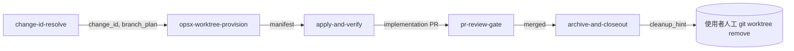

# opsx-worktree-provision — 設計留底

> Tooling-only 設計文件。**不入 OpenSpec change**，作為 `.claude/skills/opsx-worktree-provision/` 與 `closed-loop-orchestrator` Phase A 行為的 source of truth。日後規則調整應先改本文件再改 skill。

## 0. 動機

依 [AGENTS.md](../../AGENTS.md) 與 [CLAUDE.md](../../CLAUDE.md) §Git 與本機 agent 產物：

> OpenSpec change 不得直接在 `main` 上開發；`/openspec new <change-id>` 前先切到 `codex/openspec/<change-id>`，實作走 PR、GitHub Actions、merge，merge 後才 sync/archive specs。

原本的 `closed-loop-orchestrator` Phase A 採用 `git switch -c codex/openspec/<change-id>`（in-place 切換），會把 main worktree 直接帶離 main。本設計把 in-place 切換改為**建立 git worktree**，達到三件事：

1. main worktree 永遠停在 `main`，作為唯讀基準。
2. 每個 active change 有獨立 working directory，互不污染。
3. apply 結束後 worktree 保留供 review，依使用者意願清理。

## 1. 範圍

| 在範圍 | 不在範圍 |
|---|---|
| `codex/openspec/<change-id>` branch 的 worktree provisioning | OpenSpec change proposal / design / spec delta |
| `.env` 從 main 拷貝到 worktree（agent 執行） | venv 自動建立（首次 apply 由使用者各服務自行建） |
| Branch 解析（local / origin / 新建） | `.codex/worktrees/*` 殘留 GC（拆獨立 change） |
| Gate（dirty main、branch 衝突、worktree dirty） | Codex Code 對應 skill（後續 mirror） |

## 2. 路徑與命名規約

```txt
worktree 根目錄   <repo>/.worktrees/
worktree 子目錄   <change-id>/
完整路徑         <repo>/.worktrees/<change-id>/
分支             codex/openspec/<change-id>
```

`.worktrees/` 加入 `.gitignore`，與既有 `.claude/` / `.codex/` 同列為 agent 產物，不入 git。

## 3. 假設

| ID | 假設 | 來源 |
|---|---|---|
| S1 | 同時間只有一個 agent session 在跑 | 使用者決策 |
| S2 | Agent process 始終留在 main worktree (cwd = `<repo>`) | 規格設計 |
| S3 | 所有對 `codex/openspec/<change-id>` 的檔案操作走 worktree 絕對路徑 | S2 推導 |
| S4 | Worktree 內不需要 `.claude/` `.codex/` 任何 agent 產物 | S2 推導 |
| S5 | `.env` 為 main 的快照，main 後續變動不會自動同步 | env copy 政策 |
| S6 | 各服務的 `.venv` / `node_modules` 由使用者首次 apply 時自建 | venv 政策 |

## 4. 七步流程

### Step 1：cwd 驗證

```bash
git rev-parse --show-toplevel
git rev-parse --git-common-dir
```

- 當前 cwd 必須是 main worktree（top-level == git-common-dir 的 parent）。
- 不在 main → STOP，回報 `cwd-not-main`。

### Step 2：fetch origin

```bash
git fetch origin --prune
```

### Step 3：解析目標

```yaml
target_path: <repo_root>/.worktrees/<change-id>
branch: codex/openspec/<change-id>
```

### Step 4：衝突偵測

| 偵測 | 指令 | 失敗動作 |
|---|---|---|
| Branch 是否綁在其他 path | `git worktree list --porcelain` | STOP `branch-bound-elsewhere`，列出衝突 path |
| target_path 是否髒 | `git -C <target_path> status --porcelain`（若存在） | STOP `worktree-dirty`，提示上次 apply 未收尾 |
| main 是否髒 | `git status --porcelain` | STOP `main-dirty`，要求先 stash / commit |

### Step 5：建立或重用

```txt
case (target_path 存在?, branch 本地?, branch origin?):
  (T, *, *)       → 重用 (created_new = false)
  (F, T, *)       → git worktree add <target_path> <branch>
  (F, F, T)       → git worktree add <target_path> -b <branch> origin/<branch>
  (F, F, F)       → git worktree add <target_path> -b <branch> main
```

### Step 6：env copy（agent 執行）

掃描 main 的核心服務 `.env`，逐個 copy 到 worktree 對應位置：

```txt
scan_targets:
  - .env
  - _bim-control/.env
  - _worker/.env
  - bim-review-coordinator/.env
  - bim-streaming-server/.env
  - web-viewer-sample/.env
```

規則：

- **永不覆蓋**：若 worktree 內目標檔已存在，**跳過**並記在 `env_copied` 的 `skipped` 子段。
- **永不 log 內容**：只記檔名與大小，不 echo 任何 `.env` 內容。
- **永不 commit**：worktree 內 `.gitignore` 已涵蓋；不得 `git add` `.env`。
- **不 symlink**：採 hard copy，避免 Windows symlink 權限問題。

### Step 7：輸出 manifest

```yaml
change_id: <id>
worktree_path: <abs>
branch: codex/openspec/<id>
base_ref: main | origin/codex/openspec/<id> | reused
created_new: true | false
cwd_hint: <abs>           # 後續所有 git -C / cd 都用這個
env_copied:
  copied:
    - _worker/.env
    - _bim-control/.env
  skipped: []
venv_strategy: per-service-self-bootstrap
warnings:
  - ".env 是 main 快照，main 後續變動不會同步"
  - "首次 apply 需在 worktree 內各服務自建 venv"
  - ".claude / .codex 不在 worktree 內 (預期)"
```

## 5. Gate 統整

| Gate | 觸發條件 | 動作 |
|---|---|---|
| `cwd-not-main` | cwd 不是 main worktree | STOP |
| `main-dirty` | main `git status --porcelain` 非空 | STOP |
| `branch-bound-elsewhere` | `git worktree list` 顯示 branch 在另一 path | STOP，列出衝突 |
| `worktree-dirty` | target_path 內 `git status` 非空 | STOP |

> 不偵測 `.codex/worktrees/*` 殘留——那是獨立 follow-up change 的工作。

## 6. continue-existing 行為

對 `branch_plan == "continue-existing"`：

- **不**自動 `pull --rebase`（保守政策）。
- 由使用者在 apply 前自行決定何時 pull：

```bash
git -C <worktree_path> pull --rebase origin codex/openspec/<change-id>
```

理由：自動 rebase 若遇到衝突會卡在 worktree 內，agent 不易自動解開；保守政策讓使用者明確介入。

## 7. apply 結束後

- **不自動清**：worktree 保留供 review、後續 iteration、archive 同步。
- skill 在 apply 結束時輸出 `cleanup_hint`：

  ```bash
  git worktree remove <worktree_path>
  git branch -d codex/openspec/<change-id>
  ```

- 由 `archive-and-closeout` 收尾時再次提示，但仍由使用者人工執行。

## 8. 與既有 skill 的關係



- `change-id-resolve` 不變。
- `closed-loop-orchestrator` Phase A 在 `change-id-resolve` 後**插入** `opsx-worktree-provision`，取代原本的 `git switch -c`。
- `apply-and-verify` 觸發前提改為「已位於 manifest.cwd_hint worktree」。

## 9. 風險與緩解

| 風險 | 緩解 |
|---|---|
| Windows 路徑長度（worktree + `node_modules`） | `.worktrees/<id>/` 短前綴；必要時提示啟用 `core.longPaths=true` |
| `.env` 為 main 快照、main 改動不同步 | manifest.warnings 明確列出；長 apply session 提示重新 copy |
| `.venv` 不在 worktree 內 | 規格規定首次 apply 在 worktree 內各服務自建 venv |
| 殘留 worktree 累積 | 不自動清；列為 follow-up change 處理 |
| `git worktree add` 在 ignored dir 建立 | 實測無問題；worktree 機制獨立於 `.gitignore` |
| 並行 agent | 假設 S1 排除；若日後需要再回頭設計 lock |

## 10. 雙 agent 後續

本次 scope 只做 Claude Code 端。若日後要支援 Codex Code：

- `.codex/skills/opsx-worktree-provision/SKILL.md` 內容與 `.claude/` 版本鏡像。
- 兩邊 skill 都 reference 本文件作為 canonical 規格。
- 不需要任何 cross-agent locking（假設 S1 仍成立）。

## 11. Follow-up（不在本次）

- `.codex/worktrees/*` 殘留 GC（獨立 change）。
- `apply-and-verify` 結束時自動移除 worktree 的選項（需先設計清理 gate）。
- Codex Code 對應 skill mirror。
