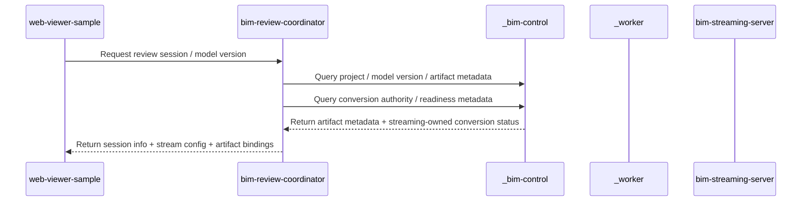
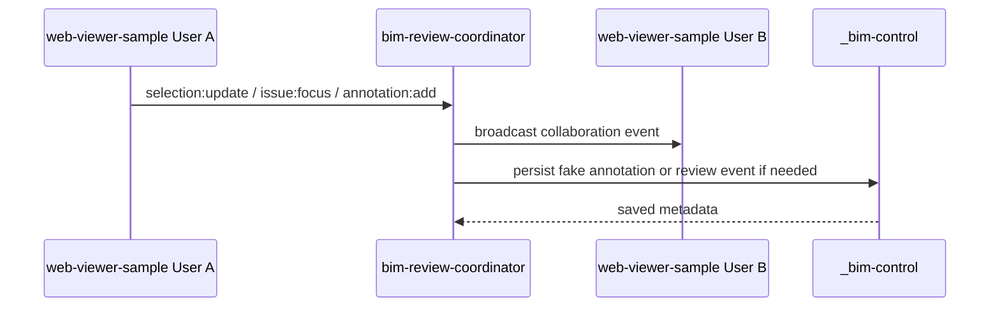
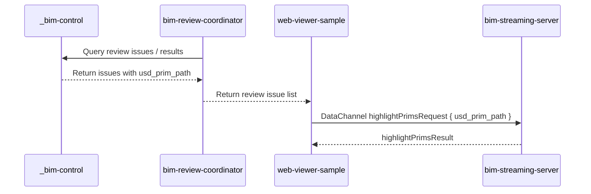

> Loaded lazily by AGENTS.md / CLAUDE.md。Source-of-truth: AGENTS.md。
>
> 何時讀本檔：看舊 PR / commit、解讀歷史 OpenSpec spec archive（流程已退役，僅供歷史參考）、了解為什麼 `_worker` / `_bim-control` 在歷史文件出現但不在 product runtime 時。

# 歷史 `_worker` / `_bim-control` 退役脈絡

`_worker/` 與 `_bim-control/` 已自 repo product runtime 刪除（[2026-05-18 B 方案落地]，change `local-coordinator-ifc-ready-intake-boundary` / PR #63）。它們只可作為：

- 歷史脈絡（解讀舊 archive 文件）
- 歷史 OpenSpec spec archive context（流程已退役，僅供歷史參考）
- `tests/fakes` / `tests/contracts` 的 test-double 對照

不得作為現行 startup、health check、smoke、review-session dependency 或 agent repo 邊界。

現行 runtime 邊界與閉環見 `docs/agents/repo-boundary-detail.md` §1.A / §10 / §11。

---

## 3.1 Retired `_bim-control/`（historical / test-double reference）

### 角色

```txt
Fake BIM Platform / Fake Data Authority
```

### 邊界

`_bim-control` 已不是本 repo runtime。下列描述只代表刪除前的歷史角色；現行公司雲端 control-plane 屬外部既有系統，測試僅由 `tests/fakes/cloud_bim_control_api.py` 模擬。

歷史上它曾負責提供或保存：

```txt
- project metadata
- model version metadata
- model artifact metadata
- issue metadata
- annotation metadata
- element mapping metadata
- review result metadata
```

它不負責：

```txt
- 真實 Revit plugin
- 真實 SSO / 權限系統
- Omniverse rendering
- WebRTC streaming
- GPU instance lifecycle
- 實際大型檔案 byte storage
- USD stage 操作
```

### 資料邊界

歷史 `_bim-control` 保存的是「資料描述」與「關聯關係」，不是 GPU runtime，也不是真實物件儲存。現行 B 方案只保留 contract / fake 對照，不啟動此服務。

例如：

```txt
model_version_id
artifact_id
artifact_format
file_url
usd_url
issue_id
annotation_id
ifc_guid
usd_prim_path
```

---

## 3.2 Retired Legacy Storage / Conversion Services

### 角色

```txt
Historical local compatibility services
```

### 邊界

`_s3_storage`、`_conversion-service`、`_conversion-server` 不屬於目前 demo runtime 的核心服務，也不應作為新的 startup、health check、smoke test 或 review-session dependency。

目前 B 方案 flow 的 IFC-ready handoff 由外部客戶落地端 IFC Worker 送到 `bim-review-coordinator`；IFC→USDC conversion job 與 derived artifact readiness 由 `bim-streaming-server` 承接。歷史文件若仍提到舊服務，只能作為 archive context，不能覆蓋本文件的 current boundary。

舊服務不得：

```txt
- 被重新加入 current core service list
- 重新佔用 8002 / 8003 作為 demo 必要服務
- 取代外部客戶落地端 IFC Worker 成為 IFC-ready handoff 來源
- 取代外部公司雲端 control-plane 成為資料權威
```

### 資料邊界

B 方案下，本 repo 只保存客戶落地端 data-plane 所需的最小 shadow metadata。`bim-streaming-server` 擁有 IFC→USDC conversion job 與 derived USDC / mapping / entity index 輸出；外部公司雲端 control-plane 保存「這個檔案屬於哪個 project / model version / artifact」的權威 metadata。兩者不可混淆。

---

## 3.3 Retired `_worker/`（historical / test-double reference）

### 角色

```txt
RVT→IFC Worker Bridge
```

### 邊界

`_worker` 已不是本 repo runtime。下列描述只代表刪除前的歷史 RVT→IFC bridge / worker artifact handoff 邊界；現行外部 IFC Worker 屬客戶落地端既有系統，測試僅由 `tests/fakes/external_ifc_worker_client.py` 模擬。

歷史上它曾負責：

```txt
- 接收 _bim-control 的 rvt_uploaded event
- 建立與查詢 RVT→IFC export job
- 建立 versioned object layout for source RVT 與 derived IFC
- 在 real Revit/export prerequisites 缺失時回報 blocked，或明確使用 fake fixture mode
- 產出 IFC artifact 或 blocked/failed result
- 以 ifc_ready webhook 將 IFC artifact handoff 給 bim-streaming-server
- 保留 RVT source → IFC artifact lineage
- 將 RVT / IFC handoff metadata 發布到 _bim-control
```

它不負責：

```txt
- project / issue / annotation 的資料權威
- review session lifecycle 的總控
- IFC→USDC conversion job authority
- model.usdc / element_mapping.json / entity_index.json readiness authority
- mapping quality metrics 的最終 conversion result authority
- Omniverse viewport rendering
- WebRTC streaming
- 使用者登入與權限
- 取代 web-viewer-sample 成為 UI
```

### 資料邊界

歷史 `_worker` 可保存 RVT source、IFC handoff artifact 與 RVT→IFC export lineage，但現行 repo 不啟動此服務。IFC→USDC 的 job state、derived USDC、mapping、entity index、quality metrics result 由 `bim-streaming-server` 承接；公司雲端 control-plane 權威屬外部既有系統，本 repo 僅保存最小 shadow metadata。

---

## 3.4 Retired 資料流敘事（原 repo-boundary-detail §5.1 / §5.4 / §5.5 / §7.4）

> [2026-07-02 自 repo-boundary-detail 遷入；原章節殼保留於原檔]

### 5.1 Artifact Discovery Flow



### 邊界說明

```txt
web-viewer-sample 不直接決定模型資料權威。
bim-review-coordinator 負責協調查詢。
_bim-control 決定哪個 artifact 屬於哪個 model version。
_worker 是 RVT→IFC handoff 邊界。
bim-streaming-server 是 IFC→USDC conversion job 與 derived artifact readiness 邊界。
```

### 5.4 Collaboration Flow



### 邊界說明

```txt
多人協作事件由 bim-review-coordinator 作為中心。
web-viewer-sample 發出使用者互動事件。
_bim-control 只保存需要成為審查資料的 metadata。
bim-streaming-server 不作為多人協作事件中心。
```

### 5.5 Review Result Visualization Flow



### 邊界說明

```txt
Review issue metadata 由 _bim-control 提供。
Issue 的 3D 視覺化由 bim-streaming-server 處理。
web-viewer-sample 只是把使用者操作轉成 DataChannel command。
bim-review-coordinator 負責把 session 與 review metadata 串起來。
```

### 7.4 Review 資料

```txt
issue / annotation / review result
```

其資料權威是：

```txt
_bim-control
```

其多人事件流由：

```txt
bim-review-coordinator
```

其 3D runtime 顯示由：

```txt
bim-streaming-server
```

其使用者操作入口由：

```txt
web-viewer-sample
```

---

## 3.5 Retired 通訊方式表（原 repo-boundary-detail §6，涉及已刪除 `_bim-control` / `_worker` 的 3 列）

> [2026-07-02 自 repo-boundary-detail 遷入；原章節殼保留於原檔]

| 通訊方式 | 起點 | 終點 | 用途 |
|---|---|---|---|
| REST | `bim-review-coordinator` | `_bim-control` | 查詢 project / version / artifact / issue / annotation metadata |
| REST | `web-viewer-sample` / `bim-review-coordinator` | `_worker` | 建立 source artifact、conversion job、查詢 artifact group readiness |
| REST / Static file | `_bim-control` 或 `bim-streaming-server` | `_worker` | 取得 current flow object URL |

---

## 3.6 Retired `_bim-control` / `_worker` 補充邊界規則（原 repo-boundary-detail §7.1 BIM 原始資料 ownership split + §8.5 `_worker` 不應做的事 補充 3 條）

> [2026-07-02 自 repo-boundary-detail 遷入；原章節殼保留於原檔]

### 7.1 BIM 原始資料 Ownership Split

RVT source / signed reference 的版本與專案關聯屬於：

```txt
_bim-control
```

RVT→IFC bridge 的檔案與 handoff lineage 屬於：

```txt
_worker
```

### 8.5 `_worker` 不應做的事

```txt
- 不保存 project / issue / annotation 的資料權威
- 不管理 review session lifecycle
- 不分配 GPU 或管理 Kit runtime
- 不直接操作 USD stage
- 不作為多人協作事件中心
- 不取代 web-viewer-sample 成為 UI
```

---

## 3.7 Local-Coordinator-IFC-Ready-Intake-Boundary 落地執行紀錄（原 repo-boundary-detail §1.A 落地方式與衝突管理）

> [2026-07-02 自 repo-boundary-detail 遷入；原章節殼保留於原檔]

### 落地方式與衝突管理（重點）

```txt
- 程式碼層（退役/收斂 _worker、_bim-control；改寫 §10 閉環；
  收斂啟動腳本；把 webhook 來源改為外部客戶落地端 IFC Worker；
  調整相關 specs）已由 OpenSpec change
  `local-coordinator-ifc-ready-intake-boundary` / PR #63 落地。
- [2026-05-18 更新] predecessor change introduce-ai-bim-runtime-manager-docker-kit-mvp
  已 merged（PR #59 / mergeCommit 55a9703）並 archived
  （openspec/changes/archive/2026-05-18-introduce-ai-bim-runtime-manager-docker-kit-mvp/，
   新 capability runtime-manager-docker-kit-mvp 已 sync 進 openspec/specs/）。
  NoSuccessorWhilePredecessorOpen gate 已清除：
  Phase B 程式碼層 change 可從 synced main 開
  codex/openspec/external-platform-webhook-intake-boundary 升格實作
  （草稿已升格並 archived，見 openspec/changes/archive/2026-05-18-local-coordinator-ifc-ready-intake-boundary/）。
- 歷史 `_worker` / `_bim-control` 文件若尚未完全移除，僅保留作 archive context；
  `tests/fakes` 與 `tests/contracts` 才是外部平台模擬入口，非 runtime profile。
```
