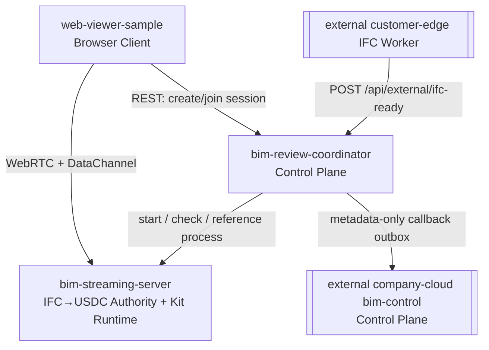
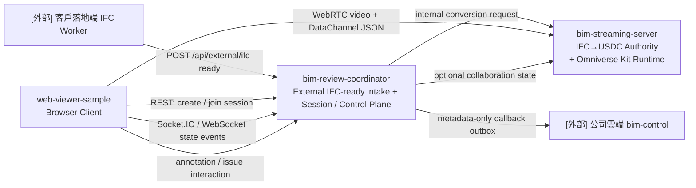
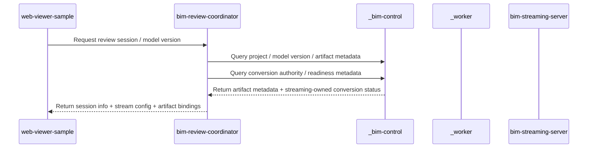
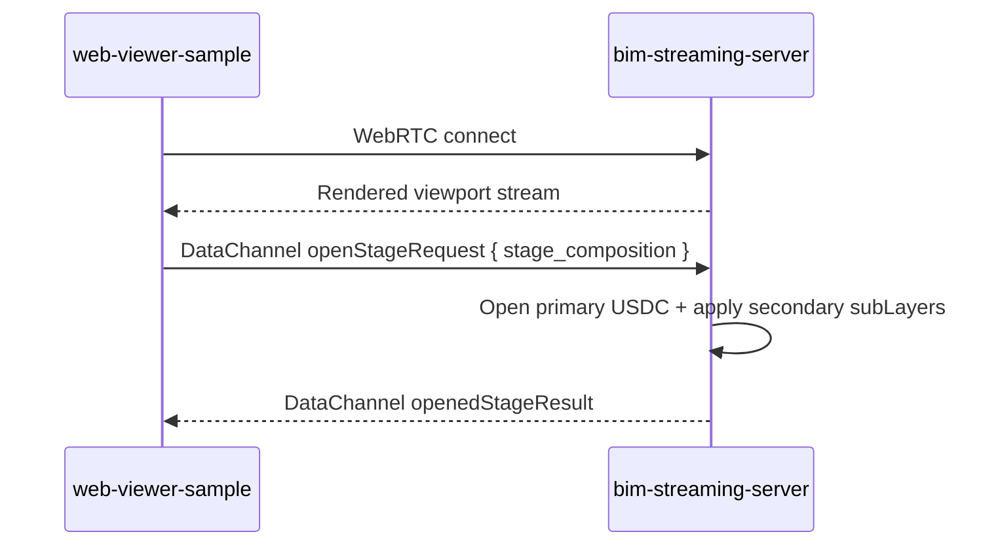
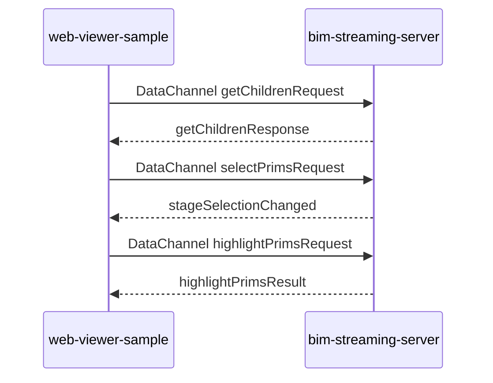
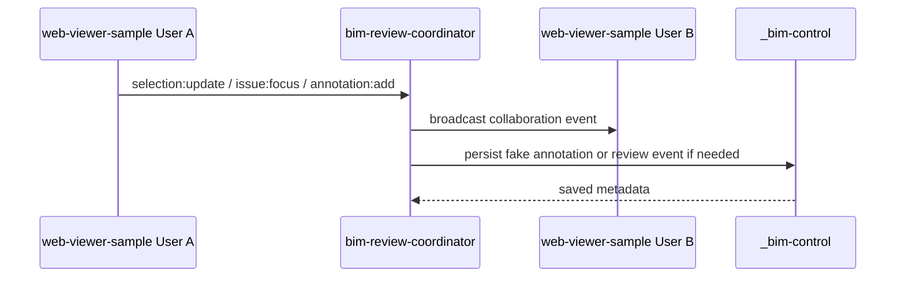
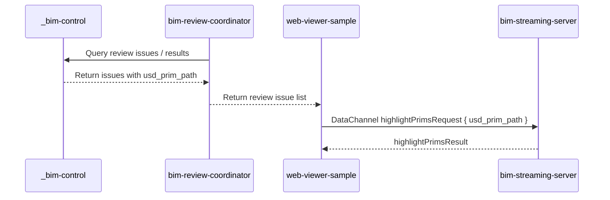

> Loaded lazily by AGENTS.md / CLAUDE.md。Source-of-truth: AGENTS.md。
>
> 何時讀本檔：需要做跨 sub-repo 決策、修改 repo boundary、查 data 權威歸屬、追資料流時。

# Repo Boundary Detail

`AI-BIM-governance/` workspace 的完整 repo 邊界、資料流動、互動方式與禁止跨界規則。AGENTS.md 主檔只保留一句話摘要與 mermaid 入口；本檔承擔完整細節。

---

## 1. Workspace 範圍

主要開發資料夾：

```txt
AI-BIM-governance/
```

核心 repo / folder：

```txt
AI-BIM-governance/
├── bim-review-coordinator/      # 控制中心，localhost:8004
├── bim-streaming-server/        # Kit streaming + IFC→USDC authority，WebRTC 49100
├── web-viewer-sample/           # browser client，localhost:5173
└── tests/                       # external platform contracts + test-only fakes
```



其中：

```txt
bim-review-coordinator/
bim-streaming-server/
web-viewer-sample/
tests/contracts/
tests/fakes/
```

是 B 方案後正式架構中的核心互動 repo / test-only fixture。`_worker/` 與 `_bim-control/` 已自 repo 刪除；歷史描述見 `docs/agents/history-and-archive.md`。

---

## 1.A 架構決策（2026-05-15）：外部既有平台邊界與 webhook intake

> 依使用者明確指令與 `BIM模型管理平台 系統架構_260514.pdf`（雲地分離）。本節為 **B 方案落地後的現行邊界**，優先序高於下方保留的歷史描述。`_bim-control` / `_worker` 已不再是本 repo runtime 依賴。

### 決策

```txt
1. PDF 平台（公司雲端 Web門戶/MySQL/SSO + 客戶落地端 IFC Worker+Revit）
   = 外部既有系統，已部署於公司測試機/正式機
   （ppms 192.168.20.238 / normal 192.168.20.237），
   不屬於 AI-BIM-governance 的功能開發範圍。
2. `_bim-control` / `_worker` 已**自 repo 刪除**（removed from product runtime，
   **非降級、非保留為 offline fake runtime profile**）；外部公司雲端 control-plane
   與客戶落地端 IFC Worker 屬外部既有系統，僅由 `tests/fakes` + `tests/contracts`
   模擬（design D4：test fixture，非 runtime）。**[2026-05-18 B 方案落地]**
3. 本 repo 唯一對外入口 = `bim-review-coordinator` `POST /api/external/ifc-ready`
   （caller = 客戶落地端 IFC Worker，落地端內網，Service auth）；收到後建立
   local conversion job 並對 `bim-streaming-server` 發 internal conversion
   request（internal-only：spec `streaming-ifc-usdc-conversion-authority`
    + `conversion-webhook-lifecycle`）；轉檔結果以 metadata-only callback
   outbox 回拋公司雲端（spec `external-cloud-callback-lifecycle`）。
4. 本 repo 開發範圍收斂為：
   webhook intake → IFC→USDC → Kit streaming → BIM 治理
   （bim-streaming-server / bim-review-coordinator / web-viewer-sample）。
```

### 落地方式與衝突管理（重點）

```txt
- 程式碼層（退役/收斂 _worker、_bim-control；改寫 §10 閉環；
  收斂啟動腳本；把 webhook 來源改為外部客戶落地端 IFC Worker；
  調整相關 specs）已由 OpenSpec change
  `local-coordinator-ifc-ready-intake-boundary` / PR #63 落地。
- [2026-05-18 更新] predecessor change introduce-ai-bim-runtime-manager-docker-kit-mvp
  已 merged（PR #59 / mergeCommit 55a9703）並 archived
  （openspec/changes/archive/2026-05-18-introduce-ai-bim-runtime-manager-docker-kit-mvp/，
   新 capability runtime-manager-docker-kit-mvp 已 sync 進 openspec/specs/）。
  NoSuccessorWhilePredecessorOpen gate 已清除：
  Phase B 程式碼層 change 可從 synced main 開
  codex/openspec/external-platform-webhook-intake-boundary 升格實作
  （草稿見 docs/plans/phase-b-external-platform-webhook-intake-DRAFT-2026-05.md）。
- 歷史 `_worker` / `_bim-control` 文件若尚未完全移除，僅保留作 archive context；
  `tests/fakes` 與 `tests/contracts` 才是外部平台模擬入口，非 runtime profile。
```

> **[2026-05-18 修訂｜依 `planB.txt`]** 本決策已細化（取代上方「降級為 fake / offline profile」字面）：(1) `_worker` / `_bim-control` **自 repo 刪除**（非降級保留），測試改 `tests/fakes` + contract fixtures；(2) 對外 intake 收斂於 **`bim-review-coordinator`**（`POST /api/external/ifc-ready`），`bim-streaming-server` 僅 internal conversion engine；(3) webhook caller = 客戶落地端 IFC Worker（落地端內網，非公司測試機直連）；(4) 新增**雲端 callback outbox**（metadata-only，禁傳 `.usdc` 大檔）；(5) 公司雲端=control-plane / 本 repo=客戶落地端 data-plane 權威切分；(6) change-id `local-coordinator-ifc-ready-intake-boundary` 已於 PR #63 apply。完整方案見 `docs/plans/phase-b-external-platform-webhook-intake-DRAFT-2026-05.md`。**§10/§11 為現行閉環；其他歷史段落若與本決策衝突，以本節與 §10/§11 為準。**

---

## 2. 核心 repo 的定位總覽



一句話定位：

```txt
[外部] company cloud  = control-plane 權威（本 repo 不 mirror）
[外部] IFC Worker     = 客戶落地端 IFC 產出者（本 repo 不啟動）
bim-review-coordinator = 唯一對外 IFC-ready intake + Session / 協作控制中心
bim-streaming-server   = IFC→USDC conversion authority + Omniverse GPU / USD / WebRTC Runtime
web-viewer-sample      = Browser 操作端與串流觀看端
tests/fakes/contracts  = 外部平台 test-only doubles，非 runtime profile
```

---

## 3. Repo 邊界

> **B 方案現行判讀規則**：本節中提到 `_bim-control` / `_worker` 的角色描述只保留為歷史邊界與 test-double 對照；兩者已自 product runtime 刪除（細節見 `docs/agents/history-and-archive.md`）。現行 runtime 邊界以 §1.A、§10、§11 為準。

## 3.4 `bim-review-coordinator/`

### 角色

```txt
Session Control Plane / Collaboration Coordinator
```

### 邊界

`bim-review-coordinator` 是 review session 的協調中心。

它負責協調：

```txt
- review session 狀態
- browser client 與 Kit streaming server 的連線資訊
- user presence / collaboration state
- selection / annotation / issue focus 等協作事件
- fake BIM platform 與 fake storage 的資料查詢路由
```

它不負責：

```txt
- USD stage loading
- Omniverse viewport rendering
- WebRTC video encoding
- IFC / USD 檔案內容轉換
- 直接保存大型檔案
- 取代 _bim-control 成為資料權威
- 取代 web-viewer-sample 成為 UI
```

> **例外 carve-out(2026-05-21,change `fast-ifc-link-demo-loop`)**:
> 允許 coordinator 在 `POST /api/external/ifc-ready` 的同步階段,將外部 IFC 下載
> 至本地 shared volume 路徑 `storage/ifc-cache/<ifc_ready_job_id>/source.ifc`,
> 作為 dispatch streaming-server 前的**臨時通道快取**(非資料權威)。coordinator
> 不視為該 IFC bytes 的資料權威:權威仍屬外部公司雲端 control-plane
> (`external_model_version_id` 參照),streaming-server 為 conversion authority。
> 規範細節見 spec `local-coordinator-ifc-ready-intake-boundary` 內
> `Coordinator synchronously downloads IFC to shared volume before responding`
> requirement。Transition 過後若另有設計(streaming-server 直接從 MinIO pull、
> 或 sidecar service 處理下載),carve-out 可由新 OpenSpec change 收斂回原邊界。

### 控制邊界

`bim-review-coordinator` 可以知道：

```txt
session_id
user_id
model_version_id
kit_instance_id
stream_config
presence state
collaboration event
```

但不應該知道或操作：

```txt
USD internal prim tree implementation
Omniverse material / camera / renderer internal details
large binary file bytes
```

---

## 3.5 `bim-streaming-server/`

### 角色

```txt
IFC→USDC Conversion Authority / Omniverse Kit Runtime / GPU Streaming Server
```

### 邊界

`bim-streaming-server` 是 B 方案的 IFC→USDC conversion job authority，同時仍是 Omniverse Kit runtime。

它負責處理：

```txt
- 接收 _worker 的 ifc_ready handoff
- 建立 conversion_job_id 並管理 queued / running / succeeded / failed / cancelled 狀態
- 對外提供 IFC→USDC conversion status / result API
- 透過 headless converter app / subprocess / worker lane 執行 heavy conversion
- 產出 model.usdc、element_mapping.json、entity_index.json、metadata.json 或等價 result payload
- 保留 mapping quality metrics、sidecar carrier 與 no-placeholder-ready 語意
- callback _bim-control conversion_result_ready / conversion_failed
- USD / USDC stage runtime
- Omniverse Kit viewport
- GPU rendering
- WebRTC video stream
- WebRTC DataChannel JSON command
- stage tree / prim selection / camera / visual overlay 的 runtime 操作
```

它不負責：

```txt
- project / model version 的資料權威
- 使用者登入與權限
- review session lifecycle 的總控
- 多人協作事件的中心廣播
- 長期 annotation / issue 儲存
- 假 S3 檔案倉庫
- 假 BIM API
- 阻塞 live WebRTC viewport thread 執行大型 IFC→USDC conversion
```

### Runtime 邊界

`bim-streaming-server` 只處理「目前這個 stream session 中的 3D runtime 狀態」。

它可以處理：

```txt
目前開啟哪個 USD / USDC
目前選取哪個 prim
目前 viewport camera 狀態
目前套用哪些 visual overlay
```

但這些狀態若要成為正式審查資料，必須回寫到 `_bim-control` 或正式資料權威。

---

## 3.6 `web-viewer-sample/`

### 角色

```txt
Browser Client / WebRTC Viewer / User Interaction Layer
```

### 邊界

`web-viewer-sample` 是瀏覽器操作端。

它負責：

```txt
- 顯示 WebRTC 串流畫面
- 送出 DataChannel JSON command 給 bim-streaming-server
- 接收 bim-streaming-server 回傳的 scene state / command result
- 與 bim-review-coordinator 交換 session / collaboration state
- 顯示 project / issue / annotation / stage tree 等 UI 狀態
```

它不負責：

```txt
- 啟動或停止 Kit server
- 分配 GPU
- 保存專案資料
- 保存大型模型檔案
- 執行 IFC / USD 轉檔
- 執行法規 / 碳排 / AI 判斷
- 取代 coordinator 管理 session
```

### Client 邊界

`web-viewer-sample` 是使用者對整個系統的操作入口，但不是資料權威，也不是 GPU runtime。

它可以送出操作意圖，例如：

```txt
open stage
select prim
highlight issue
add annotation
focus issue
join session
leave session
```

但操作結果應該由對應 repo 處理：

```txt
3D runtime 操作 → bim-streaming-server
session / collaboration → bim-review-coordinator
metadata / review data → _bim-control
file / conversion access → _worker
```

---

## 4. 資料類型與歸屬

| 資料類型 | 權威 repo / folder | 說明 |
|---|---|---|
| Project metadata | 外部公司雲端 `bim-control` | Control-plane 權威；本 repo 不 mirror |
| Model version metadata | 外部公司雲端 `bim-control` | 以 `external_model_version_id` 參照 |
| Artifact metadata | 外部公司雲端 `bim-control` + 本地最小 shadow | 高階索引在雲端；本地只保存轉檔與 callback 必要欄位 |
| Source IFC reference | 外部客戶落地端 IFC Worker + `bim-review-coordinator` shadow | IFC 產出者為外部系統；coordinator 保存 ref/etag/correlation |
| USD / USDC file | `bim-streaming-server` | B 方案 IFC→USDC conversion authority 產出的衍生檔 |
| element_mapping.json / entity_index.json | `bim-streaming-server` + 本地 shadow | 檔案由 streaming conversion result 產出；雲端只接 metadata-only callback |
| Callback delivery state | `bim-review-coordinator` | metadata-only outbox / retry / dead-letter |
| Review issue metadata | 外部公司雲端 `bim-control` / 本地最小 shadow | 真實權威在外部 control-plane |
| Annotation metadata | `bim-review-coordinator` local event + 外部 control-plane callback | 本地保存協作事件；正式權威依外部平台決定 |
| Review session state | `bim-review-coordinator` | 當前 session 狀態 |
| Collaboration state | `bim-review-coordinator` | presence / selection / issue focus / annotation event |
| USD stage runtime state | `bim-streaming-server` | 當前 Omniverse scene runtime 狀態 |
| Browser UI state | `web-viewer-sample` | 當前前端 UI 狀態 |

---

## 5. 核心資料流

## 5.1 Artifact Discovery Flow



### 邊界說明

```txt
web-viewer-sample 不直接決定模型資料權威。
bim-review-coordinator 負責協調查詢。
_bim-control 決定哪個 artifact 屬於哪個 model version。
_worker 是 RVT→IFC handoff 邊界。
bim-streaming-server 是 IFC→USDC conversion job 與 derived artifact readiness 邊界。
```

---

## 5.2 Streaming Flow



### 邊界說明

```txt
WebRTC video stream 只存在於 web-viewer-sample 與 bim-streaming-server 之間。
USD / USDC conversion result 由 bim-streaming-server 在 B 方案下提供。
bim-streaming-server 載入、渲染，且是 IFC→USDC conversion job authority；它仍不成為 project / issue / annotation 的資料權威。
```

---

## 5.3 Scene Interaction Flow



### 邊界說明

```txt
Scene interaction 是 browser client 與 Kit runtime 之間的 DataChannel JSON 流程。
這些 runtime interaction 不等於正式資料保存。
若要保存成審查紀錄，必須經 coordinator / _bim-control 回寫。
```

---

## 5.4 Collaboration Flow

> **退役狀態(2026-05-21,change `remove-conflict-review-from-fast-mvp`)**:本節
> collaboration broadcast(highlight / selection / annotation)在 coordinator 與
> viewer 兩端的 implementation 已從 fast MVP product runtime 移除(`reviewNamespace.ts`
> 內的 `highlightRequest` / `selectionUpdate` / `annotationCreate` Socket.IO event
> handlers、viewer `IssuePanel` / `EventLogPanel` 已刪)。本 sequence 保留作為
> archive context;viewer Change 2 (`fast-ifc-link-demo-loop`) 將 viewer 主畫面
> 收斂為「全螢幕 stream + 邊框 HUD」,不含多人協作 UI。若未來重新引入,以新
> OpenSpec change form ADD requirement 與 viewer slot。



### 邊界說明

```txt
多人協作事件由 bim-review-coordinator 作為中心。
web-viewer-sample 發出使用者互動事件。
_bim-control 只保存需要成為審查資料的 metadata。
bim-streaming-server 不作為多人協作事件中心。
```

---

## 5.5 Review Result Visualization Flow

> **退役狀態(2026-05-21,change `remove-conflict-review-from-fast-mvp`)**:本節
> review issue → DataChannel `highlightPrimsRequest` 的「issue 流」入口
> (viewer `IssuePanel` + coordinator `getReviewIssues` / `review-bootstrap`
> endpoint)已從 fast MVP product runtime 移除。DataChannel `highlightPrimsRequest`
> 本身保留作 mapping highlight 工具(Window.tsx `_onMappingItemClick`),Change 2
> 重做 viewer 時再評估。若 issue 流要重新引入,以新 OpenSpec change form ADD。



### 邊界說明

```txt
Review issue metadata 由 _bim-control 提供。
Issue 的 3D 視覺化由 bim-streaming-server 處理。
web-viewer-sample 只是把使用者操作轉成 DataChannel command。
bim-review-coordinator 負責把 session 與 review metadata 串起來。
```

---

## 6. 通訊方式邊界

| 通訊方式 | 起點 | 終點 | 用途 |
|---|---|---|---|
| REST | `web-viewer-sample` | `bim-review-coordinator` | 建立 session、查詢 session、取得 stream config |
| REST | `bim-review-coordinator` | `_bim-control` | 查詢 project / version / artifact / issue / annotation metadata |
| REST | `web-viewer-sample` / `bim-review-coordinator` | `_worker` | 建立 source artifact、conversion job、查詢 artifact group readiness |
| REST / Static file | `_bim-control` 或 `bim-streaming-server` | `_worker` | 取得 current flow object URL |
| WebRTC video | `bim-streaming-server` | `web-viewer-sample` | 串流 Omniverse viewport 畫面 |
| WebRTC DataChannel JSON | `web-viewer-sample` | `bim-streaming-server` | open stage、selection、highlight、scene query |
| WebSocket / Socket.IO | `web-viewer-sample` | `bim-review-coordinator` | presence、selection、annotation、issue focus 等多人事件 |
| Optional WebSocket | `bim-streaming-server` | `bim-review-coordinator` | Kit runtime 接收多人狀態 overlay，不作為主要資料權威 |

---

## 7. Source of Truth 原則

## 7.1 BIM 原始資料

```txt
IFC / RVT / DWG = 原始模型資料
```

RVT source / signed reference 的版本與專案關聯屬於：

```txt
_bim-control
```

RVT→IFC bridge 的檔案與 handoff lineage 屬於：

```txt
_worker
```

---

## 7.2 Omniverse Runtime 資料

```txt
USD / USDC = rendering / streaming artifact
```

其 conversion job、檔案本體與 result payload 屬於：

```txt
bim-streaming-server
```

其 runtime 操作屬於：

```txt
bim-streaming-server
```

---

## 7.3 Mapping 資料

```txt
IFC GUID ↔ USD Prim Path
```

這是 BIM 語意資料與 Omniverse 視覺化資料之間的橋。

```txt
mapping file body      → bim-streaming-server
mapping metadata       → _bim-control
mapping runtime usage  → web-viewer-sample / bim-streaming-server
```

---

## 7.4 Review 資料

> **退役狀態(2026-05-21,change `remove-conflict-review-from-fast-mvp`)**:issue
> / annotation / review result 的 fast MVP product runtime 已移除(`ReviewIssue`
> interface、`getReviewIssues` / `createAnnotation` / `getReviewBootstrap` /
> `IssuePanel` / `EventLogPanel` 已刪)。本表保留作 archive context,記錄歷史權威
> 劃分。若 review 流要重新引入,以新 OpenSpec change form ADD requirement 與
> coordinator / viewer 端配套。

```txt
issue / annotation / review result
```

其資料權威是：

```txt
_bim-control
```

其多人事件流由：

```txt
bim-review-coordinator
```

其 3D runtime 顯示由：

```txt
bim-streaming-server
```

其使用者操作入口由：

```txt
web-viewer-sample
```

---

## 8. 禁止跨界規則

## 8.1 `web-viewer-sample` 不應做的事

```txt
- 不啟動 Kit server
- 不分配 GPU
- 不保存 project / model / issue 的資料權威
- 不保存大型模型檔案
- 不執行 IFC / USD 轉檔
```

## 8.2 `bim-streaming-server` 不應做的事

```txt
- 不管理使用者登入
- 不管理 project / model version
- 不作為 annotation / issue 長期資料庫
- 不作為多人協作事件中心
- 不取代 _bim-control
- 不取代 _worker
```

## 8.3 `bim-review-coordinator` 不應做的事

```txt
- 不渲染 3D
- 不開啟 USD stage
- 不處理 Omniverse renderer internal state
- 不保存大型模型檔案
- 不取代 _bim-control 成為資料權威
- 不取代 web-viewer-sample 成為 UI
```

## 8.4 `_bim-control` 不應做的事

```txt
- 不做 Omniverse rendering
- 不做 WebRTC streaming
- 不做 GPU runtime 管理
- 不直接操作 USD stage
- 不保存大型 binary file body
```

## 8.5 `_worker` 不應做的事

```txt
- 不保存 project / issue / annotation 的資料權威
- 不管理 review session lifecycle
- 不分配 GPU 或管理 Kit runtime
- 不直接操作 USD stage
- 不作為多人協作事件中心
- 不取代 web-viewer-sample 成為 UI
```

---

## 9. Optional Mock Services 說明

`AI-BIM-governance/` 之後可以存在其他 mock folders，例如：

```txt
_ai-rule-carbon-service/
_mock-auth/
_mock-sensor-service/
```

這些不屬於本文件定義的核心 repo。若歷史計畫文件提到 `_s3_storage`、`_conversion-service` 或 `_conversion-server`，那些引用只代表舊設計背景；目前 runtime 不啟動、不檢查、也不依賴這些服務。

若它們存在，邊界原則如下：

```txt
- 它們只提供假資料、假結果或本地測試用資料處理。
- 它們不應越過 _bim-control 成為正式資料權威。
- 它們不應越過 bim-streaming-server 直接控制 Omniverse viewport。
- 它們不應越過 bim-review-coordinator 管理 session / collaboration。
- 它們不應越過 web-viewer-sample 成為 browser UI。
```

---

## 10. Workspace 最重要閉環

> **B 方案（local-coordinator-ifc-ready-intake-boundary，2026-05-18 落地）**：`_worker` / `_bim-control` 已**自 repo 刪除**（非降級），只由 `tests/fakes` + `tests/contracts` 模擬外部既有平台。對外入口收斂於 `bim-review-coordinator`；`bim-streaming-server` 為 internal-only 轉檔引擎；轉檔結果以 metadata-only callback 回拋公司雲端（outbox）。

整個 workspace 要保護的最小閉環（B 方案）是：

```txt
[外部] 客戶落地端 IFC Worker 產出 .ifc
→ POST /api/external/ifc-ready 至 bim-review-coordinator（落地端內網，Service auth）
→ bim-review-coordinator 驗證 / idempotency / 建立 local conversion job
   並綁定 external_model_version_id
→ bim-review-coordinator 對 bim-streaming-server 發 internal conversion request
→ bim-streaming-server（internal-only）執行 IFC→USDC，產出 USDC / element_mapping / manifest
→ bim-review-coordinator 取得結果，組 metadata-only callback 入 callback_outbox
   （retry / dead-letter；不傳 .usdc 本體）→ 回拋 [外部] 公司雲端 bim-control
→ bim-review-coordinator 建立 / 維護 review session 與 local web view session
→ web-viewer-sample 取得 session / stream config（使用者經可替換 auth provider）
→ web-viewer-sample 連到 bim-streaming-server
→ bim-streaming-server 載入 USD / USDC
→ web-viewer-sample 顯示 stream 畫面
→ 使用者點選 issue / prim → web-viewer-sample 送 DataChannel command
→ bim-streaming-server 執行 3D highlight / selection
→ web-viewer-sample 送 annotation / collaboration event
→ bim-review-coordinator 廣播 / 回寫；最小 shadow metadata 留本地
   （control-plane 權威屬公司雲端，不 mirror）
```

任何修改都不應破壞這條閉環。歷史的 `_bim-control 接收 fake RVT → _worker RVT→IFC → _bim-control 保存 metadata` 閉環已隨兩服務刪除而退役，僅作 archive context，不得作為 startup / health / smoke / review-session 依賴。

---

## 11. 總結

本 workspace 的核心分工（B 方案）是：

```txt
bim-review-coordinator
= 唯一對外 IFC-ready intake（Service auth / idempotency / external_model_version_id
  binding）+ Session / collaboration control plane + 雲端 metadata-only callback
  outbox + local web view session + 最小 shadow metadata（data-plane）

bim-streaming-server
= internal-only IFC→USDC conversion engine（由 coordinator internal request 觸發）
  + Omniverse Kit runtime / WebRTC streaming / USD scene runtime

web-viewer-sample
= Browser client / user interaction layer

[外部，非本 repo] 公司雲端 bim-control = control-plane 權威
[外部，非本 repo] 客戶落地端 IFC Worker = 外部 IFC 產出者

_worker / _bim-control
= 已自 repo 刪除（removed from product runtime，非降級）；
  僅 tests/fakes + tests/contracts 模擬，不是 runtime profile
```

所有跨 repo 互動都必須遵守：

```txt
對外 IFC-ready intake 歸 coordinator（唯一外部入口）
IFC→USDC conversion 歸 streaming server（internal-only）
雲端 callback（metadata-only / outbox）歸 coordinator
control-plane 權威歸外部公司雲端（本地僅最小 shadow，不 mirror）
session / collaboration 歸 coordinator
3D runtime 歸 streaming server
使用者操作歸 web viewer
外部平台模擬只在 tests/，不得進 runtime
```

---

## 12. AI Agent Wiki 使用規範

這些文件提供 AI agent 在陌生模組探索時的快速上下文，目的是縮短定位時間，不取代程式碼與 API contract。

Graphify Wiki（跨文件知識圖）

入口：README.md
用途：快速理解跨 repo 概念關聯、名詞對照、文件連結關係。
適用時機：需求探索、架構導覽、影響面初步盤點。
限制：不得作為行為正確性的唯一依據，最終以程式碼與 contracts 為準。
Source of Truth 優先順序

程式碼實作
contracts 文件
AGENTS 邊界定義
wiki（Graphify）
維護規範

若發現 wiki 與實作不一致，先以實作為準，並補更新 wiki。
重大流程變更（API、事件、資料流）合併前應同步更新對應 wiki 入口頁。
