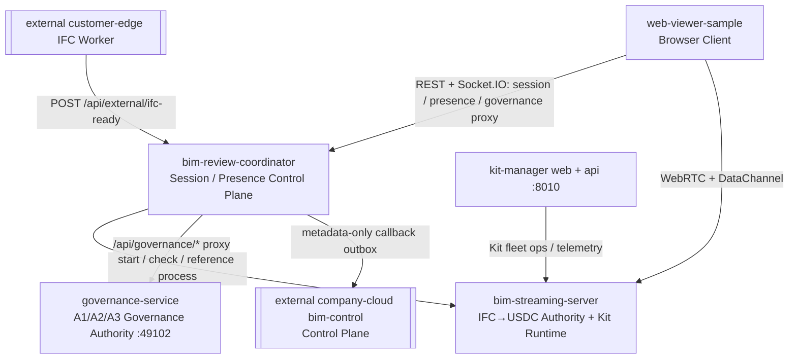
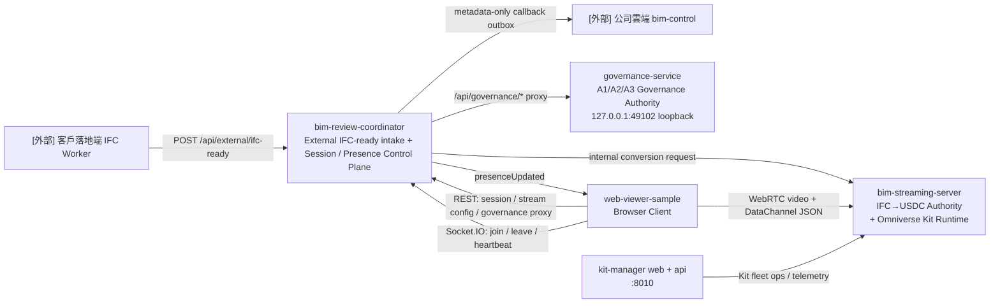

> Loaded lazily by AGENTS.md / CLAUDE.md。Source-of-truth: AGENTS.md。
>
> 何時讀本檔：需要做跨 sub-repo 決策、修改 repo boundary、查 data 權威歸屬、追資料流時。

# Repo Boundary Detail

> wiki / Source of Truth 規範見 root `AGENTS.md` §3；本檔不再重複維護。

`AI-BIM-governance/` workspace 的完整 repo 邊界、資料流動、互動方式與禁止跨界規則。AGENTS.md 主檔只保留一句話摘要與 mermaid 入口；本檔承擔完整細節。

---

## 1. Workspace 範圍

主要開發資料夾：

```txt
AI-BIM-governance/
```

核心 repo / folder：

```txt
AI-BIM-governance/
├── bim-review-coordinator/      # 控制中心，localhost:8004
├── bim-streaming-server/        # Kit streaming + IFC→USDC authority，WebRTC 49100
├── governance-service/          # A1/A2/A3 governance authority，127.0.0.1:49102 loopback
├── web-viewer-sample/           # browser client，localhost:5173
├── apps/kit-manager-web/        # Kit Manager operator UI
├── services/kit-manager-api/    # Kit Manager API，:8010
└── tests/                       # external platform contracts + test-only fakes
```



其中：

```txt
bim-review-coordinator/
bim-streaming-server/
web-viewer-sample/
tests/contracts/
tests/fakes/
```

是 B 方案後正式架構中的核心互動 repo / test-only fixture。`_worker/` 與 `_bim-control/` 已自 repo 刪除；歷史描述見 `docs/agents/history-and-archive.md`。

---

## 1.A 架構決策（2026-05-15）：外部既有平台邊界與 webhook intake

> 依使用者明確指令與 `BIM模型管理平台 系統架構_260514.pdf`（雲地分離）。本節為 **B 方案落地後的現行邊界**，優先序高於下方保留的歷史描述。`_bim-control` / `_worker` 已不再是本 repo runtime 依賴。

### 決策

```txt
1. PDF 平台（公司雲端 Web門戶/MySQL/SSO + 客戶落地端 IFC Worker+Revit）
   = 外部既有系統，已部署於公司測試機/正式機
   （ppms 192.168.20.238 / normal 192.168.20.237），
   不屬於 AI-BIM-governance 的功能開發範圍。
2. `_bim-control` / `_worker` 已**自 repo 刪除**（removed from product runtime，
   **非降級、非保留為 offline fake runtime profile**）；外部公司雲端 control-plane
   與客戶落地端 IFC Worker 屬外部既有系統，僅由 `tests/fakes` + `tests/contracts`
   模擬（design D4：test fixture，非 runtime）。**[2026-05-18 B 方案落地]**
3. 本 repo 唯一對外入口 = `bim-review-coordinator` `POST /api/external/ifc-ready`
   （caller = 客戶落地端 IFC Worker，落地端內網，Service auth）；收到後建立
   local conversion job 並對 `bim-streaming-server` 發 internal conversion
   request（internal-only：spec `streaming-ifc-usdc-conversion-authority`
    + `conversion-webhook-lifecycle`）；轉檔結果以 metadata-only callback
   outbox 回拋公司雲端（spec `external-cloud-callback-lifecycle`）。
4. 本 repo 開發範圍收斂為：
   webhook intake → IFC→USDC → Kit streaming → BIM 治理
   （bim-streaming-server / bim-review-coordinator / web-viewer-sample）。
```

### 落地方式與衝突管理（重點）

完整 OpenSpec change 執行紀錄（PR #63 / PR #59 / mergeCommit 55a9703 / archive 路徑）已遷至 `docs/agents/history-and-archive.md` §3.7。

> **[2026-05-18 修訂｜依 `planB.txt`]** 本決策已細化（取代上方「降級為 fake / offline profile」字面）：(1) `_worker` / `_bim-control` **自 repo 刪除**（非降級保留），測試改 `tests/fakes` + contract fixtures；(2) 對外 intake 收斂於 **`bim-review-coordinator`**（`POST /api/external/ifc-ready`），`bim-streaming-server` 僅 internal conversion engine；(3) webhook caller = 客戶落地端 IFC Worker（落地端內網，非公司測試機直連）；(4) 新增**雲端 callback outbox**（metadata-only，禁傳 `.usdc` 大檔）；(5) 公司雲端=control-plane / 本 repo=客戶落地端 data-plane 權威切分；(6) change-id `local-coordinator-ifc-ready-intake-boundary` 已於 PR #63 apply。完整方案見 archived OpenSpec change `openspec/changes/archive/2026-05-18-local-coordinator-ifc-ready-intake-boundary/`。**§10/§11 為現行閉環；其他歷史段落若與本決策衝突，以本節與 §10/§11 為準。**

---

## 2. 核心 repo 的定位總覽



一句話定位：

```txt
[外部] company cloud  = control-plane 權威（本 repo 不 mirror）
[外部] IFC Worker     = 客戶落地端 IFC 產出者（本 repo 不啟動）
bim-review-coordinator = 唯一對外 IFC-ready intake + Session / Presence Control Plane
bim-streaming-server   = IFC→USDC conversion authority + Omniverse GPU / USD / WebRTC Runtime
governance-service     = A1 rule-run / A2 diff / A3 federation / issue / BCF loopback authority（僅 coordinator proxy 可達）
web-viewer-sample      = Browser 操作端與串流觀看端
kit-manager web + api  = operator-facing Kit 機隊 UI / API（:8010）
tests/fakes/contracts  = 外部平台 test-only doubles，非 runtime profile
```

---

## 3. Repo 邊界

各核心 repo（`bim-review-coordinator` §3.4、`bim-streaming-server` §3.5、`web-viewer-sample` §3.6、`governance-service` §3.7、`kit-manager-web` / `kit-manager-api` §3.8）的角色、負責與不負責清單、控制邊界，已拆分至 `docs/agents/repo-boundaries-per-service.md` 並持續維護（延用原章節編號）。

---

## 4. 資料類型與歸屬、核心資料流、通訊方式邊界、Source of Truth 原則（§4–§7）

資料類型與歸屬表（§4）、核心資料流 mermaid（§5：Streaming Flow、Scene Interaction Flow 等）、通訊方式邊界表（§6）、Source of Truth 原則（§7：BIM 原始資料、Omniverse Runtime 資料、Mapping 資料、Review 資料）已拆分至 `docs/agents/repo-data-flow-and-ownership.md` 並持續維護（延用原章節編號）。

---

## 8. 禁止跨界規則

各 repo 的禁止跨界規則（§8.1–§8.5：web-viewer-sample / bim-streaming-server / bim-review-coordinator / `_bim-control` / `_worker`）與 §3 一併拆分至 `docs/agents/repo-boundaries-per-service.md` 並持續維護（延用原章節編號）。

---

## 9. Optional Mock Services 說明

`AI-BIM-governance/` 之後可以存在其他 mock folders，例如：

```txt
_ai-rule-carbon-service/
_mock-auth/
_mock-sensor-service/
```

這些不屬於本文件定義的核心 repo。若歷史計畫文件提到 `_s3_storage`、`_conversion-service` 或 `_conversion-server`，那些引用只代表舊設計背景；目前 runtime 不啟動、不檢查、也不依賴這些服務。

若它們存在，邊界原則如下：

```txt
- 它們只提供假資料、假結果或本地測試用資料處理。
- 它們不應越過外部公司雲端 control-plane（歷史上為 `_bim-control`）成為正式資料權威。
- 它們不應越過 bim-streaming-server 直接控制 Omniverse viewport。
- 它們不應越過 bim-review-coordinator 管理 session / presence。
- 它們不應越過 web-viewer-sample 成為 browser UI。
```

---

## 10. Workspace 最重要閉環

> **B 方案（local-coordinator-ifc-ready-intake-boundary，2026-05-18 落地）**：`_worker` / `_bim-control` 已**自 repo 刪除**（非降級），只由 `tests/fakes` + `tests/contracts` 模擬外部既有平台。對外入口收斂於 `bim-review-coordinator`；`bim-streaming-server` 為 internal-only 轉檔引擎；轉檔結果以 metadata-only callback 回拋公司雲端（outbox）。

整個 workspace 要保護的最小閉環（B 方案）是：

```txt
[外部] 客戶落地端 IFC Worker 產出 .ifc
→ POST /api/external/ifc-ready 至 bim-review-coordinator（落地端內網，Service auth）
→ bim-review-coordinator 驗證 / idempotency / 建立 local conversion job
   並綁定 external_model_version_id
→ bim-review-coordinator 對 bim-streaming-server 發 internal conversion request
→ bim-streaming-server（internal-only）執行 IFC→USDC，產出 USDC / element_mapping / manifest
→ bim-review-coordinator 取得結果，組 metadata-only callback 入 callback_outbox
   （retry / dead-letter；不傳 .usdc 本體）→ 回拋 [外部] 公司雲端 bim-control
→ bim-review-coordinator 建立 / 維護 review session 與 local web view session
→ web-viewer-sample 取得 session / stream config（使用者經可替換 auth provider）
→ web-viewer-sample 連到 bim-streaming-server
→ bim-streaming-server 載入 USD / USDC
→ web-viewer-sample 顯示 stream 畫面
→ 使用者點選 issue / prim → web-viewer-sample 送 DataChannel command
→ bim-streaming-server 執行 3D highlight / selection
→ web-viewer-sample 透過 coordinator `/api/governance/*` proxy 存取 issue / annotation / BCF
→ governance-service 管理落地端 issue lifecycle / BCF runtime data
→ coordinator Socket.IO 只處理 join / leave / heartbeat 並廣播 `presenceUpdated`
→ generic session event log 只作 compatibility archive，不構成 annotation authority
   （長期 control-plane 權威屬公司雲端，不 mirror）
```

任何修改都不應破壞這條閉環。歷史的 `_bim-control 接收 fake RVT → _worker RVT→IFC → _bim-control 保存 metadata` 閉環已隨兩服務刪除而退役，僅作 archive context，不得作為 startup / health / smoke / review-session 依賴。

---

## 11. 總結

本 workspace 的核心分工（B 方案）是：

```txt
bim-review-coordinator
= 唯一對外 IFC-ready intake（Service auth / idempotency / external_model_version_id
  binding）+ Session / presence control plane + 雲端 metadata-only callback
  outbox + local web view session + generic event compatibility archive（data-plane）

bim-streaming-server
= internal-only IFC→USDC conversion engine（由 coordinator internal request 觸發）
  + Omniverse Kit runtime / WebRTC streaming / USD scene runtime

web-viewer-sample
= Browser client / user interaction layer

[外部，非本 repo] 公司雲端 bim-control = control-plane 權威
[外部，非本 repo] 客戶落地端 IFC Worker = 外部 IFC 產出者

_worker / _bim-control
= 已自 repo 刪除（removed from product runtime，非降級）；
  僅 tests/fakes + tests/contracts 模擬，不是 runtime profile
```

所有跨 repo 互動都必須遵守：

```txt
對外 IFC-ready intake 歸 coordinator（唯一外部入口）
IFC→USDC conversion 歸 streaming server（internal-only）
雲端 callback（metadata-only / outbox）歸 coordinator
control-plane 權威歸外部公司雲端（本地僅最小 shadow，不 mirror）
session / presence 歸 coordinator；generic event log 只是 compatibility archive
issue / annotation / BCF runtime data 歸 governance-service（browser 經 coordinator proxy）
3D runtime 歸 streaming server
使用者操作歸 web viewer
外部平台模擬只在 tests/，不得進 runtime
```
