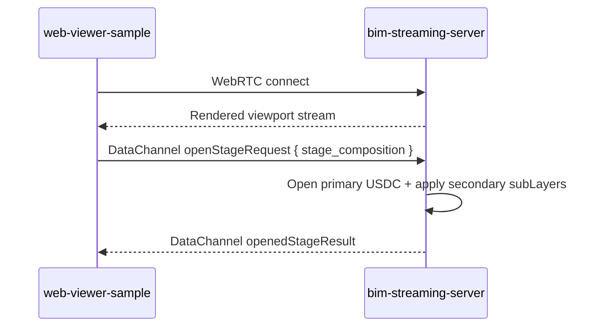
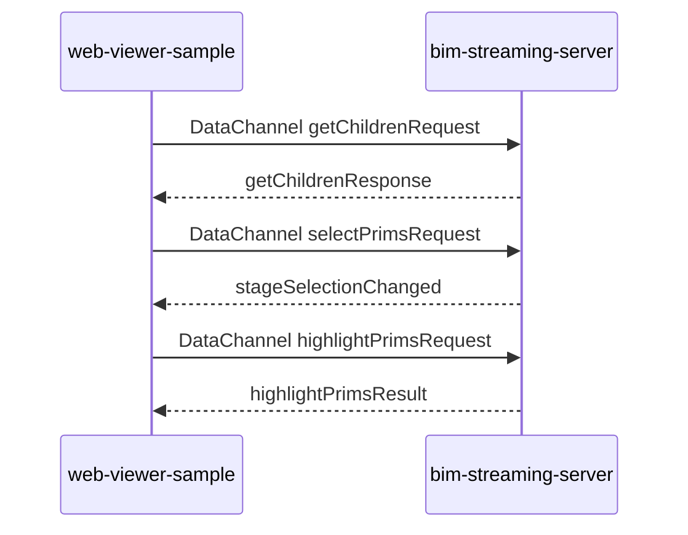

> Loaded lazily by AGENTS.md / CLAUDE.md。Source-of-truth: AGENTS.md。
>
> 何時讀本檔：需要查資料類型與權威歸屬、核心資料流（streaming / scene interaction 等 mermaid sequence）、通訊方式邊界，或 Source of Truth 原則（BIM 原始資料 / Omniverse runtime 資料 / mapping 資料 / review 資料）時。

# Repo Data Flow And Ownership

> 本檔自 `docs/agents/repo-boundary-detail.md` 原 §4–§7 拆分並持續維護；延用原章節編號（§4 / §5 / §5.1–§5.5 / §6 / §7 / §7.1–§7.4）。per-repo 角色與禁止跨界規則見 `docs/agents/repo-boundaries-per-service.md`；workspace 總覽、架構決策與最重要閉環見 `docs/agents/repo-boundary-detail.md`。

---

## 4. 資料類型與歸屬

| 資料類型 | 權威 repo / folder | 說明 |
|---|---|---|
| Project metadata | 外部公司雲端 `bim-control` | Control-plane 權威；本 repo 不 mirror |
| Model version metadata | 外部公司雲端 `bim-control` | 以 `external_model_version_id` 參照 |
| Artifact metadata | 外部公司雲端 `bim-control` + 本地最小 shadow | 高階索引在雲端；本地只保存轉檔與 callback 必要欄位 |
| Source IFC reference | 外部客戶落地端 IFC Worker + `bim-review-coordinator` shadow | IFC 產出者為外部系統；coordinator 保存 ref/etag/correlation |
| USD / USDC file | `bim-streaming-server` | B 方案 IFC→USDC conversion authority 產出的衍生檔 |
| element_mapping.json / entity_index.json | `bim-streaming-server` + 本地 shadow | 檔案由 streaming conversion result 產出；雲端只接 metadata-only callback |
| Callback delivery state | `bim-review-coordinator` | metadata-only outbox / retry / dead-letter |
| Review issue / BCF runtime data | `governance-service` + 外部公司雲端 `bim-control` | 落地端 issue lifecycle / BCF 屬 governance-service；長期 control-plane 權威在外部雲端 |
| Annotation metadata | `governance-service` + 外部公司雲端 `bim-control` | 落地端 annotation lifecycle 屬 governance-service；coordinator 已無 live annotation handler，generic event log 不構成 annotation authority；長期 control-plane 權威在外部雲端 |
| Review session state | `bim-review-coordinator` | 當前 session 狀態 |
| Session presence state | `bim-review-coordinator` | `joinSession` / `leaveSession` / `heartbeat` / `presenceUpdated` |
| Generic session event log | `bim-review-coordinator` | append-only compatibility archive；可含 legacy type，但不代表 live broadcast 或正式資料權威 |
| USD stage runtime state | `bim-streaming-server` | 當前 Omniverse scene runtime 狀態 |
| Browser UI state | `web-viewer-sample` | 當前前端 UI 狀態 |

---

## 5. 核心資料流

## 5.1 Artifact Discovery Flow

> **退役狀態**：本節描述的『web-viewer-sample 請求 session → bim-review-coordinator 同步查詢 _bim-control 取得 artifact / conversion 狀態』流程已被 B 方案（_bim-control 已刪除、對外 intake 收斂於 coordinator webhook + 雲端 metadata-only callback outbox，見 §1.A / §10）取代。完整歷史 mermaid 與邊界說明遷至 `docs/agents/history-and-archive.md` §3.4。現行等效資訊見 §10 Workspace 最重要閉環。

---

## 5.2 Streaming Flow



### 邊界說明

```txt
WebRTC video stream 只存在於 web-viewer-sample 與 bim-streaming-server 之間。
USD / USDC conversion result 由 bim-streaming-server 在 B 方案下提供。
bim-streaming-server 載入、渲染，且是 IFC→USDC conversion job authority；它仍不成為 project / issue / annotation 的資料權威。
```

---

## 5.3 Scene Interaction Flow



### 邊界說明

```txt
Scene interaction 是 browser client 與 Kit runtime 之間的 DataChannel JSON 流程。
這些 runtime interaction 不等於正式資料保存。
若要保存成審查紀錄，必須走現行 governance-service / 外部 control-plane write path；已退役的 coordinator collaboration handlers 不是可用回寫路徑。
```

---

## 5.4 Collaboration Flow

> **退役狀態(2026-05-21,change `remove-conflict-review-from-fast-mvp`)**:本節
> collaboration broadcast(highlight / selection / annotation)在 coordinator 與
> viewer 兩端的 implementation 已從 fast MVP product runtime 移除(`reviewNamespace.ts`
> 內的 `highlightRequest` / `selectionUpdate` / `annotationCreate` Socket.IO event
> handlers、viewer `IssuePanel` / `EventLogPanel` 已刪)。本 sequence 保留作為
> archive context;viewer Change 2 (`fast-ifc-link-demo-loop`) 將 viewer 主畫面
> 收斂為「全螢幕 stream + 邊框 HUD」,不含多人協作 UI。若未來重新引入,以新
> spec 變更新增 requirement 與 viewer slot。

完整歷史 mermaid 與邊界說明遷至 `docs/agents/history-and-archive.md` §3.4。

---

## 5.5 Review Result Visualization Flow

> **退役狀態(2026-05-21,change `remove-conflict-review-from-fast-mvp`)**:本節
> review issue → DataChannel `highlightPrimsRequest` 的「issue 流」入口
> (viewer `IssuePanel` + coordinator `getReviewIssues` / `review-bootstrap`
> endpoint)已從 fast MVP product runtime 移除。DataChannel `highlightPrimsRequest`
> 本身保留作 mapping highlight 工具(Window.tsx `_onMappingItemClick`),Change 2
> 重做 viewer 時再評估。若 issue 流要重新引入,以新 spec 變更新增。

完整歷史 mermaid 與邊界說明遷至 `docs/agents/history-and-archive.md` §3.4。

---

## 6. 通訊方式邊界

| 通訊方式 | 起點 | 終點 | 用途 |
|---|---|---|---|
| REST | `web-viewer-sample` | `bim-review-coordinator` | 建立 / 查詢 session、取得 stream config、存取 governance proxy |
| WebRTC video | `bim-streaming-server` | `web-viewer-sample` | 串流 Omniverse viewport 畫面 |
| WebRTC DataChannel JSON | `web-viewer-sample` | `bim-streaming-server` | open stage、selection、highlight、scene query |
| WebSocket / Socket.IO | `web-viewer-sample` | `bim-review-coordinator` | session join / leave / heartbeat 與 `presenceUpdated`；selection / annotation / issue-focus handlers 已退役 |

歷史內部通訊列（涉及已刪除 `_bim-control` / `_worker`）遷至 `docs/agents/history-and-archive.md` §3.5。

---

## 7. Source of Truth 原則

## 7.1 BIM 原始資料

```txt
IFC / RVT / DWG = 原始模型資料
```

原始模型資料的權威屬外部既有平台（公司雲端 SSO/MySQL 控制面 + 客戶落地端 IFC Worker/Revit），不在本 repo 開發範圍內（見 §1.A）。歷史上曾由 repo 內部 `_bim-control`（RVT source / signed reference 版本關聯）與 `_worker`（RVT→IFC bridge / handoff lineage）分工，兩者已刪除；完整歷史敘述見 `docs/agents/history-and-archive.md` §3.6。

---

## 7.2 Omniverse Runtime 資料

```txt
USD / USDC = rendering / streaming artifact
```

其 conversion job、檔案本體與 result payload 屬於：

```txt
bim-streaming-server
```

其 runtime 操作屬於：

```txt
bim-streaming-server
```

---

## 7.3 Mapping 資料

```txt
IFC GUID ↔ USD Prim Path
```

這是 BIM 語意資料與 Omniverse 視覺化資料之間的橋。

```txt
mapping file body      → bim-streaming-server
mapping metadata       → 外部公司雲端 bim-control（經 coordinator metadata-only callback outbox，非本 repo 內部服務）
mapping runtime usage  → web-viewer-sample / bim-streaming-server
```

---

## 7.4 Review 資料

> **退役狀態(2026-05-21,change `remove-conflict-review-from-fast-mvp`)**:issue
> / annotation / review result 的 fast MVP product runtime 已移除(`ReviewIssue`
> interface、`getReviewIssues` / `createAnnotation` / `getReviewBootstrap` /
> `IssuePanel` / `EventLogPanel` 已刪)。本表保留作 archive context,記錄歷史權威
> 劃分。若 review 流要重新引入,以新 spec 變更新增 requirement 與
> coordinator / viewer 端配套。

完整歷史 ownership 拆解遷至 `docs/agents/history-and-archive.md` §3.4。
