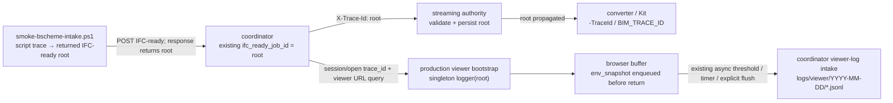

# Structured Log Schema — Contract

> **Source of truth** for the cross-service structured log baseline.
> Capability spec: `openspec/specs/cross-service-structured-log-baseline/`（已同步 canonical；active change 只剩 deferred runtime-evidence closeout）。
> Design rationale: `docs/superpowers/specs/2026-05-26-cross-service-structured-log-baseline-design.md`.
> JSON Schema artifact: `tests/contracts/structured-log/schema.json` (draft-07).

This document is the single source of truth for the cross-service structured log schema. Any change to record shape, `event_type` enumeration, `data` sub-schema, `trace_id` naming, or transport headers MUST update this document and the matching `tests/contracts/structured-log/schema.json` in the same change.

## 1. Record shape

Each structured log record is a single-line JSON object. Records are appended one per line into `logs/<service>/<YYYY-MM-DD>/<service>-<run_id>.jsonl` and also emitted to stdout for the originating process.

### 1.1 Required fields

| Field | Type | Description |
|---|---|---|
| `ts` | string | ISO-8601 UTC timestamp, millisecond precision (e.g. `2026-05-26T14:23:11.482Z`) |
| `level` | enum | `debug` \| `info` \| `warn` \| `error` \| `fatal` |
| `event_type` | enum | See §2 |
| `service` | enum | `coordinator` \| `streaming-server` \| `viewer` \| `scripts` |
| `component` | string | Free-form module name within service (e.g. `ifcDownloader`, `stage_loading`, `preflight-docker`) |
| `run_id` | string | `run_<YYYYMMDD>_<HHMMSS>_<6 lowercase hex>` — one per process startup |
| `trace_id` | string | See §4 |
| `msg` | string | Human-readable short message |
| `data` | object | Event-specific payload — see §3. For `event_type: "general"` MAY be `{}` |

### 1.2 Optional fields

| Field | When | Description |
|---|---|---|
| `seq` | always optional | Strictly increasing integer within a `trace_id`; used by EventLog-style audit consumers |
| `caller` | required when `level=error` or `warn` | `file:line` (e.g. `src/services/ifcDownloader.ts:142`) |
| `error` | required when `level=error` or `fatal` | `{ name: string, message: string, stack_tail: string[] }` (`stack_tail` length ≤ 8) |
| `parent_event_id` | self-defined | Links retry / fallback chain to the originating record's `event_id` (if record was given one) |
| `parent_trace_id` | self-defined | Links derived traces back to upstream `trace_id` (e.g. `rev_<id>.parent_trace_id = ifcready_<id>`) |

## 2. `event_type` enumeration (7 values)

| event_type | Purpose |
|---|---|
| `logic_error` | Handled or unhandled exceptions, validation failures, contract violations |
| `operation_anomaly` | Retry / fallback / timeout / unexpected_state — operational deviations that are not fatal but should be visible |
| `env_snapshot` | Startup environment / configuration dump (exactly one per service run, emitted before `createLogger`/`create_logger`/`New-StructLogger` returns) |
| `lifecycle` | session / conversion job / Kit subprocess / IFC-ready job / script run / outbox delivery lifecycle |
| `audit` | agent / human key commands (e.g. `deploy-report`, `gh pr merge`, fast MVP dispatch) |
| `network` | Inbound / outbound HTTP / WebSocket / Socket.IO / WebRTC signal / DataChannel events |
| `general` | Fallback for raw `debug` / `info` / `warn` calls that do not fit a semantic category; `data` MAY be empty |

### 2.1 API to `event_type` mapping

Adapter public APIs map to `event_type` deterministically:

| Adapter call | Default `event_type` |
|---|---|
| `network(...)` semantic helper | `network` |
| `audit(...)` semantic helper | `audit` |
| `lifecycle(...)` semantic helper | `lifecycle` |
| `anomaly(...)` semantic helper | `operation_anomaly` |
| `envSnapshot(...)` / `env_snapshot(...)` semantic helper | `env_snapshot` |
| `debug(...)`, `info(...)`, `warn(...)` raw | `general` |
| `error(err, ...)`, `fatal(err, ...)` raw | `logic_error` (with `data.error.{name, message, stack_tail}` auto-populated from the `Error`-like argument) |

If a caller wants a specific `event_type` they MUST use the corresponding semantic helper.

## 3. `data` sub-schema by `event_type`

### 3.1 `logic_error`

```jsonc
{
  "error": {
    "name": "ValidationError",
    "message": "session_id must be safe",
    "stack_tail": ["at validateSession (src/...)", "at ..."]  // up to 8 entries
  }
}
```

Required keys: `error.name`, `error.message`, `error.stack_tail`.

### 3.2 `operation_anomaly`

```jsonc
{
  "anomaly_kind": "fallback",   // retry | fallback | timeout | unexpected_state
  "reason": "hoops_a3d_failed",
  /* additional event-specific keys MAY be added */
}
```

Required keys: `anomaly_kind`, `reason`.

### 3.3 `env_snapshot`

```jsonc
{
  "vars": [
    { "key": "STORAGE_ROOT", "source": ".env", "value_or_redacted": "C:\\Repos\\active\\iot\\AI-BIM-governance\\storage", "type": "string" },
    { "key": "INTERNAL_API_TOKEN", "source": ".env", "value_or_redacted": "[REDACTED:type=string, len=9]", "type": "string" }
  ]
}
```

Required: `vars` array of `{ key, source, value_or_redacted, type }`. `source` ∈ `.env` \| `.env.example` \| `system` \| `docker-compose` \| `default`.

### 3.4 `lifecycle`

```jsonc
{
  "phase": "start",          // start | active | closing | closed
  "subject_kind": "review_session", // see table below
  "subject_id": "review_session_xxx"
}
```

`subject_kind` values and corresponding `subject_id` semantics:

| `subject_kind` | `subject_id` |
|---|---|
| `review_session` | coordinator review session id (e.g. `review_session_xxx`) |
| `conversion_job` | streaming-server conversion job id (e.g. `stream_conv_20260525055218_115177da`) |
| `kit_subprocess` | Kit subprocess pid (stringified) |
| `ifc_ready_job` | coordinator IFC-ready job id (e.g. `ifcready_1779687625000_064c6813`) |
| `script_run` | PowerShell script run_id |
| `outbox_delivery` | outbox entry id |

### 3.5 `audit`

```jsonc
{
  "action": "deploy-report",
  "actor": "agent:claude-opus-4-7",
  "target": "compose-host"
}
```

Required keys: `action`, `actor`, `target`.

### 3.6 `network`

```jsonc
{
  "direction": "outbound",    // inbound | outbound
  "protocol": "http",         // http | websocket | socket.io | webrtc-signal | datachannel
  "peer": "streaming-server", // logical name, see below
  "status": 200,              // HTTP code | Socket.IO event name | "connected" | "disconnected"
  "duration_ms": 47,          // optional
  "path": "/api/external/ifc-ready"  // optional, HTTP only; query string MUST be stripped
}
```

Required keys: `direction`, `protocol`, `peer`, `status`.

`peer` MUST be one of: `coordinator` \| `streaming-server` \| `external-edge` \| `external-cloud` \| `kit-subprocess` \| `viewer`. Raw host:port URLs are forbidden to avoid internal topology disclosure.

Request/response bodies MUST NOT be embedded. A future `data.evidence_ref` field (not implemented in this baseline) may point to a sidecar evidence file when payload-level forensics are required.

### 3.7 `general`

```jsonc
{}
```

No required keys. `data` MAY be omitted entirely or be an empty object.

## 4. `trace_id` naming and propagation

### 4.1 Naming convention

| Prefix | Origin | Example |
|---|---|---|
| existing `ifc_ready_job_id` | Coordinator IFC-ready intake; the id already starts with `ifcready_` and is the closed-loop root trace | `ifcready_1779687625000_064c6813` |
| `rev_<existing_session_id>` | Standalone coordinator review session only, when no upstream IFC-ready trace exists | `rev_20260526_1234abcd` |
| `stream_conv_<existing_job_id>` | Standalone streaming conversion only, when no valid inbound trace exists | `stream_conv_20260525055218_115177da` |
| `script_<run_id>` | PowerShell script with no upstream | `script_run_20260526_142010_a3f9` |

For an IFC-ready-originated flow, the existing `ifc_ready_job_id` is used byte-for-byte as the root `trace_id`; it MUST NOT be prefixed with `ifcready_` a second time. Conversion dispatch, persisted streaming jobs, conversion lifecycle records, review session/open payloads, the viewer URL, browser logger, and the supported smoke runner all retain that root. `rev_*` and `stream_conv_*` are fallback roots for standalone entrypoints, not child traces for the IFC-ready closed loop.

### 4.2 Propagation carriers

| Carrier | Field |
|---|---|
| Coordinator → streaming-server conversion HTTP request | Header `X-Trace-Id` containing the existing `ifc_ready_job_id` root |
| Coordinator review session/open response | JSON field `trace_id` |
| Coordinator-generated viewer URL | Query field `trace_id` (one validated value only) |
| Socket.IO events (coordinator ⇄ viewer) | Event payload field `trace_id` |
| WebRTC DataChannel event (viewer ⇄ streaming-server) | Every event payload field `trace_id`; the vendor `ApplicationMessage` bridge serializes `{event_type,payload}` and has no independent root envelope field |
| External cloud callback outbox payload | Payload field `trace_id` |
| Kit subprocess invocation | CLI argument `--trace-id=<id>` |
| PowerShell scripts (cross-process / cross-script) | Environment variable `BIM_TRACE_ID` |

Receivers MUST:
1. Treat every inbound carrier as an untrusted candidate until it passes format validation and a case-exact server-owned or otherwise verified binding check.
2. Adopt and forward the candidate only after verification; missing, mismatched, malformed, or ambiguous authority fails before any protected action.
3. Only the documented root owner may mint a root: IFC-ready intake adopts its newly created existing `ifc_ready_job_id`; a true standalone review or conversion entrypoint may mint its documented fallback.

Socket.IO uses one coordinator-owned immutable/fail-closed session resolver. The canonical trace is persisted when a session is created. A legacy session may backfill from zero or one distinct valid linked root; multiple roots, stored/linked conflict, or malformed state fails closed, and mutable `updated_at`/latest-job ordering is never authority. Viewer join/heartbeat/leave events carry only an exact-match candidate. Every successful acknowledgement and presence emission carries the canonical root; a rejected acknowledgement carries only a stable error and no canonical trace. Rejection occurs before `socket.join`, participant/room/session mutation, or presence emission. An IFC-ready-linked session retains its `ifcready_*` root; a standalone session uses `rev_<session_id>`.

All 26 DataChannel event types enumerated by `tests/contracts/kit-datachannel-v1.schema.json` carry `payload.trace_id` in both directions: read-only requests/responses, mutations/results/rejections, progress, binding/selection changes, and unsolicited events. Viewer sends nothing before Socket trace verification. Kit rejects missing or mismatched inbound trace before acting and propagates the same trace on every response/event; mutators additionally require coordinator runtime authority. Viewer rejects every Kit→viewer message whose trace is missing or not case-exactly equal before correlation bookkeeping, request completion, logging it as accepted, or UI/state mutation. Callback ready/failed outbox payloads retain the same upstream root through persistence, reload, and delivery.

### 4.3 Production carrier closed loop

The only supported PowerShell participant for the four-unit production smoke is `scripts/smoke-bscheme-intake.ps1`. It creates its logger with a standalone `script_<run_id>` trace, calls IFC-ready intake, then switches the existing logger to the returned `ifc_ready_job_id` root before poll, review-session open, browser lifecycle, and close records. A harness that manually writes four records with the same trace does not satisfy this contract.



## 5. Redaction rules

### 5.1 Env value redaction (used in `env_snapshot.vars[].value_or_redacted`)

1. If `key` appears in the allow-list (`docs/contracts/structured-log-env-allowlist.md`): emit the raw value as-is.
2. Else if `key` matches case-insensitive pattern `TOKEN` \| `SECRET` \| `KEY` \| `PASSWORD` \| `AUTH` \| `CREDENTIAL`: emit `[REDACTED:type=<string|number|boolean>, len=<n>]` where `n` is the original character length.
3. Else: emit `[TYPE:type=<...>, len=<...>]` — type + length only, original value omitted.

### 5.2 Generic `data` depth-defense redaction

Adapters MUST run a bounded, cycle-safe `redactDataBeforeWrite(data)` pass before serialization. The pass walks ordinary event `data` recursively; if any key (case-insensitive) contains a secret pattern (§5.1 step 2), including literal `auth` or `key`, its value is replaced with `[REDACTED]` regardless of how the caller constructed `data`. Env allow-list membership never exempts ordinary event keys.

Only the dedicated `env_snapshot.vars[]` sanitizer may preserve the schema vocabulary `key`, `source`, `value_or_redacted`, and `type`. Secret-like fields elsewhere in the same event still redact. `MAX_REDACTION_DEPTH` is 8 with the root `data` container at depth 0; an object or array that would be entered at depth 9 is replaced exactly with `[Truncated]`. A cyclic edge replaces only its subtree with `[Circular]`. The original record event type is retained. These markers and all failures MUST NOT include an original secret value.

### 5.3 Network record host/URL handling

- `peer` MUST be a logical name from §3.6.
- HTTP `path` MAY include the request path; **query strings MUST be stripped** before logging (they often carry tokens).
- Request/response bodies MUST NOT be embedded.

## 6. Sink behavior

### 6.1 File sink

- Path: `<repo-root>/logs/<service>/<YYYY-MM-DD>/<service>-<run_id>.jsonl`
- Append-only, JSONL (one record per line)
- One file per service process (one `run_id` per process startup)
- Date rotation: when a record's `ts` date differs from the currently open file's date, the old file is closed and a new one opened
- `<repo-root>/logs/` MUST be present in `.gitignore`

### 6.2 stdout sink

Every record is also written to the originating process's stdout as a single JSON line. This provides redundancy when run under `docker logs`, `journalctl`, or `convert-ifc-to-usdc.ps1`'s `kit-stdout.log` capture.

### 6.3 Recovery sink

When the main file sink fails (lock, permission), the adapter MUST attempt to write the failing record to `<repo-root>/logs/<service>/_recovery/<YYYY-MM-DD>-<run_id>.jsonl` before resuming normal writes on the next record. Adapters MUST NEVER throw to the calling code on sink failure; instead they write `[structLog sink failed]` plus the record to stderr and continue.

## 7. Coordinator-mediated viewer intake

Browser viewers cannot write to the local file system. They batch records in an in-memory ring buffer (max 500 records) and flush via `POST /api/internal/viewer-log` (coordinator) on any of three triggers:

- ≥ 50 buffered records
- 2 seconds elapsed since last flush
- Explicit flush call

`createBrowserLogger()` enqueues exactly one browser-safe `env_snapshot` into this buffer before returning. It does not synchronously POST, use synchronous XHR, or enumerate arbitrary `window`, storage, or query-string values. Delivery uses the same asynchronous flush policy above; production bootstrap creates one singleton with the validated viewer-URL root trace and installs the global handlers once. A successful transport removes only the exact captured in-flight entry identities; concurrent appends and unrelated retained entries stay queued.

Before parsing a viewer-log body, coordinator authenticates one active primary or spectator viewer lease using `X-Review-Session-Id`, `X-Viewer-Lease-Id`, and `X-Viewer-Lease-Token`. Missing, wrong, cross-session, expired, or released authority returns one uniform 401 and writes nothing. The 256 KiB route parser runs before the global parser. Intake validates each record against this schema, accepts only `service="viewer"`, persists passing records to `logs/viewer/<date>/viewer-<run_id>.jsonl`, drops failing/spoofed records (counted in authenticated `GET /api/internal/structLog/health.records_dropped`), and responds with HTTP 200 (or 413 if a fixed-length or chunked body exceeds the configured maximum).

Base runtime-manager Compose publishes coordinator/viewer host ports on `127.0.0.1`; the explicit host-kit override retains its documented LAN publish. Therefore binding is defense-in-depth, not authentication. Browser authority exists only in memory and the three headers; it never appears in URL, body, log, console, trace, or evidence. Explicit Flush may obtain/reuse authority; component mount may not auto-claim primary, and spectator mode may not steal primary. With no authority, browser makes no fetch and retains the batch.

## 8. Health endpoint

Coordinator exposes `GET /api/internal/structLog/health` protected by the existing internal token contract:

```jsonc
{
  "run_id": "run_20260526_142010_a3f9",
  "current_file": "C:\\Repos\\active\\iot\\AI-BIM-governance\\logs\\coordinator\\2026-05-26\\coordinator-run_20260526_142010_a3f9.jsonl",
  "records_written": 1247,
  "records_dropped": 3,
  "last_failure": null
}
```

`last_failure` is `null` when no sink failure has occurred this run; otherwise `{ ts: ISO-8601, reason: string }`.

## 9. EventLog mirror mapping

`bim-review-coordinator/src/services/eventLog.ts.append(sessionId, type, payload)` continues to write its existing JSONL into `storage/event-log/<sessionId>.jsonl`. In addition, every append emits a parallel `lifecycle` record to the structured log baseline using the following mapping table:

| EventLog `type` | `subject_kind` | `phase` | `subject_id` |
|---|---|---|---|
| `sessionCreated` | `review_session` | `start` | `sessionId` (from append args) |
| `sessionActive` | `review_session` | `active` | `sessionId` |
| `sessionClosing` | `review_session` | `closing` | `sessionId` |
| `sessionClosed` | `review_session` | `closed` | `sessionId` |
| `kitInstanceReleased` | `kit_subprocess` | `closed` | from `payload.kit_instance_id` (string) |
| `kitInstancesReleased` | `kit_subprocess` | `closed` | from `payload.kit_instance_ids[]` joined with `,` |
| `firstFrameObserved` | `review_session` | `active` | `sessionId` — operational milestone (WebRTC first frame), NOT a state transition; downstream distinguishes via `data.eventlog_type`, not `phase` |
| Any other type (future addition) | `review_session` | `active` | `sessionId` (until mapping is amended in this document) |

The existing `/api/.../lifecycle-events` REST endpoint and its response shape are unchanged.

## 10. Retention

Daily dated directories under `logs/<service>/` are the unit of retention. `scripts/log-retention/prune-logs.ps1` deletes `<YYYY-MM-DD>` directories older than `LOG_RETENTION_DAYS` calendar days (default 30, UTC) when invoked with `-Apply`. `-DryRun` (the default) lists candidates without deleting. `logs/` itself and the per-service directories are never deleted. The script may be invoked manually or via Windows Task Scheduler; CI does NOT run retention in this baseline.

## 11. Changelog discipline

Any PR that:

- Adds or renames an `event_type`
- Adds, renames, or changes a required `data` key
- Adds a `subject_kind` or `anomaly_kind` value
- Adds a new propagation carrier or changes an existing carrier's field name
- Adds an entry to or removes one from the env allow-list (`docs/contracts/structured-log-env-allowlist.md`)

MUST update this document and `tests/contracts/structured-log/schema.json` in the same change.
