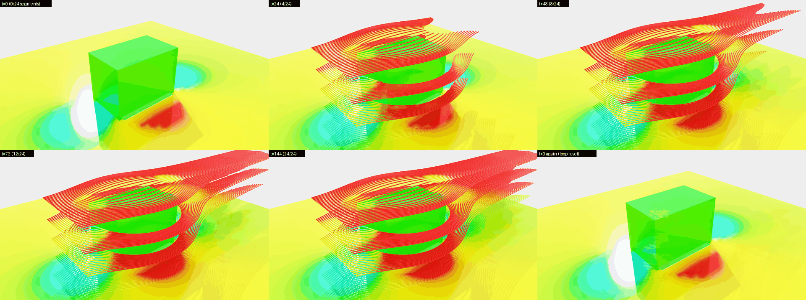
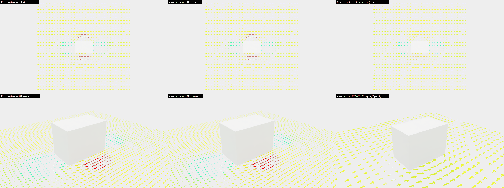
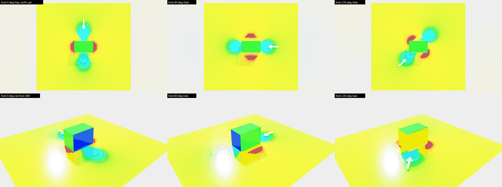
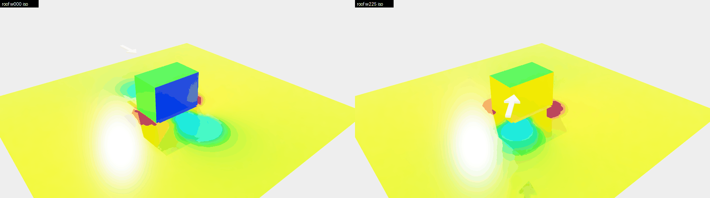

# CFD 呈現探針（CP1）證據 — 2026-09-30

對應 `docs/plans/cfd-presentation-parity-contract.md` §6 CP1。本資料夾只含**合成場景**（40 × 25 × 30 m 方塊建物與解析式風場），沒有任何真實專案資料；PNG 都是該合成場景的 Kit 截圖。

## 共同方法

- **探針場景**：`tools/cfd/kit/make_presentation_probe_stage.py`（repo `.venv`，純 `usd-core`，決定性；單元測試 `tools/cfd/tests/test_presentation_probe_stage.py`）。輸出 `model.usdc`（`/World/Elements/IfcWall/ProbeBuilding`）、`overlay.usdc`（`/World/Overlays/Cfd/cfd_probe/…`）、`view.usda`、`manifest.json`。慣例同 `cfd_pipeline/usd_results.py`：Z 向上、公尺、模型 +Y＝project north、U 色階 0–5 m/s（`usd_results.colormap`）、240 幀 @ 24 fps 循環與 `customLayerData["cfd:animation"]`。風場是解析式替身（圓柱勢流＋冪律剖面），只用來量渲染技術、層檔大小與開啟時間，不代表物理。
- **Kit 探針**：`tools/cfd/kit/probe_presentation.py`，在 headless Kit 110.1.0（`ezplus.bim_review_stream.kit`，RTX，viewport 1920 × 1078）以 `--exec` 執行。開檔方式比照產品：root layer＝`model.usdc`，`overlay.usdc` 接到 session layer 的 sublayer，timeline 依 `stage_loading._sync_cfd_animation_playback` 設定（不播放）。燈光、像素差與 overlay style controller 直接載入 `open_stage_capture_and_quit.py` 的 helper（該檔未修改）。相機是 session layer 上的固定相機（`iso`、`near`、`top`＝正上方、北朝上），所以不同 stage 的截圖可以逐像素比較。
- **像素差**：`changed_pixel_fraction`＝RGB 絕對差總和 > 24 的像素比例（harness 的 `_pixel_diff`）。
- **共同指令**（`<repo>`＝主 checkout，`<wt>`＝本 worktree，`<s>`＝本機 scratch）：

```bash
# 產生探針場景（repo .venv）
<repo>/.venv/Scripts/python.exe <wt>/tools/cfd/kit/make_presentation_probe_stage.py --out-dir <s>/stages/<name> <flags>
# 在 Kit 內執行探針（cwd = <repo>/bim-streaming-server/_build/windows-x86_64/release）
timeout 900 ./kit/kit.exe apps/ezplus.bim_review_stream.kit --no-window \
  --ext-folder "<repo>/bim-streaming-server/source/extensions" --portable-root "<s>/kit_portable" --/app/fastShutdown=1 \
  --exec "<wt>/tools/cfd/kit/probe_presentation.py --probe <probe> --stage <label>=<s>/stages/<name> --out-dir <s>/out/<label> <flags>"
```

## 判定總表

| 探針 | 問題 | 判定 | 影響切片 |
|---|---|---|---|
| P1 | 流線漸進生長在 RTX 可行的技術 | **PASS**（方案 a：分段 prim＋時間取樣 `visibility`） | CP3、N3.4 |
| P2 | 向量箭頭：PointInstancer 對合併 mesh | **PASS**（PointInstancer＋逐實例 `displayColor`） | CP4、N5.1 |
| P3 | 場景內風向箭頭 | **PARTIAL**（俯視 PASS；iso 在上游背對相機時被建物遮住） | CP4、N4.4 |
| P4–P7 | — | 未執行（本輪依指示中止，見 `.superpowers/handoff/cp1-probes-report.md`） | — |

---

## P1 流線生長（CP3、N3.4）

**問題**：`StreamlineGrowth` 能否在 Kit RTX 內沿行進時間逐段顯現，並留在既有 240 幀循環內？依序試 (a) 分段 prim 的時間取樣 `visibility`、(b) 單一 BasisCurves 的時間取樣 `widths`、(c) 退回只用粒子。

**方法**：120 條流線 × 80 點，依行進時間切成 24 個 `StreamlineGrowth/Seg_NNN`（BasisCurves，管寬 0.5 m，逐點速度色），每段 `visibility` 只有兩個時間取樣：幀 0 `invisible`、幀 6k `inherited`（k＝1…24，`growth_seconds` 6 s＝144 幀內全部顯現）。行進時間以各流線總行進時間的第 95 百分位（此場景 64 s）正規化。不寫靜態 `Streamlines`，讓截圖只看生長。以 timeline `set_current_time` 停在各時間碼，等 30 幀後截圖；另以 USD `ComputeVisibility` 讀回可見段數。

```bash
make_presentation_probe_stage.py --out-dir <s>/stages/p1a --streamlines 120 --streamline-points 80 --no-static-streamlines --growth segments --growth-segments 24
probe_presentation.py --probe growth --stage p1a=<s>/stages/p1a --out-dir <s>/out/p1a --views iso
```

**量測**（`p1_probe_growth.json`；Kit 行程 23 s，exit 0）：

| 時間碼 | USD 讀回可見段 | 相對 t=0 變動像素 | 相對前一張變動像素 |
|---:|---:|---:|---:|
| 0 | 0／24 | — | — |
| 24 | 4／24 | 35.6% | 35.6% |
| 48 | 8／24 | 50.6% | 23.9% |
| 72 | 12／24 | 57.7% | 11.1% |
| 96 | 16／24 | 58.3% | 3.3% |
| 120 | 20／24 | 58.5% | 1.5% |
| 144 | 24／24 | 58.7% | 0.9% |
| 200 | 24／24 | 58.7% | 0.4%（已全部顯現，只剩雜訊） |
| 0（循環回到起點） | 0／24 | 3.2% | 55.4% |

相對 t=0 的變動像素隨時間單調增加、到 144 幀飽和，t=144 → 200 只剩 0.4% 雜訊；回到 t=0 後 24 段全部消失。回到起點的 3.2% 殘差是 RTX 時間累積留下的淡殘影（差異圖集中在建物立面反射），USD 讀回為 0 段可見，不是可見性失敗。前段變動量大是因為上層流線速度快，前 4 段就涵蓋了它們的大半長度；這是 CP3 正規化方式的設計選擇，不影響技術判定。



**判定：PASS（方案 a）**。依規則在第一個可行方案停止，方案 (b) 時間取樣 `widths` 未在 Kit 執行（產生器已支援 `--growth widths`，單元測試涵蓋）。

**對 CP3 的影響**：N3.4 採用「分段 prim＋時間取樣 `visibility`（invisible → inherited）」。每段只有 2 個 token 時間取樣，層檔成本幾乎全在幾何本身（見 P5）。剛回到循環起點時會有 1 秒內的 RTX 殘影，屬顯示特性，不需處理。

（P1 執行時 runner 還沒有「settle 後重設相機」：app 在開檔後會自行框取作用中的相機，所以 P1 的 iso 視角是 app 框取後的結果。同一次執行內所有截圖用同一個相機，逐張比較不受影響；之後的探針都在 settle 後重設固定相機並記錄讀回值。）

---

## P2 向量箭頭（CP4、N5.1）

**問題**：行人面向量箭頭用 `PointInstancer`（一個箭頭原型＋方向四元數＋逐實例縮放＋逐實例 `primvars:displayColor`）是否在 RTX 正確呈現方向與顏色？和「全部合併成一個 mesh」比，層檔大小與開啟時間如何？

**方法**：只放建物與箭頭（無行人面、無壓力殼），格點避開建物，長度＝0.9 × 格距 × min(|U|／5, 1)（下限 0.15 讓每個格點都畫），顏色＝`usd_results.colormap`。每種各 1,000 與 5,000 支：`instancer`（1 個原型，`displayColor` 以 `vertex` 內插＝逐實例）、`instancer_binned`（8 個固定色原型，依速度分箱）、`merged`（單一 mesh，逐點顏色）。同一次 Kit 行程依序開啟，俯視（`top`）與近景（`near`）各截一張，同視角兩兩比較。

```bash
make_presentation_probe_stage.py --out-dir <s>/stages/p2_<mode>_<n> --no-plane --no-surface-pressure --arrows <n> --arrow-mode <mode>
probe_presentation.py --probe stages --warmup <s>/stages/p2_base --stage base=… --stage inst1k=… --stage binned1k=… --stage merged1k=… \
  --stage inst5k=… --stage binned5k=… --stage merged5k=… --views top,near --pairs inst1k:merged1k,…,binned5k:merged5k/near --out-dir <s>/out/p2
```

**量測**（`p2_probe_stages.json`；Kit 行程 31 s）：

| 變體 | 箭頭 | overlay 層檔 | 開檔到第一張截圖* | 近景 hue 箱數 | 與 merged 同視角差異（top／near） |
|---|---:|---:|---:|---:|---|
| 基準（只有建物） | 0 | 1.1 KB | 1.23 s | 0 | — |
| PointInstancer | 1,000 | 46 KB | 1.22 s | 6 | 0.00%／0.00% |
| 8 色箱原型 | 1,000 | 35 KB | 1.27 s | 3 | 0.31%／1.27% |
| merged mesh | 1,000 | 338 KB | 1.24 s | 6 | — |
| PointInstancer | 5,000 | 222 KB | 1.22 s | 6 | 0.00%／0.02% |
| 8 色箱原型 | 5,000 | 163 KB | 1.22 s | 3 | 0.52%／1.12% |
| merged mesh | 5,000 | 1.68 MB | 1.23 s | 6 | — |

\* 含固定的 60＋30 個 settle 幀與截圖本身；各變體差異 ≤ 0.05 s，在雜訊內（基準本身 1.23 s）。



**附帶發現（影響 CP4、CP8 與既有產品）**：同一次探針先前的版本裡，merged mesh 的逐點 `displayColor` 在 RTX 全部畫成同一個顏色（近景 hue 箱數 1）。以同一個 mesh 只加上 `primvars:displayOpacity`（constant 1.0）就恢復逐點顏色（hue 箱數 6）；方塊壓力殼的 `uniform` 顏色也一樣（只加 opacity 後西側迎風面才變紅，改成 `faceVarying` 不加 opacity 仍是單色）。量測見 `p2_colour_interpolation_check.json`（`m1k`／`m1k_op`、`box`／`box_op`／`box_fv`）。結論：**Kit 110.1 RTX 只有在同時寫了 `displayOpacity` 時，才會畫出 Mesh 非 constant 的 `displayColor`**；PointInstancer 的逐實例顏色與 BasisCurves 的逐點顏色不受影響。產生器因此對所有非 constant 顏色的 Mesh 補 `displayOpacity`＝1.0。**正式產品的 `BuildingSurfacePressure` 沒有寫 `displayOpacity`**（只有行人面有 0.6），在 Kit 內可能只顯示單一顏色；這不在 CP1 範圍，需在 181 真站確認後另開修正。

**判定：PASS**。PointInstancer 的方向與逐實例顏色和 merged mesh 逐像素相同（變動像素 0.00–0.02%），層檔小 7.3–7.6 倍，開啟時間無可量測差異；逐實例 `displayColor`（`vertex` 內插）在 RTX **有效**，不需要分色箱原型。

**對 CP4 的影響**：`PedestrianWindVectors` 用單一原型的 PointInstancer，逐實例 `primvars:displayColor`（`vertex`）；5,000 支上限的層檔成本約 222 KB。原型放在 instancer 底下的 `Prototypes` scope（不會另外被畫出）。

---

## P3 場景內風向箭頭（CP4、N4.4）

**問題**：`WindDirectionArrow`（白色、長 0.6 × 最大平面邊長＝24 m、厚 1.44 m）放在建物上游、指向下風，模型 +Y＝北，風向 0°、90°、225°：俯視與 iso 是否可讀、是否被行人面遮住？

**方法**：行人面（1.5 m）＋壓力殼＋箭頭（底面 z＝3 m）。每個風向在俯視（`top`，北朝上）與 iso（自西南）各截一張，再於 session layer 把箭頭設 `invisible` 同視角重截；兩張差異 > 120（RGB 差總和）的像素即箭頭本身（排除軟陰影與雜訊），取其形心相對影像中心的方位，並以主軸加「較寬的一端＝箭頭」判定指向。另試箭頭底面抬到 33 m（屋頂上方）。

```bash
make_presentation_probe_stage.py --out-dir <s>/stages/p3_w<b> --wind-from <b> --wind-arrow            # b = 0, 90, 225
make_presentation_probe_stage.py --out-dir <s>/stages/p3_w<b>_roof --wind-from <b> --wind-arrow --wind-arrow-base-z 33   # b = 0, 225
probe_presentation.py --probe stages --warmup <s>/stages/p2_base --stage w000=… --stage w090=… --stage w225=… \
  --views top,iso --mask-prim WindDirectionArrow --out-dir <s>/out/p3
```

**量測**（`p3_probe_stages.json`；每次 Kit 行程 22–26 s）：

| 風向 | 俯視：箭頭像素 | 俯視：形心方位（應＝風向） | 俯視：指向（應＝風向＋180°） | iso：箭頭像素 |
|---:|---:|---:|---:|---:|
| 0° | 2,256 | 359.9° | 180.0° | 2,497（大半被建物擋住） |
| 90° | 2,268 | 89.9° | 270.0° | 4,109 |
| 225° | 2,192 | 225.2° | 44.9° | 6,596 |
| 0°，底面 33 m | 2,615 | 359.9° | 180.0° | 322（在淺灰背景前，白色幾乎看不出） |
| 225°，底面 33 m | 2,679 | 225.1° | 45.0° | 5,179 |

俯視的箭頭像素 ≈ 幾何面積換算值（約 2,050 px），表示沒有被 1.5 m 行人面遮住。





**判定：PARTIAL**。俯視：三個風向的位置與指向都正確（誤差 ≤ 0.3°），不被行人面遮住。iso：上游朝向相機時（90°、225°）清楚可讀；上游在建物背後時（0°，相機在西南）箭頭大半被建物本身擋住。抬到屋頂上方可避開建物，但白色箭頭落在 RTX 的淺灰背景前幾乎消失（322 px）。

**對 CP4 的影響**：`WindDirectionArrow` 以俯視／平面圖為主要用途（位置與指向由單元測試釘住，Kit 俯視已證實正確）；維持行人面上方（底面約 +1.5 m）即可，不要抬到屋頂。顏色不要用白色（行人面的陽光反光與背景都偏白），CP4 應選與黃綠色行人面及淺灰背景都有對比的深色，並以一次 Kit 俯視＋iso 截圖確認。iso 視角下風從建物背後來時看不到場景箭頭，由 CP5 HUD 羅盤負責；未測深色版本（本輪中止）。
