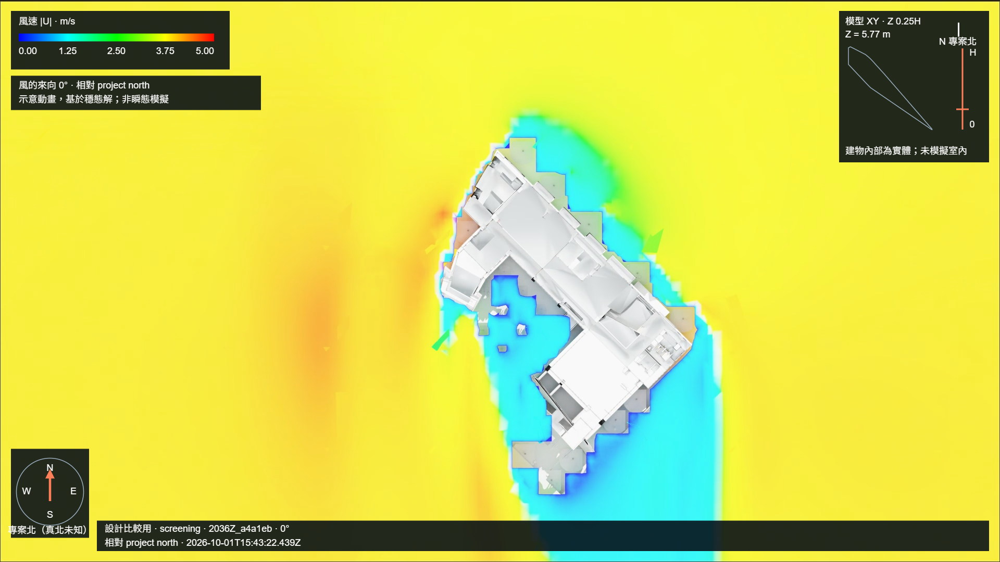
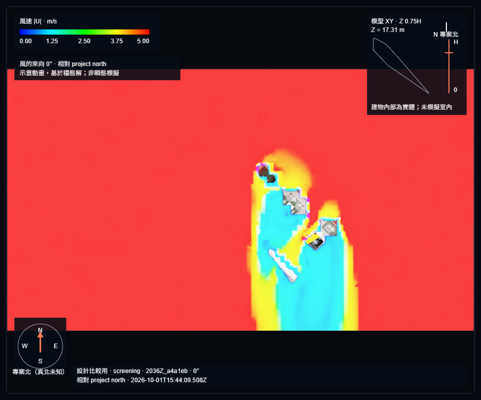
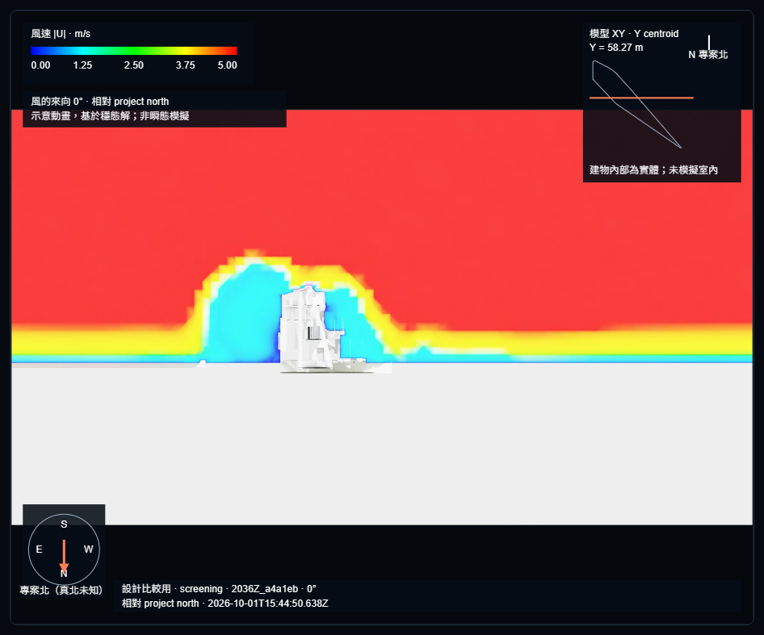
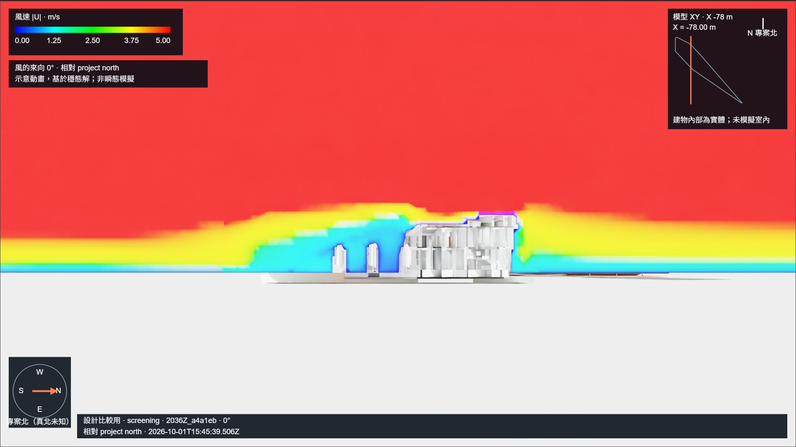

# CP8 七剖面真站驗收（2026-10-01）

## 結果與版本

**功能驗收：七個自動剖面色面、位置小圖、兩份 PNG 匯出、透視與正交退出復原均通過。** 大小、完整箭頭、色階飽和與最大數量效能限制仍未解除；不是 CFD 工程精度完成證明。

PR #1009 的裁切讀取遭 authority 拒絕，由 PR #1010 修復；其後正向裁切刪掉取樣色面，由 PR #1011 修復。下面是真站部署後自動序列，沒有手動方向補正。

- Runtime `6f4218a2d13534e25c9386644ab3f9d544fbd260`；PR #1011 exact head `f53884c` 兩軸獨立審查 P1/P2/P3=0，CI `36884931520` selected jobs 及唯一 required `pr-safety` 成功後正常合併。
- Canonical dev181 部署 exit 0，operator tag `deploy-20261001-639264658275380910-016`；Kit media gate 第一次 47 ms、coordinator health HTTP 200。標籤在 operator checkout，不宣稱遠端另有該標籤。
- 入口為開發站 `/ui#a1`，以網頁專用 MCP 的可見 headed Chrome 逐步操作，截圖已在對話分享。原使用者 Chrome 擴充連接器未附接；沒有使用 headless、request-routed 或本機 harness 替代真站驗收。
- 實際 WebRTC 首幀 1920×1080、readyState 4，DataChannel 已連線，模型核對相符。
- Run `cfd_20261001T132036Z_a4a1eb`：ready，483 iterations、residual convergence true、1,689,260 cells；先前實際求解 16 分 51 秒，本次未重算。
- Immutable artifact 28,186,047 bytes，SHA-256 `4f995afaaa3a68c2239c0a0a0c29a8b4e581a548587de0765cb772de6e9fbdfd`。

## 七個實際取樣面

第一面包含原相機／裁切／圖層讀取；每面均確認「1 圖層 → 2 裁切 → 3 正視角 → 4 正交投影」。取樣位置與 HUD 一致，裁切向相機偏移 0.05 m，負軸法線保留取樣面後方。

|面|軸|取樣位置 m|多邊形|Kit／畫面|
|---|---|---:|---:|---|
|z25|Z|5.769999980926514|68,342|五項 ACK、色面、小圖|
|z50|Z|11.539999961853027|68,417|四項 ACK、色面、小圖|
|z75|Z|17.30999994277954|68,454|四項 ACK、色面、小圖|
|x_centroid|X|−48.155912613270864|7,454|四項 ACK、色面、小圖|
|y_centroid|Y|58.26717744531932|9,164|四項 ACK、色面、小圖|
|custom_1|Z|10|67,393|四項 ACK、色面、小圖|
|custom_2|X|−78|7,592|四項 ACK、色面、小圖|

數字化係數、復原與匯出雜湊見 [驗收摘要](acceptance-summary.json)。未公開 raw SDK log、租約或完整 iframe URL。

## 畫面與產品匯出

兩份原生 PNG 由產品「下載 PNG」產生，完整解碼為 1920×1080，含圖例、風向、用途、run 短碼、UTC 及切面位置小圖。檔名不含模型或專案名稱。

## 退出復原

- 透視基線：裁切停用、21 個圖層可見性逐項相同；相機 position/direction/up/center-of-interest 最大差 `2.842170943040401e-14`，target distance 與 FOV 35.92104613528987° 相同。
- 正交基線：先切正交再進剖面，退出恢復正交高度 152.88359634399416 m、21 圖層相同，相機向量最大差 `1.4210854715202004e-14`。
- 正交退出後再切透視，FOV 仍為原 35.92104613528987°。兩次退出均有三個 Kit ACK。

## 限制與未驗證

- Layer 超過 CP1 約 25 MB 目標。兩種不同離線副本均未替換 ready artifact：前次切面 Mesh 與 PointInstancer 顏色索引副本 25,741,280 bytes（約 25.74 MB）；本次只處理切面 Mesh 的 primvar 索引副本 25,817,842 bytes（約 25.82 MB）。兩者仍超目標。先前單次暖 ACK 372 ms、對舊結果 +28 ms，不能推論冷載入、GPU 全面效能或最大 13 面真模型。
- 全場景 RTX 裁切會裁除邊界部分箭頭；present/visible 不證明所有箭頭完整。色面功能通過，向量可讀性仍有限制。
- 固定風速 0–5 m/s 在高處飽和；紅色不能量化所有超過 5 m/s 的差異。可設定與比較共用色階尚未實作。
- 仍為 screening 外部穩態場，建築內部為實體；沒有室內、網格／時間步收斂或工程精度證明。HUD 保留穩態示意標示，真北未知時維持相對專案北。
- 驗收工具曾因收合的手動面板、iframe 初始化先後及浮點字串精度而定位逾時；沒有重複 claim 或將工具錯誤算成產品通過，後續用實際 DOM 與原生讀回核對。
- 真正非穩態 U/p 同時間整合仍未完成；既有唯一求解 retry 已用完，不能以本穩態成果代替或再自動求解。

本變更只有已部署版本的文件、去識別化摘要與畫面，不變更程式或部署，因此不重啟已驗收 runtime。
