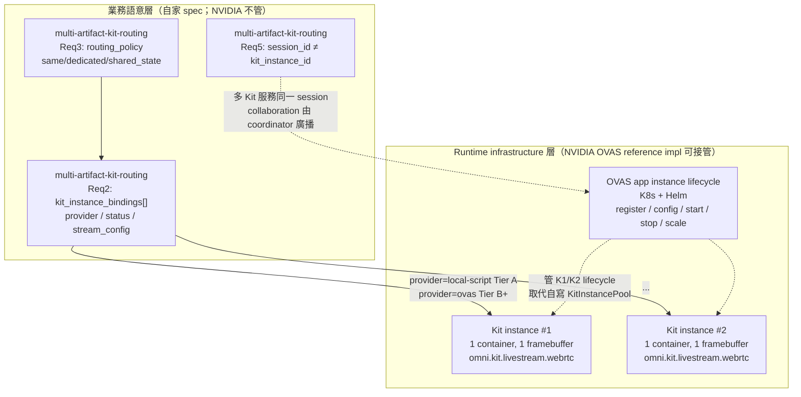
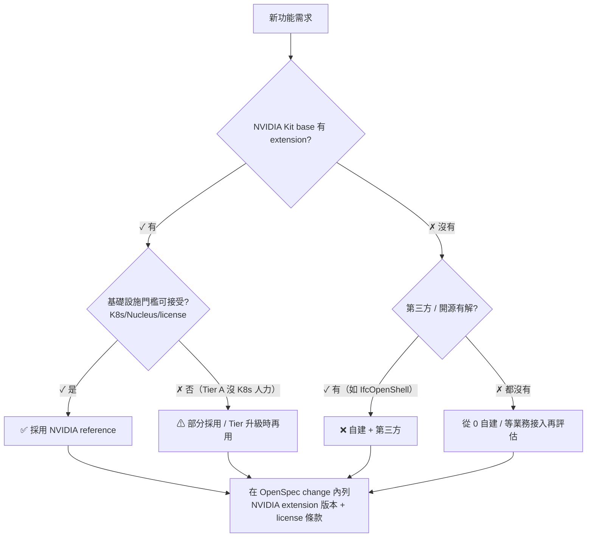

# AI-BIM-governance：SaaS 路線圖規劃（2026-05）

> **HTML 檢視**：本檔（`.md`）為 source-of-truth。如需 HTML 檢視，本機跑 doc / 規劃 skill 由本檔 on-demand 生成；HTML **不入 repo**（spec `documentation-source-of-truth` 規定 `docs/plans/*.html` 為 ignored，2026-05-26 起生效）。
>
> **文件性質**：roadmap / planning artifact（不是 OpenSpec change，不修改產品程式碼）
> **依據輸入**：使用者於 2026-05-08 提供的兩張架構圖（v1 路線圖 + v2 目標架構）
> **基準**：撰寫時 `main` HEAD `5a01487`（與 `origin/main` 同步）；OpenSpec 規格權威見 `openspec/specs/`，已歸檔提案見 `openspec/changes/archive/`（§1.4）。
> **撰寫技能組合**：`openspec-explore` → `planner` → `incremental-implementation` → `spec-driven-development`
> **回覆語言**：繁體中文
>
> **2026-05-08 follow-up 更新（OpenSpec 溯源 + §9 NVIDIA 語意定稿）**：
> 1. **§1.4**：整理 `openspec/changes/archive/*` 已歸檔 change 與現行 **`openspec/specs/`** capability 對照，避免 roadmap 與 spec 目錄漂移。
> 2. **§9**：延續 MCP／OVAS／extension 官方文件交叉驗證結果，明確 **`kit.exe` = OS process**、**Multi‑Kit = 多進程／多容器**、**primary／spectator／AOV = 同一進程內可多 signaling endpoint**（與 §11.4 Multi‑Kit 定義互相引用）。
>
> **2026-05-08 15:00 更新（MCP 補強）**：透過本機 docker container 上的 NVIDIA NeMo Agent Toolkit MCP server（`kit-mcp:9902`、`usd-code-mcp:9903`，皆 healthy）與 NVIDIA 官方文件（`docs.omniverse.nvidia.com`）交叉驗證，校正 Phase 4 / Phase 5 的「實際可用 NVIDIA 真實能力」。詳見 §11；§2 / §3 / §9 / §6 對應段落已標 ⓜ 表示由 MCP 補正。
>
> **2026-05-08 16:05 更新（依使用者 review 修訂）**：
> 1. **Phase 3 修正（歷史紀錄）**：當時曾重新分類 `multi-artifact-kit-routing` 的 `dedicated_instance` runtime 驗證狀態；最新執行狀態已於 2026-05-12 更新為「等待 GPU 購買與部署後執行」。詳見 §2 Phase 3、§5.1 候選 #2、§7 R2、§9.2、§9.8。
> 2. **Phase 4 / 5 採用 NVIDIA reference implementation 的決策框架**（優點 / 缺點 / 風險 / 建議）寫進新 **§13**。
> 3. **Phase 6 拆細項**（Production & SaaS 營運）：所有細項一律標註「**等待公司的業務系統接入；目前不規劃 OpenSpec spec**」，候選 #9 / #8 對應調整；詳見 §2 Phase 6、§6、§9.8。
>
> **2026-05-08 16:30 更新（Phase 4 / 5 細項拆分）**：依使用者要求，將 Phase 4（11 細項）與 Phase 5（18 細項，分 A 物理 / B 渲染材質 / C 多人協作 / D 領域邏輯 / E Sensor / F 大型場景 六類）依照 Phase 6 的格式拆分為可獨立評估的子能力，並對每一個子能力標註「**NVIDIA reference 優先 → 自主開發 fallback**」採用順序、對應 OpenSpec 候選與目前狀態。決策邏輯沿用 §13 框架（不可能自製 → 全採用、有顯著價值差距 → 自主先行 + NVIDIA 後續取代、Kit 沒覆蓋 → 必須自建）。詳見 §2 Phase 4 / Phase 5。
>
> **2026-05-08 17:00 更新（Phase 3 ↔ Phase 4.4 層級釐清 + NVIDIA 對 Multi-Kit instance 的官方定義）**：依使用者問題（1）「Phase 3 多 artifact / 多 instance 調度」與 Phase 4.4「Multi-Kit instance 並行」的關係、是否可用 OVAS app instance lifecycle 達成、（2）NVIDIA 如何定義 Multi-Kit instance 並行：
> 1. **§2 Phase 3 加層級對照**：澄清 #2 spec 屬於「routing decision + binding 紀錄」的**業務語意層**；Phase 4.4 / 4.5 / 4.11 屬於「Kit container 啟動、調度、生命週期」的 **runtime infrastructure 層**。兩者上下層關係，OVAS 是 runtime 層的官方 reference impl，**不取代** spec 內的 routing policy。
> 2. **§11 新增 §11.4**：NVIDIA 對「Multi-Kit instance 並行」的官方定義（Kit App = `.kit` 檔 + extension；Kit App Instance = container；OVAS = K8s 上多 pod 管理 lifecycle）+ MCP 與 OVAS Overview / Get Started 文件交叉驗證。
> 3. **§12.2 #2A 補充**：OVAS 接管 4.4 / 4.5 / 4.11 runtime 後，對 spec `multi-artifact-kit-routing` 的影響（`provider="ovas"`、Req2 不變、KitInstancePool 變薄）。
> 4. **§7 新增 R9**：OVAS multi-Kit lifecycle 黑盒化的觀察成本風險。
> 5. **§10 補 OVAS spike 路徑**：kind / minikube 單節點驗 chart 起跳，避免直接挑戰雲端 K8s。
>
> **2026-05-12 更新（本機環境一致性納入執行基線）**：新增 **§1.5** 作為 demo runtime 的環境一致性基線，並在 **§7 R10** / **§10** 補上 drift 風險與啟動前檢查。OpenSpec 已驗證通過代表當時 spec / tests / smoke evidence 成立；重新啟動 demo 前仍必須確認 repo-local Python / Node dependencies 沒有漂移。
>
> **2026-05-12 更新（OpenSpec archive 後 roadmap 對齊規範）**：新增 **§1.6**，明定每次 OpenSpec sync / archive 後，必須同步更新本 roadmap 的 spec 清單、歸檔 change 溯源、Phase 狀態、候選優先級與驗證證據引用，避免 `openspec/specs/` 與本文件漂移。
>
> **2026-05-18 更新（Phase B apply 已 merged + archived｜`local-coordinator-ifc-ready-intake-boundary`）**：B 方案 apply（T0–T9）已於 rolling PR #63 **merged**（squash `17553a0`），並依 `AGENTS.md §1.6` 完成 **OpenSpec sync/archive**（archive folder `openspec/changes/archive/2026-05-18-local-coordinator-ifc-ready-intake-boundary/`；`openspec/specs/` 19 → **23**：ADD 4＝`local-coordinator-ifc-ready-intake-boundary`/`external-cloud-callback-lifecycle`/`local-artifact-shadow-metadata`/`runtime-image-linux-kit-launcher-readiness`；MODIFIED 5＝`conversion-webhook-lifecycle`/`streaming-ifc-usdc-conversion-authority`/`documentation-source-of-truth`/`demo-runtime-readiness-smoke`/`runtime-verification-evidence`；`worker-rvt-ifc-bridge`/`bim-control-revit-intake-facade`/`worker-artifact-pipeline` 收斂為單一「capability removed from product runtime」requirement）。`openspec validate --specs --strict` = **23 passed / 0 failed**。**架構正式邊界**：`_worker` / `_bim-control` 已自 repo 刪除（removed from product runtime，非降級）；對外入口 = `bim-review-coordinator` `POST /api/external/ifc-ready`、`bim-streaming-server` internal-only、轉檔結果走 metadata-only callback outbox、本地僅最小 shadow metadata（control-plane 權威屬外部公司雲端，不 mirror）。**驗證狀態（誠實，依 §1.6 未標 §1.3 passed）**：coordinator `npm run verify`（vitest 130）與 repo-root pytest 6 / streaming pytest 5 綠（程式/契約層）；**runtime image Linux Kit launcher = `deferred`**（GPU/Kit graphics-vulkan 阻塞，非 passed，不用 host-local Kit 充當）；OQ1（雲端 callback endpoint/auth）/ OQ5（SSO）真實對接仍 pending（凍結契約緩解）。**Phase B 候選（§5）/ 下一步（§10）狀態**：本 change 已 land＋archived，從候選池移除、不再是 Phase B 待升格項；溯源見 §1.4。
>
> **2026-05-19 更新（下一輪 burn-down reset｜對齊 Drive 12h Claude Design 2026-05-14/15）**：新增 [`AI-BIM-governance-next-burn-down-2026-05-19.md`](AI-BIM-governance-next-burn-down-2026-05-19.md) 作為 Drive-ready 下一輪 burn-down。結論：5/14/15 工作台的 C1/C2 仍有效但改名並收斂為 B-scheme runtime evidence（`runtime-image-linux-kit-launcher-readiness-pass`、`bscheme-real-streaming-conversion-evidence`、`single-kit-webrtc-visual-evidence`）；C3 `revit-intake-rvt-ifc-bridge-evidence` **已失效**，不得重開 `_bim-control` / `_worker` 產品 runtime。13-file worker batch / `minimum_coverage_locked` 已轉為 archive-only historical evidence，不再是 Phase B 後的下一輪 product runtime 候選。§5 / §6 / §10 已同步加入目前仍有效的候選、deferred / blocked runtime evidence 與建議順序。
>
> **2026-05-19 更新（B 方案 intake smoke 現行證據）**：`scripts/smoke-bscheme-intake.ps1` 已從 contract-stub API-only smoke 擴成「contract checks + optional real `storage/*.ifc` → coordinator intake → streaming conversion polling → coordinator callback outbox」的最小整合驗證入口。本 8caa worktree 的 `storage/*.ifc` 目前為 **0 檔**，因此 `real_ifc_fixture=blocked`、`real_ifc_intake_conversion=blocked`；contract/API 層仍通過（repo-root pytest 7、coordinator verify 140、streaming conversion pytest 10、callback outbox passed）。GPU/Kit 層本次 `runtime_image_kit_launcher=deferred`，實際 blocker 為 **Docker engine not available**；single Kit render 為 `deferred`、multi-viewer 與 USD stage composition 為 `not_observed`。證據：`docs/verification/evidence/2026-05-18-bscheme-intake-smoke/bscheme-readiness.json` 與 `docs/verification/evidence/2026-05-18-t0-kit-launcher/kit-launcher-readiness.json`。
>
> **2026-05-22 更新(`coordinator-auto-poll-streaming-conversion` archive 對齊;fast-mvp loop zero-touch automation 完成)**:本 change(implementation PR #98,2026-05-22 merged,squash `2103bf7`)已完成 **OpenSpec sync/archive**(archive folder `openspec/changes/archive/2026-05-22-coordinator-auto-poll-streaming-conversion/`;`openspec/specs/` 26 保持 **26**,本次為 `conversion-webhook-lifecycle` capability **MODIFIED** 1 個 requirement(`Coordinator ingests host-native conversion result into callback outbox` 加 SHALL auto-poll 子條款 + 3 新 Scenario + implementation status note);totals + 0 added / ~ 1 modified / - 0 removed)。`openspec validate --specs --strict` = **26 passed / 0 failed**。本 change 補實該 requirement 早已寫的「ingest through polling, an internal result loop, or an equivalent internal callback」但 polling / internal result loop **皆未實作**的 gap:`bim-review-coordinator/src/services/streamingConversionClient.ts` 加 module-level `isTerminalConversionResult` helper + class method `pollConversionResult(jobId, options): PollerHandle`(setTimeout chain 避免 setInterval overlap、cancel()、max attempts → poll_timeout fake failed result);`bim-review-coordinator/src/config.ts` 加 `conversionPollEnabled`(default true)/ `conversionPollIntervalSeconds`(default 5)/ `conversionPollMaxAttempts`(default 60 = 5 分鐘 ceiling)+ `parseBooleanEnv`;`bim-review-coordinator/src/app.ts` 加 `pollerRegistry: Map<conversion_job_id, PollerHandle>`、refactor 既有 manual ingest 邏輯抽成共用 helper `ingestStreamingConversionResult`、dispatch 成功後 `schedulePollerForConversion`、manual endpoint 開頭 cancel + delete registry(去重)、`CoordinatorApp` 加 `dispose()` shutdown hook。**Verification(本 change L1-L4)**:coordinator `npm run verify` = 12 files / **173 tests passed**(168 既有 + 5 新 `auto-poll-conversion.test.ts` cover happy path / failed / duplicate dispatch budget / manual cancel auto / disabled config);streaming-server `pytest tests -q` = **31 passed**(不動,regression OK);root pytest 9 passed;GitNexus pre-impact LOW for `fetchConversionResult` / `createCoordinatorApp`;**L4 真實 runtime end-to-end 第一次 zero-touch 跑通**:docker compose recreate coordinator(讀新 code,帶 absolute `RUNTIME_STORAGE_ROOT`)→ `POST /api/external/ifc-ready` → fixture trick 確保 IFC 落地 → **無任何 manual POST ingest** → 40 秒內 coordinator `GET /api/external/ifc-ready/<job>` 返回 `conversion_status: ready` + `viewer_url: http://127.0.0.1:8004/ui/open?session=review_session_<id>`(2026-05-22 timestamp)。**注意**:本 archive 不持久化 poller state(coordinator restart 後 in-memory timers lost,手動 endpoint 仍可救);不解雲端 callback outbox retry / dead-letter(另一條既有 requirement 不動);不引入 streaming-server push callback(本 change 走 coordinator pull)。**fast-mvp loop 從 spec 到 code 從 zero-touch 自動化的角度完整收尾(架構完整對齊 + 自動跑通)**:OpenSpec changes archived = `remove-conflict-review-from-fast-mvp` + `fast-ifc-link-demo-loop` + `streaming-server-prefer-local-ifc-path` + `coordinator-auto-poll-streaming-conversion`(4 段);hotfix bundle = PR #94 / #95 / #96 / #98。

> **2026-05-26 更新(fast MVP Semantic ready chain follow-up,2 個 change merged + archived;vendor-side blocker)**:接續 2026-05-25 4 個 change archive,本日新增兩段補 Semantic ready chain:
> - **C5** `coordinator-forward-quality-metrics-summary`(PR #115 merged squash;`2026-05-26-coordinator-forward-quality-metrics-summary` archived):coordinator `createReviewSessionFromIngest` 從 streaming conversion result 萃取 `quality_metrics_summary`(含 C1 三 semantic 欄位 + 既有 source_ifc_entity_count / materialization_strategy / phase_timings),寫進 SessionStore 供 viewer / `/ui` stream-config 自動 forward。`conversion-webhook-lifecycle` capability +1 ADD requirement;coordinator types.ts `ConversionQualityMetricsSummary` 加三 C1 欄位(additive)。3 個新 vitest cover full / partial / missing quality_metrics 三條 path。
> - **C6** `streaming-server-enumeration-semantic-mapping`(PR #117 merged squash;`2026-05-26-streaming-server-enumeration-semantic-mapping` archived):`_enumerate_usd_stage` 從 USD prim CustomData 抽 `ifcType` / `ifcName`(容忍 `ifc:type` / `ifcType` / `ifc_type` 等命名變體),mapping items 加 ifc_type / ifc_name / entity_id;`_adopt_converter_sidecars` 從 emitted_mapping items supplement 缺少 semantic 欄位(non-fabricating,既有 converter-written 欄位用 `is None` / `not in` guard 不蓋)。`streaming-ifc-usdc-conversion-authority` capability +1 ADD requirement;4 個新 unit test。
>
> **`openspec/specs/`** 仍 26 個 capability;`openspec validate --specs --strict` = **26 passed / 0 failed**。
>
> **Closeout Chrome MCP evidence**:
> - C5 forward 機制 100% 工作:`quality_metrics_summary` 從整個 null → 帶 `source_ifc_entity_count=10872` / `materialization_strategy="usd_stage_enumeration"` / `coverage_status="warn"` 等真值,三 C1 semantic 欄位明示 `null`(schema stable)。viewer triReady File=yes / Runtime=yes / Semantic=no(誠實標)。
> - C6 後實際 Semantic ready 仍 no — **vendor-side blocker**:HOOPS A3D library 產出的 `model.usdc` 10,872 prim 完全無 IFC metadata(CustomData 僅 `userDocBrief`,attribute 無 `ifc` 字串),HOOPS 視 IFC 為 generic 3D 來源,只保留 mesh + material 不保留 GUID/Type/Name。C6 實作正確生效(三 semantic 欄位明示寫 null/false 進 JSON 不再 missing key),但 enumeration 沒資料來源可抽。
>
> **下一步建議**:新 OpenSpec change `streaming-server-ifcopenshell-semantic-sidecar-pass` — HOOPS 成功後並行跑 IfcOpenShell 解析 IFC source,寫 `ifc_semantic_sidecar.json`(IFC GUID → ifc_type/ifc_name dict),`_enumerate_usd_stage` 讀此 sidecar 補 mapping。Non-goals:不改 HOOPS A3D library(vendor-side)。對 fast MVP 影響:現狀 File / Runtime / Stage matched / WebRTC 全綠,Semantic=no 只是「點選 USD prim 反查 IFC element」這層的限制,不阻擋核心 3D 觀看。
>
> 完整 evidence:`docs/evidence/2026-05-25-fast-mvp-edge-bim-server-console/c2-viewer-semantic-yes-after-forward.md`(C5)+ `c2-viewer-semantic-final-vendor-blocker.md`(C6)。

> **2026-05-26 更新(`add-pr-review-agent` merged + archived;PR 自動審查閘門落地)**:本 change(implementation PR #120 merged,merge commit `3b958de`)已完成 **OpenSpec sync/archive**(archive folder `openspec/changes/archive/2026-05-26-add-pr-review-agent/`;`openspec/specs/` 26 → **27**,新增 capability `pull-request-review-agent`,共 10 requirements)。本 change 新增 repository-level PR review gate:PowerShell agent 產生 JSON / Markdown evidence,GitHub Actions `pr-review-agent` 在 PR opened / synchronize / reopened / ready_for_review 執行,檢查 OpenSpec alignment、secret / credential path、retired runtime reintroduction、owner-based validation plan、GitNexus detect-changes evidence 與 report verdict。**Verification**:PR #120 最新 head `0cec310` 的 GitHub Actions run `26433616440` 通過;agent summary = `warning` / `medium`,Blockers=None,warning 為 GitNexus hosted runner index unavailable;`openspec validate add-pr-review-agent`、script tests、PowerShell parse checks、`git diff --check` 已通過。**注意**:本 archive 只新增 repo governance / CI gate capability,不修改產品 runtime,不把任何 §1.3 runtime evidence 升等;後續是否設為 branch protection required check 應先觀察數輪 PR report 穩定性。

> **2026-05-25 更新(fast MVP Edge BIM Data Server Console 4 個 change merged + archived)**:依 `docs/plans/fast-mvp-edge-bim-server-console-design-2026-05-25.md` 切的 4 個 OpenSpec change 已全部 merged + archived(PR #106 / #107 / #108 / #109,squash merge:`330ebb2` / `0fbc9db` / `1055208` / `5f20c04`)。`openspec/specs/` 仍 26 個 capability(本輪皆為 MODIFY/ADD requirement 於既有 capability,不新增 capability):
> - **C1** `streaming-server-fallback-semantic-mapping`:`streaming-ifc-usdc-conversion-authority` ADD 1 / MODIFY 1 requirement。fallback 產出帶 `ifc_type` / `ifc_name` / `entity_id` 的 mapping,prim path `/World/<IfcClass>/<sanitized_guid>`,`quality_metrics` 新增 `semantic_mapping_fidelity` / `mapping_has_ifc_type` / `mapping_has_ifc_name`。Review fix:while-loop collision counter 避免 sanitize 同 token silent overwrite;補 multi-shape test(34 passed)。
> - **C4** `coordinator-serial-conversion-dispatch-queue`:`local-coordinator-ifc-ready-intake-boundary` ADD 1 requirement。in-memory FIFO 序列化對 streaming-server dispatch,新增 `queued_for_conversion` / `dropped_on_restart` lifecycle。Review fix:`queue_position` 改 enqueue 後讀(避免中間態錯誤);`dispose()` 接 `drain()` + `markDroppedOnRestart`(spec scenario「Coordinator restart drops queued jobs」實際接線)。vitest 183 passed。
> - **C2** `viewer-edge-bim-server-console`:`session-first-review-viewer` ADD 2 / MODIFY 3 / REMOVE 2 requirements。viewer 主畫面定位為 Edge BIM Data Server Console;TopBar 顯示 project / version / session;File / Runtime / Semantic 三段 ready badges;USDAsset / USDStage / DemoControlPanel 收 `?debug=1`;刪 `ReviewLauncher` / `PresencePanel` / `ArchitectureOverview`。Review fix:TopBar 改用 state `currentProjectId` / `currentModelVersionId` 讀 ReviewSession;`isBlockedLifecycle` / `lifecycleStatusText` 加 `queued_for_conversion` / `dropped_on_restart` handling。3 個 verify script + build 通過。
> - **C3** `coordinator-ui-tri-ready-and-queue`:`demo-fast-mvp-orchestration` ADD 3 / MODIFY 1 requirements。`/ui` 加 Edge BIM Data Server Console section、三段 ready badges、Conversion Dispatch Queue 區段、step rename(① 接收 IFC-ready webhook / ② 產生本機 USDC 資料包 / ③ 啟動 Kit / WebRTC 串流 / ④ 驗證 BIM 語意對照)、legacy disclaimer。Review fix:Semantic ready 改從 `/api/review-sessions/:id/stream-config` 取 quality_metrics_summary(IfcReadyIntakeJob schema 無此欄位);error path reset DOM 避免陳舊值;spec scenario「Dashboard readiness aligns with viewer readiness」釐清 server-side proxy vs client-runtime truth。vitest 176 passed。
>
> **Verification 狀態(誠實,依 §1.6 不標 §1.3 runtime passed)**:streaming pytest 34 + repo-root pytest 9 + coordinator vitest 183 + viewer build/verify 3 scripts + `openspec validate --specs --strict` 26/0 全 pass(程式/契約層)。**Archive evidence 缺口**:Chrome E2E 對 viewer TopBar / 4 層 Inspector / Bottom Strip 完整佈局、`?debug=1` 切換、真實 Semantic ready=`yes` 顯示(需 C1 fallback 重跑 + 新 mapping 寫入 + viewer fetch),屬 Chrome E2E archive evidence,本輪不跑(GPU/Kit live runtime 與 Chrome browser 自動化在本機 session 未準備)。**Out of scope(對齊 design doc)**:HOOPS A3D primary path 修復(vendor-side)、production queue dependency / disk-persistent queue、Inspector 4 層完整拆分 / Bottom Strip 完整 4 段(本輪僅實作 TopBar + tri-ready row + 條件渲染;`?debug=1` propagation 由 coordinator handoff 帶)、coordinator session-level primary observable artifact 選擇 / 重綁。

> **2026-05-25 更新(`streaming-server-capture-kit-conversion-logs` archive 對齊;Kit subprocess log 可觀察性補齊)**:本 change(implementation PR #100 已 merge,follow-up PR #103 已 merge,merge commit `1dae015`)已完成 **OpenSpec sync/archive**(archive folder `openspec/changes/archive/2026-05-25-streaming-server-capture-kit-conversion-logs/`;`openspec/specs/` 26 保持 **26**,本次為 `streaming-ifc-usdc-conversion-authority` capability **ADD** 1 個 requirement:`Conversion failures expose actionable diagnostic`;totals +1 added / ~0 modified / -0 removed)。本 change 補齊 `convert-ifc-to-usdc.ps1` 對 Kit/HOOPS subprocess stdout/stderr 的 async file capture:`kit-stdout.log` / `kit-stderr.log` 保留在 conversion artifact dir;失敗 result 的 `error` 可帶 `kit_stdout_log` / `kit_stderr_log` 與 tail 摘要;成功結果也保留 log file 供 baseline 對照。**L4 evidence**:`STORAGE_ROOT=C:\Repos\active\iot\AI-BIM-governance\storage` 重啟 host-native conversion service(`127.0.0.1:49101`,PID `36380`,role=`conversion-only`);以 341MB IFC cache `storage/ifc-cache/ifcready_1779687625000_064c6813/source.ifc` 建立 `stream_conv_20260525055218_115177da`;primary Kit/HOOPS import 在 `kit-stderr.log` 可觀察到 `A3D_LOAD_CANNOT_LOAD_MODEL` / `-10007`,最終同 job 透過 `ifcopenshell_openusd_fallback` 成功(`ready=true`,`source_ifc_entity_count=4889`,`mapped_count=4889`)。**注意**:本 archive 不新增前端 service-status UI、不改 artifact/session binding 規則、不升等 Docker GPU launcher、OQ1 cloud callback auth 或 OQ5 SSO;`TEMP-fast-mvp-session-artifact-binding-discussion-2026-05-25.md` 仍只作未提交暫存討論筆記。

> **2026-05-22 更新(`fix-ifc-usdc-hoops-load-failure` archive 對齊;真實 IFC→USDC→Kit/WebRTC viewer 閉環完成)**:本 change(implementation PR #101,2026-05-22 merged,squash `4c7a76c`)已完成 **OpenSpec sync/archive**(archive folder `openspec/changes/archive/2026-05-22-fix-ifc-usdc-hoops-load-failure/`;`openspec/specs/` 26 保持 **26**,本次為 `demo-fast-mvp-orchestration`(+1 added/~1 modified)、`host-native-conversion-authority-service`(~1)、`local-coordinator-ifc-ready-intake-boundary`(+3)、`runtime-verification-evidence`(+2/~1)、`session-first-review-viewer`(~3)、`streaming-ifc-usdc-conversion-authority`(~1);totals +6 added / ~7 modified / -0 removed)。`openspec validate --specs --strict` = **26 passed / 0 failed**。本 change 將目標 341MB IFC 的 HOOPS `A3D_LOAD_CANNOT_LOAD_MODEL` 失敗收斂為 scoped IfcOpenShell + OpenUSD fallback:只在 primary Kit/HOOPS 明確 IFC import/load failure 且 IFC 可解析時產生真實 `model.usdc` 與 sidecars,並經 USD openability / mesh count / placeholder gate 後才發布 ready。**Current runtime evidence passed**:`ifcready_1779449084006_3a0fd2cb` → `stream_conv_20260522112506_2b79ba1d` → `review_session_5f549af0631b`;`conversion_status=ready`;Chrome E2E 從 `http://192.168.10.105:8004/ui` 開始,`/ui` dashboard 顯示 downloaded/ready/Kit-WebRTC/session/participant 狀態;viewer 顯示 `Stage truth matched`,loaded URL 等於 `http://127.0.0.1:49101/artifacts/stream_conv_20260522112506_2b79ba1d/model.usdc`,video `1920x1080`,同一 Chrome tab reload 後仍 matched。證據路徑:`docs/evidence/fix-ifc-usdc-hoops-load-failure/2026-05-22-e2e-final-stage-truth-matched/`；archive closeout 在 synced main 上另重跑 Chrome/CDP,證據路徑:`docs/evidence/fix-ifc-usdc-hoops-load-failure/2026-05-22-archive-closeout-e2e/`。**狀態調整**:`bscheme-real-streaming-conversion-evidence` 與 `single-kit-webrtc-visual-evidence` 從下一輪 P0 候選移入 archived evidence;但 `runtime-image-linux-kit-launcher-readiness` 仍 **deferred**(Docker GPU runtime 未因 host-native Kit evidence 升等),OQ1 cloud callback auth 與 OQ5 SSO 仍 pending。

> **2026-05-22 更新(`streaming-server-prefer-local-ifc-path` archive 對齊;fast-mvp loop final landing,含 hotfix bundle)**:本 change(implementation PR #96,2026-05-22 merged,squash `3c7dbd5`)已完成 **OpenSpec sync/archive**(archive folder `openspec/changes/archive/2026-05-22-streaming-server-prefer-local-ifc-path/`;`openspec/specs/` 26 保持 **26**,本次為 `conversion-webhook-lifecycle` capability **+2 ADD requirement**:(i)`Coordinator dispatch payload carries local path references`(backfill `fast-ifc-link-demo-loop` archive PR #93 缺漏的 requirement body,3 Scenarios);(ii)`Streaming-server consumes shared-volume local IFC path before url fetch`(本 change ADD,3 Scenarios);兩個 requirement 都帶 implementation status note;totals + 2 added / ~ 0 modified / - 0 removed)。`openspec validate --specs --strict` = **26 passed / 0 failed**。本 change 為 fast-mvp loop 的最後一塊拼圖:fast-ifc-link-demo-loop archive 內已宣告但 streaming-server 端未實作的 consumer 行為,本 change 補實「streaming-server SHALL prefer `host_local_path` / `local_path` over url」。**Hotfix bundle(同日 2026-05-22 收斂)**:PR #94 `fix(coordinator): storageRoot 加 host-native fallback`(`config.ts:206` default `/workspace/storage` → `path.join(cwd, "storage")`,修 host-native node 跑時 ENOTDIR `mkdir '/workspace/storage'`);PR #95 `fix(compose): coordinator service env 加 STORAGE_ROOT + STORAGE_HOST_ROOT`(coordinator service environment block 漏設 STORAGE_ROOT,IFC 寫到 container-local fs 而非 shared volume);PR #96 本 change(streaming-server `Ifc2UsdcPowershellConverterAdapter._resolve_local_ifc` 新解析順序 host_local_path → local_path → 既有 url fallback + `_try_local_path` storage_root sandbox helper;`conversion_authority._ifc_artifact` propagate `local_path` / `host_local_path` 進 job dict)。**Verification(本 change L1-L3)**:streaming-server `pytest tests -q` = **31 passed**(+8 新 case:adapter 5 + propagation 2 + sandbox 1);coordinator `npm run verify` = 11 files / **168 tests passed**(regression OK,coordinator side 不動);root pytest 9 passed;GitNexus pre-impact LOW for `_ifc_artifact` / `_resolve_local_ifc` / `_url_to_local_path`(d=1 callers 都在同 module / class)。**注意**:本 archive 不升等 render tier(`single_kit_render` / WebRTC `49100` / browser visual 仍 `not_observed`),不解 OQ1/OQ5;L4 真實 happy path 需 user 設 `.env` `RUNTIME_STORAGE_ROOT=<host absolute path>`、recreate coordinator container、重啟 host-native streaming-server 帶 `STORAGE_ROOT=<host absolute path>`,本 archive 不包含此環境設定步驟(留給 user runbook)。**fast-mvp loop 兩段 archive(`remove-conflict-review-from-fast-mvp` + `fast-ifc-link-demo-loop`)+ 三段 hotfix(PR #94 / #95 / #96)整體把外部 IFC Worker → coordinator → streaming-server → viewer 連結這條 happy path 從 spec 到 code 完整對齊**。

> **2026-05-21 更新（`backfill-coordinator-webhook-and-auto-session` archive 對齊）**：本 change（implementation PR #85，2026-05-21 merged）已完成 **OpenSpec sync/archive**（archive folder `openspec/changes/archive/2026-05-21-backfill-coordinator-webhook-and-auto-session/`；`openspec/specs/` 25 保持 **25**，本次為 MODIFIED capabilities：`conversion-webhook-lifecycle` / `local-coordinator-ifc-ready-intake-boundary` / `review-session-request-lifecycle` 各 +1 modified requirement（加 implementation status note），scenarios 全保留；totals + 0 added / ~ 3 modified / - 0 removed）。`openspec validate --specs --strict` = **25 passed / 0 failed**。本 archive 把 archive `2026-05-21-coordinator-ifc-ready-worker-webhook` 的 documentation lag 收斂：worker compatibility intake + conversion-ready 自動 review session handoff 已落地、11 個 spec scenarios 對應 TDD-driven test 全綠。**注意**：本 archive 不升等 render tier（`single_kit_render` / WebRTC `49100` / browser visual 仍 `not_observed`），不解 OQ1（雲端 callback endpoint/auth）/ OQ5（SSO）；後續若需 render tier 證據，需 Kit build + GPU host 前置另立 change。

> **2026-05-21 更新(`fast-ifc-link-demo-loop` archive 對齊;fast-mvp loop successor 收尾)**:本 change(implementation PR #92,2026-05-21 merged,squash `fb9dea3`)已完成 **OpenSpec sync/archive**(archive folder `openspec/changes/archive/2026-05-21-fast-ifc-link-demo-loop/`;`openspec/specs/` 26 保持 **26**,本次為 MODIFIED 4 個 capability 加 implementation status note:`local-coordinator-ifc-ready-intake-boundary` + `conversion-webhook-lifecycle` + `demo-fast-mvp-orchestration` + `documentation-source-of-truth`;totals + 0 added / ~ 4 modified / - 0 removed;完整 ADD requirement bodies 落在 archive folder 內,等 follow-up sync 完整內容)。`openspec validate --specs --strict` = **26 passed / 0 failed**。本 change 是 fast-mvp loop 的 **successor**(predecessor `remove-conflict-review-from-fast-mvp` 已於同日 PR #90/#91 archived),補上「外部 IFC Worker(Postman 模擬)送 ifc-ready → coordinator **同步下載 IFC 至 shared volume** + dispatch streaming-server → 轉檔 ready 後 coordinator **自動 setViewerLink** 並輸出 `viewer_url` → client 點連結直接看 stream」這條 happy path。**實作摘要**:`bim-review-coordinator/src/services/ifcDownloader.ts`(non-strict mode fallback placeholder);store/types/streamingConversionClient 加 download/local_path/host_local_path/viewer_url 欄位 + binding;`POST /api/external/ifc-ready` 同步下載 → 202/502;`GET /api/external/ifc-ready/:jobId` 暴露 viewer_url;新 `GET /ui/open?session=` 302 redirect;`ingestConversionReport` ready 分支加 setViewerLink;`/ui` main 加 3 卡 fast MVP;`docs/postman/` Postman collection;`AGENTS.md §3.4` + `bim-review-coordinator/CLAUDE.md` 加 carve-out。**Verification(5 級)**:coordinator `npm run verify` = 11 files / 166 tests passed;viewer build + `test:session-first` passed;root pytest 9 passed;`openspec validate --specs --strict` 26 passed;docker compose up + netstat 確認 `5173 → 127.0.0.1` / `8004 → 0.0.0.0`;`docker exec /ui/open?session=review_session_test` → 302 + `Location: http://127.0.0.1:5173/?session=review_session_test`;`/ui/open?session=invalid` → 400;`/ui` 含 3 卡 fast MVP 字串。**注意**:不升等 render tier(`single_kit_render` 仍 `not_observed`);不解 OQ1/OQ5;viewer 全螢幕版面留 follow-up;real MinIO dev 機可能不可達,non-strict fallback placeholder 通過 test。**fast-mvp loop 兩段 archive(predecessor + successor)整體達成 demo level happy path**。

> **2026-05-21 更新（`remove-conflict-review-from-fast-mvp` archive 對齊;fast-mvp loop predecessor)**：本 change（implementation PR #90，2026-05-21 merged，squash `9e57015`）已完成 **OpenSpec sync/archive**（archive folder `openspec/changes/archive/2026-05-21-remove-conflict-review-from-fast-mvp/`；`openspec/specs/` 26 保持 **26**,本次為 MODIFIED capability:`review-session-request-lifecycle` +1 modified requirement(Coordinator exposes lifecycle event audit log 加 implementation status note),scenarios 全保留;totals + 0 added / ~ 1 modified / - 0 removed)。`openspec validate --specs --strict` = **26 passed / 0 failed**。本 change 為**純減法 + 一行 compose port bind + docs/spec 退役 note**:刪 coordinator highlight/selection/annotation Socket.IO handlers、刪 `BimControlClient.getReviewIssues` / `createAnnotation` / `/api/model-versions/:id/review-bootstrap` endpoint、`registerReviewNamespace` 改 signature、dev-console step bar 5→3、刪 IssuePanel/EventLogPanel/types/issues 整檔、Window.tsx 清 issue state/methods/render、DemoControlPanel 4 issue props 改 optional、`compose.host-kit.yml` `viewer.ports` 改 `127.0.0.1:5173:5173`(對應 memory `webrtc-1on1-entrypoint-via-coordinator-ui` 邊界)、AGENTS.md §5.4/§5.5/§7.4 + coordinator CLAUDE.md 加退役 note。23 files / +96 / -625 lines。**Verification(5 級)**:coordinator `npm run verify` = 11 files / 166 tests passed;viewer build + `test:session-first` passed;root pytest 9 passed;`openspec validate --specs --strict` 26 passed;`docker compose up --build coordinator viewer` 兩 container Up;`netstat` 確認 `0.0.0.0:5173` 已消失僅剩 `127.0.0.1:5173`;`docker exec coordinator /health` status=ok;`/ui` 字串斷言通過(「步驟 ③ / 3」true,「標示問題位置/建立審查標註/guidedHighlightIssue」全 false);L5 mcp__claude-in-chrome navigate permission denied 改以 container 內 fetch 字串斷言代替。**注意**:本 archive 為 fast-mvp loop 的 **predecessor**,NoSuccessorWhilePredecessorOpen gate 已開,可進 successor `fast-ifc-link-demo-loop`(整體 design 見 `docs/superpowers/specs/2026-05-21-fast-mvp-loop-overall-design.md` §4);本 change 不升等 render tier(`single_kit_render` / WebRTC `49100` / browser visual 仍 `not_observed`),不解 OQ1/OQ5。

> **2026-05-21 更新（`docker-web-plane-host-native-kit` archive 對齊）**：本 change（implementation PR #88，2026-05-21 merged，squash `2bdf09f`）已完成 **OpenSpec sync/archive**（archive folder `openspec/changes/archive/2026-05-21-docker-web-plane-host-native-kit/`；`openspec/specs/` 25 → **26**：ADD `docker-web-plane-host-native-kit` capability，MODIFIED `demo-fast-mvp-orchestration` +1 requirement；totals +7 requirements）。本 archive 把 fast MVP 後的單機可部署流程固定為「Docker 只跑 `bim-review-coordinator:8004` + `web-viewer-sample:5173` web plane，NVIDIA Kit/WebRTC `49100`/`47998` 與 host-native conversion authority `49101` 留在 OS 上」。implementation evidence 已驗：coordinator health 200、viewer HTTP 200、container-to-host conversion bridge、host-native Kit TCP probe、artifact refs reachability；**但不升等 Docker GPU Kit readiness，也不宣稱 browser visual render passed**。後續 B-scheme runtime evidence 可沿用此 hybrid web-plane path，但仍需另行收集 streaming-owned real conversion quality 與 single Kit/WebRTC visual proof。

> **2026-05-21 更新（`backfill-coordinator-webhook-and-auto-session` apply 落地：補 archive `coordinator-ifc-ready-worker-webhook` 的 spec drift）**：先前 archive `2026-05-21-coordinator-ifc-ready-worker-webhook` 把 worker compatibility intake + conversion-ready 自動建 review session 寫進正式規格但 code 從未實作（archive commit 自承 documentation lag；retro-audit `a32fcd6` 確認）。本 change 為 implementation-only backfill：(i) `bim-review-coordinator/src/app.ts` 加入 `normalizeIntakePayload` helper，支援 worker `status="ifc_ready"` / `ifc_path` / `project_id` / `version` / `task_id` payload 並正規化為 canonical `ExternalIfcReadyEvent`（worker compat 缺 `X-Correlation-Id` / `X-Idempotency-Key` 時從 `worker:project_id::version::task_id` 派生，explicit headers 仍優先）；(ii) `ingestConversionReport` terminal `ready` 分支接 `autoCreateOrActivateSession` helper，與 `callbackOutbox.enqueue` **並行不耦合**，重用既有 `SessionStore.create` + `allocateKitInstanceBindings` + `chooseReadyUsdc`，對 `correlation_id` / `external_model_version_id` idempotent；terminal `failed` 不建可串流 session。**Spec delta**：採 Option B（NO-OP-ish MODIFIED re-affirm，三份 capability `local-coordinator-ifc-ready-intake-boundary` / `review-session-request-lifecycle` / `conversion-webhook-lifecycle` 各加一段 implementation status note，scenarios 全保留）。**Verification（2026-05-21 re-apply supplement）**：補上圖片中實際外部 IFC Worker payload guard：`ifc_path="http://192.168.20.234:9000/bim-control/899/xxx/model.ifc"`、`project_id="899"`、`version="xxx"`、`task_id="task_img_001"`；coordinator `npm run verify` = **11 files / 167 tests passed**；root contracts pytest **9 passed**；`openspec validate --specs --strict` = **25 passed / 0 failed**；11 個 spec scenarios（intake 4 + auto-session 4 + webhook seam 3）逐個對應 unit/contract test（見 `docs/verification/2026-05-21-backfill-coordinator-webhook-and-auto-session.md`）。**Render tier 維持 `not_observed`**（`single_kit_render` / WebRTC `49100` / browser visual 需 Kit build + GPU host 前置，本 change 不升等）；OQ1（雲端 callback endpoint/auth）/ OQ5（SSO）仍 pending。

> **2026-05-21 更新（`recap` archive 對齊）**：本 change（implementation PR #79，2026-05-21 merged）已完成 **OpenSpec sync/archive**（archive folder `openspec/changes/archive/2026-05-21-recap/`；`openspec/specs/` 24 → **25**：ADD `demo-fast-mvp-orchestration` capability，+6 added requirements；totals + 6 added / ~ 0 modified / - 0 removed）。`openspec validate --specs --strict` = **25 passed / 0 failed**。本 archive 把「用 repo 既有 services + scripts，30 分鐘到 fast MVP demo」的單機短路徑寫進正式規格：runbook 路徑、host vs container 邊界（streaming-server 強制 Windows host-native；WSL Kit graphics 阻擋）、port matrix（49100/49101/8004/5173）、三步劇本（start-all → demo-health-check → smoke-bscheme-intake）、驗收長相對齊 tier 狀態語意（`passed` / `failed` / `blocked` / `deferred` / `not_observed`）、明確排除 roadmap Phase 1/2/5/6 元件、所有 runbook 引用 grep-verifiable。**注意**：本 capability 與既有 runtime capability 正交，不修改任何 production source；tasks.md 23/24 未勾選為 documentation lag（implementation PR 已 merged），不影響 archive。
>
> **2026-05-21 更新（`coordinator-ifc-ready-worker-webhook` archive 對齊）**：本 change（implementation PR #74，2026-05-19 merged）已完成 **OpenSpec sync/archive**（archive folder `openspec/changes/archive/2026-05-21-coordinator-ifc-ready-worker-webhook/`；`openspec/specs/` 24 保持 **24**，本次為 MODIFIED capabilities 而非 ADD：`conversion-webhook-lifecycle` +1 added +2 modified、`local-coordinator-ifc-ready-intake-boundary` +1 added +2 modified、`review-session-request-lifecycle` +1 modified；totals + 2 added / ~ 5 modified / - 0 removed）。`openspec validate --specs --strict` = **24 passed / 0 failed**。本 archive 把「worker `ifc_ready` webhook payload 相容 + coordinator 自身 conversion-ready ingestion 自動觸發本地 review session handoff」的 B 方案 re-home 寫入正式規格，補齊 `_bim-control` 退役後留下的 session 觸發責任孤兒。**注意**：本次 archive 不解 OQ1（雲端 callback endpoint/auth）/ OQ5（SSO），不把 Kit/WebRTC/browser visual 標 passed（仍 deferred / not_observed）；tasks.md 26/26 未勾選為 documentation lag，不影響 archive，後續若需 follow-up evidence 在新 change 中處理。
>
> **2026-05-20 更新（`introduce-host-native-conversion-authority-service` archive 對齊）**：本 change 已完成 **OpenSpec sync/archive**（archive folder `openspec/changes/archive/2026-05-20-introduce-host-native-conversion-authority-service/`；`openspec/specs/` 23 → **24**：ADD `host-native-conversion-authority-service`，並向 `conversion-webhook-lifecycle`、`demo-runtime-readiness-smoke`、`runtime-verification-evidence`、`streaming-ifc-usdc-conversion-authority` 新增 host-native conversion / evidence requirements）。`openspec validate --specs --strict` = **24 passed / 0 failed**。本 archive 將 `127.0.0.1:49101` host-native conversion authority、coordinator dispatch / pull ingestion、callback outbox 分層與 viewer ready gate 寫入正式規格；但**不**因 archive 本身把 Kit/WebRTC/browser visual、外部公司雲端 callback auth、或 current real IFC runtime evidence 標成 passed。下一步 `bscheme-real-streaming-conversion-evidence` 收斂為：在此已歸檔規格上補 current runtime evidence。
>
> **2026-05-20 更新（`recap` fast MVP demo 短路徑）**：新增 active change **`recap`**（capability `demo-fast-mvp-orchestration`）與 runbook [`docs/demo/fast-mvp-demo-recap.md`](../demo/fast-mvp-demo-recap.md)，把「用 repo 既有 `bim-review-coordinator` + `bim-streaming-server` + `web-viewer-sample` + `tests/fakes` + 既有 `scripts/start-all.ps1` / `scripts/demo-health-check.ps1` / `scripts/smoke-bscheme-intake.ps1`，30 分鐘到 demo」的短路徑寫成單一份 runbook。**不替代本 roadmap 的 Phase 0–7**，僅作為早期驗證；明確排除 Phase 1（MinIO/Gitea/LFS）/ Phase 2（IfcTester/BCF）/ Phase 5（IoT/MQTT）/ Phase 6（ML）等元件，並把 WSL Kit graphics 阻擋與 host-native 為唯一 demo path 寫入 runbook。本 change 為 docs-only，blast radius = LOW，不動 production source / dependency。
>
> **2026-05-12 更新（`worker-real-conversion-quality` archive 對齊）**：依 `openspec/changes/archive/2026-05-11-worker-real-conversion-quality/` 與現行 `openspec/specs/` 更新 **§1.2 / §1.3 / §1.4 / §2 / §4 / §5 / §6 / §7 / §9.8 / §10**。P0 #1 已 land 並歸檔：`_worker` 已具備真實 IFC→USDC adapter、USDC openability hard gate、real mapping quality metrics 與 single Kit/browser 截圖證據；mapping coverage 仍採 measure-first，尚未鎖 production baseline 門檻。
>
> **2026-05-12 更新（#2 GPU 容量等待）**：依使用者指示，`multi-artifact-kit-routing` / `streaming-multi-instance-orchestration` 的 `dedicated_instance` runtime 驗證改為 **等待 GPU 購買與部署後執行**。在至少兩個 GPU-backed Kit endpoints 可用前，roadmap 與 OpenSpec 只保留 control-plane contract / routing target，不把 dedicated multi-Kit runtime 視為進行中、passed 或 failed。
>
> **2026-05-12 更新（`worker-mapping-lineage-quality-baseline` archive 對齊）**：依 `openspec/changes/archive/2026-05-12-worker-mapping-lineage-quality-baseline/` 與現行 `openspec/specs/` 更新 **§1.2 / §1.3 / §1.4 / §2 / §5 / §6 / §10**。原候選 #3 lineage API 與 #3A mapping quality baseline 已合併為同一 change 並歸檔：`_worker` 已具備 lineage query API、worker UI lineage / quality view、all-IFC-entity coverage 語意、`minimum_coverage_ratio=1.0` policy 與 storage batch verification helper；canonical 13-file real batch 仍未完成，因此 production baseline 尚未鎖定。
>
> **2026-05-12 更新（canonical storage batch follow-up）**：新增 active change **`worker-canonical-storage-batch-baseline`**，專門處理已歸檔 #3/#3A 留下的 readiness gap：`C:\Repos\active\iot\AI-BIM-governance\storage\*.ifc` 13-file real batch 尚未 passed，且 `--limit 1` 曾 600s timeout。此 change 是下一個 worker risk burn-down；執行順序明確改為「單檔 real conversion 先跑通 → 用既有 web viewer / Kit 載入 worker-hosted `model.usdc` 看轉檔成果 → 再跑 full 13-file batch」。

> **2026-05-12 更新（#4 lifecycle audit archive 對齊）**：依 `openspec/changes/archive/2026-05-12-coordinator-session-lifecycle-events-audit/` 與現行 `openspec/specs/review-session-request-lifecycle/spec.md` 更新 **§1.2 / §1.3 / §1.4 / §2 / §5 / §6 / §10**。#4 已完成並歸檔：`bim-review-coordinator` 已具備 append-only lifecycle audit endpoint 與 `sequence` event schema；`_bim-control` review request lifecycle events 已補 `session_id` / `correlation_id`。此 archive 不解凍 Phase 6 audit persistence / observability / webhook production delivery。
>
> **2026-05-12 更新（canonical batch apply evidence）**：`worker-canonical-storage-batch-baseline` 已補上 batch timeout/status semantics、converter phase progress、worker UI review viewer handoff 與 verification report。Canonical `--limit 1 --timeout-seconds 600` 仍在第一個 89MB fixture timeout，並記錄 `source_artifact_id=artifact_src_00de4766405d`、`artifact_group_id=ag_61cd043fd19c`、`conversion_job_id=conv_20260512095847_74be0bc7`。短 timeout smoke 顯示已完成 `ifc_open`，目前卡在 `source_entity_enumeration`；因此 visual preview / full 13-file batch 仍 blocked，`minimum_coverage_locked=false` 維持不變。
>
> **2026-05-12 更新（canonical batch archive + enumeration optimization next）**：依使用者明確指示，`worker-canonical-storage-batch-baseline` 已先 archive 至 `openspec/changes/archive/2026-05-12-worker-canonical-storage-batch-baseline/`，並把其 batch/status/phase timing/preview handoff requirements 併入現行 specs；archive 時仍有 10 個 implementation tasks 未完成，因此 roadmap 不把它視為 runtime passed。新的 active change **`optimize-worker-source-entity-enumeration`** 專門 burn down `source_entity_enumeration` timeout blocker，先完成 89MB canonical fixture 的 enumeration profiling / optimization，再回到 single-fixture conversion、visual preview 與 full 13-file batch gate。

> **2026-05-13 更新（source enumeration blocker burn-down）**：`optimize-worker-source-entity-enumeration` 已讓 canonical first fixture 越過 `source_entity_enumeration`：`--limit 1 --timeout-seconds 600 --profile-source-entities` 記錄 `1,604,773` source IFC entities、enumeration 約 `33.19s`、`fallback_used=false`。該 run 仍在 `non_renderable_entity_materialization` timeout，未產出 completed `model.usdc`，因此 visual preview / full 13-file batch 仍 blocked，`minimum_coverage_locked=false` 維持不變。Closeout 時修正本機 Python user-site dependency drift（`starlette 1.0.0` → `_worker/requirements.txt` baseline `starlette==0.37.2`）後，`_worker` API regression `38 passed, 1 skipped`，converter/batch/store focused tests `67 passed`，strict OpenSpec validation 與 `git diff --check` 通過。新的後續風險切片應聚焦 large IFC all-entity non-renderable materialization。

> **2026-05-13 更新（`demo-current-runtime-observation` live pass）**：本次 current observation 產出 `docs/verification/2026-05-13-demo-current-runtime-observation.md`。非 Kit 服務 health 目前可啟動並通過：8001 / 8005 / 8004 health OK、5173 HTTP 200；focused checks 為 `_bim-control` `23 passed`、`_worker` `105 passed, 1 skipped`、coordinator `105 passed`、viewer build / session-first contract passed，viewer lint 仍是既有 `29 errors, 1 warning`。Socket.IO collaboration passed，coordinator close / release lifecycle passed（`review_session_87404055d4fd`）。但 current worktree `storage/` 沒有 IFC fixture，worker dev-source smoke blocked；`smoke-review-session.ps1` 的極簡 IFC payload 無法被 IfcOpenShell parse，因此 conversion readiness failed；Kit/WebRTC blocked by missing streaming launcher，Browser automation blocked by in-app browser policy，dedicated multi-Kit runtime 仍 deferred。此 live pass 不把 historical single-Kit/browser evidence 重新標成 current passed。

> **2026-05-13 更新（non-renderable materialization sidecar carrier 完成 canonical single-fixture conversion）**：`optimize-worker-non-renderable-materialization` 已 land sidecar carrier 路徑（Option 4 + Option 3）。`non_renderable_entity_materialization` 從 baseline `375.1s+ timeout` 收斂至 `5.05s`（≈74× faster），同 fixture canonical run 在 `267.7s` 完成、產出第一個 canonical `model.usdc`（`output_file_size_bytes=9,844,612`），`coverage_ratio=0.9999987537178155`（`mapped_count=1,604,771` / `source_ifc_entity_count=1,604,773`，2 個未對映的 shape 為 geometry side 缺 GUID，可由 secondary scope follow-up 收斂）。`bim-review-coordinator` / `web-viewer-sample` / `bim-streaming-server` 三邊在 source 中對 sidecar carrier 無需 schema change，handoff framework 已記錄於 design.md。Full 13-file batch 與 visual preview 仍 not_run，`minimum_coverage_locked=false` 維持不變。下一個切片：full 13-file batch with sidecar carrier，以及把 secondary `guid_extraction` / `name_extraction` 優化（baseline ~10s）獨立 follow-up。
>
> **2026-05-14 更新（architecture-rework B 方案 archive 對齊）**：`architecture-rework-2026-05-14` 已由 PR #54 merge 後 archive 至 `openspec/changes/archive/2026-05-14-architecture-rework-2026-05-14/`，現行 `openspec/specs/` 共 18 個 capability。B 方案正式把 conversion authority 重新分配為：`_bim-control` = fake RVT intake facade、`_worker` = RVT→IFC bridge、`bim-streaming-server` = IFC→USDC conversion job authority + USD stage composition、`bim-review-platform` = coordinator + streaming-server + viewer deployment boundary（不是 nested repo）。本次 archive 只代表規格併入，不代表已新增 runtime smoke；在 streaming-server-owned conversion job / result / quality evidence 出現前，roadmap 仍不把 `streaming_conversion_job` 或 `mapping_quality` 標成 passed。
>
> **2026-05-15 更新（對齊「BIM 模型管理平台 系統架構」PDF 雲地分離定位）**：依使用者提供的 `BIM模型管理平台 系統架構_260514.pdf`（2026-05-14，雲地分離架構）新增 **§1.1A**，明確 AI-BIM-governance 在該平台中的角色 = **客戶落地端**接在 PDF「IFC Worker（IFC 4 匯出）」之後的延伸（IFC→USDC + 後續 BIM 治理 + Kit streaming runtime，GPU 由客戶自購自擴）；**公司雲端只負責服務授權（公司層級 License）與客戶資訊紀錄（版本／權限／metadata），不存客戶模型原始檔、不跑 GPU runtime**。此更新只對齊部署與商業邊界語意，不改 §1.2 現行 specs、不改 §6 OpenSpec 候選優先級。
>
> **2026-05-15 更新（歷史決策草稿；已由 2026-05-18/19 Phase B archive supersede）**：當時曾暫時把 `_bim-control` / `_worker` 視為外部既有平台整合 fake，並規劃 webhook intake；此段只保留為決策演進脈絡。現行正式邊界以 2026-05-18/19 archive 與 AGENTS.md §1.A 為準：`_worker` / `_bim-control` 已自 repo 刪除（removed from product runtime，非降級），對外入口為 coordinator `POST /api/external/ifc-ready`。
>
> **2026-05-18 更新（`introduce-ai-bim-runtime-manager-docker-kit-mvp` archive 對齊）**：依 `openspec/changes/archive/2026-05-18-introduce-ai-bim-runtime-manager-docker-kit-mvp/` 與現行 `openspec/specs/` 更新 **§1.2 / §1.4 / §1.1B**。該 change 之 implementation PR #59 已 merged（mergeCommit `55a9703`），新 capability **`runtime-manager-docker-kit-mvp`** 已 sync 進 `openspec/specs/`（現行 specs 由 18 → **19**）。`openspec validate --specs --strict` = 19 passed / 0 failed。archive 時 tasks 為 **20 done / 1 deferred**（`Validate runtime image launches produced Linux Kit launcher` 屬 GPU/Kit runtime 驗證）；依 AGENTS.md §0.1 line 85，此 archive **不**把該 runtime 項標成 passed。**連帶效果（已完成）**：predecessor merge/archive 清掉 Phase B gate；Phase B 後續已由 `local-coordinator-ifc-ready-intake-boundary` PR #63/#64 merged + archived，不再是待升格項。

本文件目的是把使用者提供的兩張架構圖（v1 從 PoC 到 SaaS 的執行路線圖、v2 SaaS 級目標架構與落地順序）對照目前 repo 現況，產出**下一階段最小、可驗證、不擴散範圍**的 OpenSpec change 候選清單，並標出每個候選的優先級、風險、KPI 與 repo 邊界。

---

## 0. 規劃原則（Karpathy / AGENTS.md / 既有路線圖一致）

```txt
- 依 AGENTS.md 的 repo 邊界與 source-of-truth 順序執行：
  bim-control 是資料權威與 fake RVT intake facade，_worker 是 RVT→IFC bridge，
  bim-streaming-server 是 IFC→USDC conversion authority + Kit runtime，
  coordinator 是 session control plane，web-viewer-sample 是 browser client。
- 先收斂、再擴散：不在沒有 KPI 的情況下開新 spec。
- OpenSpec change 不直接在 main 開發；每個 change 走 codex/openspec/<change-id> branch + PR。
- 每次 OpenSpec sync / archive 後，都必須更新本 roadmap，讓 `openspec/specs/`、`openspec/changes/archive/` 與本文件的候選、Phase 狀態、風險、KPI 保持一致。
- 「最小可驗證閉環」優先於「漂亮架構」；任何候選都必須能在本機 demo 路徑下被驗證。
- Runtime 驗證證據必須綁定可重建的本機環境；不得把全域 Python / 殘缺 `node_modules` 的偶然狀態視為 roadmap health。
- 跨 5 個 repo 邊界的整合 spec，先拆成單 repo 邊界內的子 change，避免 high-risk impact analysis。
```

---

## 1. 現況基線（2026-05-08）

> **與 workflow v3 的分工**：本文件是 **OpenSpec 候選（#1-#9 + #1A / #2A）、NVIDIA Reference 採用決策矩陣（§13）、§11.4 Multi-Kit Instance 並行官方定義、硬體配置（§9.0-§9.8）、MCP 查詢結果（§11）** 的權威。
> **開發流程入口**（七層架構、Phase 完成度、驗證證據 4 層分級、品質管線 7 步、開發協作流程、PR Checklist、服務測試命令、核心資料流 sequence diagram）見 [`docs/PROJECT_DEVELOPMENT_WORKFLOW.md`](../PROJECT_DEVELOPMENT_WORKFLOW.md)。
> 兩份文件**互補不替代**：workflow v3 不重述本文件的決策矩陣與 spec id；本文件不重述 workflow v3 的 sequence diagram 與 PR checklist。任何後續分工調整應走 OpenSpec change，不直接在 main 上覆蓋。

### 1.1 已存在的核心服務

| 服務 | Port | 角色 | 健檢狀態 |
|---|---|---|---|
| `bim-review-coordinator/` | 8004 | 唯一對外 IFC-ready intake + session / collaboration control plane + metadata-only callback outbox + local web view | OK（API / contract 層 passed；OQ1/OQ5 真實外部對接 pending） |
| `bim-streaming-server/` | 49100 | internal-only IFC→USDC conversion authority + Omniverse Kit runtime + WebRTC + DataChannel | 部分（internal conversion API passed；mapping quality / Kit launcher / WebRTC live evidence 仍需分層補） |
| `web-viewer-sample/` | 5173 | Browser client + Demo Control Panel | OK |
| `tests/contracts/` + `tests/fakes/` | n/a | 外部公司雲端 bim-control / 客戶落地端 IFC Worker 的 test-only doubles | OK（repo-root pytest passed；非 runtime profile） |

> `_worker/` 與 `_bim-control/` 已依 B 方案自 product runtime 刪除；若歷史段落仍提及，僅作 archive context，不再作為 startup、health、smoke、review-session 或下一輪候選依賴。

### 1.1A 部署與商業邊界（對齊「BIM 模型管理平台 系統架構」PDF 雲地分離）

> **來源**：使用者提供的 `BIM模型管理平台 系統架構_260514.pdf`（2026-05-14，雲地分離架構）。本節只對齊 AI-BIM-governance 在該平台中的**部署位置與商業邊界**；需求細節仍以 §1.2 現行 specs 與 AGENTS.md repo 邊界為準，本節不新增 spec、不改候選優先級。

PDF 平台 pipeline 終點是「IFC Worker → IFC 4 匯出」，**不含 USDC / Omniverse**。AI-BIM-governance = **接在該 IFC 之後、仍在客戶落地端**的後續 BIM 治理與 3D streaming 延伸：

```txt
PDF 平台：Revit → (公司雲端只存 metadata) → IFC Worker → .ifc        ← 客戶落地端
            └─ AI-BIM-governance 在此接手，仍在客戶落地端 ─┐
.ifc → IFC→USDC 轉檔 → Omniverse Kit streaming → BIM 治理(review/annotation/issue) → 結果 metadata
                                                                              ↓
公司雲端：只收 metadata + 管服務授權 + 客戶資訊紀錄（不碰大檔 / 不跑 GPU）
```

| PDF 分區 | 職責（PDF 標示） | AI-BIM-governance 對應 |
|---|---|---|
| ☁ 公司雲端（輕量平台服務） | Web 門戶 / 版本記錄·權限 / SSO / **公司層級 License 授權管理**；僅存版本索引，**不存客戶模型原始檔** | 外部 control-plane 權威；只接收 review / conversion **metadata-only callback** 與服務授權，不把大檔 / GPU runtime 拉回公司側 |
| 🏢 客戶落地端（重量資料服務） | 模型檔案儲存 + IFC 轉檔；客戶自購硬體、按需擴充、資料隔離不出內網 | **本 repo runtime 在這裡**：`bim-review-coordinator` intake/session/callback outbox、`bim-streaming-server` IFC→USDC + Kit + WebRTC、`web-viewer-sample` client；**GPU 由客戶自購自擴**（呼應 §9 硬體配置） |
| IFC Worker 終點（.ifc 匯出） | PDF 平台 pipeline 終點 | 外部客戶落地端 IFC Worker；AI-BIM-governance 的**起點**是 coordinator `POST /api/external/ifc-ready`，以 IFC reference 觸發 internal conversion |

**邊界含義（與 §8 禁止跨界、AGENTS.md 一致）**：

```txt
- 公司雲端側永遠只持有 metadata + 服務授權 + 客戶資訊紀錄；
  不得把 USDC / 3D 大檔 / GPU runtime / Kit instance 生命週期拉回公司雲端。
- IFC→USDC、Kit streaming、GPU 硬體一律在客戶落地端，硬體由客戶自購自擴。
- 本定位僅作為部署與商業邊界的對齊錨點，
  不新增 spec、不改 §1.2 現行 specs 與 §6 候選優先級。
```

### 1.1B 架構決策：外部既有平台邊界 + webhook intake（權威：AGENTS.md §1.A）

> **權威**：邊界決策以 `AGENTS.md §1.A` 為準；本節為 roadmap 對應紀錄與**衝突管理排序**。本節不新增 spec、不改 §1.2 現行 specs 與 §6 候選優先級；程式碼層落地走獨立 OpenSpec change。

**決策摘要（接續 §1.1A）**

```txt
- PDF 平台（公司雲端 Web門戶/MySQL/SSO + 客戶落地端 IFC Worker+Revit）
  = 外部既有系統，已部署於公司測試機/正式機，非本 repo 功能開發範圍。
- _bim-control / _worker 已自 repo 刪除（removed from product runtime，非降級、
  非 offline fake runtime profile）；僅 tests/contracts + tests/fakes 模擬外部平台。
- 本 repo 唯一對外入口 = bim-review-coordinator POST /api/external/ifc-ready；
  收到外部 IFC Worker 的 .ifc-ready 通知 → 建立 local conversion job /
  external_model_version_id binding → 呼叫 bim-streaming-server internal conversion API
  → metadata-only callback outbox 回拋公司雲端 → Kit streaming → BIM 治理。
```

**分階段落地與衝突管理（使用者指定重點）**

| 階段 | 內容 | 衝突風險 | 狀態 |
|---|---|---|---|
| Phase A | 治理/規劃文件對齊（AGENTS.md §1.A、CLAUDE.md §1.A、本節）；不動程式碼、不刪 mock、不重寫既有 specs | 近乎零（worktree 不碰 AGENTS/CLAUDE；本節 additive 且遠離 §5.0 熱區） | ✓ 本次完成 |
| Phase B | 程式碼層：刪除 `_worker`/`_bim-control`、改寫 §10 閉環、收斂啟動腳本、webhook 來源改外部客戶落地端 IFC Worker、調整 specs | 已收斂 | ✅ 已 merged + archived（PR #64 / main `70a0dd2`）；從候選池移除 |

**Phase B 排序（避免大量 merge 衝突）**

```txt
1. ✅ 完成（2026-05-18）：在途 worktree 分支
   codex/openspec/introduce-ai-bim-runtime-manager-docker-kit-mvp 已 merge 進 main
   （PR #59 / 55a9703）並 archived；gate 清除。
2. ✅ 完成（2026-05-18/19）：Phase B 實作 PR #63 merged，post-merge PR #64
   sync/archive 到 main 70a0dd2。
3. 下一輪不再升格 Phase B；只補 B-scheme runtime evidence（Kit launcher、
   streaming-owned conversion/mapping、single Kit/WebRTC visual proof）。
```

> **Phase B 草稿狀態（2026-05-19）**：[`docs/plans/phase-b-external-platform-webhook-intake-DRAFT-2026-05.md`](phase-b-external-platform-webhook-intake-DRAFT-2026-05.md) 已被 `local-coordinator-ifc-ready-intake-boundary` 實作與 archive 吸收。此草稿現在只作 design lineage，不再是待升格候選；下一輪工作見 §5.0A / §6 / §10。
>
> **2026-05-18/19 archive 結果**：Plan B v2 的 6 點已落地為現行規格：`_worker`/`_bim-control` removed from product runtime、對外 intake 收斂於 coordinator、streaming server internal-only、metadata-only callback outbox、最小 local shadow metadata、OQ1/OQ5 pending。後續只能補 runtime evidence，不再回頭重開已刪服務。

### 1.2 已歸檔的 OpenSpec specs（權威：`openspec/specs/`）

下列 **27** 個 capability 為目前 repo **現行規格**（各 `spec.md`）；歷史 delta 與 merge 過程見 **§1.4** `openspec/changes/archive/`。**[2026-05-26 `add-pr-review-agent` archive]** 新增 `pull-request-review-agent` repository governance capability，定義 PR review gate report schema、path guards、validation planning、GitNexus evidence 與 GitHub Actions verdict；不修改產品 runtime。**[2026-05-25 `streaming-server-capture-kit-conversion-logs` archive]** 不新增 capability，為 `streaming-ifc-usdc-conversion-authority` 新增 Kit subprocess stdout/stderr diagnostic capture requirement，讓 Kit/HOOPS silent failure 可由 artifact dir 內的 `kit-stdout.log` / `kit-stderr.log` 追查。**[2026-05-22 `fix-ifc-usdc-hoops-load-failure` archive]** 不新增 capability，將 6 個現行 capability 補齊為真實 IFC→USDC fallback、closed-loop `/ui` dashboard、session-first stage truth、Chrome E2E stage-load evidence 與 WebRTC disconnect/reload gate。**[2026-05-21 `docker-web-plane-host-native-kit` archive]** 新增 `docker-web-plane-host-native-kit` 後，`openspec/specs/` 維持 **26**。**[2026-05-20 `introduce-host-native-conversion-authority-service` archive]** 新增 `host-native-conversion-authority-service`（23 → 24），並補強 coordinator dispatch / result ingestion / smoke evidence / streaming conversion authority requirements。**[2026-05-18 `local-coordinator-ifc-ready-intake-boundary` archive]** 新增 4 capability（19 → 23）；`worker-artifact-pipeline`/`bim-control-revit-intake-facade`/`worker-rvt-ifc-bridge` 已收斂為單一「removed from product runtime」requirement（B 方案：`_worker`/`_bim-control` 自 repo 刪除，僅 test fixture 模擬，非 runtime）。

| Spec | 對應 v1 Phase | 對應 v2 Layer | 狀態 |
|---|---|---|---|
| `worker-artifact-pipeline` | 1 | 3-B | ✗ **removed from product runtime**（B 方案：`_worker` 自 repo 刪除，非降級）；轉檔權威 → `streaming-ifc-usdc-conversion-authority`、對外入口 → `local-coordinator-ifc-ready-intake-boundary`；僅 test fixture 模擬 |
| `worker-dev-ifc-source-selection` | 0/1 | 3-B | ✓ dev IFC source root + selected-source flow |
| `worker-demo-upload-convert-ui` | 0/1 | 2 | ✓ Worker demo UI on 8005；含 lineage / conversion quality view |
| `legacy-storage-conversion-retirement` | 1 | 3 | ✓ `_s3_storage` / `_conversion-service` 退役完成 |
| `review-session-request-lifecycle` | 2/3 | 3-A/C | ✓ created/active/closing/closed/failed + queued_for_instance + close vs release 分離 + lifecycle audit endpoint / `sequence` event schema |
| `multi-artifact-kit-routing` | 3 | 3-C / 4 | ✓ artifact_bindings + kit_instance_bindings + same/dedicated/shared 三種 routing |
| `streaming-multi-layer-payload-loading` | 1/2 | 4 | ✓ multi-binding load + applied_mode 誠實回傳 |
| `session-first-review-viewer` | 2/3 | 2 | ✓ Viewer 從 review_request_id / session_id bootstrap；`?session=` 以 coordinator stream config primary artifact 作為 expected stage，並顯示 stage truth matched / mismatch / disconnected |
| `demo-runtime-readiness-smoke` | 0/1/2/3 | 6 | ✓ Demo readiness 分層 smoke contract；B 方案新增 `rvt_intake`、`rvt_to_ifc_bridge`、`streaming_conversion_job`、`mapping_quality`、`single_kit_multi_viewer`、`usd_stage_composition` tiers |
| `runtime-verification-evidence` | 0 | 6 | ✓ 證據分層（contract / real conversion / storage batch baseline / single-Kit / multi-Kit / stress）；Chrome E2E 必須證明 Kit-loaded stage URL 等於 current conversion `model.usdc`，React metadata alone 不足 |
| `runtime-verification-task-status` | 3 | 6 | ✓ checklist 語意：GPU / concurrent runtime items 不得因 blocker classification 被視為完成 |
| `documentation-source-of-truth` | cross-cutting | repo governance | ✓ workflow v3 / SaaS roadmap / README / OpenSpec specs 分工權威 |
| `pull-request-review-agent` | cross-cutting | repo governance / CI | ✓ PR 自動審查閘門：產生 JSON / Markdown evidence,依 changed paths 選擇最小驗證,檢查 OpenSpec alignment、secret / credential path、retired runtime dependency、GitNexus evidence 與 GitHub Actions verdict；不自動 merge、不取代 CODEOWNERS / branch protection |
| `bim-control-revit-intake-facade` | 1/2 | 3-A | ✗ **removed from product runtime**（B 方案：`_bim-control` 自 repo 刪除，非降級）；RVT intake/資料權威屬外部公司雲端 control-plane；僅 test fixture 模擬 |
| `worker-rvt-ifc-bridge` | 1 | 3-B | ✗ **removed from product runtime**（B 方案：`_worker` 自 repo 刪除，非降級）；RVT→IFC 屬外部客戶落地端 IFC Worker；僅 test fixture 模擬 |
| `streaming-ifc-usdc-conversion-authority` | 1/4 | 4 | ✓ `bim-streaming-server` 成為 IFC→USDC conversion job / status / result authority；可解析 IFC 遇到 HOOPS import/load failure 時可走 scoped fallback，但仍必須通過 publishable artifact gates；Kit subprocess stdout/stderr 必須 async capture 到 artifact dir 並在失敗 result 暴露 log path / tail 摘要 |
| `host-native-conversion-authority-service` | 1/4 | 4 | ✓ `bim-streaming-server` 可獨立啟動 host-native HTTP conversion authority（預設 `127.0.0.1:49101`，internal-only；`GET /health`、`POST /api/conversions/ifc-to-usdc`、job status/result API）；HOOPS `A3D_LOAD_CANNOT_LOAD_MODEL` 可由 IfcOpenShell + OpenUSD fallback 產生真實 `model.usdc`；轉檔 service 與 live Kit/WebRTC viewport runtime 分層 |
| `conversion-webhook-lifecycle` | 1/2/4 | 3-A/B/C | ✓ `rvt_uploaded`、`ifc_ready`、`conversion_result_ready` / `conversion_failed` lifecycle 保留 correlation / idempotency |
| `bim-review-platform-boundary` | cross-cutting | deployment | ✓ `bim-review-platform` 僅代表 deployment boundary，不是 nested repo / submodule |
| `streaming-usd-stage-composition` | 4/5 | 4 | ✓ primary root model + session layer + ordered secondary subLayers 的 stage composition 語意 |
| `runtime-manager-docker-kit-mvp` | 3/4 | 4/6 | ✓ 規格：MVP runtime SHALL be Docker-first、Kit SHALL run in GPU container、GPU image 於 Docker build 內建 Linux Kit launcher；⚠ GPU/Kit runtime 驗證項 deferred（`Validate runtime image launches produced Linux Kit launcher` 未完），依 §0.1 不標 runtime passed |
| `docker-web-plane-host-native-kit` | 3/4 | 4/6 | ✓ Hybrid single-machine path：Docker 只啟 `bim-review-coordinator:8004` 與 `web-viewer-sample:5173`；NVIDIA Kit/WebRTC `49100`/`47998` 與 host-native conversion authority `49101` 留在 OS；health/check scripts 分層回報 web-plane、container-to-host bridge、artifact refs，且不把 hybrid pass 升等為 Docker GPU Kit pass |
| `local-coordinator-ifc-ready-intake-boundary` | 1/2 | 3-A | ✓ B 方案：`bim-review-coordinator` 為唯一對外 IFC-ready intake（`POST /api/external/ifc-ready`，caller=落地端 IFC Worker）；Service auth（可替換 AuthProvider）/ idempotency / `external_model_version_id` binding；`bim-streaming-server` internal-only；read-only job list / runtime status 支援 `/ui` dashboard |
| `external-cloud-callback-lifecycle` | 1/2 | 3-A | ✓ B 方案：轉檔結果以 **metadata-only** callback 回拋公司雲端；`callback_outbox` + retry + `dead_letter` + evidence；callback 狀態與 conversion 成功分離；⚠ real 公司雲端 endpoint/auth pending OQ1（凍結契約緩解，未標真實對接 passed） |
| `local-artifact-shadow-metadata` | 1/2 | 3-B | ✓ B 方案：control-plane（外部公司雲端）/ data-plane（本 repo）權威切分；本地僅最小 12 欄位 shadow（不 mirror 公司 MySQL） |
| `runtime-image-linux-kit-launcher-readiness` | 3/4 | 6 | ⚠ B 方案：補 predecessor 遺留「Validate runtime image launches produced Linux Kit launcher」；本環境 GPU/Kit graphics-vulkan 阻塞 → **deferred**（誠實，依 §0.1/§1.6 不標 runtime passed、不用 host-local Kit 充當） |

### 1.2A Architecture rework archive 對齊（2026-05-14）

`architecture-rework-2026-05-14` 已完成 archive，delta specs 已併入 `openspec/specs/`，歷史快照保留在 `openspec/changes/archive/2026-05-14-architecture-rework-2026-05-14/`。本節只保留 archive 對齊摘要；需求細節以 §1.2 的現行 specs 為準。

| Archived spec delta | Roadmap effect |
|---|---|
| `bim-control-revit-intake-facade` | `_bim-control` 增加 fake RVT intake facade；不執行 Revit |
| `worker-rvt-ifc-bridge` | `_worker` 改為 RVT→IFC bridge；不宣告 `model.usdc` ready |
| `streaming-ifc-usdc-conversion-authority` | `bim-streaming-server` 成為 IFC→USDC conversion job / status / result authority |
| `conversion-webhook-lifecycle` | `rvt_uploaded`、`ifc_ready`、`conversion_result_ready` / `conversion_failed` 必須保留 correlation / idempotency |
| `bim-review-platform-boundary` | `bim-review-platform` 是 deployment boundary，不是 nested repo / submodule |
| `streaming-usd-stage-composition` | primary root model + session layer + ordered secondary subLayers 成為正式 stage composition 語意 |
| `demo-runtime-readiness-smoke` | 新增 `rvt_intake`、`rvt_to_ifc_bridge`、`streaming_conversion_job`、`mapping_quality`、`single_kit_multi_viewer`、`usd_stage_composition` 分層 |

### 1.3 已驗證的閉環與 runtime evidence

```txt
# 2026-05-08 spec / review-session baseline
_bim-control pytest:                 21 / 21 passed
bim-review-coordinator vitest:       102 / 102 passed
web-viewer-sample contract test:     passed
smoke-worker-review-request.ps1:     passed
review-session E2E API smoke:        passed
multi-user Socket.IO collaboration:  2 tabs ✓
session close → kit release 分離:     ✓
Socket.IO 90 client bounded stress:  passed (review_session_f4e936dc529c)

# 2026-05-11 worker-real-conversion-quality
_worker store focused tests:         45 passed
_worker API tests:                   32 passed, 1 skipped
real IFC→USDC root smoke:            passed (89,394,282 bytes fixture; coverage_ratio=0.950556913882097)
single Kit/browser real worker USDC: passed (review_session_001a59d345ce; 1920×1080; non-black stream frame)

# 2026-05-12 worker-mapping-lineage-quality-baseline（archived spec + validation evidence）
openspec validate --strict:          passed
_worker store/converter/batch tests: 56 passed
_worker clean venv full tests:       94 passed, 1 skipped
lineage API / UI / quality policy:   archived into current specs
_worker dependency baseline:         requirements pin fastapi/starlette/uvicorn to repo baseline
canonical storage dry-run:           13 IFC fixtures found; not converted; minimum_coverage_locked=false
real batch --limit 1:                timed out after 600s; first fixture job conv_20260512095847_74be0bc7; full baseline not locked
short timeout phase smoke:           ifc_open completed; source_entity_enumeration still running at timeout
worker UI handoff data:              implemented, but canonical visual preview blocked until model.usdc exists

# 2026-05-12 worker-canonical-storage-batch-baseline（archived blocked evidence）
openspec archive:                    completed by explicit user instruction; 30/40 tasks complete
spec sync:                           worker-artifact-pipeline / runtime-verification-evidence / worker-demo-upload-convert-ui updated
runtime status:                      still blocked at source_entity_enumeration; visual preview / full batch not passed
baseline lock:                       minimum_coverage_locked=false

# 2026-05-13 optimize-worker-source-entity-enumeration（archived; gap closed by next change）
openspec validate --strict:          passed (pre-archive)
_worker API regression:              38 passed, 1 skipped after starlette==0.37.2 baseline restored
_worker converter/batch/store tests:  67 passed (pre-archive)
source enumeration runtime:          1,604,773 entities in ~33.19s; fallback_used=false
status:                              archived under openspec/changes/archive/2026-05-13-optimize-worker-source-entity-enumeration/

# 2026-05-13 optimize-worker-non-renderable-materialization（active change → sidecar carrier landed）
openspec validate --strict:          passed
_worker focused tests (full suite):  112 passed, 1 skipped (5 new sidecar converter tests + 2 new lineage tests)
canonical --limit 1 (post-change):    passed; first canonical model.usdc produced for 89MB fixture
non_renderable materialization time:  5.05s (baseline 375.1s+ timeout); 74× faster
materialization_strategy:            sidecar; sidecar_carrier_count=1,597,773
coverage_ratio:                      0.9999987537178155 (mapped_count=1,604,771 of 1,604,773)
output_file_size_bytes (model.usdc): 9,844,612 (~9.4 MB)
conversion_total:                    267.72s (well under 600s budget)
canonical IDs:                        conversion_job_id=conv_20260513105315_57b2c0fa; artifact_group_id=ag_bc5f30cda296; source_artifact_id=artifact_src_e63ba1705fe1; usdc_artifact_id=artifact_usdc_20260513105315_57b2c0fa; mapping_artifact_id=artifact_mapping_20260513105315_57b2c0fa
entity_index sidecar:                 lineage emits derived_artifact_ids.entity_index + has_sidecar edge
full 13-file batch status:           still not_run; minimum_coverage_locked=false maintained
visual preview status:               still blocked downstream of _worker (not in this change scope)

# 2026-05-13 demo-current-runtime-observation（current live observation）
non-Kit service health:              passed (8001 / 8005 / 8004 health OK; 5173 HTTP 200)
_bim-control focused tests:          23 passed
_worker focused tests:               105 passed, 1 skipped
bim-review-coordinator tests:        105 passed
web-viewer build / contract:         build passed; session-first contract passed
web-viewer lint:                     failed with existing 29 errors, 1 warning
Socket.IO collaboration smoke:       passed (review_session_8b7cf9515752)
review lifecycle close/release:      passed (review_session_87404055d4fd; kitInstanceReleased)
worker dev-source readiness:         blocked; current worktree storage has 0 IFC fixtures
worker minimal conversion smoke:     failed; inline IFC payload cannot be parsed by IfcOpenShell
Kit/WebRTC runtime:                  blocked; streaming launcher missing and 49100 not listening
browser visual automation:           blocked by in-app Browser policy; no screenshot
dedicated multi-Kit runtime:         deferred until two live GPU-backed Kit endpoints exist

# 2026-05-12 coordinator-session-lifecycle-events-audit（archived spec + validation evidence）
openspec validate --strict:          passed
bim-review-coordinator build/test:   npm run build passed; npm test 105 passed
_bim-control focused tests:          21 passed, 1 warning
lifecycle audit endpoint:            contract + unit tests passed; no browser/runtime smoke added

# 延後（等待 GPU 購買與部署）
multi-artifact-kit-routing dedicated_instance runtime  : 等待 GPU 購買與部署後執行

# B 方案 archive 對齊（2026-05-14；PR #54 merged，OpenSpec archived）
openspec archive:                   completed; specs synced under openspec/specs/
rvt_intake tier:                    contract archived; runtime smoke not rerun in archive branch
rvt_to_ifc_bridge tier:             contract archived; runtime smoke not rerun in archive branch
streaming_conversion_job tier:      contract archived; not_observed until bim-streaming-server owns live job evidence
mapping_quality tier:               contract archived; not_observed until streaming-owned result carries metrics
usd_stage_composition tier:          contract archived; live Kit/GPU composition smoke not rerun
historical worker conversion:       migration source only; cannot mark B-scheme tiers passed

# 2026-05-19 B-scheme intake smoke（current worktree evidence）
command:                            powershell -NoProfile -File scripts\smoke-bscheme-intake.ps1
evidence json:                       docs/verification/evidence/2026-05-18-bscheme-intake-smoke/bscheme-readiness.json
storage/*.ifc:                       0 files in current 8caa worktree; real_ifc_fixture=blocked
real IFC intake→conversion:          blocked; not run because current storage/*.ifc is empty
external contracts/fakes:            passed; repo-root pytest 7 passed
coordinator lifecycle/outbox:         passed; npm run verify 140 passed
streaming conversion authority:      passed; pytest 10 passed
mapping_quality:                     not_observed; no streaming-owned real result in this run
runtime_image_kit_launcher:          deferred; Docker engine not available
single Kit/WebRTC render:             deferred/not_observed; 49100 not listening and no browser evidence collected

# 2026-05-21 docker-web-plane-host-native-kit（hybrid web-plane implementation evidence）
implementation PR:                   #88 merged; squash 2bdf09f
web-plane containers:                 coordinator 8004 health 200; viewer 5173 HTTP 200
container-to-host conversion bridge:  passed; host-native 49101 health identity observed
host-native Kit signaling probe:      49100 TCP reachable in implementation validation
artifact refs:                        model.usdc / element_mapping.json / entity_index.json / metadata.json HTTP 200 in check helper
runtime_image_kit_launcher:           unchanged deferred; hybrid host-native path does not satisfy Docker GPU Kit pass
browser visual render:                not_observed by this archive; no new viewport screenshot/video evidence

# 2026-05-25 streaming-server-capture-kit-conversion-logs（archive closeout evidence）
implementation PRs:                   #100 merged; follow-up #103 merged; archive branch after main 1dae015
host-native conversion service:        127.0.0.1:49101 health OK; role=conversion-only; STORAGE_ROOT set to repo storage
real IFC input:                        storage/ifc-cache/ifcready_1779687625000_064c6813/source.ifc (332,760,325 bytes)
conversion job:                        stream_conv_20260525055218_115177da
Kit subprocess log capture:            kit-stdout.log / kit-stderr.log retained beside model.usdc
primary Kit/HOOPS diagnostic:          kit-stderr.log shows A3D_LOAD_CANNOT_LOAD_MODEL / error code -10007
terminal result:                       succeeded via ifcopenshell_openusd_fallback; ready=true; source_ifc_entity_count=4889; mapped_count=4889
scope boundary:                        observability only; no new service-status UI, no new artifact/session binding rule, no Docker GPU launcher upgrade
```

> **證據文件**：
> - 2026-05-08 baseline：`docs/verification/2026-05-08-spec-end-to-end-verification.md`
> - 2026-05-11 real conversion：`docs/verification/2026-05-11-worker-real-conversion-quality.md`
> - Single Kit/browser 截圖與 summary：`docs/verification/evidence/2026-05-11-worker-real-conversion-quality/`
>
> **限制**：`worker-real-conversion-quality` 已解除 placeholder converter blocker；`worker-mapping-lineage-quality-baseline` 已將 `minimum_coverage_ratio=1.0` / all-IFC-entity semantics 與 lineage API 併入現行 specs，但 canonical 13-file real batch 尚未完成，因此不得宣稱 full production coverage baseline 已鎖定。

> **註（2026-05-12）**：`multi-artifact-kit-routing` 的 dedicated_instance runtime 不再列為既有分支驗證狀態；後續必須等 GPU 購買與部署完成、可提供至少兩個 GPU-backed Kit endpoints 後，才重新啟動驗證並更新 `runtime-verification-evidence`。

### 1.4 OpenSpec 已歸檔 change → 現行 `openspec/specs/` 溯源

> **用途**： roadmap 只摘要狀態；**需求句式與 Requirement 編號以各 spec 為準**。下列為 `openspec/changes/archive/` 目錄（folder 名）與本 repo 現行 capability 的對應（2026-05-26 盤點）。

| 已歸檔 change（`openspec/changes/archive/`） | 影響的現行 spec（`openspec/specs/`） | 摘要 |
|---|---|---|
| `2026-05-07-add-dev-ifc-source-selection-flow` | `worker-dev-ifc-source-selection`、`worker-demo-upload-convert-ui`、`legacy-storage-conversion-retirement`、`streaming-multi-layer-payload-loading` | `_worker` 為 demo ①② 唯一入口；退役 `_s3_storage`／`_conversion-service` 主路徑；多 binding stage load |
| `2026-05-07-introduce-worker-review-session-lifecycle` | `worker-artifact-pipeline`、`review-session-request-lifecycle`、`multi-artifact-kit-routing`、`session-first-review-viewer` | review intent → session lifecycle；`artifact_bindings`／`kit_instance_bindings`；session-first viewer |
| `2026-05-08-add-worker-original-filename-tracking` | `worker-artifact-pipeline`、`worker-dev-ifc-source-selection`（MODIFY） | `original_filename` traceability（metadata／callback／UI contract） |
| `2026-05-08-complete-spec-runtime-verification` | `runtime-verification-evidence`（新增） | contract／single‑Kit／multi‑Kit／stress 驗證分層與證據格式 |
| `2026-05-08-fix-runtime-verification-task-status` | `runtime-verification-task-status`（新增） | OpenSpec runtime verification checklist 語意；GPU / concurrent runtime items 不得因 blocker classification 被視為完成；同步 PR #20 same-Kit primary／spectator stream evidence |
| `2026-05-11-align-workflow-v3-with-saas-roadmap` | `documentation-source-of-truth`（新增） | workflow v3 與 SaaS 路線圖互補不替代；文件分工調整必須走 OpenSpec change；雙向 cross-reference 必須持續成立 |
| `2026-05-11-worker-real-conversion-quality` | `worker-artifact-pipeline`、`runtime-verification-evidence`（MODIFY） | `_worker` real IFC→USDC adapter、openable `model.usdc` hard gate、real `ifc_index` / `usd_index` / `element_mapping`、one-to-many mapping schema、quality metrics、measure-first coverage report、single Kit/browser real worker artifact evidence |
| `2026-05-12-worker-mapping-lineage-quality-baseline` | `worker-artifact-pipeline`、`runtime-verification-evidence`、`worker-demo-upload-convert-ui`（MODIFY） | lineage graph API、stable derived/index/mapping artifact IDs、all-IFC-entity coverage denominator、`minimum_coverage_ratio=1.0` policy、warn reviewable / fail blocking readiness、storage batch evidence tier、worker UI lineage / quality view |
| `2026-05-12-worker-canonical-storage-batch-baseline` | `worker-artifact-pipeline`、`runtime-verification-evidence`、`worker-demo-upload-convert-ui`（MODIFY） | canonical storage batch status/timeout semantics、per-fixture phase timings、single-fixture gate、review viewer handoff contract；archive 時 runtime evidence 仍 blocked at `source_entity_enumeration`，baseline 未鎖定 |
| `2026-05-12-coordinator-session-lifecycle-events-audit` | `review-session-request-lifecycle`（MODIFY） | coordinator append-only lifecycle audit endpoint、stable `sequence` event schema、lifecycle-only filter、close/release audit events、`_bim-control` review request correlation fields |
| `2026-05-14-architecture-rework-2026-05-14` | `bim-control-revit-intake-facade`、`worker-rvt-ifc-bridge`、`streaming-ifc-usdc-conversion-authority`、`conversion-webhook-lifecycle`、`bim-review-platform-boundary`、`streaming-usd-stage-composition`（ADD）；`demo-runtime-readiness-smoke`、`documentation-source-of-truth`、`multi-artifact-kit-routing`、`review-session-request-lifecycle`、`session-first-review-viewer`、`streaming-multi-layer-payload-loading`、`worker-artifact-pipeline`（MODIFY） | B 方案 conversion authority rework：`_bim-control` RVT intake、`_worker` RVT→IFC bridge、`bim-streaming-server` IFC→USDC authority + stage composition、platform boundary clarification、demo readiness tiers；archive 不代表 runtime smoke passed |
| `2026-05-18-introduce-ai-bim-runtime-manager-docker-kit-mvp` | `runtime-manager-docker-kit-mvp`（ADD，新 capability） | Docker-first runtime MVP：MVP runtime SHALL be Docker-first（host-local 不算 pass）、Kit SHALL run in GPU container、GPU image 於 Docker build 內建並打包 Linux Kit launcher；implementation PR #59 merged；archive 時 1 個 GPU/Kit runtime 驗證 task deferred，依 §0.1 不標 runtime passed |
| `2026-05-18-local-coordinator-ifc-ready-intake-boundary` | `local-coordinator-ifc-ready-intake-boundary`、`external-cloud-callback-lifecycle`、`local-artifact-shadow-metadata`、`runtime-image-linux-kit-launcher-readiness`（ADD，4 新 capability）；`conversion-webhook-lifecycle`、`streaming-ifc-usdc-conversion-authority`、`documentation-source-of-truth`、`demo-runtime-readiness-smoke`、`runtime-verification-evidence`（MODIFY）；`worker-rvt-ifc-bridge`、`bim-control-revit-intake-facade`、`worker-artifact-pipeline`（收斂為單一「capability removed from product runtime」requirement） | B 方案落地：`_worker`/`_bim-control` 自 repo 刪除（removed from product runtime，非降級）；對外 IFC-ready intake 收斂於 `bim-review-coordinator`（Service auth/idempotency/external_model_version_id binding）、`bim-streaming-server` internal-only、轉檔結果 metadata-only callback outbox（retry/dead-letter）、最小 local shadow metadata（control-plane 權威屬外部公司雲端，不 mirror）、local web view + 可替換 user auth。implementation PR #63 merged（squash `17553a0`）；`openspec/specs/` 19 → 23、`validate --specs --strict` 23/0；archive 時 runtime image Linux Kit launcher = **deferred**（GPU/Kit graphics-vulkan 阻塞）、OQ1/OQ5 真實對接 pending，依 §0.1/§1.6 不標 §1.3 runtime passed |
| `2026-05-20-introduce-host-native-conversion-authority-service` | `host-native-conversion-authority-service`（ADD，新 capability）；`conversion-webhook-lifecycle`、`demo-runtime-readiness-smoke`、`runtime-verification-evidence`、`streaming-ifc-usdc-conversion-authority`（ADD requirements） | Host-native conversion authority 正式化：`bim-streaming-server` 可在 live Kit/WebRTC runtime 之外以 `127.0.0.1:49101` 提供 internal-only IFC→USDC conversion API；coordinator 在 accepted IFC-ready intake 後 dispatch 到 `STREAMING_CONVERSION_API_BASE`，並可 pull/ingest terminal result 進 metadata-only callback outbox；smoke/evidence 必須把 host-native conversion、callback outbox、Kit/WebRTC、DataChannel、browser visual 分 tier 記錄。`openspec/specs/` 23 → 24、`validate --specs --strict` 24/0；archive 本身不把 WebRTC/browser visual 或外部 cloud callback auth 標成 passed |
| `2026-05-21-docker-web-plane-host-native-kit` | `docker-web-plane-host-native-kit`（ADD，新 capability）；`demo-fast-mvp-orchestration`（ADD requirement） | Hybrid deployable single-machine flow：Docker 只啟 `coordinator`/`viewer` web plane（host ports `8004`/`5173`），NVIDIA Kit/WebRTC `49100`/`47998` 與 host-native conversion authority `49101` 留在 OS；新增 compose/env/runbook/start/check scripts，文件化 container-to-host bridge、browser-visible Kit endpoints、artifact output root/public refs、metadata-only callback 邊界。`openspec/specs/` 25 → 26；archive 不把 hybrid pass 升等為 Docker GPU Kit pass，也不宣稱 browser visual render passed |
| `2026-05-22-fix-ifc-usdc-hoops-load-failure` | `demo-fast-mvp-orchestration`、`host-native-conversion-authority-service`、`local-coordinator-ifc-ready-intake-boundary`、`runtime-verification-evidence`、`session-first-review-viewer`、`streaming-ifc-usdc-conversion-authority`（MODIFY/ADD requirements） | 真實 341MB IFC closed-loop：HOOPS `A3D_LOAD_CANNOT_LOAD_MODEL` 時由 scoped IfcOpenShell + OpenUSD fallback 產生 openable `model.usdc` 與 sidecars；coordinator `/ui` dashboard 顯示 IFC-ready download / conversion job / artifact / session / Kit-WebRTC / viewer count；viewer 強制 session-first expected stage 並用 AppStreamer Promise replies 記錄 `openedStageResult` / `loadingStateResponse`。Chrome E2E 證據顯示 `ifcready_1779449084006_3a0fd2cb` → `stream_conv_20260522112506_2b79ba1d` → `review_session_5f549af0631b`，`Stage truth matched`、video `1920x1080`、reload 後仍 matched；archive 不把 Docker GPU launcher、OQ1 cloud callback auth 或 OQ5 SSO 標成 passed |
| `2026-05-26-streaming-server-enumeration-semantic-mapping` | `streaming-ifc-usdc-conversion-authority`（ADD 1 requirement） | enumeration / adopt 兩條 sidecar path 補寫 IFC semantic mapping fidelity：`_enumerate_usd_stage` 從 USD prim CustomData 抽 `ifcType` / `ifcName`（容忍 `ifc:type` / `ifcType` / `ifc_type` 命名變體），mapping items 加 ifc_type / ifc_name / entity_id 並寫 semantic 三欄位（`ifc_class_grouped_with_name` / `usd_enumeration_with_ifc_custom_data` / null 三狀態）；`_adopt_converter_sidecars` 從 emitted_mapping items supplement 缺欄位（non-fabricating + 不蓋既有值）。Implementation PR #117 merged（squash）；archive closeout Chrome MCP evidence 確認實作正確生效（三 semantic 欄位明示寫 null/false 進 JSON 不再 missing），但 HOOPS A3D library 產出的 `model.usdc` 10,872 prim 完全無 IFC metadata（vendor-side blocker），Semantic=yes 需後續 `streaming-server-ifcopenshell-semantic-sidecar-pass` change |
| `2026-05-26-coordinator-forward-quality-metrics-summary` | `conversion-webhook-lifecycle`（ADD 1 requirement） | coordinator `createReviewSessionFromIngest` 從 streaming conversion result 萃取 `quality_metrics_summary`（含 C1 三 semantic 欄位 + 既有 source_ifc_entity_count / materialization_strategy / phase_timings），寫進 SessionStore，後續 `GET /api/review-sessions/:id/stream-config` 自動 forward 給 viewer / `/ui`。types.ts `ConversionQualityMetricsSummary` 加 C1 三欄位（additive）；新增 `buildQualityMetricsSummary` helper（streamingConversionClient.ts）；既有 explicit POST 路徑不變。3 個新 vitest cover full / partial / missing quality_metrics。Implementation PR #115 merged（squash）；closeout Chrome MCP evidence 確認 forward chain 100% 工作 |
| `2026-05-26-add-pr-review-agent` | `pull-request-review-agent`（ADD，新 capability） | Repository-level PR review gate：PowerShell agent 依 PR changed paths 產生最小驗證 plan,執行 OpenSpec validation / scripts tests / owner checks,檢查 secret / credential path、retired runtime dependency、GitNexus detect-changes evidence,輸出 JSON report + Markdown summary,GitHub Actions `pr-review-agent` 上傳 artifacts 並回寫 PR comment。Implementation PR #120 merged（merge commit `3b958de`）；latest CI run `26433616440` passed,latest agent verdict warning/medium with Blockers=None（warning 為 hosted runner GitNexus index unavailable）。archive 不修改產品 runtime,不自動 merge,不取代 CODEOWNERS / branch protection |
| `2026-05-25-streaming-server-fallback-semantic-mapping` | `streaming-ifc-usdc-conversion-authority`（ADD 1 / MODIFY 1 requirement） | fallback semantic mapping：`_run_ifcopenshell_openusd_fallback` 產出帶 `ifc_type` / `ifc_name` / `entity_id` 的 mapping；prim path 改 `/World/<IfcClass>/<sanitized_guid>`（USD-safe sanitization + while-loop collision counter 防 sanitize 同 token 撞名）；`quality_metrics.json` 新增 `semantic_mapping_fidelity` / `mapping_has_ifc_type` / `mapping_has_ifc_name`，讓 viewer / `/ui` 的 Semantic ready 有真實 IFC 語意資料來源。Unit test 34 passed（含 multi-shape sanitized clash + entity_id 對齊驗證）。Implementation PR #106 merged（squash `330ebb2`）；archive 不修 HOOPS A3D primary path、不還原 IfcRelAggregates BIM hierarchy、不引入新 production dependency |
| `2026-05-25-coordinator-serial-conversion-dispatch-queue` | `local-coordinator-ifc-ready-intake-boundary`（ADD 1 requirement） | coordinator in-memory FIFO 序列化 `POST /api/external/ifc-ready` 對 `bim-streaming-server` 的 dispatch：單一 in-flight slot；`IfcReadyIntakeStatus` 加 `queued_for_conversion` / `dropped_on_restart`；`IfcReadyIntakeJob` 加 `queue_position`。`dispose()` 接 `drain()` + `markDroppedOnRestart` 確保 spec scenario「Coordinator restart drops queued jobs」實際接線（非 hollow helper）；`queue_position` 在 enqueue 後讀，以 queue object 為 single source of truth。vitest 183 passed（含 1 個 integration test 驗 dispose 觸發 drop）。Implementation PR #107 merged（squash `0fbc9db`）；archive 不引入 BullMQ / Redis / disk-persistent queue、不改 streaming-server 內部 serial 行為 |
| `2026-05-25-viewer-edge-bim-server-console` | `session-first-review-viewer`（ADD 2 / MODIFY 3 / REMOVE 2 requirements） | `web-viewer-sample` 重新定位為 Edge BIM Data Server Console：TopBar 顯示真實 `project_id` / `model_version_id` / `review_session_id`（state 從 ReviewSession 帶）；File / Runtime / Semantic 三段 ready badges（對齊 C1 / C4 schema）；`?debug=1` query gate 控制 USDAsset / USDStage / DemoControlPanel debug 區段渲染；`ReviewLauncher` / `PresencePanel` / `ArchitectureOverview` 元件刪除；`isBlockedLifecycle` / `lifecycleStatusText` 加 `queued_for_conversion` / `dropped_on_restart` handling 不嘗試 WebRTC。新增 `src/utils/triReady.ts` pure functions 與 `scripts/verify-tri-ready-states.mjs`（8 fixture）。Implementation PR #108 merged（squash `1055208`）；archive 不還原 multi-user collaboration / issue / annotation workflow、不修 HOOPS、Chrome E2E 完整 IA 視覺驗收待 Phase 2 重做 |
| `2026-05-25-coordinator-ui-tri-ready-and-queue` | `demo-fast-mvp-orchestration`（ADD 3 / MODIFY 1 requirements） | coordinator `/ui` 加 Edge BIM Data Server Console section：三段 ready badges（Semantic 從 `/api/review-sessions/:id/stream-config` 取 quality_metrics_summary，與 viewer 共用同份欄位來源）、Conversion Dispatch Queue 區段（in-flight / queued / dropped_on_restart）、4 step header literal、legacy `/api/assets` disclaimer。spec scenario「Dashboard readiness aligns with viewer readiness」釐清 Semantic tier 必須 align、Runtime tier 允許 server-side proxy view 在 viewer 連上前先標 yes、transient race 允許不一致。fetch 失敗 path reset DOM 避免陳舊值。vitest 176 passed。Implementation PR #109 merged（squash `5f20c04`）；archive 不引入 React / SPA framework、不改 `/ui` 後端 API 路由 |
| `2026-05-25-streaming-server-capture-kit-conversion-logs` | `streaming-ifc-usdc-conversion-authority`（ADD requirement） | Kit subprocess diagnostic capture：`convert-ifc-to-usdc.ps1` 將 Kit/HOOPS stdout/stderr 以 async redirect 寫入 conversion artifact dir 的 `kit-stdout.log` / `kit-stderr.log`，避免 large output pipe deadlock；失敗 result SHALL 暴露 log path 與 stderr/stdout tail 摘要，成功 result 仍保留 log file 供 baseline 對照。L4 證據：`stream_conv_20260525055218_115177da` 對 341MB IFC 重跑，`kit-stderr.log` 顯示 `A3D_LOAD_CANNOT_LOAD_MODEL` / `-10007`，同 job 最終由 `ifcopenshell_openusd_fallback` 成功；archive 不新增 coordinator service-status UI、不改 artifact/session binding、不升等 Docker GPU launcher / OQ1 / OQ5 |

```txt
規格目錄約定：
  openspec/specs/<capability-id>/spec.md   ← 現行權威
  openspec/changes/archive/<date>-<slug>/   ← 已合併 PR 的提案／設計／tasks／當時 spec 快照
```

### 1.5 本機環境一致性基線（2026-05-12）

> **目的**：避免「OpenSpec / smoke evidence 曾通過」與「今天本機 demo 可重新啟動」被混為一談。OpenSpec 驗證是當時 commit + 當時環境的證據；每次重新執行 demo 前，仍需確認本機 runtime dependencies 沒有 drift。

#### 啟動前必要條件

| 範圍 | 必要條件 | 判斷方式 |
|---|---|---|
| Python services | repo root 必須有 `.venv\Scripts\python.exe`，`scripts/start-all.ps1` 應使用此 venv，不依賴全域 Python | `Test-Path .\.venv\Scripts\python.exe` |
| `_bim-control` | `fastapi==0.111.0`、`starlette==0.37.2`、`uvicorn==0.45.0` 必須同時成立 | `.\.venv\Scripts\python.exe -c "import fastapi, starlette, uvicorn; print(fastapi.__version__, starlette.__version__, uvicorn.__version__)"` |
| `_worker` | 使用同一個 repo-local venv；不得因 `_worker/requirements.txt` 未 pin 版本而升級到與 `_bim-control` 不相容的 Starlette | 先安裝 `_bim-control/requirements.txt`，再安裝 `_worker/requirements.txt`，最後重跑版本檢查 |
| `bim-review-coordinator` | `node_modules\.bin\tsx.cmd` 必須存在 | `Test-Path .\bim-review-coordinator\node_modules\.bin\tsx.cmd` |
| `web-viewer-sample` | `node_modules\.bin\vite.cmd` 必須存在 | `Test-Path .\web-viewer-sample\node_modules\.bin\vite.cmd` |
| Skip Kit demo | `.\scripts\start-all.ps1 -SkipStreaming` 應至少讓 8001 / 8005 / 8004 / 5173 通過 health / page probe | `Invoke-WebRequest http://127.0.0.1:8001/health` 等四個 endpoint |

#### 已知 drift 症狀

```txt
_bim-control / _worker:
  TypeError: Router.__init__() got an unexpected keyword argument 'on_startup'
  → 通常代表 FastAPI 0.111.0 搭到 Starlette 1.x；應回到 starlette==0.37.2。

bim-review-coordinator:
  'tsx' is not recognized as an internal or external command
  → `node_modules` 存在但 devDependency binary 缺失；重跑 npm ci。

web-viewer-sample:
  'vite' is not recognized as an internal or external command
  → `node_modules` 存在但 Vite binary 缺失；重跑 npm ci。
```

#### 恢復基線命令

```powershell
.\scripts\stop-all.ps1

py -3.12 -m venv .venv
.\.venv\Scripts\python.exe -m pip install -r .\_bim-control\requirements.txt
.\.venv\Scripts\python.exe -m pip install -r .\_worker\requirements.txt

cd .\bim-review-coordinator
npm ci
cd ..\web-viewer-sample
npm ci
cd ..

.\scripts\start-all.ps1 -SkipStreaming
```

#### Roadmap 判讀規則

```txt
- §1.3 的「已驗證閉環」代表 2026-05-08 的功能證據，不代表任何日期的本機環境都可直接啟動。
- 若 health probe 失敗，先看 scripts/.run/*.log.err 與本節 drift 症狀；不要先把問題歸因為 OpenSpec 規格退化。
- Runtime evidence 更新前，PR / branch 驗證紀錄必須附上 Python package 版本、Node binary presence、start-all health result。
- 若只跑 `-SkipStreaming`，Kit / GPU / WebRTC 未啟動是預期；但 `_bim-control`、`_worker`、coordinator、viewer 四個非 Kit 服務仍必須健康。
```

### 1.6 OpenSpec sync / archive 後 roadmap 對齊規範（2026-05-12）

> **觸發時機**：任何 OpenSpec change 被正式接受、執行 sync / archive、或 `openspec/specs/` 內容因 archive 產生新增 / 修改 / 移除時，都必須在同一輪文件更新中檢查本節清單。

#### 必更新章節

| 章節 | 必要動作 | 不可做的事 |
|---|---|---|
| `§1.2 已歸檔的 OpenSpec specs` | 若 capability 新增、合併、移除或狀態改變，更新 spec 清單與狀態摘要 | 不得只更新 OpenSpec 目錄而讓 roadmap 繼續顯示舊 capability 數量 |
| `§1.3 已驗證的閉環` | 只有在有新的 runtime / smoke / test evidence 時才更新通過狀態與數字 | 不得因 archive 完成就把尚未重跑的 runtime 項目標成 passed |
| `§1.4 OpenSpec 已歸檔 change → 現行 specs 溯源` | 加入新的 `openspec/changes/archive/<date>-<slug>/`，列出影響的現行 spec 與摘要 | 不得省略 archive folder 名稱，避免未來無法追溯 delta 來源 |
| `§2 v1 路線圖 vs 既有 specs 對照` | 對應 Phase 的完成度、Gap、風險與「進行中 / 已完成 / 凍結」狀態同步調整 | 不得讓 Phase 狀態與現行 spec 互相矛盾 |
| `§5 OpenSpec change 候選清單` | 若候選已 land / archive，改成已完成或從候選池移除；若產生新 gap，新增候選並標優先級 | 不得保留已完成候選作為 P0 待辦 |
| `§7 風險與緩解` | 若 archive 解除了風險或引入新風險，更新對應 R 編號與緩解策略 | 不得刪除仍未被證據解除的風險 |
| `§10 建議的下一步` | 把下一個實際 P0 / P1 工作重排，並引用最新 spec / archive 狀態 | 不得讓下一步指向已完成或已凍結的工作 |
| 同名 HTML 檢視版 | 使用文件/規劃相關 skill 產生或更新 `docs/plans/AI-BIM-governance-saas-roadmap-2026-05.html`，內容源自本 Markdown | 不得讓 HTML 成為 source of truth；不得只改 HTML 而不更新 Markdown |

#### 對齊檢查

```txt
OpenSpec archive 後，至少檢查：
1. openspec/specs/<capability-id>/spec.md 是否與 §1.2 的 capability 數量與名稱一致。
2. openspec/changes/archive/<date>-<slug>/ 是否已加入 §1.4 溯源表。
3. 已完成 change 是否仍被 §5 / §10 當成候選或下一步。
4. 若 archive 只改 spec 而未重跑 runtime，不更新 §1.3 passed evidence。
5. 若 runtime evidence 有更新，附上測試指令、日期、環境基線與證據文件路徑。
6. 重新產生同名 HTML 檢視版，確認它引用的來源檔與更新時間反映本 Markdown。
```

#### 完成定義

```txt
一次 OpenSpec sync / archive 完成，必須同時滿足：
- openspec/specs/ 代表最新規格權威。
- openspec/changes/archive/ 保留已接受 change 的歷史 delta。
- docs/plans/AI-BIM-governance-saas-roadmap-2026-05.md 已同步反映 spec 現況、Phase 狀態、候選池、風險與下一步。
- docs/plans/AI-BIM-governance-saas-roadmap-2026-05.html 已由同名 Markdown 重新產生，供人類快速檢視。
- 若 roadmap 未更新，archive 只能視為規格檔案已搬移，不能視為專案執行規劃已收斂。
- 若 HTML 未同步，archive closeout 仍不完整；但衍生檢視不得覆蓋 Markdown 的 source-of-truth 地位。
```

---

## 2. v1 路線圖 vs 既有 specs 對照

### Phase 0：基線穩定化 — **狀態：✓ 已完成**

| v1 路線圖項目 | 對應 spec | 狀態 |
|---|---|---|
| 統一 contracts / source of truth / fixture | `runtime-verification-evidence` + `docs/contracts/*` | ✓ |
| fake APIs 補齊 demo UI / 人工可觸發 review flow | `worker-demo-upload-convert-ui` | ✓ |
| health check / smoke test / 測試資料穩定化 | `runtime-verification-evidence` + `scripts/start-all`、`smoke-*.ps1` | ✓ |

### Phase 1：`_worker` 收攏（最優先）— **狀態：✓ 主要紅星已解除；lineage / coverage baseline 已歸檔，real batch 未鎖定**

| v1 路線圖項目 | 對應 spec | 狀態 |
|---|---|---|
| `_s3_storage` + `_conversion-service` → `_worker` | `legacy-storage-conversion-retirement` | ✓ |
| `_bim-control` 上傳 IFC 至 `_worker` | `worker-artifact-pipeline` Req1 | ✓ |
| `_worker` 啟動 conversion job、產出 USDC + mapping | `worker-artifact-pipeline` Req2/3 + real conversion requirements | ✓ real IFC→USDC adapter；USDC openability hard gate；one-to-many mapping；quality metrics |
| 建立 artifact source / version / lineage 模型 | `worker-artifact-pipeline` Req4 + `2026-05-12-worker-mapping-lineage-quality-baseline` | ✓ metadata 結構完成；lineage graph API / worker UI 已歸檔；clean venv `_worker` full tests passed |

**Gap**：

1. `worker-real-conversion-quality` 已於 `2026-05-11` archive：`_worker` 不再以 placeholder `model.usdc` 作為 ready conversion evidence；89 MB ignored repo-local IFC fixture 的 real conversion smoke 與 single Kit/browser evidence 已記錄於 `docs/verification/2026-05-11-worker-real-conversion-quality.md`。
2. Mapping coverage 已由 `2026-05-12-worker-mapping-lineage-quality-baseline` archive 改成 `minimum_coverage_ratio=1.0`、`coverage_denominator=source_ifc_entity_count`、所有 IFC entity 必須 materialize 為 USD prim 的語意；`warn` 可進 review、`fail` 阻擋 mapping readiness。尚未完成 canonical 13-file real batch，因此 production baseline **未鎖定**，issue → real prim baseline 也不得宣稱 passed。
3. lineage 查詢 API 已由 `2026-05-12-worker-mapping-lineage-quality-baseline` archive 納入 `GET /api/artifacts/{id}/lineage`，並優先沿用 `derived_artifact_ids` 作為 mapping/index stable IDs；clean venv 使用 `_worker/requirements.txt` 後 `_worker` full tests passed，global Python 的 `starlette 1.0.0` drift 仍視為本機環境問題。

### Phase 2：檢討閉環 — **狀態：✓ 已完成並驗證**

| v1 路線圖項目 | 對應 spec | 狀態 |
|---|---|---|
| `_bim-control` `POST /api/review-session-requests` | `review-session-request-lifecycle` Req1 | ✓ |
| coordinator `POST /api/review-sessions`、回 session_id / kit_instance_id | `review-session-request-lifecycle` Req3 | ✓ |
| viewer ↔ coordinator ↔ streaming server 完整準備 | `session-first-review-viewer` + `multi-artifact-kit-routing` | ✓ |

### Phase 3：Session lifecycle 核心 — **狀態：⚠ Spec 完整，dedicated multi-Kit runtime 等待 GPU 購買部署**

| v1 路線圖項目 | 對應 spec | 狀態 |
|---|---|---|
| created → active → closing → closed → instance released | `review-session-request-lifecycle` Req4/5 | ✓ Spec + control-plane 證據完整 |
| 多 artifact / 多 instance 調度 | `multi-artifact-kit-routing` | ⏸ **dedicated_instance runtime 等待 GPU 購買與部署後執行**（spec ✓，main 上單 Kit + Socket.IO 並發 2 tabs OK；至少兩個 GPU-backed Kit endpoints 可用前不宣稱 runtime passed / failed） |
| startup policy / artifact group / model_version | `review-session-request-lifecycle` Req1 | ✓ |

**Gap**：

1. `multi-artifact-kit-routing` Req2 的 `dedicated_instance` routing 在 `main` 上 runtime 證據尚未補齊；最新狀態改為**等待 GPU 購買與部署後執行**。在至少兩個 GPU-backed Kit endpoints 可用前，候選 #2 / #2A 只保留 routing contract 與後續執行條件，不列為進行中或 passed / failed。
2. `failed` 狀態下的 retry / rerun spec 還沒定義。
3. tenant 隔離的 GPU profile / quota 還沒進入 spec。

#### Phase 3 ↔ Phase 4.4 / 4.5 / 4.11 層級對照（2026-05-08 17:00 釐清 ⓜ）

> 「Phase 3 多 artifact / 多 instance 調度」與 「Phase 4.4 Multi-Kit instance 並行」**不是同一件事**，是同一條鏈的上下兩層；本次澄清依 MCP 對 NVIDIA Kit base extension 與 OVAS 文件的交叉驗證（詳見 §11.4）。

| 層級 | 範圍 | 既有 spec / 候選 | 採用順序 |
|---|---|---|---|
| **業務語意層**（決策誰進哪個 Kit、寫 binding 紀錄） | `routing_policy=same_instance/dedicated_instance/shared_state`、`session_id ↔ kit_instance_bindings[]`、artifact_role / load_order / ready_status | ✓ `multi-artifact-kit-routing` Req3 / Req5 已定義；候選 **#2 streaming-multi-instance-orchestration** 是把 routing decision 從 `created` lifecycle 串到 runtime 的 spec | **保留為自家 spec**（NVIDIA 不管 review session 業務語意） |
| **Runtime infrastructure 層**（實際啟動 / 調度 / 生命週期 Kit container） | 同時跑 N 個 Kit container；分配 GPU / port pair；live migrate / autoscale；session token → app instance route | ❌ 無 spec；目前自寫 `KitInstancePool` + `start-multi-kit.ps1`（PoC）；對應 Phase 4.4 / 4.5 / 4.11 細項 | **可用 OVAS app instance lifecycle 接管**（§11.4 / §12.2 #2A） |

**關鍵結論**（回答使用者問題 1）：

```txt
Q：Phase 3「多 artifact / 多 instance 調度」與 Phase 4.4「Multi-Kit instance 並行」的關係？
A：上層業務 spec ↔ 下層 runtime infrastructure 的關係。
   #2 spec 不啟動 Kit container；它紀錄「session 應該綁哪些 kit_instance_id、什麼 routing」。
   Kit container 真正的啟停 / pool / scheduling 是 4.4 / 4.5 / 4.11，目前自寫 PoC。

Q：能否用 OVAS app instance lifecycle 達到 Multi-Kit instance 並行？
A：可以，但**不是把 #2 spec 換掉**：
   - OVAS Helm chart（NGC kit-appstreaming-collection）接管 4.4 / 4.5 / 4.11 的 runtime 責任
   - #2 spec 仍負責 routing decision（哪個 artifact 進哪個 kit_instance）
   - kit_instance_bindings.provider 由 "local-script" 改為 "ovas"
   - 自家的 KitInstancePool 改為 thin client（call OVAS REST app instance API）
   - 這就是候選 #2A streaming-ovas-helm-baseline 的實質內容（詳 §12.2）
```

**範圍邊界**：

```txt
- #2 spec（Phase 3 業務）= NVIDIA 不會替你寫 → 永遠保留為自家 spec
- 4.4 / 4.5 / 4.11（Phase 4 runtime）= NVIDIA 已寫好 reference impl → 可採用 OVAS
- 4.4 不是 #2 的子集；4.4 是 #2 的「工人」，#2 是 4.4 的「指揮」
- 兩者解耦的好處：spec 不被 OVAS 鎖死；單機 docker-compose 與 K8s OVAS 走同一個 spec
```

### Phase 4：高併發平台化 — **狀態：❌ 我方無 spec ⓜ；NVIDIA 官方有 reference implementation**

> **2026-05-08 16:30 拆分原則**（依 §13 決策框架）：
> - 「採用順序」欄位語意：✅ 全採用 NVIDIA / ⚠ NVIDIA 為主、自主作 fallback 或 Tier A 過渡 / ❌ NVIDIA 無對應，必須自建。
> - **不可能自製的能力**（CUDA buffer 直連 WebRTC、PhysX、RTX、MDL 解碼器）→ 一律 ✅ 全採用，沒有自主開發路徑。
> - **NVIDIA 已有但與我們既有實作重疊**（Kit instance pool / conversion service / collaboration presence）→ ⚠ Tier A 自建為主，Tier B+ 切到 NVIDIA reference impl，避免 SaaS-tier 自己重做 OVAS / Nucleus。
> - **NVIDIA 不直接提供**（IFC 轉檔、Redis session cache、tenant 隔離）→ ❌ 必須自建。
> - 每個細項都對應 §13.1 決策矩陣中的一列；如果未來解凍 spec，依細項粒度開 OpenSpec change，不一次大寫一個 `phase-4-platformization` 大型 spec。

#### Phase 4 細項清單（11 項）

| # | 細項 | v2 Layer | NVIDIA Reference（優先） | 自主開發 fallback | 採用順序 | 對應候選 / 狀態 |
|---|---|---|---|---|---|---|
| **4.1** | WebRTC video streaming server | 4 | `omni.kit.livestream.webrtc` v9.0.2 + `omni.kit.livestream.app` v9.0.0（CUDA buffer 直連 / signalPort 49100 / streamPort 47999） | 自寫 WebRTC 不可能達到 CUDA buffer 零拷貝效能 | ✅ **全採用 NVIDIA** | ✓ 已採用（`bim-streaming-server` 現用基線） |
| **4.2** | Per-AOV 多通道串流（RGB + depth + segmentation） | 4 | `omni.kit.livestream.aov` v9.0.0（多 frame buffer 同時推流） | 不可能自製 | ✅ **全採用 NVIDIA**（Phase 5 後期才啟用） | ❌ 未啟用；啟動 app `.kit` 加 dependency 即可 |
| **4.3** | Browser receiver UI | 2 | `omni.services.livestream.webrtc` v9.0.0 提供官方 receiver web | `web-viewer-sample`（自主版已含 Demo Control Panel + session-first viewer + multi-binding load） | ⚠ **不替換自主版**（自主版已有產品語意：review session / annotation / artifact bindings） | ✓ 自主版維持；NVIDIA 版僅作對照工具 |
| **4.4** | Multi-Kit instance 並行（同時開多個 Kit） | 4 | OVAS 的 app instance lifecycle | `scripts/start-multi-kit.ps1` + `bim-review-coordinator/KitInstancePool` + `multi-artifact-kit-routing` 三種 routing | ⚠ **先自主**（GPU 購買部署後驗證）→ Tier B+ 切 OVAS | ⏸ 候選 **#2** 等待 GPU 購買與部署 |
| **4.5** | GPU pool / Kit instance scheduler | 4/5 | **NVIDIA OVAS Helm chart**（NGC `kit-appstreaming-collection`，K8s 原生 scheduling） | `KitInstancePool`（in-memory pool + port allocator） | ⚠ Tier A 自建 → **Tier B+ 採用 OVAS** | P2.5 候選 **#2A**；不等 #9 解凍 |
| **4.6** | GPU autoscaling（HPA / 動態擴縮） | 6 | OVAS K8s HorizontalPodAutoscaler + Helm values | docker-compose 無法做（單機物理上限）| ✅ **全採用 NVIDIA**（Tier B+） | ⏸ 與 Phase 6 K8s 邊界配合；技術上隸屬 #2A |
| **4.7** | Conversion job queue + async dispatch | 3-B / 5 | `omni.services.convert.cad` v507.1.5 的 FastAPI batch service 模式（CAD 限定，不含 IFC） | `_worker` in-process FastAPI queue（已有 `worker-artifact-pipeline` spec 涵蓋 single-host）| ⚠ **自建為主**；演進方向參考 NVIDIA pattern（不直接整合，因為沒 IFC） | ⚠ 現有 single-host 可用；多 host 時再開新 spec |
| **4.8** | Conversion worker 水平擴展（多機 / 多 process） | 3-B / 5 | OVAS 模式延伸 + `omni.services.convert.cad` 在 K8s farm 多 instance | `_worker` 多 process（`uvicorn --workers N`）→ 多機（後續）| ⚠ Tier A 多 process → **Tier B+ 採用 NVIDIA pattern** | ⚠ 與 #2A 並行；現無 spec |
| **4.9** | Streaming session state cache（Redis） | 5 | （NVIDIA 不直接提供 session cache 元件） | Redis（自建）+ `bim-review-coordinator` adapter | ❌ **必須自建** | ⚠ 現用 in-memory dict；Tier A 改 Redis；無 spec（隸屬 coordinator 內部演進）|
| **4.10** | Signaling / stream port pair 配置（49100 / 47999） | 4 | `omni.kit.livestream.webrtc` 預設值 | 同（已對齊 NVIDIA 預設） | ✅ **全採用 NVIDIA** | ✓ 對齊；隸屬 #2 routing 配置 |
| **4.11** | Streaming session lifecycle 整合 OVAS API | 4 / 3-A | OVAS `app instance` lifecycle REST API（create / status / destroy） | `bim-review-coordinator` + `KitInstancePool` 自建 lifecycle | ⚠ Tier A 自建 → **Tier B+ 採用 OVAS API**（轉成 REST adapter）| P2.5 候選 **#2A**；GPU 購買部署且 #2 runtime evidence land 後再開 |

> **整體採用比例**：
> - ✅ 全採用 NVIDIA：5 項（4.1 / 4.2 / 4.6 / 4.10 + 4.5 在 Tier B+）
> - ⚠ 過渡式（先自主 → 後 NVIDIA）：4 項（4.4 / 4.5 / 4.7 / 4.8 / 4.11）
> - ❌ 必須自建：1 項（4.9 Redis）
> - ⚠ 不替換自主版：1 項（4.3 web-viewer-sample 含產品語意）
>
> **Gap**：候選 #2 的 dedicated_instance routing 必須等 GPU 購買與部署完成、可提供至少兩個 GPU-backed Kit endpoints 後再執行；完成前 #2A（OVAS）維持「探索性 spike，不開新 spec」，不得把 dedicated multi-Kit runtime 視為已在驗證中。

### Phase 5：Omniverse 平台能力最大化 — **狀態：❌ 我方無 spec ⓜ；Kit base 多數能力已內建，只缺 IFC / sensor / 環境模擬**

> **2026-05-08 16:30 拆分原則**（依 §13 決策框架）：
> - Phase 5 多數細項落在「**不可能自製**」（PhysX / RTX / MDL）→ 一律 ✅ 全採用，技術行動只是「在啟動 app `.kit` 加 dependency + 設定」，**不需要新 OpenSpec spec**。
> - **NVIDIA 已有 + 與 Socket.IO 重疊**（presence / selection / timeline）→ ⚠ 採用 NVIDIA 為主，Socket.IO 維持 collaboration metadata 通道（issue focus / annotation event）。對應候選 **#1A**。
> - **NVIDIA 沒有覆蓋的領域**（IFC 原生轉檔、環境模擬 IAQ/HVAC / CFD、碳排計算、IDS 規則檢查）→ ❌ 必須自建；對應候選 **#1**（IFC）+ **#5**（AI rule / carbon contract）。
> - 大型場景 / multi-layer payload 我們已經有 spec（`streaming-multi-layer-payload-loading`），與 USD 標準 + NVIDIA `omni.kit.usd.layers` 相容，視為 ✓ 已採用。

#### Phase 5 細項清單（18 項）

> **欄位語意**：「採用順序」✅ 全採用 NVIDIA / ⚠ NVIDIA 為主 + 自主 fallback 或漸進採用 / ❌ NVIDIA 無對應，必須自建。

##### A. 物理與模擬（PhysX 系列；不可能自製）

| # | 細項 | v2 Layer | NVIDIA Reference（優先） | 自主開發 fallback | 採用順序 | 對應候選 / 狀態 |
|---|---|---|---|---|---|---|
| **5.1** | PhysX 5 剛體 / 碰撞 / 物件動力學 | 4 | `omni.physx` v109.0.7（56 APIs / 742 methods）+ `omni.physx.bundle` v109.0.7 | 不可能（PhysX 是 NVIDIA 專屬） | ✅ **全採用** | ❌ 未啟用；啟動 app `.kit` 加 dep（`omni.physx.bundle`）即可，無 spec |
| **5.2** | 結構靜力 / 重力分析 | 4 | `omni.physics.physx` v0.0.0 + `omni.physics.tensors` v0.6.0（張量化物理） | 自寫不切實際 | ✅ **全採用** | ❌ 未啟用；無 spec |
| **5.3** | Clash detection（碰撞檢測） | 3-D / 4 | PhysX collision query API + USD overlay prim | 自寫 BVH 計算（複雜度高、效能差） | ✅ **採用 NVIDIA query** + 自建 overlay UI | ❌ 未啟用；與 #5（ai-rule contract）結合輸出規則檢查結果 |

##### B. 渲染與材質（RTX / MDL；不可能自製）

| # | 細項 | v2 Layer | NVIDIA Reference（優先） | 自主開發 fallback | 採用順序 | 對應候選 / 狀態 |
|---|---|---|---|---|---|---|
| **5.4** | RTX Realtime 渲染 | 4 | `omni.hydra.rtx` v1.0.2 + `omni.kit.viewport.rtx` v107.0.0 + Vulkan shadercache | 不可能（RTX 是 NVIDIA hardware + driver） | ✅ **全採用** | ⚠ 現用預設；無 spec |
| **5.5** | RTX Path Tracing 高品質出圖 / 報告 | 4 | `omni.kit.viewport.rtx` 切換 Path Tracing mode + `omni.rtx.settings.core` v0.6.7 | 不可能 | ✅ **全採用** | ❌ 未啟用；app 切 mode 即可，無 spec |
| **5.6** | MDL 高精度材質 library | 4 | `omni.kit.material.library` v2.0.14 + `omni.mdl` v56.0.3 + `omni.mdl.neuraylib` v0.2.17 | USD Preview Surface（簡化版，視覺品質不足）| ✅ **全採用 NVIDIA**；不夠時 fallback USD Preview | ❌ 未啟用；app `.kit` 加 dep |
| **5.7** | MDL ↔ USD 雙向轉換 | 4 | `omni.mdl.usd_converter` v1.0.36 + `omni.kit.stage.mdl_converter` | 不可能 | ✅ **全採用** | ❌ 未啟用；app `.kit` 加 dep |

##### C. 多人協作（USD live layer；NVIDIA 已有 + 與我們 Socket.IO 重疊）

| # | 細項 | v2 Layer | NVIDIA Reference（優先） | 自主開發 fallback | 採用順序 | 對應候選 / 狀態 |
|---|---|---|---|---|---|---|
| **5.8** | Multi-user presence / Bound Camera / User Following | 4 | `omni.kit.collaboration.presence_layer` v1.2.1（22 APIs；以 USD `.live` layer 為 transport） | Socket.IO 自建 presence + 客戶端 camera state broadcast | ⚠ **採用 NVIDIA + Socket.IO fallback**（Socket.IO 仍負責 collaboration metadata 如 issue focus / annotation） | P2.5 候選 **#1A** |
| **5.9** | Selection outline 同步 | 4 | `omni.kit.collaboration.selection_outline` v1.1.5 | DataChannel `highlightPrimsRequest` 自建（已有 PoC） | ⚠ **採用 NVIDIA + 自建 fallback**（自建版可作 spike） | P2.5 候選 **#1A** |
| **5.10** | Live session timeline 同步（多人時間軸） | 4 | `omni.timeline.live_session` v1.1.2 | 自建 | ⚠ **進階階段採用** | 與 #1A 同階段，未啟用 |
| **5.11** | Live USD layer transport（協作底層 server） | 4 / 5 | NVIDIA Nucleus 或 Omni Client（presence_layer 的 transport 依賴） | 自建 USD live transport server（complexity 極高） | ⚠ Tier A 自建（risky）→ **Tier B+ 採用 Nucleus** | #1A 依賴；未啟動 |

##### D. 領域邏輯（NVIDIA 沒有覆蓋；必須自建）

| # | 細項 | v2 Layer | NVIDIA Reference（優先） | 自主開發 fallback | 採用順序 | 對應候選 / 狀態 |
|---|---|---|---|---|---|---|
| **5.12** | IFC / Revit 原生轉檔 | 3-B | **無**（Kit converter 只支援 CAD：HOOPS / DGN / JT，**沒有 IFC**） | IfcOpenShell + NVIDIA Connect for Revit + Speckle（必須自建） | ❌ **必須自建** | **#1 已 archive**（IfcOpenShell + `usd-core` adapter 已 land；coverage baseline 後續另開 spec）|
| **5.13** | CFD / IAQ / HVAC / 環境模擬 | 3-D | **無**（Kit base 沒有；NVIDIA Modulus 是獨立 SDK，PINN 路線，需大量訓練資料）| OpenFOAM + OpenStudio + 結果以 USD attribute 寫回 stage | ❌ **必須自建 / 第三方**（Modulus 為長期選項）| P2 候選 **#5** contract / mock |
| **5.14** | 碳排計算 | 3-D | **無**（NVIDIA 不提供業務邏輯） | 自建規則引擎 + 可選 AI inference（H100 host） | ❌ **必須自建** | P2 候選 **#5** |
| **5.15** | IFC 規則檢查 / IDS / 法規 code check | 3-D | **無**（NVIDIA 不提供業務邏輯） | 自建規則引擎 + IDS 解析 + 可選 AI 提示 | ❌ **必須自建** | P2 候選 **#5** |

##### E. Sensor / Synthetic Data（NVIDIA 有，但需獨立部署）

| # | 細項 | v2 Layer | NVIDIA Reference（優先） | 自主開發 fallback | 採用順序 | 對應候選 / 狀態 |
|---|---|---|---|---|---|---|
| **5.16** | Sensor simulation（lidar / radar / 真實相機） | 4 | **NVIDIA Isaac Sim**（獨立部署，不混 BIM Kit app；自身有 sensor pipeline） | 自寫感測器模擬不切實際（物理 + 噪訊建模成本高） | ⚠ **獨立部署**（與 BIM Kit 分離），Phase 5 後期啟用 | ❌ 未規劃；無 spec |
| **5.17** | Synthetic data / Replicator | 4 | `omni.physx`（`get_physx_replicator_interface`）+ Replicator SDK | 不可能 | ⚠ Phase 5 後期 | ❌ 未啟用 |

##### F. 大型場景（USD 標準；已有 spec）

| # | 細項 | v2 Layer | NVIDIA Reference（優先） | 自主開發 fallback | 採用順序 | 對應候選 / 狀態 |
|---|---|---|---|---|---|---|
| **5.18** | Large stage / multi-layer payload + LOD | 4 | `omni.kit.usd.layers` + USD `payload` / `purpose` API（USD 標準）| 同（USD 標準） | ✅ **採用 USD 標準** | ✓ 我們有 `streaming-multi-layer-payload-loading` spec |

> **整體採用比例**（共 18 項，A/B/C/D/E/F 六類）：
> - ✅ 全採用 NVIDIA：8 項（A 全部 + B 全部 + 5.18）
> - ⚠ NVIDIA 為主 + 自主 fallback：5 項（C 全部 + 5.16 / 5.17）
> - ❌ 必須自建：4 項（D 全部 IFC / CFD / 碳排 / IDS）
>
> **Gap**：
> 1. Phase 5 多數細項只需要 app `.kit` 加 dependency，但目前 `bim-streaming-server` 啟動 app 沒有載入 `omni.physx.bundle` / `omni.hydra.rtx` / `omni.mdl*` / `omni.kit.collaboration.*`，要先做一次「啟動 app extension list 對齊」spike（屬 §9.2 / §9.3 部署作業，不是新 spec）。
> 2. **#1A**（presence layer）需要先有 USD live layer transport（5.11）才能用；Tier A 自建 transport 風險高 → 先以 Socket.IO 維持 collaboration，等 Tier B+ 配 Nucleus 再切。
> 3. **#1**（IFC pipeline）已於 2026-05-11 archive；**#5**（ai-rule contract）仍在 P2 候選清單內，本次拆分不改其優先級。

### Phase 6：Production & SaaS 營運 — **狀態：⏸ 等待公司的業務系統接入；目前不規劃 OpenSpec spec**

> **2026-05-08 16:05 決策**：依使用者明確指示，Phase 6 所有細部項目即使技術成熟，也**暫不啟動 OpenSpec change**；等到公司端確認業務系統（CRM / SSO / billing / IT 維運 SLA）接入時程後，才會逐項開 explore。本表只列「分類」與「對應業務系統觸發點」。

| 細部項目 | 對應 v2 Layer | 觸發條件（公司業務系統接入時點） | 目前狀態 |
|---|---|---|---|
| **CI/CD test matrix（多 Python / Node / OS / GPU）** | Layer 6 | DevOps 接入或外部 audit 要求 | ⏸ 等待業務接入；現有 `.github/workflows` 維持 |
| **Container build / docker-compose prod profile** | Layer 6 | 自動部署需求出現 | ⏸ 等待業務接入；dev 仍走 `scripts/start-all.ps1` |
| **K8s manifest / Helm chart**（與 #2A OVAS 融合） | Layer 6 | 使用者規模超過 Tier B（§9.6 觸發條件）| ⏸ 等待業務接入 |
| **API Gateway / rate limit** | Layer 5 | 對外 SaaS 開放 | ⏸ 等待業務接入 |
| **Observability stack（Prometheus / Grafana / Loki）** | Layer 6 | SLA/SLO 需求出現 | ⏸ 等待業務接入；候選 #8 暫凍結 |
| **SSO 整合（Keycloak / 公司 IdP / OAuth）** | Layer 1 | 公司 SSO 接入時點 | ⏸ 等待業務接入；候選 #7 暫凍結 |
| **多租戶資料隔離（schema-per-tenant / RLS）** | Layer 1 | 第二個外部租戶簽約 | ⏸ 等待業務接入；候選 #7 暫凍結 |
| **RBAC 真實 role 模型（取代 dev_user_001）** | Layer 1 | 公司 IAM 政策確認 | ⏸ 等待業務接入 |
| **Billing / usage metering（GPU 時數、conversion 數）** | Layer 5 | 計費模式定案 | ⏸ 等待業務接入 |
| **Audit log persistence + 法遵保存** | Layer 5 | 公司資安 / 法遵需求出現 | ⏸ 等待業務接入；已歸檔 #4 lifecycle event schema 不在此凍結，但 durable audit persistence 仍凍結 |
| **Backup / DR / 異地備援** | Layer 6 | RPO / RTO 需求定案 | ⏸ 等待業務接入 |
| **SLA / SLO 定義 + 對外承諾** | Layer 6 | 第一份正式商業合約 | ⏸ 等待業務接入 |
| **資料生命週期（保存期限、歸檔、刪除）** | Layer 5 | 法規要求或客戶合約條款 | ⏸ 等待業務接入 |
| **Webhook 訂閱 production-grade（重試 / dead letter / 簽章驗證）** | Layer 3-E | 第一個外部 webhook 訂閱者 | ⏸ 等待業務接入；候選 #6 mock 仍可在 P2 探索 |
| **多 region / 跨地理 TURN 部署** | Layer 6 | 海外使用者 RTT 投訴 | ⏸ 等待業務接入 |
| **GitHub Actions / auto PR / test matrix 擴大** | Layer 6 | 開發團隊規模 ≥ 4 人 | ⏸ 等待業務接入 |

> **與其他 Phase 的關係**：已歸檔 #1 / #3 / #3A / #4、候選 #2（P0–P1）與候選 #1A / #2A 是 Phase 4–5 範圍，**不受此凍結影響**。Phase 6 凍結僅作用於候選 #7 / #8 / #9 與上表細項。

---

## 3. v2 6 層架構 vs 現況對照

| Layer | v2 內容 | 現況 |
|---|---|---|
| **1 使用者 / 租戶 / 權限** | 5 種角色 + 公司>租戶>區>棟>#、SSO/JWT/RBAC/API Key | ❌ 只有 dev_user_001 fake；`tenant_id` 是 metadata field 不是隔離邊界 |
| **2 Client / Portal** | Revit Plugin / Web Viewer / Admin Console / External API | ⚠ 只有 web-viewer-sample（demo 級）+ 各服務的 `/ui` |
| **3 核心業務服務** | bim-control / _worker / coordinator / **ai-rule-carbon** / **notification-webhook** | ⚠ 3 / 5 完成；後 2 個服務未做 |
| **4 Omniverse Runtime** | streaming cluster + Stage Manager + Highlight/Overlay/Clash + RTX/PhysX/MDL/Sensor | ⚠ 單節點 + 基礎 highlight 完成；cluster / overlay 多層 / PhysX / MDL / sensor 未做。ⓜ 校正：cluster 對應 **NVIDIA OVAS K8s + Helm chart reference impl**（NGC Collection）；PhysX/MDL/RTX 全部是 Kit base extension 已內建（`omni.physx` / `omni.mdl*` / `omni.hydra.rtx`），只是我們的 `bim-streaming-server` 啟動 app 沒載入；sensor 需 Isaac Sim。**2026-05-08 17:00 補充**：multi-Kit instance 並行屬於本層 runtime，由 OVAS app instance lifecycle 接管（§11.4）；spec 層的 routing decision 仍在 Layer 3-A coordinator（`multi-artifact-kit-routing` Req3 / Req5），不被 OVAS 取代 |
| **5 平台能力** | API Gateway / Queue / Redis / Postgres / Object Storage / Vector / Billing / Audit / GPU Pool | ❌ 大部分未做（`_worker` 是 local object storage facade，沒有真實 S3） |
| **6 DevOps** | GitHub Actions / Test Matrix / K8s / Backup / SLA | ⚠ Workflows + runtime-verification-evidence 是雛形；K8s / SLA / Backup 未做 |

---

## 4. IFC → USD 品質保護管線（v2 紅星風險點）

> v2 圖右側標：「★ 這是目前最重要的技術風險控制點 ★」

| # | 步驟 | 狀態 | 風險 |
|---|---|---|---|
| 1 | 上傳 IFC / RVT / DWG | ✓ historical IFC upload；B 方案下 RVT intake facade 已 archive 到 `_bim-control` spec，live smoke 需補 | LOW |
| 2 | 建立 conversion job | ✓ historical `_worker` job contract；B 方案下 IFC→USDC job authority 已移到 `bim-streaming-server` spec，live job evidence 需補 | MEDIUM |
| 3 | `_worker` headless conversion | ✓ historical real IFC→USDC adapter evidence；B 方案下改作 migration source，不再代表 target authority | MEDIUM（dependency / local runtime drift；authority migration risk） |
| 4 | 生成 USD / USDC + element_mapping | ✓ historical openable worker-produced `model.usdc`；B 方案需補 streaming-owned conversion result / quality metrics | MEDIUM（coverage baseline 尚未鎖門檻；streaming-owned evidence 未補） |
| 5 | 幾何 / 材料 / 物件 / GUID 對映檢查 | ⚠ USDC openability hard gate + quality metrics 已有；production 最低 coverage / material fidelity 門檻未鎖 | MEDIUM |
| 6 | 建立 review-session-request → 分發 review session / kit instance | ✓ E2E 已驗證 | LOW |
| 7 | 發布到 streaming + AI review | ⚠ streaming 通；AI review 未實作 | MEDIUM |

**結論（2026-05-14 對齊）**：v1 路線圖「Phase 1 _worker 收攏」的 historical placeholder IFC→USDC blocker 已由 `worker-real-conversion-quality` 解除；lineage API 與 all-IFC-entity mapping quality policy 已由 `worker-mapping-lineage-quality-baseline` 歸檔。`architecture-rework-2026-05-14` archive 後，這些 `_worker` real conversion evidence 只能作為 migration source；target runtime authority 是 `bim-streaming-server`。後續不得把 mapping coverage 視為 production baseline，也不得把 streaming conversion / mapping quality 標成 passed，直到 canonical storage real batch 與 streaming-owned job/result/quality evidence 都通過並鎖定。

---

## 5. 下一階段 OpenSpec change 候選清單

每一個候選都遵守：

```txt
- 單一 repo 邊界內優先；跨 repo 候選會明確標註並建議拆 sub-changes。
- 每個候選都列 KPI、風險等級、衝擊面、最小驗證指令。
- 候選不重疊；若新候選含已歸檔 spec 範圍，會用 ADD/MODIFY/REMOVE 注記。
```

> **2026-05-19 判讀規則**：§5.0A 是下一輪實際 burn-down 候選清單；§5.0–§5.4 保留較早 OpenSpec/worker-era 候選矩陣與歷史溯源。若舊段落與 §5.0A、§1.2、AGENTS.md §1.A 衝突，以 §5.0A / §1.2 / AGENTS.md 為準。

### 5.0A Current next burn-down（2026-05-19）

| 順序 | 候選 | 狀態 | Owner / 邊界 | 成功標準 | 明確不做 |
|---|---|---|---|---|---|
| 1 | `runtime-image-linux-kit-launcher-readiness-pass` | **P0 / deferred blocker** | `bim-streaming-server` + Docker runtime | `scripts/verify-runtime-kit-launcher.ps1` 顯示 runtime image 內 produced Linux Kit launcher 真正啟動；container 不再缺 NVIDIA graphics/Vulkan libs；evidence 從 `deferred` 升為 `passed` | 不用 host-local Kit、不用 `nvidia-smi` compute-only 充當 pass |
| 2 | `bscheme-real-streaming-conversion-evidence` | **✓ archived / completed by `fix-ifc-usdc-hoops-load-failure`** | `bim-review-coordinator` + `bim-streaming-server` | 已以 current evidence 證明：contract-correct IFC-ready payload → coordinator intake → `127.0.0.1:49101` host-native fallback conversion → streaming-owned `conversion_job_id` / result / mapping quality metrics → local viewer handoff；保留 `external_model_version_id` binding | 不重建 `_worker`；不把 historical worker evidence 或 spec archive 升等為 B-scheme runtime pass |
| 3 | `single-kit-webrtc-visual-evidence` | **✓ archived / completed by `fix-ifc-usdc-hoops-load-failure`** | `bim-streaming-server` + `web-viewer-sample` | 已以 Chrome E2E 證明 streaming-produced artifact 被 Kit/WebRTC viewer 載入：`openedStageResult` / `loadingStateResponse`、非零 `1920x1080` video dimensions、viewport screenshots、reload recovery | 不把 API-only pass、Socket.IO pass、舊截圖當 current WebRTC pass |
| 4 | `same-kit-multi-viewer-session-evidence` | **P1 / after single-viewer closed loop** | viewer + coordinator + streaming | 同一 Kit endpoint 支援至少兩個 viewer session，session / presence / callback 狀態分層清楚 | 不與 dedicated multi-Kit 混在同一驗證 |
| 5 | `streaming-multi-instance-orchestration` | **P0-hold** | streaming runtime / coordinator Kit pool | 至少兩個 GPU-backed Kit endpoints + 24GB 級 GPU capacity 到位後，驗 dedicated instance routing | GPU 未到位前不標 in-progress、passed 或 failed |
| 6 | `company-cloud-callback-auth-binding` | **blocked by OQ1** | coordinator callback outbox + 外部公司雲端 | 外部 endpoint/auth 確認後，將 outbox target/auth 從 placeholder 轉成 real integration evidence | 不假設 endpoint、不傳 `.usdc` 本體、不把 dead-letter 視為 conversion failed |
| 7 | `local-web-view-sso-binding` | **blocked by OQ5** | coordinator user auth + 外部 SSO | 公司 SSO/token introspection 確認後，替換 local-dev provider 並維持 current local web view contract | 不寫死 EZPLUS SSO、不把 dev token 當正式 pass |

> **2026-05-22 archive 補充**：`fix-ifc-usdc-hoops-load-failure` 已把 `bscheme-real-streaming-conversion-evidence` 與 `single-kit-webrtc-visual-evidence` 的 current single-viewer closed-loop evidence 移入正式 specs。`docker-web-plane-host-native-kit` 仍是可重用的 hybrid web-plane run path；它與本次 host-native Kit/WebRTC pass 都不升等 `runtime-image-linux-kit-launcher-readiness-pass`（Docker GPU launcher 仍 deferred）。

**目前 deferred / blocked / not_observed runtime evidence**

| Evidence tier | 現況 | 下一步 |
|---|---|---|
| `runtime_image_kit_launcher` | `deferred`：2026-05-19 smoke 顯示 Docker engine not available，因此尚未驗到 runtime image Kit launcher；先前 container graphics/Vulkan blocker 仍列為 Docker 可用後需再觀察的下一層風險 | 先啟動/修復 Docker engine，重跑 `scripts/verify-runtime-kit-launcher.ps1`；若回到 `libGLX_nvidia.so.0` / graphics-Vulkan failure，再修 NVIDIA Container Toolkit graphics capability 或 WSL2 GL/Vulkan passthrough |
| `mapping_quality` | `passed(current single job)`：`stream_conv_20260522112506_2b79ba1d` 具 streaming-owned fallback quality metrics 與 sidecars；仍不代表 full production coverage baseline locked | 後續若要 production baseline，另跑 batch/coverage change；不能沿用 worker-era mapping evidence |
| `single_kit_render` | `passed(current single job)`：Chrome E2E 證明 current `model.usdc` loaded URL、video dimensions、reload recovery | 後續擴展 same-Kit multi-viewer / dedicated multi-Kit 前，以此作 single-viewer closed-loop baseline |
| `single_kit_multi_viewer` | `not_observed`：未收多 viewer browser evidence | #3 passed 後再跑 |
| `usd_stage_composition` | `passed(current primary stage)`：已用 streaming-owned `model.usdc` 走 session-first primary stage load；multi-layer/subLayer composition 仍需另證 | 後續若要多 artifact composition，另走 `streaming-usd-stage-composition` focused evidence |
| OQ1 | `pending`：公司雲端 callback endpoint/auth 未確認 | 等外部平台 team 提供 endpoint/auth；保留 contract + outbox |
| OQ5 | `pending`：公司 SSO / user auth provider 未確認 | 等 SSO 決策；保留可替換 provider |

### 5.0 已完成 / Archived

#### 已歸檔：`fix-ifc-usdc-hoops-load-failure`

| 項目 | 內容 |
|---|---|
| **狀態** | ✓ 已 archive：`openspec/changes/archive/2026-05-22-fix-ifc-usdc-hoops-load-failure/` |
| **目標** | 把使用者 Postman 送入的真實 IFC 從 HOOPS import failure 收斂為 openable USDC，並建立 `/ui` → viewer → Kit/WebRTC 的 stage-load truth 閉環 |
| **解決的 v1 phase / v2 layer** | Phase 1/4 conversion authority + Layer 2 browser viewer + Layer 4 streaming runtime |
| **repo 邊界** | `bim-review-coordinator` intake/dashboard/session；`bim-streaming-server` conversion authority + Kit/WebRTC runtime；`web-viewer-sample` session-first viewer；不重開 `_worker` / `_bim-control` product runtime |
| **KPI / evidence** | `ifcready_1779449084006_3a0fd2cb` → `stream_conv_20260522112506_2b79ba1d` → `review_session_5f549af0631b`；`conversion_status=ready`；Chrome E2E 從 `http://192.168.10.105:8004/ui` 開始，viewer `Stage truth matched`，loaded URL 等於 current `model.usdc`，video `1920x1080`，reload 後仍 matched |
| **證據路徑** | implementation evidence: `docs/evidence/fix-ifc-usdc-hoops-load-failure/2026-05-22-e2e-final-stage-truth-matched/`; archive-closeout evidence on synced main: `docs/evidence/fix-ifc-usdc-hoops-load-failure/2026-05-22-archive-closeout-e2e/` |
| **仍未宣稱完成** | Docker GPU Kit launcher readiness、dedicated multi-Kit instance、external company-cloud callback auth(OQ1)、SSO(OQ5)、production mapping baseline locked |
| **驗證指令** | `openspec validate --specs --strict`、coordinator npm test/build、viewer session-first/summary/build、streaming pytest、Chrome E2E evidence snapshots |

#### 已歸檔：`docker-web-plane-host-native-kit`

| 項目 | 內容 |
|---|---|
| **狀態** | ✓ 已 archive：`openspec/changes/archive/2026-05-21-docker-web-plane-host-native-kit/` |
| **目標** | 建立 fast MVP 後可部署的跨平台單機標準流程：Docker web plane + host-native NVIDIA Kit / conversion authority |
| **解決的 v1 phase / v2 layer** | Phase 3/4 runtime deployment seam / Layer 4 streaming-runtime bridge |
| **repo 邊界** | `bim-review-coordinator` + `web-viewer-sample` 在 Docker；`bim-streaming-server` Kit/WebRTC/conversion 留在 OS；不重開 `_worker` / `_bim-control` product runtime |
| **KPI / evidence** | PR #88 本機驗證：`8004/health` OK、`5173` HTTP 200、container-to-host `49101` health OK、host-native `49100` TCP probe OK、artifact refs HTTP 200、viewer container non-root Node 20/npm 10/engine-strict |
| **仍未宣稱完成** | Docker GPU Kit readiness、browser visual render、external company-cloud callback auth、SSO；hybrid pass 不等於 `runtime_image_kit_launcher` passed |
| **驗證指令** | `npx openspec validate docker-web-plane-host-native-kit --strict`、`scripts/start-web-plane-docker.ps1 -Build`、`scripts/check-web-plane-docker.ps1 -EnvFile .env.web-plane.host-kit.example -ConversionJobId <id>`、相關 Node builds/tests |

#### 已歸檔 #1：`worker-real-conversion-quality`

| 項目 | 內容 |
|---|---|
| **狀態** | ✓ 已 archive：`openspec/changes/archive/2026-05-11-worker-real-conversion-quality/` |
| **目標** | 把 `_worker` `complete_conversion_job()` 從 placeholder 換成真實 IFC→USDC + mapping 產出，並建立 mapping coverage 品質基線 |
| **解決的 v1 phase / v2 layer** | Phase 1 紅星 / Layer 3-B / IFC→USD 管線 step 3-5 |
| **repo 邊界** | 主要動 `_worker/` 與 verification docs；`bim-streaming-server` / viewer 僅作 runtime evidence，不接管 conversion ownership |
| **結果** | `_worker` 已產生 real openable `model.usdc`、`ifc_index.json`、`usd_index.json`、one-to-many `element_mapping.json`、converter metadata 與 quality metrics；converter fallback / synthetic ids 不計入 real IFC GUID coverage |
| **KPI / evidence** | 89 MB ignored repo-local IFC fixture smoke passed；`coverage_ratio=0.950556913882097`；`conversion_job_id=conv_20260511034506_f88ee0fd`；`review_session_001a59d345ce` single Kit/browser screenshot evidence passed |
| **驗證紀錄** | `docs/verification/2026-05-11-worker-real-conversion-quality.md` + `docs/verification/evidence/2026-05-11-worker-real-conversion-quality/` |
| **建議 spec id** | `worker-real-conversion-quality` |
| **與既有 spec 關係** | MODIFY `worker-artifact-pipeline`：real conversion / mapping / quality gates；MODIFY `runtime-verification-evidence`：real conversion metrics + single Kit real worker artifact evidence |
| **剩餘限制** | Coverage policy 已定義為 all-IFC-entity + `minimum_coverage_ratio=1.0`，但 canonical 13-file real batch 未完成；尚未鎖 production 最低 mapping coverage hard gate。不重開 #1 / #3 / #3A，後續補 evidence 即可 |

### 5.1 P0-hold（等待 GPU 購買部署）

#### 候選 #2：`streaming-multi-instance-orchestration`

| 項目 | 內容 |
|---|---|
| **目標** | 補 root `scripts/start-multi-kit.ps1`，啟動 ≥ 2 個 Kit instance（distinct signaling ports），讓 `dedicated_instance` routing 在實機驗證 |
| **目前進度（2026-05-12）** | ⏸ **等待 GPU 購買與部署後執行**。在至少兩個 GPU-backed Kit endpoints 可用前，本 spec 只保留 routing contract / execution prerequisites，不列為進行中、passed 或 failed |
| **解決的 v1 phase / v2 layer** | Phase 3 / Layer 4 |
| **repo 邊界** | `scripts/`（root）、`bim-streaming-server/scripts/`、`bim-review-coordinator/src/services/kitPool.ts`（註冊兩台） |
| **風險** | MEDIUM（GPU 並行壓力；24 GB VRAM 作為重新啟動 dedicated multi-Kit 驗證的建議門檻，見 §9.2；GPU 未購買部署前不執行） |
| **KPI** | GPU 購買與部署完成後：1) `start-multi-kit.ps1` 啟動 2+ Kit instances；2) coordinator KitInstancePool 註冊兩台、distinct `kit_instance_id`；3) 兩個 viewer tabs 並行 stream 不同 artifact group 不再撞 `0xC0F22219`；4) `runtime-verification-evidence` §6.4 evidence 在 `main` 上是 passed（非 blocked） |
| **驗證指令** | `scripts/start-multi-kit.ps1` + 兩個 Chrome tab 帶 `?dedicatedInstance=true` |
| **建議 spec id** | `streaming-multi-instance-orchestration` |
| **與既有 spec 關係** | MODIFY `runtime-verification-evidence` 「Dedicated Kit routing evidence」 + ADD scripts spec |
| **與 §2 Phase 4.4 / 4.5 / 4.11 的層級關係（2026-05-08 17:00）** | #2 是「業務語意層」spec（決定 routing policy 與 kit_instance_bindings 紀錄）；§2 4.4 / 4.5 / 4.11 是「runtime infrastructure 層」（實際啟停 / pool / lifecycle）。詳細層級對照見 §2 Phase 3 後的對照表與 §11.4。**Tier A 由自寫 KitInstancePool 實作 4.4 / 4.5 / 4.11；Tier B+ 由候選 #2A 引入 OVAS 接管，僅須對 spec Req2 加 `provider="ovas"` 一個值，其他 4 個 Req 不變（見 §12.2 影響表）** |
| **roadmap 端的職責** | GPU 購買與部署完成前維持 ⏸；重啟驗證後才更新 §1.3 / §2 Phase 3 / §9.2 與 `runtime-verification-evidence` |

### 5.2 P1（這月）

#### 已完成：候選 #3 / #3A 合併為 `worker-mapping-lineage-quality-baseline`

| 項目 | 內容 |
|---|---|
| **Archive** | `openspec/changes/archive/2026-05-12-worker-mapping-lineage-quality-baseline/` |
| **涵蓋原候選** | #3 `worker-artifact-lineage-api` + #3A `worker-mapping-quality-baseline` |
| **已併入 specs** | `worker-artifact-pipeline`、`runtime-verification-evidence`、`worker-demo-upload-convert-ui` |
| **已完成** | lineage graph API、stable mapping/index derived artifact IDs、worker UI lineage / quality view、all-IFC-entity coverage denominator、`minimum_coverage_ratio=1.0` policy、warn reviewable / fail blocking readiness、storage batch helper |
| **仍未宣稱完成** | canonical 13-file real batch 未完成；`minimum_coverage_locked=true` production baseline 與 issue → real prim verified evidence 尚未成立 |

#### 已歸檔但 runtime blocked：`worker-canonical-storage-batch-baseline`

| 項目 | 內容 |
|---|---|
| **Archive** | `openspec/changes/archive/2026-05-12-worker-canonical-storage-batch-baseline/` |
| **目前執行結果（2026-05-12）** | Batch helper / CLI / worker UI handoff 已更新；canonical dry-run 找到 13 個 fixture；canonical `--limit 1 --timeout-seconds 600` 第一個 fixture 仍 timed out，短 timeout smoke 顯示 last-known phase 為 `source_entity_enumeration`；visual preview 與 full batch 仍 blocked |
| **已併入 specs** | canonical storage batch status semantics、phase timings、timeout diagnostics、single-fixture gate、review viewer handoff |
| **驗證紀錄** | `docs/verification/2026-05-12-worker-canonical-storage-batch-baseline.md` |
| **解決的 gap** | `worker-mapping-lineage-quality-baseline` 已歸檔，但 production mapping baseline 仍未鎖定 |
| **仍未宣稱完成** | `source_entity_enumeration` bottleneck 未解；`model.usdc` 未產出；visual preview / full 13-file batch 未 passed；`minimum_coverage_locked=true` 不成立 |
| **後續切片** | `optimize-worker-source-entity-enumeration` 先處理 89MB canonical fixture 的 enumeration timeout |

#### 已完成：`optimize-worker-source-entity-enumeration`（archived）

| 項目 | 內容 |
|---|---|
| **狀態** | Archived（pre-archive validation passed）。已同步至 `openspec/changes/archive/2026-05-13-optimize-worker-source-entity-enumeration/`。 |
| **解決的 gap** | canonical 89MB fixture 的 `source_entity_enumeration` 從 timeout 收斂至 ~33.2s（`1,604,773` entities，`fallback_used=false`） |
| **驗證紀錄** | `docs/verification/2026-05-13-worker-source-entity-enumeration-optimization.md` |
| **新的下游 blocker** | `non_renderable_entity_materialization` timeout（已由下方 `optimize-worker-non-renderable-materialization` change 解決） |

#### Active risk burn-down：`optimize-worker-non-renderable-materialization`

| 項目 | 內容 |
|---|---|
| **狀態** | Active OpenSpec change：`openspec/changes/optimize-worker-non-renderable-materialization/`；sidecar carrier 已 land 並通過 canonical single-fixture verification |
| **目標** | 解除 `_worker` non-renderable IFC entity materialization 的 timeout blocker，讓 89MB canonical fixture 在 600s budget 內完成 `model.usdc` 而不犧牲 all-IFC-entity coverage 語意 |
| **選定路徑** | Option 4 (sidecar carrier) + Option 3 (chunked progress writes)；Carrier-shift Handoff Framework 已對 coordinator / viewer / streaming 三邊填寫完成 |
| **目前執行結果（2026-05-13）** | Canonical `--limit 1 --timeout-seconds 600 --profile-source-entities` first-fixture **passed**；`non_renderable_entity_materialization` 從 `>375s timeout` 收斂至 **5.05s**（~74×）；`conversion_total=267.72s`；第一份 canonical `model.usdc=9.84 MB`；`coverage_ratio=0.99999875` |
| **closeout 驗證（2026-05-13）** | `openspec validate --strict` passed；`_worker` full tests `112 passed, 1 skipped`；canonical single-fixture run passed，IDs 已記錄 |
| **canonical IDs** | `conversion_job_id=conv_20260513105315_57b2c0fa`、`artifact_group_id=ag_bc5f30cda296`、`source_artifact_id=artifact_src_e63ba1705fe1`、`usdc_artifact_id=artifact_usdc_20260513105315_57b2c0fa`、`mapping_artifact_id=artifact_mapping_20260513105315_57b2c0fa`、`entity_index` artifact `artifact_entity_index_20260513105315_57b2c0fa` |
| **解決的 gap** | `optimize-worker-source-entity-enumeration` archive 後的下一個 runtime blocker：`UsdGeom.Xform.Define` per-entity 成本（baseline 365.5s / 97.4% of materialization 375s）；此 blocker 已 burn down |
| **repo 邊界** | `_worker/` 內部（converter / store / lineage）+ verification docs + roadmap；downstream coordinator/viewer/streaming 因 sidecar `usd_prim_path=null` natural filter 無需 schema change |
| **風險** | MEDIUM（sidecar carrier 改變了 non-renderable IFC entity 的 carrier，但 downstream 在 source 中 zero hard-coded reliance；coverage 語意保持） |
| **KPI** | ✓ 1) materialization before/after timing 可重現（375s+ → 5.05s）；✓ 2) materialized entity count 可稽核（1,597,773）；✓ 3) completed `model.usdc` 已產出；✓ 4) `minimum_coverage_locked=false` 維持；✓ 5) conversion result / quality / lineage / handoff payload backward-compatible（additive optional 欄位） |
| **驗證紀錄** | `docs/verification/2026-05-13-worker-non-renderable-materialization-optimization.md` |
| **驗證指令** | `cd _worker && $env:WORKER_DEV_STORAGE_ROOT='C:\Repos\active\iot\AI-BIM-governance\storage'; python scripts\verify_storage_batch.py --limit 1 --timeout-seconds 600 --profile-source-entities` |
| **與既有 spec 關係** | MODIFIED `worker-artifact-pipeline`（允許 sidecar carrier）；ADDED `worker-artifact-pipeline` 非渲染 materialization 優化要求；ADDED `runtime-verification-evidence` materialization before/after timing 要求 |

#### Archived：`optimize-worker-canonical-batch-and-secondary-enumeration`（v3 GOAL ACHIEVED，已 archive 2026-05-15）

| 項目 | 內容 |
|---|---|
| **狀態** | ✓ Archived：`openspec/changes/archive/2026-05-15-optimize-worker-canonical-batch-and-secondary-enumeration/`。implementation 完成且 canonical v3 全綠：13/13 `coverage_status=pass`、`unmapped_count=0`、`minimum_coverage_locked=true` |
| **來源 evidence** | `docs/verification/2026-05-14-worker-canonical-batch-and-secondary-enumeration.md`（v3 完整證據；v1/v2 診斷出真因 = 模型本身 2 個重複 GlobalId，非 no-GUID） |
| **目標達成** | 1) 13-file canonical batch `outcome_distribution.passed=13`、其餘 bucket 0；2) `unmapped_count` 由 2→0（`ifc_entity_key` 無條件唯一，`ifc_guid` 保留真值不合成）；3) secondary `guid_extraction≈10–17s`/`name_extraction≈10–16s` 量測完成並依 Decision 9 書面 deferral（follow-up `optimize-worker-secondary-enumeration`） |
| **不可做** | 不得把 denominator 改成 geometry-only、`IfcProduct`-only、GUID-only 或 renderable-only；不得把 viewer/coordinator/Kit 拉進 `_worker` ownership；不得在 partial subset run 上 lock baseline |
| **KPI 達成** | ✓ 13-file outcome distribution 可重現；✓ 三項解鎖條件全成立 `minimum_coverage_locked=true`；✓ secondary 書面 deferral |
| **驗證指令** | `openspec validate optimize-worker-canonical-batch-and-secondary-enumeration --strict`（綠）、`cd _worker && python -m pytest tests/`（126 passed/1 skipped）、`python scripts/verify_storage_batch.py --limit 13 --timeout-seconds 600 --profile-source-entities`（v3 status=passed locked=True） |
| **報告** | `docs/verification/2026-05-14-worker-canonical-batch-and-secondary-enumeration.md`（v3 證據完整） |
| **後繼** | queue 單筆批次 orchestration + 轉檔後檔案結構/retention（58GB scratch 問題）已切為後繼 change `queue-batch-dispatch-and-post-usdc-artifact-retention`（route α；predecessor 已 archive，後繼已開為下方 active risk burn-down） |

#### Active risk burn-down：`queue-batch-dispatch-and-post-usdc-artifact-retention`（apply 進行中）

| 項目 | 內容 |
|---|---|
| **狀態** | apply 分批落地：M.1 + Section 2–5 完成並驗證（branch `codex/openspec/queue-batch-dispatch-and-post-usdc-artifact-retention`，commits `e20b433`/`6d24c7a`/`1c48a2e`）。7.4 真實 13 檔 canonical 跑批 = blocked（真實 `.ifc` 為 gitignored 大檔、不在 worktree） |
| **來源 evidence** | `docs/verification/2026-05-15-queue-batch-and-artifact-retention.md` |
| **目標** | 1) 單筆短命 `--run-next` 取代 ~65min monolithic 全有全無；2) manifest-as-index resumable、recorded outcome 不自動重跑；3) retention strategy A 把 scratch ≈58GB→≈130MB-class；4) `outcome_distribution`/`minimum_coverage_locked` 語意凍結自 predecessor（parity test pin 相等） |
| **不可做** | 不改 `_compute_outcome_distribution`/lock gate 邏輯；不碰 converter（Q6 out of scope）；不對非 `tenant_batch_verification` 路徑做 retention；不自動 retry recorded failure；不把 blocked 宣稱 passed |
| **KPI 達成** | ✓ parity test：queue 跑完 == monolithic（同 input）；✓ retention 僅作用 scratch tenant（test 把關）；✓ `_worker` 138 passed/1 skipped；✓ `openspec --strict` 綠；⏸ 真實 13 檔 footprint 量測 = blocked |
| **驗證指令** | `openspec validate queue-batch-dispatch-and-post-usdc-artifact-retention --strict`、`cd _worker && python -m pytest tests/`（138 passed/1 skipped）、`python scripts/verify_storage_batch.py --enqueue/--status/--run-next/--summary`（dry-run tmp fixture）；真實 13 檔 `--run-next` 逐筆 = blocked |
| **報告** | `docs/verification/2026-05-15-queue-batch-and-artifact-retention.md` |
| **後續** | 真實 canonical evidence（7.4/7.5）待 IFC fixture 可用環境補跑；converter 端 stream-compute coverage（proposal Q6）為潛在 follow-up |

#### Completed observation：`demo-current-runtime-observation`

| 項目 | 內容 |
|---|---|
| **狀態** | ✓ Archived：`openspec/changes/archive/2026-05-14-demo-current-runtime-observation/`；current pass evidence 已歸檔，主 specs 已同步 |
| **報告** | `docs/verification/2026-05-13-demo-current-runtime-observation.md` |
| **本輪 live pass** | 非 Kit service health、focused tests/builds、Socket.IO collaboration、coordinator lifecycle close/release、non-GPU DataChannel contract |
| **本輪 failed / blocked** | worker dev-source root 無 IFC fixture；`smoke-review-session.ps1` inline IFC 無法 parse；Kit streaming launcher missing；Browser automation policy block；single Kit/WebRTC 沒有 live evidence |
| **不得宣稱** | 不得把 API-only pass 當成 worker real conversion pass；不得把 historical browser screenshot 當成本次 current pass；不得把 dedicated multi-Kit runtime 標 passed |
| **承接 change** | `stabilize-demo-runtime-readiness`（解 worker fixture root / smoke inline IFC / Kit launcher / browser policy / single-Kit live evidence 等 blocker） |

#### Completed #4：`coordinator-session-lifecycle-events-audit`

| 項目 | 內容 |
|---|---|
| **狀態** | ✓ Archived：`openspec/changes/archive/2026-05-12-coordinator-session-lifecycle-events-audit/` |
| **目標** | 把現有 `lifecycle-events` (reviewRequestCreated / sessionBound) 整理成 append-only audit log，定義固定 event schema 讓 webhook / observability spec 能訂閱 |
| **解決的 v1 phase / v2 layer** | Phase 3 / Layer 5 / Layer 6 |
| **repo 邊界** | `bim-review-coordinator/`（主）+ `_bim-control/` 補相對應 audit 寫入欄位 |
| **風險** | 已收斂為後續依賴 schema；production-grade audit persistence / observability 仍屬 Phase 6 凍結 |
| **KPI** | ✓ 1) `GET /api/review-sessions/{id}/lifecycle-events` 回 append-only 序列；✓ 2) 含 `sessionCreated` / `sessionActive` / `sessionClosing` / `sessionClosed` / `kitInstanceReleased` 並保留 `_bim-control` `reviewRequestCreated` / `sessionBound` correlation；✓ 3) coordinator vitest 與 `_bim-control` focused tests 覆蓋 |
| **驗證指令** | `openspec validate coordinator-session-lifecycle-events-audit --strict`、`cd bim-review-coordinator && npm run build && npm test`、`cd _bim-control && ..\.venv\Scripts\python.exe -m pytest tests\test_review_session_requests_api.py` |
| **建議 spec id** | `coordinator-session-lifecycle-events-audit` |
| **與既有 spec 關係** | 已同步到 `review-session-request-lifecycle` Req4「lifecycle 顯式」+ 新增 coordinator lifecycle audit log requirement |

### 5.3 P2（下月）

#### 候選 #5：`ai-rule-carbon-result-contract`

| 項目 | 內容 |
|---|---|
| **目標** | 為 v2 圖 Layer 3-D 的 `ai-rule-carbon-service` 定義 contract（IDS / code check / carbon / IAQ / HVAC / prediction / report 7 種輸出 schema）；先做 contract 與 mock service，不做真實 AI |
| **解決的 v1 phase / v2 layer** | Phase 5 入口 / Layer 3-D |
| **repo 邊界** | 新增 `_ai-rule-carbon-service/` mock folder（依 AGENTS.md §9 optional mock services） |
| **風險** | LOW（純 contract + mock） |
| **KPI** | 1) Spec 涵蓋 5 種分析類型 input/output schema；2) Mock service `/api/analyses` 回 fake compliance / carbon result；3) coordinator 可調用 mock service 把 result 寫進 `_bim-control` review issue |
| **驗證指令** | `cd _ai-rule-carbon-service && python -m pytest tests` + smoke 串接 |
| **建議 spec id** | `ai-rule-carbon-result-contract` |
| **與既有 spec 關係** | ADD（新 spec） |

#### 候選 #6：`notification-webhook-service`

| 項目 | 內容 |
|---|---|
| **目標** | 為 v2 圖 Layer 3-E 的 notification / webhook service 定義 subscription / delivery / retry / dead-letter 行為；訂閱已歸檔 #4 的 lifecycle events |
| **解決的 v1 phase / v2 layer** | Phase 6 入口 / Layer 3-E |
| **repo 邊界** | 新增 `_notification-service/` mock folder |
| **風險** | LOW（mock） |
| **KPI** | 1) `POST /api/webhooks` 建立 subscription；2) lifecycle event 觸發後 delivery + retry + dead-letter；3) E2E：建 review session → close → 訂閱者收到事件 |
| **驗證指令** | E2E smoke + pytest |
| **建議 spec id** | `notification-webhook-service` |
| **與既有 spec 關係** | ADD（新 spec），依賴 #4 lifecycle event schema |

#### 候選 #7：`tenant-rbac-foundation`

| 項目 | 內容 |
|---|---|
| **目標** | 把現有 `tenant_id` 從 metadata field 升級為跨服務隔離邊界；定義 SSO/JWT/RBAC role 模型 |
| **解決的 v1 phase / v2 layer** | Phase 6 / Layer 1 |
| **repo 邊界** | **跨 4 個 repo（`_bim-control` / `_worker` / `coordinator` / `viewer`）**；建議拆 4 個 sub-changes |
| **風險** | **HIGH**（impact analysis CRITICAL，會碰所有 auth middleware 與資料查詢） |
| **KPI** | 1) JWT auth middleware 通過；2) tenant A 不能讀 tenant B artifact / session；3) 4 種 role（管理員 / 建築師 / 審查員 / 維護員）權限矩陣 |
| **驗證指令** | 各 repo pytest / vitest + 跨 tenant E2E |
| **建議 spec id** | `tenant-rbac-foundation`（後續 sub-changes：`-bim-control`、`-worker`、`-coordinator`、`-viewer`） |
| **與既有 spec 關係** | MODIFY 多個 spec（review-session-request-lifecycle、worker-artifact-pipeline、session-first-review-viewer） |

### 5.4 P3（季度）

#### 候選 #8：`observability-audit-baseline`

| 項目 | 內容 |
|---|---|
| **目標** | 把已歸檔 #4 的 lifecycle events 與 `_worker` conversion jobs、Socket.IO broadcasts 整合進 `/metrics` + structured log；review session 完整 trace 可重建 |
| **解決的 v1 phase / v2 layer** | Phase 6 / Layer 5-Audit / Layer 6-Test Matrix |
| **repo 邊界** | 跨 3 個 repo（_bim-control / _worker / coordinator） |
| **風險** | MEDIUM |
| **KPI** | 1) 每個 service 暴露 `/metrics`（Prometheus format）；2) review session 完整 trace 從 review-request-create → session-active → close → release 可在 Grafana 重建 |
| **建議 spec id** | `observability-audit-baseline` |

#### 候選 #9：`production-deployment-baseline`

| 項目 | 內容 |
|---|---|
| **目標** | 定義 docker-compose 單機 prod profile + K8s manifest 草稿 + SLA/SLO threshold |
| **解決的 v1 phase / v2 layer** | Phase 6 / Layer 6 |
| **risk** | HIGH（離開 local PoC 邊界） |
| **建議 spec id** | `production-deployment-baseline` |

---

## 6. 優先順序總結

```txt
Current P0 (下一輪先做):
  runtime-image-linux-kit-launcher-readiness-pass
    → 先讓 Docker engine 可用並啟動 runtime image；若 graphics/Vulkan blocker 仍出現，再解除 container NVIDIA graphics/Vulkan 問題，讓 produced Linux Kit launcher 在 runtime image 內真的啟動。

P1 (P0 passed 後):
  same-kit-multi-viewer-session-evidence
    → 已有 single-viewer closed-loop baseline；下一步先驗同一 Kit endpoint 多 viewer，再考慮 dedicated multi-Kit。

P0-hold / capacity-gated:
  streaming-multi-instance-orchestration
    → 等至少兩個 GPU-backed Kit endpoints + 24GB 級 GPU capacity 到位後才執行；之前不標 in-progress/passed/failed。

Blocked by external OQ:
  company-cloud-callback-auth-binding
    → OQ1 pending；等公司雲端 endpoint/auth。
  local-web-view-sso-binding
    → OQ5 pending；等公司 SSO / token introspection 決策。

Archive-only / not next product runtime:
  fix-ifc-usdc-hoops-load-failure、worker-real-conversion-quality、worker mapping lineage、canonical 13-file batch、queue retention
    → 已作 worker-era evidence / archive lineage；Phase B 後不再作本 repo product runtime 候選。

P3-frozen:
  tenant RBAC、observability、production deployment、notification / AI rule-carbon 等 Phase 5/6 擴張項
    → 等 B-scheme runtime evidence + 外部業務系統接入確認後再討論。
```

依賴圖（下一輪 burn-down）：

```txt
runtime-image-linux-kit-launcher-readiness-pass
  └─→ single-kit-webrtc-visual-evidence
       └─→ same-kit-multi-viewer-session-evidence
            └─→ streaming-multi-instance-orchestration（GPU capacity gated）

bscheme-real-streaming-conversion-evidence
  ├─→ streaming-owned mapping_quality evidence
  ├─→ usd_stage_composition evidence
  └─→ single-kit-webrtc-visual-evidence

company-cloud-callback-auth-binding（OQ1 pending）
local-web-view-sso-binding（OQ5 pending）
  └─→ 等外部平台輸入；不阻塞本地 B-scheme runtime evidence，但不得標 real integration passed

OVAS / Presence / Phase 6
  └─→ B-scheme runtime evidence 成立且業務接入確認後再探索
```

---

## 7. 風險與 trade-off

| # | 風險 | 緩解 |
|---|---|---|
| R1 | Phase B 後仍可能誤用 worker-era conversion / mapping evidence，讓 B-scheme streaming-owned runtime 被錯誤標 passed | 任何下一輪 evidence 必須走 coordinator intake → streaming internal conversion；historical `_worker` evidence 只能作 archive lineage，不得升等成 current pass。Streaming result 若缺 converter、USDC openability 或 mapping quality metrics，必須分層標 `blocked` / `not_observed` |
| R2 | 候選 #2 在 8 GB VRAM 下可能無法並行 2 個 Kit；最新狀態為等待 GPU 購買與部署後執行 | GPU 未購買部署前不執行 dedicated multi-Kit runtime 驗證，也不標 passed / failed / in-progress；重新啟動前需具備至少兩個 GPU-backed Kit endpoints，硬體門檻 24 GB VRAM 見 §9.2 |
| R3 | 規劃過早跳到 Phase 5/6，本機 demo 變不穩 | `runtime-image-linux-kit-launcher-readiness-pass`、B-scheme streaming-owned conversion evidence、single Kit/WebRTC visual proof 未成立前，不啟動 OVAS / Presence / notification / RBAC / observability / production deployment |
| R4 | OpenSpec 在 main 上累積太多 untracked 變更 | 每個候選都走 `codex/openspec/<change-id>` branch + PR；本文件不算 OpenSpec change，是 plan |
| R5 ⓜ | NVIDIA Kit extension 版本漂移（109.x 系列定期升版，API 可能變） | 每季度用 `kit-mcp` `get_kit_extension_details` 對齊我們 `.kit` 檔依賴版本；Phase 5 啟用清單以「>= 109.0」為下限，不寫死到 minor 版本 |
| R6 ⓜ | usd-code-mcp `search_usd_knowledge` 目前 401 / 403 Forbidden（缺 NVIDIA API key） | 本機只用 `list_usd_modules` / `get_usd_class_detail` 做 schema 設計輔助；要查設計討論時 fallback 到 `docs.omniverse.nvidia.com/usd/` 直接 fetch |
| R7 | Phase 6 細項在使用者明確凍結期間若被誤啟動，會把 roadmap 範圍擴散到尚無業務輸入的領域 | 候選 #7 / #8 / #9 與 §2 Phase 6 表中的所有細項標 ⏸；任何打算解凍的提案需在 PR description 引用「使用者業務系統接入確認」段落 |
| R8 | 採用 NVIDIA reference implementation 帶來的依賴鎖定 / license 限制 / Nucleus 部署門檻 | 採用框架見 §13；**先在開發機驗證單一 extension 啟用**，再決定是否升 OVAS / Nucleus；不在沒有商業 license 的情況下重新散布 NVIDIA image |
| R9 ⓜ | 採用 OVAS 後 multi-Kit lifecycle 黑盒化（autoscaling / live migration / pod restart 由 OVAS 內部決定） | spec `multi-artifact-kit-routing` 仍紀錄 `kit_instance_bindings[]`（Req2），透過 OVAS app instance API 取狀態；故障時先看 K8s pod log + OVAS 微服務 log，不要嘗試 reverse-engineer NVIDIA 內部行為。Tier A 先用自寫 KitInstancePool 累積觀察 / 故障經驗，Tier B+ 才換 OVAS（給維運時間吸收新故障模式） |
| R10 | 本機環境漂移讓「曾通過的 OpenSpec / smoke evidence」無法重啟 demo（例如 Starlette 升到 1.x、`tsx.cmd` / `vite.cmd` 缺失） | 啟動 demo 前先跑 §1.5 環境一致性檢查；缺 venv 或 Node binary 時先恢復依賴，不把 health probe failed 直接視為 spec regression。PR 驗證紀錄要附 package 版本與 `start-all -SkipStreaming` 結果 |
| R11 | OpenSpec sync / archive 後沒有同步更新 roadmap，導致 `openspec/specs/`、archive 溯源、Phase 狀態與下一步規劃漂移 | 每次 archive 後依 §1.6 檢查並更新本文件；若沒有新的 runtime evidence，不得把 §1.3 標成 passed；若候選已 archive，必須更新 §5 / §10，避免已完成工作仍留在 P0/P1 |
| R12 | B 方案與 host-native conversion authority 已 archive，但仍可能把 historical `_worker` evidence 或 spec archive 誤標成 streaming-server-owned runtime pass | Demo smoke 必須分 tier 回報 `conversion_authority`；`streaming_conversion_job` / `mapping_quality` 只有在 `bim-streaming-server` current job/result/quality evidence 出現後才可 passed；archive branch 未重跑 live Kit/GPU/browser visual smoke，也未確認 external cloud callback auth |

---

## 8. 不在這次規劃範圍

```txt
- 本文件不直接創建 OpenSpec change folder；那是 explore / propose 的工作。
- 本文件不修改既有 spec；任何 MODIFY 都應在對應 OpenSpec change 內執行。
- 本文件不啟動實作；尚未歸檔的候選應走 codex/openspec/<change-id> branch。
- 本文件不更新 AGENTS.md / CLAUDE.md；除非候選 land 後改變 repo 邊界（例如 #5 / #6 加新 mock service）。
```

---

## 9. Phase 4 / Phase 5 硬體配置補充

> **輸入來源**：使用者於 2026-05-08 14:50 追加要求；以 `bim-streaming-server/SYSTEM_DESIGN.md` 與 `docs/verification/2026-05-08-spec-end-to-end-verification.md` 已量測值為基礎，不外推未驗證的規格。
>
> **適用範圍**：本節只規劃 Phase 4（高併發平台化）與 Phase 5（Omniverse 平台能力最大化）兩階段的硬體；Phase 6（K8s / Backup / SLA）的硬體配置會在 `production-deployment-baseline` spec 階段才細化。
>
> **2026-05-08 更新**：交叉驗證並改寫整個 §9；新增 §9.0 釐清 NVIDIA 語意（`kit.exe` = OS process；Multi-Kit = 多進程／多容器；primary／spectator／AOV = 同一進程內可多 signaling endpoint）。依據 [OVAS Overview](https://docs.omniverse.nvidia.com/ovas/latest/index.html)、[`omni.services.livestream.webrtc` 文件](https://docs.omniverse.nvidia.com/extensions/latest/ext_livestream/webrtc.html)、本機 `kit-mcp`／`usd-code-mcp`、`bim-streaming-server/SYSTEM_DESIGN.md`。

### 9.0 NVIDIA／Omniverse 對齊：`kit.exe`、Kit instance、WebRTC endpoint、GPU（2026-05-08 交叉驗證）

> **為何需要本節**：舊稿將「1 GPU 可跑多少 Kit」講得過簡，容易被誤讀成「**一個** `kit.exe` **進程**底下還能掛多台 **獨立** Omniverse streaming app／每台各有獨立 framebuffer」，因而與 NVIDIA 官方模型不符。以下將語意收斂到 **OVAS + Kit livestream extension 官方文件 + 本 repo `SYSTEM_DESIGN.md`**，並以本機 **`kit-mcp:9902`**、`usd-code-mcp:9903` 做輔助查證。

#### 驗證來源（工具與文件）

```txt
- NVIDIA Kit App Streaming (OVAS) Overview：
  https://docs.omniverse.nvidia.com/ovas/latest/index.html
  （Kubernetes 上對 containerized Kit apps 做 registration / configuration / lifecycle management，
   「dynamically instantiated as streams」）

- NVIDIA Extension：`omni.services.livestream.webrtc` Overview（primary / spectator / AOV 多 stream、對應多組 signalPort 範例）
  https://docs.omniverse.nvidia.com/extensions/latest/ext_livestream/webrtc.html

- 本機 kit-mcp（NeMo Agent Toolkit MCP @ :9902）示例：`search_kit_extensions("livestream session webrtc multiple clients")`
  → top hits 包含 omni.kit.livestream.app（application framebuffer）、omni.services.livestream.session（session control endpoints）、
    omni.kit.livestream.webrtc；呼應「單一 Kit app / session」語意，而非 Kit base 內建 multi-container scheduler。

- 本機 usd-code-mcp（:9903）：例如 `list_usd_modules` 可用於 USD／prim／mapping schema 設計；
  WebRTC／Kit process topology 非 USD API 的權威範圍。

- 本 repo：`bim-streaming-server/SYSTEM_DESIGN.md` 假設 6「One Kit process = one stage = one user session」
```

#### A. 名詞對照表（本 roadmap 建議用法）

| 名詞 | 建議語意（務必區分） | 常見誤解 |
|---|---|---|
| **`kit.exe`／Kit OS process** | **一個作業系統行程**，載入一份 `.kit` manifest + 啟用的 extensions | 說成「GPU 裡的一個抽象 streaming worker」而忽略 **process／container 邊界** |
| **Kit Application Instance（OVAS／§11.4）** | **一個** Kit **行程／容器**，對應 **一個 application framebuffer**（見 `omni.kit.livestream.app` 描述） | 把「primary + spectator + AOV」**同一進程內**的多條串流 **誤計成**「多台 Kit instance」 |
| **Multi-Kit instance 並行（Phase 4.4）** | **多台**互相獨立的 Kit **進程**（通常 **一台進程一組 signaling／streaming 設定**，Tier A PoC 用遞增埠區隔） | 以為可在 **單一** `kit.exe` 內無限複製「獨立 Omniverse App Instance」而不增加 VRAM／encoder 成本 |
| **WebRTC／signalPort（例：primary stream）** | **某一條** Kit stream endpoint 的 **信令埠**（例：49100）；媒體另有 stream port 設定（對照 §2 Phase 4.10、`omni.kit.livestream.webrtc`） | 「多個瀏覽器／tab **一定**要連不同埠」——實務上 **多個 PeerConnection 可對同一 signaling endpoint**；只有在你切到 **spectator／AOV** 或 **另一個 Kit 進程** 時才會出現 **第二個以上的 signalPort** |

#### B. 官方架構結論（回答「一個 GPU 怎麼管多台 Kit？」）

```txt
1) 橫向擴展（真・多台 Kit／多個獨立 framebuffer／多個獨立 stage 負載）
   = 多個 Kit Application Instance = 多個 OS process／containers。
   OVAS 負責這些 container 的 lifecycle（對齊 Overview 原文）。

2) 單一 Kit 進程內的可選「多條串流」
   = primary framebuffer stream +（可選）spectator streams +（可選）AOV streams；
   NVIDIA 官方文件示例會為 spectator 配置另一個 signalPort（例：49200）。
   這仍是「同一個 Kit framebuffer／同一個 runtime」，不是 Phase 4.4 的「Multi-Kit instance」。

3) web-viewer-sample（或 NVIDIA `omni.services.livestream.webrtc` 內建網頁）
   - 連到「同一 Kit instance、同一 primary stream」：通常 **多個瀏覽器／多分頁 = 多個 WebRTC PeerConnection**，不一定要換 signalPort。
   - 連到「同一 Kit instance、不同 spectator／AOV」：會看到 **多組 stream 設定／埠位**（REST `/api/stream-config`／下拉選單）。
   - 連到「不同 Kit instance（不同 routing slot）」：Tier A 需要 **不同 signaling port pair**（或由 OVAS／LB 做路由）；這才是 dedicated_instance／GPU pool 意義上的 scale-out。
```

#### C. 與下文容量表的銜接

後文若未另加注，**「並發 Kit instance／並發 review streaming slot」**預設指 **「獨立 Kit Application Instance（獨立 `kit.exe`／container）× 單一載入場景」**，對齊 `SYSTEM_DESIGN.md` 與 **§11.4**（NVIDIA Multi‑Kit／OVAS 語意）。**Spectator／AOV**應視為 **同一進程內附加 encoder／頻寬／VRAM 成本**，不得直接當成「又多一台 Kit」來套 `(VRAM ÷ 3 GB)` 公式。

### 9.1 規格依據（來自 SYSTEM_DESIGN.md §3 / §9）

```txt
- Per-session VRAM 硬上限   : 3 GB（Kit + Hydra + RTX + 平均 USD 500 MB）
- Per-session VRAM 峰值     : 5 GB（USD 峰值 2 GB 時）
- 1 GPU 可同時跑的獨立 Kit 進程（Kit Application Instance）粗算上界 : VRAM // 3 GB（保留 1-2 GB 給 driver / NVENC / overhead）
- Cold start                : 2-5s spawn + Kit init
- Warm pool 建議            : 2-3 idle worker / host
- DataChannel RTT p95       : < 100 ms
- Video glass-to-glass p95  : < 250 ms
- Stage open p95            : < 5 s for ≤ 1 GB USD
- WebRTC 預設頻寬           : 5 Mbps / session（720p/1080p simulcast）
- TURN relay 比例           : 20-30%（企業內網需要 TURN cluster）
```

### 9.2 開發階段（單機）：極限配置

#### 現況基線（已量測）

```txt
GPU      : NVIDIA GeForce RTX 4060 Ti
VRAM     : 8188 MiB（≈ 8 GB）
Driver   : 580.97
理論 Kit : 8 // 3 = 2 個 instance（保留 ~2 GB overhead 後實際 1-2 個）
本機歷史實測（main 至 2026-05-08）: 1 個 Kit + 第二個 viewer 撞 0xC0F22219
dedicated_instance 驗證（2026-05-12）: 等待 GPU 購買與部署後執行
```

→ 在 `main` 上現況**只驗到 `same_instance` routing**；`dedicated_instance` 證據必須等 GPU 購買與部署完成、具備至少兩個 GPU-backed Kit endpoints 後才重啟驗證。完成前 `runtime-verification-evidence` §6.4 應維持 deferred pending capacity，不得標為 passed / failed / in-progress。

#### 開發階段「最大限度」單機配置（建議）

| 元件 | 最低（現況可動） | 推薦（解 Phase 4 紅星 + #2） | 極限（Phase 5 全功能 dev） |
|---|---|---|---|
| **GPU** | RTX 4060 Ti 8 GB | **RTX 4090 / 5090 24-32 GB** | RTX 6000 Ada 48 GB / RTX Pro 6000 96 GB |
| **同時獨立 Kit 進程（≈ Kit Application Instance）** | 1（撞牆） | **6-9 個**（24 GB ÷ 3 GB） | 14-30 個（48-96 GB） |
| **CPU** | 8 核 | **16 核**（5950X / 13900K / Ryzen 9） | 24 核+（Threadripper / W7-3455） |
| **RAM** | 32 GB | **64 GB**（IFC parsing peak） | 128 GB |
| **NVMe SSD** | 1 TB | **2 TB Gen4**（USD cache + 10 個 conversion job 並行） | 4 TB Gen4/Gen5 |
| **網路** | 1 Gbps | 2.5 Gbps | 10 Gbps（多人 review TURN 測試） |
| **電源** | 750 W | **1000-1200 W**（4090/5090 + 16 核） | 1600 W |
| **OS** | Windows 11 | Windows 11 + **WSL2** | Ubuntu 24.04 LTS（更多 Kit headless 測試） |

**為什麼挑這個推薦**：

- **24 GB VRAM** 是「解開 #2 streaming-multi-instance-orchestration P0 候選」的最小門檻。`SYSTEM_DESIGN §3` 直接寫 A10G/L4-class 24 GB → 4-8 concurrent Kit sessions。RTX 4090 / 5090 在 24-32 GB 級距上等價 A10G。
- **64 GB RAM** 是因為 89 MB IFC 已經在現場驗證需要多 GB peak（pxr USD + IFCConvert 同時開）；推到 500 MB IFC 預估會吃 16-24 GB peak。64 GB 有 2-3x 安全邊界。
- **2 TB Gen4 SSD** 是因為 USD local cache（`SYSTEM_DESIGN §11`）+ 10 個並行 conversion job 的中間檔，1 TB 在 demo 用沒問題、但跑 `worker-real-conversion-quality` benchmark 會打爆。
- **WSL2** 是讓 Linux Kit instance 與 Windows Kit instance 能在同一台機器並存，方便驗證跨平台 routing。

#### Phase 4「最大化」單機可達上限（24 GB GPU）

```txt
Kit Streaming（GPU） : 6-9 個獨立 Kit 進程／容器（各 ≈ 1 × Kit Application Instance；假設每進程 1 × stage、per-slot 3 GB VRAM cap）
Conversion Worker     : 4 個 IFC→USDC parallel job（CPU only，不吃 VRAM）
Coordinator           : 1 個 Node 進程
_bim-control          : 1 個 FastAPI 進程
_worker               : 1 個 FastAPI 進程
Redis                 : 1 個（cache + queue）
Postgres              : 1 個（替換 JSON file store；可用 docker）
Web Viewer dev server : 1 個

→ 「6-9」指的是 **6-9 條可並行的獨立 GPU streaming capacity（每台 Kit 進程一條）**；
   collaboration viewer 數可以 **大於** Kit 進程數（多人連 **同一** Kit／同一 primary stream 時，WebRTC 為 **多 PeerConnection → 同一 signaling endpoint**，見 §9.0-B）。
→ 若 routing policy 要求 **每個 session 一台獨立 Kit**，則「並發 review session」上限才會逼近 Kit 進程數。
→ 適合 1-3 名開發者本機壓測 P1/P2 候選 spec
```

#### Phase 5「最大化」單機可達上限（含 NVIDIA 真實 extension 對應 ⓜ）

> 本表已對照 `kit-mcp:9902` 查得的 Kit base extension 真實版本（2026-05-08 查詢）。**「需自建」表示 Kit base 沒有對應 extension，必須在 `bim-streaming-server` 自寫 Kit extension 或引入第三方**。

| Phase 5 能力 | 24 GB 單機可否 | 啟用方式 | NVIDIA 真實 extension（版本） |
|---|---|---|---|
| Physics rigid body / 結構 | ✓ 可 | `bim-streaming-server` 啟動 app 加 `omni.physx.bundle`；單 Kit +500 MB-1 GB VRAM | `omni.physx` v109.0.7 / `omni.physx.bundle` / `omni.physics.physx` / `omni.physics.tensors` / `omni.physx.commands` |
| RTX Realtime / Path Tracing | ✓ 可 | App `.kit` 檔已含；切換 viewport renderer 為 `RTX - Real-Time` 或 `RTX - Interactive (Path Tracing)`；4090/5090 RT cores 充足 | `omni.hydra.rtx` v1.0.2 / `omni.kit.viewport.rtx` v107.0.0 / `omni.rtx.settings.core` v0.6.7 / `omni.hydra.rtx.shadercache.vulkan` v1.0.0 |
| MDL Material 高精度材質 | ✓ 可 | App 加 `omni.kit.material.library` + `omni.mdl.usd_converter`；每個 Kit +500 MB | `omni.mdl` v56.0.3 / `omni.mdl.neuraylib` v0.2.17 / `omni.mdl.usd_converter` v1.0.36 / `omni.kit.material.library` v2.0.14 / `omni.kit.stage.mdl_converter` v1.0.8 |
| 多人協作 presence / selection / camera follow | ✓ 可 | **取代** 我們現有 Socket.IO presence；在 Kit app 加 `omni.kit.collaboration.presence_layer`；前端透過 USD `.live` layer 訂閱事件 | `omni.kit.collaboration.presence_layer` v1.2.1 / `omni.kit.collaboration.selection_outline` v1.1.5 / `omni.timeline.live_session` v1.1.2 / `omni.kit.usd.layers` |
| WebRTC 串流升級（per-AOV） | ✓ 可 | 從現用 framebuffer 串流升級到 RGB / depth / segmentation 分流 | `omni.kit.livestream.webrtc` v9.0.2 / `omni.kit.livestream.app` v9.0.0 / `omni.kit.livestream.aov` v9.0.0 / `omni.services.livestream.webrtc` v9.0.0 |
| IAQ / HVAC / CFD 模擬 | ⚠ 受限（CPU 主導） | **需自建**：寫 Kit extension 將 OpenFOAM / OpenStudio 結果以 USD attribute 寫回 stage；不要與重 Kit 並跑 | **無 NVIDIA Kit base 對應**；可參考 NVIDIA Modulus（PINN/CFD AI）但屬獨立 SDK |
| Sensor Simulation（lidar / radar） | ⚠ 受限 | **需自建或引入 Isaac Sim**；Kit base 只有 `omni.kit.property.camera` / `omni.kit.manipulator.camera` 等基礎 camera | **無 Kit base sensor extension**（搜 lidar/radar 命中度低）；Isaac Sim 的 `omni.isaac.sensor` 才有，需獨立部署 |
| IFC / Revit 原生轉檔 | ⚠ 部分 | **需自建**：#1 已以 IfcOpenShell + `usd-core` adapter land；Revit 走 NVIDIA Connect for Revit | Kit 只覆蓋 `omni.kit.converter.cad` v207.0.7（HOOPS/DGN/JT 等）+ `omni.services.convert.cad` v507.1.5（batch service），**沒有 IFC** |
| 大型場景 (≥ 2 GB USD) | ⚠ 受限 | per-session 撐到 5 GB；24 GB 只能跑 4-5 個 instance；建議用 USD payload + purpose 做 LOD | `omni.kit.usd.layers` + USD `payload` / `purpose` API |
| 場景多 sublayer 即時同步（live） | ✓ 可 | App 啟用 LiveSyncing 與 Nucleus（或自建 USD live transport） | `omni.kit.usd.layers.LiveSyncing` / `omni.kit.usd.layers.LiveSession` |

##### 本機開發版「Phase 5 啟用清單」（建議 `bim-streaming-server` 加進 `.kit` 檔）

```toml
[dependencies]
# 基線（已存在）
"omni.kit.livestream.webrtc" = { version = "9.0.2" }
"omni.kit.livestream.app" = { version = "9.0.0" }

# Phase 5 物理（rigid body + 結構靜力）
"omni.physx.bundle" = { version = "109.0.7" }

# Phase 5 RTX 高品質渲染（path tracing 出圖 / 報告）
"omni.hydra.rtx" = { version = "1.0.2" }
"omni.kit.viewport.rtx" = { version = "107.0.0" }
"omni.rtx.settings.core" = { version = "0.6.7" }

# Phase 5 MDL 真實材質
"omni.kit.material.library" = { version = "2.0.14" }
"omni.mdl.usd_converter" = { version = "1.0.36" }

# Phase 5 多人協作（取代部分 Socket.IO presence）
"omni.kit.collaboration.presence_layer" = { version = "1.2.1" }
"omni.kit.collaboration.selection_outline" = { version = "1.1.5" }

# Phase 5 進階串流（per-AOV，多通道輸出）— 進階階段才開
# "omni.kit.livestream.aov" = { version = "9.0.0" }
```

→ 結論：**24 GB 級開發機**可承擔 Phase 4 約 **6-9 個獨立 Kit 進程**並發（外加 spectator／AOV 會吃掉額外 encoder／頻寬／VRAM），並支援 Phase 5 多數能力的 dev 驗證。同時跑重 Phase 5 + Phase 4 並發時需限制 **獨立 Kit 進程數**在 3-4 個以內。**IAQ/HVAC/Sensor/IFC 必須在 §11 框架下自建，不能假設 Kit base 已內建**。

### 9.3 SaaS 等級（中小型工作室）：cluster 配置

#### 規模假設（依 SYSTEM_DESIGN §3 + 中小型工作室常見比例）

```txt
工作室人數         : 10-50 名建築師 / BIM 工程師 / 審查員
日活躍使用者 DAU   : 8-30 名
並發審查 session    : 5-15 個（高峰期）
並發 viewer        : 30-60 名（每 session 平均 2-4 viewer）
日 conversion job  : 20-100 件
單日 IFC 上傳量    : 5-30 GB
單個 IFC 大小      : 10 MB - 500 MB（典型 50-200 MB）
單個 USDC 大小      : 50 MB - 2 GB
AI 規則 / 碳排檢查 : 每 review session 1-3 次
```

依 `SYSTEM_DESIGN §3` 「500 peak concurrent sessions ÷ 6 per GPU ≈ 85 GPU instances」反推：**15 並發 session ÷ 6 per GPU ≈ 2.5 GPU host**。

#### Tier A：最小可行（5-10 並發 session，10-20 人工作室）

| Layer | 主機 | 規格 | 數量 | 備註 |
|---|---|---|---|---|
| **L4 Omniverse Runtime（GPU）** | GPU host | RTX A5000 24 GB / L4 24 GB / RTX 4090 24 GB；32 核 CPU；128 GB RAM；2 TB NVMe | **2** | 每機 **6-8 個獨立 Kit 進程** × 2 = 12-16 streaming capacity（若以「每台機固定並發 session」估算上限） |
| **L3 核心業務服務** | App host | 16 核 CPU；64 GB RAM；1 TB NVMe；無 GPU | **1** | 跑 `_bim-control` / coordinator / `_worker` / `notification` / `ai-rule-carbon`（mock） |
| **L5 Conversion Worker** | CPU host | 32 核 CPU；128 GB RAM；4 TB NVMe（IFC parse + USD output） | **1** | 4-8 並行 conversion job |
| **L5 平台能力** | Data host | 8 核 CPU；32 GB RAM；2 TB NVMe RAID1（Postgres + Redis） | **1** | Postgres 主節點 + Redis；本 tier 不做 read replica |
| **L5 Object Storage** | Storage host | MinIO 單節點，4× 4 TB HDD RAID5 = 12 TB；或 NAS | **1** | USD/USDC + IFC 原檔，至少 6-12 個月保留 |
| **L4 TURN Server** | TURN | 4 核 CPU；8 GB RAM；100 Mbps 上行 | **1** | 公網 IP，coturn |
| **網路** | — | LAN 10 Gbps；WAN 業務 100 Mbps 上行 / 200 Mbps 下行 | — | TURN 路徑要 ≥ 100 Mbps 上行 |
| **總計** | — | 6 台實體機 | — | 不含備援；停一台會降級不會停服 |

→ Tier A 容量：**12-16 並發 session、40-60 並發 viewer、日 100 conversion**；高峰時無冗餘。

#### Tier B：推薦平衡（10-15 並發 session，20-50 人工作室）

| Layer | 主機 | 規格 | 數量 |
|---|---|---|---|
| **L4 Omniverse Runtime（GPU）** | GPU host | L4 24 GB / RTX A5500 24 GB；32 核；128 GB RAM；2 TB NVMe | **3** |
| **L4 TURN Server** | TURN | 8 核；16 GB；500 Mbps 上行 | **2**（HA pair） |
| **L3 核心業務服務** | App host | 16 核；64 GB RAM；1 TB NVMe | **2**（HA pair） |
| **L5 Conversion Worker** | CPU host | 32 核；128 GB RAM；4 TB NVMe | **2**（並行 conversion） |
| **L5 Postgres** | Data host | 16 核；64 GB RAM；2 TB NVMe RAID1 + 1 TB read replica | **2**（primary + replica） |
| **L5 Redis** | Data host | 8 核；16 GB RAM | **2**（primary + replica） |
| **L5 Object Storage** | Storage cluster | MinIO 4 節點 distributed mode，每節點 4× 8 TB = 128 TB raw / 96 TB usable | **4** |
| **網路** | — | LAN 10 Gbps；WAN 1 Gbps（業務） + 500 Mbps（TURN） | — |
| **管控 / 監控** | Ops host | Grafana / Prometheus / Loki | **1** |
| **總計** | — | 17 台實體機 | — |

→ Tier B 容量：**18-24 並發 session、80-120 viewer、日 500 conversion**；單台失效不停服。

#### Tier C：成長型（多區域，準備擴 Phase 6）

```txt
- GPU host: 5+ 台（含 1 台 H100/H200 80 GB 跑 Phase 5 重模擬 / AI inference）
- 加 K8s control plane（3 master + 5 worker）
- 加多 region TURN（國內 + 海外）
- Postgres 改 patroni / 分片
- 物件儲存改 distributed MinIO 或外接 AWS S3
```

→ 進到 Tier C 就應啟動候選 #9 `production-deployment-baseline`，本節不展開。

#### 中小型工作室「Phase 5 啟用清單」（依 NVIDIA OVAS reference impl ⓜ）

> **基準**：Kit 5 streaming server 應該以 NVIDIA Omniverse Kit App Streaming (OVAS) 作為 reference implementation；OVAS 在 NGC Collection（`nvidia/omniverse/kit-appstreaming-collection`）已提供 Helm chart、container images、API gateway 設定。我們的 `bim-streaming-server` 是 OVAS 的「自建單節點精簡版」，Tier B/C 直接走 OVAS K8s 模式可大幅縮短 Phase 4 平台化的工程時間。

| Phase 5 能力 | Tier A 是否啟用 | Tier B 是否啟用 | 部署方式 |
|---|---|---|---|
| PhysX rigid body | ✓ | ✓ | Kit app 加 `omni.physx.bundle`；GPU host VRAM per-session 預算從 3 GB → 4 GB |
| RTX Realtime | ✓（Realtime） | ✓（Realtime + Path Tracing 報告用） | A5000/L4 24 GB Realtime 充足；Path Tracing 大量出圖建議排到 1 台 L40S/H100 專用 |
| MDL 材質 | ✓ | ✓ | App 加 `omni.kit.material.library`；不影響 GPU 容量 |
| 多人協作 presence layer | ⚠ 選用（Socket.IO 仍可用） | ✓ 推薦升級 | 啟用 `omni.kit.collaboration.presence_layer`；coordinator 改為「broadcast collaboration event 透過 Nucleus / USD live layer 而非自建 Socket.IO」 |
| Per-AOV 多通道串流 | ⚠ 不啟用 | ⚠ 評估 | 進階：審查時要同時看 RGB + depth + segmentation overlay 才有意義 |
| IAQ / HVAC 模擬 | ⚠ 透過 `_ai-rule-carbon-service` mock | ⚠ 透過 `_ai-rule-carbon-service` 真實計算 + USD writeback | 候選 #5 `ai-rule-carbon-result-contract` 先做 contract，AI 推論本身不在 Kit Streaming GPU 上跑（建議分到 1 台 H100/L40S 共用 inference host） |
| Sensor Simulation（lidar / radar） | ❌ 不部署 | ⚠ 評估獨立 Isaac Sim cluster | 與 Kit Streaming 不同部署單元；Tier C 才考慮 |
| IFC / Revit 轉檔 | ✓（#1 已 land：IfcOpenShell + `usd-core` on Conversion CPU host） | ✓ + Revit 自動化 hook | Conversion CPU host（不吃 GPU），符合 §9.3 表中已列的 conversion worker 主機 |
| OVAS K8s 部署 | ❌ 仍走自建 docker-compose | ✓ 推薦遷移到 OVAS Helm chart | NGC `kit-appstreaming-collection`；K8s + API gateway + LB；對應候選 #2 升級到 #9 |

##### 中小型工作室部署藍圖（Tier B + Phase 5 對應）

```txt
[ Browser users ]
        │
        ▼
[ TURN HA pair ]──┐
                  │ WebRTC video / DataChannel
                  ▼
[ K8s GPU pool, OVAS Helm chart ]
   ├─ Kit app (PhysX + RTX + MDL + presence_layer + livestream.webrtc)  × N
   ├─ omni.services.convert.cad  ── 用於 DGN/JT/HOOPS（如業務需要）
   └─ optional: omni.kit.livestream.aov  ── 多通道串流
        │
        │ load USD/USDC by URL
        ▼
[ MinIO distributed (object storage) ]
        ▲
        │
[ Conversion CPU host (IFC→USDC; IfcOpenShell + pxr USD)   × M ]
        │
        │ metadata + lineage
        ▼
[ _bim-control + Postgres + Redis ]
        ▲
        │ session control / collaboration broadcast
        ▼
[ bim-review-coordinator + presence_layer fallback Socket.IO ]
        ▲
        │ create/join session
        ▼
[ web-viewer-sample ]
```

關鍵差異：

```txt
- GPU pool 改用 OVAS Helm chart（不再自寫 KitInstancePool 排程）
- Multi-user collaboration 升級為 USD live layer + presence_layer
- Conversion 走 IFC 自建（IfcOpenShell）+ Kit 官方 omni.services.convert.cad（DGN/JT/HOOPS）
- Per-AOV streaming 是進階選項，不影響基礎審查流程
```

### 9.4 GPU Pool 容量計算公式

```txt
slots_per_host = floor( (VRAM_GB - reserve_GB) / per_session_VRAM_GB )

reserve_GB:
  Windows 11 + driver  : ~2 GB
  Linux + driver       : ~1.5 GB
  NVENC                : ~0.5 GB

per_session_VRAM_GB:
  典型 USD 500 MB         : 3 GB
  含 PhysX                 : 4 GB
  含 PhysX + MDL HQ       : 4.5 GB
  USD 峰值 2 GB           : 5 GB
  含 PhysX + 2 GB USD    : 6 GB
```

範例：

```txt
RTX 4060 Ti 8 GB Win11 典型      : (8-2)/3 = 2 → 實測 1（保守 1）
RTX 4090 24 GB Win11 典型        : (24-2)/3 = 7 → 推薦 6（保留 burst）
L4 24 GB Linux 典型               : (24-1.5)/3 = 7 → 推薦 6
L40S 48 GB Linux 含 PhysX         : (48-1.5)/4 = 11
H100 80 GB Linux 含 PhysX + MDL  : (80-2)/4.5 = 17
```

### 9.5 網路 / 儲存 / 備援邊界

| 軸 | 開發階段（單機） | Tier A | Tier B |
|---|---|---|---|
| **WAN 上行頻寬** | 100 Mbps（demo 級） | 100 Mbps（最小） | 500 Mbps - 1 Gbps |
| **TURN 比例** | N/A（本機） | ≥ 25% session 走 TURN | ≥ 30% |
| **每 session 頻寬** | 5 Mbps | 5 Mbps | 5 Mbps |
| **峰值上行需求** | — | 16 sess × 5 Mbps × 30% = 24 Mbps | 24 sess × 5 Mbps × 30% = 36 Mbps |
| **物件儲存** | 本機 SSD | 12 TB（6-12 月保留） | 96 TB（24 月保留 + DR） |
| **資料庫備援** | 無 | nightly dump | streaming replication + PITR |
| **備援方式** | git push | rsync 到 NAS（每日） | streaming replication + 異地 backup |

### 9.6 升級觸發條件（什麼時候從 Tier A → B → C）

```txt
A → B 觸發：
  - 並發 session 高峰連續 2 週 > 8（80% 容量）
  - GPU 容量不足拒絕的 review session > 2 件 / 週
  - 單台 GPU host 故障時整體服務降級超過 4 小時

B → C 觸發：
  - 並發 session 高峰連續 2 週 > 18
  - 跨區域使用者 RTT p95 > 200ms
  - 出現需要 H100 級 GPU 的 Phase 5 工作負載（如全屋 CFD）
  - SLA 承諾上修到 99.9%
```

### 9.7 預算粗估（僅供決策參考，硬體價格波動大）

| Tier | 一次性 CapEx（硬體） | 月 OpEx（電 + 網 + 人力 1 人） |
|---|---|---|
| 開發階段升級（單機 24 GB） | NT$ 8-15 萬 | NT$ 0.5-1 萬 |
| Tier A（6 台） | NT$ 80-120 萬 | NT$ 5-8 萬 |
| Tier B（17 台） | NT$ 250-400 萬 | NT$ 15-25 萬 |
| 雲端等價（AWS / Azure GPU + S3 + RDS） | 0 CapEx | NT$ 25-50 萬（Tier B 等價） |

→ **中小型工作室建議**：先**雲端 Tier A**（縮短 time-to-value），驗證 12 並發 session 穩定後再評估自建 Tier B。

### 9.8 與 OpenSpec 候選的對應

| 候選 | 涉及 Tier 元件 | 在哪一階段被驗證 |
|---|---|---|
| #1 worker-real-conversion-quality | Conversion worker（CPU + 64 GB RAM） | ✓ 已於 2026-05-11 archive；開發階段單機已驗 real IFC→USDC + single Kit/browser evidence |
| #2 streaming-multi-instance-orchestration | GPU host（**24 GB 為必要門檻**） | 開發階段升級 → 驗 dedicated_instance routing |
| #4 coordinator-session-lifecycle-events-audit | App host + Postgres | 開發階段單機 |
| #5 ai-rule-carbon-result-contract | App host（Phase 5 mock）；正式 AI inference 需 H100 級 GPU | 開發階段 mock；Tier C 正式 |
| #6 notification-webhook-service | App host + 外部 webhook target | 開發階段單機 mock；production-grade webhook ⏸ Phase 6 凍結 |
| ⏸ #7 tenant-rbac-foundation | App host + Postgres（隔離 schema） | **凍結：等待 SSO / IdP 接入** |
| ⏸ #8 observability-audit-baseline | Ops host（Grafana / Prom / Loki） | **凍結：等待 SLA / SLO 需求** |
| ⏸ #9 production-deployment-baseline | K8s + 多 region TURN | **凍結：等待 IT 維運接入；與 #2A 融合** |
| **#1A** streaming-collaboration-presence-layer-upgrade ⓜ | GPU host + Nucleus / 自建 USD live transport | Tier A 起（單機 dev 可先用 Nucleus 公開帳號驗 PoC） |
| **#2A** streaming-ovas-helm-baseline ⓜ | K8s + GPU pool + Helm（NGC `kit-appstreaming-collection`） | Tier B 起（單機可先用 kind / minikube 驗 chart）；不等 #9 解凍即可探索 |

> **#2 ↔ #2A 的層級關係（2026-05-08 17:00）**：#2 解 §2 Phase 3 業務語意層（routing decision + kit_instance_bindings 紀錄）；#2A 解 §2 Phase 4.4 / 4.5 / 4.11 runtime infrastructure 層（OVAS 接管 Kit container lifecycle）。採用 OVAS 後 `bim-review-coordinator/src/services/kitPool.ts` 變 thin client（call OVAS REST app instance API），spec 只需 1 個 MODIFY（Req2 provider enum 擴 `"ovas"`），其他 4 個 Req 不變。完整影響表見 §12.2、官方定義見 §11.4。

---

## 10. 建議的下一步（給 monkey1sai）

1. **先解 `runtime-image-linux-kit-launcher-readiness` 的 deferred blocker**：
   - 目前 evidence：`docs/verification/evidence/2026-05-18-t0-kit-launcher/kit-launcher-readiness.json`。
   - 目前阻塞原因（2026-05-19 smoke）：Docker engine not available，因此尚未驗到 runtime image Kit launcher。
   - 下一層風險：Docker 可用後仍可能回到先前觀察過的 NVIDIA graphics/Vulkan libs 缺失（例如 `libGLX_nvidia.so.0` / entrypoint exit 75）；需在重跑 evidence 時誠實記錄。
   - 成功標準：`scripts/verify-runtime-kit-launcher.ps1` 在 runtime image 內啟動 produced Linux Kit launcher，並把 tier 從 `deferred` 更新為 `passed`。
   - 禁止：不得用 host-local Kit、不得用 `nvidia-smi` compute-only 當 pass。

2. **B-scheme real streaming conversion + single Kit/WebRTC visual proof 已完成（current single-job baseline）**：
   - 已歸檔：`openspec/changes/archive/2026-05-22-fix-ifc-usdc-hoops-load-failure/`。
   - 證據：`docs/evidence/fix-ifc-usdc-hoops-load-failure/2026-05-22-e2e-final-stage-truth-matched/`。
   - current baseline：外部 IFC-ready payload → coordinator intake/download → `49101` host-native fallback conversion → `model.usdc` ready → `/ui` dashboard → viewer `Stage truth matched` → Kit/WebRTC video `1920x1080` → reload recovery。
   - 轉檔失敗可觀察性已補齊：`openspec/changes/archive/2026-05-25-streaming-server-capture-kit-conversion-logs/` 要求 Kit subprocess stdout/stderr 留在 artifact dir；後續遇到 Kit/HOOPS silent failure 先看 `kit-stderr.log` / `kit-stdout.log`，不要再只看 `model.usdc` 是否存在。
   - 誠實分層：OQ1 callback auth pending 不否定 conversion；Docker GPU launcher readiness 不因 host-native Kit evidence 升等。

3. **下一個 runtime 擴展：same-Kit multi-viewer evidence**：
   - 前置：沿用第 2 點 single-viewer closed-loop baseline。
   - 成功標準：同一 Kit endpoint 至少兩個 viewer tabs/session，dashboard 與 runtime status 能分層顯示 viewer/participant count、WebRTC lifecycle 與 session handoff。
   - 若 Kit/GPU/browser 仍不可用，分層記 `blocked` / `deferred` / `not_observed`，不得宣稱 web UI 已檢視成果。

4. **先 same-Kit multi-viewer，再 dedicated multi-Kit**：
   - Same-Kit multi-viewer 可在 single Kit render 成立後驗證。
   - `streaming-multi-instance-orchestration` 維持 P0-hold：至少兩個 GPU-backed Kit endpoints + 24GB 級 GPU capacity 到位前，不啟動 dedicated instance runtime verification，也不標 in-progress、passed 或 failed。

5. **OQ1 / OQ5 等外部平台輸入，不在本 repo 內猜答案**：
   - OQ1：公司雲端 callback endpoint/auth；現階段保留 contract + callback outbox retry/dead-letter。
   - OQ5：公司 SSO / user auth provider；現階段保留可替換 user auth provider。
   - 等外部平台 team 給定 endpoint/auth/SSO 決策後，再開小 change 做 real integration evidence。

6. **把 worker-era evidence 保留為 archive lineage，不再當下一輪產品候選**：
   - `worker-real-conversion-quality`、mapping lineage、canonical batch、queue retention 等已歸檔或只作 historical evidence。
   - Phase B 後 `_worker` / `_bim-control` 已 removed from product runtime；不得重開 C3 `revit-intake-rvt-ifc-bridge-evidence`。

7. **Phase 5 / OVAS / Presence / Phase 6 全部後置**：
   - OVAS、Presence layer、notification、tenant RBAC、observability、production deployment，都等 B-scheme runtime evidence 成立後再評估。
   - Phase 6 仍等待公司業務系統接入確認；未確認前不規劃 OpenSpec spec。

8. **PR review agent gate 先觀察，再升級成 required check**：
   - 已歸檔：`openspec/changes/archive/2026-05-26-add-pr-review-agent/`。
   - 目前狀態：PR #120 最新 GitHub Actions `pr-review-agent` 通過；report 可產生 JSON / Markdown evidence 並回寫 PR comment。
   - 建議：先讓數輪 PR 以 warning / blocker report 方式觀察穩定性，再把 `pr-review-agent` 設為 branch protection required check；不要讓它自動 merge 或取代 CODEOWNERS / 人工審查。

9. **保留本文件與 next burn-down 作為下一輪對照基準**：
   - 下一輪 burn-down source：[`docs/plans/AI-BIM-governance-next-burn-down-2026-05-19.md`](AI-BIM-governance-next-burn-down-2026-05-19.md)。
   - 每次 OpenSpec sync / archive 後，依 §1.6 同步 `§1.2` / `§1.4` / `§5` / `§6` / `§10` 與同名 HTML。
   - 持續用 `kit-mcp` / `usd-code-mcp` 做 NVIDIA extension drift check；但不得讓 reference implementation 探索搶在 runtime evidence 前面。

---

## 11. Phase 4 / Phase 5 NVIDIA 真實能力對應（2026-05-08 MCP + 官方文件查詢）

> **查詢來源**：
> 1. 本機 docker container `kit-mcp:9902` 與 `usd-code-mcp:9903`（皆 healthy；`{"server_name":"NeMo Agent Toolkit MCP","version":"1.27.0"}`）
> 2. NVIDIA 官方文件：[Omniverse Kit App Streaming (OVAS)](https://docs.omniverse.nvidia.com/ovas/latest/index.html)、[Get Started](https://docs.omniverse.nvidia.com/ovas/latest/get-started.html)
> 3. NGC Collection：`nvidia/omniverse/kit-appstreaming-collection`
> 4. Kit extension cache 版本：109.x 系列

### 11.1 MCP server 載入步驟（給後續 session 沿用）

```powershell
# 1. 確認 container 已在跑
docker ps --filter "name=kit-mcp" --filter "name=usd-code-mcp"

# 2. 預期看到（兩台都 healthy）
#   kit-mcp        kit-mcp:ngc        0.0.0.0:9902->9902/tcp    Up 46h (healthy)
#   usd-code-mcp   usd-code-mcp:ngc   0.0.0.0:9903->9903/tcp    Up 46h (healthy)

# 3. 健康檢查
Invoke-WebRequest http://127.0.0.1:9902/health    # {"status":"healthy",...}
Invoke-WebRequest http://127.0.0.1:9903/health
```

##### Streamable HTTP MCP 直接呼叫範例（不靠 Cursor MCP catalog）

```powershell
# 三步握手 (initialize → notifications/initialized → tools/call)，必帶 Accept: application/json, text/event-stream
$h = @{ "Accept" = "application/json, text/event-stream"; "Content-Type" = "application/json" }
$init = '{"jsonrpc":"2.0","id":1,"method":"initialize","params":{"protocolVersion":"2025-03-26","capabilities":{},"clientInfo":{"name":"x","version":"1"}}}'
$r = Invoke-WebRequest -Uri http://127.0.0.1:9902/mcp -Method POST -Headers $h -Body $init -UseBasicParsing
$sid = $r.Headers['Mcp-Session-Id']
$h2 = $h + @{ "Mcp-Session-Id" = $sid }
Invoke-WebRequest -Uri http://127.0.0.1:9902/mcp -Method POST -Headers $h2 `
  -Body '{"jsonrpc":"2.0","method":"notifications/initialized","params":{}}' -UseBasicParsing | Out-Null
Invoke-WebRequest -Uri http://127.0.0.1:9902/mcp -Method POST -Headers $h2 `
  -Body '{"jsonrpc":"2.0","id":2,"method":"tools/call","params":{"name":"search_kit_extensions","arguments":{"query":"physx","top_k":5}}}' -UseBasicParsing
```

##### 若要把它們加進 Cursor 設定（推薦做法）

> Cursor MCP catalog 不含這兩個 server（`mcp-find` 結果為空）。直接用 streamable HTTP URL 加進 user / project mcp.json：

```json
{
  "mcpServers": {
    "kit-mcp": { "url": "http://127.0.0.1:9902/mcp" },
    "usd-code-mcp": { "url": "http://127.0.0.1:9903/mcp" }
  }
}
```

### 11.2 兩個 MCP server 的工具能力總覽

#### kit-mcp（port 9902）— Kit 開發 / extension 知識庫

| 工具 | 用途 |
|---|---|
| `get_kit_instructions` | 取得 Kit 開發指南（`kit_system` / `extensions` / `testing` / `usd` / `ui`） |
| `search_kit_extensions` | 在 400+ Kit extension 做語意搜尋 |
| `get_kit_extension_details` | 取得指定 extension 的版本、依賴、long_description、API 列表 |
| `get_kit_extension_dependencies` | 分析 extension 依賴樹 |
| `get_kit_extension_apis` | 列出 extension 提供的 Python API |

#### usd-code-mcp（port 9903）— USD code / 文件知識庫

| 工具 | 用途 | 注意 |
|---|---|---|
| `search_usd_code_examples` | USD code 範例語意搜尋 | — |
| `search_usd_knowledge` | USD 文件 / 設計討論搜尋 | **本機目前回 401 / 403 Authorization failed**；需 NVIDIA API key 才能用，這是 dev container 預設限制 |
| `list_usd_modules` | 列所有 USD module（`pxr.Usd` / `pxr.UsdGeom` / `pxr.UsdShade` / `pxr.UsdSkel` ...） | — |
| `list_usd_classes` | 列所有 USD class | — |
| `get_usd_module_detail` / `get_usd_class_detail` / `get_usd_method_detail` | 取得 USD module / class / method 細節 | — |

### 11.3 MCP 查詢結果摘要（驅動 §2 / §3 / §9 校正的依據）

#### A. Phase 4 — 平台化（NVIDIA 真實 reference impl）

| 主題 | 真實 NVIDIA 對應（MCP 查詢結果） |
|---|---|
| WebRTC streaming | `omni.kit.livestream.webrtc` v9.0.2（StreamSDK；`signalPort=49100`、`streamPort=47999` 與我們現用一致；CUDA buffer → NVENC encoding；支援 dynamic resize / bidirectional messaging） |
| 整體 streaming app | `omni.kit.livestream.app` v9.0.0（streams entire framebuffer；依賴 `omni.kit.livestream.webrtc` + `omni.kit.renderer.core`） |
| Per-AOV 多通道 | `omni.kit.livestream.aov` v9.0.0（streams specific render product AOVs，可分 RGB/depth/segmentation） |
| Browser self-hosted UI | `omni.services.livestream.webrtc` v9.0.0（自帶 web client UI，可省去自寫前端 receiver） |
| K8s + Helm reference | **NVIDIA Omniverse Kit App Streaming (OVAS)** — K8s 集群 + GPU worker + 微服務 + Helm + API gateway + LB；NGC Collection `kit-appstreaming-collection`；可部署 AWS / Azure / on-prem |
| Batch CAD→USD service | `omni.services.convert.cad` v507.1.5（FastAPI-style service；`POST` request 送 `import_path` / `output_path` / `converter_options`；可 container 部署 + TAAS / Farm 整合） |

對 P0 候選的影響：

```txt
#2 streaming-multi-instance-orchestration:
   不要重新發明輪子。OVAS 已經是 NVIDIA 自家的 K8s reference，
   先用 OVAS 跑單節點 / 雙節點 + Helm，比自寫 KitInstancePool 更接近 production-ready。
   候選 #9 production-deployment-baseline 直接以 OVAS Helm chart 為起點。

_worker conversion 架構:
   omni.services.convert.cad 是 NVIDIA 官方 batch conversion service 範本，
   暗示我們的 _worker 可以演進成「Kit service extension + FastAPI 包裝」混合，
   而非純 Python FastAPI app。但**只支援 DGN/JT/HOOPS**，IFC 仍需自建。
```

#### B. Phase 5 — Omniverse 平台能力最大化（NVIDIA 真實 extension）

| Phase 5 主題 | 真實 NVIDIA 對應 |
|---|---|
| PhysX 5 物理 | `omni.physx` v109.0.7 — 56 APIs / 13 modules / 59 classes / 742 methods；含 `get_physx_replicator_interface`（合成資料 / Replicator）；依賴 `usdrt.scenegraph`（即時 USD 高效能 runtime） |
| RTX Realtime + Path Tracing | `omni.hydra.rtx` v1.0.2 + `omni.kit.viewport.rtx` v107.0.0 + `omni.rtx.settings.core` v0.6.7 + `omni.hydra.rtx.shadercache.vulkan` v1.0.0 |
| MDL 高精度材質 | `omni.mdl` v56.0.3 + `omni.mdl.neuraylib` v0.2.17 + `omni.mdl.usd_converter` v1.0.36 + `omni.kit.material.library` v2.0.14 + `omni.kit.stage.mdl_converter` v1.0.8 |
| 多人協作（presence / selection / camera follow） | `omni.kit.collaboration.presence_layer` v1.2.1（USD `.live` layer 作 transport，支援 Bound Camera / Selections / User Following）+ `omni.kit.collaboration.selection_outline` v1.1.5 + `omni.timeline.live_session` v1.1.2；公開 `PresenceLayerAPI`（22 個 API：`broadcast_local_bound_camera` / `enter_follow_mode` / `get_selections` ...） |
| Live session 同步 | `omni.kit.usd.layers.LiveSyncing` / `omni.kit.usd.layers.LiveSession`（限制：Presence Layer 只在 Root Layer 進入 Live Session 時建立） |

#### C. 關鍵缺口（Kit base 沒有，必須自建或第三方）

| 缺口 | 建議來源 |
|---|---|
| IFC native converter | **IfcOpenShell + `usd-core`**（#1 已採用的 `_worker` adapter external prerequisites） / NVIDIA Connect for Revit（Revit→USD）/ Speckle（多格式 stream）|
| Sensor simulation（lidar / radar / 真實相機） | **NVIDIA Isaac Sim**（含 `omni.isaac.sensor`）；獨立部署單元，不混在 BIM streaming server |
| IAQ / HVAC / 全屋 CFD | **OpenFOAM / OpenStudio / Modulus**；在 conversion / inference host 跑，結果以 USD attribute 寫回 stage |
| Multi-Kit instance lifecycle / pool / scheduling | **OVAS Helm chart**（NGC `kit-appstreaming-collection`）— 詳見 §11.4 |

### 11.4 NVIDIA 對「Multi-Kit Instance 並行」的官方定義（2026-05-08 17:00）

> **與 §9 的關係**：§9.0–§9.2 把 **`kit.exe`／進程／signalPort／spectator／AOV** 與「Multi‑Kit instance」的硬體容量語意對齊；本節保留 **OVAS／Kit App Instance／業務層 vs runtime 層** 的完整論述。
>
> 來源：MCP `kit-mcp` `search_kit_extensions` 結果 + NVIDIA OVAS 官方文件 Overview / Get Started 頁。

#### A. 名詞定義（NVIDIA 官方語意）

| 術語 | 官方定義 | 對應我們 repo |
|---|---|---|
| **Kit App** | `.kit` 檔（app manifest）+ extension 集合的可執行配置 | `bim-streaming-server/source/apps/*.kit` |
| **Kit Application Instance** | 單一 OS process / container 跑一個 Kit App，**對應一個 application framebuffer**（出處：`omni.kit.livestream.app` 描述「Streams the entire application framebuffer」） | 一個 `bim-streaming-server` container 啟動的 Kit process |
| **Livestream Session** | client（瀏覽器）對單一 Kit instance 的 WebRTC 連線；單 Kit 內由 `omni.services.livestream.session` v9.0.0 endpoints 控制（同 instance 內 client 加入 / 離開） | 我們的 `web-viewer-sample` ↔ `bim-streaming-server` WebRTC pair |
| **Application Streaming**（OVAS） | 「containerized Kit applications, **dynamically instantiated as streams**」（OVAS Overview 原文）；**registration / configuration / lifecycle management** 由 OVAS 微服務集合處理 | 候選 #2A 預定接管的範圍（取代自寫 KitInstancePool）|

#### B. NVIDIA 對「Multi-Kit instance 並行」的定義

```txt
官方語意：
  「同時運行多個 Kit Application Instance container，
   每個 instance 是一個獨立的 application framebuffer，
   由 OVAS 的 K8s + Helm + 微服務集合管理 lifecycle。」

OVAS Overview 原文：
  「A typical Omniverse Application Streaming deployment consists of a
   Kubernetes cluster that hosts GPU-powered worker nodes and a suite of
   core microservices. These services handle the registration, configuration,
   and lifecycle management of containerized Kit applications, which are
   dynamically instantiated as streams.」

關鍵設計點：
  1. 「一個 Kit instance = 一個 container = 一個 application framebuffer」是 NVIDIA 的硬約束；
     不能在「同一個 Kit process 內同時跑兩個 stage」並各自串流（單 framebuffer 限制）。
  2. 想要兩個 stage 同時被兩個使用者看到 → 必須是兩個 Kit container（= 兩個 Kit instance）。
  3. 多 Kit container 的「啟動 / 停止 / scale / 路由」是 OVAS 的責任，不是 Kit base extension 的責任。
  4. Kit base extension 只提供「單 instance 內」的 livestream session control（omni.services.livestream.session）；
     **沒有任何 Kit base extension 跨 instance 做 lifecycle / pool / scheduling**（MCP 已驗證）。
```

#### C. 對應到我們現況的層級



#### D. 關鍵結論（對使用者問題的直接回答）

```txt
結論 1：可以用 OVAS app instance lifecycle 達到「Multi-Kit instance 並行」
        - OVAS 是 NVIDIA 官方對該需求的 reference implementation
        - 接管自寫 KitInstancePool / start-multi-kit.ps1 / docker-compose 多 GPU 啟動

結論 2：但 OVAS 不取代 Phase 3 #2 spec
        - #2 spec 在「業務語意層」決定 routing policy / kit_instance_bindings 紀錄
        - OVAS 在「runtime infrastructure 層」實際啟停 container
        - 兩者解耦：spec 寫一次，runtime 可換 docker-compose / OVAS / 其他 K8s

結論 3：採用 OVAS 等於把 Phase 4.4 / 4.5 / 4.11 的「實作工」交給 NVIDIA
        - 4.4 並行：→ 多 K8s pod
        - 4.5 GPU pool / scheduler：→ K8s scheduling + OVAS 微服務
        - 4.11 lifecycle 整合：→ OVAS REST app instance API

結論 4：對 #2 spec 的修改範圍極小
        - kit_instance_bindings.provider 由 "local-script" 多一個值 "ovas"
        - 其他 Req（routing policy / lifecycle / draining / shared_state）完全不變
```

#### E. MCP 與官方文件的交叉驗證

| 來源 | 證據 |
|---|---|
| MCP `kit-mcp` `search_kit_extensions("app streaming app instance lifecycle multi-kit")` | top 結果是 `omni.kit.livestream.app`（單 instance 內 streaming）+ `omni.services.livestream.session`（單 instance 內 session control）；**沒有任何 multi-instance lifecycle / scheduler / pool extension** |
| MCP `kit-mcp` `search_kit_extensions("appstreaming server scheduler instance pool")` | 全部回傳 `omni.services.transport.*` / `omni.kit.widget.nucleus_*` 等，**證實 multi-Kit pool 不在 Kit base** |
| OVAS Overview 文件 | 明文：「lifecycle management of containerized Kit applications, **dynamically instantiated as streams**」 |
| OVAS Get Started 文件 | 明文：「The Omniverse Kit App Streaming **NGC Collection** contains all of the required artifacts to immediately deploy to AWS, Microsoft Azure or on-premise」 |

---

## 12. 由 MCP 結果新增的候選

> 這兩個候選都不取代 §5 既有 P0 / P1，而是**讓 P0 候選在實作時直接對齊 NVIDIA 真實做法，避免「自建版」與「NVIDIA 版」雙軌成本**。

### 12.1 候選 #1A：`streaming-collaboration-presence-layer-upgrade`

| 項目 | 內容 |
|---|---|
| **目標** | 用 NVIDIA `omni.kit.collaboration.presence_layer` 取代 / 補足現有 Socket.IO 自建協作（presence、selection、camera follow） |
| **動機** | MCP 查詢顯示 NVIDIA 已有官方 USD `.live` layer 為基礎的 presence layer，原生整合 stage selection / camera bind / following；繼續自建 Socket.IO 協作會與 NVIDIA 後續更新（如 Stage Manager overlay）越走越遠 |
| **解決的 v1 phase / v2 layer** | Phase 5 / Layer 4 |
| **repo 邊界** | `bim-streaming-server`（加 extension）+ `bim-review-coordinator`（presence broadcast 改為「fallback only」）+ `web-viewer-sample`（接收路徑） |
| **風險** | MEDIUM（presence_layer 限制：只在 Root Layer 進入 Live Session 時建立；需要 Nucleus 或自建 USD live transport） |
| **KPI** | 1) viewer A 改 camera → viewer B 看到 camera move（透過 USD `.live` layer，不走 Socket.IO）；2) viewer A select prim → viewer B `omni.kit.collaboration.selection_outline` 顯示同步 outline；3) Socket.IO presence 退化為 fallback / chat-only |
| **驗證指令** | 兩個 Chrome tab + presence layer event subscription log + outline 視覺檢查 |
| **建議 spec id** | `streaming-collaboration-presence-layer-upgrade` |
| **與既有 spec 關係** | MODIFY `multi-artifact-kit-routing`（補 presence layer 設定）+ MODIFY coordinator collaboration spec（範圍縮小） |
| **依賴** | 需要先有 Nucleus（NVIDIA Omniverse Nucleus）或自建 USD live transport；Tier A 起才適合啟動 |

### 12.2 候選 #2A：`streaming-ovas-helm-baseline`

| 項目 | 內容 |
|---|---|
| **目標** | 把 `bim-streaming-server` 從自建 docker-compose 啟動，遷移到 NVIDIA Omniverse Kit App Streaming (OVAS) Helm chart 部署 |
| **動機** | OVAS 是 NVIDIA 官方的 K8s + Helm reference impl（NGC `kit-appstreaming-collection`），已涵蓋 GPU pool / API gateway / 微服務 lifecycle / scaling；自寫 KitInstancePool 是 PoC 級，無法在 Tier B 之後維運 |
| **解決的 v1 phase / v2 layer** | Phase 4 / Layer 4（**只解 streaming runtime，不擴散到 Phase 6 全套 production deployment**） |
| **接管的 §2 細項** | **§2 4.4 Multi-Kit instance 並行 + 4.5 GPU pool / Kit scheduling + 4.11 Streaming session lifecycle 整合 OVAS API**（取代自寫 KitInstancePool；詳見 §11.4 Multi-Kit instance 並行的官方定義）|
| **repo 邊界** | 新增 `deploy/ovas/` 目錄（Helm values + docker image build）；MODIFY `bim-streaming-server/scripts/`；MODIFY `bim-review-coordinator/src/services/kitPool.ts`（改為查詢 OVAS app instance API） |
| **風險** | HIGH（需要本機 K8s 或 cloud K8s；不在純單機 dev 能跑）；license 商業條款限制（見 §13.3 R8）；OVAS 把 Kit lifecycle 黑盒化，故障時觀察成本提高（見 §7 R9） |
| **KPI** | 1) 在本機 kind / minikube 跑起 OVAS Helm chart；2) coordinator 透過 OVAS API 取得 stream config（取代自寫 KitInstancePool）；3) 兩個 viewer tabs 走 OVAS 串流 |
| **驗證指令** | `kind create cluster` + `helm install ovas ...` + 兩個 Chrome tab |
| **建議 spec id** | `streaming-ovas-helm-baseline` |
| **與既有 spec 關係** | 與 #2 互補（先在單機/雙機做 #2，再升級到 OVAS） |
| **與 #9 的關係** | **不等 #9 解凍即可探索**。#9 production-deployment-baseline 屬 Phase 6 凍結（等業務接入），但 #2A 只是「把 streaming runtime 換成官方 reference」，不涉及 SLA / billing / multi-tenant 等 Phase 6 範圍 |
| **建議啟動時機** | **#1 已 land，待 GPU 購買部署且 #2 runtime evidence land 後**；不要在 dedicated multi-Kit 還沒驗證前提早跳到 K8s。先在開發機 kind / minikube 驗證再評估雲端 |

#### #2A 對 spec `multi-artifact-kit-routing` 的具體影響（2026-05-08 17:00）

> 回應使用者問題「Phase 3 #2 與 4.4 的關係 + 是否可用 OVAS app instance lifecycle 達到 multi-Kit instance 並行」。

| Spec Requirement | 現況（自寫 KitInstancePool） | 採用 OVAS 之後 | 修改幅度 |
|---|---|---|---|
| **Req1 Sessions contain artifact bindings** | `artifact_bindings[]` 由 coordinator 自行組裝 | 不變（OVAS 不管業務語意） | **無變** |
| **Req2 Sessions contain Kit instance bindings** | `kit_instance_bindings[].provider="local-script"`、stream_config 由 KitInstancePool 填 | `provider` 多一個值 `"ovas"`；stream_config 由 OVAS app instance API 回傳 | **小修**：provider enum 擴一個值 |
| **Req3 Routing policy determines Kit topology** | `same/dedicated/shared_state` 由 coordinator 決策 | 不變（決策仍在 coordinator）；OVAS 只負責「啟動指定數量的 Kit container」 | **無變** |
| **Req4 Streaming runtime loads bound artifacts honestly** | `bim-streaming-server` 載入由 coordinator 給的 URL | 不變（OVAS 啟動的 Kit container 仍跑我們自己 build 的 image） | **無變** |
| **Req5 Session identity is independent from Kit identity** | session_id ≠ kit_instance_id 已成立 | 不變；OVAS 對 app instance 給的 ID = kit_instance_id（語意相容） | **無變** |

**關鍵：OVAS 接管後，`multi-artifact-kit-routing` spec 只需要 1 個 MODIFY**（Req2 provider enum 擴值），其他 4 個 Requirement 完全不變。這證實 §2 Phase 3 ↔ §2 Phase 4.4 的「業務語意層 vs runtime infrastructure 層」解耦設計是正確的。

#### 採用 OVAS 之後 KitInstancePool 的角色變化

```txt
採用前（Tier A，目前 main 自寫）：
  bim-review-coordinator/src/services/kitPool.ts
    - 直接 spawn / kill Kit process
    - 管 port 池（49100/49101/49102 ...）
    - 管 GPU profile（哪台 GPU 跑哪個 Kit）
    - 管 health check 與 cold start 等待
    - 自寫 multi-Kit lifecycle（4.4 / 4.5 / 4.11 全在這裡）
    - 約 600-1000 行 code（推測）

採用後（Tier B+，#2A）：
  bim-review-coordinator/src/services/kitPool.ts
    - 變成 thin client，呼叫 OVAS REST app instance API
    - 不直接 spawn process / 管 port / 管 GPU
    - 解析 OVAS 回傳的 stream_config（含 signal_url / stream_url）
    - 維持 kit_instance_bindings[] 紀錄（Req2 紀錄層仍在我們）
    - 約 100-200 行 code（推測，少 80%）

不變的部分：
  - multi-artifact-kit-routing spec（5 個 Requirement 中 4 個不變）
  - bim-streaming-server image（仍是我們自己 build 的，內含 .kit 檔）
  - web-viewer-sample（仍是我們自己的 review UI；只是 WebRTC 對端 URL 換成 OVAS 提供）
  - _bim-control / _worker / Socket.IO collaboration 全部不變
```

##### #1A / #2A 與既有 P0 / P1 的依賴

```txt
#1 worker-real-conversion-quality (✓ archived)
   └─→ 已解開 IFC→USDC placeholder 紅星；coverage baseline 門檻仍待後續 spec

#2 streaming-multi-instance-orchestration  (⏸ 等待 GPU 購買與部署)
   └─→ GPU capacity 到位後雙 Kit 可動 → 為 #2A 的 OVAS Helm 升級鋪路

#1A streaming-collaboration-presence-layer-upgrade
   ├─→ 需要 Nucleus 或自建 USD live transport（Tier A 起）
   └─→ 取代 / 補足 Socket.IO 協作

#2A streaming-ovas-helm-baseline
   ├─→ 取代自寫 KitInstancePool
   └─→ 不等 #9 解凍即可探索（只解 streaming runtime；不解 production deployment 全套）

⏸ #9 production-deployment-baseline   ── 凍結中（等業務系統接入）
```

---

## 13. 採用 NVIDIA Reference Implementation 的決策框架

> **2026-05-08 16:05 新增**：回應使用者問題「Phase 4 / Phase 5 NVIDIA 已提供功能是否可直接採用？優缺點與風險？」。
>
> 本節**不是**「全部採用」或「全部不採用」的二分決策，而是給每個能力一個獨立的決策矩陣，避免 reference impl 把整個 stack 鎖死。

### 13.1 決策矩陣（每個能力獨立判斷）

> 圖例：✅ = 推薦採用 NVIDIA reference；⚠ = 部分採用 / 條件採用；❌ = 不採用（自建或第三方）

| 能力 | NVIDIA reference | 自建可行性 | 建議 | 對應 OpenSpec 候選 |
|---|---|---|---|---|
| **WebRTC streaming** | `omni.kit.livestream.webrtc` v9.0.2（StreamSDK；signalPort 49100 / streamPort 47999） | 高（已 PoC）但無法達到 NVENC + CUDA buffer 直連的效能 | ✅ **採用** — 我們現用 port 已對齊；繼續用 NVIDIA framebuffer 串流 | （現用，沒對應候選） |
| **Per-AOV 多通道串流** | `omni.kit.livestream.aov` v9.0.0 | 不可能（需 NVIDIA Hydra render product 內部 hook） | ⚠ **進階階段採用** — 開發版預設不啟用，等審查需要 RGB+depth+segmentation 同時看才開 | （Phase 5 後期；與 #1A 無關） |
| **GPU pool / K8s scheduling** | OVAS Helm chart（NGC `kit-appstreaming-collection`） | 中（自寫 KitInstancePool 是 PoC，但無法做到 autoscaling / live migration） | ⚠ **混合**：Tier A 自寫單節點 docker-compose；Tier B+ 升 OVAS | #2 → #2A |
| **多人協作 presence / selection / camera follow** | `omni.kit.collaboration.presence_layer` v1.2.1（USD `.live` layer + 22 個 PresenceLayerAPI） | 高（我們現有 Socket.IO 已 work），但與 USD stage 無原生整合 | ⚠ **採用 + 保留 fallback** — presence_layer 主、Socket.IO fallback；需 Nucleus 或自建 USD live transport | #1A |
| **PhysX 5 物理（rigid body / 結構）** | `omni.physx` v109.0.7（742 methods） | 不可能（PhysX 是 NVIDIA 專屬實作） | ✅ **採用** — App `.kit` 加 `omni.physx.bundle`，per Kit +500 MB-1 GB VRAM | （現用 app 啟動加 dependency；不需新 spec） |
| **RTX Realtime / Path Tracing** | `omni.hydra.rtx` v1.0.2 + `omni.kit.viewport.rtx` v107.0.0 | 不可能（RTX 是 NVIDIA hardware + driver） | ✅ **採用** — 我們已預設用 RTX | （現用） |
| **MDL 高精度材質** | `omni.mdl` v56.0.3 + `omni.mdl.usd_converter` v1.0.36 | 不可能（MDL 是 NVIDIA 標準） | ✅ **採用** — App 加 `omni.kit.material.library` | （現用 app 啟動加 dependency） |
| **Batch CAD→USD（DGN/JT/HOOPS）** | `omni.services.convert.cad` v507.1.5（FastAPI-style） | 中（自寫但會吃官方 SDK license） | ⚠ **採用（業務有 DGN/JT/HOOPS 時）** — 非必要；IFC 主軸已由 #1 自建 adapter 處理 | （#1 已處理 IFC 主軸） |
| **IFC native 轉檔** | **無** | 必須自建（IfcOpenShell / Connect for Revit / Speckle） | ❌ **自建** — #1 已以 IfcOpenShell + `usd-core` adapter 解除 placeholder blocker | #1（已 archive） |
| **Sensor simulation（lidar / radar）** | NVIDIA Isaac Sim（獨立部署） | 低（從 0 寫感測器模擬不切實際） | ⚠ **獨立部署** — 不混進 BIM streaming server，Phase 5 後期才考慮 | （無對應候選；待業務需求） |
| **CFD / IAQ / HVAC** | **無 Kit base 對應**（Modulus 是獨立 SDK） | 中（OpenFOAM + 結果寫回 USD） | ❌ **自建 / 第三方** — 計算放 inference host，結果以 USD attribute 寫回 stage | #5（mock 階段先做 contract） |
| **Live session / Nucleus 同步** | `omni.kit.usd.layers.LiveSyncing` + Nucleus | 高（自建 USD live transport server，但需 Pixar USD 深度知識） | ⚠ **依規模決定** — Tier A 自建簡易 transport；Tier B 起接 Nucleus | （與 #1A 配合） |
| **License / 商業 license** | NVIDIA Omniverse License Agreement（部分 extension 標明 `Do not redistribute or sublicense`） | — | ⚠ **取得商業 license 才能 ship** — 內部使用 / 評估免費，對外散布要 NVIDIA 簽約 | （所有候選） |

### 13.2 採用 reference implementation 的「優點」

```txt
時間成本：
  - OVAS Helm 從 0 到 K8s deploy，內部估計 1-2 週
  - 自寫 KitInstancePool + scheduler + autoscaling 從 0 到 production-ready，估計 ≥ 6 週
  → 採用 NVIDIA 約縮短 70-75% 的工程時間

品質基線：
  - CUDA buffer 直接送 NVENC encoding（不經 CPU copy）
  - ICE / TURN integration 已驗證
  - GPU memory pool 由 NVIDIA 內部維護
  - 我們不需要為 Kit 109 升 110 的 ABI 變化負責

官方文件 + 社群：
  - NGC catalog（穩定 image）
  - Omniverse forum（NVIDIA 工程師參與）
  - Kit App Template（可 fork 起手式）

跨工具鏈：
  - Replicator（合成資料）、Isaac Sim、Modulus 都假設 OVAS streaming
  - Nucleus 與 presence_layer / live session 是同一套 USD live transport
  - 一旦採用，未來擴 sensor sim / CFD AI 路徑通暢

版本同步：
  - Kit 109.x 升 110.x 時自動繼承新功能
  - 不需要為 driver / CUDA 升級 patch 自家程式碼
```

### 13.3 採用 reference implementation 的「缺點」與風險

| 編號 | 項目 | 級別 | 緩解策略 |
|---|---|---|---|
| **R8.1** | 依賴鎖定（locked into Kit / Omniverse / Nucleus） | HIGH | 透過清晰邊界（`bim-streaming-server` 為唯一接觸面）保留替換空間；本 roadmap 的 5 個 repo 邊界本身就是這個保護 |
| **R8.2** | 客製空間受限（UI overlay / collaboration event 必須走 Kit extension API） | MEDIUM | 在 PoC 階段就把客製需求列出（如：自訂 issue marker、自訂 measure tool），先確認 Kit extension 能否支援 |
| **R8.3** | License 商業條款（部分 extension 標 `Do not redistribute or sublicense`） | MEDIUM | 商業階段前簽 NVIDIA enterprise agreement；內部 / 評估期不重新散布 image |
| **R8.4** | 基礎設施門檻（OVAS = K8s + GPU + Helm；Tier A 中小型工作室可能沒 K8s 人力） | HIGH | Tier A 不上 OVAS；用 docker-compose + 自寫 KitInstancePool；Tier B 起才升 OVAS |
| **R8.5** | Nucleus 依賴（presence_layer 用 USD `.live` 為 transport，需 Nucleus 或自建 transport server） | HIGH | Tier A：保留 Socket.IO；Tier B 起部署 Nucleus；或評估自建簡易 USD live transport（風險：與 NVIDIA 後續更新可能不相容） |
| **R8.6** | 學習曲線（Kit extension 機制 + Python ABI；不是 pip install 就能用） | MEDIUM | 內部至少 1 名工程師專職 Kit extension 開發；用 `kit-mcp` MCP 加速理解 |
| **R8.7** | GPU 鎖定（強依賴 NVIDIA RTX / driver / CUDA） | LOW | 業界 BIM streaming 預設是 NVIDIA；不是合理可變動軸 |
| **R8.8** | 版本破壞性升級（Kit 109 → 110 API 可能變） | MEDIUM | 釘住 minor 版本；季度做 `kit-mcp` drift check（已列入 §7 R5） |
| **R8.9** | 不解業務邏輯（NVIDIA 不管你的 review session lifecycle / RBAC） | LOW（已知） | OVAS 只取代基礎建設；業務邏輯仍留在 `_bim-control` / `coordinator` 邊界 |
| **R8.10** | 不解 IFC（NVIDIA Kit base 沒有 IFC converter） | HIGH（已知） | #1 已自建 IFC converter adapter；NVIDIA reference 仍不解這個，後續只追 coverage baseline / Revit 自動化 |
| **R8.11** | 部分 extension API 變動快（如 `omni.kit.livestream.webrtc` 9.0.x → 9.1.x 介面） | MEDIUM | 透過清晰邊界 + 版本鎖；不要在多處硬編碼 API |
| **R8.12** | Reference impl 不一定符合公司資安政策（如 NGC image 來自外部 registry） | MEDIUM | 評估階段允許從 NGC pull；商業階段 mirror 到內部 registry + 安全掃描 |

### 13.4 採用建議（依各 Phase 對應）

#### Phase 4（高併發平台化）

| 子能力 | 建議 | 採用程度 |
|---|---|---|
| WebRTC streaming | ✅ 全採用 NVIDIA `omni.kit.livestream.*` | 100% |
| GPU pool / K8s | ⚠ 混合：Tier A docker-compose 自建；Tier B+ OVAS | 50% (Tier A) → 100% (Tier B) |
| Batch CAD→USD（業務需要 DGN/JT/HOOPS 時） | ✅ 採用 `omni.services.convert.cad` | 100% |
| IFC 轉檔 | ❌ 必須自建（IfcOpenShell） | 0% |

#### Phase 5（Omniverse 平台能力最大化）

| 子能力 | 建議 | 採用程度 |
|---|---|---|
| PhysX / RTX / MDL | ✅ 全採用 — Kit base 已內建，啟動 app 加 dependency 即可 | 100% |
| 多人協作 presence layer | ⚠ 採用 + Socket.IO fallback | 70% |
| Per-AOV streaming | ⚠ 進階階段採用 | 100%（when needed）|
| Sensor simulation（Isaac Sim） | ⚠ 獨立部署 | 100%（when needed） |
| CFD / IAQ / HVAC | ❌ 自建 / OpenFOAM | 0% |

#### Phase 6（Production & SaaS 營運）

```txt
全部 ⏸ 凍結，等公司業務系統接入。

當解凍時：
  - K8s deployment / OVAS Helm        → 對應 #2A（Phase 4 已可探索）
  - SSO / RBAC / 多租戶                 → 對應 #7（凍結中）
  - Observability / SLA / SLO          → 對應 #8（凍結中）
  - 完整 production deployment          → 對應 #9（凍結中）
```

### 13.5 何時「不要」採用 reference implementation

```txt
1. 開發階段 PoC 為了快速驗證單一假設
   例：候選 #2 在單機驗 multi-Kit
   理由：OVAS K8s 對 PoC 過重；先用 docker-compose 驗，再升

2. 受限於商業 license 不能 ship 的場景
   例：把 OVAS image 放進對外賣的 product
   理由：先取得 NVIDIA enterprise license

3. 中小型工作室 Tier A 沒有 K8s 維運人力
   例：10 人以下工作室
   理由：先自建 docker-compose + 自寫 KitInstancePool 練手

4. 客製需求超出 NVIDIA extension API 支援範圍
   例：要做完全客製的 measure tool / annotation marker
   理由：先確認 Kit extension API 是否支援，不支援再自建

5. 業務邏輯 / RBAC / multi-tenant
   永遠不採用 NVIDIA reference — 那是我們自己的領域
```

### 13.6 決策流程（給每個 Phase 4 / 5 子能力）



→ 每次新增候選時，**先依 §13.6 流程跑一遍**，再決定 spec 內容。

