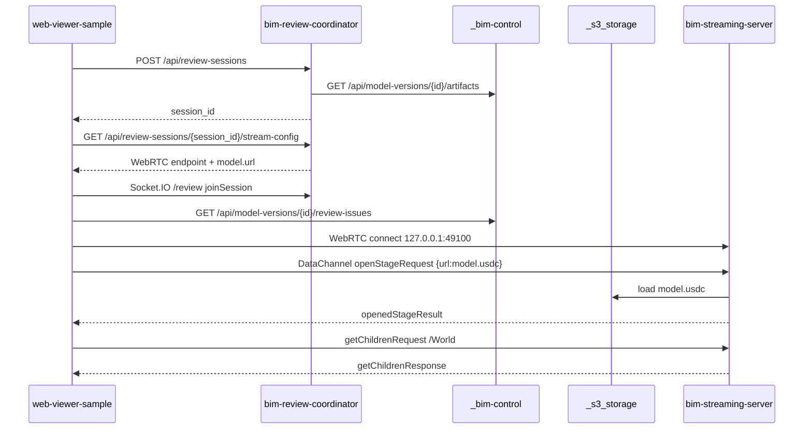
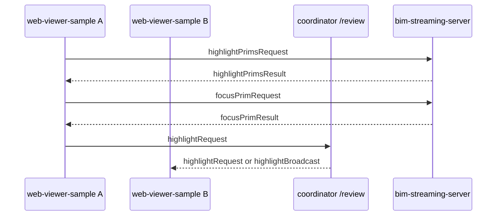
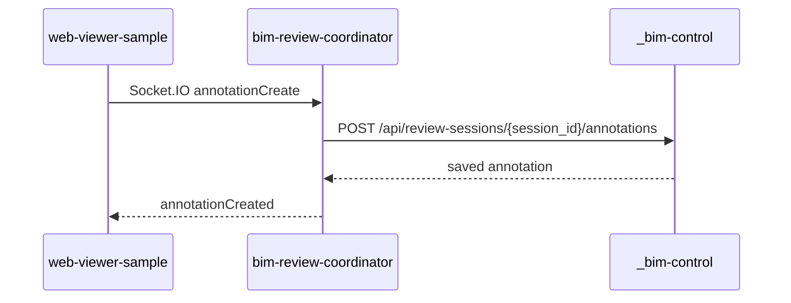

# AI-BIM-governance：BIM Review MVP 完整續作執行計畫 v0.3 - Demo UI Manual Trigger 補充版

> 給 Codex/Claude 直接執行用。
> 基準 repo：`https://github.com/monkey1sai/AI-BIM-governance.git`，以 `main` 最新進度為準。
> 本文件是 **從目前 repo 已完成內容往下補齊** 的 execution plan，不是從零重建。
> v0.3 補充重點：所有 fake API server 與 `bim-review-coordinator` 都必須提供 Demo UI，讓展示過程可以不用 curl，直接用瀏覽器手動觸發 conversion、issue、highlight、annotation、session、event 等流程。
> 主要目標：完成 `bim-review-coordinator`、`web-viewer-sample`、`bim-streaming-server` 的基礎功能與資料流，並用 `_bim-control`、`_conversion-service` / `_conversion-server`、`_s3_storage` 這類本地 FastAPI mock service 模擬正式 DB / S3 / BIM 主平台。

---

## 0. 給 Codex 的總指令

Codex 請照以下原則執行：

```txt
1. 以目前 AI-BIM-governance/main 為最新進度，不要重做已存在的服務。
2. 先 verify，再 implement。任何已存在且可通過測試的功能，只補文件、測試或小幅修正。
3. 不建立 nested .git，不建立 submodule，不把大型 BIM artifact 放進 git。
4. 所有 mock / fake infrastructure 都留在 root 底下的暫時資料夾：
   _bim-control、_s3_storage、_conversion-service 或 _conversion-server。
5. 若 workspace 有 _conversion-service，優先使用 _conversion-service。
   不要另外強制建立 _conversion-server。
6. 若使用者提到 bim-review-coordinator 重複，解讀為：
   主要開發 repo = bim-review-coordinator + web-viewer-sample + bim-streaming-server。
7. 第一階段只追求可展示閉環，不做 production JWT、正式 S3、正式 DB、Kubernetes、Nucleus Live、完整 AI 法規。
8. 所有新增 API / event / script 都要有 smoke validation。
9. 所有 JSON / Markdown / Python / TypeScript 檔案使用 UTF-8。
```

---

## 1. 目前 repo 狀態判讀

Codex 開始前先 verify 以下現況。不要假設，請實際檢查。

### 1.1 Root workspace 應存在

```txt
AI-BIM-governance/
├── _bim-control/
├── _conversion-service/
├── _s3_storage/
├── bim-review-coordinator/
├── bim-streaming-server/
├── docs/
├── scripts/
└── web-viewer-sample/
```

### 1.2 已完成或半完成的功能

根據目前 repo，以下功能大概率已存在；Codex 請先驗證，不要重複建立：

```txt
_bim-control
  - FastAPI app
  - /health
  - project / model_version / artifact seed
  - conversion result save / read
  - review issue list / create
  - annotation list / create

_conversion-service
  - FastAPI conversion API
  - /health
  - POST /api/conversions
  - GET /api/conversions/{job_id}
  - GET /api/conversions/{job_id}/result
  - calls bim-streaming-server Kit converter wrapper
  - publishes USDC / mapping result to _s3_storage
  - updates _bim-control conversion result

_s3_storage
  - FastAPI StaticFiles fake object storage
  - /health
  - /static/*

bim-review-coordinator
  - Node / TypeScript / Express / Socket.IO
  - /health
  - POST /api/review-sessions
  - GET /api/review-sessions/{session_id}
  - join / leave
  - GET stream-config
  - event log
  - GET /api/model-versions/{model_version_id}/review-bootstrap
  - Socket.IO namespace /review
  - joinSession / highlightRequest / selectionUpdate / annotationCreate / leaveSession

web-viewer-sample
  - AppStreamer local stream flow
  - review env config
  - coordinator client
  - bim-control client
  - review socket client
  - artifact panel / issue panel / presence panel / event log panel
  - issue click sends highlightPrimsRequest

bim-streaming-server
  - openStageRequest / loadingStateQuery / getChildrenRequest / selectPrimsRequest
  - StageManager likely already handles highlightPrimsRequest / clearHighlightRequest / focusPrimRequest using selection fallback
  - fallback lighting after stage load

scripts
  - dev-health-check.ps1
  - smoke-review-session.ps1
```

### 1.3 目前最可能還要補的缺口

```txt
1. 合約文件可能比程式落後，需要同步 docs/contracts/*。
2. AGENTS / docs 裡 coordinator port 可能有 8004 與 8100 不一致，要統一為 8004，除非實際 code 已改。
3. web-viewer-sample 的 stream config 仍主要依賴 stream.config.json；要讓 coordinator stream-config 可覆蓋 runtime 設定。
4. bim-streaming-server highlight 目前若只做到 selection fallback，要誠實回傳 applied_mode，並補 smoke / docs。
5. HTTP smoke 已有，但 Socket.IO smoke 與 browser-to-Kit DataChannel smoke 還需要補強。
6. conversion → artifact ready → review session → openStageRequest → issue click → highlight result 的 full local runbook 要完整。
7. _conversion-server 命名需求要處理成 alias / env，而不是複製一份 conversion service。
```

---

## 2. 本階段成功定義

本階段成功不是完成完整 BIM SaaS，而是完成第一個可驗證閉環：

```txt
IFC / USDC artifact
  → _s3_storage 存檔與 static URL
  → _bim-control 保存 artifact / issue / annotation metadata
  → _conversion-service 可產出 model.usdc + element_mapping.json
  → bim-review-coordinator 建立 review session 並回傳 stream-config
  → web-viewer-sample 依 session / stream-config 連上 Kit stream
  → web-viewer-sample 送 openStageRequest 載入 USDC
  → web-viewer-sample 顯示 issue list
  → 點 issue
  → DataChannel 發 highlightPrimsRequest / focusPrimRequest
  → bim-streaming-server 回 highlightPrimsResult / focusPrimResult
  → web-viewer-sample 同步送 Socket.IO highlightRequest
  → bim-review-coordinator 廣播給同 room 其他 client
  → annotation 可寫回 _bim-control
```

最小驗收：

```txt
[x] local fake services 全部 /health OK
[x] conversion smoke 可成功或可被 skip 且不阻塞 review smoke
[x] coordinator 可建立 session
[x] coordinator stream-config 回傳 127.0.0.1:49100
[x] web-viewer-sample 可 bootstrap review session
[x] 若 model.usdc ready，web-viewer-sample 自動或手動送 openStageRequest
[x] stage tree 可載入 /World children
[x] issue panel 可顯示 ISSUE-DEMO-001
[x] 點 issue 會送 highlightPrimsRequest
[x] Kit 回 highlightPrimsResult，缺 prim 時不 crash 並列出 missing
[x] Socket.IO highlightRequest 可廣播
[x] annotation 可保存到 _bim-control
```

---

## 3. Service 邊界與責任

### 3.1 `_bim-control`

定位：Fake BIM data authority / mock DB API。

允許做：

```txt
- 保存 project / model_version / artifact fake records
- 保存 conversion result
- 保存 review issue
- 保存 annotation
- 提供 web-viewer-sample / coordinator 查詢 API
- 第一版用 JSON file store，不用 DB
```

不應做：

```txt
- WebRTC / Omniverse rendering
- conversion job execution
- Socket.IO room management
- 真正 DB migration
```

### 3.2 `_s3_storage`

定位：Fake object storage / local static file server。

允許做：

```txt
- 存 source.ifc
- 存 model.usdc
- 存 ifc_index.json
- 存 usd_index.json
- 存 element_mapping.json
- 提供 static URL
- optional upload API
```

不應做：

```txt
- project 權限
- session state
- review issue metadata authority
```

### 3.3 `_conversion-service` / `_conversion-server`

定位：IFC / RVT / DWG → USD / USDC conversion API。

規則：

```txt
- 若 _conversion-service 已存在，使用它。
- 若文件或 env 提到 _conversion-server，不要另開重複服務；改成 alias / env 指向 _conversion-service。
- conversion service 只負責 job / converter / mapping / publish / callback，不負責 review session。
```

### 3.4 `bim-review-coordinator`

定位：Session / collaboration control plane。

允許做：

```txt
- 建立 review session
- 回傳 fixed local Kit endpoint
- 查 _bim-control artifact / issue
- 提供 stream-config
- 管 participant presence
- Socket.IO room broadcast
- 保存短期 session event log
```

不應做：

```txt
- 轉 IFC / USDC
- 操作 USD stage
- 保存長期 project / artifact / report 權威資料
```

### 3.5 `web-viewer-sample`

定位：Browser WebRTC viewer / review UI prototype。

允許做：

```txt
- 建立或加入 review session
- 讀 stream-config
- 連 AppStreamer / WebRTC
- 讀 artifacts / issues / annotations
- 送 DataChannel command
- 送 Socket.IO collaboration event
- 顯示 issue panel / artifact panel / presence / event log
```

不應做：

```txt
- 自己保存 DB
- 自己做 conversion
- 自己做正式法規 / 碳排計算
```

### 3.6 `bim-streaming-server`

定位：Omniverse Kit runtime / WebRTC streaming / USD stage / runtime overlay。

允許做：

```txt
- open USD / USDC stage
- 回覆 loading / stage tree / selection events
- 接收 highlightPrimsRequest / focusPrimRequest
- runtime selection / highlight / marker / camera focus
```

不應做：

```txt
- 管 project / user 權限
- 管 conversion job API
- 保存 business data
- 修改 source stage file；只做 session runtime overlay
```

---

## 4. Port 與 env 統一

### 4.1 Local ports

```txt
_bim-control             http://127.0.0.1:8001
_s3_storage              http://127.0.0.1:8002
_conversion-service      http://127.0.0.1:8003
bim-review-coordinator   http://127.0.0.1:8004
web-viewer-sample        http://127.0.0.1:5173
bim-streaming-server     WebRTC signaling 127.0.0.1:49100
```

### 4.2 Root `.env.example`

Codex 請確認 root `.env.example` 含以下值。若缺少則補齊。

```env
BIM_CONTROL_API_BASE=http://127.0.0.1:8001
S3_STORAGE_BASE=http://127.0.0.1:8002
S3_STORAGE_STATIC_BASE=http://127.0.0.1:8002/static
CONVERSION_API_BASE=http://127.0.0.1:8003
CONVERSION_SERVER_API_BASE=http://127.0.0.1:8003
COORDINATOR_API_BASE=http://127.0.0.1:8004
COORDINATOR_SOCKET_URL=http://127.0.0.1:8004
KIT_STREAM_SERVER=127.0.0.1
KIT_SIGNALING_PORT=49100
KIT_MEDIA_SERVER=127.0.0.1
WEB_VIEWER_URL=http://127.0.0.1:5173
DEV_AUTH_TOKEN=dev-token
```

### 4.3 Port mismatch 修正

Codex 檢查：

```powershell
Select-String -Path .\AGENTS.md,.\README.md,.\docs\**\*.md -Pattern "8100|8004" -SimpleMatch
```

規則：

```txt
- coordinator 實際 code fallback 是 8004，文件請統一為 8004。
- 若某處刻意使用 8100，要新增註解說明，不可模糊。
```

---

## 5. Data flow contract

### 5.1 Review session flow



### 5.2 Issue highlight flow



### 5.3 Annotation flow



---

## 6. API / Event contracts to enforce

### 6.1 `_bim-control` required endpoints

```http
GET  /health
GET  /api/projects
GET  /api/projects/{project_id}
GET  /api/projects/{project_id}/versions
GET  /api/model-versions/{model_version_id}
GET  /api/model-versions/{model_version_id}/artifacts
POST /api/model-versions/{model_version_id}/conversion-result
GET  /api/model-versions/{model_version_id}/conversion-result
GET  /api/model-versions/{model_version_id}/review-issues
POST /api/model-versions/{model_version_id}/review-issues
GET  /api/review-sessions/{session_id}/annotations
POST /api/review-sessions/{session_id}/annotations
```

Required artifact response shape:

```json
{
  "model_version_id": "version_demo_001",
  "items": [
    {
      "artifact_id": "artifact_usdc_demo_001",
      "project_id": "project_demo_001",
      "model_version_id": "version_demo_001",
      "artifact_type": "usdc",
      "name": "Demo BIM Model USDC",
      "url": "http://127.0.0.1:8002/static/projects/project_demo_001/versions/version_demo_001/model.usdc",
      "mapping_url": "http://127.0.0.1:8002/static/projects/project_demo_001/versions/version_demo_001/element_mapping.json",
      "status": "ready"
    }
  ],
  "artifacts": []
}
```

### 6.2 `_conversion-service` required endpoints

```http
GET  /health
POST /api/conversions
GET  /api/conversions/{job_id}
GET  /api/conversions/{job_id}/result
```

Required conversion result:

```json
{
  "job_id": "conv_001",
  "status": "succeeded",
  "project_id": "project_demo_001",
  "model_version_id": "version_demo_001",
  "source_url": "http://127.0.0.1:8002/static/projects/project_demo_001/versions/version_demo_001/source.ifc",
  "usdc_url": "http://127.0.0.1:8002/static/projects/project_demo_001/versions/version_demo_001/model.usdc",
  "mapping_url": "http://127.0.0.1:8002/static/projects/project_demo_001/versions/version_demo_001/element_mapping.json"
}
```

### 6.3 `bim-review-coordinator` HTTP endpoints

```http
GET  /health
POST /api/review-sessions
GET  /api/review-sessions/{session_id}
POST /api/review-sessions/{session_id}/join
POST /api/review-sessions/{session_id}/leave
GET  /api/review-sessions/{session_id}/stream-config
GET  /api/review-sessions/{session_id}/events
POST /api/review-sessions/{session_id}/events
GET  /api/model-versions/{model_version_id}/review-bootstrap
```

Required stream-config response:

```json
{
  "session_id": "review_session_xxx",
  "source": "local_fixed",
  "webrtc": {
    "signalingServer": "127.0.0.1",
    "signalingPort": 49100,
    "mediaServer": "127.0.0.1"
  },
  "model": {
    "status": "ready",
    "artifact_id": "artifact_usdc_demo_001",
    "url": "http://127.0.0.1:8002/static/projects/project_demo_001/versions/version_demo_001/model.usdc",
    "mapping_url": "http://127.0.0.1:8002/static/projects/project_demo_001/versions/version_demo_001/element_mapping.json"
  },
  "artifacts": []
}
```

### 6.4 Coordinator Socket.IO `/review`

Client → Server:

```txt
joinSession
leaveSession
highlightRequest
selectionUpdate
annotationCreate
cameraPoseUpdate        # optional for this phase
cursorUpdate            # optional for this phase
heartbeat               # optional for this phase
```

Server → Client:

```txt
presenceUpdated
highlightRequest or highlightBroadcast
selectionUpdate or selectionBroadcast
annotationCreated
serverWarning
```

Codex rule:

```txt
If current code broadcasts the same event name, keep it.
If docs say highlightBroadcast but code emits highlightRequest, either:
  A. update docs to match code, or
  B. emit both highlightRequest and highlightBroadcast.
Do not silently diverge.
```

### 6.5 DataChannel `web-viewer-sample` ↔ `bim-streaming-server`

Existing events that must not break:

```txt
openStageRequest
openedStageResult
loadingStateQuery
loadingStateResponse
updateProgressAmount
updateProgressActivity
getChildrenRequest
getChildrenResponse
selectPrimsRequest
stageSelectionChanged
makePrimsPickable
makePrimsPickableResponse
resetStage
resetStageResponse
```

BIM review events:

Client → Kit:

```txt
highlightPrimsRequest
clearHighlightRequest
focusPrimRequest
```

Kit → Client:

```txt
highlightPrimsResult
clearHighlightResult
focusPrimResult
```

`highlightPrimsRequest`:

```json
{
  "event_type": "highlightPrimsRequest",
  "payload": {
    "mode": "replace",
    "items": [
      {
        "prim_path": "/World/IFCSTAIR/Mesh_23",
        "ifc_guid": "2VJ3sK9L000fake001",
        "color": [1, 0, 0, 1],
        "label": "樓梯寬度不足",
        "source": "mock_compliance",
        "issue_id": "ISSUE-DEMO-001"
      }
    ],
    "focus_first": true
  }
}
```

`highlightPrimsResult` should be tolerant. Current or target shape can be:

```json
{
  "event_type": "highlightPrimsResult",
  "payload": {
    "result": "success",
    "applied_mode": "selection",
    "selected_paths": ["/World"],
    "missing_paths": []
  }
}
```

or:

```json
{
  "event_type": "highlightPrimsResult",
  "payload": {
    "ok": true,
    "highlighted": [{"prim_path": "/World", "status": "highlighted"}],
    "missing": []
  }
}
```

Codex should normalize frontend parsing to accept both shapes.

---

## 7. Phase-by-phase execution

## Phase 0：Repo audit / baseline protection

### 0.1 Clone / update

```powershell
git clone https://github.com/monkey1sai/AI-BIM-governance.git
cd AI-BIM-governance
git checkout main
git pull --ff-only
```

### 0.2 Protect user changes

```powershell
git status --short
```

Rules:

```txt
- If working tree is dirty, list files first.
- Do not overwrite user changes.
- Do not run cleanup commands that remove generated outputs unless this plan explicitly says so.
```

### 0.3 Create branch

```powershell
git checkout -b feature/review-mvp-completion-v0-2
```

If branch exists:

```powershell
git checkout feature/review-mvp-completion-v0-2
```

### 0.4 Baseline commands

```powershell
# root
Get-Content .\README.md
Get-Content .\AGENTS.md

# service health / tests, if dependencies are installed
cd _bim-control
..\.venv\Scripts\python.exe -m pytest tests
cd ..\_s3_storage
..\.venv\Scripts\python.exe -m pytest tests
cd ..\_conversion-service
..\.venv\Scripts\python.exe -m pytest tests
cd ..\bim-review-coordinator
npm install
npm run build
npm test
cd ..\web-viewer-sample
npm install
npm run build
cd ..\bim-streaming-server
.\repo.bat build
```

If `.venv` does not exist, use:

```powershell
python -m pytest tests
```

Deliverable:

```txt
docs/plans/review-mvp-v0-2-baseline.md
```

This file should record:

```txt
- commands executed
- pass/fail
- missing dependencies
- next actions
```

---

## Phase 1：Docs / contracts consolidation

Goal: make docs match current implementation.

### 1.1 Update or create contract docs

Ensure these exist and are not empty:

```txt
docs/contracts/bim-control-fake-api.md
docs/contracts/conversion-api.md
docs/contracts/review-session-api.md
docs/contracts/coordinator-socket-events.md
docs/contracts/streaming-datachannel-events.md
docs/contracts/local-dev-runbook.md
```

Each document must include:

```txt
- purpose
- service owner
- endpoints / events
- request / response examples
- local validation commands
- known limitations
```

### 1.2 Normalize coordinator port

Search and replace ambiguous port usage:

```powershell
Select-String -Path .\AGENTS.md,.\README.md,.\docs\**\*.md -Pattern "8100|8004"
```

Expected:

```txt
bim-review-coordinator = 8004
```

If AGENTS.md says 8100, change it to 8004 unless current code has been changed to 8100. Since current `bim-review-coordinator/.env.example` and code fallback use 8004, prefer 8004.

### 1.3 Add v0.2 completion plan to repo

Copy this plan into:

```txt
docs/plans/BIM_REVIEW_MVP_COMPLETION_PLAN_v0_2.md
```

Commit after Phase 1:

```txt
docs: align BIM review MVP contracts with current implementation
```

---

## Phase 2：Fake infrastructure hardening

Goal: ensure `_bim-control`, `_s3_storage`, `_conversion-service` are reliable enough for E2E review testing.

### 2.1 `_s3_storage`

Verify:

```http
GET /health
GET /static/projects/project_demo_001/versions/version_demo_001/model.usdc
```

If missing, implement or fix:

```txt
_s3_storage/app/main.py
_s3_storage/tests/test_health.py
_s3_storage/README.md
```

Expected behavior:

```txt
- /health returns {status:"ok"} or {ok:true}
- /static is mounted
- CORS allows web-viewer-sample
```

### 2.2 `_bim-control`

Verify endpoints:

```powershell
Invoke-RestMethod http://127.0.0.1:8001/health
Invoke-RestMethod http://127.0.0.1:8001/api/projects
Invoke-RestMethod http://127.0.0.1:8001/api/model-versions/version_demo_001/artifacts
Invoke-RestMethod http://127.0.0.1:8001/api/model-versions/version_demo_001/review-issues
```

If missing, implement:

```txt
- JSON file store
- seed data for project_demo_001 / version_demo_001
- artifact status = ready only when file exists
- issue fixture uses /World as safe fallback prim path
```

Codex must not claim `model.usdc` is ready if the file is absent.

### 2.3 `_conversion-service`

Verify:

```powershell
Invoke-RestMethod http://127.0.0.1:8003/health
```

Run smoke when `source.ifc` exists:

```powershell
cd _conversion-service
.\scripts\smoke_conversion.ps1 -TimeoutSeconds 1800
```

If conversion is unavailable, review MVP must still run with artifact status `missing` and seeded issue UI.

### 2.4 `_conversion-server` alias rule

If user or docs refer to `_conversion-server`, implement one of these only:

Option A, preferred:

```txt
Document that _conversion-server means _conversion-service.
Use CONVERSION_API_BASE / CONVERSION_SERVER_API_BASE to point to http://127.0.0.1:8003.
```

Option B, only if existing scripts require folder name:

```txt
Create _conversion-server/README.md explaining it is an alias and should not contain duplicate service code.
Do not copy the FastAPI implementation.
```

Commit after Phase 2:

```txt
fix(mock-services): harden fake BIM control storage and conversion integration
```

---

## Phase 3：Coordinator completion

Goal: make `bim-review-coordinator` the reliable control plane for review sessions.

### 3.1 Verify current implementation

Check files:

```txt
bim-review-coordinator/src/app.ts
bim-review-coordinator/src/config.ts
bim-review-coordinator/src/services/sessionStore.ts
bim-review-coordinator/src/services/eventLog.ts
bim-review-coordinator/src/services/bimControlClient.ts
bim-review-coordinator/src/services/kitPool.ts
bim-review-coordinator/src/socket/reviewNamespace.ts
bim-review-coordinator/src/types.ts
```

### 3.2 Required improvements

Implement missing items only:

```txt
[x] Validate request bodies using zod.
[x] Session IDs must be safe and unique.
[x] Session JSON files must be persisted under data/sessions.
[x] Event log JSONL files must be persisted under data/events.
[x] stream-config must include artifacts and model status.
[x] If _bim-control is unavailable, coordinator returns session + model.status="missing" rather than crashing.
[x] Socket joinSession must join room and broadcast presenceUpdated.
[x] Socket highlightRequest must log event and broadcast to other clients.
[x] Socket selectionUpdate must log event and broadcast to other clients.
[x] Socket annotationCreate must write to _bim-control if available; failure returns ack error but does not crash namespace.
[x] Add heartbeat event or ignore unknown events safely.
```

### 3.3 Add Socket.IO smoke test

Create:

```txt
bim-review-coordinator/tests/socket-review.test.ts
```

Test minimum:

```txt
- create session through HTTP
- connect two socket.io-client clients to /review
- client A joinSession
- client B joinSession
- presenceUpdated received
- client A highlightRequest
- client B receives highlightRequest or highlightBroadcast
```

If `socket.io-client` is not in devDependencies, add it.

### 3.4 Coordinator validation

```powershell
cd bim-review-coordinator
npm install
npm run build
npm test
npm run dev
```

Manual smoke:

```powershell
$body = @{
  project_id = "project_demo_001"
  model_version_id = "version_demo_001"
  created_by = "dev_user_001"
  mode = "single_kit_shared_state"
  options = @{ auto_allocate_kit = $true }
} | ConvertTo-Json -Depth 10

$session = Invoke-RestMethod `
  -Method Post `
  -Uri "http://127.0.0.1:8004/api/review-sessions" `
  -ContentType "application/json" `
  -Body $body

Invoke-RestMethod "http://127.0.0.1:8004/api/review-sessions/$($session.session_id)/stream-config"
```

Commit after Phase 3:

```txt
feat(coordinator): harden review sessions and socket collaboration events
```

---

## Phase 4：web-viewer-sample completion

Goal: make browser client consume review session data instead of only static sample asset data.

### 4.1 Verify current implementation

Check these files exist:

```txt
web-viewer-sample/src/config/env.ts
web-viewer-sample/src/clients/coordinatorClient.ts
web-viewer-sample/src/clients/bimControlClient.ts
web-viewer-sample/src/clients/reviewSocket.ts
web-viewer-sample/src/clients/streamMessages.ts
web-viewer-sample/src/types/artifacts.ts
web-viewer-sample/src/types/issues.ts
web-viewer-sample/src/types/review.ts
web-viewer-sample/src/components/ArtifactPanel.tsx
web-viewer-sample/src/components/IssuePanel.tsx
web-viewer-sample/src/components/PresencePanel.tsx
web-viewer-sample/src/components/EventLogPanel.tsx
web-viewer-sample/src/Window.tsx
web-viewer-sample/src/AppStream.tsx
```

### 4.2 Required behavior

Web viewer startup:

```txt
1. Read URL query:
   ?sessionId=
   ?projectId=
   ?modelVersionId=
   ?userId=
   ?displayName=
2. If sessionId exists, GET coordinator /api/review-sessions/{session_id}.
3. If sessionId missing and VITE_AUTO_CREATE_SESSION=true, POST /api/review-sessions.
4. GET stream-config.
5. Connect Socket.IO /review and join room.
6. GET review-bootstrap or _bim-control artifacts/issues.
7. Merge dynamic USDC artifacts with fallback static assets.
8. If model.status=ready, send openStageRequest when Kit is ready.
9. If model.status=missing, show clear UI: conversion not ready.
```

### 4.3 Runtime stream config override

Current `AppStream.tsx` may still use `stream.config.json` for local mode. Codex should implement runtime override without breaking GFN / stream modes.

Recommended approach:

```txt
- Add optional prop `runtimeDirectConfig` to AppStream.
- In local mode, prefer props runtimeDirectConfig over StreamConfig.local.
- In Window.tsx, store coordinator stream-config in state.
- Pass signalingServer / signalingPort / mediaServer into AppStream.
```

Pseudo interface:

```ts
interface RuntimeDirectConfig {
  signalingServer: string;
  signalingPort: number;
  mediaServer: string;
  mediaPort?: number | null;
}
```

Mapping:

```ts
const local = this.props.runtimeDirectConfig ?? {
  signalingServer: StreamConfig.local.server,
  signalingPort: StreamConfig.local.signalingPort,
  mediaServer: StreamConfig.local.server,
  mediaPort: StreamConfig.local.mediaPort,
};
```

Do not remove `stream.config.json`; keep it as fallback.

### 4.4 Issue click behavior

When user clicks issue:

```txt
[x] If issue.usd_prim_path missing, show event log warning and do not send DataChannel.
[x] Build highlightPrimsRequest.
[x] Send DataChannel message through AppStream.sendMessage.
[x] Send focusPrimRequest after or inside highlight request.
[x] Emit Socket.IO highlightRequest.
[x] Record event log.
[x] Parse highlightPrimsResult whether payload uses result/applied_mode or ok/highlighted shape.
```

Required DataChannel helper:

```ts
export function buildHighlightPrimsRequest(items: HighlightItem[], focusFirst = true): StreamMessage {
  return {
    event_type: "highlightPrimsRequest",
    payload: { mode: "replace", items, focus_first: focusFirst },
  };
}

export function buildFocusPrimRequest(primPath: string): StreamMessage {
  return {
    event_type: "focusPrimRequest",
    payload: { prim_path: primPath, select: true, frame_camera: true },
  };
}
```

### 4.5 UI requirements

At minimum show:

```txt
- review session id
- model artifact status
- selected USDC URL
- issue list
- presence list
- event log
- stream connection state
```

Do not let failed coordinator block static sample fallback. If coordinator is down:

```txt
- show "review coordinator unavailable"
- still allow static local asset list from public/api or stream.config fallback
```

### 4.6 Web viewer validation

```powershell
cd web-viewer-sample
npm install
npm run build
npm run dev -- --host 127.0.0.1
```

Manual:

```txt
1. Open http://127.0.0.1:5173
2. Confirm review session active or fallback message.
3. Confirm artifact panel visible.
4. Confirm issue panel visible.
5. If Kit stream is running, confirm AppStreamer connects.
6. If model.usdc ready, confirm openStageRequest is sent.
7. Click ISSUE-DEMO-001.
8. Confirm event log has highlight request and highlight result.
```

Commit after Phase 4:

```txt
feat(viewer): complete review session bootstrap and issue highlight flow
```

---

## Phase 5：bim-streaming-server DataChannel completion

Goal: ensure Kit side can receive review commands and never crash on missing prims.

### 5.1 Verify current implementation

Check:

```txt
bim-streaming-server/source/extensions/ezplus.bim_review_stream.messaging/ezplus/bim_review_stream/messaging/stage_management.py
bim-streaming-server/source/extensions/ezplus.bim_review_stream.messaging/ezplus/bim_review_stream/messaging/stage_loading.py
bim-streaming-server/source/extensions/ezplus.bim_review_stream.messaging/ezplus/bim_review_stream/messaging/extension.py
```

Expected current state:

```txt
- StageManager registers highlightPrimsRequest, clearHighlightRequest, focusPrimRequest.
- StageManager uses selection fallback for highlight.
- stage_loading injects fallback lights in session layer.
```

### 5.2 Required behavior

`highlightPrimsRequest`:

```txt
[x] Accept payload.items.
[x] Accept item.prim_path or item.usd_prim_path.
[x] Validate stage exists.
[x] Validate prim exists.
[x] selected_paths contains valid paths.
[x] missing_paths contains invalid paths.
[x] mode=replace clears old selection.
[x] Set selected prim paths only for valid paths.
[x] Return highlightPrimsResult.
[x] No crash if payload malformed.
```

`clearHighlightRequest`:

```txt
[x] Clear selection / current highlight state.
[x] Return clearHighlightResult.
```

`focusPrimRequest`:

```txt
[x] Select prim if exists.
[x] Try frame camera if stable API exists.
[x] If camera frame API not stable, return success with applied_mode="selection".
[x] Return error when prim missing.
```

### 5.3 Optional material highlight

Only implement if safe:

```txt
- Apply temporary material or displayColor override in session layer.
- Never write to root layer.
- Add clearHighlightRequest rollback.
- If this risks breaking Kit, keep selection fallback.
```

### 5.4 Add unit / smoke helper where possible

If Kit extension tests are available, add a test for payload normalization helper. If not, add manual validation doc:

```txt
bim-streaming-server/docs/review-datachannel-smoke.md
```

Include payload:

```json
{
  "event_type": "highlightPrimsRequest",
  "payload": {
    "mode": "replace",
    "items": [
      {"prim_path": "/World", "color": [1,0,0,1], "label": "Smoke Test"}
    ],
    "focus_first": false
  }
}
```

### 5.5 Build / launch

```powershell
cd bim-streaming-server
.\repo.bat build
.\scripts\start-streaming-server.ps1
```

or existing launch:

```powershell
.\repo.bat launch -n ezplus.bim_review_stream_streaming.kit -- --no-window
```

Commit after Phase 5:

```txt
feat(streaming): finalize BIM review DataChannel highlight commands
```

---

## Phase 6：End-to-end scripts and local runbook

Goal: one developer can start all services and run smoke validation.

### 6.1 Existing scripts to verify

```txt
scripts/dev-health-check.ps1
scripts/smoke-review-session.ps1
_conversion-service/scripts/smoke_conversion.ps1
```

### 6.2 Add `scripts/start-local-review-mvp.ps1`

This script should not hide logs or run forever without clarity. It can open separate PowerShell windows if on Windows, or print commands to run manually.

Minimum content:

```powershell
Write-Host "Start these services in separate terminals:"
Write-Host "1. cd _s3_storage; ..\.venv\Scripts\python.exe -m uvicorn app.main:app --host 127.0.0.1 --port 8002"
Write-Host "2. cd _bim-control; ..\.venv\Scripts\python.exe -m uvicorn app.main:app --host 127.0.0.1 --port 8001"
Write-Host "3. cd _conversion-service; ..\.venv\Scripts\python.exe -m uvicorn app.main:app --host 127.0.0.1 --port 8003"
Write-Host "4. cd bim-review-coordinator; npm run dev"
Write-Host "5. cd bim-streaming-server; .\scripts\start-streaming-server.ps1"
Write-Host "6. cd web-viewer-sample; npm run dev -- --host 127.0.0.1"
```

Optional: add `-LaunchTerminals` switch to start processes.

### 6.3 Add Socket.IO smoke script

Create:

```txt
scripts/smoke-review-socket.mjs
```

Behavior:

```txt
1. POST /api/review-sessions
2. connect socket client A and B to /review
3. A joinSession
4. B joinSession
5. B waits for presenceUpdated
6. A emits highlightRequest
7. B receives highlightRequest or highlightBroadcast
8. exit 0 on success
```

Package dependency location options:

```txt
- Use root package only if root already has Node setup.
- Otherwise place this test under bim-review-coordinator/tests and run npm test.
```

### 6.4 Add full manual runbook

Update:

```txt
docs/contracts/local-dev-runbook.md
```

Must include:

```txt
- prerequisites
- build bim-streaming-server
- start services in order
- optional conversion smoke
- review session smoke
- browser manual test
- DataChannel highlight manual test
- common errors and fixes
```

### 6.5 Final smoke sequence

```powershell
cd AI-BIM-governance
.\scripts\dev-health-check.ps1
.\scripts\smoke-review-session.ps1

cd bim-review-coordinator
npm run build
npm test

cd ..\web-viewer-sample
npm run build

cd ..\bim-streaming-server
.\repo.bat build
```

Commit after Phase 6:

```txt
test: add local BIM review MVP smoke scripts and runbook
```

---

## Phase 7：Conversion-to-review bridge

Goal: when conversion finishes, review flow automatically sees the new model artifact.

### 7.1 Verify conversion result callback

Run conversion smoke if source.ifc exists:

```powershell
cd _conversion-service
.\scripts\smoke_conversion.ps1 -TimeoutSeconds 1800
```

Then check:

```powershell
Invoke-RestMethod http://127.0.0.1:8001/api/model-versions/version_demo_001/conversion-result
Invoke-RestMethod http://127.0.0.1:8001/api/model-versions/version_demo_001/artifacts
```

Expected:

```txt
- conversion result exists
- artifacts include artifact_type=usdc
- usdc artifact status=ready only if model.usdc exists
- mapping_url included when element_mapping.json exists
```

### 7.2 Generate review issue from mapping fallback

Do not implement full AI. Add a helper that creates demo issues only when needed.

Option A: `_bim-control` seed already creates one issue using `/World`. This is enough for MVP.

Option B: add script:

```txt
_bim-control/scripts/seed_demo_issue_from_mapping.py
```

Behavior:

```txt
- read element_mapping.json
- pick first mapped usd_prim_path if available
- else use /World
- create ISSUE-DEMO-001
- mark source="mock_compliance"
```

Rules:

```txt
- Do not fake IFC GUID mapping.
- If no mapping, issue can still use /World for smoke, but label source="smoke_test".
```

### 7.3 Coordinator should choose latest ready USDC

If multiple USDC artifacts exist, choose:

```txt
1. status=ready
2. artifact_type=usdc
3. has url
4. newest updated_at if available
```

If current code chooses first ready USDC and tests pass, leave it unless artifacts ordering causes flakiness.

Commit after Phase 7:

```txt
feat(review): connect conversion results to review artifact bootstrap
```

---

## Phase 8：Final acceptance / regression matrix

### 8.1 Local full run order

Run in separate terminals:

```powershell
# terminal 1
cd AI-BIM-governance\_s3_storage
..\.venv\Scripts\python.exe -m uvicorn app.main:app --host 127.0.0.1 --port 8002 --reload

# terminal 2
cd AI-BIM-governance\_bim-control
..\.venv\Scripts\python.exe -m uvicorn app.main:app --host 127.0.0.1 --port 8001 --reload

# terminal 3, optional but recommended
cd AI-BIM-governance\_conversion-service
..\.venv\Scripts\python.exe -m uvicorn app.main:app --host 127.0.0.1 --port 8003 --reload

# terminal 4
cd AI-BIM-governance\bim-review-coordinator
npm run dev

# terminal 5
cd AI-BIM-governance\bim-streaming-server
.\scripts\start-streaming-server.ps1

# terminal 6
cd AI-BIM-governance\web-viewer-sample
npm run dev -- --host 127.0.0.1
```

### 8.2 Automated smoke

```powershell
cd AI-BIM-governance
.\scripts\dev-health-check.ps1
.\scripts\smoke-review-session.ps1
```

If Socket smoke exists:

```powershell
node .\scripts\smoke-review-socket.mjs
```

### 8.3 Browser smoke

Open:

```txt
http://127.0.0.1:5173
```

Expected:

```txt
[x] Review status visible
[x] Artifact panel visible
[x] Issue panel visible
[x] Presence panel visible
[x] Event log visible
[ ] WebRTC stream visible if Kit is running
[ ] model opens if USDC ready in the browser stream
[ ] clicking issue selects / highlights prim in the browser stream
[ ] event log shows highlightPrimsResult from a live browser stream
```

2026-04-30 recheck: browser currently stays at `等待串流開始`; `#remote-video.readyState=0`, `videoWidth=0`, `videoHeight=0`, `currentTime=0`, and `srcObject=false`. The browser console reaches `ws://127.0.0.1:49100/sign_in` but later reports `0xC0F22219`. Treat browser WebRTC visibility and DataChannel-in-browser acceptance as open until `readyState=4` and playback advances.

2026-04-30 follow-up: web-viewer-sample now exposes a timeout diagnostic state instead of leaving the user at an indefinite loading label. `?streamTimeoutMs=3000` is available for smoke tests, and `VITE_STREAM_START_TIMEOUT_MS` can set the default. Browser smoke confirmed the UI changes to `WebRTC 串流未建立` and displays video diagnostics when `readyState=0`, `videoWidth=0`, `videoHeight=0`, and `srcObject=false`.

2026-04-30 clean Kit restart baseline: `bim-streaming-server\scripts\start-streaming-server.ps1 -SkipAutoLoad -SkipGpuCheck` started Kit on TCP `49100`, but browser still did not receive media. Console evidence changed from the earlier timeout to `WebSocket connection to 'ws://127.0.0.1:49100/sign_in?...' failed: WebSocket is closed before the connection is established`, `Sign in request timed out`, `event local candidates: TCP: 0 MDNS: 0 IPV6: 0 IPV4: 0 UNKNOWN: 0`, and `0xC0F22213`. This keeps the root cause in WebRTC sign-in / ICE negotiation, not model loading or user operation.

### 8.4 Regression checks

```powershell
# Python fake services
cd _s3_storage
..\.venv\Scripts\python.exe -m pytest tests
cd ..\_bim-control
..\.venv\Scripts\python.exe -m pytest tests
cd ..\_conversion-service
..\.venv\Scripts\python.exe -m pytest tests

# Node services
cd ..\bim-review-coordinator
npm run build
npm test
cd ..\web-viewer-sample
npm run build

# Kit
cd ..\bim-streaming-server
.\repo.bat build
```

---

## 8. Commit plan

Use root repo commits because current workspace is a single root repo.

```txt
commit 1: docs: align BIM review MVP contracts and v0.2 execution plan
commit 2: fix(mock-services): harden fake BIM control storage and conversion aliasing
commit 3: feat(coordinator): harden session stream config and socket collaboration
commit 4: feat(viewer): complete review bootstrap and dynamic stream config
commit 5: feat(streaming): finalize review highlight DataChannel handling
commit 6: test: add local smoke scripts and runbook validation
commit 7: feat(review): connect conversion artifacts to review bootstrap
```

Before each commit:

```powershell
git status --short
git diff --stat
```

Before final commit:

```powershell
git status --short
.\scripts\dev-health-check.ps1
.\scripts\smoke-review-session.ps1
```

---

## 9. Final deliverables checklist

Codex final answer should report each item as Done / Skipped / Failed with reason.

```txt
Docs
[x] docs/plans/BIM_REVIEW_MVP_COMPLETION_PLAN_v0_2.md
[x] docs/contracts/bim-control-fake-api.md
[x] docs/contracts/conversion-api.md
[x] docs/contracts/review-session-api.md
[x] docs/contracts/coordinator-socket-events.md
[x] docs/contracts/streaming-datachannel-events.md
[x] docs/contracts/local-dev-runbook.md
[x] docs/plans/review-mvp-v0-2-baseline.md

Fake services
[x] _s3_storage /health and /static validated
[x] _bim-control artifacts / issues / annotations validated
[x] _conversion-service conversion endpoints validated or documented as optional for review MVP
[x] _conversion-server alias handled without duplicate code

Coordinator
[x] session API validated
[x] stream-config returns local Kit endpoint and model status
[x] Socket.IO /review join / presence / highlight / selection / annotation validated
[x] npm run build passes
[x] npm test passes

Web viewer
[x] review session bootstrap works
[x] dynamic artifact list works
[x] issue panel works
[x] DataChannel highlight request sent
[x] Socket highlight request sent
[x] npm run build passes

Streaming server
[x] existing openStageRequest still works
[x] loadingStateQuery still works
[x] getChildrenRequest still works
[x] selectPrimsRequest still works
[x] highlightPrimsRequest works or returns honest error
[x] focusPrimRequest works or returns honest error
[x] repo.bat build passes

Smoke
[x] dev-health-check.ps1 passes
[x] smoke-review-session.ps1 passes
[x] socket smoke passes if implemented
[ ] browser manual smoke proves live WebRTC video
```

---

## 10. Non-goals for this phase

Do not implement these yet:

```txt
- production JWT / SSO
- real database schema migration
- real S3 / MinIO / Supabase
- real AI法規判斷
- real carbon calculation
- Docker / Kubernetes Kit pool
- GPU cost scheduler
- Nucleus Live co-authoring
- formal BCF export
- full material overlay if selection fallback works for MVP
```

---

## 11. 建議補充項目，直接納入本計畫

以下是我建議直接寫入本次 scope 的補充，因為它們會降低之後整合風險：

### 11.1 Add issue result schema now

即使不做 AI，也先固定 review issue schema：

```json
{
  "issue_id": "ISSUE-DEMO-001",
  "project_id": "project_demo_001",
  "model_version_id": "version_demo_001",
  "source": "mock_compliance",
  "severity": "error",
  "status": "open",
  "title": "測試：BIM issue highlight",
  "description": "用來驗證 issue list 到 DataChannel highlightPrimsRequest 的假資料。",
  "ifc_guid": "2VJ3sK9L000fake001",
  "usd_prim_path": "/World",
  "mapping_confidence": 0.0,
  "evidence": {
    "rule": "smoke_test",
    "expected_result": "highlight request is emitted"
  },
  "created_at": "2026-04-29T10:00:00+08:00"
}
```

### 11.2 Prepare future AI service without implementing it

Add docs only:

```txt
docs/contracts/ai-rule-carbon-result-schema.md
```

Content should define only output JSON shape:

```txt
- compliance_result
- carbon_result
- sensor_overlay_result
```

Do not create `_ai-rule-carbon-service` in this phase unless explicitly needed.

### 11.3 Add model readiness UI state

Web viewer should show four states:

```txt
missing      = no model.usdc yet
converting   = conversion job exists but not succeeded
ready        = model.usdc ready; can open stage
failed       = conversion failed; show log hint
```

### 11.4 Add honest result handling

For highlight:

```txt
- selected_paths means selection fallback worked.
- missing_paths means prim was absent.
- applied_mode tells user what was actually applied.
```

Do not show "highlight applied" if only missing paths were returned.

---


---

## 12. v0.3 補充：Demo UI / Manual Trigger Console

> 本節是針對使用者追加需求新增。Codex 必須把它當成本輪開發的硬性需求，不是可選項。
> 目標：Demo 過程中不依賴 curl / PowerShell 指令。所有 fake service 與 `bim-review-coordinator` 的 API 都要能在瀏覽器 UI 中手動觸發，並且預設填入目前測試資料。

### 12.1 核心原則

```txt
1. 每個 fake API server 都要提供 /ui 或 /dev-console。
2. bim-review-coordinator 每個 HTTP API 都要有 UI button / form 可以觸發。
3. Socket.IO event 也要有 UI 可以手動 emit / observe。
4. UI 預設使用現有 demo data：
   project_demo_001
   version_demo_001
   artifact_ifc_demo_001
   artifact_usdc_demo_001
   dev_user_001
   ISSUE-DEMO-001
5. UI 必須顯示：
   - request method
   - request URL
   - request JSON body
   - response status
   - response JSON
   - error message
6. UI 不需要漂亮，但要穩、清楚、可 demo。
7. 不引入大型前端框架到 fake services。FastAPI fake services 用單檔 HTML + vanilla JS 即可。
8. web-viewer-sample 本來就是 React app，可以補 Dev Demo Panel。
9. 所有 UI 都只用於 local demo / dev，不做正式登入、不做正式權限。
10. 每個 UI endpoint 要能被 smoke test 驗證回傳 HTML。
```

### 12.2 UI endpoint 統一規格

所有本地服務都採用：

```http
GET /ui
```

可選別名：

```http
GET /dev-console
```

如果 service 已經有首頁 `/`，不要破壞原有首頁；新增 `/ui` 即可。

每個 UI 頁面至少包含：

```txt
- Service name
- Base URL
- Health check button
- Default demo IDs block
- API action panels
- Request preview
- Response viewer
- Reset / seed demo data button if applicable
- Link to related services
```

建議共同樣式：

```txt
- 單檔 HTML
- 左側 action list，右側 response JSON
- <textarea> 可編輯 JSON body
- 每個按鈕旁標示 API method + path
- response 用 <pre> 顯示格式化 JSON
```

### 12.3 `_bim-control` Demo UI

定位：fake BIM data authority 的手動操作台。

新增或補齊：

```txt
_bim-control/app/ui.py               # 若目前 main.py 太大，可拆出去
_bim-control/app/main.py             # mount /ui
_bim-control/tests/test_ui.py
_bim-control/README.md               # 加 Demo UI 操作說明
```

`GET /ui` 必須提供以下手動操作。

#### A. Health / seed

```txt
[Button] GET /health
[Button] POST /api/dev/reset-seed              # 若尚無此 API，新增 dev-only API
[Button] GET /api/dev/demo-state               # 顯示目前 JSON store 狀態，可選
```

如果不想新增 reset API，至少 UI 要能顯示 seed data 目前狀態。

#### B. Project / model version

```txt
[Button] GET /api/projects
[Input]  project_id = project_demo_001
[Button] GET /api/projects/{project_id}
[Button] GET /api/projects/{project_id}/versions

[Input]  model_version_id = version_demo_001
[Button] GET /api/model-versions/{model_version_id}
[Button] GET /api/model-versions/{model_version_id}/artifacts
```

#### C. Conversion result

```txt
[Button] GET /api/model-versions/{model_version_id}/conversion-result
[Form]   usdc_url / mapping_url / status
[Button] POST /api/model-versions/{model_version_id}/conversion-result
```

預設 body：

```json
{
  "job_id": "conv_demo_001",
  "status": "succeeded",
  "project_id": "project_demo_001",
  "model_version_id": "version_demo_001",
  "source_url": "http://127.0.0.1:8002/static/projects/project_demo_001/versions/version_demo_001/source.ifc",
  "usdc_url": "http://127.0.0.1:8002/static/projects/project_demo_001/versions/version_demo_001/model.usdc",
  "mapping_url": "http://127.0.0.1:8002/static/projects/project_demo_001/versions/version_demo_001/element_mapping.json"
}
```

#### D. Review issues

```txt
[Button] GET /api/model-versions/{model_version_id}/review-issues
[Button] POST /api/model-versions/{model_version_id}/review-issues
[Button] POST /api/dev/demo-issues/compliance
[Button] POST /api/dev/demo-issues/carbon
[Button] POST /api/dev/demo-issues/iaq-hvac
```

`POST /api/dev/demo-issues/compliance` 可選；若新增，必須標示為 dev-only。它會建立或覆蓋一組 demo issue，用於展示點擊 issue 後 3D highlight。

預設 compliance issue：

```json
{
  "issue_id": "ISSUE-DEMO-001",
  "title": "Demo：樓梯寬度不足",
  "severity": "error",
  "source": "mock_compliance",
  "ifc_guid": "2VJ3sK9L000fake001",
  "usd_prim_path": "/World",
  "message": "展示用假資料：此問題用來驗證 issue panel → highlightPrimsRequest → Kit selection fallback。",
  "evidence": {
    "required_width_mm": 1200,
    "actual_width_mm": 980
  }
}
```

注意：`usd_prim_path` 預設用 `/World`，確保即使真實模型 prim path 不存在，demo 仍能測試 Kit 端 selection fallback。若 mapping 有真實 prim path，UI 允許手動改成真實路徑。

#### E. Annotations

```txt
[Input]  session_id = review_session_demo_001
[Button] GET /api/review-sessions/{session_id}/annotations
[Button] POST /api/review-sessions/{session_id}/annotations
```

預設 annotation body：

```json
{
  "annotation_id": "ann_demo_001",
  "session_id": "review_session_demo_001",
  "author_id": "dev_user_001",
  "author_name": "Demo User",
  "text": "Demo annotation from _bim-control UI",
  "target": {
    "usd_prim_path": "/World",
    "ifc_guid": "2VJ3sK9L000fake001"
  }
}
```

#### `_bim-control` 驗收

```txt
[x] GET http://127.0.0.1:8001/ui 回 HTML
[x] UI 可按 health
[x] UI 可讀 projects / model version / artifacts
[x] UI 可建立 demo issue
[x] UI 可讀取 issue list
[x] UI 可寫入 conversion result
[x] UI 可建立 annotation
[x] pytest tests/test_ui.py 通過
```

---

### 12.4 `_conversion-service` Demo UI

定位：轉檔 job 手動操作台。Demo 時可以直接按按鈕建立 conversion job、poll 狀態、查看 result。

新增或補齊：

```txt
_conversion-service/app/ui.py
_conversion-service/app/main.py
_conversion-service/tests/test_ui.py
_conversion-service/README.md
```

`GET /ui` 必須提供以下手動操作。

#### A. Health

```txt
[Button] GET /health
```

#### B. Create conversion job

表單預設值：

```txt
project_id          project_demo_001
model_version_id    version_demo_001
source_artifact_id  artifact_ifc_demo_001
source_url          http://127.0.0.1:8002/static/projects/project_demo_001/versions/version_demo_001/source.ifc
target_format       usdc
force               true
generate_mapping    true
allow_fake_mapping  false
```

按鈕：

```txt
[Button] POST /api/conversions
```

預設 body：

```json
{
  "project_id": "project_demo_001",
  "model_version_id": "version_demo_001",
  "source_artifact_id": "artifact_ifc_demo_001",
  "source_url": "http://127.0.0.1:8002/static/projects/project_demo_001/versions/version_demo_001/source.ifc",
  "target_format": "usdc",
  "options": {
    "force": true,
    "generate_mapping": true,
    "allow_fake_mapping": false
  }
}
```

#### C. Job polling

```txt
[Input]  job_id
[Button] GET /api/conversions/{job_id}
[Button] GET /api/conversions/{job_id}/result
[Button] Poll every 2s until terminal status
[Button] Stop polling
```

UI 顯示：

```txt
- status
- stage
- created_at
- updated_at
- warnings
- error
- log_path if any
- usdc_url
- mapping_url
```

#### D. Demo shortcuts

```txt
[Button] Use latest job_id
[Button] Copy usdc_url
[Button] Copy mapping_url
[Button] Open usdc_url in new tab
[Button] Open mapping_url in new tab
[Button] Open _bim-control UI
[Button] Open coordinator UI
```

#### E. Optional mock conversion

如果本機沒有 Omniverse Kit converter 或沒有 sample IFC，UI 不能直接壞掉。Codex 可新增 dev-only endpoint：

```http
POST /api/dev/mock-conversion-result
```

用途：建立一筆 succeeded 的 fake conversion result，讓 review demo 能繼續往下走。

限制：

```txt
- 必須清楚標示 dev-only
- 不可偽裝成真轉檔
- result 裡要有 "mock": true
- README 要說明這只是 demo fallback
```

#### `_conversion-service` 驗收

```txt
[x] GET http://127.0.0.1:8003/ui 回 HTML
[x] UI 可建立 conversion job
[x] UI 可查 job status
[x] UI 可查 job result
[x] conversion failed 時 UI 顯示 error，不白屏
[x] 沒有 converter 時可用 dev mock result 繼續 demo
[x] pytest tests/test_ui.py 通過
```

---

### 12.5 `_s3_storage` Demo UI

定位：fake object storage 檢查台。Demo 時確認檔案是否存在、URL 是否可開啟。

新增或補齊：

```txt
_s3_storage/app/ui.py
_s3_storage/app/main.py
_s3_storage/tests/test_ui.py
_s3_storage/README.md
```

`GET /ui` 必須提供以下手動操作。

#### A. Health

```txt
[Button] GET /health
```

#### B. Static file browser

新增 dev API，或在 UI 內由後端掃描 static folder 後渲染：

```http
GET /api/dev/files
```

回傳：

```json
{
  "root": "static",
  "items": [
    {
      "path": "projects/project_demo_001/versions/version_demo_001/model.usdc",
      "url": "http://127.0.0.1:8002/static/projects/project_demo_001/versions/version_demo_001/model.usdc",
      "size_bytes": 12345,
      "exists": true
    }
  ]
}
```

UI 功能：

```txt
[Button] GET /api/dev/files
[Button] Open source.ifc
[Button] Open model.usdc
[Button] Open ifc_index.json
[Button] Open usd_index.json
[Button] Open element_mapping.json
[Button] Refresh file list
```

#### C. Optional upload / seed

如果 `_s3_storage` 已有 upload API，UI 可提供：

```txt
[File input] upload file
[Input] target path
[Button] POST upload
```

如果沒有 upload API，不強制新增；但必須提供：

```txt
[Button] Check demo artifact files
```

它會檢查以下檔案：

```txt
/static/projects/project_demo_001/versions/version_demo_001/source.ifc
/static/projects/project_demo_001/versions/version_demo_001/model.usdc
/static/projects/project_demo_001/versions/version_demo_001/element_mapping.json
```

#### `_s3_storage` 驗收

```txt
[x] GET http://127.0.0.1:8002/ui 回 HTML
[x] UI 可按 health
[x] UI 可列出 static files
[x] UI 可開啟 demo model.usdc URL 或清楚顯示 missing
[x] pytest tests/test_ui.py 通過
```

---

### 12.6 `bim-review-coordinator` Dev Console

定位：review session / collaboration control plane 的主要手動操作台。這是本輪最重要的 UI。Codex 必須讓 coordinator **每個 HTTP API 都能被 UI 手動觸發**。

新增或補齊：

```txt
bim-review-coordinator/src/routes/devConsole.ts
bim-review-coordinator/src/public/dev-console.html
bim-review-coordinator/src/public/dev-console.js
bim-review-coordinator/tests/dev-console.test.ts
bim-review-coordinator/README.md
```

若現有 Express 已有 static middleware，可直接 mount：

```txt
GET /ui
GET /dev-console
```

#### A. Default demo data

UI 預設欄位：

```txt
project_id          project_demo_001
model_version_id    version_demo_001
created_by          dev_user_001
display_name        Demo User
mode                single_kit_shared_state
session_id          empty until created
kit_server          127.0.0.1
kit_signaling_port  49100
```

#### B. Health

```txt
[Button] GET /health
```

#### C. Review session APIs — 每個都要有 UI

```txt
[Button] POST /api/review-sessions
[Input]  session_id
[Button] GET /api/review-sessions/{session_id}
[Button] POST /api/review-sessions/{session_id}/join
[Button] POST /api/review-sessions/{session_id}/leave
[Button] GET /api/review-sessions/{session_id}/stream-config
[Button] GET /api/review-sessions/{session_id}/events
[Button] POST /api/review-sessions/{session_id}/events
[Input]  model_version_id
[Button] GET /api/model-versions/{model_version_id}/review-bootstrap
```

預設 create session body：

```json
{
  "project_id": "project_demo_001",
  "model_version_id": "version_demo_001",
  "created_by": "dev_user_001",
  "mode": "single_kit_shared_state",
  "options": {
    "auto_allocate_kit": true
  }
}
```

預設 join body：

```json
{
  "user_id": "dev_user_001",
  "display_name": "Demo User"
}
```

預設 event body：

```json
{
  "event_type": "manualDemoEvent",
  "actor_id": "dev_user_001",
  "payload": {
    "message": "Triggered from coordinator dev console"
  }
}
```

#### D. Socket.IO `/review` console

同一個 UI 必須支援 Socket.IO 手動測試。

功能：

```txt
[Button] Connect Socket.IO /review
[Button] Disconnect
[Button] joinSession
[Button] leaveSession
[Button] highlightRequest
[Button] selectionUpdate
[Button] annotationCreate
[Button] heartbeat
[Panel] Incoming events log
[Panel] Connected / disconnected state
```

預設 `highlightRequest` payload：

```json
{
  "session_id": "review_session_demo_001",
  "actor_id": "dev_user_001",
  "items": [
    {
      "prim_path": "/World",
      "ifc_guid": "2VJ3sK9L000fake001",
      "color": [1, 0, 0, 1],
      "label": "Demo：樓梯寬度不足",
      "source": "coordinator_dev_console",
      "issue_id": "ISSUE-DEMO-001"
    }
  ]
}
```

預設 `selectionUpdate` payload：

```json
{
  "session_id": "review_session_demo_001",
  "actor_id": "dev_user_001",
  "selected_paths": ["/World"]
}
```

預設 `annotationCreate` payload：

```json
{
  "session_id": "review_session_demo_001",
  "actor_id": "dev_user_001",
  "text": "Demo annotation from coordinator UI",
  "target": {
    "usd_prim_path": "/World",
    "ifc_guid": "2VJ3sK9L000fake001"
  }
}
```

#### E. Cross-service shortcuts

Coordinator UI 要提供一鍵開啟：

```txt
[Link] _bim-control UI       http://127.0.0.1:8001/ui
[Link] _s3_storage UI        http://127.0.0.1:8002/ui
[Link] _conversion-service UI http://127.0.0.1:8003/ui
[Link] web-viewer-sample     http://127.0.0.1:5173
```

並提供一個根據目前 session 產生 viewer URL 的按鈕：

```txt
[Button] Open viewer with current session
```

產生 URL：

```txt
http://127.0.0.1:5173/?sessionId={session_id}&projectId=project_demo_001&modelVersionId=version_demo_001&userId=dev_user_001&displayName=Demo%20User
```

#### F. Coordinator UI 驗收

```txt
[x] GET http://127.0.0.1:8004/ui 回 HTML
[x] UI 可按 health
[x] UI 可 create session
[x] create session 後自動填入 session_id
[x] UI 可 get session
[x] UI 可 join / leave
[x] UI 可 get stream-config
[x] UI 可 get / post events
[x] UI 可 get review-bootstrap
[x] UI 可連 Socket.IO /review
[x] UI 可 emit joinSession
[x] UI 可 emit highlightRequest
[x] 第二個 browser 視窗可收到 broadcast
[x] npm test 包含 dev-console route 測試
```

---

### 12.7 `web-viewer-sample` Demo Panel 跟進

定位：真正給客戶看的 browser viewer，但也要加一個 dev/demo panel 方便手動觸發 Kit DataChannel。

新增或補齊：

```txt
web-viewer-sample/src/components/DemoControlPanel.tsx
web-viewer-sample/src/clients/demoDefaults.ts
web-viewer-sample/src/clients/streamMessages.ts
web-viewer-sample/src/types/demo.ts
```

UI 功能：

```txt
[Button] Create / load review session
[Button] Load review-bootstrap
[Button] Connect / reconnect Socket.IO
[Button] Send openStageRequest
[Button] Send loadingStateQuery
[Button] Send getChildrenRequest /World
[Button] Send highlightPrimsRequest /World
[Button] Send focusPrimRequest /World
[Button] Send clearHighlightRequest
[Button] Emit coordinator highlightRequest
[Button] Create annotation
[Panel] Latest stream-config
[Panel] DataChannel outgoing messages
[Panel] DataChannel incoming messages
[Panel] Socket.IO incoming events
```

規則：

```txt
- Demo panel 可用 env 控制顯示：VITE_SHOW_DEMO_PANEL=true
- 預設開啟，因為本階段是 local demo。
- 不可破壞現有 AppStreamer flow。
- 如果 coordinator down，Demo panel 要顯示錯誤，但 viewer 不白屏。
```

#### web viewer 驗收

```txt
[x] npm run build 通過
[x] Demo panel 可顯示 session id / model status
[x] 可手動送 openStageRequest
[x] 可手動送 highlightPrimsRequest
[x] 可手動送 clearHighlightRequest
[x] 可手動 emit coordinator highlightRequest
[x] Kit / coordinator 任一方未啟動時，UI 顯示清楚錯誤
[x] WebRTC media stream 未建立時，UI 會顯示 timeout 診斷，不再無限停在等待狀態
```

---

### 12.8 `bim-streaming-server` 跟進

`bim-streaming-server` 本身是 Omniverse Kit runtime，不需要另做 HTTP UI。它的手動觸發入口由 `web-viewer-sample` Demo Panel 承擔。

Codex 需要補的是：

```txt
1. docs/contracts/streaming-datachannel-events.md 要新增 Demo Panel 使用範例。
2. bim-streaming-server/docs/review-datachannel-smoke.md 要列出可從 web-viewer-sample Demo Panel 送出的事件。
3. highlightPrimsRequest / focusPrimRequest / clearHighlightRequest 必須回傳清楚 result。
4. 若 event payload 錯誤，不可 crash，要回傳 error result。
```

手動測試事件：

```json
{
  "event_type": "highlightPrimsRequest",
  "payload": {
    "mode": "replace",
    "items": [
      {
        "prim_path": "/World",
        "color": [1, 0, 0, 1],
        "label": "Demo highlight from Web Viewer Demo Panel",
        "source": "web_viewer_demo_panel",
        "issue_id": "ISSUE-DEMO-001"
      }
    ],
    "focus_first": true
  }
}
```

驗收：

```txt
[x] web-viewer-sample Demo Panel 可送 highlightPrimsRequest
[x] Kit 回 highlightPrimsResult
[x] 缺 prim 時回 missing_paths，不 crash
[x] /World 可被 selection fallback 選取
```

---

### 12.9 Local Demo Launcher 補強

更新或新增：

```txt
scripts/start-local-review-mvp.ps1
scripts/open-demo-consoles.ps1
scripts/demo-health-check.ps1
```

`open-demo-consoles.ps1` 用途：啟動瀏覽器打開所有 UI。

```powershell
Start-Process "http://127.0.0.1:8001/ui"
Start-Process "http://127.0.0.1:8002/ui"
Start-Process "http://127.0.0.1:8003/ui"
Start-Process "http://127.0.0.1:8004/ui"
Start-Process "http://127.0.0.1:5173/?projectId=project_demo_001&modelVersionId=version_demo_001&userId=dev_user_001&displayName=Demo%20User"
```

`demo-health-check.ps1` 必須檢查：

```txt
http://127.0.0.1:8001/health
http://127.0.0.1:8001/ui
http://127.0.0.1:8002/health
http://127.0.0.1:8002/ui
http://127.0.0.1:8003/health
http://127.0.0.1:8003/ui
http://127.0.0.1:8004/health
http://127.0.0.1:8004/ui
http://127.0.0.1:5173
```

---

### 12.10 Demo UI 開發 Phase 插入順序

Codex 請將 Demo UI 工作插入原本 Phase 2～Phase 4 之間。

建議 commit 切分：

```txt
commit A:
feat(mock-ui): add demo consoles for fake BIM control storage and conversion services

commit B:
feat(coordinator): add dev console for review session APIs and socket events

commit C:
feat(viewer): add demo control panel for stream and coordinator commands

commit D:
docs(demo): add manual trigger runbook and demo acceptance checklist
```

執行順序：

```txt
[x] 1. 先補 _bim-control /ui
[x] 2. 補 _s3_storage /ui
[x] 3. 補 _conversion-service /ui
[x] 4. 補 bim-review-coordinator /ui，且每個 API 都要可觸發
[x] 5. 補 coordinator Socket.IO console
[x] 6. 補 web-viewer-sample DemoControlPanel
[x] 7. 補 demo scripts
[x] 8. 補 docs/contracts/local-dev-runbook.md 的 Demo UI 流程
[x] 9. 跑 tests / build
[x] 10. 手動打開五個 UI 做完整 demo
```

---

### 12.11 Demo 操作劇本

Demo 時照這條路徑操作：

```txt
1. 開 _s3_storage UI
   - health
   - check demo artifact files

2. 開 _bim-control UI
   - health
   - reset seed
   - create demo compliance issue
   - confirm artifact / issue list

3. 開 _conversion-service UI
   - health
   - optional: create conversion job
   - poll job result
   - copy usdc_url

4. 開 coordinator UI
   - health
   - create review session
   - get stream-config
   - connect Socket.IO
   - joinSession
   - open viewer with current session

5. 開 web-viewer-sample
   - connect Kit stream
   - load review-bootstrap
   - send openStageRequest
   - click ISSUE-DEMO-001 or send highlightPrimsRequest /World
   - confirm Kit response

6. 回 coordinator UI
   - emit highlightRequest
   - open second viewer window
   - confirm broadcast visible

7. 建立 annotation
   - from viewer or coordinator UI
   - confirm _bim-control UI can read annotation
```

通過定義：

```txt
[x] 不用 curl 也能完成 demo
[x] fake services API 都能被 UI 手動觸發
[x] coordinator 每個 HTTP API 都有 UI trigger
[x] Socket.IO event 可在 UI 裡手動 emit
[x] viewer 能手動送 Kit DataChannel command
[x] issue → highlight → annotation 的展示閉環成立
```

---

### 12.12 UI 不足時的保守 fallback

如果時間不足，Codex 不要把 UI 做一半做壞。請採以下 fallback：

```txt
Priority 1: bim-review-coordinator /ui 必做
Priority 2: web-viewer-sample DemoControlPanel 必做
Priority 3: _bim-control /ui 必做
Priority 4: _conversion-service /ui 建議做
Priority 5: _s3_storage /ui 可最簡，但至少 health + file list
```

最低可接受 UI：

```txt
- 單頁 HTML
- 每個 endpoint 一個 button
- textarea 可改 JSON
- response pre 顯示結果
```

不可接受：

```txt
- 只有 Swagger UI，沒有預設 demo data
- 只有 README 指令，沒有瀏覽器可點 UI
- coordinator API 少了某些按鈕
- Socket.IO 無法手動 emit
- UI 發錯 request 但不顯示錯誤
```

## 12. 最終判斷

本 repo 現在已經過了「建 skeleton」階段。下一步不是再規劃一次，而是把現有 v0.1 成果收斂成一條穩定 demo path：

```txt
health check
  → conversion smoke optional
  → session smoke
  → browser connects stream
  → USDC openStage
  → issue click
  → Kit selection / highlight
  → coordinator broadcast
  → annotation save
```

只要這條路穩，後面接真正 `bim-control`、正式 object storage、AI 法規 / 碳排服務、GPU pool 都會清楚很多。現在最重要的是：**不要再擴散功能，先把 MVP 閉環打磨到可反覆 demo。**

---

## 13. 2026-04-30 驗收執行紀錄

分支：

```txt
feat/bim-review-demo-ui-validation
```

已重啟並驗證的本地服務：

```txt
_bim-control             http://127.0.0.1:8001
_s3_storage              http://127.0.0.1:8002
_conversion-service      http://127.0.0.1:8003
bim-review-coordinator   http://127.0.0.1:8004
web-viewer-sample        http://127.0.0.1:5173
bim-streaming-server     WebRTC signaling 127.0.0.1:49100
```

瀏覽器 UI 驗收證據：

```txt
output/playwright/bim-control-ui-actions.png
output/playwright/storage-ui-actions.png
output/playwright/conversion-ui-actions.png
output/playwright/coordinator-ui-actions.png
output/playwright/coordinator-two-browser-broadcast.png
output/playwright/web-viewer-final-loop.png
output/playwright/web-viewer-final-loop-current.png
```

Web Viewer DataChannel 前次紀錄（需重新驗證）：

> 2026-04-30 user recheck found the browser stuck at `等待串流開始`; therefore these DataChannel results are not accepted as current browser E2E evidence until the video element reaches `readyState=4` and playback advances.

```txt
openStageRequest      -> openedStageResult success
loadingStateQuery     -> loadingStateResponse idle
getChildrenRequest    -> getChildrenResponse
highlightPrimsRequest -> highlightPrimsResult success
focusPrimRequest      -> focusPrimResult success
clearHighlightRequest -> clearHighlightResult success
```

`/World` fallback 實測結果：

```json
{
  "result": "success",
  "applied_mode": "selection",
  "selected_paths": ["/model"],
  "missing_paths": [],
  "fallback_paths": [
    {
      "requested_path": "/World",
      "selected_path": "/model",
      "reason": "stage_root_fallback"
    }
  ]
}
```

多人併發驗收：

```txt
coordinator UI 開兩個 browser tab，dev_user_001 / dev_user_002 加入同一 session。
第一個 browser emit highlightRequest，第二個 browser 收到 highlightRequest broadcast。
presenceUpdated 顯示兩個 participants。
smoke-review-socket.ps1 覆蓋 join / presence / highlight / selection / annotation / heartbeat。
```

2026-04-30 WebRTC blocker recheck:

```txt
URL: http://127.0.0.1:5173
Kit process: running, TCP 49100 listening
Coordinator/model state: ready
Browser text: 等待串流開始
Video state: readyState=0, videoWidth=0, videoHeight=0, currentTime=0, srcObject=false
Browser console: signaling reaches ws://127.0.0.1:49100/sign_in, then reports 0xC0F22219 after timeout/retry
Conclusion: not a user operation error; browser WebRTC negotiation/video attach remains a blocker.
```

回歸驗證命令：

```powershell
.\scripts\demo-health-check.ps1
.\scripts\dev-health-check.ps1
.\scripts\smoke-review-session.ps1
.\scripts\smoke-review-socket.ps1
cd _bim-control; ..\.venv\Scripts\python.exe -m pytest tests
cd ..\_s3_storage; ..\.venv\Scripts\python.exe -m pytest tests
cd ..\_conversion-service; ..\.venv\Scripts\python.exe -m pytest tests
cd ..\bim-review-coordinator; npm test; npm run build
cd ..\web-viewer-sample; npm run build
cd ..\bim-streaming-server; .\repo.bat test; .\repo.bat build
```
