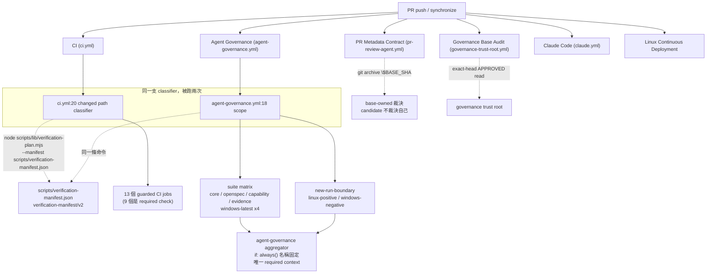

# Agent Hooks / CI / Review Convergence 重設計 — 現況重建與計畫（PLAN_ONLY）

> **狀態：PLAN_ONLY。本文件產出時未修改任何 workflow、script、governance rule 或 branch protection。**
> 重建基準：worktree `C:\Repos\active\iot\AI-BIM-governance\.claude\worktrees\agent-hooks-ci-redesign-0b0fc2`，
> `HEAD == origin/main == 0b7ca1dd65ec6033439d8b8ac1ec9b19c685a2ed`，`git status --porcelain` 為空。
> 方法：10 個唯讀重建 agent + 5 個對抗性 refutation agent + 4 個設計 agent + 1 個 base-sync 專項 agent，
> 加上 coordinator 親自執行的 GitHub read-only 量測（500 workflow runs、32 runs 的 job 級資料、live branch protection）。

---

## 1. 結論摘要 — 先講 Stop Conditions

### 1.1 五項 Stop Condition 全部觸發

任務書 §P 要求：**若現行 repo 已具備等價功能，停止修改並回報。** 五個對抗性驗證全部回報 `stop_condition_triggered = true`。

| # | 受測主張 | 判定 | 依據 |
|---|---|---|---|
| P-1 | repo 沒有 canonical changed-path → required-checks classifier，需新建（交付物 #2） | **ALREADY_EXISTS_FULLY** | `scripts/verification-manifest.json`（`verification-manifest/v2`）+ `scripts/lib/verification-plan.mjs`；`ci.yml:107` 與 `agent-governance.yml:76` 呼叫**同一支**，非兩套 |
| P-2 | repo 沒有可在開 PR 前跑 CI 等價檢查的 local preflight（交付物 #3/#4/#5/#6） | **EXISTS_PARTIALLY** | `scripts/dev/check-pr-local-preflight.ps1`（210 行）+ `scripts/verify-all.ps1` / `.sh` + `verification-runner.mjs` 已存在 |
| P-3 | repo 沒有 disposition、finding registry、bounded retry、convergence state machine（交付物 #7/#8/#9/#10） | **EXISTS_PARTIALLY** | `REVIEW_DISPOSITIONS` **逐字相同**、bounded retry **已硬釘死** |
| P-4 | 把 GitHub Actions 改成 conditional job fan-out 是安全的 | **ALREADY_EXISTS_FULLY（且原提案會鎖死 PR）** | `ci.yml` 早已是 conditional fan-out；而「不建立 job」會讓 required check 永久 pending |
| P-5 | 本次改動可用 candidate HEAD 自我驗證 | **EXISTS_PARTIALLY（如字面所述為 false）** | base-owned trust root 已存在；`pr-review-agent.yml:86` 用 `$BASE_SHA` 裁決 |

### 1.2 十四項交付物逐項判定

| # | 交付物 | 判定 | 既有正本 / 殘餘缺口 |
|---|---|---|---|
| 1 | 本重設計文件 | **NEW** | 即本檔 |
| 2 | machine-readable changed-scope / risk classifier | **已存在** | `scripts/verification-manifest.json` + `scripts/lib/verification-plan.mjs`。缺 6 個衍生維度（見 §6） |
| 3 | `scripts/preflight.ps1` | **禁止新建** | 會成為第 4 套 changed-path router。應擴充 `verify-all.ps1` |
| 4 | Linux 對應版 | **禁止新建** | `scripts/verify-all.sh` 已是 canonical cross-platform adapter |
| 5 | 薄 hook installer | **HELD — 與既有落地決策衝突** | `scripts/dev/install-git-hooks.ps1:12` 硬性 `exit 2`；`.claude/settings.json` `disableAllHooks:true` |
| 6 | pre-commit / pre-push thin wrappers | **HELD — 會弄壞 merge 路徑** | `trusted-host-merge-executor.mjs:405-409` 見到 `core.hooksPath` 非空即 `local_git_hooks_forbidden` 擋 merge |
| 7 | review finding disposition schema | **已存在（逐字相同）** | `autonomous-delivery-finalization.mjs:1027` |
| 8 | PR Convergence Agent state machine | **部分新增** | 8 個 state 名稱不存在；但底下兩台 machine 已存在。應寫成薄層 |
| 9 | finding registry | **部分新增** | `FINDING_KEYS`(14) 已 `exactKeys` 鎖死，不可加欄位；需獨立 join record |
| 10 | bounded retry enforcement | **已存在且硬釘死** | `max_attempts === 2`，三處獨立 equality 檢查 |
| 11 | Actions scope-first conditional fan-out | **已存在** | 真正缺的是 `ci.yml` 的 name-stable aggregator |
| 12 | legacy CI parity tests | **NEW（有價值）** | repo 無任何 local↔CI parity 測試 |
| 13 | performance baseline / before-after | **NEW（本文件已先做，見 §3）** | |
| 14 | OpenSpec change | **HELD — Lean policy 下可能被禁止** | `self-referential-bootstrap.ps1:373-379,451-453`；`bootstrap = yes` 在 Lean base 會 throw |

### 1.3 一句話結論

> **原提案的 14 項交付物中，只有 4 項是真正該建的新東西**（#1 文件、#12 parity 測試、#13 baseline、以及 §9 新增的 base-sync 政策）。
> **其餘不是已經存在，就是新建會主動破壞既有的 fail-closed 機制。**
> 真正的效能問題不在「classifier 不存在」，而在**兩個非常具體的浪費點**（§4），修掉它們不需要動 branch protection。

---

## 2. 現況架構

### 2.1 一次 PR push 實際發生什麼



### 2.2 既有核心機制（皆為 VERIFIED）

| 機制 | 正本 | 說明 |
|---|---|---|
| 唯一 routing table | `scripts/verification-manifest.json` | `verification-manifest/v2`；79 個 `full_dispatch_globs`、14 個 `path_classes`、29 個 gates、15 個 targets |
| 唯一 classifier | `scripts/lib/verification-plan.mjs` | 輸出 `verification-plan/v2`，含 `changed_paths` / `unknown_paths` / `base` / `subject` / `dispatch` / per-target `{required, reason}` |
| local gate executor | `scripts/lib/verification-runner.mjs` | `spawnSync shell:false`（:228）、cwd-escape 與 symlink 拒絕（:71-83） |
| 封閉命令白名單 | `scripts/lib/verification-command-policy.mjs` | 僅 `{docker, npm, npx, pwsh, python}`，spawn 前再檢一次 |
| commit-bound 本地結果 | `scripts/lib/verification-outcome.mjs` | `verification-outcome/v1`，要求 `HEAD == subject` 且工作樹乾淨 |
| local PR preflight | `scripts/dev/check-pr-local-preflight.ps1` | 已硬綁 PR headRefOid，不符即 throw（:49-52） |
| disposition 詞彙 | `scripts/lib/autonomous-delivery-finalization.mjs:1027` | `['ACCEPTED','FIX_REQUIRED','FALSE_POSITIVE','DEFERRED','ESCALATE']`，`Object.freeze` |
| bounded review loop | `scripts/lib/risk-proportional-review.mjs:1092-1164` | `max_attempts === 2`；`attempt_budget_exhausted` → held |
| exact-head 身分綁定 | 同上 `:1141-1147` | 身分 tuple 變動 → `exact_identity_changed_restart_cycle` |
| 6 維風險模型 | 同上 `:706-761` | `detectability / horizon / consequence / topology / evidence_strength / trust_surface` |
| name-stable aggregator | `.github/workflows/agent-governance.yml:381-419` | `if: always()`，明確拒絕 skipped-success |
| base-owned 裁決 | `.github/workflows/pr-review-agent.yml:86` | `git archive "$BASE_SHA"`，candidate 不裁決自己 |
| rules-as-data + ratchet | `scripts/agent-governance-rules.json` + `scripts/lib/agent-governance-policy.psm1` | kind 詞彙**封閉**，無 `regex_matches` |

### 2.3 Live branch protection（coordinator 親自讀取，VERIFIED）

`gh api repos/monkey1sai/AI-BIM-governance/branches/main/protection`：

```
required_status_checks.strict            = true      ← 合併前必須 up-to-date
required_approving_review_count          = 1
require_code_owner_reviews               = true      ← CODEOWNERS = @monkey1sai-blip
require_last_push_approval               = true      ← exact-head approval，平台層已強制
dismiss_stale_reviews                    = true
required_conversation_resolution         = true
enforce_admins                           = true
allow_force_pushes                       = false
```

**10 個 required check（app_id 15368 = GitHub Actions）：**
`agent-governance`、`root contracts and fakes`、`coordinator build and tests`、`governance-service tests`、
`viewer build and tests`、`kit-manager-api tests`、`kit-manager-web build`、`docker compose config`、
`powershell static analysis`、`secret pattern scan`

另有 ruleset `Protect main branch`（id 16208612，active）但 `rules: []`，實質為 no-op。
Repo 層 `allow_auto_merge: false`、`allow_squash_merge: true`、`delete_branch_on_merge: true`。

---

## 3. 效能 Baseline（改造前，coordinator 親自量測）

### 3.1 Workflow 級（500 runs，2026-09-03T05:34Z → 2026-09-04T04:50Z）

| workflow | n | p50 | p95 | max | conclusions |
|---|---:|---:|---:|---:|---|
| Claude Code | 109 | 1s | 11s | 11s | **skipped 107**、cancelled 2 |
| Governance Base Audit | 103 | 20s | 27s | 56s | success 83、cancelled 8、failure 12 |
| CI | 96 | 75s | 290s | 492s | success 88、cancelled 4、failure 4 |
| PR Metadata Contract | 86 | 26s | 39s | 70s | success 63、**failure 18**、cancelled 5 |
| Agent Governance | 84 | **251s** | **334s** | 640s | success 48、**cancelled 35**、failure 1 |
| Linux Continuous Deployment | 11 | 20s | 24s | 24s | success 11 |

> **Agent Governance 有 35/84（42%）被 concurrency 取消** — 這些 runner-minutes 全部作廢。

### 3.2 Job 級（32 runs、356 job records）

| workflow | job | 跑過次數 | p50 | skip% |
|---|---|---:|---:|---:|
| Agent Governance | suite (core) | 13/13 | 214s | **56%** |
| Agent Governance | suite (openspec) | 13/13 | 172s | **74%** |
| Agent Governance | suite (capability) | 13/13 | 172s | **80%** |
| Agent Governance | suite (evidence) | 13/13 | 79s | **58%** |
| Agent Governance | NEW_RUN (windows-negative) | 13/13 | 42s | 27% |
| Agent Governance | NEW_RUN (linux-positive) | 13/13 | 41s | 3% |
| Agent Governance | scope | 16/16 | 14s | 4% |
| Agent Governance | agent-governance（aggregator） | 16/16 | 7s | 0% |
| CI | root contracts and fakes | 8/16 | 239s | 10% |
| CI | design-semantic-visual | 8/16 | 176s | 12% |
| CI | viewer build and tests | 8/16 | 167s | 8% |
| CI | functional-runtime-conv | 8/16 | 132s | 6% |
| CI | secret pattern scan | 8/16 | 30s | 11% |
| CI | platform adapter (linux) | 8/16 | 25s | 0% |
| CI | changed path classifier | 16/16 | 13s | 31% |
| CI | **8 個 conditional jobs** | **0/16** | 0s | — |

**綜合指標：**

| 指標 | 數值 |
|---|---|
| 每個 run 實際啟動 runner | **5.6 個** |
| 每個 run 的 runner 時間 | **7.65 min** |
| 單次 PR push（CI + Agent Governance）| **15 runners、25.1 runner-min** |
| 整體 skipped-step ratio | **38.7%**（111 / 287 steps）|
| Agent Governance suite 四 shard 內部 | **60.7%**（102 / 168 steps）|
| setup（checkout / node / python）佔 runner 時間 | **32.6%**（490s / 1504s）|

### 3.3 Base-sync churn（近 25 個 merged PR，專項 agent 量測）

| 指標 | 數值 |
|---|---|
| mean `base_sync_count_per_pr` | **1.04** |
| median / max | **1 / 3** |
| 0 次同步的 PR | 10 / 25（40%）|
| ≥2 次同步的 PR | 8 / 25（32%）|
| **sync SHA 佔所有已驗證 head SHA** | **26 / 74 = 35.1%** |
| 這些 sync SHA 實際觸發的 workflow runs | **284** |

> **35% 的已驗證 head SHA 完全沒有產品變更。** 此為下限（`git rebase` 不留 merge commit，不可見）。

---

## 4. 重複與浪費熱點

依「可省下的 runner-time × 風險低」排序。

### H-1 `agent-governance suite` 是 step-level dispatch 偽裝成 matrix（最大單一浪費）

`agent-governance.yml:80-92`：`strategy.matrix.shard: [core, openspec, capability, evidence]`，
`runs-on: windows-latest`。**四個 shard 各自跑完整 42 個 step**，每個 step 用 `if: matrix.shard == 'X'` 過濾。

後果：4× `checkout fetch-depth:0` + 4× `setup-node` + 4× `setup-python`，換來 60.7% 的 step 被 skip。
成本 p50 = 214+172+172+79 = **637 runner-seconds**，且每個 governance-scoped PR 必付。

> **修法：`scope` job 額外輸出「本次需要哪些 shard」的 JSON，`matrix.shard` 改用 `fromJSON()`。**
> 因為 required context 是 aggregator `agent-governance` 而非 shard 本身，**縮減 matrix 不會鎖死 PR**。
> **但**：matrix 為空時 `suite` 的 result 是 `skipped`，而 aggregator `:413-415` 目前寫 `if ($suiteResult -ne 'success') { throw }` —
> 必須在**同一個 PR** 內同步修正，否則直接把 required check 弄紅。

### H-2 同一支 classifier 被跑兩次

`ci.yml:107` 與 `agent-governance.yml:76` 執行完全相同的
`node scripts/lib/verification-plan.mjs --manifest scripts/verification-manifest.json`。
邏輯沒有分歧（這點是好事），但**計算重複**：2 個 runner、2 次 `fetch-depth:0` checkout、2 次 `setup-node`、2 次 `git diff`。
成本約 13s + 14s + 兩次 full-history checkout。

### H-3 Agent Governance 42% 的 run 被取消

`concurrency.cancel-in-progress: true` 搭配 p50 251s 的長 workflow，
在密集 push 時大量 run 跑到一半被砍。這是**真實浪費的 runner-minutes**，不是統計假象。

### H-4 Base sync 造成的重複驗證

§3.3：26/74 head SHA 是純同步，觸發 284 runs。
根因在 `.claude/workflows/ship-item.md:28-31` — 要求**每次 push 前** `merge-base HEAD origin/main` 必須等於 `origin/main`。
`origin/main` 持續前進，此條文等於強制反覆同步。

### H-5 `Claude Code` workflow：109 runs 中 107 個 skipped

Job 層 skip 幾乎不耗 runner-minute，但仍佔 run 配額與 check-run 噪音。優先度最低。

### H-6 `changed path classifier` 自身 31% step skip

`github.event.action != 'edited'` 的 guard 造成。金額小，但與 H-2 合併處理時順手。

### 明確**不是**浪費的項目（勿誤修）

- **CI 的 8 個 conditional job 在 16 次取樣中跑了 0 次**（`powershell static analysis`、`docker compose config`、
  `rebuild/test-deploy contracts`、`kit-manager-web build`、`governance-service tests`、`coordinator build and tests`、
  `streaming stage-loading contract`、`kit-manager-api tests`）。它們**已經正確地 conditional，成本為零**。
  任務書 §C 說的「先啟動 4–6 個 suite job 再各自 skip 80% steps」——
  **在 CI 側不成立，只在 Agent Governance 的 suite matrix 成立（H-1）。**

---

## 5. Hook / CI 分界

### 5.1 硬性結論：Git hooks 路線 HELD

交付物 #5/#6（hook installer、pre-commit/pre-push wrapper）**不能照原樣執行**：

| 阻擋點 | 位置 | 效果 |
|---|---|---|
| merge 執行器拒絕本地 hooks | `scripts/lib/trusted-host-merge-executor.mjs:405-409` | `core.hooksPath` 非空 → `local_git_hooks_forbidden`，**merge 直接失敗** |
| queue lock 同樣拒絕 | `scripts/dev/pr-queue-lock.mjs:159-163` | hooksPath 未清空即 fail-close 所有 ref mutation |
| installer 已被刻意停用 | `scripts/dev/install-git-hooks.ps1:12` | 硬性 `exit 2` |
| Claude hooks 全域關閉 | `.claude/settings.json` `disableAllHooks: true` | 已由 `test-agent-governance-check.ps1:1176` 機器斷言 |

`core.hooksPath` 在本 repo 被當作 **merge-blocking tamper vector**。安裝 hook 等於把 merge 路徑弄壞。
→ **需 owner 裁決（見 §15 D-1）。在裁決前，preflight 只能是「agent 自願呼叫的命令」，不是 git hook。**

### 5.2 三層 tier — 用既有欄位，不改 manifest schema

**關鍵限制：`verification-manifest.json` 不能加 key。**
`verification-plan.mjs:39-44` 的 `exactKeys()` 遇到未知 key 直接 `manifest_schema_invalid`；
`verification-manifest.schema.json` 全域 `additionalProperties: false`；
`verification-outcome.mjs` 硬釘 `manifest_version === 'verification-manifest/v2'`。

**但每個 gate 早已帶 `evidence_class ∈ {fast, contract, slow, security}`**（`manifest:197-326`），
且 `verification-plan.mjs:291` 已把它複製進 plan——**只是從未被用來選擇**。

| tier | 目標 | 選擇條件 | 內容 |
|---|---|---|---|
| **QUICK** | 10–30s | `evidence_class == fast` | format/lint、typecheck、targeted static、affected unit tests、governance rule 語法 |
| **PR** | 1–3 min | `fast + contract` | 上述 + impacted module tests、governance policy、PR evidence contract、OpenSpec lifecycle、review-disposition 狀態 |
| **FULL** | 不設限 | 全部；或 `dispatch == 'full'` 時強制 | + cross-platform NEW_RUN、bootstrap、production provenance、deploy contract、完整 browser/runtime evidence、security |

→ tier 是**一個 filter predicate 套在既有欄位上**，不是新的 manifest schema。
新增的 tier 對應表放在 **sidecar** `scripts/verification-tier-policy.json`（以 target id 為 key），不進 manifest。

### 5.3 Local vs Server 信任邊界

| 類別 | 判定 | 理由 |
|---|---|---|
| format / lint / typecheck / unit / contract tests | `local_ok` | deterministic，本地可完整重現 |
| governance rule 語法、OpenSpec 語法 | `local_ok` | 純資料驗證 |
| PR body evidence 契約 | **`server_only`** | `pr-review-agent.yml:86` 用 `git archive $BASE_SHA` 裁決；candidate 不得裁決自己 |
| exact-head approval | **`server_only`** | `require_last_push_approval` 為平台強制，本地無法偽造也不該模擬 |
| governance trust root / PROTECTED_PREFIXES | **`server_only`** | `check_governance_trust_root.py` 需讀 server 端 review 狀態 |
| cross-platform NEW_RUN | **`server_only`** | 需要真正的 linux + windows runner |
| deploy / production provenance | **`server_only`** | 觸及 owner-controlled inventory 與 secrets |
| merge 前置條件 | **`server_only`** | `trusted-host-merge-evidence.mjs` |
| browser / visual E2E | `local_hint_server_verify` | 本地可跑，但 golden 與 artifact 需 server 記錄 |

### 5.4 `pr-preflight.json` — 用既有 artifact，不要新格式

`verification-outcome/v1`（`scripts/lib/verification-outcome.mjs`）**已經是**任務書要求的那個 artifact：
commit-bound、要求 `HEAD == subject`、要求工作樹乾淨、confined 在 `artifacts/verification-outcomes/**`。

缺的不是格式，是**兩端的消費者**：preflight 不產生它，也沒有任何 workflow 讀它
（`grep .github/ 'verification-outcome'` → 0 hits）。

**CI 對它的信任規則（不可協商）：**
- 只能當作**顯示用 / acceleration hint**，`authority: "advisory_only"` 必須寫死在 schema 內。
- CI **無條件重新驗證**：base/head SHA、changed-path scope、classifier 結果、required-check 選擇、
  security/trust boundary、merge protection、CI-owned secrets、cross-platform、production provenance、
  deploy contract、exact-head approval。
- **絕不可**因為本地 artifact 說 PASS 就跳過任何 server-side gate。

> **§15 D-4 列為最高治理風險**：未來若有 PR 想把這個 advisory artifact 接成 gate，必須被擋下。

---

## 6. Changed-path → Risk → Verification routing（additive delta）

### 6.1 已有的 vs 缺的

`verification-plan/v2` 已含：`changed_paths`、`unknown_paths`、`base`、`subject`、`dispatch`、per-target `{required, reason}`、`plan_sha256`。

任務書要求的輸出 schema 中，**六個維度已有對應的既有實作，只是分散在六張互不校驗的表**：

| 要求欄位 | 既有來源 | 狀態 |
|---|---|---|
| `requires_browser_evidence` | `design-system-gate.ps1:214` `Get-DesignSystemChangeScope`；亦可由 plan 直接導出（`target.result_artifact != null`）| 已存在，需寫下導出規則 |
| `requires_runtime_evidence` | gate capability `runtime` / `result_artifact` kind（`manifest:306,451-458`）| 已存在 |
| `requires_cross_platform` | `windows-verification-scope.ps1:76` `Get-WindowsVerificationScope` | 已存在 |
| `requires_bootstrap` | `self-referential-bootstrap.ps1:19-103` `$SelfReferentialMechanismPattern` | 已存在 |
| `risk_level` / `required_human_review` | `risk-proportional-review.mjs:706` `classifyReview` | 已存在但**未接線** |
| `requires_openspec` | — | **唯一真正缺的**；目前是 PR body 自我宣告（`check-pr-body-evidence.ps1:254-256`）|

### 6.2 三個殘餘缺口（這就是全部該做的）

**(A) `--base <ref>` / `-BaseRef` 旗標 — 全案 CP 值最高的一項（約 20 行）**

`verify-all.ps1` 唯一的 git 呼叫是 `rev-parse --verify HEAD`（:162）；`verify-all.sh` 完全不呼叫 git。
兩者都逼使用者**手打每一個 `--changed-path`**。而 CI 在 `ci.yml:71` 早就有現成的推導。
加一個旗標跑 `git diff --no-renames --name-only -z <base>...HEAD`，餵給 planner **既有的** `--changed-paths0-file`——
既有 runner 立刻變成 pre-PR preflight。

**(B) 衍生層，不是 classifier（sidecar）**

一支 pure function：吃 plan 的 `changed_paths`，呼叫上表六張既有表，輸出缺少的維度。
**必須放 sidecar**（`scripts/verification-tier-policy.json`），理由見 §5.2。
新建第八張路徑表是明確禁止的——repo 已有七張且彼此不互相校驗。

**(C) `review-risk-input/v1` adapter（約 100 行）**

`risk-proportional-review.mjs` 是一台**完整的 6 維風險引擎**，已 contract-pinned，
且 `:330` 早已接受 `verification_manifest_sha256`——**接縫就是為此設計的**。
但目前沒有任何東西從 git diff 產生它的輸入，所以它是 dead code
（`grep` 顯示無任何 workflow 或 manifest 引用它）。
寫這支 adapter，等於**用極低成本把一台現成引擎啟用**，而不是新造一台。

> ⚠️ **誠實邊界**：`risk_level` **無法**純由 path 推導。`classifyReview` 需要手工宣告的
> `detection{detector,observed,horizon}`、`change{10 欄}`、`impact{topology,affected_services,callers,users}`、
> `lane`、`evidence`（`:340-367`）。`pathFacts`（:382-438）只提供 path 那一半。
> 宣稱「diff 即可得 risk_level」是 over-claim，必須在文件與實作中誠實標示。

### 6.3 CI 側該做什麼（P-4 的正解）

**任務書 §C 的「不相關 job 根本不要建立」在本 repo 會鎖死 PR。**

實證（coordinator 親自驗證，head_sha `46bc4f18`）：
10 個 required check 中有 6 個回報 `skipped`，PR 仍可正常合併——
**GitHub 把 skipped job 視為滿足 required check，前提是該 job 仍存在於 workflow graph 中。**
若 job 根本不建立，required check 永遠 pending，**PR 永久卡死**。

正解是複製 `agent-governance` 已驗證的 aggregator pattern：

1. 在 `ci.yml` 新增**一個** name-stable roll-up job（`if: always()`，不 checkout，由 `needs.*.result` 推導）。
2. 由 owner 把 branch protection 從 9 個 job 名改指到這 1 個 context（**這是 repo 設定，git 無法 revert**）。
3. 此後底下的 job 拓樸才可自由重構。

**順序不可顛倒**：改 `ci.yml` 的那個 PR 會用**它自己的新 ci.yml** 跑，永遠產不出舊的 required context → 自我鎖死。

同時 aggregator 必須加上 **plan-bound 斷言**：只有當 classifier 產出的 plan 的 `subject_sha` 等於本次 head
且 `plan_result === 'planned'` 時才發 success，否則 throw。
否則「因為不相關而 skip」與「因為什麼都沒跑而 skip」無法區分，
而 metadata-only `edited` 事件會讓 `changes` job 以空輸出成功、13 個下游全 skip、**把先前的紅燈洗成綠燈**。

---

## 7. Review Finding Disposition 與 Trade-off Matrix

### 7.1 詞彙已經存在 — 絕對不要建第三套

```js
// scripts/lib/autonomous-delivery-finalization.mjs:1027
export const REVIEW_DISPOSITIONS = Object.freeze(['ACCEPTED','FIX_REQUIRED','FALSE_POSITIVE','DEFERRED','ESCALATE'])
```

與任務書 §D 提出的五個值**逐字相同**。且已由 required check 強制
（`agent-governance.yml:143` 跑 `test-review-disposition-sink.mjs` 與 `test-autonomous-delivery-finalization.mjs`）。

另有 reviewer 層的第二套詞彙：
```js
// scripts/lib/risk-proportional-review.mjs:47
FINDING_DISPOSITIONS = {fix_now, external_blocker, known_gap, follow_up, refuted, unverified}
```

**現存缺陷是「兩套詞彙之間沒有 mapping」。再加第三套會讓問題嚴格變差。**

### 7.2 唯一可辯護的 mapping

| reviewer 層 | → | 交付層 | 約束 |
|---|---|---|---|
| `fix_now` | → | `FIX_REQUIRED` | |
| `refuted` | → | `FALSE_POSITIVE` | |
| `external_blocker` / `known_gap` / `follow_up` | → | `DEFERRED` | 每一個仍須 `validateFindingDisposition` 要求的**同 repo open Issue** |
| `unverified` | → | `ESCALATE` | **強制**：`:1109-1111` 規定 `verification === 'unverified'` 唯一合法值就是 ESCALATE |

反向**不是全射**：`ACCEPTED` 沒有小寫來源值；`ESCALATE` 只能經 `unverified` 或 `HIGH_RISK_FINDING_CLASSES` 規則抵達。

> ⚠️ mapping 不可天真：任何 riskClass 落在 `HIGH_RISK_FINDING_CLASSES` 的 finding
> 只能是 `ESCALATE` 或 refuted 的 `FALSE_POSITIVE`（`:1112-1116`）。
> 把 security finding 的 `known_gap` 導向 `DEFERRED` 會在 runtime fail-closed。

### 7.3 六維 trade-off matrix

任務書 §E 的六維與既有 `risk_summary`（`risk-proportional-review.mjs:706-761`）對照：

| 任務書維度 | 既有欄位 | 狀態 |
|---|---|---|
| Detection horizon | `horizon` | 已存在 |
| Failure severity | `consequence` | 已存在 |
| Evidence strength | `evidence_strength` | 已存在 |
| Change radius | `topology` | 近似，需明確化 |
| Reversibility | `deriveConsequence` 的 `noCleanRollback` 條款（`:485-499`）| 已隱含，需published view |
| Scope alignment | — | 用 `verification-plan/v2.changed_paths` 做 containment check |

**預設決策矩陣：**

| 條件 | disposition |
|---|---|
| 低風險 + 小半徑 + 強證據 + 屬本 PR scope | `FIX_REQUIRED` |
| 有證據但已被現有 code/evidence 滿足 | `ACCEPTED` |
| 無法以 repo contract / test / runtime 重現 | `FALSE_POSITIVE`（須附 file:line + contract/test/runtime 證據 + 推理）|
| 成立但修復明顯擴 scope | `DEFERRED` + **durable follow-up identity**（無 Issue 不得 defer）|
| 高 severity / trust-boundary / 大半徑 / 弱證據 | `ESCALATE` |

**強制 ESCALATE / 人工**：trust boundary、auth、secrets、persistence、DB migration、不可逆資料變更、
production deployment、security、financial、architecture-wide contract、self-referential governance、
verifier/gate 本身被修改、findings 互相衝突、證據不足。
`agent-contracts/risk-proportional-review.contract.json` 的 `self_referential_floor: 'human_critical'` 已編碼其中一部分。

**明令禁止：「reviewer 說要改，所以就改」。**

### 7.4 Finding registry（交付物 #9）— 只能用獨立 join record

**不可以在既有結構加欄位：**

| 結構 | 限制 |
|---|---|
| `FINDING_KEYS`（14 個，`:1071-1073`）| `exactKeys` 強制。加**任何**欄位（含 `round`）→ `finding_disposition_invalid`，打爛所有既有 packet |
| `REVIEW_DISPOSITION_METADATA_KEYS`（16 個，`:1629-1633`）| 這是已張貼留言的 idempotency tuple。改動會讓 sink 認不得舊留言，**在 live PR 上重複張貼** |

**正確形狀：獨立的小 join record，key 為 `(head_sha, finding_id)` → `(attempt, evidence_fingerprint)`，
絕不 mutate 任何既有 key set。**
`finding` 本體以 `record.finding` 逐字嵌入，不擴充。

---

## 8. PR Convergence Agent 狀態機

### 8.1 定位：這是 JOIN，不是新機器

repo 內已有**兩台**可執行的 convergence machine，各 3 個 state：
- `advanceReviewLoop` → `continue | complete | held`
- `validateFindingDispositionBundle` → `escalated | held | passed`

任務書的 8 個 state 名稱在 repo 內**完全不存在**（`grep` 零命中）。
→ 這是唯一真正該新增的東西，但**必須寫成薄層**，疊在既有兩台機器之上，不得取代。

### 8.2 State 對應與 sync 許可

| 任務書 state | repo 實際對應 | 允許 base sync？ |
|---|---|---|
| `REVIEW_PENDING` | `advanceReviewLoop → continue`，`attempts_used = 0` | 否（僅 E1/E2/E4）|
| `DISPOSITION` | disposition packet 已產出 | 否 |
| `FIXING` | 有 open `FIX_REQUIRED` / `fix_now` | 否（修復 push 可挾帶同步，但僅在 E1/E2/E4 成立時）|
| `VERIFYING` | affected gates 在 exact head 執行中 | 否 |
| `RE_REVIEW` | `advanceReviewLoop → continue`，`attempts_used = 1` | 否 |
| `CONVERGED` | `→ complete` 且 0 未解 thread 且無 open `FIX_REQUIRED`/`ESCALATE` | ✅ **唯一的 final sync 在此** |
| `HELD` | `→ held` | 否（HELD 是停點，不是同步觸發）|
| `ESCALATED` | disposition `ESCALATE` | 否 |

### 8.3 Bounded retry — 已存在且硬釘死

```
max_attempts = 2   ← 三處獨立 equality 檢查：
                     risk-proportional-review.mjs:284-285 (validatePolicy)
                     risk-proportional-review.mjs:1096     (validateLoopInput)
                     review-risk.schema.json:950,953       (JSON-schema const)
max_evidence_delta_requests = 1
required_check_retries      = 0
```
`used >= max_attempts` → `held / attempt_budget_exhausted`（`:1162`）。

**「新資訊」判定亦已存在**：身分 tuple 為
`(head_sha, policy_sha256, input_sha256, verification_manifest_sha256, evidence_fingerprint)`；
tuple 相同且無新證據 → `same_evidence_fingerprint_no_retry`。
**換 agent、換 model、重跑相同命令、重送相同 prompt 都不改變 tuple，因此天然不算新資訊。**

> 若要讓 budget 可設定，那是**三檔協調編輯**，不是一個參數。

### 8.4 Exact-head 與 stale review

- 任何 head 變動 → `exact_identity_changed_restart_cycle`（`:1141-1147`），整個 cycle 重啟並吃掉 2 次預算。
- `manage-pr-queue.mjs:266` 要求 `review.commit.oid === expectedHeadSha`。
- 平台層 `require_last_push_approval: true` + `dismiss_stale_reviews: true`。

**→ 任務書 §H 要求的 exact-head 綁定，大部分已由既有機制 + branch protection 強制。**

### 8.5 Merge 前置條件與「agent 不得自行 merge」

Merge 只能在下列全部成立時發生：
`所有 finding converged` ∧ `exact-head evidence 有效` ∧ `required CI 綠` ∧ `有效人工核可`。

**enforcement 必須在 server 端** —— 本地 agent 無法被信任自我克制。既有強制點：
- `required_approving_review_count: 1` + `require_code_owner_reviews`（CODEOWNERS = `@monkey1sai-blip`）
- GitHub App 的 approve **不計入** required count（repo 既有實證）
- `enforce_admins: true`、`allow_force_pushes: false`
- `trusted-host-merge-evidence.mjs` 的 required-check 驗證
- 風險引擎宣告 `authority = 'advisory_shadow'`、`merge_authority = false`，於 `:248`、`:894` 強制

---

## 9. Base-sync 政策（本輪新增需求）

### 9.1 既有機制：約 70% 已建好

| 機制 | 位置 | 行為 |
|---|---|---|
| queue helper 拒絕同步 | `manage-pr-queue.mjs:278-283` | `updateBranch` 是**永久 HELD no-op**，永遠回 `false` |
| queue 遇 BEHIND 停手 | `manage-pr-queue.mjs:425-428` | 回報並停止，**不自動同步** |
| head 變動即重啟迴圈 | `risk-proportional-review.mjs:1141-1147` | 中途同步 → `held`，吃掉 2 次預算 |
| approval 綁 exact head | `manage-pr-queue.mjs:265-266` | 同步後舊 approval 不算數 |
| **計數器** | — | `grep base_sync\|sync_count\|pre_convergence` → **零命中，真正缺的只有這個** |

### 9.2 根因：`ship-item.md:28-31`

> 呼叫端在 push 前必須執行 `git fetch origin ...` 並確認 `git merge-base HEAD origin/main` 等於 `git rev-parse origin/main`。

**每次 push 前**都要求 merge-base 等於持續前進的 `origin/main` → 這就是 §3.3 那 26 次同步的直接來源。
**此政策無法在不修訂該條文的情況下加入。** 修訂方向：把該要求**縮限到 final push**；
`ship-item.md:61`（trusted host 的 merge-base 檢查）位於 merge sink，**維持不動**。

### 9.3 `strict: true` 只在 merge 當下綁定（live 驗證）

PR #777 現況：`mergeStateStatus: "BEHIND"` 且 `mergeable: "MERGEABLE"` 且可 review。
**BEHIND 不是 conflict。PR 可以整段 convergence 期間都處於 BEHIND。**
→ `strict: true` 只綁一個時刻：**merge call**。

### 9.4 誠實的目標表述

若 `main` 在 final sync 與 merge 之間前進，GitHub 會再次要求同步——
**這是 agent 贏不了的 race，不是 agent 違規。** 因此：

```
pre_convergence_sync_count   == 0    （硬性，agent 可控）
discretionary_sync_count     == 0    （硬性，agent 可控 ← 真正被治理的數字）
final_sync_count             <= 1    （目標；>1 需 protection_forced 佐證）
protection_forced_sync_count : 回報、不設上限、永不視為違規
```

### 9.5 決策 predicate（fail-closed）

```
MAY_SYNC := E1_real_conflict ∨ E2_semantic_overlap ∨ E3_protection_forced ∨ E4_base_affects_correctness
DEFAULT  := false        ← 「main 前進了」永遠不是理由
```

| 例外 | 客觀可檢測條件 |
|---|---|
| **E1** real_conflict | `mergeable == "CONFLICTING"` ∨ `merge_state_status == "DIRTY"`（server 回報，零判斷）|
| **E2** semantic_overlap | `P ∩ B ≠ ∅`（直接檔案重疊）∨ `targets(P) ∩ targets(B) ≠ ∅` 且 B 跨越 full-dispatch / root-contract 邊界。`targets()` 由**既有** `verification-plan.mjs` 計算 |
| **E3** protection_forced | `at_merge_sink` ∧ `BEHIND` ∧ `converged` ∧ 其餘 merge gate 全綠 |
| **E4** base_affects_correctness | `B` 命中 `full_dispatch_globs` ∨ `security_policy` paths ∨ `{verification-manifest.json, agent-governance-rules.json, .github/CODEOWNERS, .github/workflows/**, agent-contracts/**}` |

E2/E4 的所有元素**都已存在於 `scripts/verification-manifest.json`**，不需新分類法。
`unknown_path_policy: "fail_closed"`（`manifest:3`）使不可分類的 path 自動滿足 E2 —— 這是正確且刻意的。

**`reason` enum 封閉為 `{real_conflict, semantic_overlap, protection_forced, base_affects_correctness}`。
`base_advanced` 刻意不在其中 —— 因 main 前進而同步的 agent「沒有合法的值可寫」，違規是結構性的，不是判斷題。**

### 9.6 計數器持久化：衍生，不要 commit

**不要把 per-PR 計數器 commit 進 repo。** 理由：
1. 寫計數器要 push → 新 head SHA → 觸發本政策想避免的 7–9 個 workflow。自我否定。
2. squash merge 會摧毀它（repo 已為 `openspec/lifecycle-ledger.json` 發明過 `subject_commit` post-squash rebinding，不值得重演）。
3. **自我證明**：被治理的 agent 會是自身合規紀錄的作者。`ship-item.md:133,214` 已確立「caller 自述永不解鎖任何東西」。
4. server truth 不可偽造且抗 force-push：Actions run history 以 `head_sha` 為 key，force-push 改寫 branch 但改不了它。
   §3.3 的整份 baseline 就是這樣純由 server 端還原出來的。

→ 政策（`scripts/base-sync-policy.json`）進 repo；計數器（`artifacts/metrics/base-sync/`）gitignore，
比照既有 `artifacts/metrics/ai-coding/` 慣例。

### 9.7 治理規則寫法（受封閉 kind 詞彙約束）

`scripts/tests/agent-governance-rules.schema.json:4` 明言 kind 詞彙**刻意封閉**，
允許 `file_exists | json_schema | json_node | yaml_node | yaml_every | codeowners_owns`，**沒有 `regex_matches`**。
→ 政策不能寫成散文或 regex，必須是 JSON 資料 + `json_node` 規則釘住其承重值，
與既有 21 條 `json_node` 規則同一慣用法。（`equals` 取 string，故寫 `"0"` / `"1"`；
「刻意不設上限」用 `is_null: true`。）

---

## 10. 驗證優先序

```
1. deterministic_verify      ← 最便宜
2. targeted tests
3. static / contract checks
4. runtime reproduction
5. browser / E2E
6. specialist agent review
7. broad AI review           ← 最貴
```

**閘門規則：昂貴 reviewer 只在所有較便宜層級通過、且殘餘問題確實落在該層能力範圍內時才啟動。**

昂貴 reviewer 只處理：architectural ambiguity、delayed failure、cross-module semantics、
security/trust、incomplete evidence、adversarial verification。

**不得**先叫昂貴 AI reviewer 去分析一堆 deterministic test 就能抓到的問題。

---

## 11. Migration 階段與 Rollback

### Phase 0 — Baseline（本文件已完成）
§3 已用 read-only GitHub API 量測完畢。**Rollback：無（純唯讀）。**

### Phase 1 — 低風險、零 branch-protection 變更
- H-1：`scope` 輸出所需 shard 清單，`suite` 改動態 matrix；**同 PR** 修正 aggregator 對空 matrix 的處理。
- 6.2(A)：`verify-all.ps1/.sh` 加 `-BaseRef` / `--base`。
- 6.2(C)：`review-risk-input/v1` adapter，啟用既有風險引擎。
- 交付物 #12：local↔CI parity 測試。
- **Exit criteria**：suite runner-seconds 顯著下降；parity 記錄在數個真實 PR 上無 false-negative。
- **Rollback**：全部是 git-revertable 的檔案變更。

### Phase 2 — CI aggregator（需 owner 動 branch protection）
依 §6.3 的三步順序。**必須先寫 `docs/agents/required-check-change-runbook.md`。**
- **Rollback**：檔案可 revert；**branch protection 是 repo 設定，git 無法 revert，必須由 owner 手動改回。**

### Phase 3 — 條件化 job 拓樸
只有在 Phase 2 的 aggregator 落地後才可進行。

### Phase 4 — 移除冗餘
僅在 parity、false-negative、false-positive、runtime 資料都足夠後執行。

### Parity 方法論
- 記錄 schema：`(base_sha, head_sha, target_id, local_result, ci_result, divergence_kind)`。
- **false-negative（local PASS / CI FAIL）一次即取消資格** —— 它代表本地 gate 會放行壞變更。
- false-positive（local FAIL / CI PASS）僅為體驗問題，可容忍但需記錄。

---

## 12. 預計 changed files

| 檔案 | 用途 | Phase |
|---|---|---|
| `docs/plans/agent-hooks-ci-convergence-redesign.md` | 本文件 | 0 |
| `scripts/verify-all.ps1` / `scripts/verify-all.sh` | 加 `-BaseRef` / `--base` | 1 |
| `scripts/lib/verification-runner.mjs` | 加 tier filter | 1 |
| `scripts/verification-tier-policy.json`（+ `.schema.json`）| tier sidecar（**不改 manifest**）| 1 |
| `scripts/lib/verification-tiers.mjs` | tier filter 純函式 | 1 |
| `.github/workflows/agent-governance.yml` | 動態 shard matrix + aggregator 空 matrix 處理 | 1 |
| `scripts/lib/review-disposition-mapping.mjs`（+ 測試）| 兩套詞彙的雙向 mapping | 1 |
| `scripts/lib/review-finding-registry.mjs`（+ schema + 測試）| 獨立 join record | 1 |
| `scripts/lib/ci-local-parity.mjs` / `scripts/dev/collect-ci-local-parity.mjs` | parity 證據 | 1 |
| `scripts/lib/actions-baseline.mjs` / `scripts/dev/collect-actions-baseline.mjs` | baseline 收集 | 1 |
| `scripts/base-sync-policy.json`（+ schema + `scripts/lib/base-sync-policy.mjs` + 測試）| §9 政策 | 1 |
| `.claude/workflows/ship-item.md` | 修訂 `:28-31`（保留 `:61`）| 1 |
| `scripts/agent-governance-rules.json` | 新增 `json_node` 規則（僅新增，ratchet 允許）| 1 |
| `scripts/lib/pr-convergence-state.mjs`（+ contract + schema + 測試）| 8-state 薄層 | 1–2 |
| `docs/agents/required-check-change-runbook.md` | Phase 2 前置 | 2 |
| `.github/workflows/ci.yml` | name-stable aggregator | 2 |
| `agent-contracts/trusted-host-merge.contract.json` | required check 名稱鏡像 | 2 |
| `scripts/tests/test-agent-governance-check.ps1` | job 計數 ratchet（`:305 -eq 5`、`:322 -eq 13`）| 1–2 |
| **branch protection**（repo 設定，非檔案）| **owner 動作，git 不可 revert** | 2 |

---

## 13. 必須完整保留的既有 contracts

| # | Contract | 強制點 |
|---|---|---|
| C1 | required check 絕不 skipped-success | `agent-governance.yml:403-412` |
| C2 | base-owned 裁決，candidate 不裁決自己 | `pr-review-agent.yml:86`（`git archive $BASE_SHA`）|
| C3 | 封閉命令白名單 | `verification-command-policy.mjs` `{docker,npm,npx,pwsh,python}` |
| C4 | `core.hooksPath` 為 merge tamper vector | `trusted-host-merge-executor.mjs:405-409` |
| C5 | 風險引擎為 advisory，非 merge authority | `risk-proportional-review.mjs:248,894` |
| C6 | loop budget `{2,1,0}` | 三處 equality |
| C7 | `FINDING_KEYS` / `REVIEW_DISPOSITION_METADATA_KEYS` 不可擴充 | `exactKeys` |
| C8 | manifest `additionalProperties: false` + `exactKeys` | `verification-plan.mjs:39-44` |
| C9 | Lean policy：ledger 是封閉歷史檔案 | `self-referential-bootstrap.ps1:373-379` |
| C10 | `self_referential_floor: human_critical` | `risk-proportional-review.contract.json` |
| C11 | exact-head approval / CODEOWNERS / App 票不計數 | branch protection + `.github/CODEOWNERS` |
| C12 | `unknown_path_policy: fail_closed` | `verification-manifest.json:3` |

**已知的 repo 內部矛盾（本次發現，未修，僅記錄）：**
`docs/agents/agent-governance-policy.md:98-110` 稱 wiring 未落地且 `agent-governance-rules.json` 非 mechanism surface，
但 wiring 已落地（`agent-governance.yml:145-153`）且 `self-referential-bootstrap.ps1:87` 已將其註冊為 mechanism path；
該文件引用的 `docs/agents/self-referential-bootstrap.md §2.1` 在 HEAD **不存在**（僅 §1–§5）；
`openspec/AGENTS.md:34` 宣稱 `verify-openspec-repository-lifecycle.mjs` 在 required check 內執行，但**無任何 workflow 呼叫它**；
`docs/PR_REVIEW_AGENT.md:113-124` 列 11 個 required check，而 contract 與 live protection 皆為 **10** 個。

---

## 14. Stop Conditions 判定（§P 逐條）

| 條件 | 判定 | 說明 |
|---|---|---|
| 現行 repo 已具備等價功能 | **TRIGGERED** | 14 項交付物中 8 項已存在。範圍應縮減逾半 |
| branch protection / required checks 會因改名失效 | **TRIGGERED** | 10 個 context 以名稱綁定，另有 4 處鏡像（contract:101-112、:113-128、test:931-946、live）。matrix leg 與 reusable workflow 都會靜默改名 |
| self-referential bootstrap 無法安全成立 | **NEEDS OWNER DECISION** | 機制存在且可用（Lean `bootstrap = no`），但 `bootstrap = yes` 會 throw，OpenSpec change 可能被禁 |
| migration 會讓 candidate HEAD 自我驗證 | **NOT TRIGGERED（有前提）** | base-owned 裁決已存在。前提：不得重構 `check-pr-body-evidence.ps1` |
| CI parity 無法證明 | **NOT TRIGGERED** | 可證明，但 repo 目前**零** parity 測試，須先建 |
| local hook 與 CI classifier 結果不一致 | **TRIGGERED** | `check-pr-local-preflight.ps1` 用**第三套** router（`pr-review-agent.ps1:724-786`），已與 CI 分歧：本地跑 `test_conversion_authority_api.py`，CI 跑 `test_host_native_conversion_service.py`；且六個 manifest 宣告的 gate 本地從不執行 |

---

## 15. 待裁決事項（需 owner）

| # | 議題 | 選項 |
|---|---|---|
| **D-1** | Git hooks 路線（交付物 #5/#6）| (a) 放棄 hook，preflight 僅為自願命令〔建議〕 (b) 推翻 `disableAllHooks` + `install-git-hooks.ps1:12` + merge 端 `local_git_hooks_forbidden` — 這是**推翻已落地決策**，範圍遠大於本案描述 |
| **D-2** | branch protection 改指 aggregator | 需 owner 執行兩階段設定變更；**git 無法 revert**。同意才可進 Phase 2 |
| **D-3** | 是否需要 OpenSpec change | Lean policy 下 `bootstrap = yes` 會 throw、ledger 不可動。需裁定本案走哪條 |
| **D-4** | parity artifact 的權威性 | 必須永久維持 `advisory_only`。是否要加規則防止未來 PR 把它接成 gate？〔建議：要〕 |
| **D-5** | `ship-item.md:28-31` 修訂 | 同意把 merge-base 相等要求從「每次 push 前」縮限到「final push 前」？（`:61` 不動）|
| **D-6** | Convergence 8-state 命名 | (a) 對映既有 3-state 機器〔建議〕 (b) 新增 `agent-contracts/pr-convergence-state.contract.json` — 屬 mechanism-surface change，需獨立授權 |
| **D-7** | §13 記錄的四處文件矛盾 | 是否納入本案修正，或另開 issue |

---

## 16. 本次重建未涵蓋範圍（誠實揭露）

- **未執行任何測試、build 或 workflow**；所有效能數字來自 GitHub API 的歷史 run 資料，非本地重跑。
- **runner-minutes 未從 `/timing` endpoint 讀取**；§3 的 runner-seconds 由 job `started_at`/`completed_at` 差值推得。
- **base-sync 計數為下限**：`git rebase` 不留 merge commit，無法計入。
- **required check 清單為 2026-09-04 當下快照**；branch protection 可能隨時被改。
- `web-viewer-sample`、`bim-streaming-server` 等**產品程式碼未做 review** —— 本次僅重建驗證與治理機制。
- 未涵蓋 `.codex/skills/**` 的完整內容，僅抽查與 PR/review/merge 相關者。
