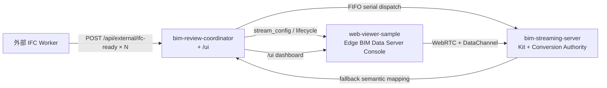

# Fast MVP:Edge BIM Data Server Console — Design 2026-05-25

> 文件性質：fast MVP demo 收斂的 design 草案；source of truth 仍是落地後的 OpenSpec
> changes（本文件僅作為 brainstorming 階段的整合視圖與 writing-plans skill 入口）。
> 源筆記：[`docs/plans/TEMP-fast-mvp-session-artifact-binding-discussion-2026-05-25.md`](./TEMP-fast-mvp-session-artifact-binding-discussion-2026-05-25.md)
> 範圍：把 fast MVP demo 收斂成四個 OpenSpec change，跨 `bim-streaming-server` /
> `bim-review-coordinator` / `web-viewer-sample` 三個 repo。

## 1. 目的與決策摘要

筆記 2026-05-25 對當下 fast MVP 觀察的結論是：

```txt
File ready:     yes
Runtime ready:  yes
Semantic ready: no / incomplete
```

`primary` HOOPS A3D converter 已於 [`2026-05-22-fix-ifc-usdc-hoops-load-failure`](
../../openspec/changes/archive/2026-05-22-fix-ifc-usdc-hoops-load-failure/proposal.md)
確認是 vendor-side 不支援；fallback `IfcOpenShell + OpenUSD` 雖能產出可開啟
`model.usdc`，但 mapping 為 shape-level path、viewer 仍偏「審查 demo 操作台」、`/ui`
與 viewer 對「ready」缺乏分層，導致 demo 無法被誠實判定。

本 design 把「完成 fast MVP demo」收斂為兩件事：

1. 讓 viewer / `/ui` 重新定位為「落地端 BIM 重量資料伺服器的可信狀態面板」（Edge
   BIM Data Server Console），明確分 File / Runtime / Semantic 三段 ready，不再用單一
   `ready` 字樣混淆。
2. 讓 fallback 產出真正帶 IFC 語意的 mapping，並用 coordinator 端 serial dispatch
   queue 保證多 POST 行為安全。

落地切成 4 個 OpenSpec change（命名與排序見 §3、§5）。

## 2. Scope / Out of scope

### In scope

- 提升 fallback IFC→USDC 的 mapping fidelity（C1）
- coordinator serial conversion dispatch + queued lifecycle（C4）
- viewer IA 重排為 Edge BIM Data Server Console、刪 fast MVP 不需要的 collaboration /
  multi-artifact / issue / repo map UI（C2）
- coordinator `/ui` 三段 ready + queue visibility + step rename + legacy asset
  disclaimer（C3）

### Out of scope（明確排除，需要另起 OpenSpec change）

- coordinator 端允許 operator 手動挑選 primary observable artifact / 多 conversion 切換
- 一個 session 綁多個 USDC artifact、sublayers、多 viewer 對比
- 已開啟 viewer 在運行中重綁 primary（hot swap stage）
- 修復 HOOPS A3D primary converter（vendor-side，不可控）
- 引入 production queue dependency（BullMQ / Bee-Queue / Redis / Celery 等）
- disk-persistent queue / priority queue / per-project quota
- cross-coordinator-instance queue 協調
- 重新引入 multi-user collaboration / annotation / issue workflow

## 3. 架構與 4 個 OpenSpec change tree



```txt
C1 streaming-server-fallback-semantic-mapping
   ├ repo: bim-streaming-server
   └ capability: streaming-ifc-usdc-conversion-authority (MODIFIED)

C4 coordinator-serial-conversion-dispatch-queue
   ├ repo: bim-review-coordinator
   └ capability: local-coordinator-ifc-ready-intake-boundary (MODIFIED)

C2 viewer-edge-bim-server-console
   ├ repo: web-viewer-sample
   └ capability: session-first-review-viewer (MODIFIED)

C3 coordinator-ui-tri-ready-and-queue
   ├ repo: bim-review-coordinator
   └ capability: demo-fast-mvp-orchestration (MODIFIED)
```

每個 change 只動單一 repo / 單一 capability，PR review 與 rollback 粒度乾淨。

## 4. Change spec deltas

### 4.1 C1 `streaming-server-fallback-semantic-mapping`

**Capability MODIFIED**：`streaming-ifc-usdc-conversion-authority`
**Branch**：`codex/openspec/streaming-server-fallback-semantic-mapping`

**目標**：`_run_ifcopenshell_openusd_fallback` 產出的 `element_mapping.json` /
`model.usdc` prim 結構 / `quality_metrics.json` 必須帶 IFC 語意，viewer 才有 Semantic
ready 的真資料來源。

**現況**（`bim-streaming-server/source/extensions/ezplus.bim_review_stream.messaging/ezplus/bim_review_stream/messaging/ifc2usdc_powershell_adapter.py`）：

```python
# prim path:   /World/IfcShape_000001 …
# mapping item: { ifc_guid, usd_prim_path }
# entity_index 有 ifc_type/name 但與 mapping item 沒有 1:1 對齊
```

**變更後**：

```python
# prim path:    /World/<IfcClass>/<GUID>     ← IFC-class grouped
# mapping item: {
#   ifc_guid,
#   usd_prim_path,
#   ifc_type,      # 例: "IfcCableCarrierSegment"
#   ifc_name,      # 例: "電氣系統-出線口-..."  (可為 null 但 field 必須存在)
#   entity_id,     # 對應 entity_index row id
# }
# entity_index.json 與 element_mapping row id 1:1 對齊
# quality_metrics.json 新增:
#   semantic_mapping_fidelity: "ifc_class_grouped_with_name"
#   mapping_has_ifc_type:      true
#   mapping_has_ifc_name:      true
```

**Spec scenarios（ADD）**

- `Fallback mapping carries IFC class and name`：fallback 完成時，每個 mapping item
  都帶 `ifc_type` / `ifc_name`（field 存在，值可 null）/ `entity_id`
- `Fallback prim paths are IFC-class grouped`：fallback `model.usdc` 的 mesh prim
  必須在 `/World/<IfcClass>/<GUID>` 之下
- `Quality metrics declare semantic fidelity`：`quality_metrics.json` 新增
  `semantic_mapping_fidelity` 欄位，fallback 必須填
  `ifc_class_grouped_with_name`、`mapping_has_ifc_type=true`、`mapping_has_ifc_name=true`
- `Backward compatible mapping schema`：`usd_prim_path` / `ifc_guid` 欄位保留，既有
  consumer 不破

**Tests**

- `bim-streaming-server/tests/test_host_native_conversion_service.py` 加 fallback
  semantic mapping 驗證（IFC class grouped path / 必填欄位 / quality_metrics 欄位）
- 不需要 GPU / Kit，純 Python（IfcOpenShell + OpenUSD）path

**Archive evidence gate**

- 用既有 IFC fixture 重新轉檔 → mapping item 每筆帶 `ifc_type` + `ifc_name`
- `Usd.Stage.Open(model.usdc)` 成功，prim tree 下有 `/World/<IfcClass>/<GUID>` 節點
- `quality_metrics.json` 顯示新欄位
- 不需要 Chrome E2E（viewer 端 evidence 由 C2 archive 提供）

**Risks**

- mapping fidelity ≠ 完整 BIM hierarchy；本 change 不宣稱 IfcRelAggregates /
  IfcRelContainedInSpatialStructure 還原，只宣稱 mapping item 帶 IFC class/name
- 新欄位是 additive，舊 viewer / mapping consumer 在 shape-level 期間仍可運作

### 4.2 C4 `coordinator-serial-conversion-dispatch-queue`

**Capability MODIFIED**：`local-coordinator-ifc-ready-intake-boundary`
**Branch**：`codex/openspec/coordinator-serial-conversion-dispatch-queue`

**目標**：`POST /api/external/ifc-ready` 並發呼叫不會打爆下游單一 host-native
conversion pipeline；待處理 jobs 顯式進入 queue，operator 與 viewer 都能看到。

**「安全的寫法」具體規格**

- coordinator 端 in-memory FIFO（不引入 production queue dependency）
- 單一 `dispatch_in_flight` 標記，完成後取下一個
- 重啟後 in-memory queue 清空，未 dispatch 的 job 標 `dropped_on_restart` lifecycle
  （safe but lossy；operator 須重 POST。runbook 同步揭露）

```txt
時間  事件
t0    POST ifc-ready #A → lifecycle="queued_for_conversion" → enqueue
                      → 取出 → dispatch streaming → lifecycle="converting"
t1    POST ifc-ready #B → lifecycle="queued_for_conversion" → queue_position=1
t2    A done → ingest result → lifecycle="ready"/"failed"
                      → 取下一個 (B) → dispatch
t3    POST ifc-ready #C → lifecycle="queued_for_conversion" → queue_position=1
```

**lifecycle values**（`converting` 已是既有 lifecycle value，見
`bim-review-coordinator/src/app.ts:70` / `types.ts:26`；本 change 僅新增兩個值）：

- `queued_for_conversion`（新）
- `converting`（既有，不變）
- `dropped_on_restart`（新）

**Spec scenarios（ADD）**

- `Coordinator serialises concurrent ifc-ready dispatch`：同時收到 ≥ 2 個 POST，只有
  1 個 in-flight，其餘 `queued_for_conversion` + `queue_position` 遞增
- `Queued ifc-ready job dispatches after in-flight completes`：in-flight 完成（成功
  或失敗）後 dispatcher 自動取下一個
- `In-flight failure does not block queued items`：A 失敗仍處理 B
- `Coordinator restart drops in-memory queue`：重啟時尚未 dispatch 的 job 標
  `dropped_on_restart`，runbook 同步揭露 operator 須重 POST
- `Existing single-job path is unchanged`：一次只有一個 job 時行為與舊 happy path
  等價（不影響 [`fast-ifc-link-demo-loop`](../../openspec/changes/archive/2026-05-21-fast-ifc-link-demo-loop)）

**Tests**

- 用 `tests/fakes/streaming_server_fake.py`（若無則新建）模擬 conversion 慢回應
- 並發 2–3 POST，assert 第二之後 lifecycle=`queued_for_conversion`、queue_position
  遞增
- 第一個失敗 → 第二個仍 dispatch
- restart simulation：重建 coordinator instance，assert queue 清空、未 dispatch
  的 job 標 `dropped_on_restart`
- 既有 `npm test` + `npm run build` + `npm run verify` 必須通過

**Archive evidence gate**

- `scripts/smoke-bscheme-intake.ps1` 既有 single-job tier 仍 `passed`
- 新增 concurrent POST smoke（兩個並發 ifc-ready）→ queue lifecycle 觀察到
- 不需要 GPU / Kit live evidence

**Risks**

- In-memory queue restart 會丟 pending；fast MVP 接受此 trade-off
- `queue_position` 在多 process / 多 coordinator 場景無意義；本 change 明確宣告單
  process

### 4.3 C2 `viewer-edge-bim-server-console`

**Capability MODIFIED**：`session-first-review-viewer`
**Branch**：`codex/openspec/viewer-edge-bim-server-console`

**目標**：把 `web-viewer-sample` 從「fast MVP 審查 demo 操作面板」重新定位為「落地端
BIM 重量資料伺服器的可信狀態面板」。

**新 DOM 結構**（替換 `Window.tsx` 既有佈局）：

```txt
┌────────────────────────────────────────────────────────────────┐
│ TopBar │ Edge BIM Data Server · project_id · version · status   │
├──────────────────────────────────────┬─────────────────────────┤
│                                       │ Right Inspector         │
│         WebRTC 3D Viewer              │  ① 本機資料包            │
│         (AppStream + stage-truth)     │  ② 轉檔品質              │
│                                       │  ③ BIM 語意對照          │
│                                       │  ④ 技術細節 (折疊)       │
├──────────────────────────────────────┴─────────────────────────┤
│ Bottom Evidence Strip:                                          │
│   ① webhook  ② conversion  ③ stage  ④ WebRTC                   │
└────────────────────────────────────────────────────────────────┘
```

**三段 ready 計算規則**

| Ready | 資料來源 | 判定 |
|---|---|---|
| File ready | `stream_config.model.status === "ready"` + `model.url` 200 | model.usdc 存在可載入 |
| Runtime ready | WebRTC `started` + `stageLoadStatus === "matched"`（expected === loaded） | 已串流且載入到正確 stage |
| Semantic ready | `quality_metrics_summary.semantic_mapping_fidelity` set + `mapping_has_ifc_type=true` + `mapping_has_ifc_name=true`（C1 新欄位） | mapping 帶語意，viewer 高亮的是真正的 IFC 元件 |

C1 未落地前 Semantic 永遠 `incomplete`；viewer 必須誠實顯示，不得偽宣稱 ready。

**Right Inspector 四層資料來源**

- ① 本機資料包：project_id / external_model_version_id / review_session_id /
  conversion_job_id / model.usdc URL / mapping URL / entity_index URL
- ② 轉檔品質：converter source（primary HOOPS / fallback）/
  primary_converter_error / mapped_count / coverage_ratio /
  `semantic_mapping_fidelity` / baseline locked
- ③ BIM 語意對照：mapping items（帶 ifc_type / ifc_name）顯示可選元件列表 →
  DataChannel `highlightPrimsRequest` → Kit echo selected prim path 驗收（保留作為
  IFC entity → USD prim 驗收工具）
- ④ 技術細節（預設折疊；`?debug=1` 展開）：stage tree / DataChannel log /
  Socket.IO log / USDAsset picker（legacy debug 用）

**Bottom Evidence Strip**（取代部分既有 `stage-truth-panel`）：

```
① webhook       intake job id / download_status / queue_position
② conversion    conversion_job_id / status / primary vs fallback
③ stage         expected vs loaded URL / match status
④ WebRTC        lifecycle / kit instance / port / video readyState
```

**Spec delta**

MODIFIED Requirements
- `Viewer bootstraps from review request or session`：加 scenario：USDAsset picker
  預設不渲染，僅 `?debug=1` 顯式啟用
- `Viewer displays artifact and lifecycle state`：要求 File / Runtime / Semantic
  三段 ready 分層；加 scenario：`queued_for_conversion` lifecycle 不嘗試 WebRTC，
  顯示「等待 conversion 輪到」+ queue_position
- `Viewer displays streaming-owned conversion and composition status`：加 scenario：
  viewer 必須清楚分辨 primary HOOPS 失敗 + fallback 採用，顯示
  `semantic_mapping_fidelity`

ADDED Requirements
- `Viewer is positioned as Edge BIM Data Server Console`：TopBar / 4 層 Inspector /
  Bottom Evidence Strip 結構 + IA 命名
- `Viewer uses element mapping as semantic verification entry`：mapping highlight /
  focus 保留作為 IFC entity → USD prim 驗收入口，不再以 issue workflow 呈現

REMOVED Requirements
- `Viewer separates runtime commands from collaboration events`：collaboration
  scenarios 全部移除；DataChannel command 由新「Semantic verification entry」涵蓋
- `Viewer supports multi-artifact review controls`：fast MVP 不需要 multi-artifact
  切換 UI；debug 場景由 `?debug=1` USDAsset picker 涵蓋
- `Viewer handles lifecycle transitions safely` 中 collaboration broadcast 部分；
  保留 WebRTC disconnect / reconnect

**程式碼層級的刪除 / hide / restructure**

```txt
DELETE:
- Window.tsx → DemoControlPanel 內 issue 試標 / collaboration 區段
- ReviewLauncher / PresencePanel（若 fast MVP 無用途）
- reviewSocket.ts → highlight / selection / annotation event handlers（殘留）
- components/ArchitectureOverview.tsx（若是 repo map 入口；driver 階段確認）

DEFAULT HIDE（僅 ?debug=1）:
- USDAsset 下拉 + USDStage tree → Inspector ④ 技術細節
- DataChannel log / Socket.IO log → ④ 技術細節

RENAME / RESTRUCTURE:
- DemoControlPanel → 拆成 ConversionQualityPanel(②) + MappingVerificationPanel(③)
- ArtifactPanel → BindingPanel，放進 Inspector ①
- ConversionSummaryCard → 移進 Inspector ②，顯示新 semantic_mapping_fidelity 欄位
- 新元件 BottomEvidenceStrip：匯整 webhook / conversion / stage / WebRTC
```

**實作 approach**（兩個候選，採 B）

- A. 一次重寫 Window.tsx：diff 大但 reviewer 一次看 final state
- B. **漸進重排**（採用）：保留 state machine，逐 commit 刪舊面板 / 搬新位置
  - commit 1：刪 collaboration / repo map / interaction lab + tests 更新
  - commit 2：USDAsset / USDStage 收 `?debug=1`
  - commit 3：抽出 EdgeConsole layout（TopBar / Inspector / BottomStrip）
  - commit 4：三段 ready 計算 + 顯示（等 C1 落地後 Semantic 才綠）

**Tests**

- 新增 `verify-edge-console-layout.mjs`（仿 `verify-conversion-summary-card.mjs`）：
  mount Window.tsx with mock streamConfig，assert TopBar / 4 層 Inspector / Bottom
  Strip 渲染
- 新增 `verify-tri-ready-states.mjs`：給三組 streamConfig fixture（file only /
  file+runtime / all three），assert UI label
- 既有 `npm run verify`（= `npm run build`）必須通過

**Archive evidence gate**

- 依賴 C1 merged，Semantic ready 顯示才有真資料
- Chrome E2E：從 `/ui` 開 viewer，人工驗證四層 Inspector + Bottom Strip 顯示正確、三段
  ready 標籤對齊 stream_config 與 quality_metrics_summary
- 沒有 `?debug=1` 時 USDAsset / USDStage / DataChannel log 不可見

**Risks**

- Window.tsx 1809 行重排風險高；漸進 commit + verify-script 緩解
- C1 未完成期間 Semantic 永遠 incomplete；viewer 不能因此卡 demo，必須誠實標
  `incomplete (待 C1 mapping)`
- `?debug=1` 是 viewer query flag 不是 OpenSpec capability；runbook / viewer README
  明確說明

### 4.4 C3 `coordinator-ui-tri-ready-and-queue`

**Capability MODIFIED**：`demo-fast-mvp-orchestration`
**Branch**：`codex/openspec/coordinator-ui-tri-ready-and-queue`

**目標**：`bim-review-coordinator/src/public/dev-console.html`（`/ui`）對齊 viewer
的三段 ready 與 step 文案，並顯式展示 conversion dispatch queue。

**新 `/ui` 區段**

```txt
┌────────────────────────────────────────────────────────────────┐
│ Edge BIM Data Server · Runtime Dashboard                        │
├────────────────────────────────────────────────────────────────┤
│ ① 接收 IFC-ready webhook      [● File ready]                    │
│   project_id · external_model_version_id · ifc_ready_job_id    │
│   download_status · source_ifc · local_path                    │
│   等待中清單:                                                    │
│     A  converting              (active)                         │
│     B  queued_for_conversion   queue_position=1                 │
│     C  queued_for_conversion   queue_position=2                 │
├────────────────────────────────────────────────────────────────┤
│ ② 產生本機 USDC 資料包         [● Conversion: primary | fallback]│
│   conversion_job_id · conversion_authority · model.usdc URL    │
│   mapping URL · entity_index URL · coverage_ratio              │
│   semantic_mapping_fidelity ← 來自 C1                          │
├────────────────────────────────────────────────────────────────┤
│ ③ 啟動 Kit / WebRTC 串流      [● Runtime ready]                 │
│   review_session_id · viewer_url · kit_instance / endpoint     │
│   participant count · WebRTC 連線狀態                          │
├────────────────────────────────────────────────────────────────┤
│ ④ 驗證 BIM 語意對照            [● Semantic ready]               │
│   mapping items 摘要 · ifc_type 涵蓋 · viewer 驗收回報         │
├────────────────────────────────────────────────────────────────┤
│ 🔧 Debug & Legacy（預設折疊）                                   │
│   /api/assets 舊 demo asset（disclaimer: 不是 current session   │
│   model）│ Kit log tail │ runtime status                       │
└────────────────────────────────────────────────────────────────┘
```

**三段 ready 在 coordinator 端的判定（與 viewer 一致）**

```txt
File ready     = ifc_ready_job.download_status === "downloaded"
                 AND conversion_job.status === "succeeded"
                 AND artifacts.model_usdc exists
Runtime ready  = review_session exists
                 AND kit_instance_binding is set
                 AND viewer participation observed (optional)
Semantic ready = quality_metrics.semantic_mapping_fidelity set
                 AND mapping_has_ifc_type=true
                 AND mapping_has_ifc_name=true
```

**Spec delta**

MODIFIED Requirements
- `Coordinator /ui provides closed-loop runtime dashboard`：加 scenario：dashboard
  必須顯示 File / Runtime / Semantic 三段 ready 標籤；legacy `/api/assets` 顯示時
  必須帶 `不是 current session model` disclaimer

ADDED Requirements
- `Coordinator /ui dashboard surfaces three-tier readiness`：三段判定規則寫入
  spec，並要求與 `session-first-review-viewer` 三段 ready 計算規則一致
- `Coordinator /ui dashboard renames demo steps`：四 step 文案（① 接收 IFC-ready
  webhook ② 產生本機 USDC 資料包 ③ 啟動 Kit/WebRTC 串流 ④ 驗證 BIM 語意對照），
  不再使用「審查問題 / 標註 / 多人協作」字樣
- `Coordinator /ui dashboard shows conversion dispatch queue`：顯示 in-flight 與
  queued 區別、queue_position、`dropped_on_restart` 提示

**Tests**

- `bim-review-coordinator/test/`：`/ui` HTML 端 snapshot / DOM presence test（三段
  ready 標籤、step 文案、disclaimer、queue 區段）
- 既有 `npm test` + `npm run build` + `npm run verify` 通過

**Archive evidence gate**

- `smoke-bscheme-intake.ps1` 一次完整 happy path → `/ui` 顯示三段 ready 標籤
- 並發 ifc-ready smoke（依賴 C4）→ `/ui` queue 區段顯示 queued / in-flight 區別
- legacy `/api/assets` 區帶 disclaimer 文字截圖
- 不需要 GPU / Kit live demo evidence

**Risks**

- 三段 ready 計算規則漂移 — 必須要求 coordinator 與 viewer 用同一份欄位來源
  （`stream_config.quality_metrics_summary` + C1 欄位）
- `/ui` 是後端 HTML 模板而非 React，UX 與 viewer 不會自動同步；spec 必須在 C2 / C3
  archive evidence 中各自驗證

## 5. 實作順序與 dependencies

```text
Phase 1（無交集，可平行）
  ├ C1 streaming-server-fallback-semantic-mapping  (bim-streaming-server)
  └ C4 coordinator-serial-conversion-dispatch-queue (bim-review-coordinator)
        ↓ merge + archive
        ↓ semantic_mapping_fidelity / mapping_has_ifc_type / mapping_has_ifc_name
        ↓ queued_for_conversion / queue_position / dropped_on_restart

Phase 2（消費 Phase 1 contract）
  ├ C2 viewer-edge-bim-server-console               (web-viewer-sample)
  └ C3 coordinator-ui-tri-ready-and-queue           (bim-review-coordinator)
```

每個 change 走標準 OpenSpec + GitHub workflow（[`AGENTS.md §0.1 + §1.A`](
../../AGENTS.md)）：

```txt
git switch -c codex/openspec/<change-id> from latest main
/openspec new <change-id>
implement + tests + smoke
gh pr create
GitHub Actions auto-verify
merge
/openspec sync + archive
docs/plans/AI-BIM-governance-saas-roadmap-2026-05.md 同步更新
HTML view 同步更新
```

## 6. 驗收與 demo

最終 demo（C1+C2+C3+C4 都 archive 後）的判定：

```txt
Pass（spec rule，由欄位驅動）:
  - Single ifc-ready POST happy path 維持既有 fast-ifc-link-demo-loop 行為
  - Concurrent 2 POST 觀察 lifecycle queued_for_conversion → converting → ready
  - viewer / `/ui` 顯示 File ready = yes
  - viewer / `/ui` 顯示 Runtime ready = yes
  - viewer / `/ui` 顯示 Semantic ready = yes
    （= semantic_mapping_fidelity set + mapping_has_ifc_type=true + mapping_has_ifc_name=true）
  - legacy `/api/assets` 區帶 disclaimer，operator 不會誤判為 current model

Archive evidence（runtime 證據，非 ready 判定條件）:
  - viewer 從 element_mapping.json 載入帶 ifc_type/ifc_name 的 mapping items
  - DataChannel highlight 回傳的 prim path 含 IFC class segment
    （/World/<IfcClass>/<GUID> 或等價形式）
  - Chrome E2E screenshot 顯示 Inspector ③ BIM 語意對照可選 IFC entity

Fail / Block:
  - 任何單一段 ready 被誤標
  - mapping item 仍只有 shape-level path
  - queue 並發 POST 行為打爆下游
  - viewer 主畫面仍顯示 issue / 多人協作 / repo map UI
```

## 7. References

- 源筆記：[`docs/plans/TEMP-fast-mvp-session-artifact-binding-discussion-2026-05-25.md`](./TEMP-fast-mvp-session-artifact-binding-discussion-2026-05-25.md)
- 已 archived 相關 change：
  - [`2026-05-22-fix-ifc-usdc-hoops-load-failure`](../../openspec/changes/archive/2026-05-22-fix-ifc-usdc-hoops-load-failure/proposal.md)
  - [`2026-05-21-fast-ifc-link-demo-loop`](../../openspec/changes/archive/2026-05-21-fast-ifc-link-demo-loop/proposal.md)
  - [`2026-05-21-remove-conflict-review-from-fast-mvp`](../../openspec/changes/archive/2026-05-21-remove-conflict-review-from-fast-mvp/proposal.md)
  - [`2026-05-22-coordinator-auto-poll-streaming-conversion`](../../openspec/changes/archive/2026-05-22-coordinator-auto-poll-streaming-conversion/proposal.md)
- 現行 specs：
  - [`session-first-review-viewer`](../../openspec/specs/session-first-review-viewer/spec.md)
  - [`demo-fast-mvp-orchestration`](../../openspec/specs/demo-fast-mvp-orchestration/spec.md)
  - [`streaming-ifc-usdc-conversion-authority`](../../openspec/specs/streaming-ifc-usdc-conversion-authority/spec.md)
  - [`local-coordinator-ifc-ready-intake-boundary`](../../openspec/specs/local-coordinator-ifc-ready-intake-boundary/spec.md)
- Repo 邊界：[`AGENTS.md`](../../AGENTS.md) §1.A / §3.4 / §3.5 / §3.6 / §10 / §11
- Roadmap：[`docs/plans/AI-BIM-governance-saas-roadmap-2026-05.md`](./AI-BIM-governance-saas-roadmap-2026-05.md)
