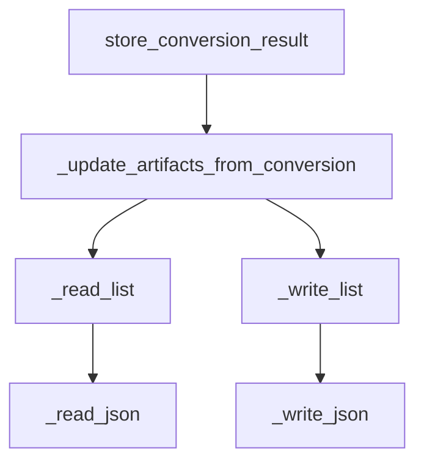

# BIM Control API

# BIM Control API Module Documentation

## Overview

The **BIM Control API** module provides a FastAPI-based web service for managing Building Information Modeling (BIM) projects, model versions, artifacts, review issues, and annotations. It serves as a backend for applications that require interaction with BIM data, allowing users to create, read, update, and manage BIM-related resources.

## Key Components

### 1. FastAPI Application

The main entry point of the module is the `create_app` function, which initializes the FastAPI application. It sets up the data directory, seeds initial data, and defines the API endpoints.

```python
app = create_app()
```

### 2. API Endpoints

The API exposes several endpoints for interacting with BIM data:

- **Health Check**
  - `GET /health`: Returns the status of the service and the data root path.

- **Projects**
  - `GET /api/projects`: Lists all projects.
  - `GET /api/projects/{project_id}`: Retrieves a specific project by its ID.
  - `GET /api/projects/{project_id}/versions`: Lists all model versions for a specific project.

- **Model Versions**
  - `GET /api/model-versions/{model_version_id}`: Retrieves a specific model version by its ID.
  - `GET /api/model-versions/{model_version_id}/artifacts`: Lists all artifacts associated with a specific model version.
  - `POST /api/model-versions/{model_version_id}/conversion-result`: Stores the conversion result for a model version.
  - `GET /api/model-versions/{model_version_id}/conversion-result`: Retrieves the conversion result for a model version.
  - `GET /api/model-versions/{model_version_id}/review-issues`: Lists review issues for a model version.
  - `POST /api/model-versions/{model_version_id}/review-issues`: Creates a new review issue for a model version.

- **Review Sessions**
  - `GET /api/review-sessions/{session_id}/annotations`: Lists annotations for a review session.
  - `POST /api/review-sessions/{session_id}/annotations`: Creates a new annotation for a review session.

### 3. Data Management Functions

The module includes several internal functions for managing data:

- **Data Reading and Writing**
  - `_read_json(path: Path, default: Any)`: Reads JSON data from a file, returning a default value if the file does not exist.
  - `_write_json(path: Path, payload: dict[str, Any])`: Writes JSON data to a file, creating necessary directories.
  - `_read_list(path: Path)`: Reads a list of items from a JSON file.
  - `_write_list(path: Path, payload: list[dict[str, Any]])`: Writes a list of items to a JSON file.

- **Data Seeding**
  - `_seed_data(data_root: Path)`: Seeds initial data for projects, model versions, artifacts, review issues, and annotations if they do not already exist.

- **ID Safety Checks**
  - `_safe_id(value: str, label: str)`: Validates that a given ID matches a predefined regex pattern, raising an HTTP exception if it does not.

### 4. Utility Functions

- `_now()`: Returns the current UTC time in ISO 8601 format.
- `_static_url(project_id: str, model_version_id: str, name: str)`: Constructs a static URL for accessing project artifacts.
- `_upsert(items: list[dict[str, Any]], key: str, value: str, item: dict[str, Any])`: Updates or inserts an item in a list based on a unique key.

### 5. Artifact Management

The `_update_artifacts_from_conversion` function updates the artifacts based on the conversion results. It reads the existing artifacts, updates their status, and writes the updated list back to the storage.

## Execution Flow

The following diagram illustrates the flow of data and function calls within the BIM Control API module:



## How It Connects to the Codebase

The BIM Control API module is designed to be integrated into a larger application ecosystem that may include frontend clients or other services that require access to BIM data. The FastAPI application can be run independently, allowing for easy deployment and scaling.

### Example Usage

To run the API, simply execute the module, and it will start a web server on the default FastAPI port (8000). You can then interact with the API using tools like Postman or curl.

```bash
uvicorn _bim-control.app.main:app --reload
```

## Conclusion

The BIM Control API module provides a robust framework for managing BIM projects and their associated data. With its well-defined API endpoints and internal data management functions, it serves as a critical component for applications that require BIM data manipulation and retrieval. Developers can extend and modify this module to fit specific project needs, ensuring flexibility and scalability.
