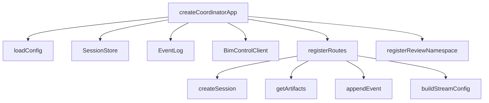

# BIM Review Coordinator

# BIM Review Coordinator Module Documentation

## Overview

The **BIM Review Coordinator** module is designed to facilitate collaborative review sessions for Building Information Modeling (BIM) projects. It provides a backend service that manages review sessions, participants, and interactions with BIM control APIs. The module leverages WebSocket connections for real-time communication and maintains a persistent event log for session activities.

## Key Components

### 1. Application Initialization

The entry point for the module is the `createCoordinatorApp` function, which initializes the Express application, sets up the HTTP server, and configures WebSocket support using Socket.IO.

```typescript
export function createCoordinatorApp(overrides: Partial<CoordinatorConfig> = {}): CoordinatorApp {
  // Load configuration
  const config = loadConfig(overrides);
  // Initialize Express app and HTTP server
  const app = express();
  const server = http.createServer(app);
  const io = new Server(server, { cors: { origin: config.corsOrigins, credentials: false } });
  // Initialize services
  const store = new SessionStore(config.sessionStoreDir);
  const eventLog = new EventLog(config.eventLogDir);
  const bimControlClient = new BimControlClient(config.bimControlApiBase);
  // Middleware setup
  app.use(cors({ origin: config.corsOrigins }));
  app.use(express.json({ limit: "1mb" }));
  // Health check endpoint
  app.get("/health", (_request, response) => {
    response.json({ status: "ok", service: "bim-review-coordinator", kit_signaling_port: config.kitSignalingPort });
  });
  // Register API routes
  registerRoutes(app, store, eventLog, bimControlClient);
  // Register WebSocket namespace
  registerReviewNamespace(io, store, eventLog, bimControlClient);
  return { app, server, io, config, store, eventLog };
}
```

### 2. API Endpoints

The module exposes several RESTful API endpoints for managing review sessions:

- **Create a Review Session**: `POST /api/review-sessions`
- **Get a Review Session**: `GET /api/review-sessions/:sessionId`
- **Join a Review Session**: `POST /api/review-sessions/:sessionId/join`
- **Leave a Review Session**: `POST /api/review-sessions/:sessionId/leave`
- **Get Stream Configuration**: `GET /api/review-sessions/:sessionId/stream-config`
- **Log Events**: `GET /api/review-sessions/:sessionId/events` and `POST /api/review-sessions/:sessionId/events`
- **Bootstrap Review Data**: `GET /api/model-versions/:modelVersionId/review-bootstrap`

Each endpoint is designed to handle specific actions related to review sessions, utilizing the `SessionStore`, `EventLog`, and `BimControlClient` services.

### 3. Session Management

The `SessionStore` class is responsible for creating, retrieving, and managing review sessions. It maintains session data in a file-based storage system.

```typescript
export class SessionStore {
  create(input: CreateSessionInput): ReviewSession {
    // Create a new review session
  }

  get(sessionId: string): ReviewSession | null {
    // Retrieve a session by ID
  }

  join(sessionId: string, participant: Pick<ReviewParticipant, "user_id" | "display_name">): ReviewSession | null {
    // Add a participant to a session
  }

  leave(sessionId: string, userId: string): ReviewSession | null {
    // Remove a participant from a session
  }
}
```

### 4. Event Logging

The `EventLog` class captures events related to review sessions, such as session creation, participant actions, and custom events. Events are stored in JSON files for persistence.

```typescript
export class EventLog {
  append(sessionId: string, type: string, payload: unknown): SessionEvent {
    // Append a new event to the log
  }

  list(sessionId: string): SessionEvent[] {
    // List all events for a session
  }
}
```

### 5. WebSocket Integration

The module uses Socket.IO to enable real-time communication between clients and the server. The `registerReviewNamespace` function sets up a dedicated namespace for review sessions, handling events such as joining, leaving, and broadcasting updates.

```typescript
export function registerReviewNamespace(io: Server, store: SessionStore, eventLog: EventLog, bimControlClient: BimControlClient): void {
  const namespace = io.of("/review");
  namespace.on("connection", (socket) => {
    // Handle socket events
  });
}
```

### 6. BIM Control Client

The `BimControlClient` class interacts with external BIM control APIs to fetch artifacts and review issues. It abstracts the API calls and provides methods for retrieving necessary data for review sessions.

```typescript
export class BimControlClient {
  async getArtifacts(modelVersionId: string): Promise<Artifact[]> {
    // Fetch artifacts for a specific model version
  }

  async getReviewIssues(modelVersionId: string): Promise<ReviewIssue[]> {
    // Fetch review issues for a specific model version
  }
}
```

## Execution Flow

The following diagram illustrates the flow of operations when a review session is created:



## Error Handling

The module includes error handling for validation errors using Zod. If a request fails validation, a 400 status code is returned with details about the error. For other errors, a 500 status code is returned.

```typescript
app.use((error: unknown, _request: express.Request, response: express.Response, _next: express.NextFunction) => {
  if (error instanceof z.ZodError) {
    response.status(400).json({ detail: error.flatten() });
    return;
  }
  response.status(500).json({ detail: error instanceof Error ? error.message : String(error) });
});
```

## Conclusion

The BIM Review Coordinator module provides a robust framework for managing collaborative review sessions in BIM projects. By integrating various services and real-time communication, it enables efficient workflows and enhances collaboration among participants. Developers can extend and modify the module to fit specific project requirements, leveraging its well-defined structure and components.
