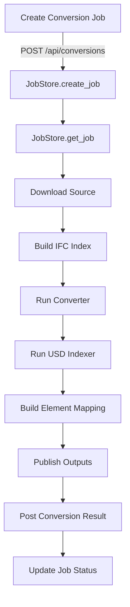

# Conversion Service

# Conversion Service Module Documentation

## Overview

The **Conversion Service** module is designed to facilitate the conversion of IFC (Industry Foundation Classes) files to USDC (Universal Scene Description) format. It provides a structured approach to manage conversion jobs, handle file I/O, and maintain job state throughout the conversion process. The module integrates with external services, such as a BIM control system, to report conversion results and manage job statuses.

## Key Components

### 1. **Main Application (`main.py`)**

The entry point of the Conversion Service, which sets up the FastAPI application. It defines the following endpoints:

- **GET `/health`**: Checks the health status of the service.
- **POST `/api/conversions`**: Initiates a new conversion job.
- **GET `/api/conversions/{job_id}`**: Retrieves the status and details of a specific conversion job.
- **GET `/api/conversions/{job_id}/result`**: Fetches the result of a completed conversion job.

### 2. **Job Management (`job_store.py`)**

The `JobStore` class manages the lifecycle of conversion jobs, including:

- **Creating Jobs**: Generates a unique job ID and stores job details.
- **Updating Jobs**: Modifies job status and other attributes.
- **Retrieving Jobs**: Fetches job details based on job ID.

### 3. **Conversion Orchestrator (`orchestrator.py`)**

The `run_conversion_job` function orchestrates the entire conversion process, including:

- Downloading the source IFC file.
- Indexing the IFC file.
- Running the conversion process.
- Indexing the resulting USDC file.
- Building element mappings between IFC and USDC.
- Publishing the outputs and updating the BIM control system.

### 4. **File I/O Operations (`file_io.py`)**

This module provides utility functions for downloading files and writing JSON data. Key functions include:

- **`download_source`**: Downloads a file from a given URL or copies it from a local path.
- **`write_json`**: Writes a JSON payload to a specified file path.

### 5. **IFC Indexing (`ifc_indexer.py`)**

The `build_ifc_index` function creates an index of the IFC file, extracting relevant entities and their properties. It supports two methods of indexing:

- Using the `ifcopenshell` library.
- A regex-based fallback method.

### 6. **Converter Runner (`converter_runner.py`)**

The `run_converter` function executes the PowerShell script responsible for converting IFC to USDC. It handles:

- Script execution and error handling.
- Logging the conversion process.
- Validating the output.

### 7. **Mapping Builder (`mapping_builder.py`)**

The `build_element_mapping` function creates a mapping between IFC elements and USDC primitives. It considers various matching strategies, including GUIDs and names, and supports optional fake mappings for testing.

### 8. **USD Indexing (`usd_indexer.py`)**

The `run_usd_indexer` function indexes the resulting USDC file, ensuring that the output is properly structured and accessible.

### 9. **Publisher (`publisher.py`)**

The `publish_outputs` function handles the storage of conversion results and generates URLs for accessing the converted files and indices.

### 10. **BIM Control Client (`bim_control_client.py`)**

The `post_conversion_result` function communicates with the BIM control system to report the results of the conversion job.

## Execution Flow

The following diagram illustrates the execution flow of a conversion job from initiation to completion:

## How It Works

1. **Job Creation**: A client sends a request to create a conversion job, which is processed by the `create_conversion` endpoint. This creates a new job entry in the `JobStore`.

2. **Job Execution**: The `run_conversion_job` function is triggered in the background. It manages the entire conversion process, updating the job status at each stage.

3. **File Handling**: The service downloads the source IFC file and writes the resulting indices and mappings to the filesystem.

4. **Conversion Process**: The service runs the conversion script, indexing the output and building mappings between IFC and USDC elements.

5. **Result Reporting**: Once the conversion is complete, the results are published, and the job status is updated in the `JobStore`.

## Integration with Other Modules

The Conversion Service interacts with various components of the codebase:

- **Settings**: Configuration values are loaded from environment variables or a settings file.
- **FastAPI**: The web framework used to expose the API endpoints.
- **External Libraries**: Utilizes libraries like `ifcopenshell` for IFC processing and `subprocess` for executing external scripts.

## Conclusion

The Conversion Service module provides a robust framework for converting IFC files to USDC format, managing job states, and integrating with external systems. Its modular design allows for easy maintenance and extensibility, making it suitable for various conversion tasks in the BIM ecosystem.
