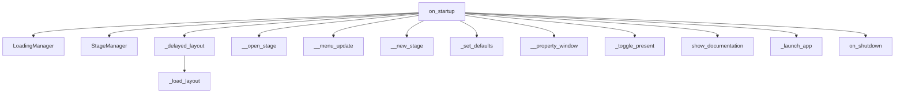

# Extensions

# Extensions Module Documentation

## Overview

The **Extensions** module is designed to facilitate the management and integration of various extensions within the NVIDIA Omniverse platform. It provides a structured way to load, manage, and clean up extensions, ensuring that they can interact seamlessly with the core application and other extensions. This module is crucial for developers looking to extend the functionality of the Omniverse platform through custom extensions.

## Key Components

### 1. Extension Class

The `Extension` class is the primary entry point for any extension. It inherits from `omni.ext.IExt`, which provides the necessary interface for extension lifecycle management.

#### Methods

- **on_startup(self)**: This method is called when the extension is activated. It initializes the internal state by creating instances of `LoadingManager` and `StageManager`.

- **on_shutdown(self)**: This method is invoked when the extension is deactivated. It cleans up the internal state by shutting down the managers and resetting references.

### 2. SetupExtension Class

The `SetupExtension` class is responsible for setting up the USD Viewer application. It manages the loading of layouts and stages, ensuring that the application is configured correctly upon startup.

#### Methods

- **on_startup(self, _ext_id: str)**: This method handles the initial setup of the application, including loading the stage and layout based on user settings.

- **_delayed_layout(self)**: This asynchronous method delays the loading of the layout until the application has completed its initial setup.

- **__open_stage(self, url, frame_delay: int = 5)**: This method opens the specified USD stage and loads the render settings, ensuring that the application is ready for user interaction.

### 3. Utility Functions

The module also includes several utility functions that assist in loading layouts and managing application settings.

- **_load_layout(layout_file: str)**: Loads a specified layout file and configures the viewport to fill the available space.

### 4. Menu Management

The module provides functionality to manage the application menu, allowing extensions to add or modify menu items dynamically.

- **__menu_update(self)**: Updates the application menu layout, adding new items and submenus as needed.

## Execution Flow

The execution flow of the Extensions module is primarily driven by the activation and deactivation of extensions. When an extension is activated, the `on_startup` method is called, which in turn may call other methods to load layouts, stages, and configure settings.

### Flow Diagram

## Integration with the Codebase

The Extensions module interacts with various components of the Omniverse platform:

- **LoadingManager**: Manages the loading of assets and stages, ensuring that resources are available when needed.
- **StageManager**: Handles the current stage context, allowing for operations related to the USD stage.
- **Carb Settings**: Utilizes the `carb.settings` module to manage application settings and preferences.
- **Omni UI**: Integrates with the Omni UI framework to provide user interface elements and manage layout configurations.

## Conclusion

The Extensions module is a vital part of the Omniverse architecture, enabling developers to create and manage extensions that enhance the platform's capabilities. By following the defined lifecycle methods and utilizing the provided utilities, developers can ensure that their extensions integrate smoothly with the core application and provide a seamless user experience.
