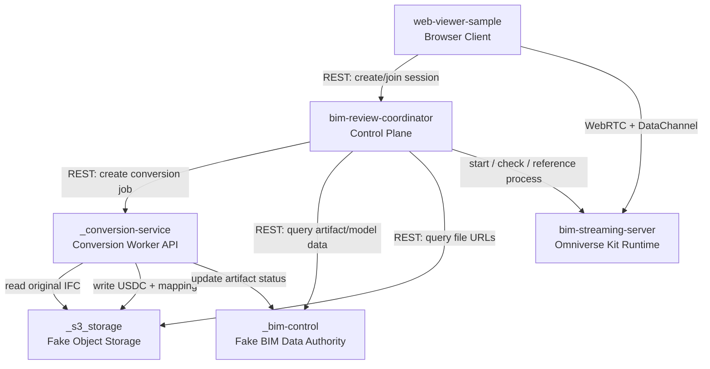
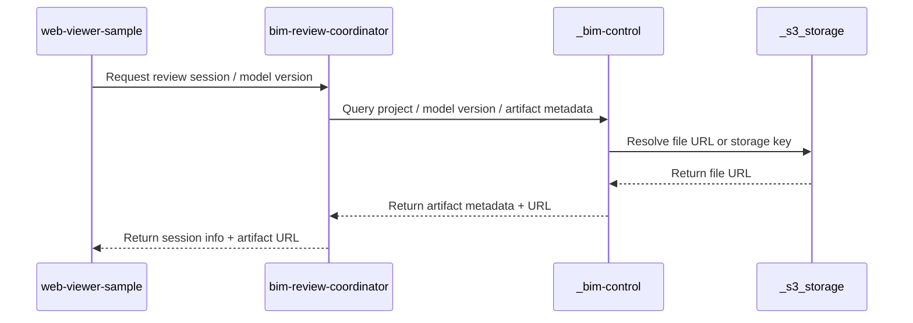
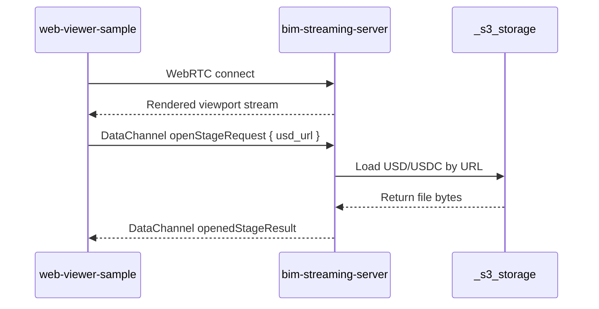
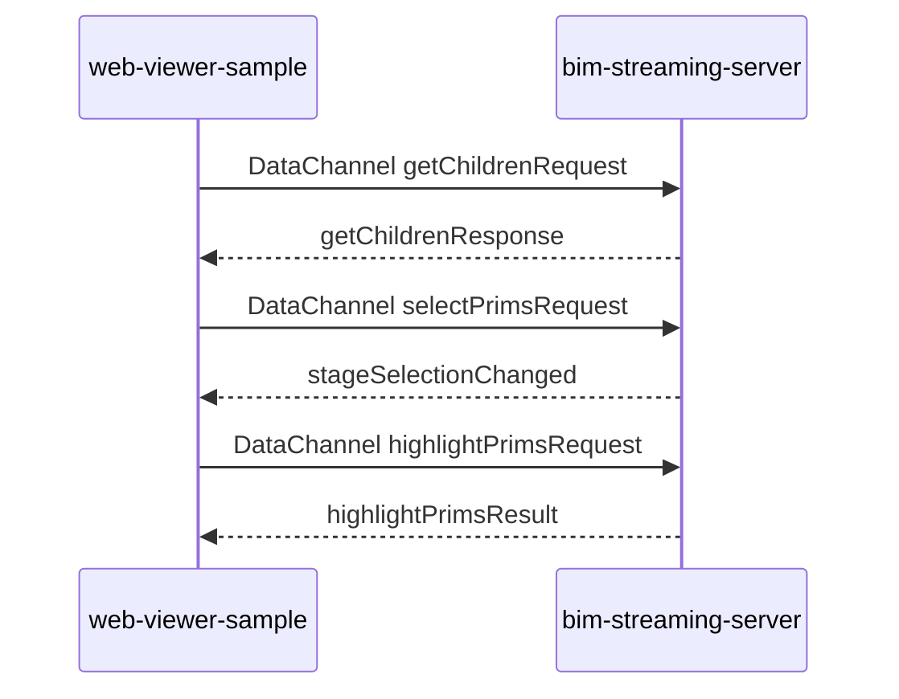
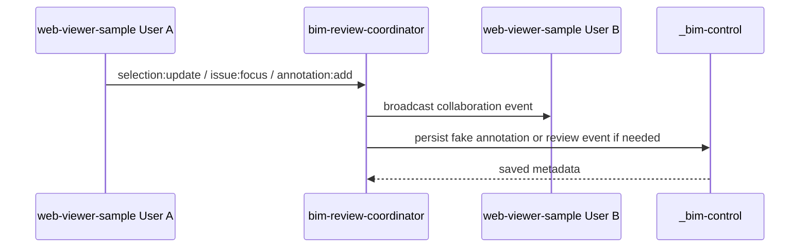
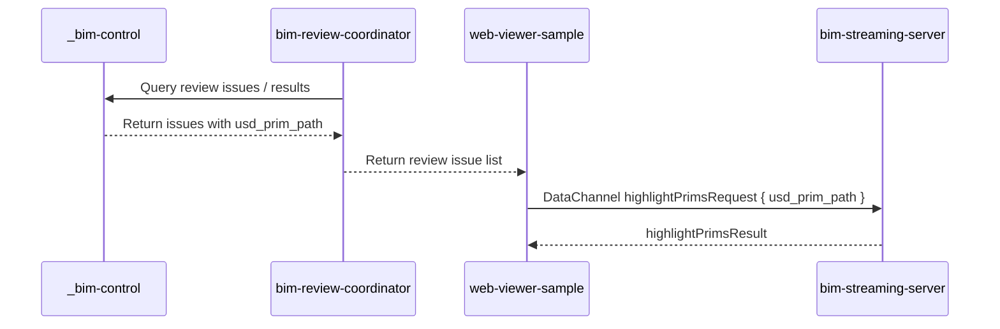

# Other — AGENTS.md

# AGENTS.md

## Purpose

The **AGENTS.md** file defines the responsibilities, interactions, and data flows among the five core repositories and folders within the `AI-BIM-governance/` workspace. This document outlines:

1. Repository boundaries
2. Interaction methods between repositories
3. Data flow directions
4. Data ownership and responsibilities
5. Prohibited cross-repository interactions

This document does not describe future functionalities for each repository or serve as a feature development checklist.

## Workspace Overview

The primary development folder is:

```
AI-BIM-governance/
```

The five core repositories/folders are:

```
AI-BIM-governance/
├── bim-review-coordinator/      # Control center, localhost:8004
├── _conversion-service/         # Conversion API, localhost:8003
├── bim-streaming-server/        # Kit streaming server, WebRTC 49100
├── _bim-control/                # Fake artifact/model API, localhost:8001
├── _s3_storage/                 # Fake storage, localhost:8002
└── web-viewer-sample/           # Browser client, localhost:5173
```

### Architecture Diagram



## Repository Overview

### 1. `_bim-control/`

#### Role
Fake BIM Platform / Fake Data Authority

#### Responsibilities
- Provides and stores:
  - Project metadata
  - Model version metadata
  - Model artifact metadata
  - Issue metadata
  - Annotation metadata
  - Element mapping metadata
  - Review result metadata

#### Exclusions
- Real Revit plugin
- Real SSO/permission systems
- Omniverse rendering
- WebRTC streaming
- GPU instance lifecycle
- Actual large file byte storage
- USD stage operations

### 2. `_s3_storage/`

#### Role
Fake Object Storage / Local File Storage

#### Responsibilities
- Stores and provides:
  - IFC/RVT/DWG original files
  - USD/USDC derived files
  - `element_mapping.json`
  - Fake review result JSON
  - Fake report/snapshot/attachment files

#### Exclusions
- Project logic
- User permissions
- Session management
- Annotation business semantics
- Omniverse rendering
- WebRTC streaming
- Regulatory/carbon/AI judgments

### 3. `bim-review-coordinator/`

#### Role
Session Control Plane / Collaboration Coordinator

#### Responsibilities
- Coordinates:
  - Review session state
  - Browser client and Kit streaming server connection information
  - User presence/collaboration state
  - Selection/annotation/issue focus events
  - Data query routing to fake BIM platform and fake storage

#### Exclusions
- USD stage loading
- Omniverse viewport rendering
- WebRTC video encoding
- IFC/USD file content conversion
- Direct large file storage
- Replacing `_bim-control` as data authority
- Replacing `web-viewer-sample` as UI

### 4. `bim-streaming-server/`

#### Role
Omniverse Kit Runtime / GPU Streaming Server

#### Responsibilities
- Handles:
  - USD/USDC stage runtime
  - Omniverse Kit viewport
  - GPU rendering
  - WebRTC video stream
  - WebRTC DataChannel JSON commands

#### Exclusions
- Project/model version data authority
- User login and permissions
- Review session lifecycle control
- Multi-user collaboration event broadcasting
- Long-term annotation/issue storage
- Fake S3 file storage
- Fake BIM API

### 5. `web-viewer-sample/`

#### Role
Browser Client / WebRTC Viewer / User Interaction Layer

#### Responsibilities
- Displays WebRTC streaming video
- Sends DataChannel JSON commands to `bim-streaming-server`
- Receives scene state/command results from `bim-streaming-server`
- Exchanges session/collaboration state with `bim-review-coordinator`
- Displays project/issue/annotation/stage tree UI states

#### Exclusions
- Starting or stopping Kit server
- Allocating GPU
- Storing project data
- Storing large model files
- Executing IFC/USD conversions
- Performing regulatory/carbon/AI judgments
- Replacing coordinator in session management

## Data Types and Ownership

| Data Type | Authority Repo/Folder | Description |
|---|---|---|
| Project metadata | `_bim-control` | Fake project data |
| Model version metadata | `_bim-control` | Fake model version data |
| Artifact metadata | `_bim-control` | Describes file format, URL, version relationships |
| IFC/RVT/DWG file | `_s3_storage` | Original model file body |
| USD/USDC file | `_s3_storage` | Derived files for Omniverse runtime |
| `element_mapping.json` | `_s3_storage` + `_bim-control` | File in storage, associated metadata in `_bim-control` |
| Review issue metadata | `_bim-control` | Fake review issues and location data |
| Annotation metadata | `_bim-control` | Fake annotations and review records |
| Review session state | `bim-review-coordinator` | Current session state |
| Collaboration state | `bim-review-coordinator` | Presence/selection/issue focus/annotation events |
| USD stage runtime state | `bim-streaming-server` | Current Omniverse scene runtime state |
| Browser UI state | `web-viewer-sample` | Current front-end UI state |

## Core Data Flows

### 1. Artifact Discovery Flow



### 2. Streaming Flow



### 3. Scene Interaction Flow



### 4. Collaboration Flow



### 5. Review Result Visualization Flow



## Communication Boundaries

| Communication Method | Source | Destination | Purpose |
|---|---|---|---|
| REST | `web-viewer-sample` | `bim-review-coordinator` | Create session, query session, obtain stream config |
| REST | `bim-review-coordinator` | `_bim-control` | Query project/version/artifact/issue/annotation metadata |
| REST / Static file | `_bim-control` or `bim-streaming-server` | `_s3_storage` | Obtain file URL or download file |
| WebRTC video | `bim-streaming-server` | `web-viewer-sample` | Stream Omniverse viewport |
| WebRTC DataChannel JSON | `web-viewer-sample` | `bim-streaming-server` | Open stage, selection, highlight, scene query |
| WebSocket / Socket.IO | `web-viewer-sample` | `bim-review-coordinator` | Presence, selection, annotation, issue focus events |
| Optional WebSocket | `bim-streaming-server` | `bim-review-coordinator` | Kit runtime receives multi-user state overlay, not as primary data authority |

## Source of Truth Principles

### 1. BIM Original Data

- **IFC/RVT/DWG** = Original model data
  - File body belongs to: `_s3_storage`
  - Version and project associations belong to: `_bim-control`

### 2. Omniverse Runtime Data

- **USD/USDC** = Rendering/streaming artifact
  - File body belongs to: `_s3_storage`
  - Runtime operations belong to: `bim-streaming-server`

### 3. Mapping Data

- **IFC GUID ↔ USD Prim Path**
  - Mapping file body → `_s3_storage`
  - Mapping metadata → `_bim-control`
  - Mapping runtime usage → `web-viewer-sample` / `bim-streaming-server`

### 4. Review Data

- **Issue/annotation/review result**
  - Data authority is: `_bim-control`
  - Multi-user event flow is managed by: `bim-review-coordinator`
  - 3D runtime display is handled by: `bim-streaming-server`
  - User interaction entry point is: `web-viewer-sample`

## Prohibited Cross-Boundary Rules

### 1. Actions Not Allowed by `web-viewer-sample`

- Do not start Kit server
- Do not allocate GPU
- Do not store project/model/issue data authority
- Do not store large model files
- Do not execute IFC/USD conversions

### 2. Actions Not Allowed by `bim-streaming-server`

- Do not manage user logins
- Do not manage project/model version
- Do not serve as annotation/issue long-term database
- Do not serve as multi-user collaboration event center
- Do not replace `_bim-control`
- Do not replace `_s3_storage`

### 3. Actions Not Allowed by `bim-review-coordinator`

- Do not render 3D
- Do not open USD stage
- Do not handle Omniverse renderer internal state
- Do not store large model files
- Do not replace `_bim-control` as data authority
- Do not replace `web-viewer-sample` as UI

### 4. Actions Not Allowed by `_bim-control`

- Do not perform Omniverse rendering
- Do not perform WebRTC streaming
- Do not manage GPU runtime
- Do not directly operate USD stage
- Do not store large binary file bodies

### 5. Actions Not Allowed by `_s3_storage`

- Do not store project business logic
- Do not manage sessions
- Do not manage annotation semantics
- Do not execute 3D runtime operations
- Do not broadcast multi-user events

## Optional Mock Services

Additional mock folders may exist in `AI-BIM-governance/`, such as:

```
_conversion-service/
_ai-rule-carbon-service/
_mock-auth/
_mock-sensor-service/
```

These do not fall under the definitions of the five core repositories. If they exist, the boundary principles are as follows:

- They only provide fake data, fake results, or local test data processing.
- They should not cross `_bim-control` to become formal data authorities.
- They should not cross `bim-streaming-server` to directly control the Omniverse viewport.
- They should not cross `bim-review-coordinator` to manage sessions/collaboration.
- They should not cross `web-viewer-sample` to become the browser UI.

## Workspace Closure Principle

The minimal closure that the entire workspace must protect is:

```
_bim-control provides model/issue metadata
→ _s3_storage provides USD/USDC file URLs
→ bim-review-coordinator creates review sessions
→ web-viewer-sample obtains session/stream config
→ web-viewer-sample connects to bim-streaming-server
→ bim-streaming-server loads USD/USDC
→ web-viewer-sample displays stream video
→ User selects issue/prim
→ web-viewer-sample sends DataChannel command
→ bim-streaming-server executes 3D highlight/selection
→ web-viewer-sample sends annotation/collaboration event
→ bim-review-coordinator broadcasts/writes back
→ _bim-control saves fake review metadata
```

Any modifications should not disrupt this closure.

## Summary

The core division of labor in this workspace is:

```
_bim-control = Fake BIM Data Authority
_s3_storage = Fake File and Object Storage
bim-review-coordinator = Session/Collaboration Control Plane
bim-streaming-server = Omniverse Kit Runtime/WebRTC Streaming/USD Scene Runtime
web-viewer-sample = Browser Client/User Interaction Layer
```

All cross-repository interactions must adhere to:

```
Data authority belongs to the data layer
File bodies belong to storage
Sessions belong to the coordinator
3D runtime belongs to the streaming server
User operations belong to the web viewer
```
