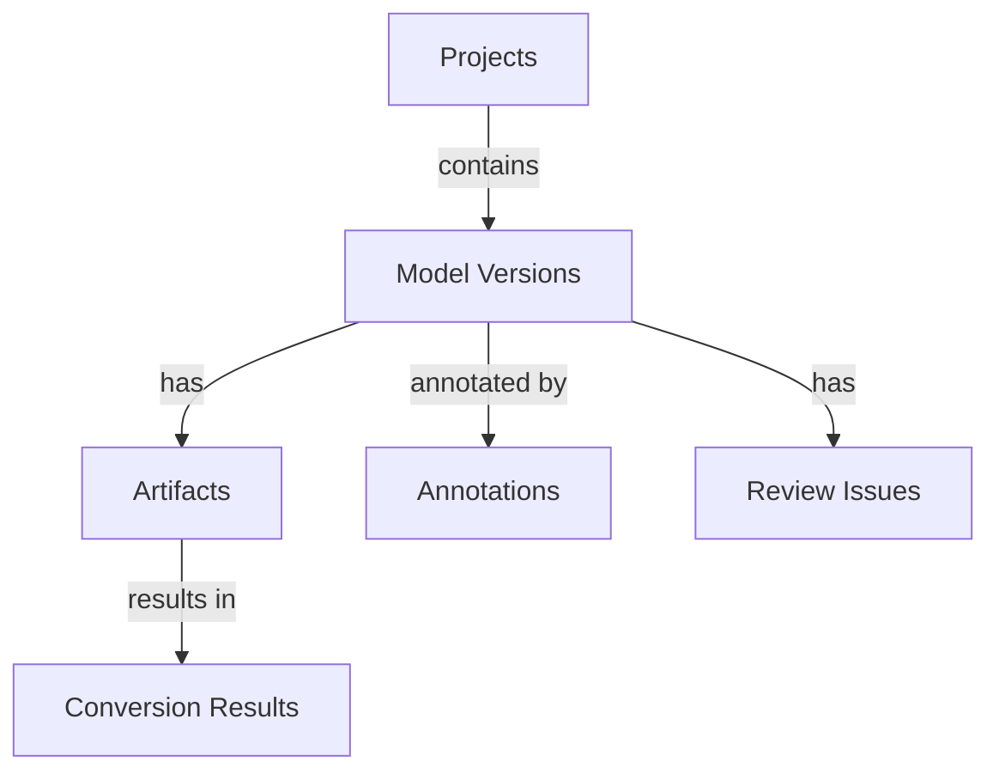

# Other — _bim-control-data

# _bim-control-data Module Documentation

## Overview

The **_bim-control-data** module is designed to manage and store data related to Building Information Modeling (BIM) projects. It provides structured JSON files that contain annotations, artifacts, conversion results, model versions, projects, and review issues. This module serves as a central repository for BIM-related data, facilitating the review and conversion processes within the BIM control system.

## Key Components

### 1. Annotations

Annotations are used to document specific comments or notes related to a BIM model. Each annotation includes details such as the author, title, body, and associated project and session IDs.

**File:** `_bim-control/data/annotations.json`

**Structure:**
```json
{
  "items": [
    {
      "annotation_id": "string",
      "model_version_id": "string",
      "usd_prim_path": "string",
      "author_id": "string",
      "title": "string",
      "body": "string",
      "project_id": "string",
      "session_id": "string",
      "created_at": "string"
    }
  ]
}
```

### 2. Artifacts

Artifacts represent the files generated during the BIM process, such as IFC and USDC files. Each artifact contains metadata including its type, status, and URLs for accessing the files.

**File:** `_bim-control/data/artifacts.json`

**Structure:**
```json
{
  "items": [
    {
      "artifact_id": "string",
      "project_id": "string",
      "model_version_id": "string",
      "artifact_type": "string",
      "name": "string",
      "url": "string",
      "mapping_url": "string|null",
      "status": "string",
      "updated_at": "string"
    }
  ]
}
```

### 3. Conversion Results

This component tracks the results of conversion jobs, detailing the status and URLs of the source and converted artifacts.

**File:** `_bim-control/data/conversion_results/version_demo_001.json`

**Structure:**
```json
{
  "job_id": "string",
  "status": "string",
  "project_id": "string",
  "model_version_id": "string",
  "source_artifact_id": "string",
  "usdc_artifact_id": "string",
  "source_url": "string",
  "usdc_url": "string",
  "ifc_index_url": "string",
  "usd_index_url": "string",
  "mapping_url": "string",
  "conversion_status": "string",
  "updated_at": "string"
}
```

### 4. Model Versions

Model versions provide information about different iterations of a BIM model, including their status and creation date.

**File:** `_bim-control/data/model_versions.json`

**Structure:**
```json
{
  "items": [
    {
      "project_id": "string",
      "model_version_id": "string",
      "name": "string",
      "status": "string",
      "created_at": "string"
    }
  ]
}
```

### 5. Projects

Projects encapsulate the overall BIM project details, including its status and creation date.

**File:** `_bim-control/data/projects.json`

**Structure:**
```json
{
  "items": [
    {
      "project_id": "string",
      "name": "string",
      "status": "string",
      "created_at": "string"
    }
  ]
}
```

### 6. Review Issues

Review issues document problems identified during the BIM review process, including their severity, status, and associated evidence.

**File:** `_bim-control/data/review_issues.json`

**Structure:**
```json
{
  "items": [
    {
      "issue_id": "string",
      "project_id": "string",
      "model_version_id": "string",
      "source": "string",
      "severity": "string",
      "status": "string",
      "title": "string",
      "description": "string",
      "ifc_guid": "string",
      "usd_prim_path": "string",
      "evidence": {
        "rule": "string",
        "expected_result": "string"
      },
      "created_at": "string"
    }
  ]
}
```

## Data Flow and Interactions

The **_bim-control-data** module does not have direct internal or external calls, but it serves as a foundational data layer for other components in the BIM control system. The data stored in this module can be accessed by other modules for processing, reporting, and visualization purposes.

### Data Relationships



## Conclusion

The **_bim-control-data** module is essential for managing BIM project data, providing a structured approach to handle annotations, artifacts, conversion results, model versions, projects, and review issues. Understanding this module is crucial for developers looking to contribute to the BIM control system, as it lays the groundwork for data management and interaction across the platform.
