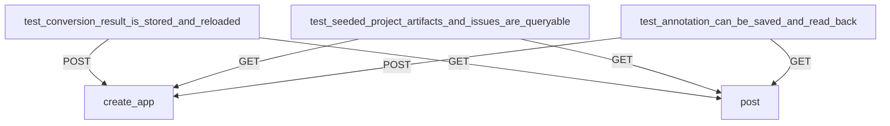

# Other — _bim-control-tests

# _bim-control-tests Module Documentation

## Overview

The **_bim-control-tests** module contains a suite of integration tests for the BIM control API. These tests validate the functionality of the API endpoints related to conversion results, project artifacts, and review data. The tests ensure that the API behaves as expected when interacting with the underlying data structures and services.

## Purpose

The primary purpose of this module is to verify that the API correctly handles requests and responses for various operations, including storing and retrieving conversion results, querying project artifacts, and managing annotations. This module serves as a critical component in maintaining the reliability and correctness of the BIM control system.

## Key Components

### Test Files

1. **test_conversion_results_api.py**
   - Tests the API endpoints related to conversion results.
   - Validates that conversion results can be stored and retrieved correctly.

2. **test_review_data_api.py**
   - Tests the API endpoints related to project artifacts and review data.
   - Validates that project artifacts and issues can be queried and that annotations can be created and retrieved.

### Core Functions

- **create_app(data_root: Path)**: This function initializes the FastAPI application with a specified data root directory. It is called in each test to set up the testing environment.

### Test Cases

#### test_conversion_result_is_stored_and_reloaded

- **Purpose**: Tests the storage and retrieval of conversion results.
- **Flow**:
  1. Sends a POST request to store a conversion result.
  2. Asserts the response status and checks the stored data.
  3. Sends a GET request to retrieve the conversion result and validates the response.

#### test_seeded_project_artifacts_and_issues_are_queryable

- **Purpose**: Tests the querying of seeded project artifacts and issues.
- **Flow**:
  1. Sends a GET request to retrieve projects and validates the response.
  2. Retrieves versions and checks the artifacts and issues associated with a specific model version.

#### test_annotation_can_be_saved_and_read_back

- **Purpose**: Tests the saving and retrieval of annotations.
- **Flow**:
  1. Sends a POST request to create an annotation.
  2. Asserts the response and checks that the annotation can be retrieved.

## Execution Flow

The tests in this module interact with the FastAPI application created by the `create_app` function. Each test initializes a new instance of the application with a temporary data directory, allowing for isolated testing of API functionality.

## Integration with the Codebase

The tests rely on the FastAPI application defined in the `app.main` module. The API endpoints tested are expected to be implemented in the main application, which handles the business logic and data storage. The tests ensure that the API correctly interfaces with the underlying data models and services, providing a safety net for future changes to the codebase.

## Conclusion

The **_bim-control-tests** module is essential for ensuring the integrity of the BIM control API. By validating key functionalities through integration tests, it helps maintain a robust and reliable system. Developers contributing to the API should ensure that any changes are accompanied by appropriate tests in this module to uphold the quality of the application.
