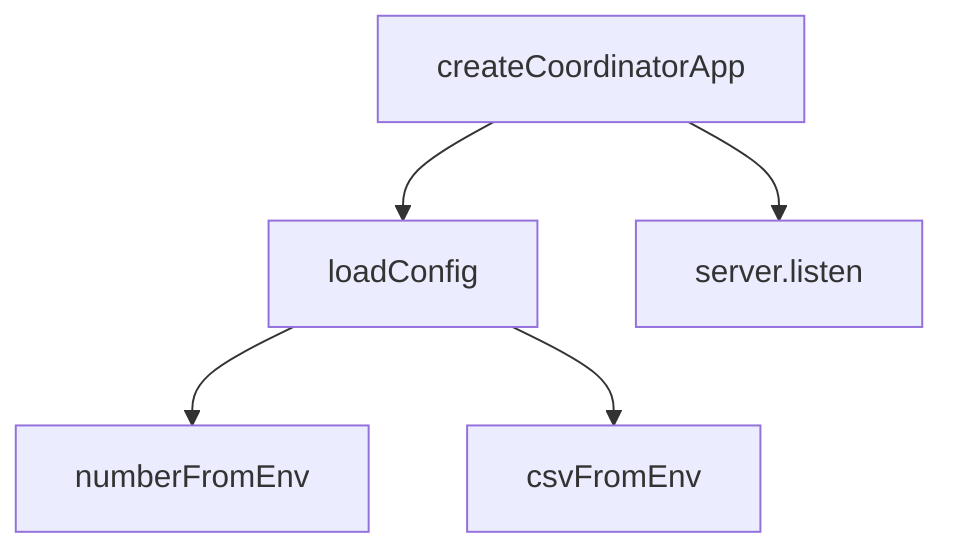

# Other — bim-review-coordinator-src

# bim-review-coordinator-src Module Documentation

## Overview

The `bim-review-coordinator-src` module is designed to facilitate the coordination of BIM (Building Information Modeling) review processes. It serves as a backend service that manages configurations, initializes the application, and listens for incoming requests. The module is built using TypeScript and leverages environment variables for configuration management.

## Key Components

### 1. Configuration Management

The configuration management is handled in the `config.ts` file. It defines the `CoordinatorConfig` interface and provides functions to load configuration settings from environment variables.

#### CoordinatorConfig Interface

The `CoordinatorConfig` interface outlines the structure of the configuration object, which includes:

- `host`: The hostname for the server.
- `port`: The port number for the server.
- `bimControlApiBase`: Base URL for the BIM control API.
- `conversionApiBase`: Base URL for the conversion API.
- `kitStreamServer`: Address of the kit stream server.
- `kitSignalingPort`: Port for signaling.
- `kitMediaServer`: Address of the kit media server.
- `devAuthToken`: Development authentication token.
- `sessionStoreDir`: Directory for session storage.
- `eventLogDir`: Directory for event logs.
- `corsOrigins`: Array of allowed CORS origins.

#### Configuration Loading Functions

- **loadConfig(overrides: Partial<CoordinatorConfig> = {})**: Loads the configuration from environment variables, providing default values where necessary. It accepts an optional `overrides` parameter to allow for manual configuration.

- **numberFromEnv(name: string, fallback: number)**: Retrieves a number from the environment variables, returning a fallback value if the variable is not set or is invalid.

- **csvFromEnv(name: string, fallback: string[])**: Retrieves a comma-separated list from the environment variables, returning a fallback array if the variable is not set.

### 2. Application Initialization

The entry point of the module is defined in the `index.ts` file. It initializes the application by calling the `createCoordinatorApp` function from the `app.ts` file.

#### Application Startup

- **createCoordinatorApp()**: This function is responsible for setting up the application, including loading the configuration and initializing the server. The server listens on the specified host and port, and logs a message indicating that it is running.

### Execution Flow

The execution flow of the application can be summarized as follows:

1. The application starts by executing the `index.ts` file.
2. The `createCoordinatorApp` function is called, which in turn calls `loadConfig` to retrieve the configuration settings.
3. The `loadConfig` function utilizes `numberFromEnv` and `csvFromEnv` to parse environment variables and construct the configuration object.

## Environment Variables

To configure the application, the following environment variables can be set:

- `HOST`: The hostname for the server (default: `127.0.0.1`).
- `PORT`: The port number for the server (default: `8004`).
- `BIM_CONTROL_API_BASE`: Base URL for the BIM control API (default: `http://127.0.0.1:8001`).
- `CONVERSION_API_BASE`: Base URL for the conversion API (default: `http://127.0.0.1:8003`).
- `KIT_STREAM_SERVER`: Address of the kit stream server (default: `127.0.0.1`).
- `KIT_SIGNALING_PORT`: Port for signaling (default: `49100`).
- `KIT_MEDIA_SERVER`: Address of the kit media server (default: `127.0.0.1`).
- `DEV_AUTH_TOKEN`: Development authentication token (default: `dev-token`).
- `SESSION_STORE_DIR`: Directory for session storage (default: `./data/sessions`).
- `EVENT_LOG_DIR`: Directory for event logs (default: `./data/events`).
- `CORS_ORIGINS`: Comma-separated list of allowed CORS origins (default: `http://127.0.0.1:5173,http://localhost:5173`).

## Conclusion

The `bim-review-coordinator-src` module is a foundational component for managing BIM review processes. By leveraging environment variables for configuration and providing a clear structure for application initialization, it allows developers to easily customize and extend the functionality as needed. Understanding the configuration management and application startup flow is crucial for contributing to this module effectively.
