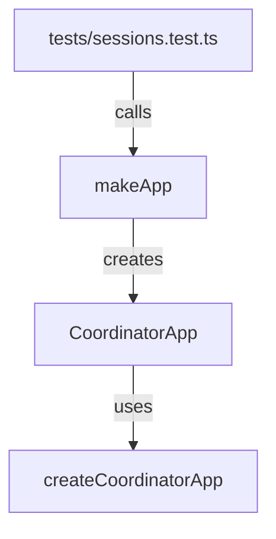

# Other — bim-review-coordinator-tests

# bim-review-coordinator-tests Module Documentation

## Overview

The `bim-review-coordinator-tests` module is designed to provide automated tests for the `bim-review-coordinator` application. It leverages the Vitest testing framework to validate the functionality of the review session management features, ensuring that the application behaves as expected under various scenarios.

## Purpose

The primary purpose of this module is to verify the following functionalities of the `bim-review-coordinator` application:

- Health check endpoint
- Creation of review sessions
- Joining participants to review sessions
- Event handling within review sessions

By running these tests, developers can ensure that changes to the application do not introduce regressions or break existing functionality.

## Key Components

### 1. Test Setup

The test suite is structured using Vitest's `describe` and `it` functions. Each test case is encapsulated within an `it` block, while related tests are grouped under a `describe` block.

#### `makeApp` Function

The `makeApp` function is responsible for creating a new instance of the `CoordinatorApp` for each test. It sets up temporary directories for session storage and event logging, ensuring that tests do not interfere with each other.

```typescript
function makeApp(): CoordinatorApp {
  const root = fs.mkdtempSync(path.join(os.tmpdir(), "bim-review-coordinator-test-"));
  active = createCoordinatorApp({
    sessionStoreDir: path.join(root, "sessions"),
    eventLogDir: path.join(root, "events"),
    bimControlApiBase: "http://127.0.0.1:1",
    corsOrigins: ["http://127.0.0.1:5173"],
  });
  return active;
}
```

### 2. Test Cases

The module contains several test cases that cover different aspects of the application:

#### Health Check Test

This test verifies that the health check endpoint returns a status of `200` and the expected response body.

```typescript
it("returns health", async () => {
  const app = makeApp();
  const response = await request(app.app).get("/health");

  expect(response.status).toBe(200);
  expect(response.body.status).toBe("ok");
  expect(response.body.kit_signaling_port).toBe(49100);
});
```

#### Review Session Creation and Stream Configuration

This test checks the creation of a review session and verifies the stream configuration associated with it.

```typescript
it("creates a review session and stream config", async () => {
  const app = makeApp();
  const created = await request(app.app)
    .post("/api/review-sessions")
    .send({
      project_id: "project_demo_001",
      model_version_id: "version_demo_001",
      created_by: "dev_user_001",
    });

  expect(created.status).toBe(200);
  expect(created.body.session_id).toMatch(/^review_session_/);
  expect(created.body.kit_instance.signaling_port).toBe(49100);

  const config = await request(app.app).get(`/api/review-sessions/${created.body.session_id}/stream-config`);
  expect(config.status).toBe(200);
  expect(config.body.webrtc.signalingPort).toBe(49100);
  expect(config.body.model.status).toBe("missing");
});
```

#### Participant Joining and Event Handling

This test validates that participants can join a review session and that events can be appended and retrieved correctly.

```typescript
it("joins participants and appends events", async () => {
  const app = makeApp();
  const created = await request(app.app)
    .post("/api/review-sessions")
    .send({
      project_id: "project_demo_001",
      model_version_id: "version_demo_001",
      created_by: "dev_user_001",
    });

  const joined = await request(app.app)
    .post(`/api/review-sessions/${created.body.session_id}/join`)
    .send({ user_id: "dev_user_001", display_name: "Dev User" });

  expect(joined.status).toBe(200);
  expect(joined.body.participants).toHaveLength(1);

  const event = await request(app.app)
    .post(`/api/review-sessions/${created.body.session_id}/events`)
    .send({ type: "highlightRequest", issue_id: "ISSUE-DEMO-001" });
  expect(event.status).toBe(200);

  const events = await request(app.app).get(`/api/review-sessions/${created.body.session_id}/events`);
  expect(events.status).toBe(200);
  expect(events.body.items.some((item: { type: string }) => item.type === "highlightRequest")).toBe(true);
});
```

## Execution Flow

The tests in this module interact with the `CoordinatorApp` created by the `createCoordinatorApp` function from the `src/app.js` file. Each test case initializes a new application instance, performs API requests, and validates the responses.



## Conclusion

The `bim-review-coordinator-tests` module is essential for maintaining the integrity of the `bim-review-coordinator` application. By providing a comprehensive suite of tests, it enables developers to confidently make changes and enhancements to the codebase while ensuring that core functionalities remain intact.
