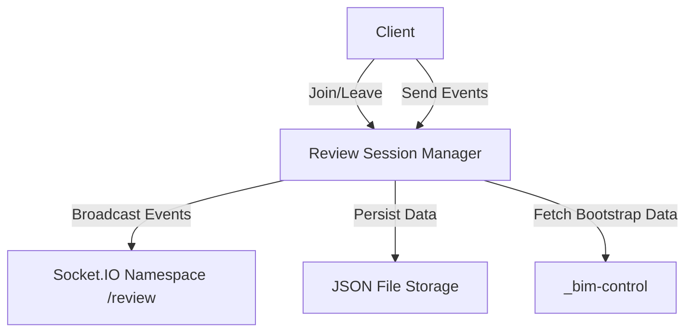

# Other — bim-review-coordinator

# BIM Review Coordinator

The **BIM Review Coordinator** module serves as a local control plane for managing review sessions within the AI-BIM governance workspace. It facilitates the creation, management, and broadcasting of review sessions, ensuring that users can effectively collaborate on Building Information Modeling (BIM) projects.

## Purpose

The primary responsibilities of the BIM Review Coordinator include:

- Creating and persisting local review sessions.
- Providing a fixed Kit/WebRTC endpoint for development purposes.
- Proxying artifact and issue bootstrap data from the `_bim-control` module.
- Broadcasting review-room events over the Socket.IO namespace `/review`.
- Persisting short-lived session events as JSON files for later retrieval.

## Installation and Setup

To set up the BIM Review Coordinator, follow these steps:

1. Install the necessary dependencies:
   ```powershell
   npm install
   ```

2. Build the project:
   ```powershell
   npm run build
   ```

3. Run tests to ensure everything is functioning correctly:
   ```powershell
   npm test
   ```

4. Start the development server:
   ```powershell
   npm run dev
   ```

The service will be available at the default URL:
```
http://127.0.0.1:8004
```

## Key Endpoints

The module exposes several RESTful API endpoints for managing review sessions:

| Method | Endpoint                                      | Description                                      |
|--------|-----------------------------------------------|--------------------------------------------------|
| GET    | `/health`                                    | Check the health status of the service.          |
| POST   | `/api/review-sessions`                       | Create a new review session.                     |
| GET    | `/api/review-sessions/{session_id}`         | Retrieve details of a specific review session.   |
| POST   | `/api/review-sessions/{session_id}/join`    | Join a specific review session.                  |
| POST   | `/api/review-sessions/{session_id}/leave`   | Leave a specific review session.                 |
| GET    | `/api/review-sessions/{session_id}/stream-config` | Get stream configuration for a session.      |
| GET    | `/api/review-sessions/{session_id}/events`  | Retrieve events for a specific session.          |
| POST   | `/api/review-sessions/{session_id}/events`  | Create a new event for a specific session.       |
| GET    | `/api/model-versions/{model_version_id}/review-bootstrap` | Get bootstrap data for a model version. |

### Socket.IO Namespace

The module utilizes Socket.IO for real-time communication, specifically under the namespace:
```
/review
```
This allows for broadcasting events related to review sessions, enabling real-time updates for connected clients.

## Key Components

### 1. Review Session Management

The core functionality revolves around managing review sessions. The following functions are critical:

- **Create Review Session**: Initiates a new session and stores it in a persistent format.
- **Join/Leave Session**: Manages user participation in sessions, updating the session state accordingly.
- **Event Handling**: Captures and processes events related to sessions, allowing for dynamic interaction.

### 2. Data Persistence

Session data and events are stored as JSON files, ensuring that short-lived session information can be retrieved and analyzed later. This is crucial for maintaining a history of interactions and decisions made during review sessions.

### 3. Real-Time Communication

Using Socket.IO, the module broadcasts events to all connected clients, ensuring that participants receive updates in real-time. This is essential for collaborative environments where immediate feedback is necessary.

## Architecture Overview

The following diagram illustrates the high-level architecture of the BIM Review Coordinator module, highlighting its key components and interactions:



## Conclusion

The BIM Review Coordinator module is a vital component of the AI-BIM governance workspace, enabling efficient management of review sessions and facilitating real-time collaboration. By understanding its endpoints, key components, and architecture, developers can effectively contribute to and enhance the functionality of this module.
