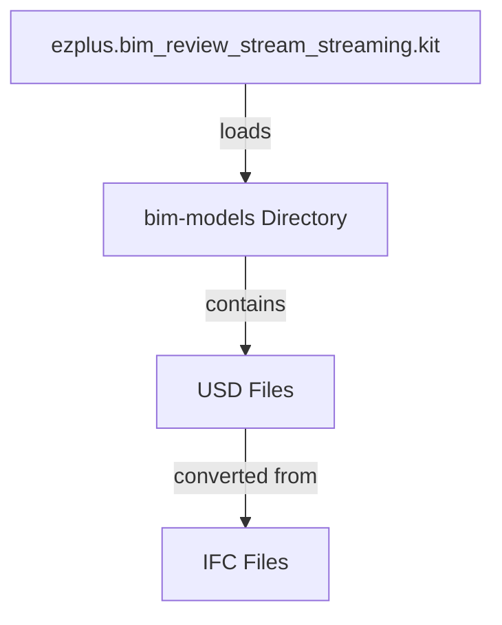

# Other — bim-streaming-server-bim-models

# bim-models Module Documentation

## Overview

The **bim-models** module serves as a storage directory for USD (Universal Scene Description) models utilized by the `ezplus.bim_review_stream_streaming.kit`. This module facilitates the loading of USD files through command-line parameters or events, enabling seamless integration with the BIM review streaming process.

## Purpose

The primary purpose of the **bim-models** module is to provide a dedicated location for USD files that can be loaded into the BIM streaming server. This module ensures that the USD files are organized, easily accessible, and compliant with the project's guidelines.

## Directory Structure

The **bim-models** directory is structured to contain only USD files with the following extensions:
- `.usd`
- `.usda`
- `.usdc`
- `.usdz`

### Important Rules
- **Version Control**: USD files are not included in version control. The entire `/bim-models/*` directory is excluded from Git tracking, except for `.gitkeep` and `README.md`.
- **File Sharing**: For cross-machine or team sharing, utilize Nucleus or external object storage solutions instead of committing USD files to the repository.

## Workflow for USD Generation

To convert IFC (Industry Foundation Classes) files to USD format, follow the process outlined in the document [`docs/plan-bim-ifc-usd-streaming-2026-04-27.md`](../docs/plan-bim-ifc-usd-streaming-2026-04-27.md). The conversion involves using USD Composer and CAD Importer tools to generate `.usd` or `.usdc` files, which are then saved in the **bim-models** directory.

## Loading the Server

To load the server with a specific USD file, execute the following command from the repository root:

```powershell
.\repo.bat launch -n ezplus.bim_review_stream_streaming.kit -- --no-window --/app/auto_load_usd=C:/Repos/active/iot/AI-BIM-governance/bim-streaming-server/bim-models/<file>.usd
```

Replace `<file>` with the name of the desired USD file. This command initializes the BIM streaming server and automatically loads the specified USD model.

## Integration with the Codebase

The **bim-models** module interacts with the `ezplus.bim_review_stream_streaming.kit`, which is responsible for handling the streaming of BIM data. The loading of USD files is triggered either through command-line arguments or via the `openStageRequest` event, allowing for dynamic model loading during runtime.

### Mermaid Diagram



## Conclusion

The **bim-models** module is a crucial component of the BIM streaming architecture, providing a structured approach to managing USD files. By adhering to the outlined rules and workflows, developers can ensure efficient collaboration and integration within the BIM review streaming environment. For further details on the conversion process from IFC to USD, refer to the specified documentation.
