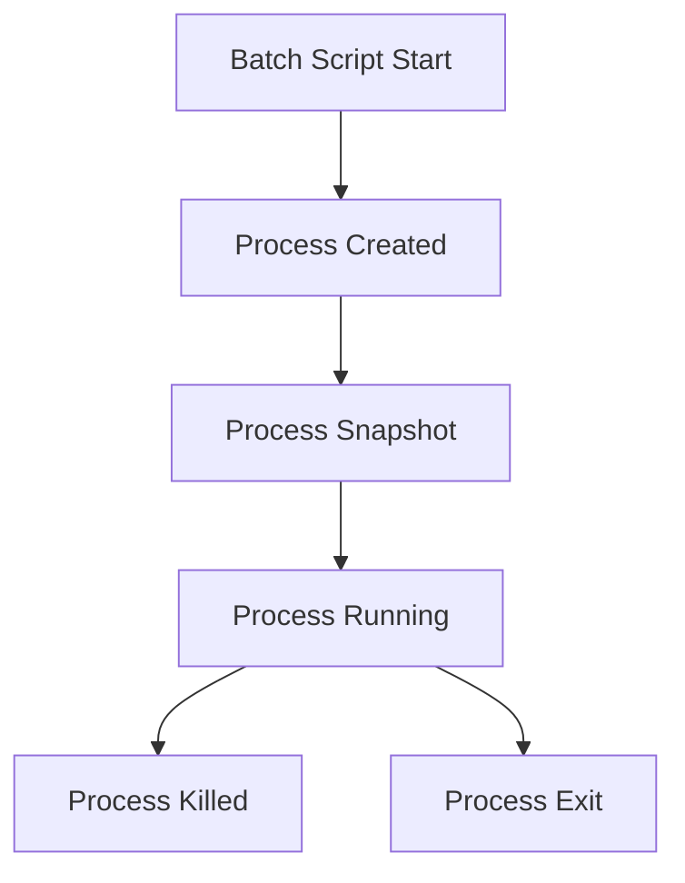

# Other — bim-streaming-server-_debug

# Other — bim-streaming-server-_debug Module Documentation

## Overview

The **bim-streaming-server-_debug** module is designed to facilitate debugging and tracing of the execution of batch scripts related to the BIM streaming server. It captures detailed information about the processes initiated by the server, including their lifecycle events, command-line arguments, and execution context. This module is essential for developers who need to diagnose issues or understand the behavior of the server during runtime.

## Purpose

The primary purpose of this module is to log and analyze the execution of batch scripts that are part of the BIM streaming server's operation. By capturing process events, developers can trace the execution flow, identify failures, and optimize performance.

## Key Components

### 1. JSON Trace Files

The module generates JSON trace files that contain detailed logs of the execution of batch scripts. Each trace file includes:

- **batchPath**: The path to the batch script being executed.
- **workingDirectory**: The directory from which the script is executed.
- **watchRoot**: The root directory being monitored for changes.
- **arguments**: Command-line arguments passed to the script.
- **timeoutSeconds**: The maximum time allowed for the script to run.
- **createdAt**: Timestamp of when the trace was created.
- **events**: An array of events that occurred during the execution, including process start, snapshots, and exit.

### 2. Event Types

The module captures several types of events during the execution of the batch scripts:

- **process-start**: Indicates when a process is initiated.
- **process-created**: Indicates when a new process is created.
- **process-snapshot**: Captures the state of a process at a specific point in time.
- **process-killed**: Indicates when a process is terminated.
- **process-exit**: Indicates when a process has completed execution and provides the exit code.

### 3. Example Event Structure

An example of an event captured in the trace file:

```json
{
  "timestamp": "2026-04-24T17:11:00.0354719+08:00",
  "type": "process-start",
  "path": "c:\\Repos\\active\\iot\\bim-streaming-server\\_build\\windows-x86_64\\release\\ezplus.bim_review_stream_streaming.kit.bat",
  "extra": {
    "rootPid": 36408,
    "workingDirectory": "c:\\Repos\\active\\iot\\bim-streaming-server",
    "arguments": "--no-window"
  }
}
```

## Execution Flow

The module does not have any internal or outgoing calls, nor does it have any defined execution flows. Instead, it operates by logging events as they occur during the execution of batch scripts. The following diagram illustrates the lifecycle of a batch script as captured by the module:



## Integration with the Codebase

The **bim-streaming-server-_debug** module is integrated into the BIM streaming server's architecture by being invoked during the execution of batch scripts. It does not directly interact with other modules but serves as a logging utility that can be referenced by developers for debugging purposes.

### Usage

To utilize this module, developers should ensure that the batch scripts are executed with the appropriate arguments and that the module is configured to capture the necessary events. The generated JSON trace files can then be analyzed to diagnose issues or optimize performance.

## Conclusion

The **bim-streaming-server-_debug** module is a vital tool for developers working on the BIM streaming server. By providing detailed logs of batch script execution, it enables effective debugging and performance analysis, ultimately contributing to a more robust and efficient server operation.
