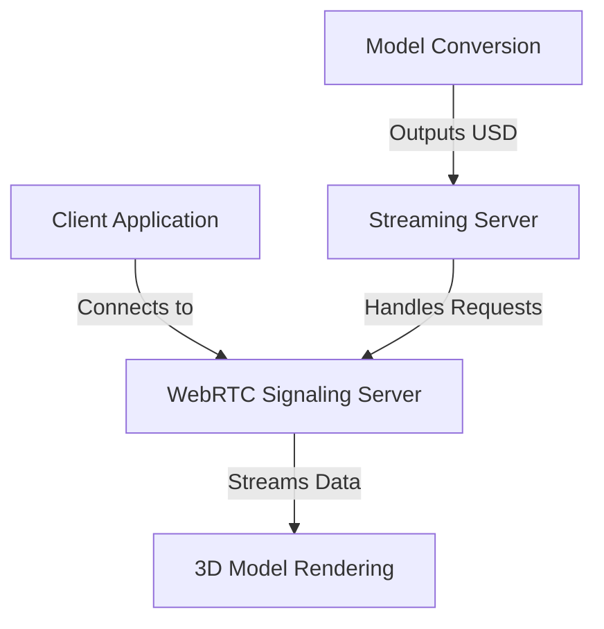

# Other — bim-streaming-server-docs

# bim-streaming-server Documentation

## Overview

The **bim-streaming-server** module is designed to facilitate real-time streaming of Building Information Modeling (BIM) data using WebRTC technology. It serves as a bridge between the server-side processing of BIM data and client-side rendering in web applications. This module is part of the NVIDIA Omniverse ecosystem, leveraging its capabilities for high-performance graphics and real-time collaboration.

## Purpose

The primary purpose of the bim-streaming-server is to:
- Stream 3D models and associated data in real-time to web clients.
- Enable interactive visualization of BIM data in a browser environment.
- Support dynamic loading and switching of models without restarting the server.

## Key Components

### 1. Server Application

The server application is defined in the `source/apps/ezplus.bim_review_stream_streaming.kit` file. It is responsible for:
- Initializing the WebRTC signaling server.
- Handling incoming client connections.
- Streaming media data to connected clients.

### 2. Client Application

The client application, located in the sibling repository `web-viewer-sample`, connects to the streaming server and renders the received data. It is responsible for:
- Establishing a WebRTC connection to the server.
- Displaying the streamed 3D models in a web interface.
- Handling user interactions and sending requests to the server for model updates.

### 3. Model Conversion

The module includes a helper application defined in `source/apps/ezplus.bim_ifc_usd_converter.kit`, which is used to convert IFC files to USD format. This conversion is essential for the server to load and stream the models effectively.

### 4. Configuration Files

- **repo.toml**: Contains configuration settings for the repository, including app definitions and dependencies.
- **premake5.lua**: Defines the build configuration for the server application.

### 5. Scripts

Several PowerShell scripts are provided to facilitate common tasks:
- `convert-ifc-to-usdc.ps1`: Converts IFC files to USD format.
- `start-streaming-server.ps1`: Launches the streaming server with specified parameters.

## How It Works

### Execution Flow

1. **Model Conversion**: Before starting the server, the user runs the `convert-ifc-to-usdc.ps1` script to convert BIM models from IFC to USD format. The output is stored in the `bim-models/` directory.

2. **Server Initialization**: The server is launched using the command:
   ```powershell
   .\repo.bat launch -n ezplus.bim_review_stream_streaming.kit -- --no-window
   ```
   This command initializes the WebRTC signaling server and prepares it to accept client connections.

3. **Client Connection**: The client application connects to the server using the specified signaling port (49100). It sends a request to load a specific USD model.

4. **Streaming Data**: Once the model is loaded, the server streams the 3D data to the client, which renders it in the browser. The client can dynamically switch between models using the `openStageRequest` event.

### Mermaid Diagram



## Integration with the Codebase

The bim-streaming-server module integrates with the broader NVIDIA Omniverse ecosystem, allowing for seamless interaction with other components such as:
- **Omni.kit**: Provides the underlying framework for building applications and managing resources.
- **WebRTC**: Enables real-time communication and streaming capabilities.
- **Nucleus**: Facilitates asset management and sharing across different users and applications.

## Best Practices

- Always run the `convert-ifc-to-usdc.ps1` script before starting the server to ensure that the latest models are available for streaming.
- Use the `--no-window` flag when launching the server to avoid issues related to windowed mode, which can affect streaming performance.
- Regularly check the server logs for any errors or warnings that may indicate issues with the streaming process.

## Troubleshooting

Common issues and their resolutions include:
- **FrameGrabFailed**: Ensure that the server is running with the `--no-window` option and that the client does not hard-code dimensions for the video stream.
- **NoVideoPacketsReceivedEver**: Verify that the server is correctly streaming data and that the client is properly connected.
- **Device lost**: Check the GPU settings and ensure that the server is running in an interactive desktop session.

## Conclusion

The bim-streaming-server module is a critical component for enabling real-time streaming of BIM data in web applications. By following the outlined procedures and best practices, developers can effectively utilize this module to create interactive and visually rich experiences for users.
