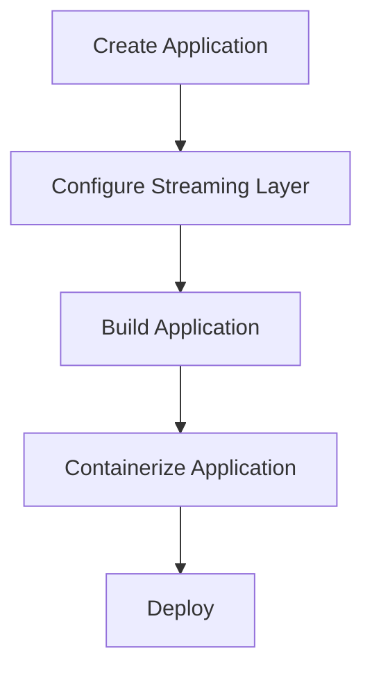

# Other — bim-streaming-server-readme-assets

# bim-streaming-server Module Documentation

## Overview

The **bim-streaming-server** module is designed to facilitate the development and deployment of streaming-ready applications within the NVIDIA Omniverse Kit framework. It provides tools and configurations necessary for creating applications that can efficiently stream content, particularly in cloud environments like NVIDIA DGX Cloud.

## Purpose

The primary purpose of this module is to streamline the process of building, configuring, and deploying applications that leverage streaming technologies. It allows developers to create applications that can handle real-time data and media streaming, optimizing performance and user experience.

## Key Components

### 1. Data Collection & Use

The module includes functionality for collecting anonymous usage data to improve software performance and diagnostics. This data collection is crucial for understanding user interactions and optimizing application performance.

#### Configuration

To disable data collection, modify the `.kit` file as follows:

```toml
[settings.telemetry]
enableAnonymousData = false
```

### 2. Developer Bundle Extensions

The **Developer Bundle** (`omni.kit.developer.bundle`) provides a suite of tools for enhancing the development experience. Key utilities include:

- **Extensions Manager**: Manage available extensions and dependencies.
- **Command History**: Capture command history for debugging.
- **Script Editor**: Run and test code snippets directly.
- **VS Code Integration**: Debug Python code using VS Code.
- **Debug Settings**: View and modify extension settings.

### 3. Application Streaming Configuration

The module supports the creation of streaming-ready applications through specific configurations. Developers can choose from various application templates, each tailored for different use cases, such as local streaming or cloud deployment.

#### Streaming Layer Selection

When creating an application, select the appropriate streaming layer based on the Kit version:

| Kit Version | Layer to Select | Generated File |
|-------------|-----------------|----------------|
| 108.x+      | `nvcf_streaming`| `{app_name}_nvcf.kit` |
| 107.x       | `ovc_streaming` | `{app_name}_ovc.kit` |
| 106.x       | `ovc_streaming` | `{app_name}_ovc.kit` |

### 4. Containerization

The module includes tools for packaging applications into container images, facilitating deployment in cloud environments. The containerization process involves:

1. Creating a fat package of all dependencies.
2. Trimming unused extensions to minimize image size.
3. Splitting into Docker layers for efficient rebuilds.

#### Command Example

To create a container image, use:

```bash
./repo.sh package_container --image-tag myapp:v1.0
```

### 5. Tooling Guide

The module provides a set of command-line tools to assist in the development workflow:

- **Template Tool**: Create new applications or extensions.
- **Build Tool**: Compile the application.
- **Launch Tool**: Start the application for testing.
- **Test Tool**: Run automated tests on the application.
- **Package Tool**: Prepare the application for distribution.

## How It Connects to the Codebase

The **bim-streaming-server** module integrates with the broader Omniverse Kit ecosystem, allowing developers to leverage existing functionalities while extending capabilities for streaming applications. The module's components interact with the Kit SDK, enabling seamless data flow and application management.

### Execution Flow

The execution flow for creating a streaming application typically follows these steps:

1. **Create Application**: Use the template tool to scaffold a new application.
2. **Configure Streaming Layer**: Select the appropriate streaming layer during application creation.
3. **Build Application**: Compile the application using the build tool.
4. **Containerize Application**: Package the application into a container for deployment.
5. **Deploy**: Upload the container to a cloud service or run locally.



## Additional Resources

- [NVIDIA DGX Cloud Documentation](https://docs.omniverse.nvidia.com/omniverse-dgxc/latest/)
- [Kit SDK Companion Tutorial](https://docs.omniverse.nvidia.com/kit/docs/kit-app-template/latest/docs/intro.html)
- [Containerization Guide](https://docs.omniverse.nvidia.com/omniverse-dgxc/latest/develop-ov-dgxc/containerization.html)

## Conclusion

The **bim-streaming-server** module is a vital component for developers looking to create and deploy streaming applications within the NVIDIA Omniverse ecosystem. By leveraging its tools and configurations, developers can enhance their applications' performance and user experience while simplifying the deployment process.
