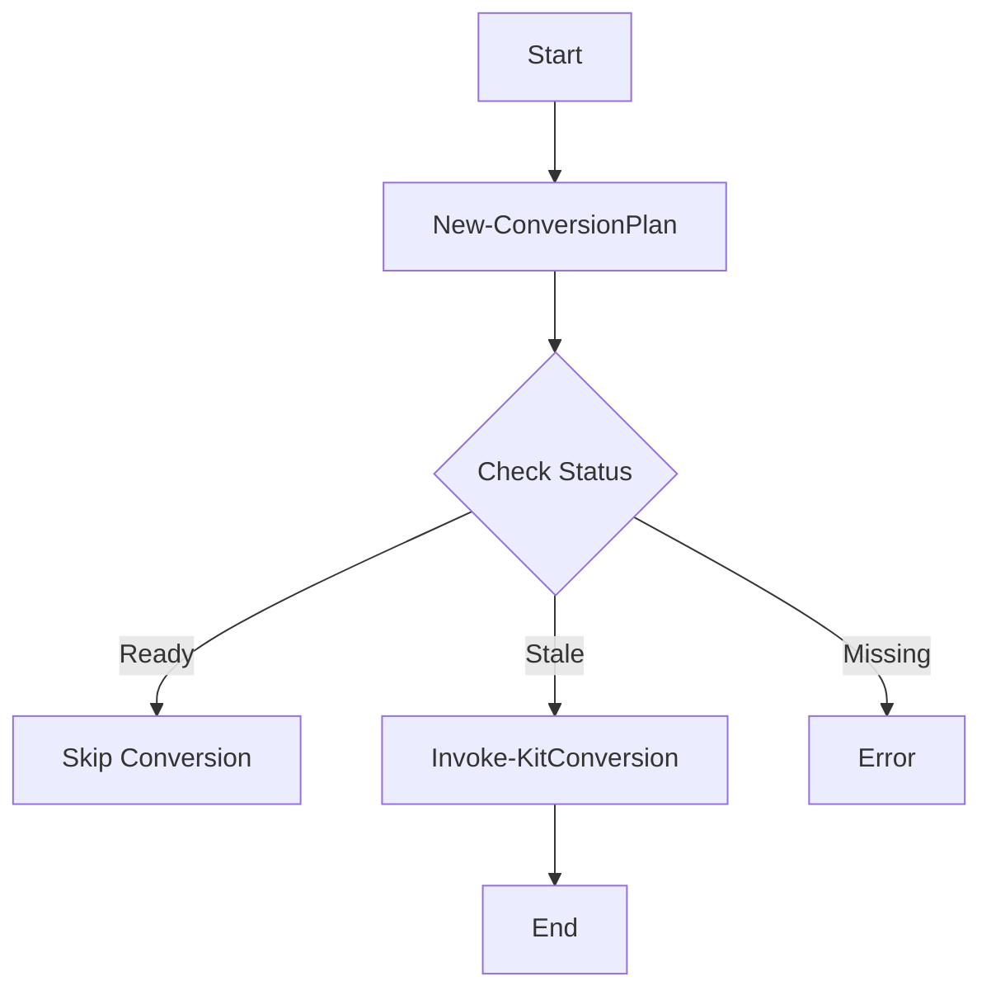

# Other — bim-streaming-server-scripts

# bim-streaming-server-scripts Module Documentation

## Overview

The **bim-streaming-server-scripts** module provides a set of scripts designed to facilitate the conversion of IFC (Industry Foundation Classes) files to USDC (Universal Scene Description) format, as well as tools for inspecting USD stages. This module is essential for users working with BIM (Building Information Modeling) data in a streaming context, enabling efficient data transformation and validation.

## Key Components

### 1. **convert-ifc-to-usdc.ps1**

This PowerShell script is the primary tool for converting IFC files to USDC format. It accepts various parameters to customize the conversion process, including input file paths, output names, and configuration paths.

#### Key Functions

- **ConvertTo-AbsolutePath**: Converts relative paths to absolute paths based on the script's root directory.
- **Resolve-IfcInputs**: Resolves input IFC file patterns and validates their existence.
- **Expand-OutputName**: Generates output file names based on a template and the source file's name.
- **Find-KitExe**: Locates the Kit executable required for the conversion process.
- **Invoke-KitConversion**: Executes the conversion using the Kit executable and handles process management.

#### Execution Flow

The script begins by creating a conversion plan based on the provided IFC files. It checks the status of each file (missing, stale, or ready) and invokes the conversion process for files that are not up-to-date.

### 2. **inspect-usd-stage-and-quit.py**

This Python script inspects a USD stage and outputs metadata about the USD primitives. It is useful for validating the structure and content of USD files.

#### Key Functions

- **main**: The entry point that parses command-line arguments and orchestrates the inspection process.
- **_inspect_attributes**: Gathers attributes from USD primitives and checks for candidate GUIDs.
- **_identifier_candidates**: Identifies potential identifiers from metadata and attributes.

#### Execution Flow

The script opens a USD file, traverses its primitives, and collects metadata, attributes, and potential identifiers. The results are saved in a JSON format.

### 3. **kit-cad-convert-and-quit.py**

This script acts as a wrapper for the CAD conversion process, allowing the execution of a specified processing script with input and output paths.

#### Key Functions

- **main**: Parses arguments and runs the specified processing script.
- **Error Handling**: Captures and logs errors during the conversion process.

### 4. **start-streaming-server.ps1**

This PowerShell script initializes the environment for the streaming server, checking for necessary conditions such as GPU availability and port availability.

#### Key Functions

- **Initialize-WindowsRuntimeEnvironment**: Sets up the environment variables required for the application.
- **Test-PortFree**: Checks if specified ports are free for use.
- **Test-GpuReady**: Validates that the NVIDIA GPU is available and functioning.

## How It Works

The module operates by first converting IFC files to USDC format using the `convert-ifc-to-usdc.ps1` script. Once the conversion is complete, users can inspect the resulting USD files using `inspect-usd-stage-and-quit.py`. The `kit-cad-convert-and-quit.py` script facilitates the conversion process by executing the necessary commands in the background, while `start-streaming-server.ps1` ensures that the environment is correctly set up for streaming.

## Integration with the Codebase

The scripts in this module are designed to work together seamlessly. The conversion process relies on the Kit executable, which must be built and available in the expected directory structure. The inspection script can be used independently to validate USD files generated from the conversion process.

### Dependencies

- **NVIDIA GPU**: Required for running the streaming server and performing CAD conversions.
- **OmniKit**: The Kit framework is necessary for executing the conversion scripts.

## Conclusion

The **bim-streaming-server-scripts** module is a crucial component for managing BIM data transformations and validations. By providing a robust set of tools for converting and inspecting files, it enhances the workflow for developers and users working with BIM data in a streaming context.
