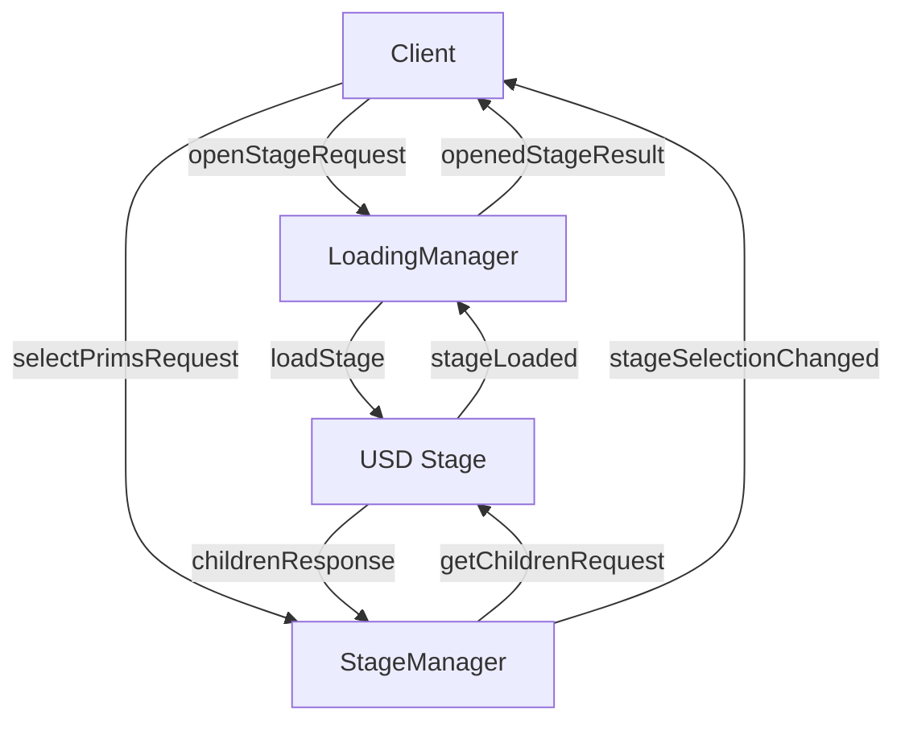

# Other — bim-streaming-server-source

# BIM Streaming Server Source Module Documentation

## Overview

The **BIM Streaming Server Source** module is designed to facilitate the conversion of Industry Foundation Classes (IFC) to Universal Scene Description (USD) formats and to provide an interactive streaming experience for BIM (Building Information Modeling) data. This module leverages NVIDIA's Omniverse platform to enable real-time collaboration and visualization of BIM data across various devices.

## Key Components

### 1. BIM IFC to USD Converter

- **Package Name**: `ezplus.bim_ifc_usd_converter`
- **Version**: `0.1.0`
- **Description**: A headless application that utilizes NVIDIA CAD Converter extensions to convert IFC files to USD format.
- **Dependencies**:
  - `omni.kit.telemetry`
  - `omni.kit.converter.cad`
  - `omni.kit.converter.hoops_core`
  - `omni.services.convert.cad`

#### Configuration

The converter is configured through a `TOML` file that specifies its dependencies, settings, and environment configurations. Key settings include:

- `fastShutdown`: Enables quick shutdown of the application.
- `registryEnabled`: Allows the extension registry to be enabled.

### 2. BIM Review Stream

- **Package Name**: `ezplus.bim_review_stream`
- **Version**: `0.1.0`
- **Description**: An interactive application that streams BIM data using OpenUSD, allowing bi-directional communication between the server and client devices.
- **Dependencies**:
  - Various `omni.kit` modules for animation, rendering, and UI management.

#### Configuration

Similar to the converter, the review stream is configured via a `TOML` file. Important settings include:

- `viewport.autoFrame.mode`: Controls the auto-framing behavior of the viewport.
- `renderer.resolution`: Sets the resolution for the streamed content.

### 3. BIM Review Stream Streaming

- **Package Name**: `ezplus.bim_review_stream_streaming`
- **Version**: `0.1.0`
- **Description**: Configuration for streaming deployments of the BIM Review Stream application.
- **Dependencies**:
  - `ezplus.bim_review_stream`
  - `omni.kit.livestream.app`

### 4. Messaging Extension

- **Package Name**: `ezplus.bim_review_stream.messaging`
- **Version**: `0.1.0`
- **Description**: Handles messaging between the server and client, facilitating communication for stage loading, selection changes, and other events.
- **Key Classes**:
  - `LoadingManager`: Manages the loading of USD stages and sends messages to the client.
  - `StageManager`: Manages stage-related events and interactions.

#### Key Functions

- **LoadingManager**:
  - `_on_open_stage`: Handles requests to open a stage and manages the loading process.
  - `_evaluate_load_status`: Evaluates the loading status and sends updates to the client.

- **StageManager**:
  - `_on_get_children`: Retrieves children of a specified USD primitive.
  - `_on_select_prims`: Selects specified primitives in the viewport.

## Execution Flow

The module operates through a series of event-driven interactions. The following sequence outlines the primary flow of operations:

1. **Stage Loading**:
   - The client sends an `openStageRequest` to the `LoadingManager`.
   - The `LoadingManager` processes the request and loads the specified USD stage.
   - Upon completion, it sends an `openedStageResult` message back to the client.

2. **Stage Management**:
   - The `StageManager` listens for selection changes and responds to requests for children of primitives.
   - It updates the client with the current selection state and any changes made.

3. **Messaging**:
   - The messaging extension facilitates communication between the server and client, ensuring that updates are sent in real-time.

### Mermaid Diagram

## Integration with the Codebase

The BIM Streaming Server Source module integrates with the broader Omniverse ecosystem through its dependencies on various `omni.kit` modules. It utilizes the event dispatcher for handling asynchronous events and communicates with the USD context for managing scene data.

### Dependencies

The module relies on several key dependencies, including:

- **Omni Kit**: Provides the foundational framework for building applications within the Omniverse platform.
- **USD**: The Universal Scene Description framework for managing complex 3D scenes.
- **Telemetry**: For monitoring application performance and usage.

## Conclusion

The BIM Streaming Server Source module is a powerful tool for converting and streaming BIM data, enabling real-time collaboration and visualization. Its architecture is designed to be extensible and integrates seamlessly with the Omniverse platform, making it a vital component for developers working with BIM and USD technologies.
