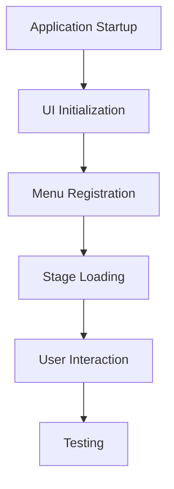

# Other — bim-streaming-server-templates

# bim-streaming-server-templates Module Documentation

## Overview

The **bim-streaming-server-templates** module provides a collection of application templates designed for the NVIDIA Omniverse ecosystem. These templates serve as foundational structures for developers to create various types of applications, including interactive 3D applications, headless services, and streaming configurations. The templates streamline the development process by offering pre-configured setups that can be easily customized and extended.

## Purpose

The primary purpose of this module is to facilitate the rapid development of applications that leverage the capabilities of the Omniverse platform. It includes templates for:

- **Kit Base Editor**: A minimal starting point for creating interactive 3D applications.
- **Kit Service**: A template for building headless services that operate without a graphical user interface.
- **Streaming Configurations**: Templates for configuring applications for streaming deployments.
- **USD Composer**: A template for creating complex OpenUSD scenes.
- **USD Explorer**: A template for visualizing and interacting with large-scale environments.
- **USD Viewer**: A template for creating streaming applications that display USD content.

## Key Components

### 1. Application Templates

Each application template is structured to provide a specific functionality:

- **Kit Base Editor**:
  - **Key Features**: Scene loading, RTX rendering, basic UI for manipulating 3D scenes.
  - **Usage**: Ideal for developers looking to create high-fidelity OpenUSD editing applications.

- **Kit Service**:
  - **Key Features**: Headless operation, extensibility for background processing tasks.
  - **Usage**: Suitable for automation services and batch processing of 3D content.

- **Streaming Configurations**:
  - **Key Features**: Configuration layers for streaming applications.
  - **Usage**: Used in conjunction with base application templates to enable streaming capabilities.

- **USD Composer**:
  - **Key Features**: OpenUSD file aggregation, variant tools, asset packaging.
  - **Usage**: Targeted at configurators and design review applications.

- **USD Explorer**:
  - **Key Features**: Dual-mode UI, annotation tools, CAD converter import.
  - **Usage**: Designed for visualizing complex industrial environments and collaborative design projects.

- **USD Viewer**:
  - **Key Features**: RTX viewport, app streaming, messaging support.
  - **Usage**: Focused on streaming content to front-end clients.

### 2. Configuration Files

Each template includes a `.kit` file that defines the application’s metadata, dependencies, and settings. Key sections include:

- **[package]**: Contains metadata such as title, version, and description.
- **[dependencies]**: Lists required extensions and libraries that the application depends on.
- **[settings]**: Configures application-specific settings, including UI behavior and rendering options.

### 3. Setup and Initialization

The templates include a setup script that initializes the application, registers menus, and manages the application state. Key functions include:

- **on_startup**: Initializes the application and sets up the UI state.
- **_register_my_menu**: Registers custom menus for the application.
- **_load_layout**: Loads the user interface layout based on saved preferences.

### 4. Testing Framework

Each template comes with a testing framework that allows developers to run tests on their applications and extensions. This ensures that the functionality is verified and that any changes do not introduce regressions.

## Execution Flow

The execution flow of the application typically follows these steps:

1. **Startup**: The application is initialized through the `on_startup` function, which sets up the UI and registers necessary components.
2. **Stage Loading**: The application can open a stage using the `_on_open_stage` function, which processes the URL and loads the corresponding scene.
3. **User Interaction**: Users can interact with the application through the UI, which is managed by the `UIStateManager`.
4. **Testing**: Developers can run tests using the provided testing framework to ensure the application behaves as expected.

## Connecting to the Codebase

The **bim-streaming-server-templates** module connects to the broader Omniverse codebase through its dependencies defined in the `.kit` files. Each template relies on various Omniverse extensions, which provide the necessary functionality for rendering, UI management, and scene manipulation.

### Example Dependencies

- **omni.kit.uiapp**: Core UI application framework.
- **omni.hydra.rtx**: RTX rendering capabilities.
- **omni.kit.telemetry**: Telemetry for monitoring application performance.

## Conclusion

The **bim-streaming-server-templates** module serves as a powerful foundation for developers looking to create applications within the NVIDIA Omniverse ecosystem. By leveraging the provided templates, developers can accelerate their development process, ensuring that they can focus on building unique features and functionalities tailored to their specific use cases.
