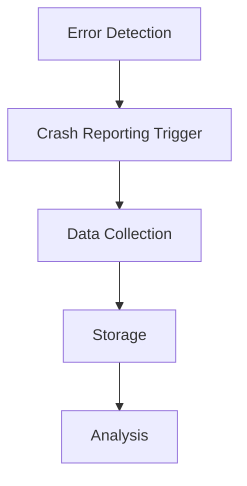

# Other — bim-streaming-server-_testoutput

# bim-streaming-server-_testoutput Module Documentation

## Overview

The **bim-streaming-server-_testoutput** module is designed to handle the output generated during the testing phase of the bim-streaming server application. This module primarily deals with the collection and storage of crash reports, metadata, and other diagnostic information that can be used to analyze failures and improve the stability of the application.

## Purpose

The main purpose of this module is to facilitate the debugging process by capturing detailed information about application crashes and unexpected behaviors. It stores crash dumps and metadata in a structured format, allowing developers to easily access and analyze the data.

## Key Components

### 1. Crashpad Metadata

The module generates metadata files that contain essential information about the application state at the time of a crash. This includes details such as:

- Application version
- Operating system information
- Stack traces
- Memory usage statistics

These metadata files are crucial for diagnosing issues and understanding the context of crashes.

### 2. Crash Reports

Crash reports are generated in the form of dump files, which contain a snapshot of the application's memory at the time of the crash. These files are typically large and include:

- Call stacks
- Thread states
- Loaded modules

The dump files are stored in a designated directory structure, making it easy for developers to locate and analyze them.

### 3. Directory Structure

The output files are organized in a specific directory structure that reflects the date and time of the crash. For example:

```
bim-streaming-server/_testoutput/chrome-profile-YYYYMMDD-HHMMSS/Crashpad/
```

Within this directory, you will find:

- `metadata` files
- `reports` containing the crash dump files

### 4. Integration with the Codebase

The **bim-streaming-server-_testoutput** module integrates with the main application through various logging and error handling mechanisms. When a crash occurs, the application invokes the crash reporting functionality, which captures the necessary data and stores it in the appropriate format.

### 5. Connection to Other Modules

This module interacts with several other components of the bim-streaming server, including:

- **Service Worker**: The service worker manages background tasks and can trigger crash reporting when an error is detected.
- **Main Application Logic**: The main application logic is responsible for handling user interactions and can call the crash reporting functions when exceptions occur.

## Execution Flow

The execution flow of the crash reporting process can be summarized as follows:

1. **Error Detection**: The application detects an error or crash.
2. **Crash Reporting Trigger**: The crash reporting functionality is invoked.
3. **Data Collection**: The application collects relevant metadata and generates a crash dump.
4. **Storage**: The collected data is stored in the designated output directory.
5. **Analysis**: Developers can analyze the stored crash reports and metadata to identify and fix issues.



## Conclusion

The **bim-streaming-server-_testoutput** module plays a critical role in maintaining the reliability of the bim-streaming server application. By capturing and organizing crash reports and metadata, it provides developers with the necessary tools to diagnose and resolve issues effectively. Understanding this module is essential for anyone involved in the development and maintenance of the bim-streaming server.
