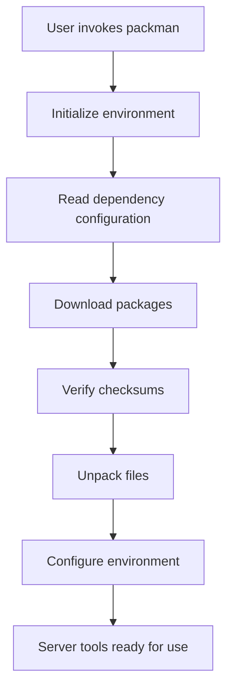

# Other — bim-streaming-server-tools

# bim-streaming-server-tools Module Documentation

## Overview

The **bim-streaming-server-tools** module provides a set of tools and utilities for managing dependencies, packaging, and installation processes within the BIM streaming server ecosystem. It integrates with the Packman package manager to facilitate the installation and management of various components required for the server's operation.

## Purpose

The primary purpose of this module is to streamline the setup and configuration of the BIM streaming server environment. It handles the installation of necessary dependencies, manages versioning, and ensures that the required tools are available for developers and users.

## Key Components

### 1. Dependency Management

The module utilizes several XML configuration files to define dependencies:

- **host-deps.packman.xml**: Specifies host dependencies such as `premake`.
- **kit-sdk-deps.packman.xml**: Contains shared Kit SDK dependencies, including `boost_preprocessor`, `doctest`, `pybind11`, and others.
- **repo-deps.packman.xml**: Lists various repository dependencies required for the server's operation.

These files are parsed to ensure that all necessary components are available during the build and runtime.

### 2. Packaging Scripts

The module includes several scripts for packaging and installation:

- **package.bat** and **package.sh**: These scripts are responsible for invoking the packaging process, which includes calling the `repo` tool to create packages.
- **install_package.py**: A Python script that handles the installation of packages, including verifying checksums and managing temporary directories.

### 3. Configuration Files

The module uses configuration files to manage settings and environment variables:

- **pip.toml**: Defines Python package dependencies and installation paths.
- **config.packman.xml**: Configures remote sources for package downloads.

### 4. Bootstrap Scripts

The **packman/bootstrap** directory contains scripts that set up the environment for the Packman package manager:

- **configure.bat** and **configure.ps1**: These scripts configure the local machine for Packman, setting environment variables and ensuring that the necessary directories exist.
- **fetch_file_from_packman_bootstrap.cmd**: A command script that downloads files from the Packman bootstrap server.

### 5. Command-Line Interface

The module provides a command-line interface (CLI) through the **packman** script, allowing users to interact with the package manager. This includes commands for installing packages, managing dependencies, and configuring the environment.

## Execution Flow

The execution flow of the **bim-streaming-server-tools** module can be summarized as follows:

1. **Initialization**: The user invokes the `packman` script, which initializes the environment and sets up necessary variables.
2. **Dependency Resolution**: The module reads the dependency configuration files to determine which packages need to be installed.
3. **Package Installation**: The installation scripts are executed, which may involve downloading packages, verifying checksums, and unpacking files.
4. **Configuration**: The environment is configured based on the settings defined in the configuration files.
5. **Execution**: The server tools are now ready for use, allowing developers to build and run the BIM streaming server.

## Integration with the Codebase

The **bim-streaming-server-tools** module is tightly integrated with the overall BIM streaming server architecture. It interacts with other components such as:

- **repo**: The module relies on the `repo` tool for managing package installations and updates.
- **Python Environment**: It ensures that the correct version of Python and necessary libraries are available for the server to function correctly.
- **Container Management**: The module can manage Docker containers for applications packaged with the server, allowing for easy deployment and scaling.

## Conclusion

The **bim-streaming-server-tools** module is a crucial part of the BIM streaming server ecosystem, providing essential tools for dependency management, packaging, and configuration. By automating these processes, it enables developers to focus on building and enhancing the server's capabilities without worrying about the underlying setup.
