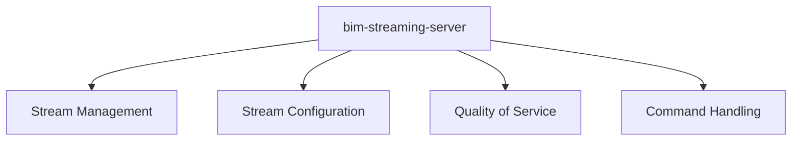

# Other — bim-streaming-server

# bim-streaming-server Module Documentation

## Overview

The **bim-streaming-server** module is designed to facilitate the streaming of Building Information Modeling (BIM) data. It serves as a backend service that manages the transmission of video streams, enabling real-time data access and manipulation for applications that require BIM data visualization and interaction.

## Purpose

The primary purpose of the bim-streaming-server is to provide a robust and efficient server-side solution for streaming BIM-related video content. This module is essential for applications that need to deliver high-quality visualizations of BIM data to end-users, ensuring low latency and high performance.

## Key Components

### 1. Stream Management

The module is responsible for managing multiple video streams, including their configuration and lifecycle. Key attributes include:

- **VideoStreamingDirection**: Indicates the direction of the stream (e.g., Downstream).
- **DynamicMaxBitrateEnabled**: A flag to enable or disable dynamic bitrate adjustments based on network conditions.
- **Transport Policy**: Defines the transport policy for the streams, which can be set to various modes (e.g., All, N/A).

### 2. Stream Configuration

The server allows for detailed configuration of each stream, including:

- **DataChannelMode**: Specifies the mode of the data channel (e.g., DcSCTP).
- **SurfaceBitDepth**: Defines the bit depth of the video stream (e.g., 8 bits).
- **ChromaFormat**: Indicates the color format used in the stream (e.g., RGB).

### 3. Quality of Service (QoS)

The module includes mechanisms to monitor and manage the quality of service for video streams:

- **RL QOS**: A flag indicating whether rate-limiting QoS is enabled for the stream.
- **PacketPacing_Reason**: Provides information on the reason for packet pacing (e.g., StaticPacing).

### 4. Command Handling

The server processes commands related to stream management, including delayed commands and transit selection values. It tracks:

- **Number of delayed commands**: Counts the commands that are pending execution.
- **TransitSelectionValueApplied**: Indicates the selection values applied to the stream.

## Architecture

The bim-streaming-server operates as a standalone service that interacts with client applications through a defined API. It does not have any internal or outgoing calls to other modules, making it a self-contained unit focused solely on streaming functionality.

## Integration with the Codebase

The bim-streaming-server module connects to the broader codebase by providing a streaming service that can be utilized by various client applications. It is designed to be easily integrated with front-end applications that require real-time access to BIM data.

### Usage

To utilize the bim-streaming-server, developers should:

1. **Configure the Server**: Set up the necessary stream parameters such as video direction, bitrate, and transport policy.
2. **Start Streaming**: Initiate the streaming process, allowing clients to connect and receive video data.
3. **Monitor QoS**: Continuously monitor the quality of service and adjust configurations as needed to maintain optimal performance.

## Conclusion

The bim-streaming-server module is a critical component for applications that require efficient streaming of BIM data. Its focus on stream management, configuration, and quality of service ensures that developers can deliver high-quality visualizations to end-users with minimal latency. By understanding its architecture and key components, developers can effectively integrate and extend its functionality within their applications.
