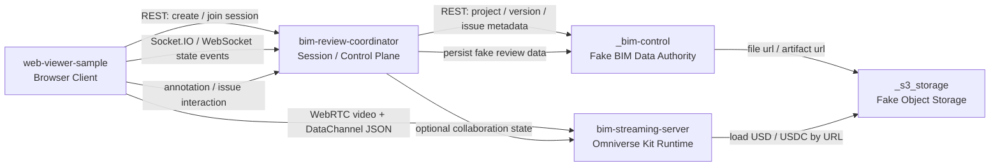
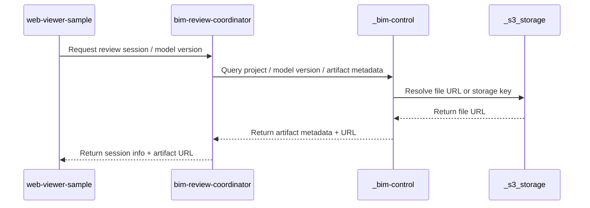
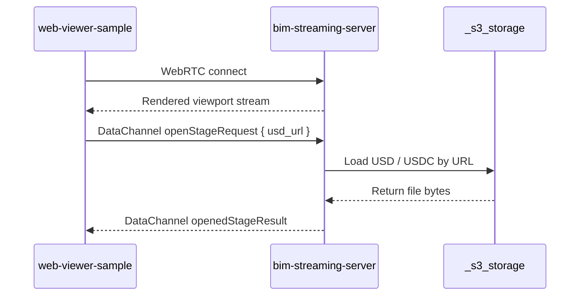
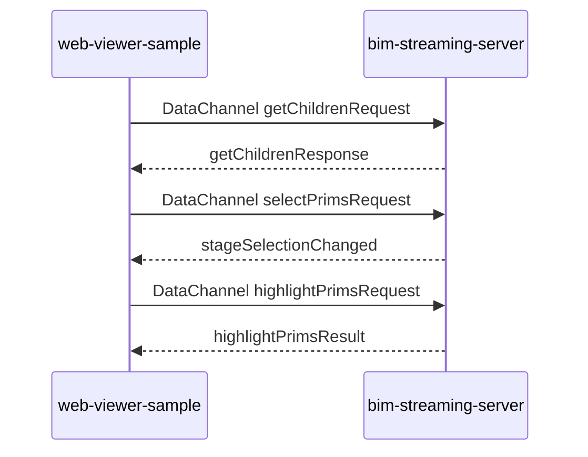
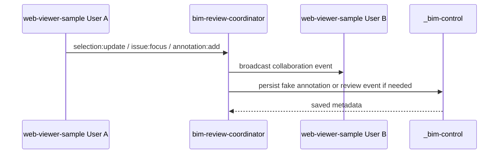
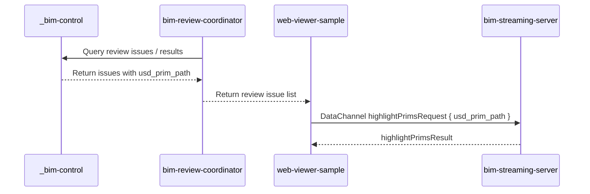

# Other — CLAUDE.md

# CLAUDE Module Documentation

## Purpose

The **CLAUDE** module serves as a comprehensive guide to the architecture and interaction patterns within the `AI-BIM-governance/` workspace. It defines the boundaries, responsibilities, and data flow among five core repositories or folders that are essential for the development of the AI-BIM governance system. This document outlines the roles of each repository, the types of data they manage, and the communication protocols used for interaction.

## Core Repositories Overview

The workspace consists of the following five core repositories:

```
AI-BIM-governance/
├── bim-review-coordinator/
├── bim-streaming-server/
├── web-viewer-sample/
├── _bim-control/
└── _s3_storage/
```

### Repository Roles

- **_bim-control**: Acts as the fake BIM data authority, managing metadata related to projects, models, and reviews.
- **_s3_storage**: Serves as the fake object storage, holding the actual files such as IFC, RVT, and USD.
- **bim-review-coordinator**: Functions as the session control plane, coordinating user interactions and collaboration events.
- **bim-streaming-server**: Provides the Omniverse Kit runtime, handling GPU rendering and streaming of 3D content.
- **web-viewer-sample**: Acts as the browser client, allowing users to interact with the system and view streaming content.

### Interaction Diagram



## Repository Boundaries

### 1. _bim-control/

#### Role
Fake BIM Platform / Fake Data Authority

#### Responsibilities
- Manages project, model version, and artifact metadata.
- Stores issue and annotation metadata.
- Does not handle real Revit plugins, SSO, or GPU instance lifecycle.

### 2. _s3_storage/

#### Role
Fake Object Storage / Local File Storage

#### Responsibilities
- Stores actual files like IFC, RVT, and USD.
- Provides file URLs for the BIM platform.
- Does not manage project logic or user permissions.

### 3. bim-review-coordinator/

#### Role
Session Control Plane / Collaboration Coordinator

#### Responsibilities
- Coordinates review session states and user presence.
- Manages collaboration events and routes data queries.
- Does not handle USD stage loading or rendering.

### 4. bim-streaming-server/

#### Role
Omniverse Kit Runtime / GPU Streaming Server

#### Responsibilities
- Manages USD stage runtime and GPU rendering.
- Handles WebRTC video streams and DataChannel commands.
- Does not manage user permissions or serve as a data authority.

### 5. web-viewer-sample/

#### Role
Browser Client / WebRTC Viewer / User Interaction Layer

#### Responsibilities
- Displays WebRTC streaming content.
- Sends commands to the streaming server and receives state updates.
- Does not manage session lifecycles or save project data.

## Data Types and Ownership

| Data Type | Responsible Repo | Description |
|---|---|---|
| Project metadata | _bim-control | Fake project data |
| Model version metadata | _bim-control | Fake model version data |
| Artifact metadata | _bim-control | Describes file format, URL, and version relationships |
| IFC / RVT / DWG file | _s3_storage | Original model file |
| USD / USDC file | _s3_storage | Derived files for Omniverse runtime |
| Review issue metadata | _bim-control | Fake review issues and locations |
| Annotation metadata | _bim-control | Fake annotations and review records |
| Review session state | bim-review-coordinator | Current session state |
| Collaboration state | bim-review-coordinator | User presence and interaction events |
| USD stage runtime state | bim-streaming-server | Current 3D runtime state |
| Browser UI state | web-viewer-sample | Current UI state |

## Communication Protocols

| Communication Method | Source | Destination | Purpose |
|---|---|---|---|
| REST | web-viewer-sample | bim-review-coordinator | Create/join sessions, query session data |
| REST | bim-review-coordinator | _bim-control | Query metadata |
| WebRTC video | bim-streaming-server | web-viewer-sample | Stream viewport content |
| WebSocket | web-viewer-sample | bim-review-coordinator | Broadcast collaboration events |

## Core Data Flows

### Artifact Discovery Flow



### Streaming Flow



### Scene Interaction Flow



### Collaboration Flow



### Review Result Visualization Flow



## Conclusion

The CLAUDE module outlines the architecture and interaction patterns of the AI-BIM governance system. Each repository has a defined role and responsibility, ensuring a clear separation of concerns. Understanding these boundaries and data flows is crucial for developers looking to contribute to the project. All interactions must adhere to the established communication protocols and data ownership principles to maintain system integrity.
