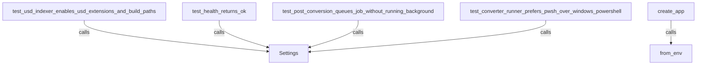

# Other — _conversion-service-app

# Other — _conversion-service-app Module Documentation

## Overview

The **_conversion-service-app** module provides the core functionality for the IFC to USDC conversion API. It is responsible for managing application settings, resolving paths, and configuring the environment for the conversion service. This module is essential for ensuring that the application can locate necessary resources and operate within the specified parameters.

## Key Components

### 1. Settings Class

The `Settings` class encapsulates the configuration for the conversion service. It uses Python's `dataclass` to define various settings attributes, which can be initialized from environment variables or default values.

#### Attributes

- `service_root`: The root directory of the service, resolved to an absolute path.
- `bim_streaming_server_root`: The path to the BIM streaming server, resolved relative to the service root.
- `work_dir`: Directory for temporary work files, resolved relative to the service root.
- `jobs_dir`: Directory for job files, resolved relative to the service root.
- `logs_dir`: Directory for log files, resolved relative to the service root.
- `fake_storage_root`: Path to a fake storage solution, resolved relative to the service root.
- `fake_storage_static_url`: URL for accessing static files in the fake storage.
- `fake_bim_control_url`: URL for the fake BIM control service.
- `conversion_timeout_seconds`: Timeout duration for conversion operations, defaulting to 900 seconds.

#### Methods

- `__post_init__()`: Automatically called after the class is initialized. It resolves all paths to absolute paths using the `_resolve_path` helper function.

- `from_env()`: A class method that creates a `Settings` instance using environment variables. This allows for flexible configuration in different environments.

### 2. Path Resolution

The `_resolve_path` function is a utility that ensures paths are correctly resolved. It checks if a given path is absolute; if not, it combines it with a base path (typically the service root) to produce an absolute path.

### 3. Environment Configuration

The `from_env` method allows the application to be configured dynamically based on the environment. This is particularly useful for deployment in different environments (development, testing, production) where paths and URLs may vary.

## Usage

To utilize the `Settings` class, you can instantiate it directly or use the `from_env` method to load settings from environment variables. Here’s an example of how to create a settings instance:

```python
from app.settings import Settings

# Load settings from environment variables
settings = Settings.from_env()

# Accessing attributes
print(settings.service_root)
print(settings.bim_streaming_server_root)
```

## Integration with Other Modules

The `Settings` class is integrated into various parts of the application, including:

- **Main Application**: The `create_app` function in `main.py` calls `Settings.from_env()` to initialize the application with the correct configuration.
- **Tests**: Several test cases in the `tests` directory utilize the `Settings` class to ensure that the application behaves correctly under different configurations.

### Call Graph



## Conclusion

The **_conversion-service-app** module is a critical component of the conversion service, providing a structured way to manage application settings and paths. By leveraging the `Settings` class and its methods, developers can ensure that the application is configured correctly for various environments, facilitating easier development and deployment.
