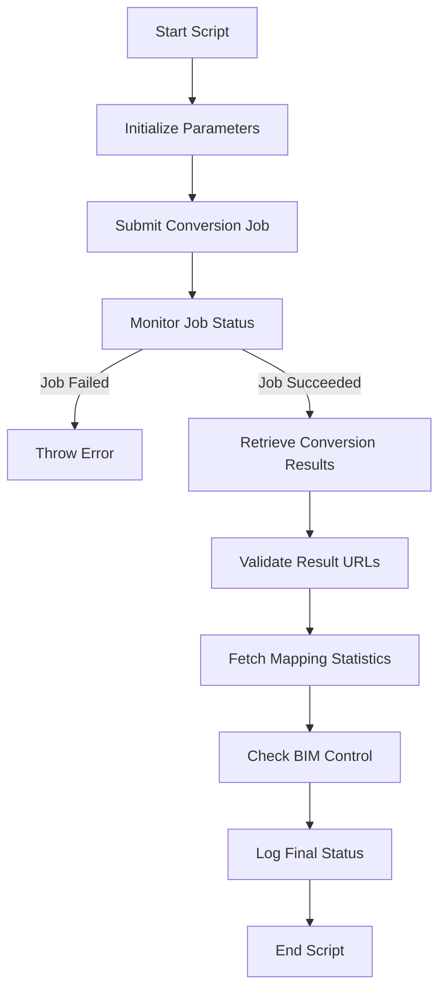

# Other — _conversion-service-scripts

# Other — _conversion-service-scripts Module Documentation

## Overview

The `_conversion-service-scripts` module provides a PowerShell script (`smoke_conversion.ps1`) designed to automate the process of converting 3D models from IFC format to USD format using a conversion service. This script is primarily used for smoke testing the conversion service, ensuring that the conversion process works as expected and that the resulting files are accessible.

## Purpose

The main purpose of the `smoke_conversion.ps1` script is to:
- Initiate a conversion job by sending a request to the conversion service.
- Monitor the status of the conversion job until it succeeds or fails.
- Validate the results of the conversion, including checking the accessibility of the generated files.
- Report the mapping statistics and ensure that the conversion results are stored correctly in the BIM control system.

## Key Components

### Parameters

The script accepts several parameters that configure its behavior:

- **ConversionServiceUrl**: The URL of the conversion service API (default: `http://127.0.0.1:8003`).
- **StorageUrl**: The URL where the source artifacts are stored (default: `http://localhost:8002/static`).
- **BimControlUrl**: The URL of the BIM control service (default: `http://localhost:8001`).
- **ProjectId**: The ID of the project being converted (default: `project_demo_001`).
- **ModelVersionId**: The version ID of the model (default: `version_demo_001`).
- **SourceArtifactId**: The ID of the source artifact (default: `artifact_ifc_demo_001`).
- **TimeoutSeconds**: The maximum time to wait for the conversion job to complete (default: `1200` seconds).
- **AllowFakeMapping**: A switch to allow fake mappings during the conversion process.

### Execution Flow

1. **Setup and Initialization**: The script begins by setting strict mode and defining error handling preferences. It constructs the source URL and the request body for the conversion job.

2. **Job Submission**: The script sends a POST request to the conversion service to initiate the conversion job. It logs the job ID for tracking.

3. **Job Monitoring**: The script enters a loop where it periodically checks the status of the conversion job:
   - If the job fails, it throws an error with the details.
   - If the job succeeds, it proceeds to the next step.

4. **Result Validation**: After a successful conversion, the script retrieves the conversion results and checks the URLs for the generated files. It ensures that these files are accessible by sending HEAD requests.

5. **Mapping Statistics**: The script retrieves mapping statistics and logs the counts of mapped and unmapped entities.

6. **Final Validation**: It checks that the conversion result matches what is stored in the BIM control system.

7. **Completion**: The script logs the final status and URLs of the conversion results.

### Mermaid Diagram

## Error Handling

The script employs strict error handling to ensure that any issues during the conversion process are reported clearly. Key error checks include:
- Job failure during monitoring.
- Empty URLs in the conversion results.
- Non-2xx HTTP responses when checking file accessibility.
- Mismatched URLs between conversion results and BIM control.

## Integration with the Codebase

The `_conversion-service-scripts` module interacts with the following components:
- **Conversion Service**: The primary service responsible for converting IFC files to USD format.
- **BIM Control Service**: Used to verify that the conversion results are correctly stored and accessible.

This module is essential for developers working on the conversion service, as it provides a means to validate the service's functionality and ensure that changes do not introduce regressions.

## Conclusion

The `_conversion-service-scripts` module is a critical tool for automating the testing of the conversion service. By following the outlined execution flow and utilizing the provided parameters, developers can effectively monitor and validate the conversion process, ensuring high-quality outputs in the 3D model conversion pipeline.
