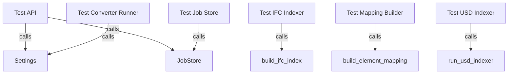

# Other — _conversion-service-tests

# Other — _conversion-service-tests Module Documentation

## Overview

The `_conversion-service-tests` module contains a suite of unit tests designed to validate the functionality of the conversion service components within the application. This module ensures that the various components of the conversion service, such as API endpoints, job management, IFC indexing, and USD indexing, work as expected. The tests leverage the FastAPI testing client and Python's built-in testing capabilities to simulate requests and validate responses.

## Purpose

The primary purpose of this module is to provide a comprehensive testing framework for the conversion service, ensuring that:

- API endpoints respond correctly to requests.
- Background jobs are queued and processed as expected.
- Data is indexed correctly from IFC files.
- Element mappings between IFC and USD formats are accurate.
- The overall health of the service can be monitored.

## Key Components

### 1. API Tests (`test_api.py`)

This file contains tests for the API endpoints of the conversion service.

- **`test_post_conversion_queues_job_without_running_background`**: Tests the `/api/conversions` endpoint to ensure that a conversion job is queued correctly without running any background processes. It verifies the response status and checks the job's initial state.

- **`test_health_returns_ok`**: Tests the `/health` endpoint to confirm that the service is operational and returns the expected status.

### 2. Converter Runner Tests (`test_converter_runner.py`)

This file tests the functionality of the converter runner, which is responsible for executing conversion scripts.

- **`test_converter_runner_prefers_pwsh_over_windows_powershell`**: Validates that the converter runner prefers PowerShell Core (`pwsh`) over the traditional Windows PowerShell when executing conversion scripts. It uses mocking to simulate the execution environment and captures the arguments passed to the subprocess.

### 3. IFC Indexer Tests (`test_ifc_indexer.py`)

This file tests the IFC indexing functionality.

- **`test_regex_fallback_indexes_rooted_ifc_entities`**: Ensures that the IFC indexer correctly processes an IFC file and extracts relevant entities, verifying the structure and content of the generated index.

### 4. Job Store Tests (`test_job_store.py`)

This file tests the job management functionality.

- **`test_job_store_writes_and_reloads_state`**: Tests the ability of the job store to create, update, and reload job states, ensuring that job information persists correctly across operations.

### 5. Mapping Builder Tests (`test_mapping_builder.py`)

This file tests the mapping between IFC and USD elements.

- **`test_guid_candidate_match_uses_metadata_guid_method`**: Validates that the mapping builder uses the correct method for matching GUIDs between IFC and USD.

- **`test_no_match_records_unmapped_entries_without_fake_mapping`**: Ensures that unmapped entries are recorded correctly when fake mapping is not allowed.

- **`test_fake_mapping_is_explicit_smoke_only`**: Tests that fake mappings are only used in designated smoke tests.

### 6. USD Indexer Tests (`test_usd_indexer.py`)

This file tests the functionality of the USD indexer.

- **`test_usd_indexer_enables_usd_extensions_and_build_paths`**: Validates that the USD indexer correctly enables necessary extensions and builds the appropriate paths for USD processing.

## Execution Flow

The tests in this module interact with various components of the conversion service, including settings management, job storage, and indexing functionalities. The following diagram illustrates the relationships between the tests and the components they interact with:



## How to Run Tests

To run the tests in this module, ensure that you have the necessary dependencies installed, including FastAPI and pytest. You can execute the tests using the following command:

```bash
pytest _conversion-service/tests/
```

## Conclusion

The `_conversion-service-tests` module is a critical part of the development process for the conversion service, providing a robust framework for validating functionality and ensuring reliability. By maintaining comprehensive tests, developers can confidently make changes and enhancements to the conversion service components, knowing that existing functionality is protected.
