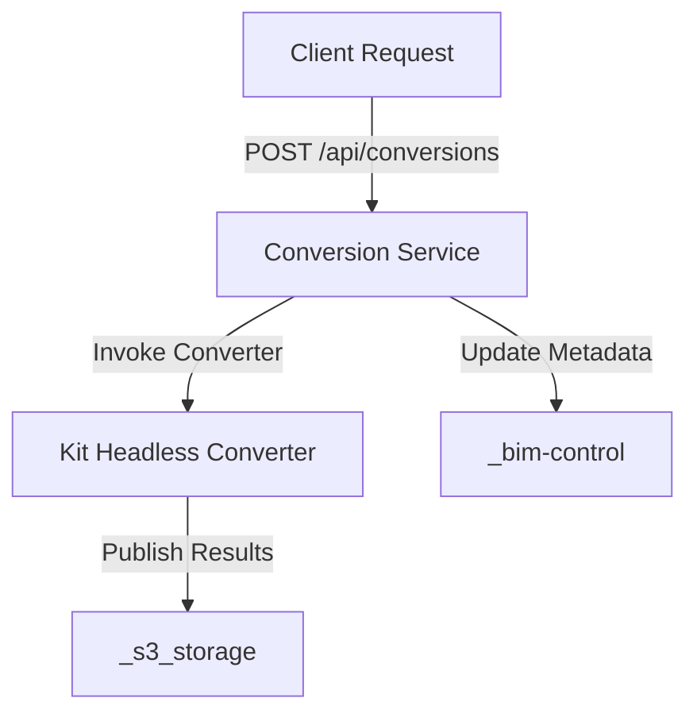

# Other — _conversion-service

# _conversion-service Module Documentation

## Overview

The **_conversion-service** module provides an API for converting IFC (Industry Foundation Classes) files to USDC (Universal Scene Description for CAD). It acts as a job manager that interfaces with the existing Kit headless converter, manages conversion requests, and publishes results to an S3 storage and a BIM control system.

## Purpose

The primary purpose of this module is to facilitate the conversion of IFC files to USDC format, enabling interoperability and enhanced usability of BIM data across different platforms. It handles incoming conversion requests, processes them, and returns the results while maintaining metadata for tracking and auditing purposes.

## Key Components

### API Endpoints

The module exposes the following API endpoints:

- **GET /health**: Checks the health status of the conversion service.
- **POST /api/conversions**: Initiates a conversion job. Requires a JSON payload with project and artifact details.
- **GET /api/conversions/{job_id}**: Retrieves the status of a specific conversion job.
- **GET /api/conversions/{job_id}/result**: Fetches the results of a completed conversion job.

### Conversion Request Structure

A typical request to initiate a conversion job includes the following fields:

```json
{
  "project_id": "project_demo_001",
  "model_version_id": "version_demo_001",
  "source_artifact_id": "artifact_ifc_demo_001",
  "source_url": "http://localhost:8002/static/projects/project_demo_001/versions/version_demo_001/source.ifc",
  "target_format": "usdc",
  "options": {
    "force": true,
    "generate_mapping": true,
    "allow_fake_mapping": false
  }
}
```

### Mapping Coverage

The mapping coverage is defined in `element_mapping.json`, which specifies the confidence levels for different mapping strategies:

- `metadata_guid`: confidence 0.95
- `metadata_revit_element_id`: confidence 0.85
- `unique_name_class_match`: confidence 0.50
- `no_match`: confidence 0.00

By default, `allow_fake_mapping` is set to `false`, ensuring that only valid mappings are considered. Fake mapping is available for smoke testing purposes.

### Failure Handling

The module includes specific error handling for conversion failures:

- **CONVERTER_PROCESS_FAILED**: Check logs at `_conversion-service/data/logs/{job_id}.log`. This often indicates that the `bim-streaming-server` was not built or that necessary converter extensions are missing.
- **USD_INDEXER_FAILED**: Also check the same log. This error typically means that the Kit is missing or that the `model.usdc` file could not be opened.
- Warnings from `_bim-control` do not cause the conversion job to fail after files are published.

## Execution Flow

The execution flow for a conversion request is as follows:

1. A client sends a POST request to `/api/conversions` with the required parameters.
2. The service processes the request, invoking the Kit headless converter located at `../bim-streaming-server/scripts/convert-ifc-to-usdc.ps1`.
3. The conversion results are published to `_s3_storage`.
4. Metadata is written back to `_bim-control` for tracking purposes.



## Setup Instructions

To run the conversion service, follow these steps:

1. Ensure that the `bim-streaming-server` is built:
   ```powershell
   cd C:\Repos\active\iot\AI-BIM-governance\bim-streaming-server
   .\repo.bat build
   ```

2. Install dependencies for each component:
   ```powershell
   cd C:\Repos\active\iot\AI-BIM-governance\_s3_storage
   python -m pip install -r requirements.txt

   cd C:\Repos\active\iot\AI-BIM-governance\_bim-control
   python -m pip install -r requirements.txt

   cd C:\Repos\active\iot\AI-BIM-governance\_conversion-service
   python -m pip install -r requirements.txt
   ```

3. Start the services:
   ```powershell
   python -m uvicorn app.main:app --host 127.0.0.1 --port 8002 --reload
   python -m uvicorn app.main:app --host 127.0.0.1 --port 8001 --reload
   python -m uvicorn app.main:app --host 127.0.0.1 --port 8003 --reload
   ```

## Smoke Testing

To verify that the conversion service is functioning correctly, run the smoke test script:

```powershell
cd C:\Repos\active\iot\AI-BIM-governance\_conversion-service
.\scripts\smoke_conversion.ps1
```

### Expected Results

The expected output from the smoke test should indicate:

- Job status = succeeded
- `result.usdc_url` is not empty
- `result.mapping_url` is not empty
- `_bim-control` returns the same `usdc_url`

## Conclusion

The **_conversion-service** module is a critical component for converting IFC files to USDC format, providing a robust API for managing conversion jobs and ensuring that BIM data is accessible and usable across different platforms. By following the setup instructions and understanding the API endpoints, developers can effectively contribute to and extend the functionality of this service.
