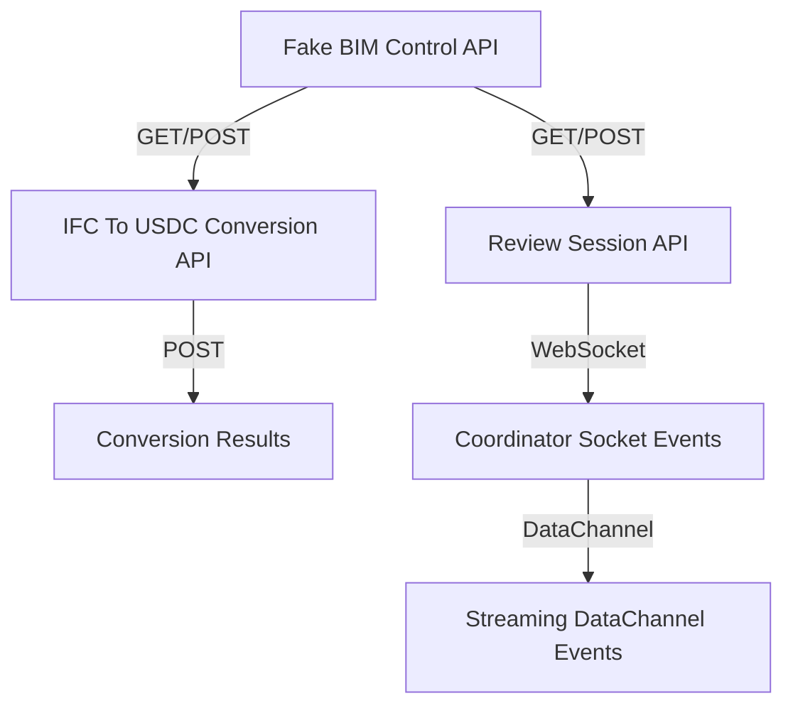

# Other — docs-contracts

# Other — docs-contracts Module

## Overview

The **docs-contracts** module provides a set of APIs and services for managing Building Information Modeling (BIM) data, facilitating conversion between IFC and USDC formats, and enabling collaborative review sessions. This module is essential for local development and testing, simulating interactions with BIM data without requiring a live backend.

## Key Components

### 1. Fake BIM Control API

**Base URL:**
`http://127.0.0.1:8001`

The Fake BIM Control API acts as a mock data authority for BIM metadata. It provides endpoints to manage projects, model versions, and review issues.

#### Endpoints

- **GET /health**: Check the health status of the service.
- **GET /api/projects**: Retrieve a list of projects.
- **GET /api/projects/{project_id}**: Get details of a specific project.
- **GET /api/projects/{project_id}/versions**: List versions of a specific project.
- **GET /api/model-versions/{model_version_id}**: Retrieve details of a specific model version.
- **GET /api/model-versions/{model_version_id}/artifacts**: List artifacts associated with a model version.
- **POST /api/model-versions/{model_version_id}/conversion-result**: Submit conversion results for a model version.
- **GET /api/model-versions/{model_version_id}/conversion-result**: Retrieve conversion results.
- **GET /api/model-versions/{model_version_id}/review-issues**: List review issues for a model version.
- **POST /api/model-versions/{model_version_id}/review-issues**: Create a new review issue.
- **GET /api/review-sessions/{session_id}/annotations**: Retrieve annotations for a review session.
- **POST /api/review-sessions/{session_id}/annotations**: Create annotations for a review session.

### 2. IFC To USDC Conversion API

**Base URL:**
`http://127.0.0.1:8003`

This API handles the conversion of IFC files to USDC format, allowing for interoperability between different BIM tools.

#### Endpoints

- **GET /health**: Check the health status of the conversion service.
- **POST /api/conversions**: Initiate a conversion job.
- **GET /api/conversions/{job_id}**: Retrieve the status of a conversion job.
- **GET /api/conversions/{job_id}/result**: Get the results of a completed conversion job.

#### Create Conversion Request Example

```json
{
  "project_id": "project_demo_001",
  "model_version_id": "version_demo_001",
  "source_artifact_id": "artifact_ifc_demo_001",
  "source_url": "http://127.0.0.1:8002/static/projects/project_demo_001/versions/version_demo_001/source.ifc",
  "target_format": "usdc",
  "options": {
    "force": true,
    "generate_mapping": true,
    "allow_fake_mapping": false
  }
}
```

### 3. Review Session API

**Base URL:**
`http://127.0.0.1:8004`

This API manages collaborative review sessions, allowing users to join, leave, and interact with BIM models in real-time.

#### Endpoints

- **GET /health**: Check the health status of the review session service.
- **POST /api/review-sessions**: Create a new review session.
- **GET /api/review-sessions/{session_id}**: Retrieve details of a specific review session.
- **POST /api/review-sessions/{session_id}/join**: Join a review session.
- **POST /api/review-sessions/{session_id}/leave**: Leave a review session.
- **GET /api/review-sessions/{session_id}/stream-config**: Get the stream configuration for a session.
- **GET /api/review-sessions/{session_id}/events**: Retrieve events for a review session.
- **POST /api/review-sessions/{session_id}/events**: Send events to a review session.

#### Create Session Request Example

```json
{
  "project_id": "project_demo_001",
  "model_version_id": "version_demo_001",
  "created_by": "dev_user_001",
  "mode": "single_kit_shared_state",
  "options": {
    "auto_allocate_kit": true
  }
}
```

### 4. Coordinator Socket Events

The coordinator manages real-time interactions between clients in a review session through WebSocket events.

#### Client to Coordinator Events

- **joinSession**: Notify the coordinator when a user joins a session.
- **leaveSession**: Notify the coordinator when a user leaves a session.
- **highlightRequest**: Request to highlight specific issues in the model.
- **selectionUpdate**: Update the selection state of the model.
- **annotationCreate**: Create a new annotation in the session.

#### Coordinator to Clients Events

- **presenceUpdated**: Notify clients of user presence changes.
- **highlightRequest**: Broadcast highlight requests to clients.
- **selectionUpdate**: Update clients on selection changes.
- **annotationCreated**: Notify clients of newly created annotations.

### 5. Streaming DataChannel Events

These events facilitate communication between the web viewer and the streaming server, enabling real-time updates and interactions.

#### Key Events

- **openStageRequest**: Request to open a specific model stage.
- **highlightPrimsRequest**: Request to highlight specific primitives in the model.

## Local Development Setup

To run the services locally, follow these steps:

1. **Fake Storage**:
   ```powershell
   cd _s3_storage
   python -m uvicorn app.main:app --host 127.0.0.1 --port 8002 --reload
   ```

2. **Fake BIM Control**:
   ```powershell
   cd _bim-control
   python -m uvicorn app.main:app --host 127.0.0.1 --port 8001 --reload
   ```

3. **Conversion Service**:
   ```powershell
   cd _conversion-service
   python -m uvicorn app.main:app --host 127.0.0.1 --port 8003 --reload
   ```

4. **Review Coordinator**:
   ```powershell
   cd bim-review-coordinator
   npm install
   npm run dev
   ```

5. **Streaming Server**:
   ```powershell
   cd bim-streaming-server
   .\repo.bat launch -n ezplus.bim_review_stream_streaming.kit -- --no-window
   ```

6. **Web Viewer**:
   ```powershell
   cd web-viewer-sample
   npm install
   npm run dev
   ```

Open the web viewer at:
`http://127.0.0.1:5173`

## Smoke Checks

Run the following scripts to verify the setup:

```powershell
.\scripts\dev-health-check.ps1
.\scripts\smoke-review-session.ps1
.\_conversion-service\scripts\smoke_conversion.ps1
```

## Architecture Overview



This diagram illustrates the interactions between the various components of the **docs-contracts** module, highlighting how they communicate and depend on each other to facilitate BIM data management and review processes.
